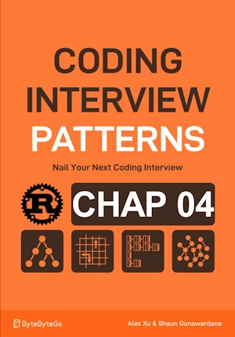

# Happy Number

<div align="center">

</div>

* Given an integer determine if it is a happy number
    * happy : when repeatedly summing the squares of its digits and summing eventually lead to 1
    * unhappy : never reach 1 (the process gets stuck in a loop)
* Examples: 23 is happy, 116 is unhappy

<span style="color:orange"><b>The point:</b></span>
*  Similar to detecting a loop **BUT** we don't have the linked list (see 04_fast_slow_pointers\73_linked_list_loop.ipynb)
* Use 2 ptrs : One fast and one slow
* Fast move 2 numbers at a time while slow move one number at a time 
    *``fast = get_next(get_next(fast))``
    *``slow = get_next(slow)``
* If they meet => cycle = unhappy
* If we reach 1 => happy


**Complexity :**

| Time | Space |
|------|-------|
| O(n) | O(1)  |

* O(n) because we traverse the list
* O(1) in space because no growing datastructure are created


**About Rust :**
* See ``black_box`` in the for loop
* Yes I know, I should use some sort of cache in the for loop but I just wanted to make a quick test
* **YES** : tested on the [Rust Playground](https://play.rust-lang.org/)


<!-- <span style="color:red"><b>TODO : </b></span> 
* Add comments in the source code        
 -->


<!-- * <span style="color:lime"><b>Preferred solution?</b></span>      -->


```rust
use std::time::Instant;
use std::hint::black_box;

fn get_next_number(mut x:u32)->u32{
    let mut next_num : u32 = 0;
    while x > 0{
        let digit = x % 10;
        x /= 10;
        next_num += digit.pow(2); // add the square of the digit to the next number
    }
    next_num
}

fn happy_number(n:u32)->bool{
    let mut slow = n;
    let mut fast = n;
    loop {
        slow = get_next_number(slow);
        fast = get_next_number(get_next_number(fast));

        if fast == 1 {
            return true;
        }

        if slow == fast {
            return false;
        }
    }
}

// fn main(){     // no main() if this code runs in a Jupyter cell 
    
    println!("{}", happy_number(116)); // false
    println!("{}", happy_number(23));  // true
    
    const K_MAX: u32 = 1_000_000;
    let start = Instant::now();
    for i in 1..K_MAX+1{ // from 1 to k_Max included. Avoid 0
        // happy_number(i);
        black_box(happy_number(i)); // Prevents the optimized compiler from simply not calling the function if its result is not used
    }
    let duration = start.elapsed();
    println!("Execution time: {} ms", duration.as_millis());
    
// } // end of local scope OR end of main()       

```

    false
    true
    Execution time: 79 ms

