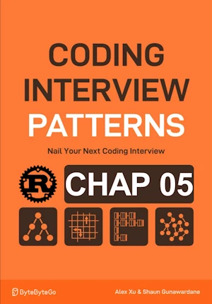

# Substring Anagrams

<div align="center">

</div>

* Given 2 strings of lowercase English letters `s` and `t`, return the number of substrings in s that are anagrams of t

<span style="color:orange"><b>The point:</b></span>
* Working with ASCII only
* In anagrams order of char does'nt matter
* Only the freq of each letter does

**Complexity :**

| Time | Space |
|------|-------|
| O(n) | O(1)  |

The comparaison between the 2 freq arrays takes O(1) because they contain 26 elements (?????)

**About Rust :**
* **YES** : tested on the [Rust Playground](https://play.rust-lang.org/)


<!-- <span style="color:red"><b>TODO : </b></span> 
* Add comments in the source code        
 -->

<!-- * <span style="color:lime"><b>Preferred solution?</b></span>      -->


```rust
pub fn substring_anagrams(s: &str, t: &str) -> i32 {
    let mut count = 0;
    
    let(len_s, len_t) = (s.len(), t.len()); // len works as expected if ASCII
    if len_t <= len_s {
        let (mut expected_freqs, mut window_freqs) = ([0; 26], [0; 26]);
        
        for c in t.bytes() {
            expected_freqs[(c - b'a') as usize] += 1;
        }

        let s_bytes = s.as_bytes(); // cheap operation, this is just a view of s as u8. 
                                    // no shadowing of "s" (let s = s.as_bytes()) because I want to be explicit
        let mut left = 0;
        for right in 0..len_s {
            // add the char at the right pointer to the window_freqs BEFORE sliding the window
            let right_char = s_bytes[right];
            window_freqs[(right_char - b'a') as usize] += 1;
            
            // if the window size is equal to the length of t, we can start comparing the window_freqs with expected_freqs
            if right - left + 1 == len_t {
                if window_freqs == expected_freqs {
                    count += 1;
                }
                // Remove the char at the left pointer from the window_freqs BEFORE sliding the window    
                let left_char = s_bytes[left];
                window_freqs[(left_char - b'a') as usize] -= 1;
                left += 1;
            }
        }
    } 
    count
}


// fn main(){     // no main() if this code runs in a Jupyter cell 
    println!("{}", substring_anagrams("caabab", "aba"));
// } // end of local scope OR end of main()       

```

    2


## Like in the book (p88)

**About Rust :**
* Use a `while` loop 
* ``if`` expression and returns 0 upfront
* **YES** : tested on the [Rust Playground](https://play.rust-lang.org/)


```rust
pub fn substring_anagrams(s: &str, t: &str) -> i32 {
    let(len_s, len_t) = (s.len(), t.len()); // len works as expected if ASCII
    if len_t > len_s {
        return 0;
    }
    
    let mut count = 0;
    let (mut expected_freqs, mut window_freqs) = ([0; 26], [0; 26]);

    for c in t.bytes() {
        expected_freqs[(c - b'a') as usize] += 1;
    }

    let s_bytes = s.as_bytes();
    let (mut left, mut right) = (0, 0);
    while right < len_s {
        // add the char at the right pointer to the window_freqs BEFORE sliding the window
        let right_char = s_bytes[right];
        window_freqs[(right_char - b'a') as usize] += 1;
        
        // if the window size is equal to the length of t, we can start comparing the window_freqs with expected_freqs
        if right - left + 1 == len_t {
            if window_freqs == expected_freqs {
                count += 1;
            }
            // Remove the char at the left pointer from the window_freqs BEFORE sliding the window    
            let left_char = s_bytes[left];
            window_freqs[(left_char - b'a') as usize] -= 1;
            left += 1;
        }
        right+=1;
    }
    count
}


// fn main(){     // no main() if this code runs in a Jupyter cell 
    println!("{}", substring_anagrams("caabab", "aba"));
// } // end of local scope OR end of main()       

```

    2

