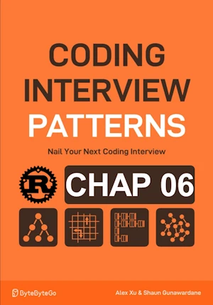

# Weighted Random Selection

<div align="center">

</div>

* Given an array of items, each with a corresponding weight
* Implement a function that randomly selects an item from the array, where the probability of selecting any item is proportional to its weight.
    * => the probability of picking the item at index i is weights[i] / sum(weights)
* Return the index of the selected item


<span style="color:orange"><b>The point:</b></span>

* Store only the end points (n values) of each segment p60
* the endpoint of a segment is equal to the length of all previous segments, plus the length of the current segment
* see prefix_sums[]

**Checklist**

* **1 - Sorted Search space**
    * [0, n-1]
* **2 - Narrow search space**
    * p 62
    * we’re looking for the lower-bound prefix sum which satisfies the condition prefix_sums[mid] ≥ target
* **3 - Choose an exit condition for the while loop**
    * while left < right
* **4 - Return the correct value**
    * left


**Complexity :**

| Time             | Space |
|------------------|-------|
| O(n) constructor |       |
| O(log(n)) select | O(1)  |

* 0(n) because iteration over each weight
* O(log(n)) because the search space is of size n
* O(1) because in place


**About Rust :**
* **YES** : tested on the [Rust Playground](https://play.rust-lang.org/)

<!-- <span style="color:red"><b>TODO : </b></span> 
* Add comments in the source code        
 -->


<!-- * <span style="color:lime"><b>Preferred solution?</b></span>      -->


```rust
// # Cargo.toml
// [dependencies]
// rand = "0.9.1"

// If in a Jupyter cell
// :dep rand = "0.9.1"

// No reference to rand needed in Rust playground

use rand::Rng;

struct WeightedRandomSelection {
    prefix_sums: Vec<i32>,
}

impl WeightedRandomSelection {
    fn new(weights: Vec<i32>) -> Self {
        let mut prefix_sums = Vec::with_capacity(weights.len());
        prefix_sums.push(weights[0]);
        for i in 1..weights.len() {
            prefix_sums.push(prefix_sums[i - 1] + weights[i]);
        }
        Self { prefix_sums }
    }

    fn select(&self) -> usize {
        let mut rng = rand::rng();
        // Pick a random target between 1 and the largest possible endpoint.
        // let target = rng.random_range(1..=self.prefix_sums.last().unwrap().clone());
        let target = rng.random_range(1..=*self.prefix_sums.last().unwrap());   // dereferencing avoid cloning
        
        let (mut left, mut right) = (0, self.prefix_sums.len() - 1);
        // Perform lower-bound binary search to find which endpoint corresponds to the target.
        while left < right {
            let mid = (left + right) / 2;
            if self.prefix_sums[mid] < target {
                left = mid + 1;
            } else {
                right = mid;
            }
        }
        left
    }
}

fn main(){     // no main() if this code runs in a Jupyter cell 
    let wrs = WeightedRandomSelection::new(vec![3, 1, 2, 4]);
    let mut count = 0;
    for _ in 0..1_000 {
        if wrs.select() == 0 {
            count += 1;
        }
    }
    println!("{}", count); // Around 300 expected 300 (30% of 1_000)
}
```

    261

