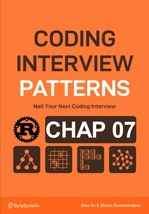

# Next Largest Number to the Right

<div align="center">

</div>

* Given an array of int `nums`
* Return an output array `res` where ``res[i]`` is the first number larger than ``nums[i]`` that can be found to the right in ``nums``
* If no larger number exists to the right => -1

<span style="color:orange"><b>The point:</b></span>

* Start on the right
* Check if the value is the next largest number for any value(s) to its left


**Complexity :**

| Time | Space |
|------|-------|
| O(n) | O(n)  |

* O(n) because each values from ``nums`` is push/pop once
* O(n) because the stack can store up to ``n`` values 

**About Rust :**
* `for i in (0..nums.len()).rev()`
* `*stack.last().unwrap()`
* `stack.is_empty()`
* **YES** : tested on the [Rust Playground](https://play.rust-lang.org/)

<!-- 
<span style="color:red"><b>TODO : </b></span> 
* Add comments in the source code        
 -->

<!-- * <span style="color:lime"><b>Preferred solution?</b></span>      -->


```rust
fn next_largest_number_to_the_right(nums: &[i32]) -> Vec<i32> {
    let mut res = vec![0; nums.len()];
    let mut stack = Vec::new();
    
    // start from the right
    for i in (0..nums.len()).rev() {
        // remove values smaller (equal) to current value
        while !stack.is_empty() && *stack.last().unwrap() <= nums[i] { // .last() returns Option<&T>
             stack.pop();
        }
        
        // record current value's next largest number or -1 if the stack is empty
        res[i] = if !stack.is_empty() {
            *stack.last().unwrap()
        } else {
            -1
        };
        
        stack.push(nums[i]);
    }
    
    res
}

fn main(){     // no main() if this code runs in a Jupyter cell 
    println!("{:?}", next_largest_number_to_the_right(&[5, 2, 4, 6, 1]));
    println!("{:?}", next_largest_number_to_the_right(&vec![5, 2, 4, 6, 1]));
    println!("{:?}", next_largest_number_to_the_right(&[]));
} // end of local scope OR end of main()       

```
