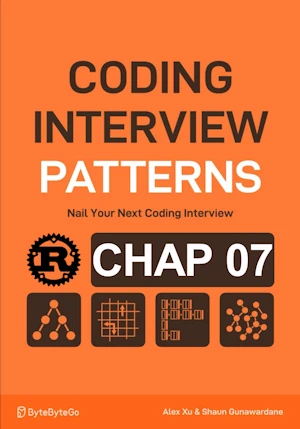

# Evaluate Expression

<div align="center">

</div>

* Given a string representing expression
* Evaluate & return the value
* May contain int, parentheses, addition and substraction

<span style="color:orange"><b>The point:</b></span>

* Treat all expressions as ones of pure addition


**Complexity :**

| Time | Space |
|------|-------|
| O(n) | O(n)  |

* O(n) because read each char once, process nested expressiond with stack and push/pop are 0(1)
* O(n) because the stack can store up to ``n`` chars of the expression 

**About Rust :**
* ``stack.pop()`` returns an ``Option<i32>``
* **YES** : tested on the [Rust Playground](https://play.rust-lang.org/)

<!-- 
<span style="color:red"><b>TODO : </b></span> 
* Add comments in the source code        
 -->

<!-- * <span style="color:lime"><b>Preferred solution?</b></span>      -->


```rust
fn evaluate_expression(s: &str) -> i32 {
    let mut stack = Vec::new();
    let (mut curr_num, mut sign, mut res) = (0, 1, 0);
    for c in s.chars(){
        // if c.is_digit(10){
        if c.is_ascii_digit(){
            curr_num = curr_num * 10 + c.to_digit(10).unwrap() as i32;
        }else if c == '+' || c == '-'{ // Current char is an op
            // Update current value of res 
            res += curr_num * sign;
            // reset 'curr_num' & update the sign
            curr_num = 0;
            sign = match c{
                '-' => -1,
                 _ => 1
            };
        } else if c == '('{ // Current character is an opening parenthesis
            // Save current 'res' and 'sign' on stack 
            // reset their values to calculate the nested expression.
            stack.push(res);
            stack.push(sign);
            res = 0;
            sign = 1;
        }else if c == ')'{ // Current character is a closing parenthesis
            // Update current value of res
            res += sign * curr_num;
            // Multiply with sign before parenthesis
            res *= stack.pop().expect("Missing sign"); // pop returns Option<i32>
            // Add result before parenthesis
            res += stack.pop().expect("Missing previous result");
            curr_num = 0;
        }
    }
    // Update value of the expression
    res + curr_num * sign
}

fn main(){     // no main() if this code runs in a Jupyter cell 
    println!("{:?}", evaluate_expression("18-(7+(2-4))")); // 13
    println!("{:?}", evaluate_expression("")); // 0
} // end of local scope OR end of main()       

```
