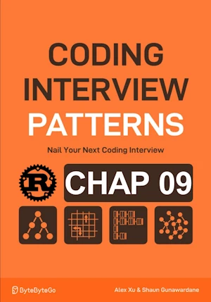

# Merge Overlapping Intervals

<div align="center">

</div>

* Merge an array of intervals so there are no overlapping intervals


<span style="color:orange"><b>The point:</b></span>


**Complexity :**

| Time               | Space |
|--------------------|-------|
| O(n log(n))        | O(n)  |

* O(n log(n)) because of the sorting alogrithm. Merging is in O(n) because we iterate over n intervals
* O(n) because of space used by sort algorithm. Merged interval is NOT taken into account. Only extra space matters. 

**About Rust :**
* `intervals.sort_by(|a, b| a.start.cmp(&b.start));`
* **YES** : tested on the [Rust Playground](https://play.rust-lang.org/)

<!-- 
<span style="color:red"><b>TODO : </b></span> 
* Add comments in the source code        
 -->

<!-- * <span style="color:lime"><b>Preferred solution?</b></span>      -->


## First version
* `input` is moved and no longer available after the call to `merge_overlapping_intervals()`
* This might be OK in some cases


```rust
#[derive(Debug, Clone)]  // Clone needed to copy intervals
struct Interval {
    start : usize,
    end : usize
}

impl Interval {
    fn new(start:usize, end:usize) -> Self {
        Self { start, end }
    }
}

fn merge_overlapping_intervals(mut intervals:Vec<Interval>) -> Vec<Interval>{

    if intervals.is_empty() {
        return vec![];
    }

    intervals.sort_by(|a, b| a.start.cmp(&b.start)); // .sort() => intervals parameter must be mut
    
    let mut merged = vec![intervals[0].clone()]; // create a vector and fill it with first element of sorted_intervals
        
    for b in &intervals[1..] {
        let a = merged.last_mut().unwrap();
        if a.end < b.start {
            merged.push(b.clone()); // No overlap, add b to merged vector
        } else {
            a.end = a.end.max(b.end); // Overlap, merge a and b
        }
    }
    merged
}

fn main(){   // no main() if this code runs in a Jupyter cell 
    let input = vec![
        Interval::new(3, 4),
        Interval::new(7, 8),
        Interval::new(2, 5),
        Interval::new(6, 7),
        Interval::new(1, 4),
    ];
    println!("{:?}", merge_overlapping_intervals(input)); // [Interval { start: 1, end: 5 }, Interval { start: 6, end: 8 }]
} // end of local scope OR end of main()       
```

## If I want to use a reference to a vector of Interval as parameter
* A copy, which must be mutable, must be done in `merge_overlapping_intervals()` order to ``.sort()``


```rust
#[derive(Debug, Clone)]  // Clone needed to copy intervals
struct Interval {
    start: usize,
    end: usize,
}

impl Interval {
    fn new(start: usize, end: usize) -> Self {
        Self { start, end }
    }
}

fn merge_overlapping_intervals(intervals: &Vec<Interval>) -> Vec<Interval> {
    
    if intervals.is_empty() {
        return vec![];
    }

    // Clone the input to sort it locally
    let mut sorted_intervals = intervals.clone();
    sorted_intervals.sort_by(|a, b| a.start.cmp(&b.start));

    let mut merged = vec![sorted_intervals[0].clone()]; // create a vector and fill it with first element of sorted_intervals

    for b in &sorted_intervals[1..] {
        let a = merged.last_mut().unwrap();
        if a.end < b.start {
            merged.push(b.clone());
        } else {
            a.end = a.end.max(b.end);
        }
    }
    merged
}

fn main() {
    let input = vec![
        Interval::new(3, 4),
        Interval::new(7, 8),
        Interval::new(2, 5),
        Interval::new(6, 7),
        Interval::new(1, 4),
    ];
    println!("{:?}", merge_overlapping_intervals(&input)); // [Interval { start: 1, end: 5 }, Interval { start: 6, end: 8 }]

}

```

## If I want to use a slice as parameter

* <span style="color:lime"><b>Preferred solution?</b></span> 
* This type accepts any slice: a ``&Vec<Interval>``, an array ``[Interval; N]``, a slice ``&intervals[..]``, and so on.
* It's more generic and idiomatic than previous version
* `sorted_intervals` is a vector (`let mut sorted_intervals: Vec<_> = intervals.to_vec();`)
    * This simplify the for loop : `for b in &sorted_intervals[1..] {`


```rust
#[derive(Debug, Clone)]
struct Interval {
    start: usize,
    end: usize,
}

impl Interval {
    fn new(start: usize, end: usize) -> Self {
        Self { start, end }
    }
}

fn merge_overlapping_intervals(intervals: &[Interval]) -> Vec<Interval> {
    
    if intervals.is_empty() {
        return vec![];
    }

    // Create a sorted copy of the input slice
    let mut sorted_intervals: Vec<_> = intervals.to_vec(); // We make a single copy of the entire vector at this point. No need to reclone intervals elsewhere."
    sorted_intervals.sort_by(|a, b| a.start.cmp(&b.start));

    let mut merged = vec![sorted_intervals[0].clone()]; // create a vector and fill it with first element of sorted_intervals

    for b in &sorted_intervals[1..] {
        let a = merged.last_mut().unwrap();
        if a.end < b.start {
            merged.push(b.clone());
        } else {
            a.end = a.end.max(b.end);
        }
    }
    merged
}

fn main() {
    let input = vec![
        Interval::new(3, 4),
        Interval::new(7, 8),
        Interval::new(2, 5),
        Interval::new(6, 7),
        Interval::new(1, 4),
    ];

    println!("{:?}", merge_overlapping_intervals(&input)); // [Interval { start: 1, end: 5 }, Interval { start: 6, end: 8 }]
}

```
