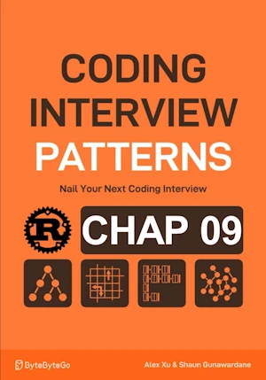

# Identify All Interval Overlaps

<div align="center">

</div>

* Return an vector of all overlaps between 2 arrays of intervals


<span style="color:orange"><b>The point:</b></span>

* ``a`` starts before `b`
* from b.start to min (a.end, b.end)
* Pay attention to the ``if a.end >= b.start{`` otherwise [9, 9] is not listed

**Complexity :**

| Time               | Space |
|--------------------|-------|
| O(n+m)        | O(n)  |

* O(n+m) because we traverse each intervals once
* O(1) because in place 

**About Rust :**
* `identify_all_interval_overlaps` has references as parameters
* **YES** : tested on the [Rust Playground](https://play.rust-lang.org/)

<!-- 
<span style="color:red"><b>TODO : </b></span> 
* Add comments in the source code        
 -->


<!-- * <span style="color:lime"><b>Preferred solution?</b></span>      -->


```rust
#[derive(Debug)]  
struct Interval {
    start : usize,
    end : usize
}

impl Interval {
    fn new(start:usize, end:usize) -> Self {
        Self {start, end}
    }
}

fn identify_all_interval_overlaps(intervals1:&[Interval], intervals2:&[Interval]) -> Vec<Interval>{
    let mut overlaps = Vec::new();
    let (mut i, mut j) = (0, 0);

    while i < intervals1.len() && j < intervals2.len(){
        let mut a = &intervals1[i];
        let mut b = &intervals2[j];
        
        // set a to the interval that starts first
        if a.start > b.start{
            a = &intervals2[j];
            b = &intervals1[i];
        }
        // If there is an overlap add them
        if a.end >= b.start{
            overlaps.push(Interval::new(b.start, a.end.min(b.end)));
        }
        // advance pointers to the interval that ends first
        if a.end < b.end{
            i+=1;
        }else{
            j+=1;
        }
    } 
    overlaps
}

fn main(){   // no main() if this code runs in a Jupyter cell 
    let intervals1 = vec![
        Interval::new(1, 4),
        Interval::new(5, 6),
        Interval::new(9, 10),
    ];

    let intervals2 = vec![
        Interval::new(2, 7),
        Interval::new(8, 9),
    ];

    println!("{:?}", identify_all_interval_overlaps(&intervals1, &intervals2)); // [2, 4], [5, 6] [9, 9]
} // end of local scope OR end of main()       
```
