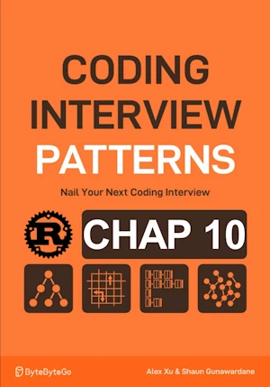

# Product Array Without Current Element

<div align="center">

</div>

* Given an array of i32 return an array so that result[i] is equal to the product of all the elements except nums[i] itself

**Example :**
- In = [2, 3, 1, 4, 5]
- Out = [60, 40, 120, 30, 24]

<span style="color:orange"><b>The point:</b></span>

* ...

**Complexity :**

| Time        | Space |
|-------------|-------|
| O(n)        | O(1)  |

* O(n) because we iterate over the input array twice 
* O(1) because the output array is NOT included in space complexity analysis


**About Rust :**
* `for i in (0..n).rev(){`
* **YES** : tested on the [Rust Playground](https://play.rust-lang.org/)

<!-- 
<span style="color:red"><b>TODO : </b></span> 
* Add comments in the source code        
 -->

<!-- * <span style="color:lime"><b>Preferred solution?</b></span>      -->


```rust
fn product_array_without_current_element(nums : &[i32]) -> Vec<i32>{
    let n = nums.len();
    let mut res = vec![1; n];
    // populate the output with the running left product
    for i in 1..n {
        res[i] = res[i-1] * nums[i-1];
    }

    // multiply the output with running right product
    let mut right_product = 1;
    for i in (0..n).rev(){
        res[i] *= right_product;
        right_product *=nums[i];
    }
    res
}

fn main(){   // no main() if this code runs in a Jupyter cell 
    println!("{:?}", product_array_without_current_element(&[2, 3, 1, 4, 5])); // [60, 40, 120, 30, 24]
    println!("{:?}", product_array_without_current_element(&[42])); // [1]
    println!("{:?}", product_array_without_current_element(&[])); // []
    // println!("{:?}", product_array_without_current_element(&[i32::MAX, 2])); // panic
} // end of local scope OR end of main()       
```

## V2

* Manage overflow during multiplications
    * Returns ``None`` if overflow
* => Now `product_array_without_current_element` returns ``Option<T>``


**About Rust :**
* `result = my_value.checked_mul(your_value)?;`
    * watch the `?`
    * the function returns ``Option<T>``
* `.checked_mul()` force us to specify type of `res` and `right_product`
* <span style="color:lime"><b>Preferred solution?</b></span> 
* **YES** : tested on the [Rust Playground](https://play.rust-lang.org/)


```rust
fn product_array_without_current_element(nums: &[i32]) -> Option<Vec<i32>> {
    let n = nums.len();
    let mut res : Vec<i32> = vec![1; n];
    
    // Left pass
    for i in 1..n {
        res[i] = res[i - 1].checked_mul(nums[i - 1])?;
    }

    // Right pass
    let mut right_product:i32 = 1;
    for i in (0..n).rev() {
        res[i] = res[i].checked_mul(right_product)?;
        right_product = right_product.checked_mul(nums[i])?;
    }
    Some(res)
}

fn main(){   // no main() if this code runs in a Jupyter cell 
    println!("{:?}", product_array_without_current_element(&[2, 3, 1, 4, 5])); // [60, 40, 120, 30, 24]
    println!("{:?}", product_array_without_current_element(&[42])); // [1]
    println!("{:?}", product_array_without_current_element(&[])); // []
    println!("{:?}", product_array_without_current_element(&[i32::MAX, 2])); // None (overflow)
} // end of local scope OR end of main()       
```
