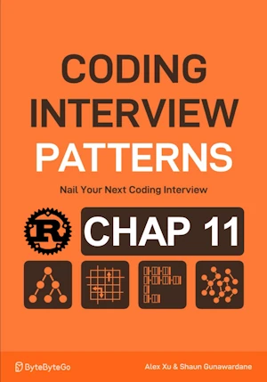

# Lowest Common Ancestor

<div align="center">

</div>

* Return the lowest common ancestor (LCA) of 2 nodes
* A node can be considered as ancestor of itself

We know
* at least 2 nodes in the tree
* all node values are unique
* p & q are different nodes

<span style="color:orange"><b>The point:</b></span>

* DFS
* 2 of the conditions must be met
    * node is p or q
    * left subtree of node contains p or q
    * right subtree of node contains p or q
* dfs returns true if any of the 3 conditions is true


**Complexity :**

| Time        | Space |
|-------------|-------|
| O(n)        | O(n)  |

* O(n) in time because we traverse each node exactly once
* O(n) in space because of the size of the recursive stack which is the height of the tree (``n`` at its max.) 


<!-- <span style="color:red"><b>TODO : </b></span> 
* Rust : come back on `.as_mut()`, `.as_deref()`         -->


<!-- * <span style="color:lime"><b>Preferred solution?</b></span>      -->


## V1

**About Rust :**
* I really did'nt like the global LCA value (=>unsafe code in Rust) so I get ride of it upfront
* Based on V2 (see ``189_intro.ipynb``) for easy tree building
* **YES** : tested on the [Rust Playground](https://play.rust-lang.org/)


## V1 before compiler
* DOES'NOT COMPILE


```rust
type Link = Option<Box<TreeNode>>;

struct TreeNode {
    value: i32,
    left: Link,
    right: Link,
}

impl TreeNode {
    fn new(value: i32) -> Self {
        TreeNode {
            value,
            left: None,
            right: None,
        }
    }

    // Add child on the left
    fn left(mut self, node: TreeNode) -> Self {
        self.left = Some(Box::new(node));
        self
    }

    // Add child on the right
    fn right(mut self, node: TreeNode) -> Self {
        self.right = Some(Box::new(node));
        self
    }
}

fn preorder_print(link: &Link) {
    if let Some(node) = link {
        print!("{} ", node.value);      // Process current node
        preorder_print(&node.left);     // Traverse left child
        preorder_print(&node.right);    // Traverse right child
    }
}

fn dfs2(link: &Link, p: &TreeNode, q: &TreeNode, lca: &mut Option<&TreeNode>)-> bool {
    
    if let Some(node) = link {
        let node_is_p_or_q = node == p || node == q;
        // recursively determine the left and right subtrees contains p or q
        let left_contains_p_or_q = dfs2(&node.left, p, q, lca);
        let right_contains_p_or_q = dfs2(&node.right, p, q, lca);
        
        
        // if both above are true, current node is lca
        if (node_is_p_or_q as u8) + (left_contains_p_or_q as u8) + (right_contains_p_or_q as u8)==2{
            *lca = Some(node);
        }
        node_is_p_or_q || left_contains_p_or_q || right_contains_p_or_q
    }else{
        false
    }
}

fn lowest_common_ancestor(root_link: &Link, p: &TreeNode, q: &TreeNode)-> Option<&TreeNode>{
    
    let mut lca: Option<&TreeNode> = None;
    dfs2(root_link, p, q, &mut lca);
    lca
}

fn main() { // no main() if this code runs in a Jupyter cell 
// Build the tree:
    //         1
    //      /     \
    //     2       3
    //    / \     / \
    //   4   5   6   7
    //          / \
    //         8   9

    let node8 = TreeNode::new(8);
    let node7 = TreeNode::new(7);

    let left_subtree = TreeNode::new(2)
        .left(
            TreeNode::new(4)
        )
        .right(
            TreeNode::new(5)
        );

    let right_subtree = TreeNode::new(3)
        .left(
            TreeNode::new(6)
                .left(
                    node8
                )
                .right(
                    TreeNode::new(9)
                )
        )
        .right(
            node7
        );

    let tree = TreeNode::new(1)
        .left(
            left_subtree
        )
        .right(
            right_subtree
        );

    let root_link = Some(Box::new(tree));
    preorder_print(&root_link); // 1 2 4 5 3 6 8 9 7  

    let lca = lowest_common_ancestor(&root_link, &node8, &node7);
    if let Some(node) = lca {
        println!("Lowest Common Ancestor: {}", node.value); // 
    } else {
        println!("No common ancestor found.");
    }
} // end of local scope OR end of main()
```

## V1 with the help of the compiler
* This first version compares the values of the nodes NOT the addresses of the nodes (like in the book)

**About Rust :**
* Search for Issue 1..5 and read the comments 
* **YES** : tested on the [Rust Playground](https://play.rust-lang.org/)


```rust
type Link = Option<Box<TreeNode>>;

// Issue 2 => add #[derive(Clone)]
#[derive(Clone)]
struct TreeNode {
    value: i32,
    left: Link,
    right: Link,
}

impl TreeNode {
    fn new(value: i32) -> Self {
        TreeNode {
            value,
            left: None,
            right: None,
        }
    }

    // Add child on the left
    fn left(mut self, node: TreeNode) -> Self {
        self.left = Some(Box::new(node));
        self
    }

    // Add child on the right
    fn right(mut self, node: TreeNode) -> Self {
        self.right = Some(Box::new(node));
        self
    }
}

fn preorder_print(link: &Link) {
    if let Some(node) = link {
        print!("{} ", node.value);      // Process current node
        preorder_print(&node.left);     // Traverse left child
        preorder_print(&node.right);    // Traverse right child
    }
}

// Issue 4
// Lifetime issue
// fn dfs2(link: &Link, p: &TreeNode, q: &TreeNode, lca: &mut Option<&TreeNode>)-> bool {
fn dfs2<'a>(link: &'a Link, p: &TreeNode, q: &TreeNode, lca: &mut Option<&'a TreeNode>) -> bool {    
    if let Some(node) = link {
        //let node_is_p_or_q = node == p || node == q;
        // Issue 3
        // Above, node is of type &Box<TreeNode> and p is of type &TreeNode
        // NOTE : Now I compare value of the node not the memory adr 
        let node_ref: &TreeNode = node.as_ref();
        let node_is_p_or_q = node_ref.value == p.value || node_ref.value == q.value;
        
        // recursively determine the left and right subtrees contains p or q
        let left_contains_p_or_q = dfs2(&node.left, p, q, lca);
        let right_contains_p_or_q = dfs2(&node.right, p, q, lca);
        
        
        // if both above are true, current node is lca
        if (node_is_p_or_q as u8) + (left_contains_p_or_q as u8) + (right_contains_p_or_q as u8) == 2{ // == because we know q!= p (case where sum could be 3)
            *lca = Some(node);
        }
        node_is_p_or_q || left_contains_p_or_q || right_contains_p_or_q
    }else{
        false
    }
}

// fn lowest_common_ancestor(root_link: &Link, p: &TreeNode, q: &TreeNode)-> Option<&TreeNode>{
// Issue 1
// help: this function's return type contains a borrowed value, but the signature does not say whether it is borrowed from `root_link`, `p`, or `q`
// help: consider introducing a named lifetime parameter
// Proposal = fn lowest_common_ancestor<'a>(root_link: &'a Link, p: &'a TreeNode, q: &'a TreeNode)-> Option<&'a TreeNode>{    
// In fact we need to provide lifetime information mostly about the returned value  
fn lowest_common_ancestor<'a>(root_link: &'a Link, p: &TreeNode, q: &TreeNode)-> Option<&'a TreeNode>{    
    let mut lca: Option<&TreeNode> = None;
    dfs2(root_link, p, q, &mut lca);
    lca
}

fn main() { // no main() if this code runs in a Jupyter cell 
    // Build the tree:
    //         1
    //      /     \
    //     2       3
    //    / \     / \
    //   4   5   6   7
    //          / \
    //         8   9

    let node8 = TreeNode::new(8);
    let node7 = TreeNode::new(7);

    let left_subtree = TreeNode::new(2)
        .left(
            TreeNode::new(4)
        )
        .right(
            TreeNode::new(5)
    );

    let right_subtree = TreeNode::new(3)
        .left(
            TreeNode::new(6)
            //.left(node8)
            // Issue 2 => clone
            .left(
                node8.clone()
            )
            .right(
                TreeNode::new(9)
            )
        )
        //.right(node7);
        // Issue 2 => clone
        .right(
            node7.clone()
        );
        
    let tree = TreeNode::new(1)
        .left(
            left_subtree
        )
        .right(
            right_subtree
        );

    let root_link = Some(Box::new(tree));
    preorder_print(&root_link); // 1 2 4 5 3 6 8 9 7  
    
    // Issue 2
    // Problem with the borrow checker with node8 and node7
    // First idea cloning => #[derive(Clone)] and using .clone() while building the tree
    let lca = lowest_common_ancestor(&root_link, &node8, &node7);
    if let Some(node) = lca {
        // Issue 5 improve output
        // println!("\nLowest Common Ancestor: {}", node.value); // 
        println!("\nLowest common ancestor for nodes {} and {} : {}", node8.value, node7.value, node.value); // 
    } else {
        println!("\nNo common ancestor found for nodes {} and {}.", node8.value, node7.value);
    }
} // end of local scope OR end of main()
```

## V1 final
* Same as above but with less comments

**About Rust :**
* **YES** : tested on the [Rust Playground](https://play.rust-lang.org/)


```rust
type Link = Option<Box<TreeNode>>;

#[derive(Clone)]
struct TreeNode {
    value: i32,
    left: Link,
    right: Link,
}

impl TreeNode {
    fn new(value: i32) -> Self {
        TreeNode {
            value,
            left: None,
            right: None,
        }
    }

    // Add child on the left
    fn left(mut self, node: TreeNode) -> Self {
        self.left = Some(Box::new(node));
        self
    }

    // Add child on the right
    fn right(mut self, node: TreeNode) -> Self {
        self.right = Some(Box::new(node));
        self
    }
}

fn preorder_print(link: &Link) {
    if let Some(node) = link {
        print!("{} ", node.value);      // Process current node
        preorder_print(&node.left);     // Traverse left child
        preorder_print(&node.right);    // Traverse right child
    }
}

fn dfs2<'a>(link: &'a Link, p: &TreeNode, q: &TreeNode, lca: &mut Option<&'a TreeNode>) -> bool {    
    if let Some(node) = link {
        let node_ref: &TreeNode = node.as_ref();
        let node_is_p_or_q = node_ref.value == p.value || node_ref.value == q.value;
        
        // recursively determine the left and right subtrees contains p or q
        let left_contains_p_or_q = dfs2(&node.left, p, q, lca);
        let right_contains_p_or_q = dfs2(&node.right, p, q, lca);
        
        
        // if both above are true, current node is lca
        if (node_is_p_or_q as u8) + (left_contains_p_or_q as u8) + (right_contains_p_or_q as u8) == 2{ // == because we know q!= p (case where sum could be 3)
            *lca = Some(node);
        }
        node_is_p_or_q || left_contains_p_or_q || right_contains_p_or_q
    }else{
        false
    }
}

fn lowest_common_ancestor<'a>(root_link: &'a Link, p: &TreeNode, q: &TreeNode)-> Option<&'a TreeNode>{    
    let mut lca: Option<&TreeNode> = None;
    dfs2(root_link, p, q, &mut lca);
    lca
}

fn main() { // no main() if this code runs in a Jupyter cell 
    // Build the tree:
    //         1
    //      /     \
    //     2       3
    //    / \     / \
    //   4   5   6   7
    //          / \
    //         8   9

    let node8 = TreeNode::new(8);
    let node7 = TreeNode::new(7);

    let left_subtree = TreeNode::new(2)
        .left(
            TreeNode::new(4)
        )
        .right(
            TreeNode::new(5)
    );

    let right_subtree = TreeNode::new(3)
        .left(
            TreeNode::new(6)
            .left(
                node8.clone()
            )
            .right(
                TreeNode::new(9)
            )
        )
        .right(
            node7.clone()
        );
        
    let tree = TreeNode::new(1)
        .left(
            left_subtree
        )
        .right(
            right_subtree
        );

    let root_link = Some(Box::new(tree));
    preorder_print(&root_link); // 1 2 4 5 3 6 8 9 7  
    
    let lca = lowest_common_ancestor(&root_link, &node8, &node7);
    if let Some(node) = lca {
        println!("\nLowest common ancestor for nodes {} and {} : {}", node8.value, node7.value, node.value); // Lowest common ancestor for nodes 8 and 7 : 3
    } else {
        println!("\nNo common ancestor found for nodes {} and {}.", node8.value, node7.value);
    }
} // end of local scope OR end of main()
```

## V2

* Where we do NOT compare node's values BUT where we compare nodes memory addresses (like in the book)
* The tree can have the same value in different nodes

**About Rust :**
* Based on V2 (see ``189_intro.ipynb``) for easy tree building but less easier than before
* The tricky part...
    * In the call `let lca = lowest_common_ancestor(&tree, p_ptr, q_ptr);`
    * ``p_ptr`` and ``q_ptr`` must be pointers both nodes
    * However, once created, nodes are moved to the tree
    * We must initialize ``p_ptr`` and ``q_ptr`` once the nodes are created but before they are inserted
    * When node are created, they are boxed... So we need to add ``left_boxed()`` and ``right_boxed()`` in `impl`
* **YES** : tested on the [Rust Playground](https://play.rust-lang.org/)


```rust
type Link = Option<Box<TreeNode>>;

struct TreeNode {
    value: i32,
    left: Link,
    right: Link,
}

impl TreeNode {
    fn new(value: i32) -> Self {
        TreeNode {
            value,
            left: None,
            right: None,
        }
    }

    // Add child on the left
    fn left(mut self, node: TreeNode) -> Self {
        self.left = Some(Box::new(node));
        self
    }

    // Add child on the right
    fn right(mut self, node: TreeNode) -> Self {
        self.right = Some(Box::new(node));
        self
    }

    // Add boxed child on the left
    fn left_boxed(mut self, node: Box<TreeNode>) -> Self {
        self.left = Some(node);
        self
    }

    // Add boxed child on the right
    fn right_boxed(mut self, node: Box<TreeNode>) -> Self {
        self.right = Some(node);
        self
    }
}

fn preorder_print(link: &Link) {
    if let Some(node) = link {
        print!("{} ", node.value);      // Process current node
        preorder_print(&node.left);     // Traverse left child
        preorder_print(&node.right);    // Traverse right child
    }
}

fn dfs2<'a>(link: &'a Link, p: *const TreeNode, q: *const TreeNode, lca: &mut Option<&'a TreeNode>) -> bool {
    if let Some(node) = link {
        let node_ref: &TreeNode = node.as_ref();
        let node_ptr = node_ref as *const TreeNode;

        let is_target = node_ptr == p || node_ptr == q;
        let left_contains = dfs2(&node_ref.left, p, q, lca);
        let right_contains = dfs2(&node_ref.right, p, q, lca);

        if (is_target as u8 + left_contains as u8 + right_contains as u8) == 2 { // == because we know q!= p (case where sum could be 3)
            *lca = Some(node_ref);
        }

        is_target || left_contains || right_contains
    } else {
        false
    }
}

// Entry point to find the lowest common ancestor
fn lowest_common_ancestor(root: &Link, p: *const TreeNode, q: *const TreeNode) -> Option<&TreeNode> {    
    let mut lca: Option<&TreeNode> = None;
    dfs2(root, p, q, &mut lca);
    lca
}

fn main() {
    // Build the tree:
    //         1
    //      /     \
    //     2       7
    //    / \     / \
    //   4   5   6   7
    //          / \
    //         8   9

    // TreeNode::new(8) creates a TreeNode structure (on the stack).
    // Box::new(...) allocates this structure on the heap. node8 is of type Box<TreeNode>
    // node8 contains a pointer to the heap allocated TreeNode.
    let node8 = Box::new(TreeNode::new(8));

    // `*node8` dereferences the Box. This provides a temporary reference to the TreeNode inside the Box.
    // &*node8 : get the address to the TreeNode. 
    // With the `: *const TreeNode` we get an address which is interpreted as the address of a TreeNode 
    let p_ptr : *const TreeNode = &*node8;

    let node7 = Box::new(TreeNode::new(7));
    let q_ptr: *const TreeNode = &*node7;

    // Build the tree 
    let left_subtree = TreeNode::new(2)
        .left(
            TreeNode::new(4)
        )
        .right(
            TreeNode::new(5)
    );

    let right_subtree = TreeNode::new(7)       // ! the value is 7, like one of its child
        .left(
            TreeNode::new(6)
                .left_boxed(node8)  // insert the boxed node (p_ptr still pointing on it)
                .right(
                    TreeNode::new(9)
                )
        )
        .right_boxed(node7); // insert the boxed node (q_ptr still pointing on it)

    let root = TreeNode::new(1)
        .left(
            left_subtree
        )
        .right(
            right_subtree
    );

    let tree = Some(Box::new(root));
    preorder_print(&tree); // 1 2 4 5 7 6 8 9 7 
    println!();

    let lca = lowest_common_ancestor(&tree, p_ptr, q_ptr); // use p_ptr and q_ptr
    if let Some(node) = lca {
        println!("Lowest common ancestor : {}", node.value); // Lowest common ancestor : 7
        // unsafe code section if you to display the values of the node pointed by p_ptr & q_ptr 
        unsafe {
            println!("Lowest common ancestor for nodes {} and {} : {}", (*p_ptr).value, (*q_ptr).value, node.value); // Lowest common ancestor for nodes 8 and 7 : 7
        }
    } else {
        unsafe {
            println!("No common ancestor found for nodes {} and {}.", (*p_ptr).value, (*q_ptr).value);
        }
    }
}

```

## V3

* Where we do NOT compare node's values BUT we compare nodes memory addresses (like in the book)
* The tree can have the same value in different nodes

**About Rust :**
* Similar to V2. Differences are :
    * Boxing occurs in the ``new()``
    * No need for `left_boxed()` or `right_boxed()`
* No definitive advantage...
* **YES** : tested on the [Rust Playground](https://play.rust-lang.org/)


```rust
type Link = Option<Box<TreeNode>>;

struct TreeNode {
    value: i32,
    left: Link,
    right: Link,
}

impl TreeNode {
    fn new(value: i32) -> Box<Self> {
        Box::new(TreeNode {
            value,
            left: None,
            right: None,
        })
    }

    fn with_left(mut self: Box<Self>, node: Box<TreeNode>) -> Box<Self> {
        self.left = Some(node);
        self
    }

    fn with_right(mut self: Box<Self>, node: Box<TreeNode>) -> Box<Self> {
        self.right = Some(node);
        self
    }
}

fn process(node: &TreeNode) {
    print!("{} ", node.value);
}

fn preorder_print(link: &Link) {
    if let Some(node) = link {
        process(node);      // Process current node
        preorder_print(&node.left);    // Traverse left child
        preorder_print(&node.right);   // Traverse right child
    }
}


fn dfs2<'a>(link: &'a Link, p: *const TreeNode, q: *const TreeNode, lca: &mut Option<&'a TreeNode>) -> bool {
    if let Some(node) = link {
        let node_ref: &TreeNode = node.as_ref();
        let node_ptr = node_ref as *const TreeNode;

        let is_target = node_ptr == p || node_ptr == q;
        let left_contains = dfs2(&node_ref.left, p, q, lca);
        let right_contains = dfs2(&node_ref.right, p, q, lca);

        if (is_target as u8 + left_contains as u8 + right_contains as u8) == 2 { // == because we know q!= p (case where sum could be 3)
            *lca = Some(node_ref);
        }

        is_target || left_contains || right_contains
    } else {
        false
    }
}

fn lowest_common_ancestor(root: &Link, p: *const TreeNode, q: *const TreeNode) -> Option<&TreeNode> {    
    let mut lca: Option<&TreeNode> = None;
    dfs2(root, p, q, &mut lca);
    lca
}

fn main() {
    // Build the tree:
    //         1
    //      /     \
    //     2       7
    //    / \     / \
    //   4   5   6   7
    //          / \
    //         8   9

    // Create p and q
    let node8 = TreeNode::new(8);
    let p_ptr: *const TreeNode = &*node8;

    let node7 = TreeNode::new(7);
    let q_ptr: *const TreeNode = &*node7;

    // Build the tree by inserting node8 and node7 directly
    let left_subtree = TreeNode::new(2)
        .with_left(
            TreeNode::new(4)
        )
        .with_right(
            TreeNode::new(5)
        );

    // let right_subtree = TreeNode::new(3)
    let right_subtree = TreeNode::new(7)       // ! the value is 7, like one of its child
        .with_left(
            TreeNode::new(6)
                .with_left(node8) // node8 used directly
                .with_right(
                    TreeNode::new(9)
                )
        )
        .with_right(node7); // node7 used directly

    let root = TreeNode::new(1)
        .with_left(left_subtree)
        .with_right(right_subtree);

    let tree = Some(root);
    preorder_print(&tree); // 1 2 4 5 7 6 8 9 7        

    let lca = lowest_common_ancestor(&tree, p_ptr, q_ptr);
    if let Some(node) = lca {
        unsafe {
            println!("\nLowest common ancestor for nodes {} and {} : {}", (*p_ptr).value, (*q_ptr).value, node.value); // Lowest common ancestor for nodes 8 and 7 : 7
        }
    } else {
        unsafe {
            println!("No common ancestor found for nodes {} and {}.", (*p_ptr).value, (*q_ptr).value);
        }
    }
}

```

## V4

* Where we do NOT compare node's values BUT we compare nodes memory addresses (like in the book)
* The tree can have the same value in different nodes


**About Rust :**
* Based on V2 (see ``189_intro.ipynb``) for easy tree building but less easier than before
* Since some nodes can be pointed to more than once => use RC 
* No more raw pointers
* No more unsafe code section
* No need for ``RefCell`` because the content of the tree is not mutable
* `Rc::ptr_eq(&node_a, &node_b)`
* <span style="color:lime"><b>Preferred solution?</b></span> 
* **YES** : tested on the [Rust Playground](https://play.rust-lang.org/)


```rust
use std::rc::Rc;

type Link = Option<Rc<TreeNode>>;

struct TreeNode {
    value: i32,
    left: Link,
    right: Link,
}

impl TreeNode {
    fn new(value: i32) -> Rc<Self> {
        Rc::new(TreeNode {
            value,
            left: None,
            right: None,
        })
    }

    // Add left child (returns new Rc<TreeNode>)
    fn left(self: Rc<Self>, node: Rc<TreeNode>) -> Rc<Self> {
        Rc::new(TreeNode {
            value: self.value,
            left: Some(node),
            right: self.right.clone(),
        })
    }

    // Add right child (returns new Rc<TreeNode>)
    fn right(self: Rc<Self>, node: Rc<TreeNode>) -> Rc<Self> {
        Rc::new(TreeNode {
            value: self.value,
            left: self.left.clone(),
            right: Some(node),
        })
    }
}

fn process(node: &TreeNode) {
    print!("{} ", node.value);
}

fn preorder_print(link: &Link) {
    if let Some(node) = link {
        process(node);           // Process current node
        preorder_print(&node.left);         // Traverse left child
        preorder_print(&node.right);        // Traverse right child
    }
}

fn dfs2<'a>(link: &'a Link, p: &Rc<TreeNode>, q: &Rc<TreeNode>, lca: &mut Option<&'a TreeNode>) -> bool {
    if let Some(node) = link {
        let is_target = Rc::ptr_eq(node, p) || Rc::ptr_eq(node, q);
        // Recursively determine if the left and right subtrees contain 'p' or 'q'
        let left_contains = dfs2(&node.left, p, q, lca);
        let right_contains = dfs2(&node.right, p, q, lca);

        // If two of the above three variables are true, the current node is the lca
        if (is_target as u8 + left_contains as u8 + right_contains as u8) == 2 { // == because we know q!= p (case where sum could be 3)
            *lca = Some(node);
        }
        // Return true if the current subtree contains 'p' or 'q'.
        is_target || left_contains || right_contains
    } else {
        false // Base case, None is neither p or q
    }
}

fn lowest_common_ancestor<'a>( root: &'a Link, p: &Rc<TreeNode>, q: &Rc<TreeNode>) -> Option<&'a TreeNode> {
    let mut lca: Option<&TreeNode> = None;
    dfs2(root, p, q, &mut lca);
    lca
}

fn main() { // no main() if this code runs in a Jupyter cell 
    // Build the tree:
    //         1
    //      /     \
    //     2       7
    //    / \     / \
    //   4   5   6   7
    //          / \
    //         8   9

    // Create shared nodes
    let node8 = TreeNode::new(8);
    let node7 = TreeNode::new(7);

    let left_subtree = TreeNode::new(2)
        .left(
            TreeNode::new(4)
        )
        .right(
            TreeNode::new(5)
    );

    let right_subtree = TreeNode::new(7)    // ! the value is 7, like one of its child
        .left(
            TreeNode::new(6)
                .left(node8.clone()) // insert shared node
                .right(
                    TreeNode::new(9)
                )
        )
        .right(node7.clone() // insert shared node
    );              

    let root = TreeNode::new(1)
        .left(left_subtree)
        .right(right_subtree);

    let tree = Some(root);
    preorder_print(&tree); // 1 2 4 5 7 6 8 9 7 
    println!();

    let lca = lowest_common_ancestor(&tree, &node8, &node7);
    if let Some(node) = lca {
        println!("Lowest common ancestor for nodes {} and {} : {}", node8.value, node7.value, node.value); // Lowest common ancestor for nodes 8 and 7 : 7
    } else {
        println!("No common ancestor found for nodes {} and {}.", node8.value, node7.value);
    }
}

```
