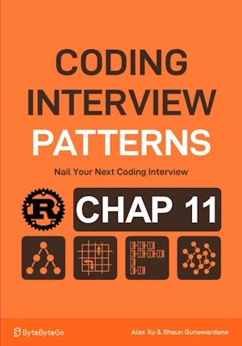

# Binary Tree Symetry

<div align="center">

</div>

* Determine if a binary tree is vertically symmetric. That is, the left subtree of the root node is a
mirror of the right subtree.


<span style="color:orange"><b>The point:</b></span>

* compare 2 subtrees in a mirror
* the right subtree is an inverted version of the left subtree
* DFS


**Complexity :**

| Time        | Space |
|-------------|-------|
| O(n)        | O(n)  |

* O(n) in time because we process each node once during the level-order traversal
* O(n) in space because of the size of the recursive stack. Will grow as large as the heigh (max val = n) 

**About Rust :**
* Based on V2 (see ``189_intro.ipynb``) for easy tree building
* ``.max(...)`` is a method of ``i32``, NOT of ``&mut i32``.
* **YES** : tested on the [Rust Playground](https://play.rust-lang.org/)


<!-- <span style="color:red"><b>TODO : </b></span> 
* Rust : come back on `.as_mut()`, `.as_deref()`         -->


<!-- * <span style="color:lime"><b>Preferred solution?</b></span>      -->


```rust
type Link = Option<Box<TreeNode>>;

struct TreeNode {
    value: i32,
    left: Link,
    right: Link,
}

impl TreeNode {
    fn new(value: i32) -> Self {
        TreeNode {
            value,
            left: None,
            right: None,
        }
    }

    // Add child on the left
    fn left(mut self, node: TreeNode) -> Self {
        self.left = Some(Box::new(node));
        self
    }

    // Add child on the right
    fn right(mut self, node: TreeNode) -> Self {
        self.right = Some(Box::new(node));
        self
    }
}

fn preorder_print(link: &Link) {
    if let Some(node) = link {
        print!("{} ", node.value);      // Process current node
        preorder_print(&node.left);     // Traverse left child
        preorder_print(&node.right);    // Traverse right child
    }
}

fn dfs(node_link1 : &Link, node_link2 : &Link) -> bool{
    
    if node_link1.is_none() && node_link2.is_none(){return true;}
    if node_link1.is_none() || node_link2.is_none(){return false;}
    
    // At this point, both node_link1 and node_link2 are Some => unwrap safely
    let (n1, n2) = (node_link1.as_ref().unwrap(), node_link2.as_ref().unwrap());
    
    // If values differ → not symmetric
    if n1.value != n2.value {return false;}
    
    // Compare left of n1 with right of n2, and right of n1 with left of n2
    dfs(&n1.left, &n2.right) && dfs(&n1.right, &n2.left)
}


fn binary_tree_symmetry(link : &Link) -> bool {
    if let Some(node) = link {
        dfs(&node.left, &node.right)
    }else{
        true
    }
}

fn main() { // no main() if this code runs in a Jupyter cell 
    // Build the tree:
    //        5
    //      /   \
    //     2     2
    //    / \   / \
    //   1   4 4   1
    
    let tree = TreeNode::new(5)
        .left(
            TreeNode::new(2)
                .left(
                    TreeNode::new(1)
                )
                .right(
                    TreeNode::new(4)
                )
        )
        .right(
            TreeNode::new(2)
                .left(
                    TreeNode::new(4)
                )
                .right(
                    TreeNode::new(1)
                )
        );

    let root_link = Some(Box::new(tree));
    preorder_print(&root_link); // 5 2 1 4 2 4 8  
    println!();
    println!("{}", binary_tree_symmetry(&root_link)); // true
    
} // end of local scope OR end of main()
```
