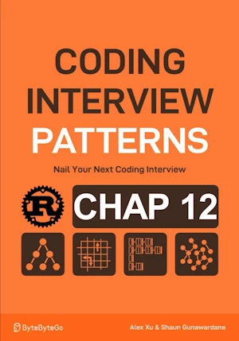

# Design a Trie

<div align="center">

</div>

* Design and  implement a trie data structure
    * `insert(word: &str) -> None`
    * `search(word: &str) -> bool`
    * ``has_prefix(prefix: &str) -> bool``

<span style="color:orange"><b>The point:</b></span>

* Insert : All words inserted are child of the root. Find if there is a prefix, create a branch if needed
* Search : returns ``true`` if the final node is tagged `is_word`
* Has prefix : similar to search. No need to check the tag `is_word`

**Complexity :**

| Method                      | Time        | Space |
| ----------------------------|-------------|-------|
| `insert()`                  | O(k)        | O(k)  |
| `search()` & `has_prefix()` | O(k)        | O(1)  |

* O(k) in time for ``insert()`` because we need to visit up to k nodes
* O(k) in time for ``search()`` and `has_prefix()` because search through up to k chars in the trie
* O(1) in space because in worst case k new nodes need to be created
* O(1) in space because no additional space required


**About Rust :**
* `node = node.children.entry(c).or_insert_with(TrieNode::new);`
* Remember :
```rust
match node.children.get(&c) {
    Some(next_node) => node = next_node,
    None => return false,
}
```
* **YES** : tested on the [Rust Playground](https://play.rust-lang.org/)


<!-- <span style="color:red"><b>TODO : </b></span> 
* Add comments in code -->


<!-- * <span style="color:lime"><b>Preferred solution?</b></span>      -->


```rust
use std::collections::HashMap;

struct TrieNode {
    children: HashMap<char, TrieNode>,
    is_word : bool,
}

impl TrieNode {
    fn new() -> Self {
        TrieNode{
            children : HashMap::new(),
            is_word : false,
        }
    }
}

struct Trie {
    root : TrieNode
}

impl Trie {
    fn new() -> Self {
        Trie{
            root : TrieNode::new()
        }
    }

    fn insert(&mut self, word : &str) {
        let mut node = &mut self.root;
        // for each char, if not a child of current node, create a new TrieNode for the char
        for c in word.chars(){
            node = node.children.entry(c).or_insert_with(TrieNode::new);
        }
        node.is_word=true;
    }

    fn search(&self, word : &str) -> bool{
        let mut node = &self.root;
        // for each char in the word, if not a child of the node, the word does'nt exist
        for c in word.chars(){
            match node.children.get(&c) {
                Some(next_node) => node = next_node,
                None => return false,
            }
        }
        // return wether the current node is the end of the word
        node.is_word
    }

    fn has_prefix(&self, prefix : &str) -> bool {
        let mut node = &self.root;
        for c in prefix.chars(){
            match node.children.get(&c) {
                Some(next_node) => node = next_node,
                None => return false,
            }
        }
        // return true once the nodes of the chars have been visited
        true
    }
}

fn main() { // no main() if this code runs in a Jupyter cell 
    let mut my_trie = Trie::new();
    my_trie.insert("top");
    my_trie.insert("bye");
    println!("Has prefix 'to': {}", my_trie.has_prefix("to"));      // Has prefix 'to': true
    println!("Search 'to': {}", my_trie.search("to"));              // Search 'to': false
    my_trie.insert("to");
    println!("Search 'to' after insert: {}", my_trie.search("to")); // Search 'to' after insert: true
} // end of local scope OR end of main()
```
