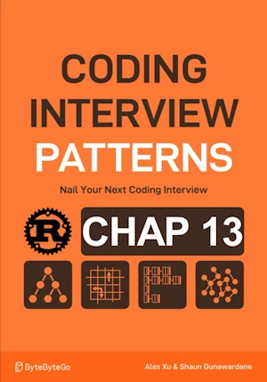

# Connect the Dots

<div align="center">

</div>

* Given a set of points on a plane, determine the minimum cost to connect all these points
* The cost of connecting two points is equal to the Manhattan distance between them, which is calculated as |x1-x2|+|y1-y2| 
* At least 2 points on the plane


<span style="color:orange"><b>The point:</b></span>

* minimum spanning tree (MST) problem
* Kruskal's or Prim's algo
* Here, Kruskal's algo
    * builds the MST, connecting nodes with the lowest weighted edges first and skipping edges that could cause a cycle
* Use the Union-Find data structure to detect cycle, ie checking if 2 points we want to connect both belong to the same "community"
**Complexity :**

| Time               | Space        |
|--------------------|--------------|
| O(n² * log(n))     | O(n²)        |

* O(n² * log(n)) in time because 
    * n² the number of edges 
    * Sorting n² edges takes O(n² * log(n²)). Can be simplified to O(n² * log(n))
    * Up to one union operation for each edge. Each union taking amortized 0(1) time => O(n²)
    * O(n² + n² x log(n)) = O(n² * log(n))
* O(n²) in space because of the edges array. `UnionFind` data structur take up to O(n)

<!-- <span style="color:red"><b>TODO : </b></span> 
* Add comments in code -->


<!-- * <span style="color:lime"><b>Preferred solution?</b></span>      -->


## First implementation

**About Rust :**
* Checkout `280_merging_communities.ipynb` for UnionFind data structure
* I don't like the way total_cost is returned twice
* **YES** : tested on the [Rust Playground](https://play.rust-lang.org/)


```rust
struct UnionFind{
    size : Vec<usize> ,
    parent : Vec<usize> 
}

impl UnionFind{
    fn new(size: usize) -> Self {
        Self {
            parent: (0..size).collect(),
            size: vec![1; size],
        }
    }

    fn union(&mut self, x: usize, y: usize) -> bool{       // ! Now return a bool
        let (rep_x, rep_y) = (self.find(x), self.find(y));
        if rep_x != rep_y{
            if self.size[rep_x] > self.size[rep_y]{
                // If rep_x represent a larger community, connect rep_y community to it
                self.parent[rep_y] = rep_x;
                self.size[rep_x] += self.size[rep_y] 
            }else{
                // connect rep_x to rep_y otherwise
                self.parent[rep_x] = rep_y;
                self.size[rep_y] += self.size[rep_x] 
            }
            // true if both groups were merged
            return true;
        }
        // false if the points belong to the same group
        false
    }

    fn find(&mut self, x: usize)->usize{ // returns the representative of x
        if x != self.parent[x] {
            self.parent[x] = self.find(self.parent[x]); // path compression
        }
        self.parent[x]
    }
}


fn connect_the_dots(points: &[(i32, i32)]) -> usize {
    let n = points.len();

    // Create and populate an array containing all possible edges
    let mut edges = Vec::new();
    for i in 0..n{
        for j in i+1..n{
            // Manhattan
            let cost = (points[i].0 - points[j].0).abs() + (points[i].1 - points[j].1).abs();
            edges.push((cost as usize, i, j))
        }
    } 

    // Sort the edges by their cost in ascending order
    edges.sort();
    let mut uf = UnionFind::new(n);

    let (mut total_cost, mut edges_added) = (0, 0);

    // Use Kruskal's algorithm to create the MST and identify its minimum cost
    for (cost, p1, p2) in edges{
        // If the points are not already connected (i.e., their representatives are not the same), connect them, and add the cost to the total cost
        if uf.union(p1, p2){
            total_cost += cost;
            edges_added +=1;
            // If n - 1 edges have been added to the MST, the MST is complete
            if edges_added == n - 1{
               return total_cost; 
            }
        }
    }
    total_cost
}

fn main() {
    let points = vec![
        (1, 1),
        (2, 6),
        (3, 2),
        (4, 3),
        (7, 1),
    ];
    println!("{:?}", connect_the_dots(&points)); // 15
}
```

## V2

**About Rust :**
* Use `loop` expression to evaluate the return value of `connect_the_dots()`
* Use `.abs_diff()` for Manhattan
* Set `edges` to the right capacity up front
* <span style="color:lime"><b>Preferred solution?</b></span>     
* **YES** : tested on the [Rust Playground](https://play.rust-lang.org/)


```rust
struct UnionFind {
    size: Vec<usize>,
    parent: Vec<usize>,
}

impl UnionFind {
    fn new(size: usize) -> Self {
        Self {
            parent: (0..size).collect(),
            size: vec![1; size],
        }
    }

    fn union(&mut self, x: usize, y: usize) -> bool { // ! Now return a bool
        let (rep_x, rep_y) = (self.find(x), self.find(y));
        if rep_x != rep_y {
            if self.size[rep_x] > self.size[rep_y] {
                // If rep_x represent a larger community, connect rep_y community to it
                self.parent[rep_y] = rep_x;
                self.size[rep_x] += self.size[rep_y];
            } else {
                // connect rep_x to rep_y otherwise
                self.parent[rep_x] = rep_y;
                self.size[rep_y] += self.size[rep_x];
            }
            // true if both groups were merged
            return true;
        }
        // false if the points belong to the same group
        false
    }

    fn find(&mut self, x: usize) -> usize { // returns the representative of x
        if x != self.parent[x] {
            self.parent[x] = self.find(self.parent[x]); // path compression
        }
        self.parent[x]
    }
}

fn connect_the_dots(points: &[(i32, i32)]) -> usize {
    let n = points.len();

    // Create and populate an array containing all possible edges
    let mut edges = Vec::with_capacity(n * (n - 1) / 2);
    for i in 0..n {
        for j in i + 1..n {
            // Manhattan
            let cost = (points[i].0.abs_diff(points[j].0) + points[i].1.abs_diff(points[j].1)) as usize;
            edges.push((cost, i, j));
        }
    }

    // Sort the edges by their cost in ascending order
    edges.sort();

    let mut uf = UnionFind::new(n);
    let mut total_cost = 0;
    let mut edges_added = 0;

    // Use Kruskal's algorithm to create the MST and identify its minimum cost 
    // The returned value is the result of the loop expression (total_cost)
    loop {
        for (cost, p1, p2) in edges.iter().copied() {
            if uf.union(p1, p2) {
                total_cost += cost;
                edges_added += 1;
                if edges_added == n - 1 {
                    break; // <- Breaks the `for`, not the `loop`
                }
            }
        }
        break total_cost; // <- Breaks the `loop` 
    } // ! watchout no ; 
}

fn main() {
    let points = vec![
        (1, 1),
        (2, 6),
        (3, 2),
        (4, 3),
        (7, 1),
    ];
    println!("{:?}", connect_the_dots(&points)); // 15
}
```
