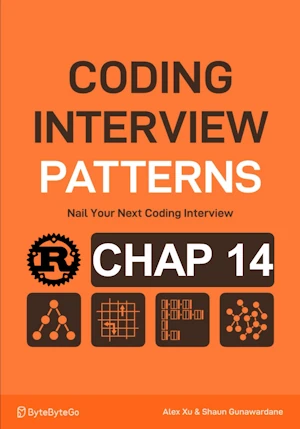

# Find All Permutations

<div align="center">

</div>

* Return all permutations of a given array of unique i32. 
* They can be returned in any order

<span style="color:orange"><b>The point:</b></span>

* All 
* Backtracking

**Complexity :**

| Time        | Space |
|-------------|-------|
| O(n x n!)   | O(n)  |

* O(n x n!) in time because from root explore n options. Then for each option we explore n-1 then n-2... options => n!. We then make a copy in O(n) => O(n x n!)
* O(n) in space because the max depth of the recursion tree. We keep track of used data structures and candidates in O(n). The result array is not taken into account.


<!-- <span style="color:red"><b>TODO : </b></span> 
* Add comments in code -->


<!-- * <span style="color:lime"><b>Preferred solution?</b></span>      -->


## V1

* First implementation

**About Rust :**
* `use std::collections::HashSet;`
    * `let my_set = HashSet::new();`
    * ``my_set.contains(&my_value)``
    * ``my_set.insert(my_value)``
    * ``my_set.remove(&my_value)``
* **YES** : tested on the [Rust Playground](https://play.rust-lang.org/)


```rust
use std::collections::HashSet;

fn backtrack(nums: &[i32], candidate: &mut Vec<i32>, used: &mut HashSet<i32>, res: &mut Vec<Vec<i32>>) {
    // if current candidate is a complete permutation add it to the result
    if candidate.len() == nums.len() {
        res.push(candidate.clone()); // cannot push candidate (it is used afterward) so we push a clone of it
        return;
    }
    for &num in nums {
        if !used.contains(&num) {
            // Add num to the permutation and mark it as used
            candidate.push(num);
            used.insert(num);
            // Recursively  explore all branches using updated permutation candidate
            backtrack(nums, candidate, used, res);
            // Backtrack by reversing the changes made
            candidate.pop();
            used.remove(&num);
        }
    }
}

fn find_all_permutations(nums: &[i32]) -> Vec<Vec<i32>> {
    let mut res = Vec::new();
    backtrack(nums, &mut vec![], &mut HashSet::new(), &mut res);
    res
}

// no main() if this code runs in a Jupyter cell
fn main() {
    let nums = vec![4, 5, 6];
    let permutations = find_all_permutations(&nums);
    for permutation in permutations {
        print!("{:?} - ", permutation); // [4, 5, 6] - [4, 6, 5] - [5, 4, 6] - [5, 6, 4] - [6, 4, 5] - [6, 5, 4] - 
    }
} // end of local scope OR end of main()

```

## V2

* No hashset
* Work in place
* Swap in 0(1)
* Still cloning but nums, not candidate 


```rust
fn backtrack(nums: &mut Vec<i32>, start: usize, res: &mut Vec<Vec<i32>>) {
    // if current candidate is a complete permutation add it to the result
    if start == nums.len() {
        res.push(nums.clone()); // unavoidable here unless we return Vec<&[i32]>
        return;
    }
    for i in start..nums.len() {
        nums.swap(start, i);
        backtrack(nums, start + 1, res);
        nums.swap(start, i); // backtrack
    }
}

fn find_all_permutations(nums: &[i32]) -> Vec<Vec<i32>> {
    let mut res = Vec::new();
    let mut nums = nums.to_vec();
    backtrack(&mut nums, 0, &mut res);
    res
}

// no main() if this code runs in a Jupyter cell
fn main() {
    let nums = vec![4, 5, 6];
    let permutations = find_all_permutations(&nums);
    for permutation in permutations {
        print!("{:?} - ", permutation); // [4, 5, 6] - [4, 6, 5] - [5, 4, 6] - [5, 6, 4] - [6, 4, 5] - [6, 5, 4] - 
    }
} // end of local scope OR end of main()

```
