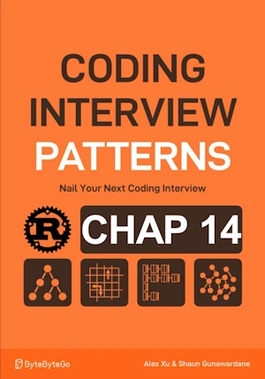

# Combinations of a Sum

<div align="center">

</div>

* Given an integer array and a target value
* Find all unique combinations in the array where the numbers in each combination sum to the target
* Each number in the array may be used an unlimited number of times in the combination
* The output must not contain duplicate combinations. 
    * [1, 1, 2] and [1, 2, 1] are considered duplicates

Assume
* All integers in `nums` are positive and unique.
* The target value is positive.


<span style="color:orange"><b>The point:</b></span>

* Number are positive => stop building a combination once its sum is equal to or exceeds the target value.
* backtracking
* State space tree start with []. One branch per number. If sum of number >= target we stop here.
* Use a start_index to avoid duplicate

**Complexity :**

| Time        | Space |
|-------------|-------|
| O(n!)       | O(n)  |

* O(n!) in time because 
    * first queen => n choices
    * second queen => n-a. a the number of square attacked by the first queen
    * third queen => n-b. b the number of square attacked by the 2 first queens (`b<a`)
    * this "looks like" to n!
* O(n) in space because n is the max depth of the recursion tree. The hash sets can store up to `n` values.


<!-- <span style="color:red"><b>TODO : </b></span> 
* Add comments in code -->


<!-- * <span style="color:lime"><b>Preferred solution?</b></span>      -->


## V1

* First implementation

**About Rust :**
* **YES** : tested on the [Rust Playground](https://play.rust-lang.org/)


```rust
fn dfs(combination: &mut Vec<u32>, start_index: usize, nums: &[u32], target: i32, res: &mut Vec<Vec<u32>>) {
    // Termination condition: If the target is equal to 0, we found a combination that sums to 'k'
    if target == 0 {
        res.push(combination.clone());
        return;
    }

    // Termination condition: If the target is less than 0, no more valid combinations can be created by adding to the current combination.
    if target < 0 {
        return;
    }

    // Starting from 'start_index', explore all combinations after adding 'nums[i]'
    for i in start_index..nums.len() {
        // Add the current number to create a new combination
        combination.push(nums[i]);
        // Recursively explore all paths that branch from this new combination
        dfs(combination, i, nums, target - nums[i] as i32, res); // target - nums[i] can be negative
        // Backtrack by removing the number we just added.
        combination.pop();
    }
}

fn combinations_of_sum_k(nums: &[u32], target: u32) -> Vec<Vec<u32>> {
    let mut combination: Vec<u32> = vec![];
    let start_index = 0;
    let mut res = Vec::new();
    dfs(&mut combination, start_index, nums, target as i32, &mut res);
    res
}

// no main() if this code runs in a Jupyter cell
fn main() {
    let nums = vec![1, 2, 3];
    let target = 4;
    let combinations = combinations_of_sum_k(&nums, target);
    for combination in combinations {
        print!("{:?}", combination); // [1, 1, 1, 1][1, 1, 2][1, 3][2, 2]
    }
} // end of local scope OR end of main()

```

## V2

**About Rust :**
* ``usize`` everywhere
* no need to test if ``target < 0`` but still need to test if `nums[i] > target`
* **YES** : tested on the [Rust Playground](https://play.rust-lang.org/)


```rust
fn dfs(combination: &mut Vec<u32>, start_index: usize, nums: &[u32], target: u32, res: &mut Vec<Vec<u32>>) {
    // Termination condition: If the target is equal to 0, we found a combination that sums to 'k'
    if target == 0 {
        res.push(combination.clone());
        return;
    }

    // Explore all combinations starting from 'start_index'
    for i in start_index..nums.len() {
        let num = nums[i];
        
        // If current number is greater than the remaining target, no need to proceed (early stopping)
        if num > target {
            continue;
        }

        // Add the current number to create a new combination
        combination.push(num);
        // Recursively explore all paths that branch from this new combination
        dfs(combination, i, nums, target - num, res); // Safe subtraction: target >= num
        // Backtrack by removing the number we just added
        combination.pop();
    }
}

fn combinations_of_sum_k(nums: &[u32], target: u32) -> Vec<Vec<u32>> {
    let mut combination = Vec::new();
    let mut res = Vec::new();
    dfs(&mut combination, 0, nums, target, &mut res);
    res
}

fn main() {
    let nums = vec![1, 2, 3];
    let target = 4;
    let combinations = combinations_of_sum_k(&nums, target);
    for combination in combinations {
        println!("{:?}", combination); // [1, 1, 1, 1], [1, 1, 2], [1, 3], [2, 2]
    }
}

```

## V3

**About Rust :**
* Sort the numbers to allow early stopping
* **YES** : tested on the [Rust Playground](https://play.rust-lang.org/)
* <span style="color:lime"><b>Preferred solution?</b></span>     


```rust
fn dfs(combination: &mut Vec<u32>, start_index: usize, nums: &[u32], target: u32, res: &mut Vec<Vec<u32>>) {
    // Termination condition: If the target is equal to 0, we found a combination that sums to 'k'
    if target == 0 {
        res.push(combination.clone());
        return;
    }

    // Explore all combinations starting from 'start_index'
    for i in start_index..nums.len() {
        let num = nums[i];
        
        // If current number is greater than the remaining target, no need to proceed (early stopping)
        if num > target {
            break;  // this is where early stop occurs
                    // since nums are ordered no need to check the others (there are > target)
        }

        // Add the current number to create a new combination
        combination.push(num);
        // Recursively explore all paths that branch from this new combination
        dfs(combination, i, nums, target - num, res); // Safe subtraction: target >= num
        // Backtrack by removing the number we just added
        combination.pop();
    }
}

fn combinations_of_sum_k(nums: &[u32], target: u32) -> Vec<Vec<u32>> {
    let mut sorted_nums = nums.to_vec();
    sorted_nums.sort_unstable(); // Sort the numbers to allow early stopping
    let mut combination = Vec::new();
    let mut res = Vec::new();
    dfs(&mut combination, 0, &sorted_nums, target, &mut res);
    res
}


fn main() {
    let nums = vec![1, 2, 3];
    let target = 4;
    let combinations = combinations_of_sum_k(&nums, target);
    for combination in combinations {
        println!("{:?}", combination); // [1, 1, 1, 1], [1, 1, 2], [1, 3], [2, 2]
    }
}

```
