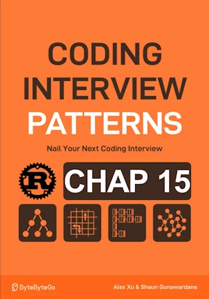

# Longest Common Subsequence

<div align="center">

</div>

* Given 2 strings
* Find the length of the longest common subsequence (LCS)
* A subsequence is derived by deleting 0 or more elements, without changing the order of the remaining elements

<span style="color:orange"><b>The point:</b></span>

* Brute force is very inefficient
* For every char of either string, we make a choice : include it or not
* `if s1[i]==s2[j] then LCS(i, j) = 1 + LCS(i+1, j+1)`
* `if s1[i]!=s2[j] then LCS(i, j) = LCS(i+1, j).max(LCS(i, j+1))`
* Base case. When one is empty, LCS = 0. See p 331


**Phases of a DP solution :**
1. Subproblem
1. DP Formula
1. Base Case
1. Populate DP Table


**Complexity :**

| Time        | Space        |
|-------------|--------------|
| O(m x n)    | O(m+1 x n+1) |

* O(m x n) in time because each cell in DP table is populated once
* O(m+1 x n+1) in space because of size of DP table


**About Rust :**
* First implementation
* **YES** : tested on the [Rust Playground](https://play.rust-lang.org/)


<!-- <span style="color:red"><b>TODO : </b></span> 
* Add comments in code -->


<!-- * <span style="color:lime"><b>Preferred solution?</b></span>      -->


```rust
fn longest_common_substructure(s1: &str, s2: &str) -> usize {
    // Convert strings to vectors of chars to allow indexed access
    let s1: Vec<char> = s1.chars().collect();
    let s2: Vec<char> = s2.chars().collect();

    // Create DP table with extra row and column for the base case
    // Set the DP table to 0
    let mut dp = vec![vec![0; s2.len() + 1]; s1.len() + 1];

    // Populate the DP table from bottom-right to top-left
    for i in (0..s1.len()).rev() {
        for j in (0..s2.len()).rev() {
            // If the chars match the length of LCS at dp[i][j] is 1+LCS length of the remaining substring
            if s1[i] == s2[j] {
                dp[i][j] = 1 + dp[i + 1][j + 1];
            } else {
                // If the chars don't match LCS length at dp[i][j] can be found either
                //  Excluding current char of s1
                //  Excluding current char ofs2
                dp[i][j] = dp[i + 1][j].max(dp[i][j + 1]);
            }
        }
    }
    // The result is at the top-left corner of the DP table
    dp[0][0]
}

fn main() { // no main() if this code runs in a Jupyter cell
    let s1 = "acabac";
    let s2 = "aebab";
    println!("{}", longest_common_substructure(s1, s2)); // 3
} // end of local scope OR end of main()
```

    3


## Optimization

<span style="color:orange"><b>The point:</b></span>

* Only need to access `dp[i+1][j]` and `dp[i][j+1]` and `dp[i+1][j+1]`
* No need  to store the entire DP array
* `curr_row` `prev_row`

**Complexity :**

| Time           | Space     |
|----------------|-----------|
| O(m x n)       | O(n)      |


**About Rust :**
* First implementation
* **YES** : tested on the [Rust Playground](https://play.rust-lang.org/)


```rust
fn longest_common_substructure(s1: &str, s2: &str) -> usize {
    // Convert strings to vectors of chars to allow indexed access
    let s1: Vec<char> = s1.chars().collect();
    let s2: Vec<char> = s2.chars().collect();

    // Initialize prw_row as DP values of last row 
    let mut prev_row = vec![0; s2.len() + 1];


    for i in (0..s1.len()).rev() {
        // Set the last cell fo curr_row to 0 to set the base case for this row
        // Done by setting entier row to 0
        let mut curr_row = vec![0; s2.len() + 1];
        
        for j in (0..s2.len()).rev() {
            // If the chars match the length of LCS at curr_row[j] is 1+LCS length of the remaining substring
            if s1[i] == s2[j] {
                curr_row[j] = 1 + prev_row[j + 1];
            } else {
                // If the chars don't match, LCS length at curr_row[j] can be found either
                //  Excluding current char of s1 (prev_row[j])
                //  Excluding current char of s2 (curr_row[j+1])
                curr_row[j] = prev_row[j].max(curr_row[j+1]);
            }
        }
        // Update prev_row with curr_row
        prev_row = curr_row;
    }
    prev_row[0]
}

fn main() { // no main() if this code runs in a Jupyter cell
    let s1 = "acabac";
    let s2 = "aebab";
    println!("{}", longest_common_substructure(s1, s2)); // 3
} // end of local scope OR end of main()
```

    3

