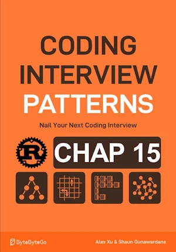

# 0/1 Knapsack

<div align="center">

</div>

* Robe a store
* Carry a knapsack with capacity of `cap` units
* Item `i` has a `weight[i]` and `value[i]`
* Return the maximum total value you can carry


<span style="color:orange"><b>The point:</b></span>

* 2 choice per item : include, exclude
* Binary decision => the name
* Brute force => 2^n combinations
* Greedy is not either a good choice (picking the largest first does'nt lead to optimal solution)
* Include item `i` => the most value we can get is : `values[i] + knapsack(i+1, capa - weights[i])`
* Exclude item `i` => the most value we can get is : `knapsack(i+1, capa)`
* First columns and last row set to 0  

**Phases of a DP solution :**
1. Subproblem
1. DP Formula
1. Base Case
1. Populate DP Table


**Complexity :**

| Time        | Space        |
|-------------|--------------|
| O(n x capa) | O(n x capa)  |

* O(n x capa) in time because each cell of the DP table is populated once
* O(n x capa) in space because the DP table is (n+1) x (capa+1)


**About Rust :**
* First implementation
* **YES** : tested on the [Rust Playground](https://play.rust-lang.org/)


<!-- <span style="color:red"><b>TODO : </b></span> 
* Add comments in code -->


<!-- * <span style="color:lime"><b>Preferred solution?</b></span>      -->


```rust
fn knapsack(capacity: usize, weights: &[usize], values: &[i32]) -> i32 {
    let n = values.len();
    // Base case : set first col and last row to 0 by initializing DP to 0
    let mut dp = vec![vec![0; capacity+1]; n+1];
    // populate dp
    for i in (0..n).rev() {
        for c in 1..=capacity {
            // Item i is included
            if weights[i] <= c {
                dp[i][c] = (values[i] + dp[i + 1][c - weights[i]]).max(dp[i + 1][c]);
            } else {
                // Item i is excluded
                dp[i][c] = dp[i + 1][c];
            }
        }
    }
    dp[0][capacity]
}

fn main() { // no main() if this code runs in a Jupyter cell
    let weights = vec![5, 3, 4, 1];
    let values = vec![70, 50, 40, 10];
    let capacity = 7;
    println!("{}", knapsack(capacity, &weights, &values)); // 90
} // end of local scope OR end of main()

```

## Optimization

<span style="color:orange"><b>The point:</b></span>

* We only need access to the cellsfrom the row below
* `curr_row` : the row being populated
* `prev_row` : the row below the current row


**Complexity :**

| Time           | Space     |
|----------------|-----------|
| O(n x capa)    | O(capa)   |


**About Rust :**
* <span style="color:lime"><b>Preferred solution?</b></span>
* **YES** : tested on the [Rust Playground](https://play.rust-lang.org/)


```rust
fn knapsack_optimized(capacity: usize, weights: &[usize], values: &[i32]) -> i32 {
    // Initialize prev_row as the DP values of the row below current row
    let mut prev_row = vec![0; capacity + 1];

    for i in (0..values.len()).rev() {
        let mut curr_row = vec![0; capacity + 1];
        for c in 1..=capacity {
            if weights[i] <= c {
                // Item i is included
                curr_row[c] = (values[i] + prev_row[c - weights[i]]).max(prev_row[c]);
            } else {
                // Item i is excluded
                curr_row[c] = prev_row[c];
            }
        }
        prev_row = curr_row;
    }
    prev_row[capacity]
}

fn main() {
    // no main() if this code runs in a Jupyter cell
    let weights = vec![5, 3, 4, 1];
    let values = vec![70, 50, 40, 10];
    let capacity = 7;
    println!("{}", knapsack_optimized(capacity, &weights, &values)); // 90
} // end of local scope OR end of main()

```
