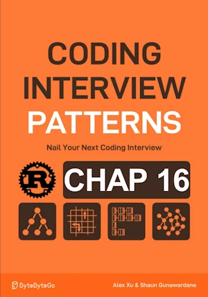

# Gas Stations

<div align="center">

</div>

* Circular route with gas stations
* Find the index of the gas station to start at
* In order to complete the circuit without running out of gas
* Empty tank at start
* Return -1 if impossible
* Assume only one solution when this is possible

<span style="color:orange"><b>The point:</b></span>

* check ``sum(gas) >= sum(cost)``
* if enough gas, find the start point that allow to complete the circuit
* at sation `i`, we collect ``gas[i]`` and consume `cost[i]` to move to next station => take into account ``net_gas`` (the difference)
* if we cannot reach station `b` from station `a` we can't reach station `b` from any station in between either 
    * because we cannot reach any point between ``a`` and ``b`` without running out of gas


**Complexity :**

| Time        | Space |
|-------------|-------|
| O(n)        | O(1)  |

* O(n) in time because we iterate over element in gas and cost arrays
* O(1) in space because in place


<!-- <span style="color:red"><b>TODO : </b></span> 
* Add comments in code -->


<!-- * <span style="color:lime"><b>Preferred solution?</b></span>      -->


## V1

* First implementation

**About Rust :**
* `gas.iter().sum::<i32>()`
* **YES** : tested on the [Rust Playground](https://play.rust-lang.org/)


```rust
fn gas_stations(gas: &[i32], cost: &[i32]) -> i32 {
    if gas.is_empty() || cost.is_empty() || gas.len() != cost.len() {
        return -1;
    }
    // If total gas is less than total cost => impossible
    if gas.iter().sum::<i32>() < cost.iter().sum::<i32>() { // the compiler needs help => sum::<i32>()
        -1
    } else {
        let (mut start, mut tank) = (0, 0);
        for i in 0..gas.len() {
            tank += gas[i] - cost[i];
            // If tank is negative we cannot continue from the current start point, nor from any station before or including current station i
            if tank < 0 {
                start = i + 1;
                tank = 0;
            }
        }
        start as i32
    }
}

fn main() { // no main() if this code runs in a Jupyter cell
    let gas = vec![2, 5, 1, 3];
    let cost = vec![3, 2, 1, 4];
    println!("{}", gas_stations(&gas, &cost)); // 1

    let gas = vec![3, 2, 1, 3, 3, 2, 3, 4];
    let cost = vec![2, 1, 4, 1, 2, 6, 0, 3];
    println!("{}", gas_stations(&gas, &cost)); // 6

    let gas = vec! [3, 2, 1, 3, 3, 2, 3, 4];
    let cost = vec![2, 1, 4, 1, 2, 6, 0];
    println!("{}", gas_stations(&gas, &cost)); // -1
} // end of local scope OR end of main()

```

## V2
* I don't like the idea of ``gas`` and `cost` containing `i32` while in fact they contain `u32`
* In addition `gas_station()` 
    * Should return an error when arrays sizes are invalid or does'nt match
    * Otherwise, it should return
        * None if no index exist
        * The index (u32) if it exists


**About Rust :**
* `fn my_function() -> Result<Option<usize>, &'static str>`
    * We need the ``'static`` lifetime because we are returning a ``&str``, which is a reference (a view) to a string literal that is embedded in the binary at compile time.
    * ``&str`` has no allocation — it's just a pointer and a length (fixed view into memory).
    * Literals like "some text" have a ``'static`` lifetime automatically because they live for the entire duration of the program.
    * If we had returned a ``String``, no lifetime annotation would be necessary, because ``String`` is **owned** — it manages its own heap allocation and deallocation.    
* <span style="color:lime"><b>Preferred solution?</b></span> 
* **YES** : tested on the [Rust Playground](https://play.rust-lang.org/)


```rust
fn gas_stations(gas: &[u32], cost: &[u32]) -> Result<Option<usize>, &'static str> {
    // Check if gas and cost arrays are empty or have different lengths
    if gas.is_empty() || cost.is_empty() || gas.len() != cost.len() {
        return Err("Invalid input: arrays are empty or have different lengths");
    }
    // If total gas is less than total cost => impossible
    if gas.iter().sum::<u32>() < cost.iter().sum::<u32>() {
        Ok(None)
    } else {
        let (mut start, mut tank) = (0usize, 0isize); // use isize for possible negative tank values
        for i in 0..gas.len() {
            tank += gas[i] as isize - cost[i] as isize;
            // If tank is negative, reset starting point
            if tank < 0 {
                start = i + 1;
                tank = 0;
            }
        }
        Ok(Some(start))
    }
}

fn main() { // no main() if this code runs in a Jupyter cell
    let gas = vec![2, 5, 1, 3];
    let cost = vec![3, 2, 1, 4];
    println!("{:?}", gas_stations(&gas, &cost)); // Ok(Some(1))

    let gas = vec![3, 2, 1, 3, 3, 2, 3, 4];
    let cost = vec![2, 1, 4, 1, 2, 6, 0, 3];
    println!("{:?}", gas_stations(&gas, &cost)); // Ok(Some(6))

    let gas = vec![1, 2, 3];
    let cost = vec![3, 2, 1];
    if let Ok(Some(index)) = gas_stations(&gas, &cost) {
        println!("A solution exists when starting from index {}", index); // show how to extract the index if it exists
    }

    let gas = vec![2, 2, 2];
    let cost = vec![3, 3, 3];
    println!("{:?}", gas_stations(&gas, &cost)); // Ok(None)

    let gas = vec![3, 2, 1, 3, 3, 2, 3, 4];
    let cost = vec![2, 1, 4, 1, 2, 6, 0];
    println!("{:?}", gas_stations(&gas, &cost)); // Err("Invalid input: arrays are empty or have different lengths")

    let gas = vec![];
    let cost = vec![];
    println!("{:?}", gas_stations(&gas, &cost)); // Err("Invalid input: arrays are empty or have different lengths")

} // end of local scope OR end of main()

```
