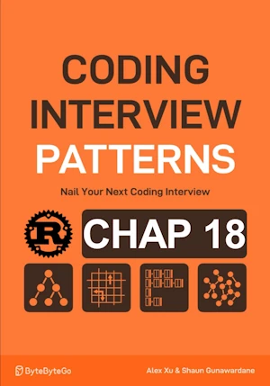

# Introduction

<div align="center">

</div>

**About Rust :**
* **YES** : tested on the [Rust Playground](https://play.rust-lang.org/)

<!-- <span style="color:red"><b>TODO : </b></span> 
* Add comments in code -->

<!-- * <span style="color:lime"><b>Preferred solution?</b></span>      -->


```rust

fn main() { // no main() if this code runs in a Jupyter cell 
    let mut x : u8 = 0b0000_0000;
    println!("x                : {:08b} ({})", x, x); // 00101010
    
    // set bit 2
    x |= 1 << 2; //
    println!("Bit 2 is set     : {:08b}", x); // 4 00000100
    
    // clear bit 2
    x &= !(1 << 2);
    println!("Bit 2 is cleared : {:08b}", x); // 0 00000000
    
    // toggling bit 3
    x ^= 1 << 3;
    println!("Toggling bit 3   : {:08b}", x); // 8
    x ^= 1 << 3;
    println!("Toggling bit 3   : {:08b}", x); // 0
    
    // checking if bit 7 is set
    x = 1 << 7;
    println!("\nx                : {:08b} ({})", x, x); // 
    match x & (1<<7){
        128 => println!("\tand bit 7 is set"), // b1000_000
        _ => println!("\tand bit 7 is not set")
    }
    
    // check if a number is even
    x = 42;
    println!("\nx                : {:08b} ({})", x, x); // 00101010
    match x & 1 {
        0 => println!("\tand x is even"),
        _ => println!("\tand x is odd")
    }
    
    // check if x is a power of 2
    x = 16;
    println!("\nx                : {:08b} ({})", x, x); // 
    match x>0 && (x & (x-1)==0) {
        true => println!("\tand x is a power of 2"),
        false => println!("\tand x is not a power of 2")
    }
    
    // Copy past from the documentation
    println!("\n0011 AND 0101 is : {:04b}", 0b0011u32 & 0b0101);
    println!("0011 OR 0101 is  : {:04b}", 0b0011u32 | 0b0101);
    println!("0011 XOR 0101 is : {:04b}", 0b0011u32 ^ 0b0101);
    println!("1 << 5 is        : {}", 1u32 << 5);
    println!("0x80 >> 2 is     : 0x{:x}", 0x80u32 >> 2);
    
    // A nightmare...
    x = 170; // Define an 8-bit unsigned integer
    println!("\nx                :   {:08b}  ({})", x, x); //
    
    
    let formatted = format!("{:08b}", x);
    let with_separator = format!("{}_{}", &formatted[..4], &formatted[4..]);
    println!("Easy reading     : 0b{} ({})", with_separator, x); // Print the result
        
    
} // end of local scope OR end of main()
```
