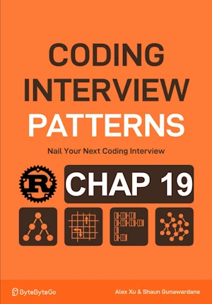

# Spiral Traversal

<div align="center">

</div>

* Return the elements of a matrix in clockwise spiral order


<span style="color:orange"><b>The point:</b></span>

* Double check that top boundary does not pass bottom boundary
* Obviously the other invariant is left <= right


**Complexity :**

| Time         | Space      |
|--------------|------------|
| O(m x n)     | O(1)   |

* O(m x n) in time because we traverse each cell once
* O(1) in space because the `res` array is not counted 


<!-- <span style="color:red"><b>TODO : </b></span> 
* Add comments in code -->

<!-- * <span style="color:lime"><b>Preferred solution?</b></span>      -->


## V1

**About Rust :**

* **YES** : tested on the [Rust Playground](https://play.rust-lang.org/)


```rust
fn spiral_matrix(matrix : Vec<Vec<i32>>) -> Vec<i32>{
    if matrix.is_empty(){
        return vec![];
    }

    let mut result = Vec::new();
    
    // Initialize matrix boundaries
    let (mut top, mut bottom) = (0, matrix.len()-1);
    let (mut left, mut right) = (0, matrix[0].len()-1);

    // Traverse the matrix in spiral order
    while top <= bottom && left <= right {
        // Move from left to right along top boundary
        for i in left..right+1{
            result.push(matrix[top][i]);
        }
        top +=1;
        // Move from top to bottom along right boundary
        // for i in top..bottom+1{
        //     result.push(matrix[i][right]);
        // }
        
        // .take() limits the iteration for 0 to bottom included
        // .skip() ignore the top first row so that we iterate from top to bottom included
        // order matters between take and skip
        for row in matrix.iter().take(bottom+1).skip(top){
            result.push(row[right]);
        }

        right -=1;
        // Check the bottom boundary and move to the left along bottom
        if top <= bottom{
            for i in (left..=right).rev() {
                result.push(matrix[bottom][i]);
            }
            bottom -=1;
        }
        // Check the left boundary and move to the top along left
        if left <= right {
            for i in (top..=bottom).rev() {
                result.push(matrix[i][left]);
            }
            left +=1;
        }
    }
    result
}

fn main() { // no main() if this code runs in a Jupyter cell 
    let my_matrix = vec![
        vec![ 0,  1,  2,  3,  4],
        vec![ 5,  6,  7 , 8,  9],
        vec![10, 11, 12 ,13, 14],
        vec![15, 16, 17, 18, 19],
    ];
    println!("{:?}", spiral_matrix(my_matrix)); // [0, 1, 2, 3, 4, 9, 14, 19, 18, 17, 16, 15, 10, 5, 6, 7, 8, 13, 12, 11]
} // end of local scope OR end of main()
```

## V2

**About Rust :**
* `let mut result = Vec::with_capacity(rows * cols);`
* **No raw loops**
    * ``result.extend((left..=right).map(|i| matrix[top][i]));``
* <span style="color:lime"><b>Preferred solution?</b></span>
* **YES** : tested on the [Rust Playground](https://play.rust-lang.org/)


```rust
fn spiral_matrix(matrix: &[Vec<i32>]) -> Vec<i32> {
    if matrix.is_empty() || matrix[0].is_empty() {
        return vec![];
    }

    let rows = matrix.len();
    let cols = matrix[0].len();
    let mut result = Vec::with_capacity(rows * cols);

    // Initialize matrix boundaries
    let (mut top, mut bottom) = (0, rows - 1);
    let (mut left, mut right) = (0, cols - 1);

    // Traverse the matrix in spiral order
    while top <= bottom && left <= right {
        // Move from left to right
        result.extend((left..=right).map(|i| matrix[top][i]));
        top += 1;

        // Move from top to bottom
        result.extend((top..=bottom).map(|i| matrix[i][right]));
        if right == 0 { break; }
        right -= 1;

        // Move from right to left
        if top <= bottom {
            result.extend((left..=right).rev().map(|i| matrix[bottom][i]));
            if bottom == 0 { break; }
            bottom -= 1;
        }

        // Move from bottom to top
        if left <= right {
            result.extend((top..=bottom).rev().map(|i| matrix[i][left]));
            left += 1;
        }
    }
    result
}

fn main() { // no main() if this code runs in a Jupyter cell 
    let my_matrix = vec![
        vec![ 0,  1,  2,  3,  4],
        vec![ 5,  6,  7,  8,  9],
        vec![10, 11, 12, 13, 14],
        vec![15, 16, 17, 18, 19],
    ];
    println!("{:?}", spiral_matrix(&my_matrix)); // [0, 1, 2, 3, 4, 9, 14, 19, 18, 17, 16, 15, 10, 5, 6, 7, 8, 13, 12, 11]
} // end of local scope OR end of main()


```
