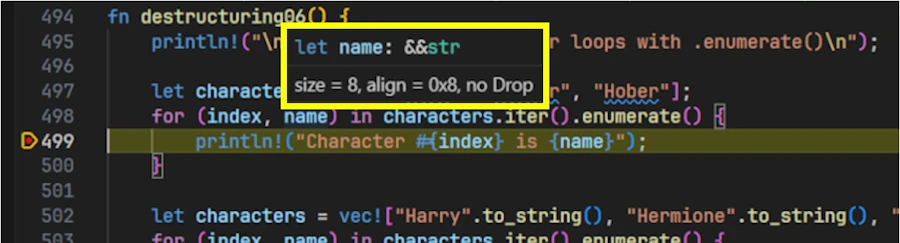
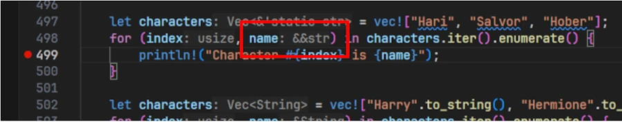

<h2 align="center">
<span style="color:red"><b>This post is still being written.</b></span>    
</h2>

# Rust Dereferencing vs Destructuring — For the Kids 2/2
{: .no_toc }

<div align="center">

<!-- <p>Thanks Chat GPT</p> -->
</div>

---
## TL;DR
{: .no_toc }

* **Dereferencing**: accessing the value behind a reference or smart pointer (e.g., `*x`, or implicit via `deref coercion`). Used to read or mutate the underlying data, respecting Rust’s borrowing rules (`&T`, `&mut T`).
* **Destructuring**: breaking apart composite values (tuples, structs, enums) using pattern matching syntax. Can move or borrow parts depending on context.

---
## The Post is in 2 Parts
{: .no_toc }

* The introduction is the same

* The introduction & conclusion are the same in both posts
* [Rust Dereferencing vs Destructuring — For the Kids 1/2]()
* [Rust Dereferencing vs Destructuring — For the Kids 2/2]()

---
## Table of Contents
{: .no_toc .text-delta}
- TOC
{:toc}


---

## Introduction

If you're learning Rust and the concepts of ownership, borrowing, and references still feel unfamiliar or intimidating — you're not alone.

Coming from languages like Python or C++, it's easy to assume that Rust's `&`, `*`, and smart pointers behave the same way. But Rust has its own philosophy, built around memory safety and enforced by strict compile-time rules.

This article aims to clarify the difference between **dereferencing** and **destructuring** — two concepts that are often confused, especially outside of `match` expressions.

### Why the Confusion?

At first glance, dereferencing (using `*`) and destructuring (in `let`, `if let`, or `match` patterns) can *look* similar when working with references. Consider the following lines:

```rust
let r = &Some(5);
if let Some(val) = r {
    println!("val = {val}");
}
```

No explicit `*r` — yet the pattern matches. How?


Now look at this one-liner:

```rust
let Some(x) = &Some(42);
```
Is this dereferencing, destructuring, or both?


And then:

```rust
let b = Box::new((42, "hello"));
let (x, y) = *b;
let (x, y) = b; // Doesn't compile
```


The three examples seem simple — but do you really understand why they behave this way?[^1]

If you already know the answers, maybe this article isn’t for you. But if you’ve ever hesitated, been surprised by a compilation error, or struggled to explain why one line works and another doesn’t… then you’re in the right place.

This article won’t just define dereferencing and destructuring — it will show you how Rust treats them, how the compiler helps (or confuses) you, and when the distinction truly matters.


### What This Post in 2 Parts Covers   
1. **Dereferencing**: [Part 1/2](). How to access values through references and smart pointers (Box, Rc, RefCell), and how mutability affects this.
1. **Destructuring**: [Part 2/2](). How to unpack values in let, match, and function or closure parameters — including when working with references.

No multithreading knowledge required. For a threaded use case, see this [post on Multithreaded Mandelbrot sets (in French)]().

Whether you're just starting with Rust or adjusting your mental model, this post is for you.


<!-- ++++++++++++++++++++++++++++++++++++++++++++++++++++++++++++++++++++ -->
<!-- ++++++++++++++++++++++++++++++++++++++++++++++++++++++++++++++++++++ -->
<!-- ++++++++++++++++++++++++++++++++++++++++++++++++++++++++++++++++++++ -->
<!-- ++++++++++++++++++++++++++++++++++++++++++++++++++++++++++++++++++++ -->
<!-- ++++++++++++++++++++++++++++++++++++++++++++++++++++++++++++++++++++ -->
<!-- ++++++++++++++++++++++++++++++++++++++++++++++++++++++++++++++++++++ -->
<!-- ++++++++++++++++++++++++++++++++++++++++++++++++++++++++++++++++++++ -->
<!-- ++++++++++++++++++++++++++++++++++++++++++++++++++++++++++++++++++++ -->
<!-- ++++++++++++++++++++++++++++++++++++++++++++++++++++++++++++++++++++ -->
<!-- ++++++++++++++++++++++++++++++++++++++++++++++++++++++++++++++++++++ -->


---
Now that we’ve seen in [Part 1 ]()how to follow pointers, it’s time to open the box and peek inside with destructuring!

## Patterns and Destructuring Patterns in Rust

***What is Destructuring?*** **Destructuring** is the act of using a pattern to **break a value apart** and extract its inner pieces. As we will see, we are not just assigning a value, we are **unpacking** it. However before diving into **destructuring**, it’s important to understand what a **pattern** is. 

In Rust, a **pattern** is a syntax that **matches the shape of a value**. You’ve probably already seen patterns in `match` statements, `if let`, or `while let` — but patterns are **everywhere**: in `let` bindings, function and closure parameters, and `for` loops.

***OK... But what is a pattern?***

A **pattern** tells the compiler: "I expect a value of a certain shape — and I want to extract pieces from it." Ok, let's not waste time and go and see some code.


---
## Destructuring: A smooth start

Too often we, me first, associate the concept of destructuring to ``match`` but this is too restrictive. Let's start with some `let` statements. Copy and paste the code below in the [Rust Playground](https://play.rust-lang.org/?version=stable&mode=debug&edition=2024&gist=b4641da4e16c60950e1014c003f7de51) then hit CTRL + ENTER

```rust
fn destructuring01() {
    println!("\nDestructuring 01 : 101\n");

    let (x, y) = (1, 2); // (x, y) is a pattern
    println!("{x}, {y}");

    let (x, y) = (1, 3.14); // tuple => we can have different data type
    println!("{x}, {y}");

    let [a, b, c] = [10, 20, 30]; // [a, b, c] is a pattern
    println!("{a}, {b}, {c}");

    let x = 42; // `x` is a very simple pattern: it matches any value and binds it to the name `x`
    println!("{x}");

    let ((x1, y1), (x2, y2)) = ((1, 2), (3, 4)); // nested destructuring
    println!("{x1}, {y1}, {x2}, {y2}");
}

fn main(){
    destructuring01();
}
```

### Expected output 
{: .no_toc }
```
Destructuring 01 : 101

1, 2
10, 20, 30
42
1, 2, 3, 4

```

### Explanations
{: .no_toc }

* As I said, destructuring is the act of using a pattern to break a value apart and extract its inner pieces. In this context, a pattern is a syntax that matches the shape of a value. I like to compare it to regular expressions. Does the sequence of digits look like a phone number? If yes, extract the relevant parts.
* The first `let` statement matches `(x, y)` to `(1, 2)`. Once the shapes match, the value 1 is assigned to `x` and 2 to `y`. I told you. A smooth start.
    * I hope you know why `let` is a statement and not an expression. If you're not sure, you can start with this [Computer Science Vocabulary page ]() then this [page](https://doc.rust-lang.org/stable/reference/statements.html?highlight=statement#statements). 
* Let's talk again about the first `let ` but with other words. Just to make sure... When destructuring, the pattern, the left-hand side must match the shape of the value on the right hand side. In this case, a 2-element tuple is matched by a 2-element pattern.
    * We are not surprised with a line like `let x = 1;`. We understand that the Rust compiler infer the data type of `x`. This also happens here. After all, with or without destructuring, the statement is a `let` statement. 
* The second `let` statement is similar to the first one except that `x` and `y` have different data type. Nothing magic here. Tuples can hold values of different datatype. The more important question is: "Does the shape on the left-hand side match the shape on the right-hand side?" This must be checked first, because even if both sides are tuples, they might have different numbers of elements. Once the shape is validated, one could imagine that the `let` statement is unfold as a set of 2 "regular" `let` statements (`let x=1;` and `let y=2;`)   
* The third `let` is similar to the first one but since we are matching two arrays, `a`, `b` and `c` will all have the same data type (the type of the element in the rhs array). Again one coud imagine that once the shape is checked, the let statement is unfold as a set of 3 lines similar to : `let a:i32 = 10;`. You get the idea. 
* The fourth might be surprising, but first, if the notion of **binding** is not crystal clear, you can read this  
[post (US)](). Here, the pattern on the left (`x`) is a simple binding — it matches any value and assigns it to `x`.  
* The last `let` statement shows nested destructuring, where like with Russian Dolls, match act at different levels. Again think at the regular expression where we can define sub-patterns (also called groups). 

At this point I would like to decompose the "process" in 2 steps. Indeed, everything looks like :
1. Matching : Check if the left-hand side has the same shape as the right-hand side (think regular expressions).
2. Destructuring : If matching is successful, break down the value and assign the components accordingly — effectively unfolding the `let` into multiple individual `let` statements.

So, the good news is: everything we already know about `let` statements applies here too. For instance, destructuring works with custom data types, references, dereferencing, and so on. This also means that some bindings will `move`, while others `copy`, and in some cases, the compiler may perform deref coercion behind the scene. That’s part of the fun…

Let's keep all this in mind for the moment and let's look at some of syntactic options that the destructuring brings with it.


---
## Destructuring: Partial and Range Destructuring

As explained, destructuring can be seen as a 2 steps process : matching then unfolding. As a developer we can imagine that during the matching part, it is useful to enhance the syntax of the left-hand side so that it can describe the set of items with some wildcards. Think about what we can do when we want to list the files of the current directory : `ls my_file.*`, or `ls my_?ile.*` for example.  

Run the code below : 

```rust
fn destructuring02() {
    println!("\nDestructuring 02 : partial and range destructuring\n");

    let (mut x, ..) = (41, 2, 3); // ignore the rest
    x+=1;
    println!("x: {x}");

    let (.., z) = (1, 2, 101); // ignore the rest
    println!("z: {z}");

    let age = 15;
    match age {
        1..=17 => println!("No way to access the dance floor."),
        _ => println!("Welcome to Studio 54!"),
    }

    let pair = ("Hari Seldon", 12050);
    let (_, just_the_year) = pair;
    println!("We only care about the year: {}", just_the_year);
}
```

### Expected output 
{: .no_toc }

```
Destructuring 02 : partial and range destructuring
x: 42
z: 101
No way to access the dance floor.
We only care about the year: 12050
```

### Explanations
{: .no_toc }

This post is not a reference so I just show few of the "facilities" available in the matching step. The reference is [here](https://doc.rust-lang.org/stable/reference/patterns.html?highlight=destructuring#destructuring).

* The first `let` shows that we can use a `mut` and that it is possible to extract only the first element
* The second `let` shows we can extract only the last element
    * This is not shown but yes you can write `let (x, .., z) = (31, 32, 33, 34, 35);`
* The third example shows how the pattern can be tested against a range of values
* The last shows how to extract the parts of interest

{: .note-title }
> To keep in mind 
> 
> Destructuring is a 2 steps process (matching, unfolding) and in the matching step we have means to describe the components we want to extract (think at `ls *.rs`)


---
## Destructuring: `struct` of `i32` with `let`
```rust
fn destructuring03() {
    println!("\nDestructuring 03 : struct of i32 with let");

    #[derive(Debug)]
    struct Point4D {
        x: i32,
        y: i32,
        z: i32,
        t: i32,
    }
    let pt = Point4D { x: 1, y: 2, z: 3, t: 2054 };

    let Point4D { x, t, .. } = pt; // copy 
    println!("x: {x} and time: {t}");
    println!("{:?}", pt); // pt is available
}

```

### Expected output 
{: .no_toc }
```
Destructuring 03 : struct of i32 with let
x: 1 and time: 2054
Point4D { x: 1, y: 2, z: 3, t: 2054 }
```

### Explanations
{: .no_toc }

This one is easy.
* We create a new type named `Point4D`. This is a `struct` with 4 fields of type `i32` (`struct Point4D {...`)
* Then we create and initialize a variable `pt` of that type (`let pt = Point4D { x: 1, y: 2, z: 3, t: 2054 };`)
* The line `let Point4D { x, t, .. } = pt;` is a `let` statement that uses pattern destructuring to extract the fields `x` and `t` from the `Point4D` struct, while ignoring the other fields.
* The pattern "wants" a variable of type `Point4D` that it will break apart (`let Point4D { x, t, .. } = pt; `)
    * Note that no matter the order, we only extract `x` and `t`
    * Since the components are primitive type (`i32`), `pt` is copied before the components are extracted
* At the end, the 2 `println!` show how to use the extracted components and demonstrate that `pt` remains available after the `let` statement.    


---
## Destructuring: `struct` of `String` with `let`
```rust
fn destructuring03_bis() {
    println!("\nDestructuring 03 bis : struct of String with let");

    #[derive(Debug)]
    struct Person {
        last_name: String,
        first_name: String,
    }
    let luke = Person { 
        last_name: "Skywalker".to_string(),
        first_name: "Luke".to_string() 
    };

    let Person {last_name, first_name } = luke; // move because String does'nt have Copy trait
    println!("{}-{}", last_name, first_name);
    // println!("{:?}", luke); // does not compile
}
```

### Expected output 
{: .no_toc }
```
Destructuring 03 bis : struct of String with let
Skywalker-Luke
```

### Explanations
{: .no_toc }

This is the same code except that the `struct` is now a `struct` of non-primitive datatype (part of the String in on the stack but the "chars" (the buffer) are on the heap). They are not primitive datatype like `i32` or `&str`...
* We create a new type named `Person`. This is a `struct` with 2 fields of type `String`.
* Then we create and initialize a variable `luke` of that type (`let luke = Person { ...`)
* The `let` statement (`let Person {last_name, first_name } = luke;`) uses pattern destructuring to extract the fields 
* The patterns "wants" a variable of type `Person` that it will break apart (`let Person {last_name, first_name } = luke;`)
    * Since the components are String `luke` is **moved** before the components are extracted
* The `println!` show how to use the extracted components
* The commented-out `println!` does not compile because `luke` has been moved and is no longer available (RIP)


---
## Destructuring: `struct` of `&str` with `let`
In order to avoid the move (and the lost of `luke`) we may decide to use string slice (`&str`). The first idea of code we may have does not compile

```rust
fn destructuring03_ter() {
    println!("\nDestructuring 03 ter : struct of `&str` with let");
    
    #[derive(Debug)]
    struct Person<'t> {
        last_name: &str,
        first_name: &str,
    }
    let luke = Person { 
        last_name: "Skywalker",
        first_name: "Luke" 
    };

    let Person {last_name, first_name } = luke; 
    println!("{}-{}", last_name, first_name);
    println!("{:?}", luke); 
}
```
The compiler complains because it wants to get, from us, the confirmation that the string slices will live long enough (it says : "expected named lifetime parameter" on each of the struct Person fields)

Below is a version that compile :

```rust
fn destructuring03_ter() {
    println!("\nDestructuring 03 ter : struct of `&str` with let");
    
    #[derive(Debug)]
    struct Person<'t> {
        last_name: &'t str,
        first_name: &'t str,
    }
    let luke = Person { 
        last_name: "Skywalker",
        first_name: "Luke" 
    };

    let Person {last_name, first_name } = luke; // copy of &str
    println!("{}-{}", last_name, first_name);
    println!("{:p} - {:p}", last_name, first_name);

    println!("{:?}", luke); // does compile
    println!("{:p} - {:p}", luke.last_name, luke.first_name);
}
```


### Expected output 
{: .no_toc }
```
Destructuring 03 ter : struct of &str with let
Skywalker-Luke
Pointer { addr: 0x5bb07cc760d7, metadata: 9 } - Pointer { addr: 0x5bb07cc76057, metadata: 4 }
Person { last_name: "Skywalker", first_name: "Luke" }
Pointer { addr: 0x5bb07cc760d7, metadata: 9 } - Pointer { addr: 0x5bb07cc76057, metadata: 4 }
```

### Explanations
{: .no_toc }

Basically, it's the same code as the one that used String. We use `&str` instead and we had to indicate the lifetime 
* We create a new type named `Person`. This is a `struct` with 2 fields of type `&'t str` `(&str` + lifetime annotation)
* Then we create and initialize a variable `luke` of that type (`let luke = Person { ...`)
* The `let` statement (`let Person {last_name, first_name } = luke;`) uses pattern destructuring to extract the fields
* In the `let` statement, the patterns "wants" a variable of type `Person` that it will break apart (`let Person {last_name, first_name } = luke;`)
    * Since the components are of type `&str`, `luke` is copied before the components are extracted
* The first 2 `println!` show how to use extracted components and display their respective addresses
* The last 2  `println!` demonstrate that `luke` is still available after the `let` statement. They also display the addresses of the components so that we can check they are the same as the one already printed.
* This confirm that when the copy took place only the addresses were copied, not the buffer (the "chars").


---
## Destructuring: `struct` of `&str` with `let`

Here is another implementation of the same code. It does exactly the same thing and is not faster/slower. Only the `let` statement syntax differs.

```rust
fn destructuring03_qua() {
    println!("\nDestructuring 03 qua : struct of &str with let");
    
    #[derive(Debug)]
    struct Person<'t> {
        last_name: &'t str,
        first_name: &'t str,
    }
    
    let luke = Person { 
        last_name: "Skywalker",
        first_name: "Luke" 
    };
    
    let &Person {last_name, first_name} = &luke; 
    // The line above is similar to the 2 lines below
    // let ref = &luke;
    // let Person {last_name, first_name} = ref;
    println!("{} - {}", last_name, first_name);
    println!("{:p} - {:p}", last_name, first_name);

    println!("{:?}", luke); 
    println!("{:p} - {:p}", luke.last_name, luke.first_name);
}
```


### Expected output 
{: .no_toc }
```
Destructuring 03 qua : struct of &str with let
Skywalker - Luke
Pointer { addr: 0x56815ba0b0d7, metadata: 9 } - Pointer { addr: 0x56815ba0b057, metadata: 4 }
Person { last_name: "Skywalker", first_name: "Luke" }
Pointer { addr: 0x56815ba0b0d7, metadata: 9 } - Pointer { addr: 0x56815ba0b057, metadata: 4 }
```

### Explanations
{: .no_toc }

Code similar to the previous one except the `let` statement.

* The `let` statement (`let &Person {last_name, first_name} = &luke;`) uses pattern destructuring to extract the fields
* In the `let` statement, the pattern "wants" a reference to a Person that it will dereference before to extract the parts
* It does a `*(&luke)` to get access to ``luke``. Then the components are extracted
* The 4 `println!` display exactly the same information and confirmation
    * `luke` was copied
    * Only the addresses were copied, NOT the buffer.


---
## Destructuring: `enum` with let

```rust
fn destructuring04() {
    println!("\nDestructuring 04 : enum with let\n");

    enum Role {
        Emperor,
        Trader(String),
        Scientist { name: String, field: String },
    }

    let characters = vec![
        Role::Emperor,
        Role::Trader("Hober Mallow".to_string()),
        Role::Scientist {
            name: "Hari Seldon".to_string(),
            field: "Psychohistory".to_string(),
        },
    ];

    for role in characters { // role is Role, characters is consumed
        match role {
            Role::Emperor => println!("The Emperor rules... vaguely."),
            Role::Trader(name) => println!("A trader named {name}"),
            Role::Scientist { name, field } => {
                println!("Scientist {name} specializes in {field}")
            }
        }
    }
    println!("{}, characters"); // does not compile

    let Some(x) = Some(5) else { todo!() }; // Some is an enum
    println!("x: {x}");
}
```

### Expected output 
{: .no_toc }

```
Destructuring 04 : enum with let
The Emperor rules... vaguely.
A trader named Hober Mallow
Scientist Hari Seldon specializes in Psychohistory
x: 5
```

### Explanations
{: .no_toc }
The first part of the sample code shows how one could build and print a collection of characters using a `for` loop and a `match` expression.

* First we define `Role` as an ``enum`` (`enum Role {...`) which have three variants:
    * Emperor, a `unit` variant with no associated data,
    * Trader, a `tuple` variant containing a single `String`,
    * Scientist, a `struct` variant with two named fields: name (`String`) and field (`String`).
* Then we build a collection of characters in a vector (`let characters = vec![...`)
    * The collection have 3 members
    * Each element is defined and  initialized
* Now comes the interesting part where we print the content of the collection using a `for` loop and a `match`
    * At each iteration the current role is matched with **all** the possible variants 
    * Depending the role, more or less information are printed

**Important** : We must realize that in the `for` loop, `role` is of type `Role`. Indeed, we pass `characters` to the for loop, so behind the scene, the `for` loop calls `.into_iter()` which consume the vector and return a `Role`.

At the very end, since `Some` is an enum, the one on the rhs is destructured and its inner value is use to initialize `x`.


---
## Destructuring: `enum` with let

Since we may not want to consume the collection of characters, the easiest way of doing is to use a reference and to destructure it in the `match` expression.


```rust

fn destructuring04_bis() {
    println!("\nDestructuring 04_bis : enum with let\n");

    #[derive(Debug)]
    enum Role {
        Emperor,
        Trader(String),
        Scientist { name: String, field: String },
    }

    let characters = vec![
        Role::Emperor,
        Role::Trader("Hober Mallow".to_string()),
        Role::Scientist {
            name: "Hari Seldon".to_string(),
            field: "Psychohistory".to_string(),
        },
    ];

    for role in &characters { // role is &Role, characters not consumed
        match role {
            Role::Emperor => println!("The Emperor rules... vaguely."),
            Role::Trader(name) => println!("A trader named {name}"),
            Role::Scientist { name, field } => {
                println!("Scientist {name} specializes in {field}")
            }
        }
    }
    println!("{:?}", characters);

    let Some(x) = Some(5) else { todo!() }; // Some is an enum
    println!("x: {x}");
}
```


### Expected output 
{: .no_toc }

```
Destructuring 04_bis : enum with let
The Emperor rules... vaguely.
A trader named Hober Mallow
Scientist Hari Seldon specializes in Psychohistory
[Emperor, Trader("Hober Mallow"), Scientist { name: "Hari Seldon", field: "Psychohistory" }]
x: 5
```

### Explanations
{: .no_toc }
* The key difference is the way we pass `characters` to the `for` loop.
* By reference (`for role in &characters {...`)
* In the `match` expression, this time `role` is of type `&Role` 

**Hep, hep, hep! Break! OK, but the rest of the code is the same. How can this work ?** You are right. Strictly speaking we should write something like :

```rust
match role {
    &Role::Emperor => ...
    &Role::Trader(ref name) => ...
    &Role::Scientist { ref name, ref field } => ...
}
```
Indeed, in the for loop `role` is of type `&Role` so the match can be done with values of type `&Role`. 

However, behind the scene, Rust compiler will do an implicit dereferencing of the pattern (see this [page](https://doc.rust-lang.org/reference/patterns.html#r-patterns.ident.binding.auto-deref)). 

In plain English : 
1. The compiler detects `&Role` on the `match` side and `Role` on the variant side
1. The compiler automatically does a `*(role)`. In terms of data type it is similar to do a `*(&Role)`. Tadaa! Now, on the match side, the compiler have a `Role` in hands it can match with `Role` values on the variant side. 


{: .note-title }
> To keep in mind 
> 
> In a `match` expression, Rust automatically applies a series of `*(references)` as long as this allows the pattern on the `match` side to match the values type on the variants side.


{: .note-title }
> To keep in mind 
> 
> Pass reference to `for` loop (`for val in &array {...`)


---
## Destructuring: function & closure parameters


```rust
fn destructuring05() {
    println!("\nDestructuring 05 : function & closure parameters\n");

    fn print_coordinates((x, y): (i32, i32)) {
        println!("Function received: x = {}, y = {}", x, y);
    }
    let point = (10, 20);
    print_coordinates(point);
    println!("{:?}", point);

    fn print_full_name((first, last): (String, String)) {
        println!("Function received: First = {}, Last = {}", first, last);
    }
    let chief = ("Martin".to_string(), "Brody".to_string());
    print_full_name(chief);
    // println!("{:?}", chief);// does not compile

    let points = vec![(1, 2), (3, 4), (5, 6)];
    points.iter().for_each(|&(x, y)| {
        println!("Point: x = {}, y = {}", x, y);
    });
    println!("Point: {:?}", points);
}

```

### Expected output 
{: .no_toc }
```
Destructuring 05 : function & closure parameters
Function received: x = 10, y = 20
(10, 20)
Function received: First = Martin, Last = Brody
Point: x = 1, y = 2
Point: x = 3, y = 4
Point: x = 5, y = 6
Point: [(1, 2), (3, 4), (5, 6)]
```

### Explanations
{: .no_toc }
* We define the function `print_coordinates` inside a function (`destructuring05`)
* A `point` variable is defined and initialized (`let point = (10, 20);`)
* Then it is used as an argument when we call `print_coordinates` (`print_coordinates(point);`)
* The destructuring happens when the parameters are defined (`fn print_coordinates((x, y): (i32, i32)) {...`)
* Since the data types of `point` are primitive (implement Copy trait), `point` is passed by value (it is copied)
* `point` is still available after the call to `print_coordinates` and it can be printed

As we can expect, this is another story when the components are not primitive. To illustrate the point we: 
* Define a function `print_full_name`
* `chief` is a tuple with 2 String. String do no implement Copy
* We call `print_full_name` with `chief` as an argument
* Since `chief` is based on non primitive data type, it is moved
* The function parameter pattern `(first, last): (String, String)` performs destructuring directly in the function's argument list.
* It moves the two `String` values from the incoming tuple into the local variables `first` and `last`. These are new bindings with new stack addresses, although they may still point to the same heap-allocated buffers as the original values.
* The commented-out `println!` does not compile since `chief` is gone (and the sharks are not guilty)


---
## Destructuring: in `for` loops with `.enumerate()`

Do you remember, not September, but `destructuring04()` and `destructuring04_bis()` where we passed the array by value then by reference. Here, we want to avoid the raw `for` loop ("no raw loops", said Sean Parent in 2013). To do so we use an iterator to visit a vector from start to end.

<div align="center">
<iframe width="560" height="315" src="https://www.youtube.com/embed/W2tWOdzgXHA?si=RadnIfHfbD5lNcaD&amp;start=131" title="YouTube video player" frameborder="0" allow="accelerometer; autoplay; clipboard-write; encrypted-media; gyroscope; picture-in-picture; web-share" referrerpolicy="strict-origin-when-cross-origin" allowfullscreen></iframe>
</div>

```rust
fn destructuring06() {
    println!("\nDestructuring 06 : in for loops with .enumerate()\n");
    
    let characters = vec!["Hari", "Salvor", "Hober"];
    for (index, name) in characters.iter().enumerate() {
        println!("Character #{index} is {name}");
    }
    
    let characters = vec!["Harry".to_string(), "Hermione".to_string(), "Ron".to_string()];
    for (index, name) in characters.iter().enumerate() {
        println!("Character #{index} is {name}");
    }
}

```

### Expected output 
{: .no_toc }
```
Character #0 is Hari
Character #1 is Salvor
Character #2 is Hober
Character #0 is Harry
Character #1 is Hermione
Character #2 is Ron
```

### Explanations
{: .no_toc }
The key point here is that in a `for` loop, the variable immediately after the `for` keyword is a pattern. That’s why we can destructure tuples directly inside the loop. Once we have this in mind, understanding the code is easier.

* We create a vector of `characters` (`&str`) with `let characters = vec!["Hari", "Salvor", "Hober"];`
* We iterate and enumerate over the vector (`for (index, name) in characters.iter().enumerate(){...`)
    * At each iteration
        * `.iter()` returns a reference to a `&str` (`&&str`)
        * `.enumerate()` wraps it into a tuple `(usize, &&str)`
    * Destructuring
        * `index`: binds to `usize`
        * `name` : binds to `&&str`
    * Printing
        * The compiler will apply implicit deref coercion
        * It will do something like `*(&&str)` = `&str` => A type which can be printed as usual.

***Hum, hum... How can you be sure about what you say ?*** "Trust in me, just in me...". No, don't trust people, check by yourself and the debugger is your best friend. Below I put a breakpoint on the first `println!` and hover `name`. Do you see the data type in the yellow rectangle.

<div align="center">

</div>

Under VSCode, with my [setup](), if I hit CTRL+ALT I can see the data type as overlays. Can you see the content of the red rectangle? 

<div align="center">

</div>


This said, and always about the first `for` loop, if you have time play with the code below (Playground is your second best friend after the debugger) :
```rust
fn destructuring06_bis() {
    println!("\nDestructuring 06 bis: in for loops with .enumerate()\n");

    let characters = vec!["Hari", "Salvor", "Hober"];
    for (index, name) in characters.iter().enumerate() {
        println!("Character #{index} is {name}");

        let bob = *name; // &str
        println!("{}", bob);

        // let bob = **name; // str, does not compile, no size known at compile-time
        // println!("{}", bob);

        // let bob = ***name; // ???, does not compile
        // println!("{}", bob);

        let bob = &name; // &&&str
        println!("{}", bob);
    }
}
```


It is time now to talk about the second `for` loop

```rust
let characters = vec!["Harry".to_string(), "Hermione".to_string(), "Ron".to_string()];
    for (index, name) in characters.iter().enumerate() {
        println!("Character #{index} is {name}");
    }
```

* We create a vector `characters` of `String` with `let characters = vec!["Harry".to_string()...`
* We iterate and enumerate over the vector (`for (index, name) in characters.iter().enumerate(){...`)
    * At each iteration
        * `.iter()` returns a reference to a `String` (`&String`)
        * `.enumerate()` wraps it into a tuple `(usize, &String)`
    * Destructuring
        * `index`: binds to `usize`
        * `name` : binds to `&String`
    * Printing
        * The compiler will apply implicit deref coercion
        * It will do something like `*(&String)` = `String` => A type which can be printed as usual.

In other words, we should have written the first line of the loop (`*name`), but, thanks to deref coercion we can write the second. 

```rust
for (index, name) in characters.iter().enumerate() {
    println!("Character #{index} is {}", *name);
    println!("Character #{index} is {name}");
}

```


---

<!-- 
### Destructuring in `for` loops
{: .no_toc }

One of the less obvious places where destructuring happens is in `for` loops.

This code looks innocent:

```rust
for s in &foundation {
    println!("{}", s);
}
```

But what happens if we write:

```rust
for &s in &foundation {
    println!("{}", s);
}
```

Suddenly it doesn’t compile. Why?

Because `&s` is a **destructuring pattern** — not a reference! It says:

> “I expect a reference here — and I want to dereference it and bind the content to `s`.”

If `&foundation` gives you `&String`, and you write `for &s in ...`, you’re saying:

> “Take the `&String`, dereference it, and bind the result to `s`.”

But a `&String` cannot be dereferenced into a `String` — only a `&str` or clone would work. That’s why the compiler gets upset.

 -->


## Destructuring: `for` loop over array slices

```rust

fn destructuring07() {
    println!("\nDestructuring 07 : for loop over array slices\n");

    let coordinates = vec![[1, 2], [3, 4], [5, 6]];
    for &[x, y] in &coordinates {
        println!("x: {}, y: {}", x, y);
    }
    // Alternative: without destructuring
    for coord in &coordinates {
        println!("coord[0]: {}, coord[1]: {}", coord[0], coord[1]);
    }
}


```

### Expected output 
{: .no_toc }
```
Destructuring 07 : for loop over array slices
x: 1, y: 2
x: 3, y: 4
x: 5, y: 6
coord[0]: 1, coord[1]: 2
coord[0]: 3, coord[1]: 4
coord[0]: 5, coord[1]: 6
```

### Explanations
{: .no_toc }


`for &[x, y] in &coordinates` may look like we're referencing, but `&[x, y]` is a pattern. Indeed, it is placed after the `for` keyword. This said, let's read the code :

* we create a vector of 2-element arrays of `i32` (`let coordinates = vec![[1, 2]...`)
* `coordinates` is passed by reference to the `for` loop. 
* We are borrowing `coordinates` not consuming it
* At each iteration, the `for` loop handles references to `[i32, 2]` (`&[i32; 2]`) 
* `&[x, y]` is a destructuring pattern that matches a reference to a 2-element array
* The compiler matches `&[x, y]` with each `&[i32; 2]`  
* Since `i32` is primitive, it has the Copy trait, the values are copied into `x` and `y` (no ownership issues).
* The second for loop shows how we can survive without destructuring


---
## Destructuring: destructuring pattern in for loop

This is the part that broke my brain when I first encountered it and what motivated me to write this post.

When iterating over a vector of strings by reference (`&Vec<String>`), I naively thought that writing `for &s in &foundation{...}` meant “give me the reference and then give me the value.” But that’s not what’s happening.


```rust
fn destructuring08() {
    println!("\nDereferencing 08 : destructuring pattern in for loop\n");

    let foundation: Vec<String> = vec!["Hari Seldon", "Salvor Hardin", "Hober Mallow", "The Mule"]
        .into_iter()
        .map(|s| s.to_string())
        .collect();

    // for &s in &foundation { // does not compile
    for s in &foundation {
        println!("String is : {}", s);
    }
}

```

### Expected output 
{: .no_toc }

```
Dereferencing 08 : destructuring pattern in for loop
String is : Hari Seldon
String is : Salvor Hardin
String is : Hober Mallow
String is : The Mule
```


    

### Explanations
{: .no_toc }

* Again, in Rust, the expression after `for` keyword is always a pattern — and here, `&s` is a destructuring pattern, not a reference.
* We create a vector of `String` named `foundation`
* `foundation` is passed by reference to the `for` loop
* We are borrowing `foundation` not consuming it
* Each element iterated is a `&String`, not a `String`
* The commented-out `for` loop (`for &s in &foundation {...`) does not compile and here is why :
    * It tries to match a `&String` with the destructuring pattern `&s`
    * This would only work if `s` would be of type `String`
    * String type does not implement the Copy trait and and implicit cloning is not allowed
    * So it does not complie
* The working `for` (`for s in &foundation {`) 
    * It matches `&String` with the destructuring pattern `s`
    * This can work because a reference (an address) is a primitve type which can be copied
    * `s` is of type `&String`
    * Without deref coercion we should have to write `println!("String is : {}", *s);` (or `.as_str()`)
    * Rust allow us to write `println!("String is : {}", s);`


{: .note-title }
> To keep in mind 
> 
> In a for loop, if we write `&s`, we are telling the compiler: "I want to destructure a reference and bind the value inside it." It’s not the same as taking a reference.


{: .note-title }
> To keep in mind 
> 
> This may not be the canonical way of doing but... Here is how I design the destructuring pattern. I read the for loop backward
> 1. What is the type of the iterated element (ex: `String`)
> 1. Is it primitive or not (Copy or not, ex: No)
> 1. Do I get a reference to it or not (ex: Yes)
> 1. Design (ex: `s`)


---
## Destructuring: Filter and destructuring pattern in a for loop

Patterns can be used in loops to filter and destructure in a single step, let's see how.


```rust

fn destructuring09() {
    println!("\nDestructuring 09 : filter and destructuring pattern in a for loop\n");

    let maybe_scores = vec![Some(10), None, Some(30)];

    // The pattern is a reference to an Option, so we match &Some(x)
    for &opt in &maybe_scores {
        match opt {
            Some(score) => println!("Score: {}", score),
            None => println!("No score"),
        }
    }

    // Alternative: filter out None before the loop
    for score in maybe_scores.iter().filter_map(|opt| opt.as_ref()) {
        println!("Got a score (filter_map): {}", score);
    }

    // Alternative : if-let inside the loop body
    for maybe in &maybe_scores {
        if let Some(score) = maybe {
            println!("Score via if-let: {}", score);
        }
    }

    // Alternative : flattening the Some directly in the iterator
    for score in maybe_scores.iter().flatten() {
        println!("Score via flatten: {}", score);
    }
}


```

### Expected output 
{: .no_toc }
```
Destructuring 09 : filter and destructuring pattern in a for loop
Score: 10
No score
Score: 30
Got a score (filter_map): 10
Got a score (filter_map): 30
Score via if-let: 10
Score via if-let: 30
Score via flatten: 10
Score via flatten: 30
```

### Explanations
{: .no_toc }
* We create `may_scores` a vector of `Option<i32>`
* `may_scores` is passed by reference to the `for` loop
* We are borrowing `may_scores` not consuming it
* Each element iterated is a `&Option<i32>`, not a `Option<i32>`

First loop (`for &opt in &maybe_scores {...`)
* It matches `&Option<i32>` with the destructuring pattern `&opt`
* `opt` is an `Option<i32>` 
* It is used in the body of the `for` loop in a `match` expression
* All variants of the options are listed

Second `for` loop (`for score in maybe_scores.iter().filter_map(|opt| opt.as_ref()) {...`)
* This one is smart
* `maybe_scores.iter()` creates an iterator on `maybe_scores` elements 
* `.filter_map(|opt| opt.as_ref())` applies a filtering and transformation operation
    * `opt` is the output ot the previous iterator
    * `filter_map` takes a closure which must return `Option<T>`
        * For each element :
            * `opt.as_ref()` converts `&Option<i32>` to `Option<&i32>`
            * So here, if the element is `Some(value)`, `as_ref()` returns `Some(&value)` otherwise it returns None
            * ``filter_map`` keeps only values where closure returns `Some`, and extracts the internal value
    * The result of `filter_map` is an iterator on references to non-None values
* Then the score are printed


Third loop (`for maybe in &maybe_scores {...`)
* Use an `if let` in the loop body
* `maybe` is `&Option<i32>`
* With `if let Some(score) = maybe` score get the value of `maybe` if the latare is not None
* The score is printed

Fourth loop (`for score in maybe_scores.iter().flatten() {...`)
* `.flatten()` is use to remove 1 level of nesting on an iterator of iterators. 
* When called on an iterator of Option values, `.flatten()` automatically filters out all None variants and unwraps the Some variants. 
* Here this means we iterate over the actual score values that exist, completely skipping any None entries


---
***Any tips and tricks to share ?*** Here are a few common traps and surprises you might encounter (I did)

## Rust Gotchas: Destructuring Edition

1. **Shadowing Without Realizing It**
You might accidentally shadow variables, leading to confusion or bugs if the shadowed value was still needed later.
```rust
let x = 5;
let (x, y) = (10, 20); // This shadows the previous `x`
```

2. **Destructuring by Move (Not Copy)**
Destructuring consumes values unless they implement `Copy`. Be careful with types like `String`, `Vec`, or custom structs.

```rust
let s = String::from("hello");
let (s1,) = (s,); // s is moved, not copied
// println!("{}", s); // error: borrow of moved value
```

3. **Patterns Are Not Always Exhaustive in Match Arms**
Failing to match all variants can cause a compilation error — or worse, if using `_` too liberally, you might silently ignore important cases.

```rust
enum MyEnum { A(i32), B(String), C }

let x = MyEnum::C;
match x {
    MyEnum::A(n) => println!("A({n})"),
    MyEnum::B(_) => println!("B"),
    // MyEnum::C not covered! 
}
```

4. **Borrowing in `if let` and `while let` Is Tricky**
To keep ownership, use a reference:

```rust
let opt = Some(String::from("hello"));
if let Some(s) = opt {
    println!("{}", s);
}
// println!("{:?}", opt); // moved!
```


```rust
if let Some(ref s) = opt { ... }
```


5. **Destructuring `&T` vs `T`**
If you destructure a reference (`&pair`), your pattern must also use `&`. This often confuses newcomers.

```rust
let pair = (1, 2);
let &(a, b) = &pair; // Need `&` pattern to destructure a reference
```


6. **Too Much Pattern Nesting Hurts Readability**
Consider breaking the destructuring into multiple lines or using named variables earlier for clarity.

```rust
let ((a, ), (c, d)) = ((1, 2), (3, 4)); // 😵‍💫
```


7. **Partial Matching Requires `ref` or `ref mut`**

```rust
let tuple = (String::from("hello"), 42);
let (_, n) = tuple; // moves the String
```
Use `ref` to avoid moving:

```rust
let (ref s, n) = tuple;
```


## Answers to questions from the introduction
The question is whether we can now either find the answer ourselves or, at the very least, understand the reasoning and causes.

### Q1
{: .no_toc }

```rust
fn main() {
    
    let r = &Some(5);

    // `if let Some(val) = r` works even if r is a reference to an Option
    // thanks to “pattern matching on references”.
    if let Some(val) = r {
        // val is a reference to the inner value (&5), since r is a reference to an Option
        println!("val = {val}");
    } else {
        println!("No value found");
    }
}

```

No explicit `*r` — yet the pattern matches. How?
* `r` is of type `&Option<i32>`
* * The pattern `Some(val)` matches `&Some(5)` because Rust implicitly treats it as `&Some(val)`. This is part of Rust's pattern matching behavior on references.
* `val` is a reference to the inner value (`&5`). The `println!` macro accepts references, and Rust applies deref coercion automatically when formatting, so `val` prints as `5`.


### Q2
Now look at this one-liner:

```rust
fn main() {
    // Create a reference to an Option containing the value 42
    let opt = Some(42);

    // Destructure the Option using a let statement with pattern matching
    // If the Option in not Some, the demo code panic
    let Some(x) = &opt else {
        // Handle the None case (this block is required)
        panic!("Expected Some, found None");
    };

    // x is a reference to the value inside the Option
    println!("The value is: {x}"); // The value is: 42
}

```
Is this dereferencing, destructuring, or both?

* This is destructuring only. No dereferencing occurs.
* We use pattern matching to destructure the value of `&opt`, which has type `&Option<i32>`.
* The pattern `Some(x)` is matched against `&opt`, and Rust implicitly treats it as `&Some(x)`.
* As a result, `x` has type `&i32` — a reference to the inner value.
* The `else` block is required in Rust 2021+ edition if the pattern might not match.
* If `opt` is `None`, the `else` block is executed and the program panics.


### Q3


```rust

fn main() {
    // Create a Box containing a tuple (i32, &str)
    let b = Box::new((42, "hello"));

    // Dereference the Box to extract the values from the tuple
    let (x, y) = *b;

    // Now x and y hold the copied values from the Box
    println!("x = {x}, y = {y}"); // x = 42, y = hello

    // let (x, y) = b; // Does not compile

    
}
```
* `let b = Box::new(...)` allocates a tuple on the heap and returns a `Box<(i32, &str)>`.
* `*b` dereferences the box to get the tuple `(42, "hello")`, which is then destructured.
* The line `let (x, y) = b;` doesn't compile because we cannot directly destructure a `Box<T>` like that
* The compiler does not automatically dereference `Box<T>` during pattern matching in `let` bindings.
* We must explicitly dereference it using `*b` or use pattern matching with `Box` (`let Box((x, y)) = b;`)


## Conclusion (same on both posts)

| Aspect           | Dereferencing               | Destructuring                            |
| ---------------- | --------------------------- | ---------------------------------------- |
| Syntax           | `*x`                        | `let (a, b) = x`                         |
| Semantics        | Access pointed value        | Extract elements of a structure          |
| Applicable to    | `&T`, `Box<T>`, etc.        | `tuple`, `struct`, `enum`, `array`, etc. |
| Requires traits? | Yes: `Deref`                | No (structural pattern matching)         |

* Summarizes the distinction.
    * Dereferencing is peeling a wrapper off, destructuring is breaking the thing into pieces.
    * The word pattern refers to the left-hand side of an assignment, match or for.
    * Destructuring occurs as soon as you “break a structure into pieces”, thanks to this pattern.

* Thinking that destructuring is only possible in `match`
* Incorrect understanding of pattern in `for`


### Webliography
{: .no_toc }
* Patterns in the [Rust Reference](https://doc.rust-lang.org/stable/reference/patterns.html#grammar-PatternNoTopAlt)
* let statement in the [Rust Reference](https://doc.rust-lang.org/stable/reference/statements.html#grammar-LetStatement) 
* Destructuring in the [Rust Reference](https://doc.rust-lang.org/stable/reference/patterns.html?highlight=destructuring#destructuring)


----

[^1]: The answers to the questions are at the end of the [post 2/2]()


