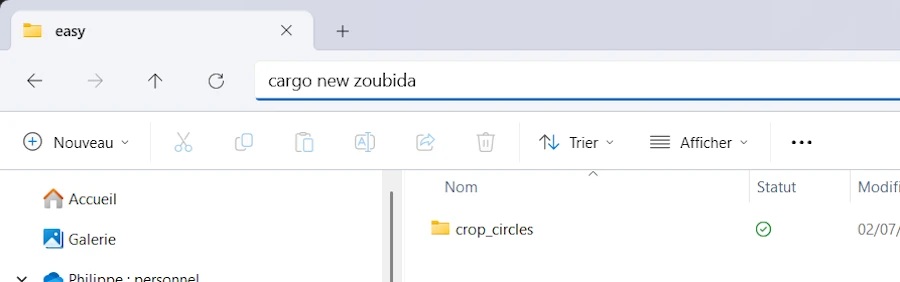
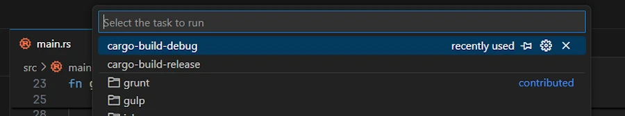

# Rust, mon setup pour CodinGame


## TL;DR
* Mon organisation pour pourvoir développer et déboguer en local mes solutions en Rust aux puzzles de CodinGame

## Introduction
On est en 2025 et je suis toujours en train d'apprendre Rust. Après avoir codé en Rust [les solutions du livre Coding Patterns Interview]() je suis parti faire un tour sur [CodinGame](https://www.codingame.com/home). Personnellement, je ne suis pas fan des tournois et autres "Clash Of Code" mais j'adore y retourner et prendre mon temps pour résoudre un puzzle. J'adore ça.

Le truc, c'est qu'à l'instar de ce que j'ai déjà fait pour les quiz en C++ (voir le challenge [Temperatures sur cette page]()) et Python (voir le [Template sur cette page]()), il faut que je remonte un setup, une façon de travailler. Je suis sous l'excellent Windows 11, j'utilise VSCode et typiquement je veux :
* Un [repo sur GitHub](https://github.com/40tude/rust_codingame)
* Des répertoires Easy, Medium, Hard...
* Un sous-répertoire par puzzle
    * C'est autonome, je peux créer des notebook Jupyter, un répertoire `assets` avec des captures d'écran, des slides...
* Être capable de travailler en local en alimentant le programme avec un fichier `input.txt` par exemple
* Être capable de déboguer dans la joie et la bonne humeur
* Pouvoir sélectionner l'ensemble de la fenêtre de code (CTRL+A) puis coller le tout le dans CodinGame et, zou, je dois être capable de voir si ça répond.
    * Je veux surtout éviter d'avoir à éditer, modifier quand je passe d'un environnement à l'autre
    * Cela sous-entend que l'utilisation du fichier `input.txt` ne doit pas interférer quand on est sur CodinGame
* Alors que je suis au fin fond de mon projet je veux être capable de "commiter"

Je ne vais pas parler du mon Setup VSCode pour coder en Rust. J'ai déjà expliquer tout ça dans ce [post](). Par contre, je viens de terminer un premier puzzle "Easy" (je débute, poussez pas...), le setup semble fonctionner, alors je vais t'expliquer tout ça gentiment.

## Organisation des répertoires

### Phase 1
Là, c'est simple, à la fin je veux un truc comme ça :

```
rust_codingame/
├── .git/
├── .vscode_to_copy/
├── README.md
├── .gitignore
├── easy/
│   ├── projet_01/
│   └── projet_02/
└── medium/
    ├── projet_03/
    └── projet_04/
```
1. Je crée le répertoire `rust_codingame`. Bah si, ça, ça reste quand même gérable...
1. J'ouvre VSCode depuis ce répertoire (`code .` ou click droit "Ouvrir avec Code")
1. Je créé un fichier `README.md` avec bout de texte.
1. Je créé un fichier `.gitignore` qui contient une seule ligne `target/`
    * Ca va éviter de pousser sur GitHub les executables, les fichiers pour le debug etc.
1. Depuis VSCode je crée, je commit et je pousse tout ce petit monde dans un repo public sur GitHub
    * Le répertoire `.git` est créé à ce moment là.

Allez, c'est bon, on a terminé, je quitte VSCode et je vais faire un tour sur GitHub pour voir si tout est OK.


### Phase 2

1. Il est minuit, je viens de rallumer mon PC et on imagine que j'ai décidé de m'attaquer à un puzzle (exemple [Crop-Circles](https://www.codingame.com/ide/puzzle/crop-circles)).
1. Que ce soit avec Terminal Windows ou File Explorer, je vais dans le répertoire `rust_codingame` et je créé un répertoire `easy` (y en avait pas encore)
1. Quand c'est fait je vais dans ce répertoire, et depuis un Terminal Windows je tape `cargo new crop_circles`
    * Au fait tu savais que tu pouvais aussi taper `cargo new zoubida` dans la barre de File Explorer. Vas y, fais le test, je peux pas le faire à ta place...
1. Il est sympa ce Cargo... Il crée tout ce dont on a besoin à commencer par un sous-répertoire `crop_circles`.
1. Je "descends" dans le répertoire du puzzle (`cd .\crop_circles\`) et je lance VSCode depuis ce répertoire (`code .`)
1. Il est possible que VSCode te fasse remarquer qu'il a trouvé un repo Git dans un répertoire parent, blablabla... Tu cliques sur `OK`
1. Bon, du coup, on peut travailler et si tu ouvres dans VSCode un terminal (CTRL+ù) tu peux lancer un `cargo run`. Il va créer les répertoires `target` puis `debug` et tout un ensemble de fichiers dont l'exécutable qu'il va lancer.
1. Avant d'aller plus loin il est temps de faire un commit et de pousser tout ça dans le repo distant.

<div align="center">

</div>


## Github

1. Là, c'est hyper simple
1. CTRL+SHIFT+G pour aller dans la section Source Code Control
1. Un petit message de commit
1. Et tu synchronises.

Avec ce setup, il n'y a pas besoin de remonter dans le répertoire `rust_codingame`. On commit depuis le répertoire du puzzle. Moi je trouve ça bien cool.

## Debug
Pour être tout à fait complet, j'ai essayé de monter un setup à base de Workspace Rust mais bon, ça n'a pas marché. C'était pas adapté à mon mode de fonctionnement. Quoi qu'il en soit, en faisant comme on a fait jusqu'à présent, ça va être relativement simple.
1. Depuis VSCode
1. Si ce n'est pas déjà fait, tu installes l'extension LLDB (bien sûr, tu ne devras le faire qu'une seule fois)
1. Ensuite, tu crées un sous-répertoire `.vscode` dans le répertoire du projet
1. Tu y colles les 2 fichiers ci-dessous
    * Il n'y a aucune modification à faire

### launch.json
```json
{
    "version": "0.2.0",
    "configurations": [
        {
            "type": "lldb",
            "request": "launch",
            "name": "Debug",
            "program": "${workspaceFolder}/target/debug/${workspaceFolderBasename}.exe",
            "args": [],
            "cwd": "${workspaceFolder}",
            "env": {
                "RUST_BACKTRACE": "1"
            },
            "sourceLanguages": ["rust"],
            "preLaunchTask": "cargo-build-debug",

        },
        {
            "type": "lldb",
            "request": "launch",
            "name": "Release",
            "program": "${workspaceFolder}/target/release/${workspaceFolderBasename}.exe",
            "args": [],
            "cwd": "${workspaceFolder}",
            "env": {
                "RUST_BACKTRACE": "1"
            },
            "sourceLanguages": ["rust"],
            "preLaunchTask": "cargo-build-release"
        }
    ]
}

```

### tasks.json
```json
{
    "version": "2.0.0",
    "tasks": [
        {
            "label": "cargo-build-debug",
            "type": "cargo",
            "command": "build",
            "args": [],
            "problemMatcher": [
                "$rustc"
            ],
            "group": {
                "kind": "build",
                "isDefault": true
            }
        },
        {
            "label": "cargo-build-release",
            "type": "cargo",
            "command": "build",
            "args": [
                "--release"
            ],
            "problemMatcher": [
                "$rustc"
            ]
        }
    ]
}
```
#### C'est cadeau ça me fait plaisir
* Dorénavant, si tu appuies sur CTRL+SHIFT+B, tu "build" automatiquement la version de debug.
* Pour retrouver les tasks disponibles, ALT+T puis sélectionne `Run Task...`, tu vois alors les 2 tâches créées.

<div align="center">

<p></p>
</div>


Normalement tout est prêt pour déboguer

1. Mets le curseur sur une ligne du `main.rs` qu'a généré Cargo et pose un point d'arrêt (F9) sur une ligne en question
1. Appuis sur F5 pour lancer le debug
1. Ca démarre puis ça s'arrête sur la ligne où il y a le point d'arrêt. Après tu connais, je ne te fais pas un dessin.

Allez, il est temps de faire un petit commit.

### Faire une copie de .vscode
Comme il faudra copier-coller le répertoire `.vscode` dans tous les projets où tu vas faire du debug (on est d'accord, tu vas pas faire des `eprintln!()` de petit cochon...). Je te propose de copier-coller le répertoire `.vscode` et ses 2 fichiers, deux crans au dessus, dans le répertoire `rust_codingame`. Comme ça tu sauras où aller les chercher.

Bon, ben voilà, y a plus qu'à coder notre solution...

## Travailler en local
Sur CodinGame notre code lit les entrées depuis l'entrée standard et il affiche sa réponse classiquement. Le truc c'est que moi, je veux pas passer ma vie sur le site. Je veux pouvoir travailler chez moi, dans mon environnement VSCode, prendre des notes, faire des exemples complémentaires etc. Surtout, je ne veux pas à avoir à remplir l'entrée standard à la main. Oui, oui, on peut passer des paramètres à l'exécutable lors d'une session de debug (voir la ligne `"args": [],` dans le fichier `launch.json`) mais souvent les entrées sur CodinGame peuvent être assez complexes et ça va pas le faire.

Du coup, il faut que je me débrouille pour leurrer mon code de telle sorte, qu'en local, il aille chercher les paramètres d'entrée dans un fichier 'input.txt' et qu'une fois sur CodinGame il lise les entrées depuis l'entrée standard.

Voilà ce que je propose

```rust
use std::fs::File;
use std::io::{self, BufRead, BufReader};
use std::path::Path;

// Custom function to get the input reader (from file or stdin)
fn get_input_reader() -> Box<dyn BufRead> {
    let path = Path::new("input.txt");
    if path.exists() {
        let file = File::open(path).expect("Failed to open input.txt");
        Box::new(BufReader::new(file))
    } else {
        Box::new(BufReader::new(io::stdin()))
    }
}

fn main() {

    let mut reader = get_input_reader();
    let mut line = String::new();
    reader.read_line(&mut line).unwrap();
    let instructions: Vec<&str> = line.split_whitespace().collect();
    ...
}
```

Commence pas à râler, tu vas voir, c'est pas si compliqué.
1. Côté programme (dans le `main()`), je fais un `reader.read_line(&mut line).unwrap();` qui alimente la variable `line`.
1. Ensuite je manipule cette dernière comme si je l'avais reçue depuis l'entrée standard
    * Par exemple ici je fais un `.split_whitespace()` blablabla.
1. La partie intéressante se trouve dans la fonction `get_input_reader()` car c'est elle qui cache la misère
    * On commence par chercher le fichier `input.txt` en local
    * Si on le trouve le programme obtiendra ses entrées depuis le fichier en question
    * Si le fichier `input.txt` n'existe pas le programme obtient ses entrées depuis `io::stdin()`, aka l'entrée standard

Voici par exemple le contenu de mon fichier `input.txt`

```
jm31 PLANTMOWjm27 PLANTMOWjm23
oe7 fg9 ls11


 PLANTMOWjm19 PLANTMOWjm15 PLANTMOWjm11 PLANTMOWjm7 PLANTMOWjm1

oe7 fg9 ls11

PLANTft9

ft17 PLANTft9 nf17 PLANTMOWnf9 PLANTjm5

fg9 ls11 oe7

```
Pas d'affolement. Dans ce puzzle, seule la première ligne compte. Du coup pour faire des tests je copie colle ce que je trouve sur CodinGame et je mets sur la première ligne les paramètres à utiliser. Les autres lignes on s'en fiche, on ne va pas les lire. Elles peuvent rester là, au cas où.

Ayé, on a une super solution qui donne satisfaction? "Yaka, faukon"... Allez, un petit commit et on teste sur CodinGame.

## Tester sur CodinGame
* Dans VSCode, dans l'éditeur, je fais CTRL+A pour sélectionner tout mon code
* Ensuite je passe sur la page du puzzle, sur le site CodinGame
* Coller (CTRL+V)
* Run

Après tu pleures ou pas selon que ça passe, ou pas.

### Webliography
* Mon [profile](https://www.codingame.com/profile/a61d82b38f87d49d41995f4c632437fb235508) sur CodinGame
* Des [solutions Rust](https://github.com/40tude/rust_codingame)
    * Voir la [section Rust du site]()
* Des [solutions C++](https://github.com/40tude/codingame_cpp)
    * Voir la [section C++ du site]()
* Des [solutions Python](https://github.com/40tude/codingame_py)
    * Voir la [section Python du site]()
