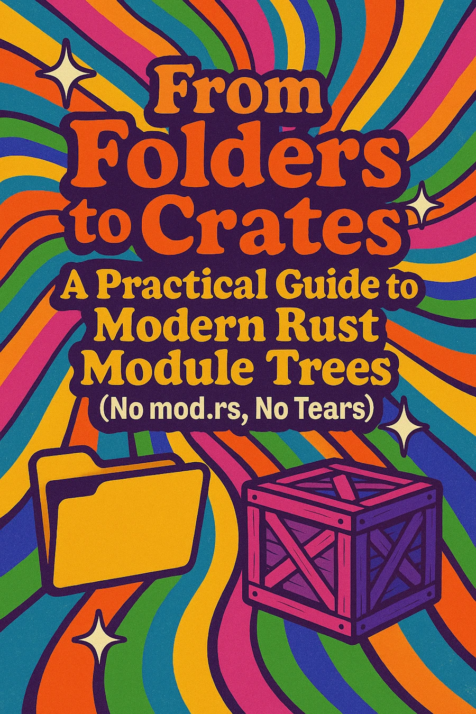
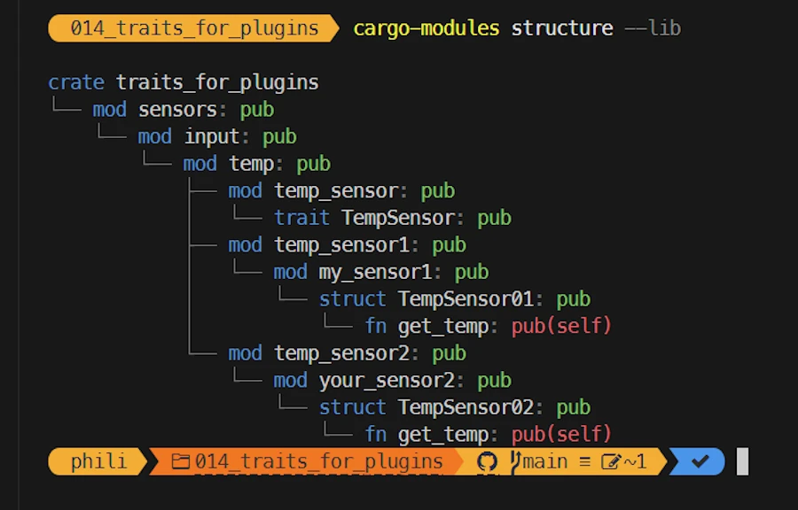
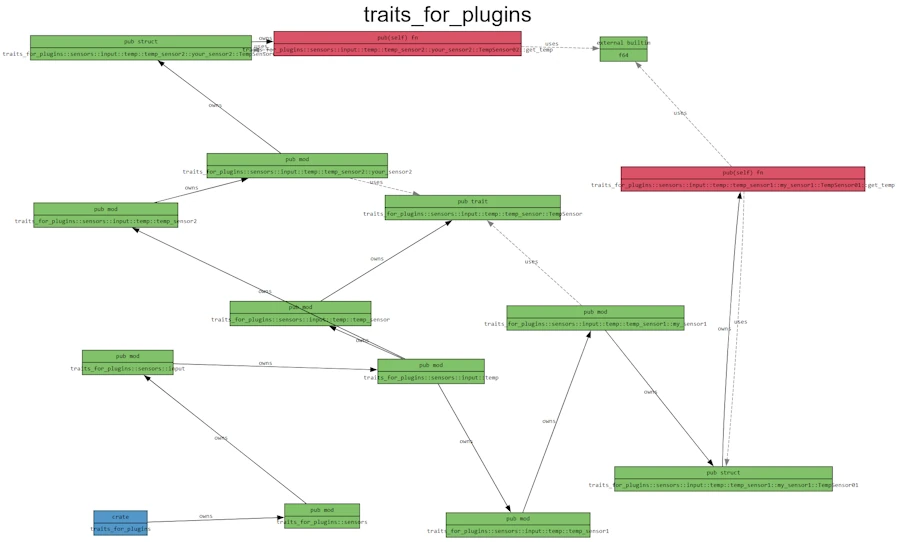

# From Folders to Crates: A Practical Guide to Modern Rust Module Trees (No mod.rs, No Tears)

## TL;DR
* For beginners
* Starting with a hierarchy of directories and files already in place
* A process to make sure the compiler and the linker can build the lib and the app
* Explain the `use ...` statements that help to write easy to read code
* As proposed since 2018+, `mod.rs` files are not used here
* Process
    * You have a sub-directory named `my_dir/`
    * Next to `my_dir/`, create a file `my_dir.rs`
    * Inside `my_dir.rs` declare the modules to add to the module tree (`pub mod zoubida;`)
        * `zoubida` refers to the module defined in `my_dir/zoubida.rs`
        * `my_dir/zoubida.rs` can be either :
            * a regular module file containing code, or
            * a *hub* file that declares further submodules
    * The process starts at the crate root (`lib.rs`)


<div align="center">

</div>


## Introduction
* August 2025
* [p 139 of the Rust Prog Language book](https://doc.rust-lang.org/book/ch07-05-separating-modules-into-different-files.html#alternate-file-paths) they say that using `mod.rs` everywhere is old style, confusing, blah blah blah...
* What?!!! Old style... No way, not for me. I'm a fashion victim and I want to visit Milan, Paris etc.
    * Surprisingly I just `git clone` [Microsoft Edit](https://github.com/microsoft/edit) and it seems they use `mod.rs` everywhere...

<div align="center">

</div>

* More seriously, this side project is the first step of a larger one. Here, once and for all, I want to figure out how to properly build my module tree (at least in a way that works and that I can clearly understand).
* So, below, don't start complaining. The project hierarchy is over complicated for good reasons.
* The project is on [GitHub](https://github.com/40tude/traits_for_plugins_01)


## The context

Imagine...

* Imagine you’re building an application that uses sensors to collect measurements. That’s why there’s a `sensors/` directory.
* All sensors are *input* sensors (not actuators), so you add an `input/` directory.
* Some of the sensors measure temperature. Later, you may add others (pressure, weight, etc.). That explains the `temp/` directory.
* So far, you have two temperature sensors:
  * `TempSensor01` defined in `my_sensor1.rs` inside a `temp_sensor1/` directory
  * `TempSensor02` defined in `your_sensor2.rs` inside a `temp_sensor2/` directory
* To separate usage from implementation, you define a trait `TempSensor` and implement it for both sensors. Thanks to this, from the application’s perspective, using one sensor or the other looks the same:

  ```rust
  let my_temp = my_sensor.get_temp();
  ```

  where `my_sensor` could be either sensor.
* Notice that the sensor file name (for example `my_sensor1.rs`) does **not** match the directory name (`temp_sensor1/`). This is intentional: I want to keep the file hierarchy independent from the module tree and truly understand the differences between both.
* The project also includes both `lib.rs` and `main.rs`, making it a library crate with a binary crate.

Here’s the initial structure:

```
.
│   .gitignore
│   Cargo.lock
│   Cargo.toml
│   README.md
│
├───examples
│       ex_01.rs
│
└───src
    │   lib.rs
    │   main.rs
    │
    └───sensors
        └───input
            └───temp
                │   temp_sensor.rs
                │
                ├───temp_sensor1
                │       my_sensor1.rs
                │
                └───temp_sensor2
                        your_sensor2.rs
```


## The objective

I want to:

* Use the *modern* style of Rust module organization (no more `mod.rs` files).
* Build a module tree so that we can make temperature sensors measurement from both `src/main.rs` and `examples/ex_01.rs`.


## What to keep in mind

* Because the project has both `lib.rs` and `main.rs`, Cargo treats it as a library crate plus a binary.
* The compiler first builds the library, then the binary (using the library’s content).
* The build system doesn’t care about files or directories — it only cares about the **module tree**.


## 1. Building the library (src/lib.rs)

My approach is:

1. Organize the directories however I like.
2. Name the files however I like.
3. Then, use *hub files* to connect everything into a clean module tree.

This way, the build process doesn’t force me into rigid naming conventions — I have flexibility.

The key point: Here I suppose the `sensors/`, `input/`, and `temp/` directories already exist *before* I start working on the build and add the *hub files*.


### Using hub files

The compiler needs a module tree to know how to find and link everything. One simple and scalable way is to use **hub files** — small files that declare which modules exist at a given level.

**Note:**
For what I know, the term *hub files* is absolutely not official. I call these files, *hub files* because they act as connectors in the module tree. As [David Wheeler](https://www.40tude.fr/docs/06_programmation/001_computer_science_vocabulary/computer_science_vocabulary.html#indirection) once said:

> “All problems in computer science can be solved by another level of indirection.”

Don’t worry — this isn’t rocket science. Let’s go step by step.


### Step 1: Starting from `lib.rs`

Right now, `lib.rs` contains one line:

```rust
pub mod sensors;
```

The line `pub mod sensors;` declares the existence and loads a module named `sensors` in the module tree of the current crate (the library crate). The `pub` access specifier make sure that shared symbols of the `sensors` module can be accessed from the current crate using the namespace notation (`sensors::...`)

A module is a namespace and the line brings its content to the local scope (crate root).

<!-- This declares and loads a module called `sensors` in the library crate. -->

By convention, the compiler will first look for `src/sensors.rs`. Since we want a directory instead (`src/sensors/`), we create a *hub file* named `sensors.rs` next to `lib.rs`. `sensors.rs` contains:

```rust
pub mod input;
```

The line declares and loads a module `input` in the module tree under construction. Since the line take place in the module `sensors`, the module `input` is a child of `sensors` and a grand child of crate under construction (library crate).

### Step 2: Going deeper

Inside the `sensors/` directory, we add another hub file, `input.rs`, because there is an `input/` subdirectory. `input.rs` contains:

```rust
pub mod temp;
```

I guess you know the song... The line declares and loads a module `temp` in the module tree under construction. Since the line take place in the module `input`, the module `temp` is a child of `input`. Check the module tree below.


Inside the `input/` directory, we create a hub file named `temp.rs` next to the `temp/` directory. `temp.rs` contains three lines:

```rust
pub mod temp_sensor;  // The trait lives here
pub mod temp_sensor1; // Concrete sensor #1 (folder-backed)
pub mod temp_sensor2; // Concrete sensor #2 (folder-backed)
```
The 3 lines above declares and loads 3 different modules (`temp_sensor`, `temp_sensor1` and `temp_sensor2`). They are children of the `temp` module.

In the `temp/` directory we find:

* `temp_sensor.rs` defines the `TempSensor` trait.
* We also create hub files `temp_sensor1.rs` and `temp_sensor2.rs` because there are subdirectories `temp_sensor1/` and `temp_sensor2/`.

Content of `temp_sensor1.rs`:

```rust
pub mod my_sensor1;
```

The line declares and loads a module `my_sensor1` in the module tree under construction. Since the line take place in the module `temp_sensor1`, the module `my_sensor1` is a child of `temp_sensor1`.

Content of `temp_sensor2.rs`:

```rust
pub mod your_sensor2;
```
Same reasoning apply here, the module `your_sensor2` is a child of `temp_sensor2`.

When the compiler reads `temp_sensor1.rs`, it looks inside the `temp_sensor1/` directory and finds `my_sensor1.rs`, which defines `TempSensor01` and implements the trait `TempSensor` for it (same logic for `TempSensor02`).

At the end of the tree, the directories contain the actual sensor implementations:

```
temp_sensor1/
    my_sensor1.rs
temp_sensor2/
    your_sensor2.rs
```


### Step 3: Using the trait

Inside `my_sensor1.rs`

```rust
use crate::sensors::input::temp::temp_sensor::TempSensor;
pub struct TempSensor01;

impl TempSensor for TempSensor01 {
    fn get_temp(self) -> f64 {
        142.0
    }
}
```

We can bring the trait `TempSensor` into scope like this:

```rust
use crate::sensors::input::temp::temp_sensor::TempSensor;
```

Notice: we don’t write `use CRATE_NAME::...` where `CRATE_NAME` would come from `Cargo.toml`. Instead, we use `crate::...` to refer to the current crate under construction (the library crate).


### Wrapping up

At this point:

* The module tree is fully built.
* The compiler and linker can happily do their work.
* The library is compiled and stored on disk (`target/debug/libtraits_for_plugins.rlib`)

At the end, once hub files are added, the directory looks like this:

```
.
│   .gitignore
│   Cargo.lock
│   Cargo.toml
│   README.md
│
├───examples
│       ex_01.rs
│
├───src
│   │   lib.rs
│   │   main.rs
│   │   sensors.rs
│   │
│   └───sensors
│       │   input.rs
│       │
│       └───input
│           │   temp.rs
│           │
│           └───temp
│               │   temp_sensor.rs
│               │   temp_sensor1.rs
│               │   temp_sensor2.rs
│               │
│               ├───temp_sensor1
│               │       my_sensor1.rs
│               │
│               └───temp_sensor2
│                       your_sensor2.rs
│
└───target
```

The module tree looks like this :

```
crate (lib.rs)
└── sensors (sensors.rs)
    └── input (input.rs)
        └── temp (temp.rs)
            ├── temp_sensor       (temp_sensor.rs, trait definition)
            ├── temp_sensor1      (temp_sensor1.rs → loads folder temp_sensor1/)
            │   └── my_sensor1    (my_sensor1.rs, implements TempSensor01)
            └── temp_sensor2      (temp_sensor2.rs → loads folder temp_sensor2/)
                └── your_sensor2  (your_sensor2.rs, implements TempSensor02)
```


### Tips'n Tools
* `CTRL+ù` (FR keyboard) to open a terminal in VSCode
* `cargo install cargo-modules`
* [Read the documentation](https://crates.io/crates/cargo-modules)
* `cargo-modules structure --lib`

<div align="center">
<br/>
<!-- <span>Optional comment</span> -->
</div>

**What does it show?**
* This is the complete module tree of the lib (see the `--lib` in the command) in Technicolor!
* Should be enough most of the time

You can also try this:
* `cargo-modules dependencies --lib`
* Copy the output text from the console
* Paste it in [this page](https://dreampuf.github.io/GraphvizOnline/)


<div align="center">

</div>

**What does it show?**

* Each box (node) is a module, trait, struct, or function.
* Each edge (arrow) describes a relationship:
    * owns → parent contains the child (module owns a submodule, struct owns a method, etc.).
    * uses (dashed line) → one element depends on another (e.g. my_sensor1 uses TempSensor).

The output file basically says:
* crate traits_for_plugins → owns sensors → owns input → owns temp → etc.
* TempSensor01 implements TempSensor.
* get_temp() returns an f64.

The graph is a full semantic map of the crate.


## 2. Building the binary (`src/main.rs`)
* It should be clear by now that the binary and the library are 2 different beasts
* This is why, in `main.rs`, we **cannot** write `use crate::...`. Instead we write `use CRATE_NAME::...` where `CRATE_NAME` is defined by the line `[package] name = "..."` in `Cargo.toml` (in our case `traits_for_plugins`).


```rust
// main.rs
use traits_for_plugins::sensors::input::temp::temp_sensor::TempSensor;
use traits_for_plugins::sensors::input::temp::temp_sensor1::my_sensor1;

fn main() {
    let my_sensor = my_sensor1::TempSensor01;
    let my_temp = my_sensor.get_temp();
    println!("{my_temp}");
}
```

Indeed, `main.rs` is a *client* of `lib.rs` and it does not see the internal modules via `crate::...` directly. In `main.rs`, `crate::...`  refers to the binary crate itself, **not** to the library defined in `lib.rs`.

To make a long story short:
* Since there a `main.rs` next to `lib.rs`
* In `main.rs` we write the `use` statements considering `main` as an external module/namespace
* We use the crate name (the one defined in `[package] name = "..."` in `Cargo.toml`).
* And yes, by default, if both `lib.rs` and `main.rs` exist, the library and the binary crates share the same name (`libtraits_for_plugins.rlib` and `traits_for_plugins.exe`). This can be overridden in `Cargo.toml`.

```toml
[[bin]]
name = "MyApp"  # name of the executable (MyApp.exe under Windows)
path = "src/main.rs"

[lib]
name = "MySuperLib"  # name of the lib (MySuperLib.lib under Windows)
path = "src/lib.rs"

```


## 3. Building the example (`examples/ex_01.rs`)
* The example is clearly a *client* of the lib
* All that we already know about `src/main.rs` apply to `examples/ex_01.rs`
* This includes the line `use crate_name::...`


## What's next?
* `git clone` the [project](https://github.com/40tude/traits_for_plugins_01)
* Forget about the code it should work
* Rename everything (files, directories), add sub-directories etc.
* Break everything
* Then make it work and make it great again


## Checklist

You start with:

```
src/
├── lib.rs
└── parent_dir/
    └── child_dir/
        └── grandchild/
            ├── foo.rs
            └── bar.rs
```

### Expose `parent_dir/`
* Add to `src/lib.rs` the line `pub mod parent_dir;`
* Create a hub file `src/parent_dir.rs`.
* Content of `parent_dir.rs` = `pub mod child_dir;`

### Expose `child_dir/`
* Create a hub file `src/parent_dir/child_dir.rs`.
* Content of `child_dir.rs` = `pub mod grandchild;`

### Expose leaf level `grandchild/`
* Create a hub file `src/parent_dir/child_dir/grandchild.rs`.
* Content of `grandchild.rs` =
    ```rust
    pub mod foo;
    pub mod bar;
    ```

Final module tree:

```
src/
├── lib.rs                (crate root, declares `pub mod parent_dir;`)
├── parent_dir.rs         (hub for directory parent_dir/)
└── parent_dir/
    ├── child_dir.rs      (hub for directory child_dir/)
    └── child_dir/
        ├── grandchild.rs (hub for directory grandchild/)
        └── grandchild/
            ├── foo.rs    (leaf module)
            └── bar.rs    (leaf module)

```

### Using modules
From anywhere you can now do: `use crate::parent_dir::child_dir::grandchild::foo;`


### General Rules
* One directory → one hub file in its parent
* Hub file name = directory name + `.rs`
* Hub file content = `pub mod ...;` for every child module (files + subdirectories)
* Leaf files don’t need hubs (just `foo.rs`)
* Don’t mirror blindly — only expose what you want public


## Exercice

You are given the hierarchy below:

```
src/
├── lib.rs
└── animals/
    ├── animals.rs
    ├── cat/
    │   ├── cat.rs
    │   └── persian.rs
    └── dog.rs
```

Questions:
1. For each directory/file, explain what it is , what it contains and why...
1. Draw the module tree


* `lib.rs` → `pub mod animals;`

* `animals.rs` →

  ```rust
  pub mod cat;
  pub mod dog;
  ```

* `cat.rs` →

  ```rust
  pub mod persian;
  ```

Module tree:

```
crate
└── animals
    ├── cat
    │   └── persian
    └── dog
```


<!--
---
## How to name a trait ? (by Chat GPT)

## Do / Don’t cheatsheet

**Do**

* Name traits with **nouns** (capabilities) or **adjectives** (markers).
* Name methods with **clear verbs** in `snake_case`.
* Use `as_/to_/into_` consistently for borrowing/owning/consuming conversions.
* Use `try_*` for fallible operations returning `Result`.
* Use `*Ext` for extension traits that add convenience APIs.
* Keep traits focused and methods symmetric.

**Don’t**

* Don’t use `-able` suffixes by default (`Readable`, `Iterable`) — unidiomatic.
* Don’t prefix getters with `get_` unless signaling *checked lookup* (`get`, `get_mut`).
* Don’t repeat the trait name inside method names (avoid stutter).
* Don’t pack unrelated behaviors into one “mega-trait”.

---

## Practical naming templates

* Capability: `Read`, `Write`, `Render`, `Encode`, `Decode`, `Validate`, `Persist`
* Marker: `Clone`, `Copy`, `Debug`, `Send`, `Sync`, `Sized`
* Extension: `FooExt`, `IteratorExt`, `HttpExt`
* Methods: `read`, `write`, `render`, `encode`, `decode`, `validate`, `persist`, `open`, `close`, `start`, `stop`
* Conversions: `as_x`, `to_x`, `into_x`
* Fallible: `try_x`
* Checked access: `get`, `get_mut`


---


## Detailed explanations

### 1) Prefer short **nouns** (or noun-like) for capabilities

* Good: `Read`, `Write`, `Display`, `Iterator`, `Borrow`, `AsRef`, `Deref`, `Drop`, `Hash`, `Eq`, `Ord`
* Avoid: `Readable`, `Iterable`, `Hashable` (the `-able` suffix is rare in Rust)

### 2) Use **adjectives** for marker traits (no required methods)

* Good: `Send`, `Sync`, `Sized`, `Unpin`, `Clone`, `Copy`, `Debug`
* These communicate a property/type marker rather than a behavior API.

### 3) Use `*Ext` for **extension traits**

* Example: `IteratorExt`, `HttpClientExt`
* These add convenience methods to an existing type/trait without forcing blanket impls in user code.

### 4) Use `*Mut` when the trait clearly implies mutability compared to a base trait

* Example: `Borrow` vs `BorrowMut`.

### 5) Avoid prefixing the trait name in its methods

* If the trait is `Read`, the method should be `read`, not `read_read` or `read_from_reader`.

### 6) Keep the **scope tight**

* A trait should express a single responsibility (coherent “capability”). If you feel you need many unrelated methods, split the trait.

---

## How to name trait methods

### 1) Methods are **verbs** in `snake_case`

* `read`, `write`, `flush`, `render`, `validate`, `persist`, `fetch_next`

### 2) Use the standard conversion triad carefully

* `as_*` — cheap borrow/view (no allocation), e.g., `as_str`
* `to_*` — cheap if possible, otherwise **clones/allocates** to produce an owned value, e.g., `to_string`
* `into_*` — **consumes** `self` to produce a new owned value, e.g., `into_string`

### 3) Use `try_*` for fallible actions returning `Result<_, E>`

* e.g., `try_reserve`, `try_parse`

### 4) Getter conventions

* Simple accessors: **no `get_` prefix** — `len()`, `capacity()`, `is_empty()`
* Use `get` when it signals *checked lookup* (often returning `Option`): `get(index)`, `get_mut(index)`

### 5) Mutability reveals intent

* Non-mutable view: `as_*`
* Mutable view: `as_*_mut` or `get_mut`
* Consuming: `into_*`

### 6) Pairs and symmetry help

* If you have `start()` then usually also `stop()`/`shutdown()`
* If you have `open()` then usually `close()`
* Keep names parallel across methods.

### 7) Avoid stutter

* If the trait is `Render`, method should be `render()`, not `render_render()` or `do_render()`.

---

## Associated items inside traits

* Associated types: short, generic, and conventional: `type Item`, `type Error`
* Type parameters: `T`, `U`, `E`, `K`, `V` (domain-specific names are OK if clearer)
* Associated consts: `UPPER_SNAKE_CASE`

---

## Small examples

### Capability trait (noun) + verb methods

```rust
pub trait Render {
    /// Render into the provided target. Returns the number of bytes written.
    fn render(&self, target: &mut Vec<u8>) -> Result<usize, RenderError>;

    /// Render directly to stdout as a convenience.
    fn render_stdout(&self) -> Result<(), RenderError>;
}
```

### Marker trait (adjective) with no methods

```rust
/// Types that are safe to persist as-is without redaction.
/// Marker trait: no required methods.
pub trait PersistSafe {}
```

### Extension trait pattern

```rust
/// Extra convenience methods on `Iterator`.
pub trait IteratorExt: Iterator {
    /// Collect into a `Vec` and assert non-empty.
    fn collect_non_empty(self) -> Result<Vec<Self::Item>, &'static str>
    where
        Self: Sized,
    {
        // NOTE: Uses standard semantics: consumes `self`.
        let v: Vec<_> = self.collect();
        if v.is_empty() { Err("empty") } else { Ok(v) }
    }
}

impl<I: Iterator> IteratorExt for I {}
```

### Conversions (as\_/to\_/into\_)

```rust
pub trait AsBytes {
    /// Borrowing view, no allocation.
    fn as_bytes(&self) -> &[u8];
}

pub trait ToBytes {
    /// May allocate/clone to produce owned bytes.
    fn to_bytes(&self) -> Vec<u8>;
}

pub trait IntoBytes {
    /// Consumes `self` to produce owned bytes.
    fn into_bytes(self) -> Vec<u8>;
}
```
 -->
