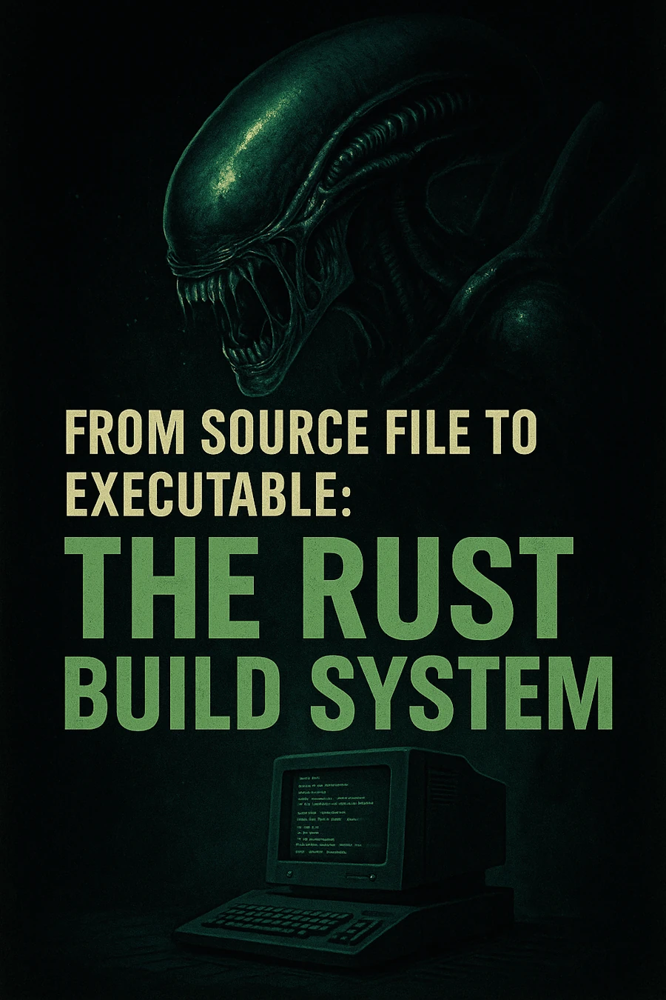
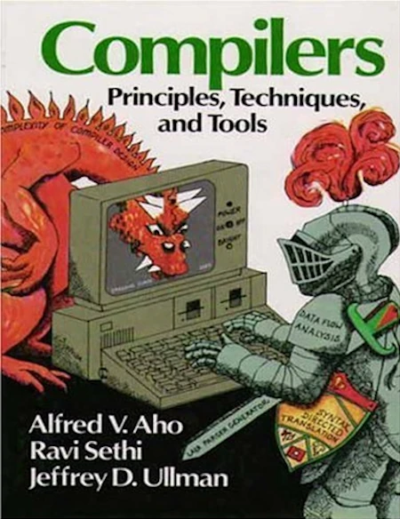
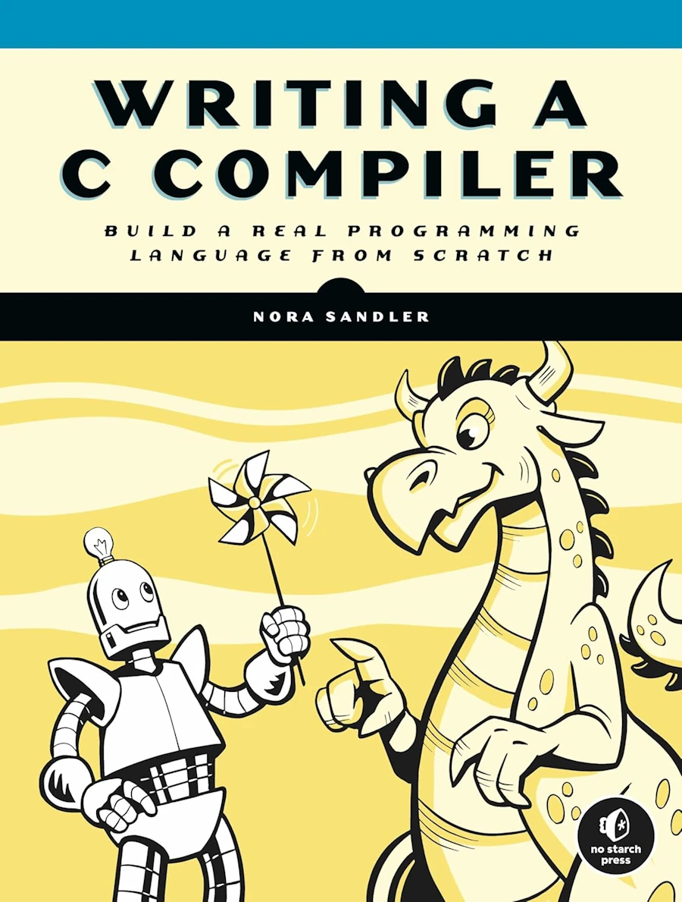
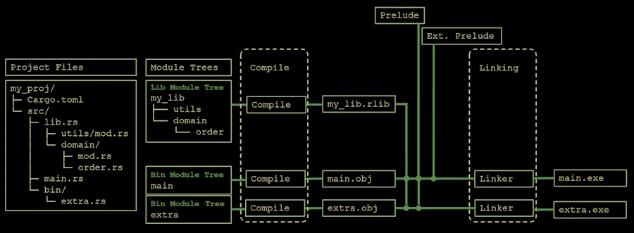

# From Source File to Executable: A Gentle Walk Through the Rust Build System

<!-- <h2 align="center">
<span style="color:orange"><b>This post is still under construction.</b></span>    
</h2> -->


## TL;DR
* For beginners
* Explain how Cargo builds crates and how they get linked into executables or libraries
* Do not explain how to navigate the module tree to call a function or how to decide what’s visible to the outside world. Read this [post]() instead.

<div align="center">
<br/>
<!-- <p>2024...</p> -->
</div>


## Introduction
In this [post]() and this [one]() I had the opportunity to say few words about the Rust build system. I mean the process by which source files are compiled into object code, linked, and turned into executables or libraries. During this process, Cargo, `rustc` and the linker are working together. 

Understanding how this pipeline works is more than just trivia. It helps explain why Rust feels different from languages like Python, C#, or Java, and why certain patterns in Rust make sense only when you know what happens under the hood.

So why should you care about the Rust build system? Here are three good reasons:

1. **Better error handling** – Many of Rust’s compile-time errors (ownership, lifetimes, borrowing, threading issues) come directly from how the compiler transforms your code. Knowing the steps makes the error messages less mysterious.

2. **Smaller and faster binaries** – Understanding dependency resolution, features, and linking helps you control binary size and performance. For example, choosing the right crate features can literally remove chunks of code from the final executable.

3. **Sharper debugging skills** – When something goes wrong (strange linker error, missing symbol, unexpected binary growth), having a mental model of the build process helps you diagnose and fix the problem quickly.

In the rest of this article, we’ll start simple—with just one source file—and progressively add modules, external crates, a library crate, and multiple binaries. Step by step, we’ll see how Cargo and `rustc` turn Rust code into something your processor can run.


## Why do you say “building code"?

If you come from a Python background, you might be wondering what I mean by *building code*, or why it even matters. Before to dive in, let’s take a step back.

When you run a Python program with:

```bash
python my_app.py
```

you are not actually *executing the source code directly*. What happens instead is that the **Python interpreter** reads your code line by line, parses it, understands it, and executes it on the fly. Double check the line above. We pass the source code `my_app.py` as an argument to `python.exe`, the interpreter. In plain English we are saying : "Hey, mister Python, please open and load my source file `my_app.py` then execute the lines one by one. 

This design has key advantages:

* It’s flexible and interactive — you can try out ideas quickly.
* You don’t need a special build step before running your program.

But it also comes with downsides:

* **Errors show up at runtime**. If you forgot a variable name or mismatched types, you only discover it when that line of code runs. Personally, I hate that, but I suppose it's because of my background in C/C++.
* **It’s slower**. Each line has to be parsed and interpreted before execution.

Other ecosystems have taken different approaches to balance these trade-offs. For example, in TypeScript the source code is *transpiled* into JavaScript. This allows type errors to be caught early, but at the end of the day the output is still JavaScript source code. And even though modern JavaScript engines are extremely fast, the code is still interpreted. By contrast, in **C#** or **Java**, the source code is compiled into an **intermediate language** (bytecode). The compiler verifies the code up front (so many errors are caught earlier), and at runtime a virtual machine executes this bytecode, often with just-in-time optimizations. This is much faster than pure interpretation, but the CPU still isn’t running the instructions directly.

In languages like **C** (78) and **C++** (85), the model is different again. The compiler translates the source code straight into **machine instructions** that the processor can run directly. This is not assembly language (`push rbp`) this is machine code (48 89 E5). The build step takes more time, but the payoff is speed at runtime. 

This is where **Rust** (06) comes in. Like C and C++, Rust compiles down to native machine code, so execution is fast. But Rust adds something unique: **a compiler that enforces strong guarantees** about memory safety, lifetimes, and concurrency. That means many classes of bugs (dangling pointers, data races, invalid memory accesses) are caught at compile time, before your program ever runs. Of course, dividing by zero will still be an error — but with Rust you get both:

* The speed of native code,
* And the safety of a compiler that’s actively looking out for you.

This transformation — from source code into an executable file that the processor can run directly — is what we call **the build process**. And that’s exactly what we’re going to explore in the rest of this post.

PS : In Rust if you divide an int by 0, you get an error from rustc (``attempt to divide by zero``) but you got the idea : Compilers make sure the good things happen — the logical errors are on you.


## Simple case - `src/main.rs` only

Suppose we have a Rust project with only one `main.rs` file. No other files. There aren't even any modules defined in `main.rs` or any external crates such as `uuid`. 

In that case the process is "straightforward":

1. **Parsing & expansion**: The compiler reads `main.rs` which is the root of the crate (binary crate here). Then the compiler expands macros, and inserts the prelude (basic std items automatically in scope).
2. **HIR/MIR/LLVM IR**: It goes through its internal stages (HIR → MIR → LLVM IR).
3. **Codegen**: Everything needed (our code + prelude symbols + whatever `std` pulls in) is lowered to machine code.
4. **Linking**: The linker is invoked with a single object file plus the standard library crates (`std`, `core`, `alloc`, etc.), which are precompiled and shipped with Rust.
5. **Output**: We get a binary on the disk (`target/debug/my_app.exe` under WIN11 for example)


<div align="center">
<br/>
<span>1986...</span>
<!-- <p>1986...</p> -->
</div>


### Note - Build pipeline
When I say "straightforward" it is a lie. Here is the Rust build pipeline and its main steps and tools involved. 

|Stage	                         | Quick description  |
|:-------------------------------|:-------------------|
| Lexing / Parsing 	             | The source code is tokenized then organized |
| AST Construction	             | Construction of an Abstract Syntax Tree (AST) |
| Name Resolution	             | Resolving paths ( ``foo::bar``), variables, modules |
| Type Checking	                 | Each expression, function, variable is strictly typed |
| Trait Resolution	             | Traits constraints are checked |
| Lifetime Analysis	             | Analysis of lifetimes ( ``'t``, etc.) for references |
| Borrow Checking	             | Ensures that there are no mutability or aliasing conflicts |
| Const Evaluation	             | ``const`` are calculated for validation |
| MIR Construction	             | Rust transforms the code into an intermediate representation optimized for analysis (the MIR) |
| MIR Optimizations	             | Rust optimizes the MIR before passing it to LLVM (low level virtual machine, see clang for example) |
| Code Generation (LLVM IR)	     | Rust generates LLVM intermediate code |
| LLVM Optimizations	         | LLVM optimizes even more |
| Machine Code	                 | The binary code is produced |

### More infon about the Build pipeline 

**Lexing / Parsing**

*Lexing* (lexical analysis) turns raw source code (characters) into a stream of tokens (keywords, identifiers, operators). *Parsing* then organizes these tokens into a structured form according to Rust’s grammar. This is the first step where the compiler starts to “understand” our code rather than just read text.

**AST Construction**

**AST** stands for *Abstract Syntax Tree*. It’s a tree-like representation of the source code structure (functions, blocks, expressions). The AST is easier for the compiler to analyze than raw text and becomes the foundation for later stages of analysis.

**Name Resolution**

This stage ensures that when we write `foo::bar`, the compiler knows exactly which module, function, or variable we are talking about. It walks the module tree, handles imports (`use`), and checks visibility. If something can’t be resolved, we will get errors like *cannot find function in this scope*.

**Type Checking**

Rust enforces strict typing. At this stage, the compiler verifies that each expression and variable has a consistent type and that function calls match their signatures. This is where type inference also happens: the compiler deduces types when we don’t explicitly write them (similar to what happen with `auto` in C++)

**Trait Resolution**

Traits in Rust are like contracts for behavior. Here the compiler ensures that when we call a method on a type, the required trait implementation exists. This is also where generic type constraints are enforced (`T: Display`). If a trait bound is missing, you’ll see errors about methods not being found.

**Lifetime Analysis**

Rust uses explicit lifetimes (like `'a`) to reason about how long references are valid. This stage checks that references don’t outlive the data they point to. It’s an important step for memory safety, ensuring no “dangling pointers” can exist at runtime.

**Borrow Checking**

The borrow checker enforces Rust’s rules about ownership, borrowing, and mutability. It ensures we never have two mutable references at the same time or a mutable and immutable reference to the same data. This is the core of Rust’s promise: memory safety without a garbage collector.

**Const Evaluation**

**Const evaluation** computes constant expressions at compile time. If we write `const N: usize = 1 + 2;`, the compiler will evaluate `1 + 2` before the program ever runs. It’s also used to validate that constants used in array sizes, generics, or attributes are valid and safe.

**MIR Construction**

**MIR** stands for *Mid-level Intermediate Representation*. It’s a simplified version of our program designed for easier analysis and optimization. The compiler lowers the AST into MIR to perform checks (like borrow checking) and prepare for backend code generation.

**MIR Optimizations**

Once MIR is built, Rust applies optimizations such as removing dead code, simplifying control flow, and improving memory usage. These optimizations happen before handing things over to LLVM. This keeps the final machine code leaner and often faster.

**Code Generation (LLVM IR)**

The compiler translates MIR into **LLVM IR** (*Low-Level Virtual Machine Intermediate Representation*). LLVM IR is a portable, assembly-like language that LLVM understands. It bridges the gap between Rust’s high-level checks and actual machine code generation.

**LLVM Optimizations**

LLVM applies its powerful set of optimizations to LLVM IR: inlining functions, eliminating redundant calculations, and rearranging instructions for efficiency. Many of the performance wins in Rust programs come from this stage.

**Machine Code**

Finally, LLVM lowers the optimized IR into actual **machine code instructions** for the target architecture (x86, ARM, etc.). This produces object files, which the linker later combines into our final executable. At this point, our program is something the CPU can run directly.


### From Machine Code to Object File Format

When we say “Machine Code” in the compiler pipeline, we usually mean **raw instructions for the target CPU architecture** (x86-64, ARM, etc.). But... But the CPU can’t just “run a blob of instructions” — those instructions must be wrapped into a proper **object file format** that the operating system and linker understand.

* **On Windows (MSVC toolchain)** → object files use the **COFF** format (*Common Object File Format*).
* **On Linux** → object files use **ELF** (*Executable and Linkable Format*).
* **On macOS** → object files use **Mach-O**.

#### Who does it, and when?

* **LLVM backend (part of `rustc`)**

  * After all MIR → LLVM IR → LLVM optimizations, LLVM’s *codegen backend* runs.
  * It emits not only the machine instructions, but also the full **object file** (with symbol tables, relocation info, section headers) in the format appropriate for the target OS/ABI.
  * That’s why after a successful `cargo build`, we often find intermediate `.o` or `.obj` files in `target/` (depending on your platform).

* **The linker (system linker or `lld`)**

  * Takes these `.o`/`.obj` files and combines them into the final executable (EXE, ELF binary, Mach-O binary).
  * The linker doesn’t generate object files — it consumes them.


#### Timeline 

From the previous table:

1. MIR → LLVM IR → LLVM Optimizations
2. **Machine Code** → This is *already* instructions plus the wrapping into an object file format (COFF/ELF/Mach-O). LLVM does both.
3. Then → The linker combines those object files with libraries into the final binary.


### The right way to describe what happens is:

* The **compiler (via LLVM)** produces **object files** (`.o`/`.obj`) that contain machine code in the right **container format** (COFF, ELF, Mach-O).
* The **linker** takes those object files and builds the final **executable** or **library**.


<div align="center">
<br/>
<span>2024...</span>
</div>


## Adding one file (`src/file01.rs`)

What happens if the project is made of a `main.rs` and `file01.rs` with one function `fn01()`? 

In fact the situation remains very similar. Indeed, when we add another file like `file01.rs` and declare it in `main.rs` with

```rust
mod file01;
```

The compiler does the following:

1. **Module tree building**:

   * `main.rs` is still the root of the crate (binary crate here).
   * The `mod file01;` declaration tells the compiler to load `file01.rs` as a child module.
   * The compiler inserts its contents into the module tree during compilation (not at link time).

2. **Name resolution**:

   * All functions, structs, etc. declared in `file01.rs` become available under the `file01` module path.
   * Since the compiler sees both files in a single **compilation unit** (one crate), it knows all the symbols.

3. **Codegen**:

   * Internally, the compiler generates a single object file for the entire crate.
   * Both `main.rs` and `file01.rs` are part of that same object file.

4. **Linking**:

   * Just like before, the linker sees *one* object file for our crate + the precompiled standard library crates.
   * Nothing extra is added because we haven’t introduced an external crate yet.

From the build system point of view, the only thing that matters is the **module tree**. Can I build a tree with all the modules, all the functions, traits, structures...? If yes, then I know who is who, who call who and I can try to compile/link the code. 

It is important to understand that on one hand, as a developer, I can use many different files, libraries... Organize these files in a hierarchy of directories and sub-directories BUT... At the end of the day, the only thing that matters for the build system is the module tree. So as a developer I must understand what a module tree is and I must provide the information required by the build system so that it can create the module tree in memory. If needed read this [post]() which talks more specifically of the module tree.

Anyway, even with 2 source code files, the life is easy, we are still in the “all-in-one” world: one crate, one object file, one binary.


## `cargo add uuid --features "v4"`

What happens when I add an external crate like `uuid` in `Cargo.toml`? 

```rust
cargo add uuid --features "v4"    
```

If you don't know yet, [uuid](https://crates.io/crates/uuid) is an easy to use crates which generates 128 bits unique Id (`67e55044-10b1-426f-9247-bb680e5fe0c8` is an example).

1. **Dependency resolution**

   * Cargo downloads and builds `uuid` (and its dependencies) into `target/`.
   * Each of those crates is compiled separately into its own `.rlib` (Rust static library).

2. **Crate graph**

   * Our crate now has a dependency edge to `uuid`.
   * The compiler builds the module tree for our crate, and when it sees `use uuid::...`, it knows to import from that external crate.

3. **Codegen for our crate**

* Our crate is still compiled into a single object file.
* When our code calls into `uuid`, the compiler generates a **symbol reference**, not a direct memory address.
  You can think of it like this: in the object file there is an instruction such as `call new_v4`, but at this point it’s only a placeholder.
* Why? Because during compilation the compiler does not know where the function `Uuid::new_v4` will actually live in memory. It only knows that such a function exists, and it leaves a symbolic marker for it.
* The job of resolving that marker is deferred to the linker.

4. **Linking**

* The linker takes our object file **plus** the precompiled object files (`.rlib`s) for `uuid` (and transitively `rand`, `getrandom`, etc., if needed).
* These get combined into the final executable.

You can think of this phase as follows:

* The linker looks at the unresolved symbol `new_v4` in our object file.
* It searches through `uuid.rlib` until it finds the corresponding compiled function.
* If that function itself depends on other code (e.g., random number generation), the linker pulls in those object files as well.
* Then it “glues everything together” into the final program.

At this stage the linker knows exactly how the operating system will load the program in memory. That means it can compute the final address of `Uuid::new_v4()` in the executable and replace the placeholder `call new_v4` with the correct instruction: **“call the code at memory address X.”**

We should keep in mind:
* **Compiler:** translates code and leaves symbolic calls.
* **Linker:** resolves symbols, pulls in needed code, and patches the calls with real addresses.


Conceptually, nothing “magical” changes — the module tree expands to include external crates, but after that the same process applies: all symbols are resolved, everything is lowered to object files, and the linker glues them together.


### Note - extern prelude

When we declare a dependency like `uuid` in `Cargo.toml`, Cargo/rustc automatically puts that crate into the **extern prelude**. That means:

* You can refer to items starting with the crate name (`uuid::Uuid::new_v4()`) **without writing `extern crate uuid;`** (that was needed before Rust 2018).
* The extern prelude is basically a set of crate roots that are available to us by default, once the dependency is declared (via `Cargo.toml`)
* We don’t strictly need `use uuid::Uuid;` if we are fine with fully qualified calls.

So yes — both work:

```rust
// Without `use`, fully qualified
let id = uuid::Uuid::new_v4();
```

```rust
// With `use`, shorter
use uuid::Uuid;
let id = Uuid::new_v4();
```
Most developers still prefer the `use` form because it shortens the function calls and improves readability. 


## What happens when I specify `--features "v4"` ?

In Rust, **features** in `Cargo.toml` act like switches that enable or disable optional parts of a crate. For `uuid`, if we write something like:

```toml
[dependencies]
uuid = { version = "1", features = ["v4"] }
```

We are telling Cargo: *“I only want the functionality required to generate UUID v4.”*

Here’s what happens:

1. **Dependency graph trimming**

   * Without specifying features, `uuid` might bring in extra code (e.g. parsing, formatting, v1/v3/v5 generation, maybe even `serde` if enabled).
   * By selecting only `v4`, Cargo compiles just the parts of `uuid` needed for random v4 generation, leaving the rest out.

2. **Compilation**

   * The crate is built with conditional compilation (`#[cfg(feature = "v4")]`), so only the relevant source files/functions are included.
   * This means fewer symbols, less code generated, shorter compilation time.

3. **Binary size**

   * Since Rust does whole-program optimization (especially in release builds), unused code tends to get eliminated anyway.
   * But **feature flags prevent code from ever being compiled in the first place**, which can cut down both build time and binary size.

So choosing features like `v4` is about tailoring the crate to our actual needs so we don’t carry around unnecessary baggage.


## What happens if I specify `--features "v4,v7"` but only use v4 function calls?

The final EXE will not “paste in all of `uuid`.” Even if we enable `v4` and `v7`, but only call v4 APIs, the linker will only pull in the pieces that are actually referenced.

Here’s what happens under the hood:

* **`uuid` builds as an `.rlib`** (a static archive of object files). With both `v4` and `v7` features enabled, both code paths are compiled **into the archive**, but that doesn’t mean they all end up in our EXE.

* **Archive extraction rule:** linkers (MSVC on Windows, GNU/LLD on Linux) scan the archive and **extract only object files that satisfy unresolved symbols**. If we never reference any `v7` symbol, the object(s) that contain only `v7` code aren’t pulled in.

* **Function-level GC:** once the needed objects are selected, **dead code elimination** kicks in:

  * MSVC: `/OPT:REF` removes unreferenced functions/data inside those objects.
  * GNU/LLD: `--gc-sections` removes unused sections (rustc compiles with function/data sections so this works well).
  * In **release** builds this is on by default, so unused items are stripped.

* **LTO (Link Time Optimization) makes it even tighter:** enabling `lto = "thin"` (or `true`) lets LLVM see across crate boundaries and DCE (Dead Code Elimination) even more aggressively. Pairing with `codegen-units = 1` can squeeze a few extra kB. (`panic = "abort"` also trims size.)

Feel free to [read this page](https://doc.rust-lang.org/cargo/reference/profiles.html#lto).

Caveats worth knowing:

* **Build time vs. binary size:** enabling `v7` still means that code **compiles** (so build time and incremental artifacts grow), but it won’t bloat the final EXE if it’s unused.
* **Feature side-effects:** some features pull extra deps (e.g., `serde`, `time`, `getrandom`). If none of their symbols are referenced, their code won’t land in the EXE—but we still pay compile time. Occasionally, auto trait impls or proc-macro–generated glue can cause tiny bits to stick around, but it’s usually negligible.

So selecting only `v4` is the cleanest way to keep things lean, but **having `v7` enabled without calling it won’t meaningfully bloat the final binary**—especially in a release build with the usual optimizations.


## Can you share some tips that affect the speed of build or size?

As a starting point, in `Cargo.toml` add a `[profile.release]` section with the following options  :

   * `[profile.release]` options:
     * `lto = "thin"` (great default), 
     * `codegen-units = 1` (smaller, slower build),
     * `panic = "abort"` (smaller, removes unwinding),
     * `strip = "symbols"` (newer Cargo; or use platform tools).
   * Function/data sectioning enables aggressive dead-code elimination.

Read [this page](https://doc.rust-lang.org/cargo/reference/profiles.html)

Watch this video

<div align="center">
<iframe width="560" height="315" src="https://www.youtube.com/embed/q8irLfXwaFM?si=6DHQi7zkd8mhMFmn" title="YouTube video player" frameborder="0" allow="accelerometer; autoplay; clipboard-write; encrypted-media; gyroscope; picture-in-picture; web-share" referrerpolicy="strict-origin-when-cross-origin" allowfullscreen></iframe>
</div>


## What is a Rust static lib (`.rlib`) ?

* **Rust-specific static library.** It’s an archive (like `ar`) that contains:

  * Compiled object code for the crate,
  * **Rust metadata** (types, generics, crate graph info). This is where `.rlib` files differ from "classic" `.lib` files
  * References to any native libs it needs.
* **Purpose:** linking **from Rust to Rust**. `rustc` understands the metadata to do name resolution, monomorphization decisions, and (optionally) LTO across crates. Let's keep in mind that generics are instantiated where used; code may be duplicated across crates without LTO. **LTO/ThinLTO** can de-duplicate and inline across crate boundaries.

* **Not a stable ABI.** ABI stands form Application Binary Interface. It’s not meant for C/C++ or other languages to consume directly. Just to be clear : from C/C++ you cannot link with `.rlink` files.


### How is `.rlib` different from a classic static lib (`.a`/`.lib`)?

* **`.a` / `.lib` (MSVC)** are *pure* archives of object files. No Rust metadata. Any toolchain linker can use them.
* **`.rlib`** adds Rust metadata and layout conventions that only `rustc` understands.
* **Interoperability:**

  * If we need a static library that **C can link to**, let's build a **`staticlib`** crate type, which outputs a platform native static archive (`.a` on Unix, `.lib` on Windows) with a **C ABI**.
  * If you’re staying within Rust crates, use the default **`lib` → `.rlib`**.


### Do DLLs/SOs exist in Rust?

Yes—two flavors of dynamic libraries:

1. **`dylib`** (Rust-dynamic):

   * Output: `.so` (Linux), `.dylib` (macOS), `.dll`+import lib (Windows).
   * **Rust-to-Rust** dynamic linking (includes Rust metadata).
   * Rare in typical apps because Rust’s crate ABI is not stable across compiler versions; useful for special cases (e.g., `prefer-dynamic`, tools, or plugin systems compiled with the same toolchain).
   * With `-C prefer-dynamic` we may save few bytes in our final EXE, but a runtime dependency. We must be sure the DLLs is available on the target machine.


2. **`cdylib`** (C-ABI dynamic):

   * Output: `.so` / `.dylib` / `.dll` intended for **non-Rust consumers**.
   * **No Rust metadata**; exports a stable **C ABI** surface we define (e.g., `#[no_mangle] extern "C" fn ...`).
   * This is what we choose to provide a plugin or shared lib to C/C++/Python/… via FFI.
   * Again we save few bytes in the exe, win some flexibility in the maintenance but we must be sure the dll is available on the target machine

### Note - Which crate-type should I use? 

* **Rust library used by other Rust crates:** `lib` → **`.rlib`** (default).
* **Static library for C/C++ consumers:** `staticlib` → **`.a`/`.lib`**.
* **Dynamic library for C/C++/Python/etc.:** `cdylib` → **`.so`/`.dylib`/`.dll`**.
* **Dynamic library for other Rust crates:** `dylib` (niche; same toolchain/versions).

### Notes

* **Binary size & dead code:** whether linking `.rlib` or native archives, release builds use function/section GC; unused symbols don’t land in the final binary.
* **LTO/ThinLTO:** works across `.rlib`s and can significantly reduce size + improve inlining (`[profile.release] lto = "thin"`).
* **Standard library:** typically linked statically from `.rlib`s; we can opt for dynamic std with `-C prefer-dynamic` (platform/toolchain dependent).
* **On Windows:** “static lib” files are `.lib`; dynamic libraries are `.dll` with a companion import `.lib` for link-time resolution.


## Simple case - `src/lib.rs` only

We now have a single `lib.rs` file at the root of the project. So it's a library crate. There are other files in sub-directories and modules. Provided that the module tree is correctly constructed, we compile and link, and at the end we have a `.rlib` file. Right ?

Yes, that’s correct. With a `lib.rs` at the root (no `main.rs`), we have a **library crate**. As long as our module tree is valid (all `mod` declarations resolve, paths line up, features/`cfg`s are satisfied), the flow is:

1. **Compile the whole crate** (all modules/files) into object code.
2. **Emit a Rust static library**: by default Cargo/rustc outputs an **`.rlib`** for the crate type `lib`.

A few clarifications that help mental models:

* **No final executable** is produced here—just the `.rlib`. The real “final” link step happens later when some *binary crate* (or another crate) depends on the library and the linker combines our `.rlib` with others.
* The `.rlib` contains:
  * Object code for our definitions,
  * Rust metadata (for downstream Rust crates to understand items, generics, etc.).
* **`pub` vs private** only affects what *other crates* can use; it doesn’t change whether the code compiles into our `.rlib` (dead-code elimination affects binaries at final link, not the fact that items exist in the library archive).
* If we ever need a different output (e.g., `staticlib`, `cdylib`, `dylib`), we would set `crate-type` in `Cargo.toml`. Otherwise, default `lib` → `.rlib`.


## Can you say few words about the `use` statements ?

In the previous case (building a library crate), all the files involved can use the statement `use crate::...` to simplify the code. Since we are compiling a library crate, starting a `use` line with `crate::` is correct because it refers to the crate currently being built (the library crate). Is that right?

Oui! When you’re inside a **library crate** (i.e., `lib.rs` + its modules), we can write:

```rust
use crate::some_module::some_item;
```

Because:

* `crate` is a special keyword that always refers to **the current crate being compiled** (here, our library crate).
* This works from **any file that is part of the module tree** of that crate (`lib.rs`, submodules, nested modules…).
* It’s the same idea as starting with the crate name from the *outside*, but while you’re inside the crate being built, we use the `crate` keyword.

So yes — `use crate::...` is the canonical way to reference items from *within* the crate you’re currently compiling.

**This may help:**

* **Inside our lib’s own code**, we write `use crate::...`.
* **Outside consumers** (another crate that depends on our lib, a client...) we write `use the_lib::...`.
* Read this [post]() 


## What happens when `/src/lib.rs` and `src/main.rs` are at the root of the project ?

I don't know. What do *you* think ? Take your time... And, by the way, think twice about the `use` statements in the `main.rs` file... I wait for you...

I will create an application (`.exe` under WIN11 for example) with `main.rs` but even if I can compile the code I will not be able to link the code until the library is built. Indeed the application invoque some of the functions which are defined in the library (`my_addition()`, `my_division()`...). 

My belief is that the project is then a library crate that contains a binary crate. When we do `cargo build`, we start by building the lib, and everything happens as in the previous section (see "Simple case - `src/lib.rs` only"). Then the build system creates the binary crate, which needs the lib it just build. 

Additionally in the `main.rs` file, I can't write `use crate...` because `crate` refers to the lib, not the bin. I have to specify the crate name that is in `cargo.toml`. Either it has the same name as the library crate by default, or we have to specify something else in `cargo.toml`. Is that right?

You're thinking like the build system and becoming an expert! When we have **both** `lib.rs` and `main.rs` in the same package here is what happens:

1. **Cargo builds two crates**:

   * A **library crate** → produces an `.rlib` (from `lib.rs`).
   * A **binary crate** → produces an `.exe` (from `main.rs`).
     They’re built from the same package, but they’re separate **compilation units**.

2. **Build order**:

   * Cargo compiles the library first.
   * Then the binary is compiled and linked **against that library crate** (as if it were an external dependency).

3. **Inside `lib.rs` and its modules**:

   * We use `crate::...` for internal navigation, because we are inside the library crate there.

4. **Inside `main.rs`**:

   * `crate::...` would refer to the **binary crate’s module tree** (which is basically just `main.rs` itself).
   * To bring in items from the **library crate**, we use its crate name (by default, the package name from `Cargo.toml`, unless overridden with `name = "..."` in `[lib]`).

   Example: if `Cargo.toml` has

   ```toml
   [package]
   name = "mylib"
   ```

   then in `main.rs`:

   ```rust
   use mylib::some_module::some_function;
   ```

   Keep in mind:
   * `crate::...` = “current crate I’m compiling right now.”
   * In the **lib crate**, that’s the library
   * In the **bin crate**, that’s the binary itself

5. **Each crate gets its own module tree**:
   * When Cargo builds the **library crate**, `rustc` constructs the module tree rooted at `lib.rs` (plus its `mod` files). That tree is compiled and emitted as `my_lib.rlib` with metadata.

   * When Cargo builds the **binary crate** (from `main.rs` or `src/bin/*.rs`), `rustc` constructs a **separate** module tree for that binary. This tree includes modules declared in `main.rs` (and any files under its `mod`s).

  * The trees are not merged. From the binary’s point of view, the library is an **external crate**. You access it via its crate name (e.g., `use my_lib::foo::bar;`). Inside the library, you navigate with `crate::...`; inside the binary, `crate::...` points to the binary’s own (usually tiny) tree.


### Compilation units for tests/benches/examples
The situation is similar for files under `tests/` (integration tests), `benches/`, and `examples/`. Each compile as **separate crates** that depend on our lib. This is why integration tests can access only our public API.


## What if, in the same package, I need 2 clients of the same lib ?

<!-- Here’s how it works when we have **one library crate plus multiple binaries** under `src/bin/`. -->

### How Cargo discovers and builds them?

* **Library crate**: `src/lib.rs` → produces an `.rlib` (Rust static lib with metadata).

* **Multiple binaries**:

  * Each file `src/bin/foo.rs` is its **own binary crate** named `foo`.
  * Or a folder form: `src/bin/foo/main.rs` (lets us add extra modules under `src/bin/foo/`).

* **`cargo build`** (no filters) will:

  1. compile the **lib** first,
  2. then compile **each bin** independently,
  3. and **link** each bin against the lib and all other deps.
     We can build just one with `cargo build --bin foo` (and run with `cargo run --bin foo`).


<div align="center">

</div>

Cargo first compiles the library crate (`lib.rs`) into a Rust static library (`.rlib`). Then each binary crate (`main.rs`, `bin/extra.rs`) is compiled into object files (`.obj`). Finally, the linker combines those objects with the library and external crates to produce independent executables (`main.exe`, `extra.exe`).


### How the bins use our lib?

* Inside **`src/lib.rs`** and its modules, use paths like `use crate::...`.
* Inside **any bin** (`src/main.rs` or `src/bin/foo.rs`), we import the lib by **its crate name**:

  ```rust
  // If our [lib] name is "mylib" (defaults to package name with '-' → '_')
  use mylib::some_module::some_fn;
  ```

  The bin and lib are separate crates; the bin depends on the lib **implicitly** (no extra `[dependencies]` entry needed in `Cargo.toml`).

#### File layout example

```
my_pkg/
├─ Cargo.toml
└─ src/
   ├─ lib.rs              # library crate
   ├─ main.rs             # (optional) default binary
   └─ bin/
      ├─ cli_a.rs         # binary "cli_a"
      └─ cli_b/
         └─ main.rs       # binary "cli_b" with its own module tree
```


### Linking & artifacts

* The lib builds once into an **`.rlib`** (per profile: debug/release).
* Each bin is compiled and **linked separately** into its own executable:

  * Windows: `target/debug/cli_a.exe`, `cli_b.exe`
  * Linux/macOS: `target/debug/cli_a`, `cli_b`
* Linkers only pull in **referenced** object code; unused functions get removed (section GC), especially in **release** builds.


### Features and multiple bins

Remember, we already talked about features with uuid and the V4  and V7 features.

* **Features are additive.** If any target (bin / test / example / bench) in the **same build invocation** needs a feature on a dependency, that feature becomes **enabled for that dependency for the whole build plan**.
* Cargo builds a **single dependency graph** for the entire set of things you’re building at once. That graph has **one instance** of each dependency version, and its enabled features are the **union** of all requested features.

* Cargo’s **feature unification** means: if we build **both** `cli_a` and `cli_b` in a single `cargo build`, the dependency graph is resolved once and **features are the union** required by all built targets.
* If we want a bin to exist **only when a feature is enabled**, use `required-features` in `Cargo.toml`:

**Concrete example**:

```toml
[package]
name = "app"
version = "0.1.0"
edition = "2024"

[dependencies]
uuid = { version = "1.18.0", default-features = false, features = [] }

[[bin]]
name = "cli_a"
path = "src/bin/cli_a.rs"
required-features = ["feat-a"]

[[bin]]
name = "cli_b"
path = "src/bin/cli_b.rs"
required-features = ["feat-b"]

[features]
feat-a = ["uuid/v4"]  # cli_a wants v4
feat-b = ["uuid/v7"]  # cli_b wants v7
```

**Case A – build both at once**

```bash
cargo build --features "feat-a feat-b"
# or simply: cargo build   # if both bins have no required-features gate
```

* Dependency graph is resolved **once**.
* `uuid` is built with **features = { v4, v7 }\`** (the union).
* Result:

  * `cli_a` links against `uuid` built with v4+v7.
  * `cli_b` links against the same `uuid` (v4+v7).
* **Binary size/runtime:** only the referenced code is linked in (section GC), but you still **compile** the parts for both v4 and v7.

**Case B – build one bin at a time**

```bash
cargo build --bin cli_a --features "feat-a"
# Later:
cargo build --bin cli_b --features "feat-b"
```

* Each command creates its own build plan.
* First build: `uuid` with **v4 only**.
* Second build: `uuid` with **v7 only** (stored in a different target cache “slot” because the feature set differs).
* This can **reduce compile time per build** and keep each binary’s dependency feature set minimal for that invocation.

**Why I should care ?**

* **Compile time:** building many targets at once can enable extra features you didn’t expect, increasing compilation work.
* **Binary size concerns:** even though the final link strips unused code, enabling more features may still pull in more transitive deps and increase compile time.
* **Reproducibility:** if a bin should only exist with certain features, guard it with `required-features` so `cargo build` won’t silently unify more than intended.


**Naming nuances**
* The **lib crate name** defaults to `[package].name` with hyphens replaced by underscores (we can override with `[lib] name = "..."`).
* Binaries are named from their file/folder under `src/bin` (or via `[[bin]] name = "..."`).

**This look complicated. Any advise?**

* Want strict control per binary? **Build them separately** (separate `cargo build` commands with the exact `--features` you want).
* Want to ensure a bin never builds unless its feature is on? Use `required-features` in `[[bin]]`.
* Need minimal deps for a single shipping binary? Run `cargo build --release --bin the_one --no-default-features --features "exact-set"`.

**One more nuance (workspaces)**

* Feature unification happens **within a single build plan**. 

* In a workspace, each member is its own crate graph root; features unify **per dependency graph**, not globally across the whole workspace—but `cargo build` may still unify for the set of targets being built together. Subtle behavior; worth a deep dive if we split clients into separate packages.


## Any other topics I should have heard about before we leave?

1. **`build.rs` (build scripts) and native linking**

   * A `build.rs` can probe the system, generate code, or emit `cargo:rustc-link-lib=...`/`cargo:rustc-link-search=...` lines to link native libs.
   * Important when binding to C libraries or controlling link search paths.

2. **Crate types & outputs beyond defaults**

   * We mentioned `.rlib`, `staticlib`, `cdylib`, `dylib`, but also:

     * **`rmeta`**: metadata-only artifact sometimes used by incremental builds.
     * Multiple crate types at once via `[lib] crate-type = ["rlib","cdylib"]`.

3. **`std` vs `no_std`**

    * We can target embedded/`no_std`; then we link only `core`/`alloc`, and often provide our own entry point/allocator. Linker scripts and target specs matter here.

4. **Toolchains and linkers on Windows**

    * **MSVC** vs **GNU** toolchain differ in linker flags, `.lib` vs `.a`, and how import libraries for DLLs work. Behavior is similar conceptually but flags differ (`/OPT:REF` vs `--gc-sections`, etc.).

5. **Symbol visibility & inlining**

    * `#[inline]` and `#[inline(always)]` affect codegen boundaries; visibility and LTO determine if cross-crate inlining happens.
    * `#[no_mangle] extern "C"` defines stable symbol names for FFI.

6. **Procedural macros & codegen effects**

    * Proc-macros compile as special crates, then expand into our crate before codegen. They can impact what gets compiled/linked even if the surface API looks small.

7. **Deterministic/reproducible builds**

    * Cargo/rustc aim for reproducibility, but environment, target, linker, and `build.rs` side effects can influence binary differences.


