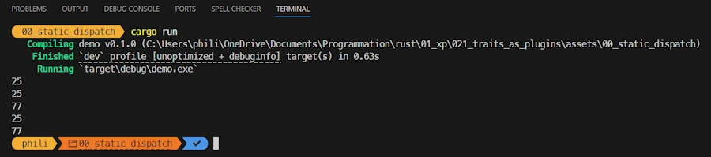
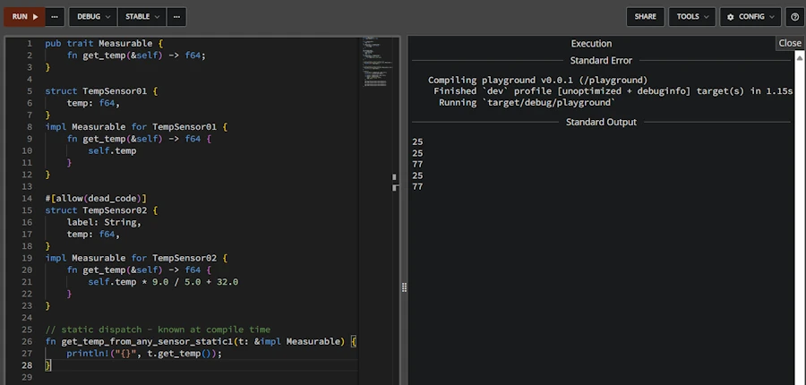
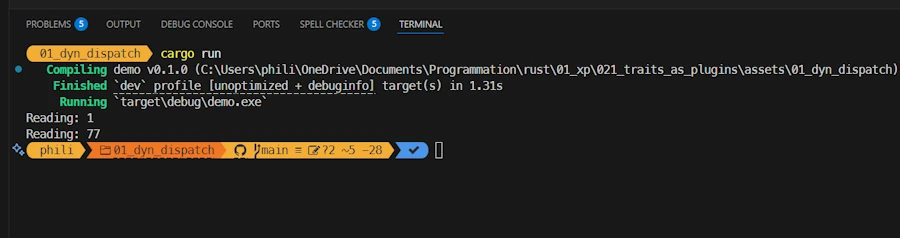
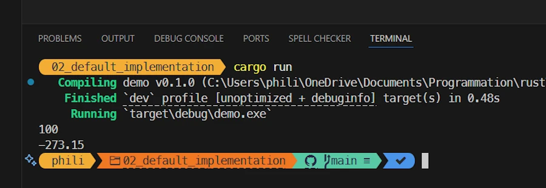

# Rust Traits: Defining Character
{: .no_toc }

From basic syntax to building plugins with once_cell and organizing your Rust projects.
{: .lead }


<h2 align="center">
<span style="color:orange"><b>This post is still under construction.</b></span>    
</h2>


## TL;DR
{: .no_toc }

* For beginners
* The code is on [GitHub](https://github.com/40tude/traits_as_plugins)

<div align="center">
<br/>
<!-- <span>In space, no one can hear you scream.</span> -->
</div>


<!-- ###################################################################### -->
<!-- ###################################################################### -->
<!-- ###################################################################### -->
<!-- ###################################################################### -->
<!-- ###################################################################### -->


## A gentle start - Static dispatch
Where data type are known at compile time.

### Running the demo code
{: .no_toc }

I will not explain how to run the code every time.
* Get the projet from [GitHub](https://github.com/40tude/traits_as_plugins)
* Open the folder with VSCode
* Once in VSCcode, right click on `assets/00_static_dispatch`
* Select the option "Open in Integrated Terminal"


<div align="center">
<br/>
<span>Open in Integrated Terminal</span>
</div>


***Why do I need to open a terminal in a specific directory before to run the code?*** Simply because the project include multiple projects and some of them are more than few lines of code dropped in a `examples/demo01.rs` file. 


* Enter `cargo run`


<div align="center">
<br/>
<span>Results in the Integrated Terminal</span>
</div>


* If you don't want to run the code locally, until the chapter about Modules & Crates, you should be able to copy and paste the code in the excellent [Rust Playground](https://play.rust-lang.org/?version=stable&mode=debug&edition=2024&gist=d2d109f3055e1780562c8e7a97279470). 
    * For this time, and for this time only, you can click the previous link. The source code is already in Rust Playground and so you can press CTRL+ENTER once the web page is open
    * Or... You can select and copy the code below 
    * Paste it in [Rust Playground](https://play.rust-lang.org/?version=stable&mode=debug&edition=2024)
    * Press CTRL + ENTER


<div align="center">
<br/>
<span>Running code in Rust Playground</span>
</div>


### Explanations 1/2
{: .no_toc }

In this first part, I suggest approaching the problem from the end user standpoint. Rather than explaining what a Trait is and then looking at how it is used in source code, we will start with a problem to be solved, see how the Traits respond to the questions, and then study their implementation in the code.

Imagine... Imagine that we work in industry. We deploy control systems at various sites around the world. Don't worry about it. Our task is simple: we install temperature sensors in the factory and we want to read them. Once we have the values, we can display them, store them...  

<div align="center">
<br/>
<!-- <span>Temperature sensors in industry</span> -->
</div>


But we have to anticipate... Sure, we're so efficient and so bright that we'll be asked to deploy other types of sensors: pressure sensors, torsion sensors, flow meters, cameras... And while we're at it, we'll be asked to install actuators to close valves, unlock doors, turn on alarms... 

First thing first, let's focus on the temperature sensors. Depending on the region of the world, we are asked to support both °C and °F (nobody's perfect...). On the other hand not all sensors are the same. Some of them may be already in place... Some of them may have different communication link (serial, EtherCAT...). So we can imagine that we have different types of temperature sensors, but this should be transparent from the software stand point.

<div align="center">
<iframe width="560" height="315" src="https://www.youtube.com/embed/LgrXd0NM2y8?si=11oJOk0zxRrH9Dsr" title="YouTube video player" frameborder="0" allow="accelerometer; autoplay; clipboard-write; encrypted-media; gyroscope; picture-in-picture; web-share" referrerpolicy="strict-origin-when-cross-origin" allowfullscreen></iframe>
</div>

OK... Then what? 

What I just described exists under other forms in many other situations. So there are some people who are smarter than others, who took a step back from all this and said to themselves: what you actually want is for all thermocouples to be measurable. It's a bit like describing people's characters. Some are touchy, others are cheerful, and still others are very intelligent. They are all different people, men, women, young, old... But they all have certain character traits. Well, we're going to give Rust a way to add character traits to existing types. 

For example, I create a `Dog` type with a `struct{}`. Then I create a `Cat` type with another `struct{}`. Next, I describe what the Deceitful character trait is. Finally, I can then enrich the Dog and Cat types with the trait Deceitful. If I decide to say that all Cats are deceitful but not Dogs, I only add the trait Deceitful to Cats. Anyway, you get the idea.

Before we look at the first code example, there is one last point to keep in mind. Given that Rust is quite strict (to say the least) when it comes to type-related issues, we can write functions that take, as parameters, only data type we certain traits. For example, I can write a function that takes as a parameter any animal that has the trait Deceitful. It will then be able to treat Cats, Parrots, etc. in the same way. Similarly, I can create vectors that only contain animals with the trait Deceitful. This is pretty cool, because I can also rely on the compiler's rigor to warn me during compilation if I accidentally call the function with an argument whose type does not have the Deceitful character trait. You know the story : *Compilers makes sure the good things happen — the logical errors are on you.*       

Okay, let's move on to studying the first source code and see how all this apply to our thermocouples.


### Show me the code!
{: .no_toc }


```rust
pub trait Measurable {
    fn get_temp(&self) -> f64;
}

struct TempSensor01 {
    temp: f64,
}
impl Measurable for TempSensor01 {
    fn get_temp(&self) -> f64 {
        self.temp
    }
}

#[allow(dead_code)]
struct TempSensor02 {
    label: String,
    temp: f64,
}
impl Measurable for TempSensor02 {
    fn get_temp(&self) -> f64 {
        self.temp * 9.0 / 5.0 + 32.0
    }
}

// static dispatch - known at compile time
fn get_temp_from_any_sensor_static1(t: &impl Measurable) {
    println!("{}", t.get_temp());
}

// static dispatch - generic syntax
fn get_temp_from_any_sensor_static2<T: Measurable>(t: &T) {
    println!("{}", t.get_temp());
}

fn main() {
    let my_sensor = TempSensor01 { temp: 25.0 };
    println!("{}", my_sensor.get_temp());

    let sensor1 = TempSensor01 { temp: 25.0 };
    let sensor2 = TempSensor02 {
        label: "thermocouple".into(),
        temp: 25.0, // 77 °F
    };

    get_temp_from_any_sensor_static1(&sensor1);
    get_temp_from_any_sensor_static1(&sensor2);

    get_temp_from_any_sensor_static2(&sensor1);
    get_temp_from_any_sensor_static2(&sensor2);
}
```

### Explanations 2/2
{: .no_toc }

Here I will go very slowly. Reading the source code out of order, telling you a story and making sure we all have the same basic understanding.

I first create a data type `TempSensor01`. It is very basic and it only have a float field representing the current temperature.

```rust
struct TempSensor01 {
    temp: f64,
}
```

Then I create a second data type `TempSensor02`. This one is much more sophisticated. It has fields for the current temperature and its label. 

```rust
struct TempSensor02 {
    label: String,
    temp: f64,
}
```

At this point we have 2 temperature sensors, which are of 2 different data type. They are 2 different beasts, and we cannot use a `TempSensor01` in place of `TempSensor02`. This is a very good thing most of the time but ideally we would like to be able to read temperature measurements from all of them using a single function.

This is where Traits comes into play. First, I create a trait named `Measurable`. Below we are saying something like : If a data type wants to be `Measurable` it must provide a `get_temp()` method which returns a `f64` (We could be stricter here and define our own data type for the temperatures to be returned but this is not the most important point here). A trait is a kind of contract or interface. We define what is need without defining the implementation.

```rust
pub trait Measurable {
    fn get_temp(&self) -> f64;
}
```

That is fine but now, if we want `TempSensor01` and `TempSensor02` to be `Measurable`, we must define the `get_temp()` method for each of them. This is done using the `impl` (implement, implementation) keyword and then defining the `get_temp()` method. Both methods are not the same and `get_temp()` for `TempSensor02` return °F (what a pity...). Additionally if the trait requires other methods we could define them here. There is no restriction but I find it useful to define everything in a single `impl` block (one per data type).  

```rust
impl Measurable for TempSensor01 {
    fn get_temp(&self) -> f64 {
        self.temp
    }
}

impl Measurable for TempSensor02 {
    fn get_temp(&self) -> f64 {
        self.temp * 9.0 / 5.0 + 32.0
    }
}
```

Now let's look how it works in the `main()` function. Below I first create `my_sensor` which is of type `TempSensor01`. Since I have implemented the trait `Measurable` for the data type `TempSensor01` this means I added the `get_temp()` to the data type `TempSensor01`. This means I can invoque `.get_temp()` on `my_sensor`.

Next I create 2 sensors of respective type `TempSensor01` and `TempSensor02`. And now, this is really cool. Indeed I can use `TempSensor01` or `TempSensor02` as argument of the function `get_temp_from_any_sensor_static1()`.

```rust
fn main() {
    let my_sensor = TempSensor01 { temp: 25.0 };
    println!("{}", my_sensor.get_temp());

    let sensor1 = TempSensor01 { temp: 25.0 };
    let sensor2 = TempSensor02 {
        label: "thermocouple".into(),
        temp: 25.0, // 77 °F
    };

    get_temp_from_any_sensor_static1(&sensor1);
    get_temp_from_any_sensor_static1(&sensor2);
}
```

Now the question is : how the `get_temp_from_any_sensor_static1()` function is defined? See below. 

The most remarkable point is that the parameter `t` is of type `&impl Measurable`. This is not true, but this is good enough for now. The code below says something like : My name is `get_temp_from_any_sensor_static1()` and I take a reference to any parameter which implements the `Measurable` trait.

The good thing is that since I know `t` has the trait `Measurable`, then I can invoque the method `get_temp()` on `t` in the body of `get_temp_from_any_sensor_static1()`.

```rust
fn get_temp_from_any_sensor_static1(t: &impl Measurable) {
    println!("{}", t.get_temp());
}
```

***OK, this sounds great but how does it works?*** In fact, at compile time, when `rustc` (the compiler) see the `impl` keyword it [monomorphizes](https://en.wikipedia.org/wiki/Monomorphization) (expand) the code for every concrete type that implements the `Measurable` trait. Imagine that the source code is modified so that it has a definition for `fn get_temp_from_any_sensor_static1_1(t: &TempSensor01) {...}` then another for `fn get_temp_from_any_sensor_static1_2(t: &TempSensor01) {...}`. The compiler "copy and paste" source code, it expands the source, it duplicates function calls... You pick the one that click best for you. 

Keep in mind that everything is static. I mean once the monomorphization (source code expansion) is done, the compiler compiles the expanded code as usual. The source code is longer, the compilation takes more time but there is no penalty at runtime. More important : from the end user standpoint (you, me) everything looks like, with the `get_temp_from_any_sensor_static1()` he can use as an argument, anything that implement the `Measurable` trait.

***I see get_temp_from_any_sensor_static2() function calls in main(). What is that?*** In fact when I write `fn get_temp_from_any_sensor_static1(t: &impl Measurable) {...}`, the keyword `impl` is a syntactic sugar. We can use the generic way of doing and write `fn get_temp_from_any_sensor_static2<T: Measurable>(t: &T) {...}`

```rust
fn get_temp_from_any_sensor_static2<T: Measurable>(t: &T) {
    println!("{}", t.get_temp());
}
```
Nothing sexy here. Before the list of parameters, we declare the trait `T` as `Measurable` (do you see the `<T: Measurable>`?). At the end of the day the monomorphized code is similar to the previous one. However this syntax allow us to define functions with multiple traits : `fn get_temp_from_any_sensor_static3<M: Measurable, I: Identifiable>(m: &M, i: &I) {...}`

At this point we should have all we need to understand this first code. Read it, read it again. Run it, modify it. Break it. Make it run again.


#### Summary
{: .no_toc }

* We have 2 types of temperature sensor
* We define a trait Measurable 
    * Kind of contract/interface with a set of methods, functions, variables to be implemented
* We implement the method of the trait onto the data type of interest
* We can define a function that take as parameter any variable with the trait Measurable
    * We can either use the `impl` keyword or the generic syntax
* So far everything is known at compile time. There is no impact at runtime.


<!-- ###################################################################### -->
<!-- ###################################################################### -->
<!-- ###################################################################### -->
<!-- ###################################################################### -->
<!-- ###################################################################### -->


## Dynamic dispatch
Where data type are discovered at runtime.


### Running the demo code
{: .no_toc }

* Right click on `assets/01_dyn_dispatch`
* Select the option "Open in Integrated Terminal"
* `cargo run`

<div align="center">
<br/>
<!-- <span>Running code in Rust Playground</span> -->
</div>


### Explanations 1/2 
{: .no_toc }

In the previous sample code everything is fine but everything is known at compile time. This means that when we arrive in Munich at the factory, once the sensors are deployed, we open the source code we list all the sensors, we compile and run the new version of the monitoring system... This is simply not scalable. Among others because this is not maintenable (we will end up with a custom version per plant). What we need is a way to dynamically call the right version of `get_temp()`. What we want to write is something like: `println!("Reading: {}", s.get_temp());` no matter if `s` is a sensor of type `TempSensor1` or `TempSensor2`.

This is where dynamic dispatch comes in. 


### Show me the code!
{: .no_toc }

```rust
trait Measurable {
    fn get_temp(&self) -> f64;
}

struct TempSensor01 {
    temp: f64,
}
impl Measurable for TempSensor01 {
    fn get_temp(&self) -> f64 {
        self.temp
    }
}

#[allow(dead_code)]
struct TempSensor02 {
    label: String,
    temp: f64,
}
impl Measurable for TempSensor02 {
    fn get_temp(&self) -> f64 {
        self.temp * 9.0 / 5.0 + 32.0
    }
}

// Factory that decides at runtime
// Returning a trait object hides the concrete type
fn make_sensor(kind: &str) -> Box<dyn Measurable> {
    match kind {
        "celsius" => Box::new(TempSensor01 { temp: 1.0 }),
        "fahrenheit" => Box::new(TempSensor02 {
            label: "thermocouple".into(),
            temp: 25.0, // 77 °F
        }),
        _ => Box::new(TempSensor01 { temp: 0.0 }),
    }
}

fn main() {
    // A vector of Measurable
    let mut sensors: Vec<Box<dyn Measurable>> = Vec::new();
    sensors.push(make_sensor("celsius"));
    sensors.push(make_sensor("fahrenheit"));

    for s in &sensors {
        // Virtual call through a vtable (dynamic dispatch, fat vector)
        println!("Reading: {}", s.get_temp());
    }
}
```

### Explanations 2/2 
{: .no_toc }

The beginning of the code is exactly the same. We define the Measurable trait as before. Then we create the 2 temperature sensors and we implement `get_temp()` for each of them. Nothing new under the sun.  

```rust
trait Measurable {
    fn get_temp(&self) -> f64;
}

struct TempSensor01 {
    temp: f64,
}
impl Measurable for TempSensor01 {
    fn get_temp(&self) -> f64 {
        self.temp
    }
}

struct TempSensor02 {
    label: String,
    temp: f64,
}
impl Measurable for TempSensor02 {
    fn get_temp(&self) -> f64 {
        self.temp * 9.0 / 5.0 + 32.0
    }
}
```

Now, the changes are in the `main()` function. First we create a vector of Measurable stuff. However, since Measurable is not a data type, the statement  looks like this : `let mut sensors: Vec<Box<dyn Measurable>> = Vec::new();`. In plain English this says something like : 
* Create a mutable vector (`sensors` with an 's') of boxed trait objects implementing `Measurable`.
* `Box` puts each object on the heap, ensuring a fixed-size pointer is stored in the vector.
* `dyn` marks that we are using dynamic dispatch: the exact type implementing so that `Measurable` can vary at runtime, but all can be stored together behind `Box<dyn Measurable>`.  

Once the vector `sensors` is created, in the `for` loop we can invoque, with no fear, the `get_temp()` method on each element of the vector. The appropriate version of `get_temp()` is called. It does not come for free however. Behind the scene, at runtime, the code uses what is called a **fat pointer**. This pointer points to a table on the heap and in this table (**vtable**), there is another pointer to the area where the `get_temp()` method is defined. 

In the first example we had direct call because everything was known at compile time. Here we point to a table, then we find in the table the address of `get_temp()` and then we call it. We get much more flexibility but, again, it come with a cost at runtime. Do not assume anything and run benchmarks if you suspect the dynamic dispatch is killing your application.


```rust
fn main() {
    let mut sensors: Vec<Box<dyn Measurable>> = Vec::new();
    sensors.push(make_sensor("celsius"));
    sensors.push(make_sensor("fahrenheit"));

    for s in &sensors {
        println!("Reading: {}", s.get_temp());
    }
}
```

***What is the make_sensor() function I see above?*** `sensors` is a vector of boxed trait objects implementing `Measurable`. In this context `make_sensor()` is a kind of factory that create 2 different flavors of sensor based on the argument (`celcius` or the other one that no one used in the universe). Here is the code of `make_sensor()` :

```rust
fn make_sensor(kind: &str) -> Box<dyn Measurable> {
    match kind {
        "celsius" => Box::new(TempSensor01 { temp: 1.0 }),
        "fahrenheit" => Box::new(TempSensor02 {
            label: "thermocouple".into(),
            temp: 25.0, // 77 °F
        }),
        _ => Box::new(TempSensor01 { temp: 0.0 }),
    }
}
```
Using a match expression, based on `kind`, it returns either a box containing a pointer to a `TempSensor01` or a `TempSensor02`. The code is as simple as possible. All sensors of the same type hold the same temperature but this is not the point here.

In the signature of the function (`fn make_sensor(kind: &str) -> Box<dyn Measurable>`) we use de `dyn` keyword to mark the dynamic dispatch while in the body we "simply" return a `Box::new(TempSensor01 OR TempSensor02)`.

Again what really matters is the `for` loop in the `main()` function. Indeed it shows how to invoque the same method on every object of the vector because they implement the `Measurable` trait.

```rust
for s in &sensors {
    println!("Reading: {}", s.get_temp());
}

```


### Summary
{: .no_toc }

* As before, 2 type of temperature sensor with a trait Measurable
* Thanks to dynamic dispatch we can invoque `.get_temp()` no matter the kind of sensor
* The vector definition is : `let mut sensors: Vec<Box<dyn Measurable>> = Vec::new();`
* The factory returns `Box<dyn Measurable>` (exempli gratia `Box::new(TempSensor01 { temp: 1.0 })`)


<!-- ###################################################################### -->
<!-- ###################################################################### -->
<!-- ###################################################################### -->
<!-- ###################################################################### -->
<!-- ###################################################################### -->


## Default implementation
When all objects 


### Running the demo code
{: .no_toc }

* right click on `assets/02_default_implementation`
* Select the option "Open in Integrated Terminal"
* `cargo run`


<div align="center">
<br/>
<!-- <span>Running code in Rust Playground</span> -->
</div>


### Explanations 1/2 
{: .no_toc }

We arrive in Paris, but — as you can imagine — the team responsible for deploying and calibrating the sensors is still on strike (welcome to France 😁). We’re leaving tomorrow, the customer doesn’t want to cover extra hotel nights or flight changes, and we still need to prove that our software works end-to-end if we want to get paid.

<div align="center">
<br/>
<!-- <span>Running code in Rust Playground</span> -->
</div>

This is exactly where a default implementation comes to the rescue. It lets us demonstrate a fully functional system, even if some sensors aren’t providing real measurements yet. Let’s see how.


### Show me the code!
{: .no_toc }

```rust

pub trait Measurable {
    fn get_temp(&self) -> f64 {
        -273.15
    }
}

struct TempSensor01 {
    temp: f64,
}

impl Measurable for TempSensor01 {
    fn get_temp(&self) -> f64 {
        self.temp
    }
}

struct TempSensor02 {
    label: String,
    temp: f64,
}
impl Measurable for TempSensor02 {}

fn main() {
    let sensor100 = TempSensor01 { temp: 100.0 };
    println!("{}", sensor100.get_temp());

    let sensor200 = TempSensor02 {
        label: "thermocouple".into(),
        temp: 200.0,
    };
    println!("{}", sensor200.get_temp());
}
```


### Explanations 2/2 
{: .no_toc }

You know the story now. 2 temperature sensors define 2 different data types and a trait `Measurable` propose an interface. 

What is new here, is that the trait proposes a default implementation for the `get_temp()` method. 

```rust
pub trait Measurable {
    fn get_temp(&self) -> f64 {
        -273.15
    }
}
```
It says something like : if a data type wants to have the `Measurable` trait but is not yet able to define the `get_temp()` method, don't worry, be happy, I will provide a default version for free.

And this is exactly what happens with TempSensor02 with the line :

```rust
impl Measurable for TempSensor02 {}
```

Note that the body is empty. Do you see the `{}`? The `get_temp()` is simply not define for `TempSensor02`. When the monomorphization takes place, the default implementation will be used instead. This is what we can see in the terminal. 

* When `println!("{}", sensor100.get_temp());` is executed the value `100` is displayed 
* When the line `println!("{}", sensor200.get_temp());` is executed the value `-273.15` is  displayed while one could have expected `200`.

We should also keep in mind that it's not all or nothing. Read the code below. Try to anticipate the outputs. Copy/paste and run the code below in the [Rust Playground](https://play.rust-lang.org/?version=stable&mode=debug&edition=2024) (I can't do it for you honey). 

When your tears of joy have dried, take the time to realize how flexible the "default implementation" option is.

```rust
pub trait Measurable {
    fn get_temp(&self) -> f64 {
        -273.15
    }

    fn get_label(&self) -> String {
        "No Label".into()
    }
}

struct TempSensor01 {
    temp: f64,
}

impl Measurable for TempSensor01 {
    fn get_temp(&self) -> f64 {
        self.temp
    }
    // `get_label` is not implemented
}

#[allow(dead_code)]
struct TempSensor02 {
    label: String,
    temp: f64,
}

impl Measurable for TempSensor02 {
    // `get_temp` is not implemented
    
    fn get_label(&self) -> String {
        self.label.clone().into()
    }
}

fn main() {
    let sensor100 = TempSensor01 { temp: 100.0 };
    let sensor200 = TempSensor02 { label: "thermocouple".into(), temp: 200.0 };

    println!("{}°C, label: {}", sensor100.get_temp(), sensor100.get_label());
    println!("{}°C, label: {}", sensor200.get_temp(), sensor200.get_label());
}
```

### Summary
{: .no_toc }

* A trait can propose default implementation for its methods
* Data type willing to implement the trait can cherry pick the methods they want to define
* This is not all or nothing and you can have much more than 52 shades of grey
* As a end user, in the rest of the application nothing change for us  


---

<!-- ###################################################################### -->
<!-- ###################################################################### -->
<!-- ###################################################################### -->
<!-- ###################################################################### -->
<!-- ###################################################################### -->


## Template

One sentence

### Running the demo code
{: .no_toc }

* right click on `assets/?????`
* Select the option "Open in Integrated Terminal"
* `cargo run`


### Explanations 1/2 
{: .no_toc }


### Show me the code!
{: .no_toc }

```rust

```


### Explanations 2/2 
{: .no_toc }

### Summary
{: .no_toc }
