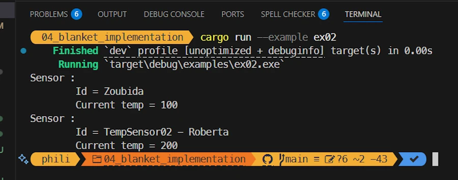
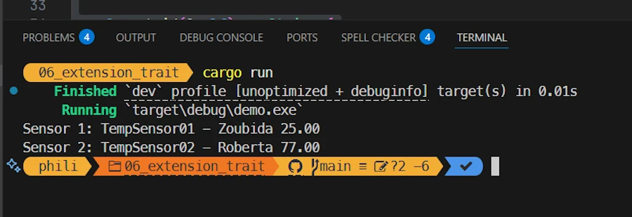

<!-- 
TODO :
* Ajouter des liens sur le vocabulaire : 
    * paramètre, argument, 
    * level of indirection
    * statement
    * expression
* ???
-->


# Rust Traits: Defining Character
{: .no_toc }

From basic syntax to building plugins with once_cell and organizing your Rust projects.
{: .lead }


<h2 align="center">
<span style="color:orange"><b>This post is under construction.</b></span>    
</h2>


## TL;DR
{: .no_toc }

* For beginners
* The code is on [GitHub](https://github.com/40tude/traits_as_plugins)

<div align="center">
<br/>
<!-- <span>In space, no one can hear you scream.</span> -->
</div>

## Table of Contents
{: .no_toc .text-delta}
- TOC
{:toc}


<!-- ###################################################################### -->
<!-- ###################################################################### -->
<!-- ###################################################################### -->
<!-- ###################################################################### -->
<!-- ###################################################################### -->


## A Gentle Start - Static Dispatch
Where data type are known at compile time.

### Running the demo code
{: .no_toc }

I will not explain how to run the code every time.
* Get the projet from [GitHub](https://github.com/40tude/traits_as_plugins)
* Open the folder with VSCode
* Once in VSCcode, right click on `assets/00_static_dispatch`
* Select the option "Open in Integrated Terminal"


<div align="center">
<br/>
<span>Open in Integrated Terminal</span>
</div>


***Why do I need to open a terminal in a specific directory before to run the code?*** Simply because the project include multiple projects and some of them are more than few lines of code dropped in a `examples/demo01.rs` file. 


* Enter `cargo run`


<div align="center">
<br/>
<span>Results in the Integrated Terminal</span>
</div>


* If you don't want to run the code locally, until the chapter about Modules & Crates, you should be able to copy and paste the code in the excellent [Rust Playground](https://play.rust-lang.org/?version=stable&mode=debug&edition=2024&gist=d2d109f3055e1780562c8e7a97279470). 
    * For this time, and for this time only, you can click the previous link. The source code is already in Rust Playground and so you can press CTRL+ENTER once the web page is open
    * Or... You can select and copy the code below 
    * Paste it in [Rust Playground](https://play.rust-lang.org/?version=stable&mode=debug&edition=2024)
    * Press CTRL + ENTER


<div align="center">
<br/>
<span>Running code in Rust Playground</span>
</div>


### Explanations 1/2
{: .no_toc }

In this first part, I suggest approaching the problem from the end user standpoint. Rather than explaining what a Trait is and then looking at how it is used in source code, we will start with a problem to be solved, see how the Traits respond to the questions, and then study their implementation in the code.

Imagine... Imagine that we work in industry. We deploy control systems at various sites around the world. Don't worry about it. Our task is simple: we install temperature sensors in the factory and we want to read them. Once we have the values, we can display them, store them...  

<div align="center">
<br/>
<!-- <span>Temperature sensors in industry</span> -->
</div>


But we have to anticipate... Sure, we're so efficient and so bright that we'll be asked to deploy other types of sensors: pressure sensors, torsion sensors, flow meters, cameras... And while we're at it, we'll be asked to install actuators to close valves, unlock doors, turn on alarms... 

First thing first, let's focus on the temperature sensors. Depending on the region of the world, we are asked to support both °C and °F (nobody's perfect...). On the other hand not all sensors are the same. Some of them may be already in place... Some of them may have different communication link (serial, EtherCAT...). So we can imagine that we have different types of temperature sensors, but this should be transparent from the software stand point.

<div align="center">
<iframe width="560" height="315" src="https://www.youtube.com/embed/LgrXd0NM2y8?si=11oJOk0zxRrH9Dsr" title="YouTube video player" frameborder="0" allow="accelerometer; autoplay; clipboard-write; encrypted-media; gyroscope; picture-in-picture; web-share" referrerpolicy="strict-origin-when-cross-origin" allowfullscreen></iframe>
</div>

OK... Then what? 

What I just described exists under other forms in many other situations. So there are some people who are smarter than others, who took a step back from all this and said to themselves: what you actually want is for all thermocouples to be measurable. It's a bit like describing people's characters. Some are touchy, others are cheerful, and still others are very intelligent. They are all different people, men, women, young, old... But they all have certain character traits. Well, we're going to give Rust a way to add character traits to existing types. 

For example, I create a `Dog` type with a `struct{}`. Then I create a `Cat` type with another `struct{}`. Next, I describe what the Deceitful character trait is. Finally, I can then enrich the Dog and Cat types with the trait Deceitful. If I decide to say that all Cats are deceitful but not Dogs, I only add the trait Deceitful to Cats. Anyway, you get the idea.

Before we look at the first code example, there is one last point to keep in mind. Given that Rust is quite strict (to say the least) when it comes to type-related issues, we can write functions that take, as parameters, only data type we certain traits. For example, I can write a function that takes as a parameter any animal that has the trait Deceitful. It will then be able to treat Cats, Parrots, etc. in the same way. Similarly, I can create vectors that only contain animals with the trait Deceitful. This is pretty cool, because I can also rely on the compiler's rigor to warn me during compilation if I accidentally call the function with an argument whose type does not have the Deceitful character trait. You know the story : *Compilers makes sure the good things happen — the logical errors are on you.*       

Okay, let's move on to studying the first source code and see how all this apply to our thermocouples.


### Show me the code!
{: .no_toc }


```rust
pub trait Measurable {
    fn get_temp(&self) -> f64;
}

struct TempSensor01 {
    temp: f64,
}
impl Measurable for TempSensor01 {
    fn get_temp(&self) -> f64 {
        self.temp
    }
}

#[allow(dead_code)]
struct TempSensor02 {
    label: String,
    temp: f64,
}
impl Measurable for TempSensor02 {
    fn get_temp(&self) -> f64 {
        self.temp * 9.0 / 5.0 + 32.0
    }
}

// static dispatch - known at compile time
fn get_temp_from_any_sensor_static1(t: &impl Measurable) {
    println!("{}", t.get_temp());
}

// static dispatch - generic syntax
fn get_temp_from_any_sensor_static2<T: Measurable>(t: &T) {
    println!("{}", t.get_temp());
}

fn main() {
    let my_sensor = TempSensor01 { temp: 25.0 };
    println!("{}", my_sensor.get_temp());

    let sensor1 = TempSensor01 { temp: 25.0 };
    let sensor2 = TempSensor02 {
        label: "thermocouple".into(),
        temp: 25.0, // 77 °F
    };

    get_temp_from_any_sensor_static1(&sensor1);
    get_temp_from_any_sensor_static1(&sensor2);

    get_temp_from_any_sensor_static2(&sensor1);
    get_temp_from_any_sensor_static2(&sensor2);
}
```

### Explanations 2/2
{: .no_toc }

Here I will go very slowly. Reading the source code out of order, telling you a story and making sure we all have the same basic understanding.

I first create a data type `TempSensor01`. It is very basic and it only have a float field representing the current temperature.

```rust
struct TempSensor01 {
    temp: f64,
}
```

Then I create a second data type `TempSensor02`. This one is much more sophisticated. It has fields for the current temperature and its label. 

```rust
struct TempSensor02 {
    label: String,
    temp: f64,
}
```

At this point we have 2 temperature sensors, which are of 2 different data type. They are 2 different beasts, and we cannot use a `TempSensor01` in place of `TempSensor02`. This is a very good thing most of the time but ideally we would like to be able to read temperature measurements from all of them using a single function.

This is where Traits comes into play. First, I create a trait named `Measurable`. Below we are saying something like : If a data type wants to be `Measurable` it must provide a `get_temp()` method which returns a `f64` (We could be stricter here and define our own data type for the temperatures to be returned but this is not the most important point here). A trait is a kind of contract or interface. We define what is need without defining the implementation.

```rust
pub trait Measurable {
    fn get_temp(&self) -> f64;
}
```

That is fine but now, if we want `TempSensor01` and `TempSensor02` to be `Measurable`, we must define the `get_temp()` method for each of them. This is done using the `impl` (implement, implementation) keyword and then defining the `get_temp()` method. Both methods are not the same and `get_temp()` for `TempSensor02` return °F (what a pity...). Additionally if the trait requires other methods we could define them here. There is no restriction but I find it useful to define everything in a single `impl` block (one per data type).  

```rust
impl Measurable for TempSensor01 {
    fn get_temp(&self) -> f64 {
        self.temp
    }
}

impl Measurable for TempSensor02 {
    fn get_temp(&self) -> f64 {
        self.temp * 9.0 / 5.0 + 32.0
    }
}
```

Now let's look how it works in the `main()` function. Below I first create `my_sensor` which is of type `TempSensor01`. Since I have implemented the trait `Measurable` for the data type `TempSensor01` this means I added the `get_temp()` to the data type `TempSensor01`. This means I can invoque `.get_temp()` on `my_sensor`.

Next I create 2 sensors of respective type `TempSensor01` and `TempSensor02`. And now, this is really cool. Indeed I can use `TempSensor01` or `TempSensor02` as argument of the function `get_temp_from_any_sensor_static1()`.

```rust
fn main() {
    let my_sensor = TempSensor01 { temp: 25.0 };
    println!("{}", my_sensor.get_temp());

    let sensor1 = TempSensor01 { temp: 25.0 };
    let sensor2 = TempSensor02 {
        label: "thermocouple".into(),
        temp: 25.0, // 77 °F
    };

    get_temp_from_any_sensor_static1(&sensor1);
    get_temp_from_any_sensor_static1(&sensor2);
}
```

Now the question is : how the `get_temp_from_any_sensor_static1()` function is defined? See below. 

The most remarkable point is that the parameter `t` is of type `&impl Measurable`. This is not true, but this is good enough for now. The code below says something like : My name is `get_temp_from_any_sensor_static1()` and I take a reference to any parameter which implements the `Measurable` trait.

The good thing is that since I know `t` has the trait `Measurable`, then I can invoque the method `get_temp()` on `t` in the body of `get_temp_from_any_sensor_static1()`.

```rust
fn get_temp_from_any_sensor_static1(t: &impl Measurable) {
    println!("{}", t.get_temp());
}
```

***OK, this sounds great but how does it works?*** In fact, at compile time, when `rustc` (the compiler) see the `impl` keyword it [monomorphizes](https://en.wikipedia.org/wiki/Monomorphization) (expand) the code for every concrete type that implements the `Measurable` trait. Imagine that the source code is modified so that it has a definition for `fn get_temp_from_any_sensor_static1_1(t: &TempSensor01) {...}` then another for `fn get_temp_from_any_sensor_static1_2(t: &TempSensor01) {...}`. The compiler "copy and paste" source code, it expands the source, it duplicates function calls... You pick the one that click best for you. 

Keep in mind that everything is static. I mean once the monomorphization (source code expansion) is done, the compiler compiles the expanded code as usual. The source code is longer, the compilation takes more time but there is no penalty at runtime. More important : from the end user standpoint (you, me) everything looks like, with the `get_temp_from_any_sensor_static1()` he can use as an argument, anything that implement the `Measurable` trait.

***I see get_temp_from_any_sensor_static2() function calls in main(). What is that?*** In fact when I write `fn get_temp_from_any_sensor_static1(t: &impl Measurable) {...}`, the keyword `impl` is a syntactic sugar. We can use the generic way of doing and write `fn get_temp_from_any_sensor_static2<T: Measurable>(t: &T) {...}`

```rust
fn get_temp_from_any_sensor_static2<T: Measurable>(t: &T) {
    println!("{}", t.get_temp());
}
```
Nothing sexy here. Before the list of parameters, we declare the trait `T` as `Measurable` (do you see the `<T: Measurable>`?). At the end of the day the monomorphized code is similar to the previous one. However this syntax allow us to define functions with multiple traits : `fn get_temp_from_any_sensor_static3<T: Measurable + Identifiable>(sensor: &T) {...}` (see multiple traits below)

At this point we should have all we need to understand this first code. Read it, read it again. Run it, modify it. Break it. Make it run again.


### Summary
{: .no_toc }

* We have 2 types of temperature sensor
* We define a trait Measurable 
    * Kind of contract/interface with a set of methods, functions, variables to be implemented
* We implement the method of the trait onto the data type of interest
* We can define a function that take as parameter any variable with the trait Measurable
    * We can either use the `impl` keyword or the generic syntax
* So far everything is known at compile time. There is no impact at runtime.


<!-- ###################################################################### -->
<!-- ###################################################################### -->
<!-- ###################################################################### -->
<!-- ###################################################################### -->
<!-- ###################################################################### -->


## Dynamic Dispatch
Where data type are discovered at runtime.


### Running the demo code
{: .no_toc }

* Right click on `assets/01_dyn_dispatch`
* Select the option "Open in Integrated Terminal"
* `cargo run`

<div align="center">
<br/>
<!-- <span>Running code in Rust Playground</span> -->
</div>


### Explanations 1/2 
{: .no_toc }

In the previous sample code everything is fine but everything is known at compile time. This means that when we arrive in Munich at the factory, once the sensors are deployed, we open the source code we list all the sensors, we compile and run the new version of the monitoring system... This is simply not scalable. Among others because this is not maintenable (we will end up with a custom version per plant). What we need is a way to dynamically call the right version of `get_temp()`. What we want to write is something like: `println!("Reading: {}", s.get_temp());` no matter if `s` is a sensor of type `TempSensor1` or `TempSensor2`.

This is where dynamic dispatch comes in. 


### Show me the code!
{: .no_toc }

```rust
trait Measurable {
    fn get_temp(&self) -> f64;
}

struct TempSensor01 {
    temp: f64,
}
impl Measurable for TempSensor01 {
    fn get_temp(&self) -> f64 {
        self.temp
    }
}

#[allow(dead_code)]
struct TempSensor02 {
    label: String,
    temp: f64,
}
impl Measurable for TempSensor02 {
    fn get_temp(&self) -> f64 {
        self.temp * 9.0 / 5.0 + 32.0
    }
}

// Factory that decides at runtime
// Returning a trait object hides the concrete type
fn make_sensor(kind: &str) -> Box<dyn Measurable> {
    match kind {
        "celsius" => Box::new(TempSensor01 { temp: 1.0 }),
        "fahrenheit" => Box::new(TempSensor02 {
            label: "thermocouple".into(),
            temp: 25.0, // 77 °F
        }),
        _ => Box::new(TempSensor01 { temp: 0.0 }),
    }
}

fn main() {
    // A vector of Measurable
    let mut sensors: Vec<Box<dyn Measurable>> = Vec::new();
    sensors.push(make_sensor("celsius"));
    sensors.push(make_sensor("fahrenheit"));

    for s in &sensors {
        // Virtual call through a vtable (dynamic dispatch, fat vector)
        println!("Reading: {}", s.get_temp());
    }
}
```

### Explanations 2/2 
{: .no_toc }

The beginning of the code is exactly the same. We define the Measurable trait as before. Then we create the 2 temperature sensors and we implement `get_temp()` for each of them. Nothing new under the sun.  

```rust
trait Measurable {
    fn get_temp(&self) -> f64;
}

struct TempSensor01 {
    temp: f64,
}
impl Measurable for TempSensor01 {
    fn get_temp(&self) -> f64 {
        self.temp
    }
}

struct TempSensor02 {
    label: String,
    temp: f64,
}
impl Measurable for TempSensor02 {
    fn get_temp(&self) -> f64 {
        self.temp * 9.0 / 5.0 + 32.0
    }
}
```

Now, the changes are in the `main()` function. First we create a vector of Measurable stuff. However, since Measurable is not a data type, the statement  looks like this : `let mut sensors: Vec<Box<dyn Measurable>> = Vec::new();`. In plain English this says something like : 
* Create a mutable vector (`sensors` with an 's') of boxed trait objects implementing `Measurable`.
* `Box` puts each object on the heap, ensuring a fixed-size pointer is stored in the vector.
* `dyn` marks that we are using dynamic dispatch: the exact type implementing so that `Measurable` can vary at runtime, but all can be stored together behind `Box<dyn Measurable>`.  

Once the vector `sensors` is created, in the `for` loop we can invoque, with no fear, the `get_temp()` method on each element of the vector. The appropriate version of `get_temp()` is called. It does not come for free however. Behind the scene, at runtime, the code uses what is called a **fat pointer**. This pointer points to a table on the heap and in this table (**vtable**), there is another pointer to the area where the `get_temp()` method is defined. 

In the first example we had direct call because everything was known at compile time. Here we point to a table, then we find in the table the address of `get_temp()` and then we call it. We get much more flexibility but, again, it come with a cost at runtime. Do not assume anything and run benchmarks if you suspect the dynamic dispatch is killing your application.


```rust
fn main() {
    let mut sensors: Vec<Box<dyn Measurable>> = Vec::new();
    sensors.push(make_sensor("celsius"));
    sensors.push(make_sensor("fahrenheit"));

    for s in &sensors {
        println!("Reading: {}", s.get_temp());
    }
}
```

***What is the make_sensor() function I see above?*** `sensors` is a vector of boxed trait objects implementing `Measurable`. In this context `make_sensor()` is a kind of factory that create 2 different flavors of sensor based on the argument (`celcius` or the other one that no one used in the universe). Here is the code of `make_sensor()` :

```rust
fn make_sensor(kind: &str) -> Box<dyn Measurable> {
    match kind {
        "celsius" => Box::new(TempSensor01 { temp: 1.0 }),
        "fahrenheit" => Box::new(TempSensor02 {
            label: "thermocouple".into(),
            temp: 25.0, // 77 °F
        }),
        _ => Box::new(TempSensor01 { temp: 0.0 }),
    }
}
```
Using a match expression, based on `kind`, it returns either a box containing a pointer to a `TempSensor01` or a `TempSensor02`. The code is as simple as possible. All sensors of the same type hold the same temperature but this is not the point here.

In the signature of the function (`fn make_sensor(kind: &str) -> Box<dyn Measurable>`) we use de `dyn` keyword to mark the dynamic dispatch while in the body we "simply" return a `Box::new(TempSensor01 OR TempSensor02)`.

Again what really matters is the `for` loop in the `main()` function. Indeed it shows how to invoque the same method on every object of the vector because they implement the `Measurable` trait.

```rust
for s in &sensors {
    println!("Reading: {}", s.get_temp());
}

```


### Summary
{: .no_toc }

* As before, 2 type of temperature sensor with a trait Measurable
* Thanks to dynamic dispatch we can invoque `.get_temp()` no matter the kind of sensor
* The vector definition is : `let mut sensors: Vec<Box<dyn Measurable>> = Vec::new();`
* The factory returns `Box<dyn Measurable>` (exempli gratia `Box::new(TempSensor01 { temp: 1.0 })`)


<!-- ###################################################################### -->
<!-- ###################################################################### -->
<!-- ###################################################################### -->
<!-- ###################################################################### -->
<!-- ###################################################################### -->


## Default Implementation
When a data type cannot yet implement all the methods of the trait (interface)


### Running the demo code
{: .no_toc }

* right click on `assets/02_default_implementation`
* Select the option "Open in Integrated Terminal"
* `cargo run`


<div align="center">
<br/>
<!-- <span>Running code in Rust Playground</span> -->
</div>


### Explanations 1/2 
{: .no_toc }

We arrive in Paris, but — as you can imagine — the team responsible for deploying and calibrating the sensors is still on strike (welcome to France 😁). We’re leaving tomorrow, the customer doesn’t want to cover extra hotel nights or flight changes, and we still need to prove that our software works end-to-end if we want to get paid.

<div align="center">
<br/>
<!-- <span>Running code in Rust Playground</span> -->
</div>

This is exactly where a default implementation comes to the rescue. It lets us demonstrate a fully functional system, even if some sensors aren’t providing real measurements yet. Let’s see how.


### Show me the code!
{: .no_toc }

```rust
pub trait Measurable {
    fn get_temp(&self) -> f64 {
        -273.15
    }
}

struct TempSensor01 {
    temp: f64,
}

impl Measurable for TempSensor01 {
    fn get_temp(&self) -> f64 {
        self.temp
    }
}

struct TempSensor02 {
    label: String,
    temp: f64,
}
impl Measurable for TempSensor02 {}

fn main() {
    let sensor100 = TempSensor01 { temp: 100.0 };
    println!("{}", sensor100.get_temp());

    let sensor200 = TempSensor02 {
        label: "thermocouple".into(),
        temp: 200.0,
    };
    println!("{}", sensor200.get_temp());
}
```


### Explanations 2/2 
{: .no_toc }

By now you should know the story. 2 temperature sensors define 2 different data types and a trait `Measurable` propose an interface. 

What is new here, is that the trait proposes a default implementation for the `get_temp()` method. 

```rust
pub trait Measurable {
    fn get_temp(&self) -> f64 {
        -273.15
    }
}
```
It says something like : if a data type wants to have the `Measurable` trait but is not yet able to define the `get_temp()` method, don't worry, be happy, I will provide a default version for free.

And this is exactly what happens with TempSensor02 with the line :

```rust
impl Measurable for TempSensor02 {}
```

Note that the body is empty. Do you see the `{}`? The `get_temp()` is simply not define for `TempSensor02`. When the monomorphization takes place, the default implementation will be used instead. This is what we can see in the terminal. 

* When `println!("{}", sensor100.get_temp());` is executed the value `100` is displayed 
* When the line `println!("{}", sensor200.get_temp());` is executed the value `-273.15` is  displayed while one could have expected `200`.

We should also keep in mind that it's not all or nothing. Read the code below. Try to anticipate the outputs. Copy/paste and run the code below in the [Rust Playground](https://play.rust-lang.org/?version=stable&mode=debug&edition=2024) (I can't do it for you honey). 

When your tears of joy have dried, take the time to realize how flexible the "default implementation" option is.

```rust
pub trait Measurable {
    fn get_temp(&self) -> f64 {
        -273.15
    }

    fn get_label(&self) -> String {
        "No Label".into()
    }
}

struct TempSensor01 {
    temp: f64,
}

impl Measurable for TempSensor01 {
    fn get_temp(&self) -> f64 {
        self.temp
    }
    // `get_label` is not implemented
}

#[allow(dead_code)]
struct TempSensor02 {
    label: String,
    temp: f64,
}

impl Measurable for TempSensor02 {
    // `get_temp` is not implemented
    
    fn get_label(&self) -> String {
        self.label.clone().into()
    }
}

fn main() {
    let sensor100 = TempSensor01 { temp: 100.0 };
    let sensor200 = TempSensor02 { label: "thermocouple".into(), temp: 200.0 };

    println!("{}°C, label: {}", sensor100.get_temp(), sensor100.get_label());
    println!("{}°C, label: {}", sensor200.get_temp(), sensor200.get_label());
}
```

### Summary
{: .no_toc }

* A trait can propose default implementation for its methods
* Data type willing to implement the trait can cherry pick the methods they want to define
* This is not all or nothing and you can have much more than 52 shades of grey
* As a end user, in the rest of the application nothing change for us  


<!-- ###################################################################### -->
<!-- ###################################################################### -->
<!-- ###################################################################### -->
<!-- ###################################################################### -->
<!-- ###################################################################### -->


## Multiple Traits
Where using the generic syntax allow to add more than one bound to the parameter of a function

### Running the demo code
{: .no_toc }

* right click on `assets/03_multiple_traits`
* Select the option "Open in Integrated Terminal"
* `cargo run`


<div align="center">
<br/>
<!-- <span>Running code in Rust Playground</span> -->
</div>


### Explanations 1/2 
{: .no_toc }

You have played with the last sample code in Rust Playground. It is simple, easy to understand and everything looks like we are running a kind of inventory. However, the point was to demonstrate the default implementation and so, in the main() function we have line similar to : `println!("{}°C, label: {}", sensor100.get_temp(), sensor100.get_label());`

Now let's say we want to write a kind of Inventory function. One of the constraint we want to have is to make sure that the parameters implement the methods we need. Here we needed `get_temp()` and `get_label()`. 

This is where multiple traits and bounds come into the game since they do exactly that. In the function signature using the generic syntax, we specify which traits must be available (no matter if it is via a default implementation or not)

Let's read some code.


### Show me the code!
{: .no_toc }

```rust
// ----------------------------
pub trait Measurable {
    fn get_temp(&self) -> f64 {
        -273.15
    }
}

pub trait Identifiable {
    fn get_id(&self) -> String {
        "NA".into()
    }
}

// ----------------------------
struct TempSensor01 {
    temp: f64,
}
impl Measurable for TempSensor01 {
    fn get_temp(&self) -> f64 {
        self.temp
    }
}
impl Identifiable for TempSensor01 {}


// ----------------------------
struct TempSensor02 {
    label: String,
    temp: f64,
}
impl Measurable for TempSensor02 {}
impl Identifiable for TempSensor02 {
    fn get_id(&self) -> String {
        self.label.clone()
    }
}

// ----------------------------
struct TempSensor03 {
    temp: f64,
}
impl Measurable for TempSensor03 {}

// Static dispatch, generic syntax
fn inventory<T: Measurable + Identifiable>(sensor: &T) {
    println!("Sensor : {} ({} °C)", sensor.get_id(), sensor.get_temp());
}

fn main() {
    let sensor1 = TempSensor01 { temp: 100.0 };

    let sensor2 = TempSensor02 {
        label: "thermo-8086".into(),
        temp: 200.0,
    };

    inventory(&sensor1);
    inventory(&sensor2);

    // let sensor3 = TempSensor03 { temp: 300.0 };
    // inventory(&sensor3); // ! Does not compile : Identifiable is required by this bound in `inventory`
}
```


### Explanations 2/2 
{: .no_toc }

At the top of the code we define 2 traits : Measurable and Identifiable. They both have a unique methode and they both propose a default implementation of their respective method : `get_temp()` that we know by heart and `get_id()` which returns the Id of the temperature sensor.

Then we define our two friends `TempSensor01` and `TempSensor02`. The implementation is not yet complete and they use the default implementations. There is a last data type, named `TempSensor03`. It has the Measurable trait (and leverages the default implementation) but it does not have the Identifiable trait.

In the `main()` function we create two sensors and we pass them as argument to the `inventory()` function.

What did you expect? The most interesting part is the definition of the inventory() function.

```rust
fn inventory<T: Measurable + Identifiable>(sensor: &T) {
    println!("Sensor : {} ({} °C)", sensor.get_id(), sensor.get_temp());
}
```

In plain French it says: My name is `inventory`. I use the generic syntax <T: Measurable + Identifiable> to declare that I work with any type `T` that implements both the `Measurable` and `Identifiable` traits.
When someone calls me, they must pass me a `sensor`, which is a reference to such a type. Because of the trait bounds, I know that this sensor will always provide the methods `get_id()` and `get_temp()`, so I can safely print its identifier and temperature.

**Note:** Between you and me I would prefer to write `fn inventory<T: Measurable x Identifiable>(sensor: &T) {...}` because, for me, `x` is associated to `AND` while `+` is associated to `OR`.      

**Note:** The syntax may become hard to read if we have many bounds. This is where the `where` clause can help. In our case it does not make a big difference however :

```rust
fn inventory<T>(sensor: &T)
where
    T: Measurable + Identifiable,
{
    println!("Sensor : {} ({} °C)", sensor.get_id(), sensor.get_temp());
}
```
But it helps with the code below :

```rust
fn combine<A, B, C>(a: &A, b: &B) -> C
where
    A: Measurable + Identifiable,
    B: Identifiable,
    C: From<(String, f64)>,
{
    C::from((a.get_id(), b.get_id().len() as f64))
}
```


### Summary
{: .no_toc }

* Using the generic syntax
* We can express the fact that a function requires 
    * A type implementing more than one trait  
    * Multiple types implementing various traits 
* The `where` helps to keep function definition clean and lean


<!-- ###################################################################### -->
<!-- ###################################################################### -->
<!-- ###################################################################### -->
<!-- ###################################################################### -->
<!-- ###################################################################### -->


## Blanket Implementation
Where the compiler write for us the code to implement certain traits.

**Warning:** This section is lengthy because I experiment and play with many different ideas. 


<!-- ###################################################################### -->
<!-- ###################################################################### -->
### Implementation for Display

Where we first learn to implement an external trait on one of our own data types; 

#### Running the demo code
{: .no_toc }

Pay attention... The source code is in the `examples/` subdirectory.

* click on `assets/04_blanket_implementation/examples` to see the list of source code.
* right click on `assets/04_blanket_implementation`
* Select the option "Open in Integrated Terminal"
* `cargo run --example ex00`

<div align="center">
<br/>
<!-- <span>Running code in Rust Playground</span> -->
</div>


#### Explanations 1/2
{: .no_toc }

With the previous sample code, the way we used the `inventory()` function call in the `main()` was OK but not great. What I would like to write is something like : `println!("{}", sensor1);`

This is possible if we implement the `Display` trait for `TempSensor01`. Let's see how.


#### Show me the code!
{: .no_toc }

```rust
pub trait Measurable {
    fn get_temp(&self) -> f64;
}

pub trait Identifiable {
    fn get_id(&self) -> String;
}

struct TempSensor01 {
    temp: f64,
    id: String,
}

impl Measurable for TempSensor01 {
    fn get_temp(&self) -> f64 {
        self.temp
    }
}

impl Identifiable for TempSensor01 {
    fn get_id(&self) -> String {
        self.id.clone()
    }
}

impl std::fmt::Display for TempSensor01 {
    fn fmt(&self, f: &mut std::fmt::Formatter<'_>) -> std::fmt::Result {
        write!(f, "Sensor type : TempSensor01\n\tId = {}\n\tCurrent temp = {}", self.id, self.temp)
    }
}

fn main() {
    let sensor1 = TempSensor01 { temp: 100.0, id: "Zoubida".into() };
    println!("{}", sensor1);
}
```


#### Explanations 2/2 
{: .no_toc }

What is cool is that, at the end, in the main function we can write

```rust
    let sensor1 = TempSensor01 { temp: 100.0, id: "Zoubida".into() };
    println!("{}", sensor1);
```
This is cool because we print `sensor1` the same way we print an integer or a double. To get this result we "only have to" implement the trait `std::fmt::Display`. I say `std::fmt::Display` and not `Display` because, I want to underline the fact that the Display trait is external. It belong to `std::fmt` we do not own it. Keep this in mind we will come back to the ownership issue later.

Now the question is : how do I write the implementation of `std::fmt::Display` for the `TempSensor01` data type?

This might be obvious but nowhere in the code above we define the trait `Display`. We don't own it so we don't write soemething like :

```rust
pub trait Display {
   ...
}
```

However we can write the implementation `std::fmt::Display` for `TempSensor01`. We write : 

```rust
impl std::fmt::Display for TempSensor01 {
    fn fmt(&self, f: &mut std::fmt::Formatter<'_>) -> std::fmt::Result {
        write!(f, "Sensor type : TempSensor01\n\tId = {}\n\tCurrent temp = {}", self.id, self.temp)
    }
}
```

Compared to what we already know when we deal with our own traits, fundamentally there is nothing new. The trait `std::fmt::Display` have in its interface one function named `fmt` which have a specific signature. Don't turst me. Double [check the documentation](https://doc.rust-lang.org/std/fmt/trait.Display.html). 

In our code, we copy paste the signature and write the definition of the `fmt` method for the data type `TempSensor01`. In the signature the `<'_>` is a lifetime specifier which is not used here. Note that we use `self.id` and `self.temp` directly. Life is easy.   


<!-- #### Summary
{: .no_toc } -->

***But the compiler did'nt write anything for us! Did it?*** No it did'nt. You are right, this first sample code shows how we can implement `std::fmt::Display`, an external trait, on a local data type (that we own).  

Ok... Let's see if a blanket implementation can answer our question.


<!-- ###################################################################### -->
<!-- ###################################################################### -->
### Blanket Implementation for Real 

Where the compiler writes the code of the trait implementation for us.

#### Running the demo code
{: .no_toc }

* right click on `assets/04_blanket_implementation`
* Select the option "Open in Integrated Terminal"
* `cargo run --example ex01`

<div align="center">
<br/>
<!-- <span>Running code in Rust Playground</span> -->
</div>


#### Explanations 1/2
{: .no_toc }

In the previous sample code we had to write the method. See below : 

```rust
impl std::fmt::Display for TempSensor01 {
    fn fmt(&self, f: &mut std::fmt::Formatter<'_>) -> std::fmt::Result {
        write!(f, "Sensor type : TempSensor01\n\tId = {}\n\tCurrent temp = {}", self.id, self.temp)
    }
}
```

This means that if we continue that way we have to implement the method `std::fmt::Display` for TempSensor02, TempSensor03... TempSensorNN. This is a waste of time and error prone. This is where Rust blanket implementation can help because it can write implementation code for us.   


#### Show me the code!
{: .no_toc }

```rust
use std::fmt::{Display, Formatter, Result as FmtResult};

pub trait Measurable {
    fn get_temp(&self) -> f64;
}

pub trait Identifiable {
    fn get_id(&self) -> String;
}

struct TempSensor01 {
    temp: f64,
    id: String,
}

impl Measurable for TempSensor01 {
    fn get_temp(&self) -> f64 {
        self.temp
    }
}

impl Identifiable for TempSensor01 {
    fn get_id(&self) -> String {
        self.id.clone()
    }
}

struct TempSensor02 {
    temp: f64,
    id: String,
}

impl Measurable for TempSensor02 {
    fn get_temp(&self) -> f64 {
        self.temp * 9.0 / 5.0 + 32.0
    }
}

impl Identifiable for TempSensor02 {
    fn get_id(&self) -> String {
        "TempSensor02 - ".to_owned() + &self.id
    }
}

trait Printable {
    fn print(&self);
}

impl<T> Printable for T
where
    T: Identifiable + Measurable,
{
    fn print(&self) {
        println!("Sensor : \n\tId = {}\n\tCurrent temp = {}", self.get_id(), self.get_temp())
    }
}

fn main() {
    let sensor1 = TempSensor01 { temp: 25.0, id: "Zoubida".into() };
    let sensor2 = TempSensor02 { temp: 25.0, id: "Roberta".into() };

    sensor1.print();
    sensor2.print();

    struct Nimbus2000 {}
    let bob = Nimbus2000 {};
    // bob.print();
}
```


#### Explanations 2/2
{: .no_toc }

I guess I can save some time here because you know the context : 2 TempSensor data types, 2 traits blablabla.

In the `main()` function we write

```rust
fn main() {
    let sensor1 = TempSensor01 { temp: 25.0, id: "Zoubida".into() };
    let sensor2 = TempSensor02 { temp: 25.0, id: "Roberta".into() };

    sensor1.print();
    sensor2.print();
}
```

This is not yet perfect because ideally we would like to write something similar to :

```rust
fn main() {
    let sensors: Vec<Box<dyn TempSensor>> = vec![
        Box::new(TempSensor01 { temp: 25.0 }),
        Box::new(TempSensor02 { temp: 25.0 }), // 77 °F
    ];

    for sensor in sensors {
        println!("{}", sensor);
    }
}
```

Nonetheless we make significant progress because we no longer have to write each implementation of `.print()`.

First we define a Printable trait and this interface have one `print()` method.

```rust
trait Printable {
    fn print(&self);
}
```
Next we use the generic syntax to define the implementation of the trait `Printable` for any type having the `Identifiable` and `Measurable` traits. 

```rust
impl<T> Printable for T
where
    T: Identifiable + Measurable,
{
    fn print(&self) {
        println!("Sensor : \n\tId = {}\n\tCurrent temp = {}", self.get_id(), self.get_temp())
    }
}
```

**It took me some time to realize:** 
* The code above is a generalized implementation for any type implementing `Identifiable` and `Measurable`
* At compile time, Rust monomorphizes the "template" **for each concrete type** that satisfies the traits bounds (`Identifiable + Measurable`).
* Since `TempSensor01` implements `Identifiable` and `Measurable`, it gets the `Printable` implementation for "free", and `sensor1.print()` compiles and works like a charm.
* The same apply to `TempSensor02`.
* In the `main()` function, the code looks like a kind a polymorphism working on `sensor1` and `sensor1` but no, no, and no. Behind the scene each version of `.print()` have been monomorphized for each concrete type.
* The trait bounds checks are done at compile time → no runtime cost, no surprises.


***In the source code it is written that bob.print() does not compile. Can you explain?*** No, read the last line above, read the source code and tell me what you think. 

Ok... On the last line of the bullet list, it is said that the trait bounds checks are done at compile time. Now in the source code I understand that `Nimbus200` is a datatype (I thought it was a magic broom). It is empty but before all this data type does not implement `Measurable` nor `Identifiable`. When the compiler sees the `bob.print()` invocation it asks the monomorphization system to generate (expand) the `Printable` trait so that `.print()` can be called. However, this is not possible because `Printable` is monomorphizable if and only if `T` implements the traits `Identifiable` and `Measurable`. This is not the case with `Nimbus2000` data type and the compiler reports errors and suggest options. 


***OK... But I in the `main()` function would like to read `println!("{}", blablabla);` rather than `sensor1.print();`. What can we do ?***

Before to move one, **keep in mind** :
* Blanket implementation (generalized implementation) use the generic syntax
* It generates (monomorphizes) for us code for certain traits
* Trait bounds checking occurs at compile time, not runtime 


<!-- #### Summary
{: .no_toc } -->


<!-- ###################################################################### -->
<!-- ###################################################################### -->
### Blanket Implementation II 

Where the compiler writes again the code of the trait implementation for us.


#### Running the demo code
{: .no_toc }

* right click on `assets/04_blanket_implementation`
* Select the option "Open in Integrated Terminal"
* `cargo run --example ex02`

<div align="center">
<br/>
<!-- <span>Running code in Rust Playground</span> -->
</div>


<!-- ### Explanations 1/2
{: .no_toc } -->


#### Show me the code!
{: .no_toc }

```rust
pub trait Measurable {
    fn get_temp(&self) -> f64;
}

pub trait Identifiable {
    fn get_id(&self) -> String;
}

struct TempSensor01 {
    temp: f64,
    id: String,
}

impl Measurable for TempSensor01 {
    fn get_temp(&self) -> f64 {
        self.temp
    }
}

impl Identifiable for TempSensor01 {
    fn get_id(&self) -> String {
        self.id.clone()
    }
}

struct TempSensor02 {
    temp: f64,
    id: String,
}

impl Measurable for TempSensor02 {
    fn get_temp(&self) -> f64 {
        self.temp
    }
}

impl Identifiable for TempSensor02 {
    fn get_id(&self) -> String {
        "TempSensor02 - ".to_owned() + &self.id
    }
}

trait PrettyFmt {
    fn pretty(&self) -> String;
}

impl<T> PrettyFmt for T
where
    T: Identifiable + Measurable,
{
    fn pretty(&self) -> String {
        format!("Sensor : \n\tId = {}\n\tCurrent temp = {}", self.get_id(), self.get_temp())
    }
}

fn main() {
    let sensor1 = TempSensor01 { temp: 100.0, id: "Zoubida".into() };
    let sensor2 = TempSensor02 { temp: 200.0, id: "Roberta".into() };

    println!("{}", sensor1.pretty());
    println!("{}", sensor2.pretty());
}
```

#### Explanations 
{: .no_toc }

This is not yet perfect. In the main() function we write

```rust
    println!("{}", sensor1.pretty());
    println!("{}", sensor2.pretty());
```

To be honest, this is a trick that may be useful in other situations. Here, it's really a last resort. Let's not spend to much time on it you already have all the information to understand the code.


***So you are saying there is no solution?*** Did I say that? No, but before to go further let's study a source code that **does not compile**. This will help us to underline an important point about the blanket implementation.


<!-- ###################################################################### -->
<!-- ###################################################################### -->
### Orphan/coherence rules 

Where the compiler warns us before we shoot ourselves in the foot.


#### Running the demo code
{: .no_toc }

* right click on `assets/04_blanket_implementation`
* Select the option "Open in Integrated Terminal"
* `cargo run --example ex03`

Remember the Alamo but remember this code **DOES NOT** compile.

<div align="center">
<br/>
<!-- <span>Running code in Rust Playground</span> -->
</div>


#### Explanations 1/2
{: .no_toc }

Earlier we learnt how to implement the `Display` trait for `TempSensor01`. It worked like a charm. We just learnt about the generalized trait implementation. Let's mixt both and get the best of both worlds!


#### Show me the code!
{: .no_toc }

```rust
pub trait Measurable {
    fn get_temp(&self) -> f64;
}

pub trait Identifiable {
    fn get_id(&self) -> String;
}

struct TempSensor01 {
    temp: f64,
    id: String,
}

impl Measurable for TempSensor01 {
    fn get_temp(&self) -> f64 {
        self.temp
    }
}

impl Identifiable for TempSensor01 {
    fn get_id(&self) -> String {
        self.id.clone()
    }
}

impl<T> std::fmt::Display for T
where
    T: Measurable + Identifiable,
{
    fn fmt(&self, f: &mut std::fmt::Formatter<'_>) -> std::fmt::Result {
        write!(f, "id={}, temp={}", self.id, self.temp)
    }
}

fn main() {
    let sensor1 = TempSensor01 { temp: 100.0, id: "Zoubida".into() };
    println!("{}", sensor1);
}
```


#### Explanations 2/2
{: .no_toc }

We have 2 traits (`Measurable` and `Identifiable`). Then we define a `TempSensor01` data type which implements both traits.

In the `main()` function we write `println!("{}", sensor1);` hoping that it will work because we have been brave and smart.

Indeed we use the generic syntax to define the implementation of the trait `std::fmt::Display`. Since we are very smart we do not forget to add some trait bounds because we want to make sure that only the data types having the `Measurable` and `Identifiable` traits will be allowed to use it. 

So beautiful, so well written, so smart... Look below :

```rust
impl<T> std::fmt::Display for T
where
    T: Measurable + Identifiable,
{
    fn fmt(&self, f: &mut std::fmt::Formatter<'_>) -> std::fmt::Result {
        write!(f, "id={}, temp={}", self.id, self.temp)
    }
}
```


Nice try but NO. This does not work. To make a long story short 
* This does not compile because of Rust's **orphan/coherence rules**
* Indeed, ``Display`` is a foreign trait (defined in `std::fmt`).
* We are not allowed to implement a **foreign trait** for a **foreign type**.
* Indeed in the code above `impl<T> Display for T where T: ...`, the target type `T` is a generic 'any' type (not a local type that we own) → prohibited.

The idiomatic solution is the **newtype pattern** where we wrap your `T` in a local type (that we own), then we implement `Display` for that wrapper. Additionally we can offer a helper to make it easier to use.

Let's see how the newtype pattern can be used in our case.


<!-- #### Summary
{: .no_toc } -->


<!-- ###################################################################### -->
<!-- ###################################################################### -->
### Newtype pattern I
<!-- {: .no_toc } -->

Where the compiler write implementation code for an intermediate data type.

#### Running the demo code
{: .no_toc }

* right click on `assets/04_blanket_implementation`
* Select the option "Open in Integrated Terminal"
* `cargo run --example ex04`

<div align="center">
<br/>
<!-- <span>Running code in Rust Playground</span> -->
</div>


#### Explanations 1/2 
{: .no_toc }

In the previous sample code we learnt that we cannot write `impl<T> std::fmt::Display for T...`. This is because we do not own the trait `std::fmt::Display` nor the generic type `T`. As often, the trick is to add a level on indirection by defining a intermediate data type that we own and on which we implement `Display`. Let's see how it works.


#### Show me the code!
{: .no_toc }

```rust
use std::fmt::{Display, Formatter, Result as FmtResult};

pub trait Measurable {
    fn get_temp(&self) -> f64;
}

pub trait Identifiable {
    fn get_id(&self) -> String;
}

struct TempSensor01 {
    temp: f64,
    id: String,
}

impl Measurable for TempSensor01 {
    fn get_temp(&self) -> f64 {
        self.temp
    }
}

impl Identifiable for TempSensor01 {
    fn get_id(&self) -> String {
        self.id.clone()
    }
}

struct AsDisplay<'a, T: Measurable + Identifiable>(&'a T);

impl<T> Display for AsDisplay<'_, T>
where
    T: Measurable + Identifiable,
{
    fn fmt(&self, f: &mut Formatter<'_>) -> FmtResult {
        write!(f, "id={}, temp={}", self.0.get_id(), self.0.get_temp())
    }
}

fn main() {
    let sensor1 = TempSensor01 { temp: 100.0, id: "Zoubida".into() };
    println!("{}", AsDisplay(&sensor1));
}
```


#### Explanations 2/2 
{: .no_toc }

You know the song... Two traits (`Measurable` and `Identifiable`). Then we define a `TempSensor01` data type which implements both traits.

Then we define an intermediate data type named `AsDisplay`. The line below does'nt compile but this is good enough for now because I want to underline that this defines a **tuple struct** with a single field.

```rust
struct AsDisplay<T: Measurable + Identifiable>(&T)
```

**Note**
* A tuple struct looks like : `struct Point(i32, i32);`
* It has unnamed fields, accessed by index (p.0, p.1)
* It’s syntactically close to a tuple but defines a new distinct type
* Often used to define our new type adding a thin wrapper around an existing type : `struct Temperature(f64); // different type from plain f64`

In addition, the tuple struct, the wrapper stores a reference (&T). Any struct that contains a reference must name the lifetime of that reference. Lifetime elision works in function signatures but not in struct definitions, so the compiler forces us to add one. Finally the working line of code is :

```rust
struct AsDisplay<'a, T: Measurable + Identifiable>(&'a T);
```

Now we have our intermediate data type and we can implement Display on it. It goods like this :

```rust
impl<T> Display for AsDisplay<'_, T>
where
    T: Measurable + Identifiable,
{
    fn fmt(&self, f: &mut Formatter<'_>) -> FmtResult {
        write!(f, "id={}, temp={}", self.0.get_id(), self.0.get_temp())
    }
}
```

The only point of attention is the weird syntax `self.0.get_id()`. However if we remember that `AsDisplay` is a `tuple struct` with a single, unnamed field then this way of writing should clearer. `self.0` points to the first and unique field. `.get_id()` or `.get_temp()` invoke the method.

With this way of expressing things, in the `main()` function we write :

```rust
println!("{}", AsDisplay(&sensor1));
```
Here is what happens : We temporarily wrap a borrow of sensor1 into `AsDisplay`, `println!` detects that `AsDisplay` implements `Display`, it calls our custom `fmt`, which in turn delegates to the `Measurable` and `Identifiable` methods of the underlying sensor, and the resulting string is printed.

**Long version:**
1. **Borrowing the sensor**
   * `&sensor1` creates a shared reference to `sensor1`.
   * The type of that expression is `&TempSensor01`.

2. **Constructing the wrapper**
   * `AsDisplay(&sensor1)` calls the tuple struct constructor for `AsDisplay`.
   * This produces a temporary value of type `AsDisplay<'_, TempSensor01>`.
   * The lifetime `'_` is inferred to be “the lifetime of `&sensor1`,” i.e. the borrow is tied to the scope of the `println!` call.

3. **Macro expansion**
   * The `println!` macro expands roughly into a call to `std::fmt::Arguments::new_v1()` and eventually a call to `std::io::stdout().write_fmt(...)`.
   * Inside this machinery, Rust sees the `{}` placeholder and asks: *Does the type `AsDisplay<'_, TempSensor01>` implement `Display`?*

4. **Trait resolution**
   * The compiler finds our `impl<'a, T> Display for AsDisplay<'a, T>` where `T: Measurable + Identifiable`.
   * Since `TempSensor01` implements both `Measurable` and `Identifiable`, the blanket impl applies.

5. **Calling `fmt`**
   * The formatting machinery calls `AsDisplay::fmt(&wrapper, f)`.
   * Inside our `fmt` implementation, `self.0` gives access to the inner `&TempSensor01`.
   * Then `get_id()` and `get_temp()` are called on the inner sensor to build the string.

6. **Printing to stdout**
   * The result of `write!(...)` inside `fmt` is passed back up through the formatting machinery.
   * `println!` finally writes the formatted string (`id=Zoubida, temp=100`) followed by a newline to standard output.


<!-- #### Summary
{: .no_toc } -->

However, this is not yet perfect because we create a temporary variable in the `println!` macro. Let's see if we can improve things. 


<!-- ###################################################################### -->
<!-- ###################################################################### -->
### Newtype pattern II

Where we use a convenient function call to hide the use of the ad how data type.  


#### Running the demo code
{: .no_toc }

* right click on `assets/04_blanket_implementation`
* Select the option "Open in Integrated Terminal"
* `cargo run --example ex05`

<div align="center">
<br/>
<!-- <span>Running code in Rust Playground</span> -->
</div>


#### Explanations 1/2
{: .no_toc }

This section will be short and easy because we will apply the trick we used earlier in the `Blanket Implementation II `.


#### Show me the code!
{: .no_toc }

```rust
use std::fmt::{Display, Formatter, Result as FmtResult};

pub trait Measurable {
    fn get_temp(&self) -> f64;
}

pub trait Identifiable {
    fn get_id(&self) -> String;
}

struct TempSensor01 {
    temp: f64,
    id: String,
}

impl Measurable for TempSensor01 {
    fn get_temp(&self) -> f64 {
        self.temp
    }
}

impl Identifiable for TempSensor01 {
    fn get_id(&self) -> String {
        self.id.clone()
    }
}

struct TempSensor02 {
    temp: f64,
    id: String,
}

impl Measurable for TempSensor02 {
    fn get_temp(&self) -> f64 {
        self.temp
    }
}

impl Identifiable for TempSensor02 {
    fn get_id(&self) -> String {
        "TempSensor02 - ".to_owned() + &self.id
    }
}

struct AsDisplay<'a, T: Measurable + Identifiable>(&'a T);

impl<'a, T> Display for AsDisplay<'a, T>
where
    T: Measurable + Identifiable,
{
    fn fmt(&self, f: &mut Formatter<'_>) -> FmtResult {
        write!(f, "id={}, temp={}", self.0.get_id(), self.0.get_temp())
    }
}

fn as_display<T: Measurable + Identifiable>(t: &T) -> AsDisplay<'_, T> {
    AsDisplay(t)
}

fn main() {
    let sensor1 = TempSensor01 { temp: 100.0, id: "Zoubida".into() };
    let sensor2 = TempSensor02 { temp: 200.0, id: "Roberta".into() };

    println!("{}", as_display(&sensor1));
    println!("{}", as_display(&sensor2));
}
```


#### Explanations 
{: .no_toc }

Not much to say. The code is mostly the same. Two traits (`Identifiable` and `Measurable`), two data type (`TempSensor01` and `TempSensor02`). The same newtype pattern. 

We only add a convenient `as_display()` function to build the wrapper without naming the type (`AsDisplay`) at call site.

```rust
fn as_display<T: Measurable + Identifiable>(t: &T) -> AsDisplay<'_, T> {
    AsDisplay(t)
}
```

One thing to keep in mind. In the `main()` function, `as_display()` looks polymorphic but no, no, no. There are 2 monomorphized implementations created at compile time. One per data type.

```rust
fn main() {
    ...
    println!("{}", as_display(&sensor1));
    println!("{}", as_display(&sensor2));
}
```

Again, nothing fancy here. 
<!-- #### Summary
{: .no_toc } -->


### Summary
{: .no_toc }


<!-- ###################################################################### -->
<!-- ###################################################################### -->
<!-- ###################################################################### -->
<!-- ###################################################################### -->
<!-- ###################################################################### -->

## Trait Bounds Inheritance
Where we force a data type to implement a trait.

### Running the demo code
{: .no_toc }

* right click on `assets/05_trait_bounds_inheritance`
* Select the option "Open in Integrated Terminal"
* `cargo run`

<div align="center">
<br/>
<!-- <span>Running code in Rust Playground</span> -->
</div>


### Explanations 1/2 
{: .no_toc }

So far, in most of the sample code we have implemented the trait Display because we want to print to the console. Would'nt be great if we could sign an agreement with the compiler saying something like : The data type that implements this trait must also implement this trait.   

This could be helpful because if one day we forget, then the compiler will gently remind us. Oh...Calm down! I said gently. Ok?. Ok.

Let see how this works.


### Show me the code!
{: .no_toc }

```rust
use std::fmt::{Display, Formatter, Result as FmtResult};

trait TempSensor: Display {
    fn get_temp(&self) -> f64;
}

struct TempSensor01 {
    temp: f64,
}

impl TempSensor for TempSensor01 {
    fn get_temp(&self) -> f64 {
        self.temp
    }
}

impl Display for TempSensor01 {
    fn fmt(&self, f: &mut Formatter<'_>) -> FmtResult {
        write!(f, "{:.2} °C", self.temp)
    }
}

struct TempSensor02 {
    temp: f64,
}

impl TempSensor for TempSensor02 {
    fn get_temp(&self) -> f64 {
        self.temp * 9.0 / 5.0 + 32.0
    }
}

impl Display for TempSensor02 {
    fn fmt(&self, f: &mut Formatter<'_>) -> FmtResult {
        write!(f, "{:.2} °F", self.get_temp())
    }
}

fn main() {
    let sensors: Vec<Box<dyn TempSensor>> = vec![
        Box::new(TempSensor01 { temp: 25.0 }),
        Box::new(TempSensor02 { temp: 25.0 }), // 77 °F
        Box::new(TempSensor01 { temp: 42.0 }),
    ];

    for sensor in sensors {
        println!("{}", sensor);
    }
}
```


### Explanations 2/2 
{: .no_toc }

A long time ago, in a galaxy far, far away we wrote :

```rust
pub trait Measurable {
    fn get_temp(&self) -> f64;
}

struct TempSensor01 {
    temp: f64,
}
impl Measurable for TempSensor01 {
    fn get_temp(&self) -> f64 {
        self.temp
    }
}
```
It was in our very first sample code. Now the story begins like this :

```rust
trait TempSensor: Display {
    fn get_temp(&self) -> f64;
}

struct TempSensor01 {
    temp: f64,
}

impl TempSensor for TempSensor01 {
    fn get_temp(&self) -> f64 {
        self.temp
    }
}
```
It is almost the same thing... Except one char, the `:` in the `TempSensor` trait's signature. Do you see it in `trait TempSensor: Display {...}`. In plain english this says : any data type who want to implement `TempSensor` must also implement `Display`.

This is why once `TempSensor01` is defined, we first implement TempSensor for TempSensor01 and then... We must implement implement Display fro TempSensor01. See below :

```rust
impl Display for TempSensor01 {
    fn fmt(&self, f: &mut Formatter<'_>) -> FmtResult {
        write!(f, "{:.2} °C", self.temp)
    }
}
```

In the rest of the code the same apply for TempSensor02. Now, tadaaa! 

<div align="center">
<br/>
<!-- <span>Running code in Rust Playground</span> -->
</div>

And look how beautiful the body `main()` function is : 

```rust
fn main() {
    let sensors: Vec<Box<dyn TempSensor>> = vec![
        Box::new(TempSensor01 { temp: 25.0 }),
        Box::new(TempSensor02 { temp: 25.0 }), // 77 °F
        Box::new(TempSensor01 { temp: 42.0 }),
    ];

    for sensor in sensors {
        println!("{}", sensor);
    }
}
```
We define a vector of sensors. Then we go through all of the vector's values and we print them on the console using the sensor variable's name. 

Just to make sure... In the `main()` function, the code below works like a charm. Make a try in Rust Playground

```rust
    let sensor1 = TempSensor01 { temp: 25.0 };
    let sensor2 = TempSensor02 { temp: 25.0 }; // 77°F
    println!("{}", sensor1);
    println!("{}", sensor2);
```

So... There is no function call, no method invoked. Just `println!`. Smoking!

<div align="center">
<br/>
<!-- <span>Running code in Rust Playground</span> -->
</div>


Yes... Almost. I say almost because... Yes the `main()` function looks great. Yes, it is impossible to forget to implement the `Display` trait, but we still have to implement it ourselves. Wouldn't it be great if we could delegate this task to the compiler?

This is possible and you already know how : we need a mixt of trait bounds inheritance and blanket implementation so that the code of the Display implementation is generated by the compiler.  

### Summary
{: .no_toc }


<!-- ###################################################################### -->
<!-- ###################################################################### -->
<!-- ###################################################################### -->
<!-- ###################################################################### -->
<!-- ###################################################################### -->


## Extension trait

Where the compiler generates the implementation code of the traits from which we inherit. 

### Running the demo code
{: .no_toc }

* right click on `assets/06_extension_trait`
* Select the option "Open in Integrated Terminal"
* `cargo run`

<div align="center">
<br/>
<!-- <span>Running code in Rust Playground</span> -->
</div>


### Explanations 1/2 
{: .no_toc }

In the previous sample code, using inheritance, we make sure that if a data type implement `TempSensor` it also implement `Display`. However we had to copy paste the implementation of `Display` in our data type who wanted to implement TemSensor trait. Yes, I know, a data type doesn't want anything but you get the idea.

 


### Show me the code!
{: .no_toc }

```rust
// main.rs
// cargo run

trait TempSensor {
    fn get_temp(&self) -> f64;
    fn get_id(&self) -> String;
}

struct TempSensor01 {
    temp: f64,
    id: String,
}

impl TempSensor for TempSensor01 {
    fn get_temp(&self) -> f64 {
        self.temp
    }

    fn get_id(&self) -> String {
        "TempSensor01 - ".to_owned() + &self.id
    }
}

struct TempSensor02 {
    temp: f64,
    id: String,
}

impl TempSensor for TempSensor02 {
    fn get_temp(&self) -> f64 {
        self.temp * 9.0 / 5.0 + 32.0
    }

    fn get_id(&self) -> String {
        "TempSensor02 - ".to_owned() + &self.id
    }
}

trait SensorDisplay: TempSensor {
    fn pretty(&self) -> String {
        format!("{} {:.2} ", self.get_id(), self.get_temp(),)
    }
}

impl<T: TempSensor> SensorDisplay for T {}

fn main() {
    let sensor1 = TempSensor01 { temp: 25.0, id: "Zoubida".into() };
    let sensor2 = TempSensor02 { temp: 25.0, id: "Roberta".into() }; // 77°F

    println!("Sensor 1: {}", sensor1.pretty());
    println!("Sensor 2: {}", sensor2.pretty());
}
```


### Explanations 2/2 
{: .no_toc }

In the code above, we first create a trait `TempSensor` with 2 functions in the interface (`.get_temp()` and `.get_id()`). Then we create a data type `TempSensor01` and we implements `TempSensor` for it.

So any variable of type `TempSensor01` has the `.get_temp()` and `.get_id()` methods (and we do the same thing for the data type `TempSensor02`).

Now comes the interesting part.

```rust
trait SensorDisplay: TempSensor {
    fn pretty(&self) -> String {
        format!("{} {:.2} ", self.get_id(), self.get_temp(),)
    }
}
```
We know trait bound inheritance so we understand that, with the lines above, any type that implements `SensorDisplay` must also implement `TempSensor`.

We know about default trait implementation. So we understand that `.pretty()` has a default implementation that relies on the TempSensor methods (.get_temp() and .get_id()).

The code above is called extension traits. This add methods to an existing trait (`TempSensor` here) without impacting the original type definitions 


The next line is important

```rust
impl<T: TempSensor> SensorDisplay for T {}
```

This line implement `SensorDisplay` for every type `T` that implements `TempSensor`. It will expands all `TempSensors` with the defaulted `.pretty()` method of the SensorDisplay trait. This is possible because we own the trait (`SensorDisplay`). Remember : Rust’s coherence rules let us implement method for foreign or local types as long as the trait is local.

As consequence : Any data type `T` that implement `TempSensor` automatically gets `.pretty()` for free via the extension trait.

This is cool because `TempSensor01` and `TempSensor02` implement `TempSensor` and so we don't have to copy/paste the code to print them. It is generated by the compiler.

In the `main()` function we simply have :

```rust
    println!("Sensor 1: {}", sensor1.pretty());
    println!("Sensor 2: {}", sensor2.pretty());
```

### Summary
{: .no_toc }


***Ok, ok, ok... Displaying thermocouple values was a good excuse to present different possibilities around traits... But how can I write the code below without duplicating Display code etc?***

```rust
fn main() {
    let sensors: Vec<Box<dyn TempSensor>> = vec![
        Box::new(TempSensor01 { temp: 25.0 }),
        Box::new(TempSensor02 { temp: 25.0 }), // 77°F
        Box::new(TempSensor01 { temp: 42.0 }),
    ];

    for sensor in sensors {
        println!("{}", sensor);
    }
}
```

Know the answer, you do, young Padawan.


<!-- ###################################################################### -->
<!-- ###################################################################### -->
<!-- ###################################################################### -->
<!-- ###################################################################### -->
<!-- ###################################################################### -->


## Traits and dynamic dispatch

One sentence

### Running the demo code
{: .no_toc }

* right click on `assets/06_traits_and_dyn_dispatch`
* Select the option "Open in Integrated Terminal"
* `cargo run`

<div align="center">
<br/>
<!-- <span>Running code in Rust Playground</span> -->
</div>


### Explanations 1/2 
{: .no_toc }


### Show me the code!
{: .no_toc }

```rust
use std::fmt::{Display, Formatter, Result as FmtResult};

trait TempSensor {
    fn get_temp(&self) -> f64;
    fn unit(&self) -> &'static str;
}

struct TempSensor01 {
    temp: f64,
}

impl TempSensor for TempSensor01 {
    fn get_temp(&self) -> f64 {
        self.temp
    }

    fn unit(&self) -> &'static str {
        "°C"
    }
}

struct TempSensor02 {
    temp: f64,
}

impl TempSensor for TempSensor02 {
    fn get_temp(&self) -> f64 {
        self.temp * 9.0 / 5.0 + 32.0
    }

    fn unit(&self) -> &'static str {
        "°F"
    }
}

impl Display for Box<dyn TempSensor> {
    fn fmt(&self, f: &mut Formatter<'_>) -> FmtResult {
        write!(f, "{:.2} {}", self.get_temp(), self.unit())
    }
}

fn main() {
    let sensors: Vec<Box<dyn TempSensor>> = vec![
        Box::new(TempSensor01 { temp: 25.0 }),
        Box::new(TempSensor02 { temp: 25.0 }), // 77°F
        Box::new(TempSensor01 { temp: 42.0 }),
    ];

    for sensor in sensors {
        println!("{}", sensor);
    }
}
```


### Explanations 2/2 
{: .no_toc }

As in the previous sample code we first create a trait `TempSensor` with 2 functions in the interface (`.get_temp()` and `.unit()`). Then we create a data type `TempSensor01` and we implements `TempSensor` for it.

So any variable of type `TempSensor01` has the `.get_temp()` and `.unit()` methods (and we do the same thing for the data type `TempSensor02`).

The key to the answer is in data types available in the `main()` function. What is the type of `sensor` in the `for` loop? Correct. This is a `Box<dyn TempSensor>` (it was easy to answer because above you can see that sensors is a `Vec<Box<dyn TempSensor>>`, a vector of `Box<dyn TempSensor>`).

So, if you want to write `println!("{}", sensor);` what do you need? I `Display` for `sensor`. In other word I need to implement the trait Display for the data type of `sensor`, for the `Box<dyn TempSensor>` data type.

Bingo! You got it. And this explain the code below

```rust
impl Display for Box<dyn TempSensor> {
    fn fmt(&self, f: &mut Formatter<'_>) -> FmtResult {
        write!(f, "{:.2} {}", self.get_temp(), self.unit())
    }
}
```


### Summary
{: .no_toc }


***In place of the `.get_id()` method, I see `.unit()`. What is the point?***


---

<!-- ###################################################################### -->
<!-- ###################################################################### -->
<!-- ###################################################################### -->
<!-- ###################################################################### -->
<!-- ###################################################################### -->


<!-- ## Template

One sentence

### Running the demo code
{: .no_toc }

* right click on `assets/?????`
* Select the option "Open in Integrated Terminal"
* `cargo run`

<div align="center">
<br/>
<span>Comment about the picture above</span>
</div>


### Explanations 1/2 
{: .no_toc }


### Show me the code!
{: .no_toc }

```rust

```


### Explanations 2/2 
{: .no_toc }

### Summary
{: .no_toc } -->
