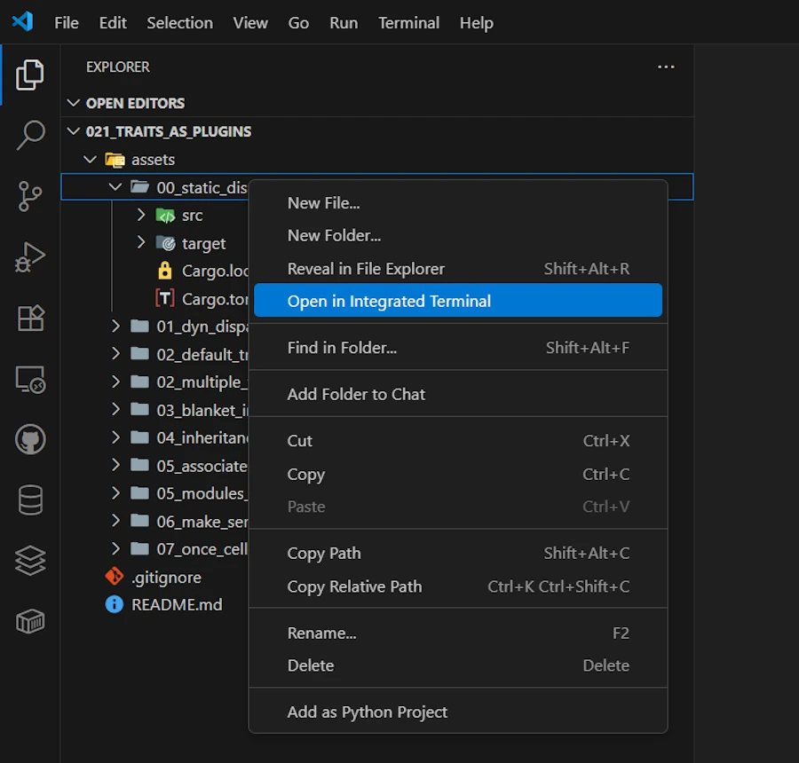

# Rust Traits: Defining Character
{: .no_toc }

From basic syntax to building plugins with once_cell and organizing your Rust projects.
{: .lead }


<h2 align="center">
<span style="color:orange"><b>This post is still under construction.</b></span>    
</h2>


## TL;DR
{: .no_toc }

* For beginners
* The code is on [GitHub](https://github.com/40tude/traits_as_plugins)

<div align="center">
<br/>
<!-- <span>In space, no one can hear you scream.</span> -->
</div>


## A gentle start - Static dispatch
With static dispatch, everything is known at compile time

### Running the demo code
{: .no_toc }

I will not explain how to run the code every time.
* Get the projet from [GitHub](https://github.com/40tude/traits_as_plugins)
* Open the folder with VSCode
* Right click on `assets/00_static_dispatch`
* Select the option "Open in Integrated Terminal"


<div align="center">
<br/>
<span>Open in Integrated Terminal</span>
</div>


***Why do I need to open a terminal before to run the code?*** Simply because the project include multiple projects and some of them are more than few lines of code dropped in a `/examples/demo01.rs` file. 


* Enter `cargo run`


<div align="center">
<br/>
<span>Results in the Integrated Terminal</span>
</div>


* If you don't want to run the code locally, until the chapter about Modules & Crates you should be able to copy and paste the code in the excellent [Rust Playground](https://play.rust-lang.org/?version=stable&mode=debug&edition=2024&gist=d2d109f3055e1780562c8e7a97279470). 
    * For this time, and this time only, you can click the previous link and press CTRL+ENTER once in Rust Playground
    * Or... You can copy the code below 
    * Past it [Rust Playground](https://play.rust-lang.org/?version=stable&mode=debug&edition=2024)
    * Press CTRL + ENTER


<div align="center">
<br/>
<span>Running code in Rust PlayGround</span>
</div>


### Show me the code!
{: .no_toc }


```rust
pub trait Measurable {
    fn get_temp(&self) -> f64;
}

struct TempSensor01 {
    temp: f64,
}
impl Measurable for TempSensor01 {
    fn get_temp(&self) -> f64 {
        self.temp
    }
}

#[allow(dead_code)]
struct TempSensor02 {
    label: String,
    temp: f64,
}
impl Measurable for TempSensor02 {
    fn get_temp(&self) -> f64 {
        self.temp * 9.0 / 5.0 + 32.0
    }
}

// static dispatch - known at compile time
fn get_temp_from_any_sensor_static1(t: &impl Measurable) {
    println!("{}", t.get_temp());
}

// static dispatch - generic syntax
fn get_temp_from_any_sensor_static2<T: Measurable>(t: &T) {
    println!("{}", t.get_temp());
}

fn main() {
    let my_sensor = TempSensor01 { temp: 25.0 };
    println!("{}", my_sensor.get_temp());

    let sensor1 = TempSensor01 { temp: 25.0 };
    let sensor2 = TempSensor02 {
        label: "thermocouple".into(),
        temp: 25.0, // 77 °F
    };

    get_temp_from_any_sensor_static1(&sensor1);
    get_temp_from_any_sensor_static1(&sensor2);

    get_temp_from_any_sensor_static2(&sensor1);
    get_temp_from_any_sensor_static2(&sensor2);
}
```

### Explanations
{: .no_toc }


## Dynamic dispatch

datatype are discovered at runtime

```rust
trait Measurable {
    fn get_temp(&self) -> f64;
}

struct TempSensor01 {
    temp: f64,
}
impl Measurable for TempSensor01 {
    fn get_temp(&self) -> f64 {
        self.temp
    }
}

#[allow(dead_code)]
struct TempSensor02 {
    label: String,
    temp: f64,
}
impl Measurable for TempSensor02 {
    fn get_temp(&self) -> f64 {
        self.temp * 9.0 / 5.0 + 32.0
    }
}

// Factory that decides at runtime
// Returning a trait object hides the concrete type
fn make_sensor(kind: &str) -> Box<dyn Measurable> {
    match kind {
        "celsius" => Box::new(TempSensor01 { temp: 1.0 }),
        "fahrenheit" => Box::new(TempSensor02 {
            label: "thermocouple".into(),
            temp: 25.0, // 77 °F
        }),
        _ => Box::new(TempSensor01 { temp: 0.0 }),
    }
}

fn main() {
    // A vector of Measurable
    let mut sensors: Vec<Box<dyn Measurable>> = Vec::new();
    sensors.push(make_sensor("celsius"));
    sensors.push(make_sensor("fahrenheit"));

    for s in &sensors {
        // Virtual call through a vtable (dynamic dispatch, fat vector)
        println!("Reading: {}", s.get_temp());
    }
}

```