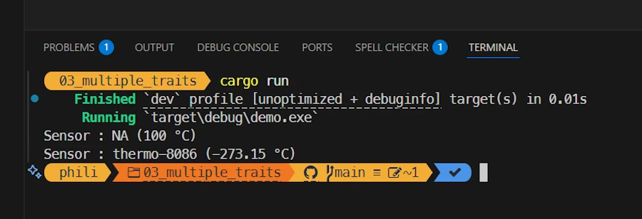
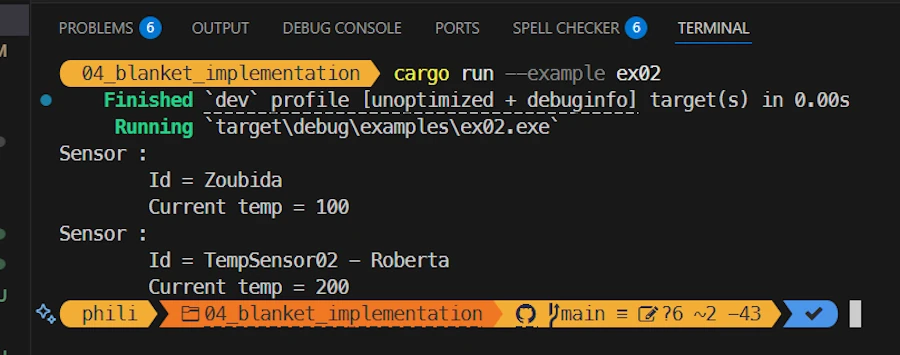
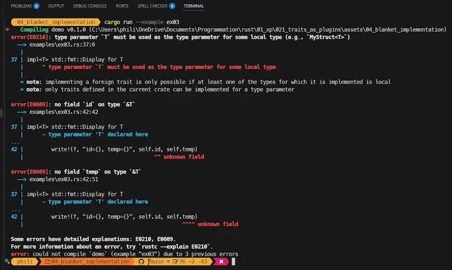
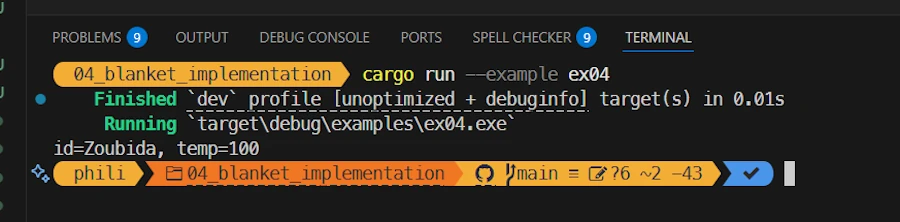
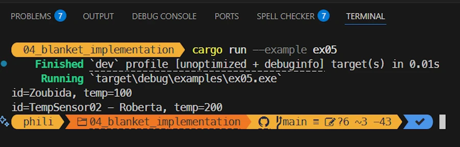
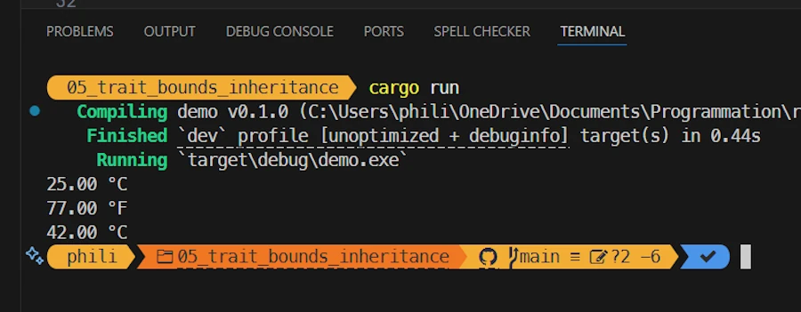
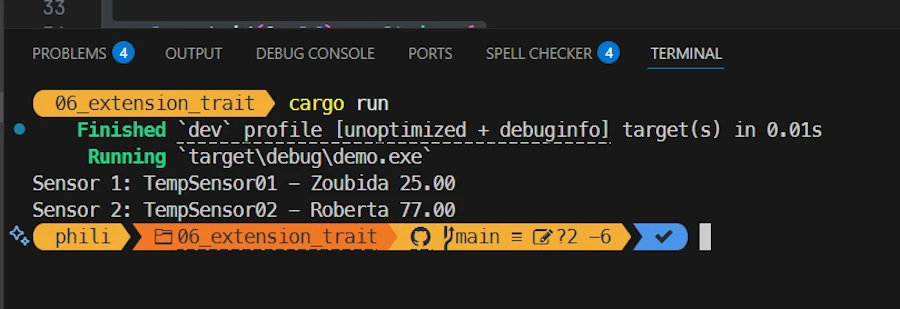
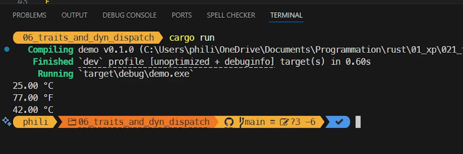
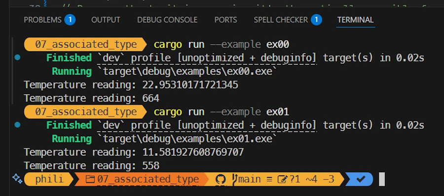
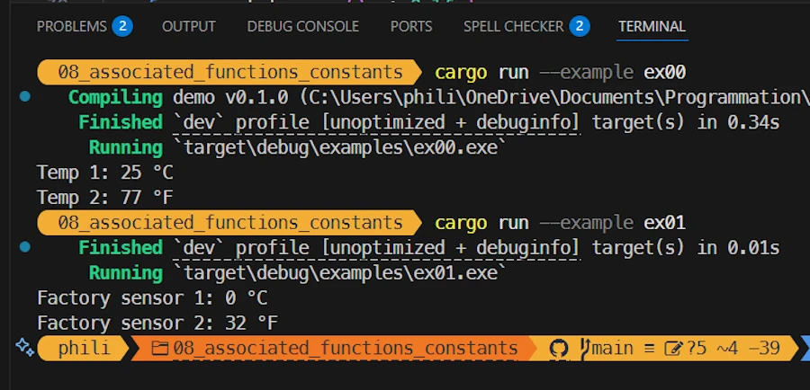

<!-- 
TODO :
* Avant le résumer, donner des exercices des trucs à faire
* Ajouter des question du lecteur. Entre autres pour passer d'une section à l'autre
* Ajouter des liens sur le vocabulaire : 
    * ~~paramètre~~, ~~argument~~, 
    * ~~level of indirection~~
    * ~~statement~~
    * expression
    * fat pointer + vtable
* ???
-->


# Rust Traits: Defining Character
{: .no_toc }

From basic syntax to building plugins with once_cell and organizing your Rust projects.
{: .lead }


<h2 align="center">
<span style="color:orange"><b>This post is under construction.</b></span>    
</h2>
Will be split in 2 or 3    


## TL;DR
{: .no_toc }

* For beginners
* The code is on [GitHub](https://github.com/40tude/traits_as_plugins)

<div align="center">
<br/>
<!-- <span>In space, no one can hear you scream.</span> -->
</div>


## Posts 
* [Episode 0]()
* [Episode 1]()

## Table of Contents
{: .no_toc .text-delta}
- TOC
{:toc}


<!-- ###################################################################### -->
<!-- ###################################################################### -->
<!-- ###################################################################### -->
<!-- ###################################################################### -->
<!-- ###################################################################### -->


## Multiple Traits
Where using the generic syntax allow to add more than one trait bounds to the parameters of a function

### Running the demo code
{: .no_toc }

* Right click on `assets/03_multiple_traits`
* Select the option "Open in Integrated Terminal"
* `cargo run`


<div align="center">
<br/>
<!-- <span>Running code in Rust Playground</span> -->
</div>


### Explanations 1/2 
{: .no_toc }

You have played with the last sample code in Rust Playground. Don't you? It is simple, easy to understand and everything looks like we are running a kind of inventory. However, the point was to demonstrate the default implementation and so, in the `main()` function we have a line similar to : `println!("{}°C, label: {}", sensor100.get_temp(), sensor100.get_label());`

Now let's say we want to write a kind of `inventory()` function. One of the constraint we want to have is to make sure that the parameters implement the methods we need. Here we needed to be able to invoke `.get_temp()` and `.get_label()`. 

This is where multiple traits and bounds come into the game since they do exactly that. In the function signature using the generic syntax, we can specify which traits must be available (no matter if it is via a default implementation or not)

Let's read some code.


### Show me the code!
{: .no_toc }

```rust
// ----------------------------
pub trait Measurable {
    fn get_temp(&self) -> f64 {
        -273.15
    }
}

pub trait Identifiable {
    fn get_id(&self) -> String {
        "NA".into()
    }
}

// ----------------------------
struct TempSensor01 {
    temp: f64,
}
impl Identifiable for TempSensor01 {}
impl Measurable for TempSensor01 {
    fn get_temp(&self) -> f64 {
        self.temp
    }
}

// ----------------------------
struct TempSensor02 {
    label: String,
    temp: f64,
}
impl Measurable for TempSensor02 {}
impl Identifiable for TempSensor02 {
    fn get_id(&self) -> String {
        self.label.clone()
    }
}

// ----------------------------
struct TempSensor03 {
    temp: f64,
}
impl Measurable for TempSensor03 {}

// Static dispatch, generic syntax
fn inventory<T: Measurable + Identifiable>(sensor: &T) {
    println!("Sensor : {} ({} °C)", sensor.get_id(), sensor.get_temp());
}

fn main() {
    let sensor1 = TempSensor01 { temp: 100.0 };

    let sensor2 = TempSensor02 {
        label: "thermo-8086".into(),
        temp: 200.0,
    };

    inventory(&sensor1);
    inventory(&sensor2);

    // let sensor3 = TempSensor03 { temp: 300.0 };
    // inventory(&sensor3); // ! Does not compile : Identifiable is required by this bound in `inventory`
}
```


### Explanations 2/2 
{: .no_toc }

At the top of the code we define 2 traits : Measurable and Identifiable. They both have a unique method and they both propose a default implementation of their respective method : `get_temp()` that we know by heart and `get_id()` which returns the Id of the temperature sensor.

```rust
pub trait Measurable {
    fn get_temp(&self) -> f64 {
        -273.15
    }
}

pub trait Identifiable {
    fn get_id(&self) -> String {
        "NA".into()
    }
}
```

Then we define our two friends `TempSensor01` and `TempSensor02`. Their respective implementation is not yet complete and they use the default implementations of the trait when needed. For example here is how it is written for `TempSensor01` ;

```rust
struct TempSensor01 {
    temp: f64,
}
impl Measurable for TempSensor01 {
    fn get_temp(&self) -> f64 {
        self.temp
    }
}
impl Identifiable for TempSensor01 {}
```

There is a last data type, named `TempSensor03`. It has the `Measurable` trait (and leverages the default implementation) but it does not have the `Identifiable` trait.

```rust
struct TempSensor03 {
    temp: f64,
}
impl Measurable for TempSensor03 {}
```

In the `main()` function we create two sensors and we pass them as argument to the `inventory()` function.

What did you expect? The most interesting part is the definition of the `inventory()` function.

```rust
fn inventory<T: Measurable + Identifiable>(sensor: &T) {
    println!("Sensor : {} ({} °C)", sensor.get_id(), sensor.get_temp());
}
```

In plain French it says: My name is `inventory`. I use the generic syntax <T: Measurable + Identifiable> to declare that I work with any type `T` that implements both the `Measurable` and `Identifiable` traits.

When someone calls me, they must pass me a `sensor`, which is a reference to such a type. Because of the trait bounds, I know that this sensor will always provide the methods `get_id()` and `get_temp()`, so I can safely print its identifier and temperature.

**Note:** Between you and me I would prefer to write `fn inventory<T: Measurable x Identifiable>(sensor: &T) {...}` because, for me, `x` is associated to `AND` while `+` is associated to `OR`.      

**Note:** The syntax may become hard to read if we have many bounds. This is where the `where` clause can help. In our case it does not make a big difference however :

```rust
fn inventory<T>(sensor: &T)
where
    T: Measurable + Identifiable,
{
    println!("Sensor : {} ({} °C)", sensor.get_id(), sensor.get_temp());
}
```
But it helps with the code below :

```rust
fn combine<A, B, C>(a: &A, b: &B) -> C
where
    A: Measurable + Identifiable,
    B: Identifiable,
    C: From<(String, f64)>,
{
    C::from((a.get_id(), b.get_id().len() as f64))
}
```


### Exercise
{: .no_toc }

1. Uncomment the lines at the end of `main()`
1. Build and make sure the code does not compile
1. Make the code working with `sensor3`


### Summary
{: .no_toc }

* Using the generic syntax
* We can express the fact that a function requires 
    * A type implementing more than one trait  
    * Multiple types implementing various traits 
* The `where` helps to keep function definition clean and lean


<!-- ###################################################################### -->
<!-- ###################################################################### -->
<!-- ###################################################################### -->
<!-- ###################################################################### -->
<!-- ###################################################################### -->


## Blanket Implementation
Where the compiler write for us the code to implement certain traits.

**Warning:** This section is lengthy because I experiment and play with many different ideas. 


<!-- ###################################################################### -->
<!-- ###################################################################### -->
### Implementation for Display

Where we learn to implement an external trait on one of our own data types.

#### Running the demo code
{: .no_toc }

**Pay attention...** The source code is in the `examples/` subdirectory.

* Click on `assets/04_blanket_implementation/examples` to see the list of source code.
* Right click on `assets/04_blanket_implementation`
* Select the option "Open in Integrated Terminal"
* `cargo run --example ex00`

<div align="center">
<br/>
<!-- <span>Running code in Rust Playground</span> -->
</div>


#### Explanations 1/2
{: .no_toc }

With the previous sample code, the way we used the `inventory()` function call in the `main()` was OK but not great. What I would like to write is something like : `println!("{}", sensor1);`

This is possible if we implement the `Display` trait for `TempSensor01`. Let's see how this can be done.


#### Show me the code!
{: .no_toc }

```rust
pub trait Measurable {
    fn get_temp(&self) -> f64;
}

pub trait Identifiable {
    fn get_id(&self) -> String;
}

struct TempSensor01 {
    temp: f64,
    id: String,
}

impl Measurable for TempSensor01 {
    fn get_temp(&self) -> f64 {
        self.temp
    }
}

impl Identifiable for TempSensor01 {
    fn get_id(&self) -> String {
        self.id.clone()
    }
}

impl std::fmt::Display for TempSensor01 {
    fn fmt(&self, f: &mut std::fmt::Formatter<'_>) -> std::fmt::Result {
        write!(f, "Sensor type : TempSensor01\n\tId = {}\n\tCurrent temp = {}", self.id, self.temp)
    }
}

fn main() {
    let sensor1 = TempSensor01 { temp: 100.0, id: "Zoubida".into() };
    println!("{}", sensor1);
}
```


#### Explanations 2/2 
{: .no_toc }

What is cool is that, at the end, in the main function we can write

```rust
let sensor1 = TempSensor01 { temp: 100.0, id: "Zoubida".into() };
println!("{}", sensor1);
```

This is cool because we print `sensor1` the same way we print an integer or a double. To get this result we "only have to" implement the trait `std::fmt::Display`. I say `std::fmt::Display` and not `Display` because, I want to underline the fact that the `std::fmt::Display` trait is external. It belongs to `std::fmt`, we do not own it. Keep this in mind as we will come back to the ownership issue later.

***OK... But how do you write the implementation of a trait that you do not own `std::fmt::Display` for trait that you own `TempSensor01`?*** 

This might be obvious but nowhere in the code above we define the trait `Display`. We don't own it so we don't write something like :

```rust
pub trait Display {
   ...
}
```

However we can write the implementation `std::fmt::Display` for `TempSensor01`. We write : 

```rust
impl std::fmt::Display for TempSensor01 {
    fn fmt(&self, f: &mut std::fmt::Formatter<'_>) -> std::fmt::Result {
        write!(f, "Sensor type : TempSensor01\n\tId = {}\n\tCurrent temp = {}", self.id, self.temp)
    }
}
```

Compared to what we already know when we deal with our own traits, fundamentally there is nothing new. The trait `std::fmt::Display` have in its interface one function named `fmt` which have a specific signature. Don't trust me. Double check in your [bedside book](https://doc.rust-lang.org/std/fmt/trait.Display.html) and make sure you can find it again if I don't give you the link (start from https://doc.rust-lang.org/stable/std/, Crates `std` on the left hand side, `fmt` module at the bottom of the page, `Display` trait at the bottom of the page...)

In our code, we copy paste the signature and write the definition of the `fmt` method for the data type `TempSensor01`. In the signature the `<'_>` is a lifetime specifier which is not used here. Note that we use `self.id` and `self.temp` directly. Life is easy.   


#### Exercise
{: .no_toc }

1. Starting from `https://doc.rust-lang.org/stable/std/`, find your way to `std::fmt::Display` in the documentation. 
1. Read the page
1. In `std::fmt::Display`, use the formatter so that the temperature is displayed with only one digit (27.9, not 27.94) and the label in uppercase.


#### Summary
{: .no_toc }

***But the compiler did'nt write anything for us! Did it?*** No it did'nt. You are right, this first sample code shows how we can implement `std::fmt::Display`, an external trait, on a local data type that we own.  

Ok... Now let's see if a blanket implementation can answer our question.


<!-- ###################################################################### -->
<!-- ###################################################################### -->
### Blanket Implementation for Real 

Where the compiler writes the code of the trait implementation for us.

#### Running the demo code
{: .no_toc }

* Right click on `assets/04_blanket_implementation`
* Select the option "Open in Integrated Terminal"
* `cargo run --example ex01`

<div align="center">
<br/>
<!-- <span>Running code in Rust Playground</span> -->
</div>


#### Explanations 1/2
{: .no_toc }

In the previous sample code we had to write the method. See below : 

```rust
impl std::fmt::Display for TempSensor01 {
    fn fmt(&self, f: &mut std::fmt::Formatter<'_>) -> std::fmt::Result {
        write!(f, "Sensor type : TempSensor01\n\tId = {}\n\tCurrent temp = {}", self.id, self.temp)
    }
}
```

This means that if we continue that way we have to implement the method `std::fmt::Display` for `TempSensor02`, `TempSensor03`... `TempSensorNN`. This is a waste of time and error prone. This is where Rust blanket implementation can help because it can write implementation code for us.   


#### Show me the code!
{: .no_toc }

```rust
use std::fmt::{Display, Formatter, Result as FmtResult};

pub trait Measurable {
    fn get_temp(&self) -> f64;
}

pub trait Identifiable {
    fn get_id(&self) -> String;
}

struct TempSensor01 {
    temp: f64,
    id: String,
}

impl Measurable for TempSensor01 {
    fn get_temp(&self) -> f64 {
        self.temp
    }
}

impl Identifiable for TempSensor01 {
    fn get_id(&self) -> String {
        self.id.clone()
    }
}

struct TempSensor02 {
    temp: f64,
    id: String,
}

impl Measurable for TempSensor02 {
    fn get_temp(&self) -> f64 {
        self.temp * 9.0 / 5.0 + 32.0
    }
}

impl Identifiable for TempSensor02 {
    fn get_id(&self) -> String {
        "TempSensor02 - ".to_owned() + &self.id
    }
}

trait Printable {
    fn print(&self);
}

impl<T> Printable for T
where
    T: Identifiable + Measurable,
{
    fn print(&self) {
        println!("Sensor : \n\tId = {}\n\tCurrent temp = {}", self.get_id(), self.get_temp())
    }
}

fn main() {
    let sensor1 = TempSensor01 { temp: 25.0, id: "Zoubida".into() };
    let sensor2 = TempSensor02 { temp: 25.0, id: "Roberta".into() };

    sensor1.print();
    sensor2.print();

    struct Nimbus2000 {}
    let bob = Nimbus2000 {};
    // bob.print();
}
```


#### Explanations 2/2
{: .no_toc }

I guess I can save some time here because you know the context : 2 TempSensor data types, 2 traits blablabla.

In the `main()` function we write

```rust
fn main() {
    let sensor1 = TempSensor01 { temp: 25.0, id: "Zoubida".into() };
    let sensor2 = TempSensor02 { temp: 25.0, id: "Roberta".into() };

    sensor1.print();
    sensor2.print();
}
```

This is not yet perfect because ideally we would like to write something similar to :

```rust
fn main() {
    let sensors: Vec<Box<dyn TempSensor>> = vec![
        Box::new(TempSensor01 { temp: 25.0 }),
        Box::new(TempSensor02 { temp: 25.0 }), // 77 °F
    ];

    for sensor in sensors {
        println!("{}", sensor);
    }
}
```

Nonetheless we make significant progress because we no longer have to write each implementation of the `.print()` method.

***Did you stumble upon a secret incantation in some ancient grimoire, or did you just sacrifice a few chickens? Tell me your secret!***

First we define a `Printable` trait and its interface have one `print()` method.

```rust
trait Printable {
    fn print(&self);
}
```
Next we use the generic syntax to define the implementation of the trait `Printable` for any type having the `Identifiable` and `Measurable` traits. 

```rust
impl<T> Printable for T
where
    T: Identifiable + Measurable,
{
    fn print(&self) {
        println!("Sensor : \n\tId = {}\n\tCurrent temp = {}", self.get_id(), self.get_temp())
    }
}
```

**It took me some time to realize:** 
* The code above is a generalized implementation for any type implementing `Identifiable` and `Measurable`
* At compile time, Rust monomorphizes the "template" **for each concrete type** that satisfies the traits bounds (`Identifiable + Measurable`). To tell the truth, I can easily forget this point when reading code.
* Since `TempSensor01` implements `Identifiable` and `Measurable`, it gets the `Printable` implementation for "free", and `sensor1.print()` compiles and works like a charm.
* The same apply to `TempSensor02`.
* In the `main()` function, the code looks like a kind a polymorphism working on `sensor1` and `sensor1` but no, no, and no. Behind the scene each version of `.print()` have been monomorphized for each concrete type.
* The trait bounds checks are done at compile time → no runtime cost, no surprises since everything is checked at compile time.


***In the source code it is written that bob.print() does not compile. Can you explain?*** No, read the source code and tell me what you think. Here is a copy of the code fragment :

```rust
    struct Nimbus2000 {}
    let bob = Nimbus2000 {};
    // bob.print();
```

*Ok... On the last line of the bullet list, it is said that the trait bounds checks are done at compile time. Now in the code fragment I understand that `Nimbus200` is a datatype (I thought it was a magic broom). It is empty but before all this data type does not implement `Measurable` nor `Identifiable`. When the compiler sees the `bob.print()` call it asks the monomorphization system to generate (expand) the `Printable` trait so that `.print()` can be called. However, this is not possible because `Printable` is monomorphizable if and only if `T` implements the traits `Identifiable` and `Measurable`. This is not the case with `Nimbus2000` data type and the compiler reports errors and suggest options. Did I get it right?*

You're a grand master!

<div align="center">
<iframe width="560" height="315" src="https://www.youtube.com/embed/PobrSpMwKk4?si=tAiOW_xG7Xii33PE" title="YouTube video player" frameborder="0" allow="accelerometer; autoplay; clipboard-write; encrypted-media; gyroscope; picture-in-picture; web-share" referrerpolicy="strict-origin-when-cross-origin" allowfullscreen></iframe>
</div>


***OK... But I in the `main()` function I would like to read `println!("{}", blablabla);` rather than `sensor1.print();`. What can we do ?***


#### Exercise
{: .no_toc }

1. Make the code work with `Nimbus200`


#### Summary
{: .no_toc }

Before to move on, **keep in mind** :
* Blanket implementation (generalized implementation) use the generic syntax
* It generates (monomorphizes) for us code for certain traits
* Trait bounds checking occurs at compile time, not runtime 


<!-- ###################################################################### -->
<!-- ###################################################################### -->
### Blanket Implementation II 

Where the compiler writes, once again, the code of the trait implementation for us.


#### Running the demo code
{: .no_toc }

* Right click on `assets/04_blanket_implementation`
* Select the option "Open in Integrated Terminal"
* `cargo run --example ex02`

<div align="center">
<br/>
<!-- <span>Running code in Rust Playground</span> -->
</div>


<!-- ### Explanations 1/2
{: .no_toc } -->


#### Show me the code!
{: .no_toc }

```rust
pub trait Measurable {
    fn get_temp(&self) -> f64;
}

pub trait Identifiable {
    fn get_id(&self) -> String;
}

struct TempSensor01 {
    temp: f64,
    id: String,
}

impl Measurable for TempSensor01 {
    fn get_temp(&self) -> f64 {
        self.temp
    }
}

impl Identifiable for TempSensor01 {
    fn get_id(&self) -> String {
        self.id.clone()
    }
}

struct TempSensor02 {
    temp: f64,
    id: String,
}

impl Measurable for TempSensor02 {
    fn get_temp(&self) -> f64 {
        self.temp
    }
}

impl Identifiable for TempSensor02 {
    fn get_id(&self) -> String {
        "TempSensor02 - ".to_owned() + &self.id
    }
}

trait PrettyFmt {
    fn pretty(&self) -> String;
}

impl<T> PrettyFmt for T
where
    T: Identifiable + Measurable,
{
    fn pretty(&self) -> String {
        format!("Sensor : \n\tId = {}\n\tCurrent temp = {}", self.get_id(), self.get_temp())
    }
}

fn main() {
    let sensor1 = TempSensor01 { temp: 100.0, id: "Zoubida".into() };
    let sensor2 = TempSensor02 { temp: 200.0, id: "Roberta".into() };

    println!("{}", sensor1.pretty());
    println!("{}", sensor2.pretty());
}
```

#### Explanations 
{: .no_toc }

This is not yet perfect. In the `main()` function we had :

```rust
fn main() {
    let sensor1 = TempSensor01 { temp: 25.0, id: "Zoubida".into() };
    let sensor2 = TempSensor02 { temp: 25.0, id: "Roberta".into() };

    sensor1.print();
    sensor2.print();
}
```

Now we have 

```rust
fn main() {
    let sensor1 = TempSensor01 { temp: 100.0, id: "Zoubida".into() };
    let sensor2 = TempSensor02 { temp: 200.0, id: "Roberta".into() };

    println!("{}", sensor1.pretty());
    println!("{}", sensor2.pretty());
}
```

It is really a matter of taste. Let's not spend to much time on it you already have all the information to understand the code. Read it, read it again.


#### Exercise
{: .no_toc }

1. Talk to yourself out loud and explain the difference between both versions of the code. Why in one case we use `sensor1.print();` while in the other we write `println!("{}", sensor1.pretty());`
1. Which one do you prefer and provide 3 reasons
1. Check your arguments with ChatGPT or another LLM  


#### Summary
{: .no_toc }


***So you are saying there is no solution?*** Did I say that? No, but before to go further let's study a source code that **does not compile**. This will help us to underline an important point about the blanket implementation.


<!-- ###################################################################### -->
<!-- ###################################################################### -->
### Orphan/coherence rules 

Where the compiler warns us before we shoot ourselves in the foot.


#### Running the demo code
{: .no_toc }

* Right click on `assets/04_blanket_implementation`
* Select the option "Open in Integrated Terminal"
* `cargo run --example ex03`

Remember the Alamo — but also remember, this code **won’t compile**.

<div align="center">
<br/>
<!-- <span>Running code in Rust Playground</span> -->
</div>


#### Explanations 1/2
{: .no_toc }

Earlier we learnt how to implement the `Display` trait for `TempSensor01`. It worked like a charm. We just learnt about the generalized trait implementation. Let's mixt both and get the best of both worlds!


#### Show me the code!
{: .no_toc }

```rust
pub trait Measurable {
    fn get_temp(&self) -> f64;
}

pub trait Identifiable {
    fn get_id(&self) -> String;
}

struct TempSensor01 {
    temp: f64,
    id: String,
}

impl Measurable for TempSensor01 {
    fn get_temp(&self) -> f64 {
        self.temp
    }
}

impl Identifiable for TempSensor01 {
    fn get_id(&self) -> String {
        self.id.clone()
    }
}

impl<T> std::fmt::Display for T
where
    T: Measurable + Identifiable,
{
    fn fmt(&self, f: &mut std::fmt::Formatter<'_>) -> std::fmt::Result {
        write!(f, "id={}, temp={}", self.id, self.temp)
    }
}

fn main() {
    let sensor1 = TempSensor01 { temp: 100.0, id: "Zoubida".into() };
    println!("{}", sensor1);
}
```


#### Explanations 2/2
{: .no_toc }

We have 2 traits (`Measurable` and `Identifiable`). Then we define a `TempSensor01` data type which implements both traits.

In the `main()` function we write `println!("{}", sensor1);` hoping that it will work because we have been brave and smart.

Indeed we use the generic syntax to define the implementation of the trait `std::fmt::Display`. Since we are very smart we do not forget to add some trait bounds because we want to make sure that only the data types having the `Measurable` and `Identifiable` traits will be allowed to use it. 

So beautiful, so well written, so smart... Look below :

```rust
impl<T> std::fmt::Display for T
where
    T: Measurable + Identifiable,
{
    fn fmt(&self, f: &mut std::fmt::Formatter<'_>) -> std::fmt::Result {
        write!(f, "id={}, temp={}", self.id, self.temp)
    }
}
```


Nice try but **NO**. This does not work. To make a long story short 
* This does not compile because of Rust's **orphan/coherence rules**
* Indeed, ``Display`` is a foreign trait (defined in `std::fmt`).
* We are not allowed to implement a **foreign trait** for a **foreign type**.
* Indeed in the code above `impl<T> Display for T where T: ...`, the target type `T` is a generic 'any' type (not a local type that we own) → prohibited.

The idiomatic solution is the **newtype pattern** where we wrap your `T` in a local type (that we own), then we implement `std::fmt::Display` for that wrapper. Additionally we can offer a helper to make it easier to use.

In the next section we will see how the newtype pattern can be used in our case.


#### Exercise
{: .no_toc }

1. Compile the code once again
1. Read the compiler messages. Did you? Really? Line by line from the beginning to the end? Read it again... Just to make sure...
1. Does it make more sense?
1. Will you be able to interpret it the next time it appears?


#### Summary
{: .no_toc }


<!-- ###################################################################### -->
<!-- ###################################################################### -->
### Newtype pattern I
<!-- {: .no_toc } -->

Where the compiler writes implementation code for an intermediate data type.

#### Running the demo code
{: .no_toc }

* Right click on `assets/04_blanket_implementation`
* Select the option "Open in Integrated Terminal"
* `cargo run --example ex04`

<div align="center">
<br/>
<!-- <span>Running code in Rust Playground</span> -->
</div>


#### Explanations 1/2 
{: .no_toc }

In the previous sample code we learnt that we cannot write `impl<T> std::fmt::Display for T...`. This is because we do not own the trait `std::fmt::Display` nor the generic type `T`. As often, the trick is to add a [level of indirection]() by defining an intermediate data type that we own and on which we can implement `std::fmt::Display`. Let's see how.


#### Show me the code!
{: .no_toc }

```rust
use std::fmt::{Display, Formatter, Result as FmtResult};

pub trait Measurable {
    fn get_temp(&self) -> f64;
}

pub trait Identifiable {
    fn get_id(&self) -> String;
}

struct TempSensor01 {
    temp: f64,
    id: String,
}

impl Measurable for TempSensor01 {
    fn get_temp(&self) -> f64 {
        self.temp
    }
}

impl Identifiable for TempSensor01 {
    fn get_id(&self) -> String {
        self.id.clone()
    }
}

struct AsDisplay<'a, T: Measurable + Identifiable>(&'a T);

impl<T> Display for AsDisplay<'_, T>
where
    T: Measurable + Identifiable,
{
    fn fmt(&self, f: &mut Formatter<'_>) -> FmtResult {
        write!(f, "id={}, temp={}", self.0.get_id(), self.0.get_temp())
    }
}

fn main() {
    let sensor1 = TempSensor01 { temp: 100.0, id: "Zoubida".into() };
    println!("{}", AsDisplay(&sensor1));
}
```


#### Explanations 2/2 
{: .no_toc }

You know the song... Two traits (`Measurable` and `Identifiable`). Then we define a `TempSensor01` data type which implements both traits.

Then we define an intermediate data type named `AsDisplay`. The line below does'nt compile but this is good enough for now because I want to underline that this defines a **tuple struct** with a single field.

```rust
struct AsDisplay<T: Measurable + Identifiable>(&T)
```

**Note:** Just to make sure, don't take it personally if you already know all this:
* A tuple struct looks like : `struct Point(i32, i32);`
* It has unnamed fields, accessed by index (`p.0`, `p.1`)
* It’s syntactically close to a tuple but defines a new distinct type
* Can be used to define our new type adding a thin wrapper around an existing type : `struct Temperature(f64); // different type from plain f64`

In addition, the tuple struct, the wrapper stores a reference (&T). Any struct that contains a reference **must** name the lifetime of that reference. [Lifetime elision](https://doc.rust-lang.org/reference/lifetime-elision.html) works in function signatures but **not** in struct definitions, so the compiler forces us to add one. Finally the working line of code is :

```rust
struct AsDisplay<'a, T: Measurable + Identifiable>(&'a T);
```

Now we have our intermediate data type and we can implement `Display` on it. It looks like this :

```rust
impl<T> Display for AsDisplay<'_, T>
where
    T: Measurable + Identifiable,
{
    fn fmt(&self, f: &mut Formatter<'_>) -> FmtResult {
        write!(f, "id={}, temp={}", self.0.get_id(), self.0.get_temp())
    }
}
```

The only point of attention is the weird syntax `self.0.get_id()`. However if we remember that `AsDisplay` is a `tuple struct` with a single, unnamed field then this way of writing should be clearer. `self.0` points to the first and unique field. `.get_id()` or `.get_temp()` invoke the method.

With this way of expressing things, in the `main()` function we can write :

```rust
println!("{}", AsDisplay(&sensor1));
```

Here is what happens : We temporarily wrap a borrow of sensor1 into `AsDisplay`, `println!` detects that `AsDisplay` data type implements `Display`. It calls our custom `fmt`, which in turn delegates to the `Measurable` and `Identifiable` methods of the underlying sensor, and the resulting string is printed.

**Long version:**
1. **Borrowing the sensor**
   * `&sensor1` creates a shared reference to `sensor1`.
   * The type of that expression is `&TempSensor01`.

2. **Constructing the wrapper**
   * `AsDisplay(&sensor1)` calls the tuple struct constructor for `AsDisplay`.
   * This produces a temporary value of type `AsDisplay<'_, TempSensor01>`.
   * The lifetime `'_` is inferred to be “the lifetime of `&sensor1`,” i.e. the borrow is tied to the scope of the `println!` call.

3. **Macro expansion**
   * The `println!` macro expands roughly into a call to `std::fmt::Arguments::new_v1()` and eventually a call to `std::io::stdout().write_fmt(...)`.
   * Inside this machinery, Rust sees the `{}` placeholder and asks: *Does the type `AsDisplay<'_, TempSensor01>` implement `Display`?*

4. **Trait resolution**
   * The compiler finds our `impl<'a, T> Display for AsDisplay<'a, T>` where `T: Measurable + Identifiable`.
   * Since `TempSensor01` implements both `Measurable` and `Identifiable`, the blanket implementation applies.

5. **Calling `fmt`**
   * The formatting machinery calls `AsDisplay::fmt(&wrapper, f)`.
   * Inside our `fmt` implementation, `self.0` gives access to the inner `&TempSensor01`.
   * Then `get_id()` and `get_temp()` are called on the inner sensor to build the string.

6. **Printing to stdout**
   * The result of `write!(...)` inside `fmt` is passed back up through the formatting machinery.
   * `println!` finally writes the formatted string (`id=Zoubida, temp=100`) followed by a newline to standard output.


#### Exercise
{: .no_toc }

1. Why, in the newtype pattern, we use a tuple struct and not a simple tuple? 
1. When you write `let bob = (18, &sensor1);`. What is love? Oops, what is `bob`? Is it a value, a data type, something else ?

<div align="center">
<iframe width="560" height="315" src="https://www.youtube.com/embed/HEXWRTEbj1I?si=BNdfSwzvtKeduEur" title="YouTube video player" frameborder="0" allow="accelerometer; autoplay; clipboard-write; encrypted-media; gyroscope; picture-in-picture; web-share" referrerpolicy="strict-origin-when-cross-origin" allowfullscreen></iframe>
</div>


#### Summary
{: .no_toc }


However, this is not yet perfect because we create a temporary variable in the `println!` macro. Let's see if we can improve things. 


<!-- ###################################################################### -->
<!-- ###################################################################### -->
### Newtype pattern II

Where we use a convenient function call to hide the use of the ad hoc data type.  


#### Running the demo code
{: .no_toc }

* Right click on `assets/04_blanket_implementation`
* Select the option "Open in Integrated Terminal"
* `cargo run --example ex05`

<div align="center">
<br/>
<!-- <span>Running code in Rust Playground</span> -->
</div>


#### Explanations 1/2
{: .no_toc }

This section will be short and easy because we will apply the trick we used earlier in the `Blanket Implementation II `.


#### Show me the code!
{: .no_toc }

```rust
use std::fmt::{Display, Formatter, Result as FmtResult};

pub trait Measurable {
    fn get_temp(&self) -> f64;
}

pub trait Identifiable {
    fn get_id(&self) -> String;
}

struct TempSensor01 {
    temp: f64,
    id: String,
}

impl Measurable for TempSensor01 {
    fn get_temp(&self) -> f64 {
        self.temp
    }
}

impl Identifiable for TempSensor01 {
    fn get_id(&self) -> String {
        self.id.clone()
    }
}

struct TempSensor02 {
    temp: f64,
    id: String,
}

impl Measurable for TempSensor02 {
    fn get_temp(&self) -> f64 {
        self.temp
    }
}

impl Identifiable for TempSensor02 {
    fn get_id(&self) -> String {
        "TempSensor02 - ".to_owned() + &self.id
    }
}

struct AsDisplay<'a, T: Measurable + Identifiable>(&'a T);

impl<'a, T> Display for AsDisplay<'a, T>
where
    T: Measurable + Identifiable,
{
    fn fmt(&self, f: &mut Formatter<'_>) -> FmtResult {
        write!(f, "id={}, temp={}", self.0.get_id(), self.0.get_temp())
    }
}

fn as_display<T: Measurable + Identifiable>(t: &T) -> AsDisplay<'_, T> {
    AsDisplay(t)
}

fn main() {
    let sensor1 = TempSensor01 { temp: 100.0, id: "Zoubida".into() };
    let sensor2 = TempSensor02 { temp: 200.0, id: "Roberta".into() };

    println!("{}", as_display(&sensor1));
    println!("{}", as_display(&sensor2));
}
```


#### Explanations 
{: .no_toc }

Not much to say. The code is mostly the same. Two traits (`Identifiable` and `Measurable`), two data type (`TempSensor01` and `TempSensor02`). The same newtype pattern. 

We only add a convenient `as_display()` function to build the wrapper without naming the type (`AsDisplay`) at call site.

```rust
fn as_display<T: Measurable + Identifiable>(t: &T) -> AsDisplay<'_, T> {
    AsDisplay(t)
}
```

One thing to keep in mind. In the `main()` function, `as_display()` looks polymorphic but no, no, no. There are 2 monomorphized implementations created at compile time. One per data type.

```rust
fn main() {
    ...
    println!("{}", as_display(&sensor1));
    println!("{}", as_display(&sensor2));
}
```


#### Exercise
{: .no_toc }

1. Compare source code of the sections `Newtype pattern I` and `Newtype pattern II`
1. Which one do you prefer ?
1. Why ?
1. Double check with your preferred LLM the pros and cons


#### Summary
{: .no_toc }

Again, nothing fancy here. 


### Summary
{: .no_toc }


<!-- ###################################################################### -->
<!-- ###################################################################### -->
<!-- ###################################################################### -->
<!-- ###################################################################### -->
<!-- ###################################################################### -->

## Trait Bounds Inheritance
Where we force a data type to implement a trait.

### Running the demo code
{: .no_toc }

* Right click on `assets/05_trait_bounds_inheritance`
* Select the option "Open in Integrated Terminal"
* `cargo run`

<div align="center">
<br/>
<!-- <span>Running code in Rust Playground</span> -->
</div>


### Explanations 1/2 
{: .no_toc }

In most of the sample code so far, we have implemented the trait `Display` because we want to print to the console. Would'nt be great if we could sign an agreement with the compiler saying something like : The data type that implements this trait must also implement this trait.   

This could be helpful because if one day we forget, then the compiler will gently remind us. Oh...Calm down! I said gently. Ok?. Ok.

<div align="center">
<br/>
<!-- <span>Running code in Rust Playground</span> -->
</div>

Let see how this works.


### Show me the code!
{: .no_toc }

```rust
use std::fmt::{Display, Formatter, Result as FmtResult};

trait TempSensor: Display {
    fn get_temp(&self) -> f64;
}

struct TempSensor01 {
    temp: f64,
}

impl TempSensor for TempSensor01 {
    fn get_temp(&self) -> f64 {
        self.temp
    }
}

impl Display for TempSensor01 {
    fn fmt(&self, f: &mut Formatter<'_>) -> FmtResult {
        write!(f, "{:.2} °C", self.temp)
    }
}

struct TempSensor02 {
    temp: f64,
}

impl TempSensor for TempSensor02 {
    fn get_temp(&self) -> f64 {
        self.temp * 9.0 / 5.0 + 32.0
    }
}

impl Display for TempSensor02 {
    fn fmt(&self, f: &mut Formatter<'_>) -> FmtResult {
        write!(f, "{:.2} °F", self.get_temp())
    }
}

fn main() {
    let sensors: Vec<Box<dyn TempSensor>> = vec![
        Box::new(TempSensor01 { temp: 25.0 }),
        Box::new(TempSensor02 { temp: 25.0 }), // 77 °F
        Box::new(TempSensor01 { temp: 42.0 }),
    ];

    for sensor in sensors {
        println!("{}", sensor);
    }
}
```


### Explanations 2/2 
{: .no_toc }

A long time ago, in a galaxy far, far away we wrote :

```rust
pub trait Measurable {
    fn get_temp(&self) -> f64;
}

struct TempSensor01 {
    temp: f64,
}
impl Measurable for TempSensor01 {
    fn get_temp(&self) -> f64 {
        self.temp
    }
}
```


Remember, it was in our very first sample code. Now the story begins like this :


```rust
trait TempSensor: Display {
    fn get_temp(&self) -> f64;
}

struct TempSensor01 {
    temp: f64,
}

impl TempSensor for TempSensor01 {
    fn get_temp(&self) -> f64 {
        self.temp
    }
}
```


It is almost the same thing... Except one char, the `:` in the `TempSensor` trait's signature. Do you see it in `trait TempSensor: Display {...}`. In plain english this says : any data type who wants to implement `TempSensor` must also implement `Display`.

This is why, once `TempSensor01` is defined, we first implement `TempSensor` for `TempSensor01` and then... We must implement implement `Display` for `TempSensor01`. See below :

```rust
impl Display for TempSensor01 {
    fn fmt(&self, f: &mut Formatter<'_>) -> FmtResult {
        write!(f, "{:.2} °C", self.temp)
    }
}
```

In the rest of the code the same apply for `TempSensor02`. And now... Tadaaa! 

<div align="center">
<br/>
<!-- <span>Running code in Rust Playground</span> -->
</div>

And look the beautiful body of... The `main()` function: 

```rust
fn main() {
    let sensors: Vec<Box<dyn TempSensor>> = vec![
        Box::new(TempSensor01 { temp: 25.0 }),
        Box::new(TempSensor02 { temp: 25.0 }), // 77 °F
        Box::new(TempSensor01 { temp: 42.0 }),
    ];

    for sensor in sensors {
        println!("{}", sensor);
    }
}
```

We define a vector of sensors. Then we go through all of the vector's values and we print them on the console using the sensor variable's name. 

Just to make sure... In the `main()` function, the code below works like a charm. Make a try in Rust Playground.

```rust
    let sensor1 = TempSensor01 { temp: 25.0 };
    let sensor2 = TempSensor02 { temp: 25.0 }; // 77°F
    println!("{}", sensor1);
    println!("{}", sensor2);
```

So... There is no function call, no method invoked. Just `println!`. Smoking!

<div align="center">
<br/>
<!-- <span>Running code in Rust Playground</span> -->
</div>


Yes... Almost. I say almost because... 
* Yes the `main()` function looks great. 
* Yes, it is impossible to forget to implement the `Display` trait
* But... But we still have to implement the Display trait ourselves. 


***You're right. Wouldn't it be great if we could delegate this task to the compiler?***

This is possible and you already know how : we need a mixt of trait bounds inheritance and blanket implementation so that the code of the Display implementation is generated by the compiler.  


### Exercise
{: .no_toc }

1. Create a new struct called `TempSensor03` that stores its temperature in Kelvin. 
1. Implement the TempSensor trait for it. Make sure that `get_temp()` returns the temperature in Kelvin.
1. Implement the Display trait for it, so that printing the sensor shows the temperature followed by "°K".
1.Add an instance of `TempSensor03` into the sensors vector in `main()` and check that the loop correctly prints all sensors, including your new one.


### Summary
{: .no_toc }


<!-- ###################################################################### -->
<!-- ###################################################################### -->
<!-- ###################################################################### -->
<!-- ###################################################################### -->
<!-- ###################################################################### -->


## Extension trait

Where the compiler generates the implementation code of the traits from which we inherit. 

### Running the demo code
{: .no_toc }

* Right click on `assets/06_extension_trait`
* Select the option "Open in Integrated Terminal"
* `cargo run`

<div align="center">
<br/>
<!-- <span>Running code in Rust Playground</span> -->
</div>


### Explanations 1/2 
{: .no_toc }

In the previous sample code, using inheritance, we make sure that if a data type implement `TempSensor` it also implement `Display`. However we had to copy paste the implementation of `Display` in our data type who wanted to implement `TempSensor` trait. Yes, I know, a data type doesn't want anything but you get the idea.

 


### Show me the code!
{: .no_toc }

```rust
// main.rs
// cargo run

trait TempSensor {
    fn get_temp(&self) -> f64;
    fn get_id(&self) -> String;
}

struct TempSensor01 {
    temp: f64,
    id: String,
}

impl TempSensor for TempSensor01 {
    fn get_temp(&self) -> f64 {
        self.temp
    }

    fn get_id(&self) -> String {
        "TempSensor01 - ".to_owned() + &self.id
    }
}

struct TempSensor02 {
    temp: f64,
    id: String,
}

impl TempSensor for TempSensor02 {
    fn get_temp(&self) -> f64 {
        self.temp * 9.0 / 5.0 + 32.0
    }

    fn get_id(&self) -> String {
        "TempSensor02 - ".to_owned() + &self.id
    }
}

trait SensorDisplay: TempSensor {
    fn pretty(&self) -> String {
        format!("{} {:.2} ", self.get_id(), self.get_temp(),)
    }
}

impl<T: TempSensor> SensorDisplay for T {}

fn main() {
    let sensor1 = TempSensor01 { temp: 25.0, id: "Zoubida".into() };
    let sensor2 = TempSensor02 { temp: 25.0, id: "Roberta".into() }; // 77°F

    println!("Sensor 1: {}", sensor1.pretty());
    println!("Sensor 2: {}", sensor2.pretty());
}
```


### Explanations 2/2 
{: .no_toc }

In the code above, we first create a trait `TempSensor` with 2 functions in the interface (`.get_temp()` and `.get_id()`). Then we create a data type `TempSensor01` and we implements `TempSensor` for it.

So any variable of type `TempSensor01` has the `.get_temp()` and `.get_id()` methods (and we do the same thing for the data type `TempSensor02`).

Now comes the interesting part.

```rust
trait SensorDisplay: TempSensor {
    fn pretty(&self) -> String {
        format!("{} {:.2} ", self.get_id(), self.get_temp(),)
    }
}
```

We know trait bound inheritance so we understand that, with the lines above, any type that implements `SensorDisplay` must also implement `TempSensor`.

We know about default trait implementation. So we understand that `.pretty()` has a default implementation that relies on the TempSensor methods (`.get_temp()` and `.get_id()`).

The code above is called **extension traits**. This is a way to add methods to an existing trait (`TempSensor` here) without impacting the original type definitions.

The next line is important

```rust
impl<T: TempSensor> SensorDisplay for T {}
```

This line implement `SensorDisplay` for every type `T` that implements `TempSensor`. It will expands all `TempSensors` with the defaulted `.pretty()` method of the SensorDisplay trait. This is possible because we own the trait (`SensorDisplay`). Remember : Rust’s coherence rules let us implement method for foreign or local types as long as the trait is local.

As consequence, any data type `T` that implements `TempSensor` automatically gets `.pretty()` for free via the extension trait.

This is cool because `TempSensor01` and `TempSensor02` implement `TempSensor` and so we don't have to copy/paste the code to print them. It is automatically generated by the compiler.

In the `main()` function we simply have :

```rust
    println!("Sensor 1: {}", sensor1.pretty());
    println!("Sensor 2: {}", sensor2.pretty());
```


### Exercise
{: .no_toc }

1. Can you give a definition of extension trait in one line?
1. Do you feel brave enough to add `TempSensor03` that works in Kelvin?


### Summary
{: .no_toc }


***Ok, ok, ok... Displaying thermocouple values was a good excuse to present different possibilities around traits... But how can I write the code below without duplicating Display code etc?***

```rust
fn main() {
    let sensors: Vec<Box<dyn TempSensor>> = vec![
        Box::new(TempSensor01 { temp: 25.0 }),
        Box::new(TempSensor02 { temp: 25.0 }), // 77°F
        Box::new(TempSensor01 { temp: 42.0 }),
    ];

    for sensor in sensors {
        println!("{}", sensor);
    }
}
```

Know the answer, you do, young Padawan.


<!-- ###################################################################### -->
<!-- ###################################################################### -->
<!-- ###################################################################### -->
<!-- ###################################################################### -->
<!-- ###################################################################### -->


## Traits and dynamic dispatch

One sentence

### Running the demo code
{: .no_toc }

* Right click on `assets/06_traits_and_dyn_dispatch`
* Select the option "Open in Integrated Terminal"
* `cargo run`

<div align="center">
<br/>
<!-- <span>Running code in Rust Playground</span> -->
</div>


### Explanations 1/2 
{: .no_toc }


### Show me the code!
{: .no_toc }

```rust
use std::fmt::{Display, Formatter, Result as FmtResult};

trait TempSensor {
    fn get_temp(&self) -> f64;
    fn unit(&self) -> &'static str;
}

struct TempSensor01 {
    temp: f64,
}

impl TempSensor for TempSensor01 {
    fn get_temp(&self) -> f64 {
        self.temp
    }

    fn unit(&self) -> &'static str {
        "°C"
    }
}

struct TempSensor02 {
    temp: f64,
}

impl TempSensor for TempSensor02 {
    fn get_temp(&self) -> f64 {
        self.temp * 9.0 / 5.0 + 32.0
    }

    fn unit(&self) -> &'static str {
        "°F"
    }
}

impl Display for Box<dyn TempSensor> {
    fn fmt(&self, f: &mut Formatter<'_>) -> FmtResult {
        write!(f, "{:.2} {}", self.get_temp(), self.unit())
    }
}

fn main() {
    let sensors: Vec<Box<dyn TempSensor>> = vec![
        Box::new(TempSensor01 { temp: 25.0 }),
        Box::new(TempSensor02 { temp: 25.0 }), // 77°F
        Box::new(TempSensor01 { temp: 42.0 }),
    ];

    for sensor in sensors {
        println!("{}", sensor);
    }
}
```


### Explanations 2/2 
{: .no_toc }

As in the previous sample code we first create a trait `TempSensor` with 2 functions in the interface (`.get_temp()` and `.unit()`). Then we create a data type `TempSensor01` and we implements `TempSensor` for it.

So any variable of type `TempSensor01` has the `.get_temp()` and `.unit()` methods (and we do the same thing for the data type `TempSensor02`).

The key to the answer your question is in data types available in the `main()` function. What is the type of `sensor` in the `for` loop? Exact! This is a `Box<dyn TempSensor>` (it was easy to answer because above you can see that `sensors` is a `Vec<Box<dyn TempSensor>>`, a vector of `Box<dyn TempSensor>`).

So, if you want to write `println!("{}", sensor);` what do you need? I need `Display` for `sensor`... Right? In other words I need to implement the trait `Display` for the data type of `sensor`, I need to implement the trait `Display` for the `Box<dyn TempSensor>` data type.

Bingo! You got it. And this explain the code below

```rust
impl Display for Box<dyn TempSensor> {
    fn fmt(&self, f: &mut Formatter<'_>) -> FmtResult {
        write!(f, "{:.2} {}", self.get_temp(), self.unit())
    }
}
```


### Exercise
{: .no_toc }

1. Add `get_label()` method to the `TempSensor` trait
1. Implement it for `TempSensor01` and `TempSensor02`
1. Make sure the label is displayed while `sensor` walk through `sensors`


### Summary
{: .no_toc }


<!-- ###################################################################### -->
<!-- ###################################################################### -->
<!-- ###################################################################### -->
<!-- ###################################################################### -->
<!-- ###################################################################### -->


## Associated types

Where the type subsystem allow us to have type placeholder associated with a trait to simplify how code is written.

### Running the demo code
{: .no_toc }

* Right click on `assets/07_associated_type`
* Select the option "Open in Integrated Terminal"
* `cargo run --example ex00`
* `cargo run --example ex01`

<div align="center">
<br/>
<!-- <span>Comment about the picture above</span> -->
</div>


### Explanations 1/3
{: .no_toc }

I just got a call from Switzerland. In the next factory some of the sensors returns values as float (`f64`) while others returns value as integer (`i16`). We need to take it into account and one way of doing could based on a generic trait with type parameters. Let's how it works.


### Show me the code!
{: .no_toc }

The code below correspond to `ex00`.

```rust
trait TempSensor<T> {
    fn get_temp(&self) -> T;
}

struct TempSensor01 {}
impl TempSensor<f64> for TempSensor01 {
    fn get_temp(&self) -> f64 {
        let temp: f64 = rand::random_range(10.0..35.0);
        temp
    }
}

struct TempSensor02 {}
impl TempSensor<i16> for TempSensor02 {
    fn get_temp(&self) -> i16 {
        let temp: i16 = rand::random_range(500..950);
        temp
    }
}

fn log_temperature<T, S>(sensor: &S)
where
    S: TempSensor<T>,
    T: std::fmt::Display,
{
    let reading: T = sensor.get_temp();
    println!("Temperature reading: {}", reading);
}

fn main() {
    let sensor1 = TempSensor01 {};
    let sensor2 = TempSensor02 {};

    log_temperature(&sensor1);
    log_temperature(&sensor2);
}
```


### Explanations 2/3 
{: .no_toc }

First we define a generic trait over the return type. As usual now, it has a `get_temp()` method that returns a value of type... `T` (and not `f64` as before). 

```rust
trait TempSensor<T> {
    fn get_temp(&self) -> T;
}
```
This is cool because now we can implement various sensors returning different data type : `f64`, `i8`... The type is now a "parameter" of the trait.

Then we define `TempSensor01`. Unlike what we did in the previous examples, the struct is empty (no `temp` field). Indeed in this sample code we simulate temperature readings. 

```rust
struct TempSensor01 {}
```

And then we implement `TempSensor` for `TempSensor01`. But wait, we must pass the data type of the returned temperature reading as a parameter. To do so we write :

```rust
impl TempSensor<f64> for TempSensor01 {
    fn get_temp(&self) -> f64 {
        let temp: f64 = rand::random_range(10.0..35.0);
        temp
    }
}
```

Do you see the `<f64>` in `impl TempSensor<f64> for TempSensor01 {...` ? In the body of the function this is business as usual. We just need to make sure we return an `f64`.

We do the same thing for `TempSensor02` which return `°F` encoded as `i16`. Here the temperature in returned as tenth of degree and 752 means 75.2°F.

It is important to see the parameter type (the `<i16>`) in the line `impl TempSensor<i16> for TempSensor02 {...`. This what makes `TempSensor02` a sensore returning `i16` values.

The `main()` function looks like this :

```rust
fn main() {
    let sensor1 = TempSensor01 {};
    let sensor2 = TempSensor02 {};

    log_temperature(&sensor1);
    log_temperature(&sensor2);
}
```

We create 2 sensors : `sensor1` returns °C as `f64` while sensor2 return tenth of °F as `i16`. Then, using the same function, we log temperatures measurements we get from `sensor1` and `sensor2`. It looks great so far. Let see how `log_temperature()` is written :

```rust
fn log_temperature<T, S>(sensor: &S)
where
    S: TempSensor<T>,
    T: std::fmt::Display,
{
    let reading: T = sensor.get_temp();
    println!("Temperature reading: {}", reading);
}
```
It's not the Addams Family house, but it sure looks like it.

<div align="center">
<br/>
<!-- <span>Comment about the picture above</span> -->
</div>

The issue is that whenever we use `TempSensor` in a function or struct, we must specify the type parameter and add trait bounds for it. This is what happens above where the `log_temperature()` function need to be generic over both the sensor type and the return type.

The function signature becomes verbose – we had to introduce a placeholder type `T` and a trait bound `S: TemperatureSensor<T>` to use the sensor. If the trait had multiple type parameters, the complexity would grow even more. 

Worst... One could define multiple implementation of the same temperature sensor overs multiples returned type : `impl TempSensor<f64> for TempSensor01 {...` and `impl TempSensor<i32> for TempSensor01 {...`. This could be misleading, confusing... Read this [page](https://doc.rust-lang.org/book/ch20-02-advanced-traits.html#:~:text=The%20difference%20is%20that%20when,we%20want%20to%20use).

Yes it works but there is a better way. Let's see how associated types can make our life easier.


### Show me the code!
{: .no_toc }

The code below correspond to `ex01`.

```rust
trait TempSensor {
    type Output: std::fmt::Display; 
    fn get_temp(&self) -> Self::Output;
}

struct TemSensor01 {}
impl TempSensor for TempSensor01 {
    type Output = f64; // returns f64
    fn get_temp(&self) -> Self::Output {
        let temp: Self::Output = rand::random_range(10.0..35.0);
        temp
    }
}

struct TempSensor02 {}
impl TempSensor for TempSensor02 {
    type Output = i16; // returns i16

    fn get_temp(&self) -> Self::Output {
        let temp: Self::Output = rand::random_range(500..950);
        temp
    }
}

fn log_temperature<S: TempSensor>(sensor: &S) {
    let reading: S::Output = sensor.get_temp();
    println!("Temperature reading: {}", reading);
}

fn main() {
    let sensor1 = TemSensor01 {};
    let sensor2 = TempSensor02 {}; 

    log_temperature(&sensor1);
    log_temperature(&sensor2);
}
```


### Explanations 3/3 
{: .no_toc }

Most important point. The main function is the same. Nothing change here and this is a good thing.

```rust
fn main() {
    let sensor1 = TemSensor01 {};
    let sensor2 = TempSensor02 {}; 

    log_temperature(&sensor1);
    log_temperature(&sensor2);
}
```

Second point, the `log_temperature()` function becomes much simpler to write. This is again a very good thing because, me, you and all the team members will be able to leave at 5PM on Friday.

```rust
fn log_temperature<S: TempSensor>(sensor: &S) {
    let reading: S::Output = sensor.get_temp();
    println!("Temperature reading: {}", reading);
}
```

Let's read the function signature. It uses a generic syntax and it says : the parameter `sensor` is a reference on a data type `S`. `S` has been introduced before the list of parameters. `S` is a `TempSensor` (see the `<S: TempSensor>`)

***OK, I got it but how the function can log indifferently `f64` and `i16`?*** It does'nt. Don't forget monomorphization will happen at compile time. However you ask a very good question. How do we explain to the monomorphization system that, in this version of the function, the returned value is a float while in this version, it is an integer. One way or another, we need an additional parameter to specify the type of the output.

And this is where the parameter `Output` help us. For now, just replace `Output` by `f64` or `i16` and read the line below :  

```rust
let reading: S::Output = sensor.get_temp();
```

With this in mind the monomorphization will expand/generalize a version of the function that reads an `int16` and a `f64` in another.

***OK... But where the Output parameter comes from?***

Let's look the trait `TempSensor` at the beginning of the code. It looks like :

```rust
trait TempSensor {
    type Output; 
    fn get_temp(&self) -> Self::Output;
}
```

It says something which goes like this : My name is TempSensor, I'm a trait and the syntax of my definition is generic. In this definition, `Output` is an associated type (a `String`, an `i16`...). Any type that implements me must choose what `Output` is and implement `get_temp()` so it returns that `Output`.

However, the code in the example is slightly different :

```rust
trait TempSensor {
    type Output: std::fmt::Display; 
    fn get_temp(&self) -> Self::Output;
}
```
I just add a bound to the associated type so that I'm sure I can print the `Output`. In the same way I could indicate a default value (`type Output = f64;`) but I believe it is unstable. Make a try in Rust Playground.

Now we can read the `TempSensor` implementation for `TempSensor01` (°C as float): 


```rust
struct TemSensor01 {}
impl TempSensor for TempSensor01 {
    type Output = f64; 
    fn get_temp(&self) -> Self::Output {
        let temp: Self::Output = rand::random_range(10.0..35.0);
        temp
    }
}
```
I first indicate the data type of the returned value (see `type Output = f64;`). Then I write the rest of the function as usual and add `Self::Output` to please the compiler. 


### Exercise
{: .no_toc }

1. Add `TempSensor03` working with Kelvin and f32
1. Create `sensor3` in `main()` and log it.


### Summary
{: .no_toc }


<!-- ###################################################################### -->
<!-- ###################################################################### -->
<!-- ###################################################################### -->
<!-- ###################################################################### -->
<!-- ###################################################################### -->


## Associated Functions and Constants

Where we expand traits capabilities with inner constants and static functions defined at the trait level.

### Running the demo code
{: .no_toc }

* Right click on `assets/08_associated_functions_constants`
* Select the option "Open in Integrated Terminal"
* `cargo run --example ex00`
* `cargo run --example ex01`

<div align="center">
<br/>
<!-- <span>Comment about the picture above</span> -->
</div>


### Explanations 1/3 
{: .no_toc }

I got a meeting with the guys from the technical support team. Because of °F (how could it be otherwise) it is a nightmare. One plant was about to explode last week in China while another one, in North Carolina, simply shutdown for 2H. We need to fix this problem, once and for all... 

One idea could be to make sure the unit of the sensor (°C, °K and even °F) is part of the interface/trait. We don't really need a method like `.set_unit()`. Too dangerous because one could call it and change the unit... No, instead we need a constant, something that no one will be able to change.

And... And this is where **trait associated constants** come to the rescue. Let's see how.


### Show me the code!
{: .no_toc }

The code below correspond to `ex00`.


```rust

trait TempSensor {
    const UNIT: &'static str; // associated constant
    fn get_temp(&self) -> f64;
}

struct TempSensor01 {
    temp: f64,
}

impl TempSensor for TempSensor01 {
    const UNIT: &'static str = "°C";
    fn get_temp(&self) -> f64 {
        self.temp
    }
}

struct TempSensor02 {
    temp: f64,
}
impl TempSensor for TempSensor02 {
    const UNIT: &'static str = "°F";
    fn get_temp(&self) -> f64 {
        self.temp * 9.0 / 5.0 + 32.0
    }
}

fn main() {
    let s1 = TempSensor01 { temp: 25.0 };
    let s2 = TempSensor02 { temp: 25.0 }; // 77 °F

    println!("Temp 1: {} {}", s1.get_temp(), TempSensor01::UNIT);
    println!("Temp 2: {} {}", s2.get_temp(), TempSensor02::UNIT);
}
```


### Explanations 2/3 
{: .no_toc }

First, in the trait definition of `TempSensor` we add an associated constant named `UNIT` (all in upper case to please Rustfmt and Clippy). It is important to realize that `UNIT` is not a good old `String`. No, it is a reference pointing to a `'static str`. It points to a string view which will be available as soon as the executable is loaded in memory and as long as the executable in still in memory. IOW : it is a reference to an immutable slice of UTF-8 bytes baked into the binary.


```rust
trait TempSensor {
    const UNIT: &'static str; // associated constant
    fn get_temp(&self) -> f64;
}
```

Think about it this way. After the compilation, the compiler knows the "blocks of of UTF-8 encoded bytes". I don't want to say strings here, but you can think about chars if this help. They are used in the code to describe this `UNIT` of temperatures or this other one. These blocks of chars will be embedded in the final executable (if you open the executable file with a text editor you can find them). To be precise, those string literals are part of the read-only data section (`.rodata`) of the binary. When we run the application, it is loaded in memory and the different implementations of `UNIT` point to their respective memory cell, the first char of the block of chars. What I just say is a lie. Indeed, `&'static str` is a fat pointer that stores a pointer to the first byte of the literal, and the length of the slice. But you can keep the first image if this helps.

Once these "requirements" are defined in the interface (trait) we can look at the implementation. Here it's easy, we just fill in the holes.

```rust
impl TempSensor for TempSensor01 {
    const UNIT: &'static str = "°C";
    fn get_temp(&self) -> f64 {
        self.temp
    }
}
```
You know the `get_temp()` method by heart. New and more interesting is the `UNIT` initialization `const UNIT: &'static str = "°C";`. In plain Italian it says that UNIT of this implementation will reference the literal "°C". Easy.

Finally in the `main()` function I show how to use the UNIT of each sensor and make sure display the value and the units. 

```rust
println!("Temp 1: {} {}", s1.get_temp(), TempSensor01::UNIT);
```
Please not that we do not write `s1::UNIT` but `TempSensor01::UNIT`. The constant is associated to the trait not the instance of the trait. This is a very good thing. Indeed, we can be sure that all sensors of type Sensor01 have the same unit. 


What I say about the trait associated constants that are tied to the trait rather than to a specific instance is also true for the trait associated functions. Let's see how :


### Show me the code!
{: .no_toc }

The code below correspond to `ex01`.

```rust
trait TempSensor {
    const UNIT: &'static str;

    fn get_temp(&self) -> f64;

    // Associated function (no self)
    fn new_set_to_zero() -> Self
    where
        Self: Sized;
}

struct TempSensor01 {
    temp: f64,
}

impl TempSensor for TempSensor01 {
    const UNIT: &'static str = "°C";

    fn get_temp(&self) -> f64 {
        self.temp
    }

    fn new_set_to_zero() -> Self {
        TempSensor01 { temp: 0.0 }
    }
}

struct TempSensor02 {
    temp: f64,
}

impl TempSensor for TempSensor02 {
    const UNIT: &'static str = "°F";

    fn get_temp(&self) -> f64 {
        self.temp * 9.0 / 5.0 + 32.0
    }

    fn new_set_to_zero() -> Self {
        TempSensor02 { temp: 0.0 }
    }
}

fn main() {
    let s1 = TempSensor01::new_set_to_zero();
    let s2 = TempSensor02::new_set_to_zero();

    println!("Factory sensor 1: {} {}", s1.get_temp(), TempSensor01::UNIT);
    println!("Factory sensor 2: {} {}", s2.get_temp(), TempSensor02::UNIT);
}
```


### Explanations 3/3 
{: .no_toc }

In the code above, we can now create sensor instances and whose value is reset to 0. Here is how this is expressed in the `main()` function :

```rust
fn main() {
    let s1 = TempSensor01::new_set_to_zero();
    let s2 = TempSensor02::new_set_to_zero();
    ...
}
```
The point is that `new_set_to_zero()` does not apply to an instance (how could it be?) but to the trait (`TempSensor01` or `TempSensor02`). `new_set_to_zero()` returns an instance (see `s1` or `s2`). It is a factory function that does not have a `&self` parameter like `fn get_temp(&self) -> f64 {...}` that we know by heart now.

That being said, if we look at the `TempSensor` trait we can see that it now proposes a new method `new_set_to_zero()` :

```rust
fn new_set_to_zero() -> Self
where
    Self: Sized;
```


What make this function a **trait associated function** is the fact that des not get `&self` as parameter. Instead it returns `Self`. 

Again, the method `.new_set_to_zero()` is a factory. It returns a ready to use instance of "we don't know what yet", this is why it returns `Self` (with a capital `S`) the type that implements the trait. 

Ok... Now it is time to study the `where` clause. To make a long story short, `Sized` a built-in marker trait automatically implemented by all types whose size is known at compile time. So `Self: Sized` is a trait bound saying something like : "this method is only available when the implementing type has a known size at compile time."

Known at compile time? Yes, you are right, this also means that this method can only be called on concrete types that implement the trait, not on trait objects.

***Um... Would you mind giving me a very simple example? Just to make sure.***

```rust
trait Factory {
    fn new() -> Self
    where
        Self: Sized;
}

struct Foo;

impl Factory for Foo {
    fn new() -> Self {
        Foo
    }
}

fn main() {
    let x = Foo::new(); // works, Foo is Sized
    // let y: Box<dyn Factory> = Box::new(Foo);
    // y.new(); // Does not compile, because Self: Sized
                // no method named `new` found for struct `Box<dyn Factory>` in the current scope
}
```
Again, associated function apply to concrete type that apply the trait (`Foo::new()`) NOT on traits objects (`y.new()`).

Now, regarding the implementation of `TempSensor` for `TempSensor01` let's focus on `new_set_to_zero()` method definition (`UNIT` and `get_temp()` are known). It comes :

```rust
impl TempSensor for TempSensor01 {

    fn new_set_to_zero() -> Self {
        TempSensor01 { temp: 0.0 }
    }
}
```

Simpler than expected. Is'nt it? The method create and return a `TempSensor01`. Period.


### Exercise
{: .no_toc }

1. In `ex00.rs`. About trait associated constants. What if one developer writes `const UNIT: &'static str = "Fahrenheit";` and the other writes `const UNIT: &'static str = "°C";`. Modify the code so that the developers has no choice and must pick in a set of predefined unit strings. One possible solution is in `ex02.rs`. 


### Summary
{: .no_toc }

* Methods → depend on `&self` (behavior of the instance).
* Associated constants → fixed data that belongs to the type (like “this sensor speaks °C”).
* Associated functions → helper/static functions defined at the trait level (like factories, converters, validators).


<!-- ###################################################################### -->
<!-- ###################################################################### -->
<!-- ###################################################################### -->
<!-- ###################################################################### -->
<!-- ###################################################################### -->


## Modules and crates

Where we organize the project around crates and a new directory hierarchy

### Running the demo code
{: .no_toc }

* Right click on `assets/09_modules_crates`
* Select the option "Open in Integrated Terminal"
* `cargo run`
* `cargo run --example ex00`

<div align="center">
<br/>
<span>Comment about the picture above</span>
</div>


### Explanations 1/2 
{: .no_toc }

Hey guys. I just got out of the MMB (Monday Morning Briefing) with the sales and marketing teams... Yes, I know... But anyway, good news. It looks like there are opportunities if our monitoring system can work with other types of sensors : strain gauge, flow meter, ph meter... you name it. And if later it can work with actuators. I was asked to produce a POC (proof of concept) by the end of the week. I said no, no way. But I had to give them something. So we agreed to run a demo version of our application with 2 kinds of temperature sensors but dealing with each of them as if they were different kind of sensors. Before to discuss budget they want to be sure the application can scale.

In other words it is time to reorganize the project and the project's directory.  

**Note:** I will not spend to much time on the subject. Indeed I already have a dedicated short post that you can read [here]().

#### Good to know
* The project had a `main.rs` it will have `main.rs` and `lib.rs`
    * `main.rs` is a consumer of `lib.rs`
* Because the project has both `lib.rs` and `main.rs`, `Cargo` treats the project as a **library crate** plus a **binary crate**.
* The compiler first builds the library, then the binary (using the library’s content).
* The build system doesn’t care about files and directories — it only cares about the module tree it builds in memory

#### Methodology
1. Organize the directories however I like
1. Name the files however I like
1. Use **hub files** to connect everything into a clean module tree
    1. One directory → one hub file in its parent
    1. Hub file name = directory name + .rs
    1. Hub file content = `pub mod ...;` for every child module (files **AND** subdirectories)
    1. Leaf files don’t need hubs

### Show me the code!
{: .no_toc }


```
.
│   Cargo.lock
│   Cargo.toml
│   
├───examples
│       ex00.rs
│       
├───src
│   │   lib.rs
│   │   main.rs
│   │   sensors.rs
│   │
│   └───sensors
│       │   temp.rs
│       │
│       └───temp
│           │   temp_sensor.rs
│           │   temp_sensor1.rs
│           │   temp_sensor2.rs
│           │
│           ├───temp_sensor1
│           │       my_sensor1.rs
│           │
│           └───temp_sensor2
│                   your_sensor2.rs
│
└───target

```


### Explanations 2/2 
{: .no_toc }

#### 1. Files and directories organization
You may not agree with me but here above is how I see the organization. 

* `main.rs` is a consumer of the "features/capabilities" exposed in `lib.rs`
* `ex00.rs` is another shorter consumer of `lib.rs`
* The `sensors` directory contains... The `sensors`. 
* Later an `actuators` directory will contains the different kind of actuators
* So far we only have temperature sensors so there is a wrongly name `temp` subdirectory. It is badly named because it can be confused with a `temporary` directory. Ideally it should be named `temperature`. It is important to detect and fix asap like this.
* For the POC 2 kind of temperature sensors are needed. There respective implementation file are stored in 2 specific directories (`temp_sensor1/` and `temp_sensor2/`).
* Each directory contains the files needed to define each capture.


#### 2. Naming the files

Naming is an Art and we could debate all day long about the file names I use. This is not the point. My point is : name the files the way YOU want and learn about the build system so that it will work with your file hierarchy and naming convention.

In case of doubt, create a side project. Break everything, then come back to your main project.


***All of this seems like good advice, but you haven't provided much information about some of the new files I see in the tree above. Could we go through the list of files, read the code, and understand exactly how the “module tree” will be built?***

Let's start at the top of the directory. Here the content of `Cargo.toml`

```toml
[package]
name = "traits_for_plugins"
version = "0.1.0"
edition = "2024"


[dependencies]
```

I just want to underline that the name is `traits_for_plugins`. Next, we already said that since the directory have a `lib.rs` and a `main.rs` at the root, the compiler will build the lib then the application. They will be respectively named `target/debug/libtraits_for_plugins.rlib`and `target/debug/traits_for_plugins.exe`.

To build the library, the build system reads the content of `lib.rs` (the crate root file). Here it is in all its glory :

```rust
// lib.rs
pub mod sensors;
```

One line and that's all. We declare a top level module named `sensors` and the build systems looks for the `sensors` module code in `src/sensors.rs`. Here it is :

```rust
// sensors.rs
// hub file for `./sensors/` folder
pub mod temp;
```

We declare a module `/sensors/temp` and the build system looks for the `/sensors/temp` module code in `src/sensors/temp.rs`. Here it is :

```rust
// temps.rs
pub mod temp_sensor; // The trait lives here
pub mod temp_sensor1; // Concrete sensor #1 (folder-backed)
pub mod temp_sensor2; // Concrete sensor #2 (folder-backed)
```

We declare 3 modules, respectively : `src/sensors/temp/temp_sensor`, `src/sensors/temp/temp_sensor1` and `src/sensors/temp/temp_sensor2`. The build system
* looks for the `/sensors/temp/temp_sensor` module code in `src/sensors/temp/temps_sensor.rs`
* looks for the `/sensors/temp/temp_sensor1` module code in `src/sensors/temp/temps_sensor2.rs`
* looks for the `/sensors/temp/temp_sensor2` module code in `src/sensors/temp/temps_sensor2.rs`

`temp_sensor.rs` contains the definition of the trait :

```rust
// temp_sensor.rs
pub trait TempSensor {
    fn get_temp(self) -> f64;
}
```
Contents of `temps_sensor1.rs` and `temp_sensor2.rs` are similar

```rust
// temp_sensor1.rs
// hub file for `./temp_sensor1/` folder
pub mod my_sensor1;
```

We declare a module `/sensors/temp/temp_sensor1/my_sensor1` and the build system looks for the `/sensors/temp/temps_sensor1/my_sensor1` module code in `src/sensors/temp/temp_sensor1/my_sensor1.rs`. Here it is :

```rust
// my_sensor1.rs
use crate::sensors::temp::temp_sensor::TempSensor;
pub struct TempSensor01;

impl TempSensor for TempSensor01 {
    fn get_temp(self) -> f64 {
        142.0
    }
}
```

It is important to understand the meaning of the 2 first lines of the source code above :
1. The first line is nothing more than a **shortcut**. 
    * Rather than writing `crate::sensors::temp::temp_sensor::TempSensor` we can write `TempSensor`
    * **IMPORTANT** : when the build system builds the lib, the `lib.rs` file is the crate root file. `my_sensor1` is part of the module tree and so when we need to create a shortcut to point to `TempSensor` we must use `crate::sensors...`. Keep this in mind when we will talk about `main.rs`. 
1. The second line make sure the data type `TempSensor01` is visible from outside the module where it is define. 
    * This allow us to decalre a varaible of type `TempSensor01` in the `main()` function for example. 

Here is the module tree 

```
crate (lib.rs)
└── sensors (sensors.rs)
    └── temp (temp.rs)
        ├── temp_sensor       (temp_sensor.rs, trait definition)
        ├── temp_sensor1      (temp_sensor1.rs → loads folder temp_sensor1/)
        │   └── my_sensor1    (my_sensor1.rs, implements TempSensor01)
        └── temp_sensor2      (temp_sensor2.rs → loads folder temp_sensor2/)
            └── your_sensor2  (your_sensor2.rs, implements TempSensor02)

```

Once the library crate is built then the build system builds the application and it starts by reading `main.rs`. See below :

```rust
use traits_for_plugins::sensors::temp::temp_sensor1::my_sensor1;
use traits_for_plugins::sensors::temp::temp_sensor::TempSensor;

fn main() {
    let my_sensor = my_sensor1::TempSensor01;
    let my_temp = my_sensor.get_temp();
    println!("{my_temp}");
}
```

Again it is important to understand the first 2 lines
1. Since in the body of `main()` we create a variable `my_sensor` of type `TempSensor1` we create a **shortcut** in the module tree so that we can write `my_sensor1::TempSensor01` rather than `traits_for_plugins::sensors::temp::temp_sensor1::my_sensor1::TempSensor01` 
    * **IMPORTANT** : when the build system build the binary crate (the application) the code in main.rs does not see the internal modules via `crate::...` directly. Indeed, `crate::` in `main.rs` refers to the binary crate itself, not to the library crate defined in `lib.rs`. So we have to build the path as if it were an external crate, using the crate name (the one defined in [package] name = “...” in Cargo.toml). Hence the `use traits_for_plugins::...`
1. The second line is required because items from traits can only be used if the trait is in scope. Don't trust me, comment the line and try to build the project.

Once this is understood the body of `main()` should be a piece of cake for you now.


### Exercise
{: .no_toc }

1. Make sur the code run as it is. Now rename and reorganize files and directories the way you want. Make sure it no longer build. Fix everything and make it run again. 
1. In `main.rs` comment the line `use traits_for_plugins::sensors::temp::temp_sensor::TempSensor;`, build the project and read the help messages from the build system.


### Summary
{: .no_toc }


## Posts 
* [Episode 0]()
* [Episode 1]()


---

<!-- ###################################################################### -->
<!-- ###################################################################### -->
<!-- ###################################################################### -->
<!-- ###################################################################### -->
<!-- ###################################################################### -->


<!-- ## Template

One sentence

### Running the demo code
{: .no_toc }

* Right click on `assets/?????`
* Select the option "Open in Integrated Terminal"
* `cargo run`

<div align="center">
<br/>
<span>Comment about the picture above</span>
</div>


### Explanations 1/2 
{: .no_toc }


### Show me the code!
{: .no_toc }

```rust

```


### Explanations 2/2 
{: .no_toc }


### Exercise
{: .no_toc }


### Summary
{: .no_toc } -->
