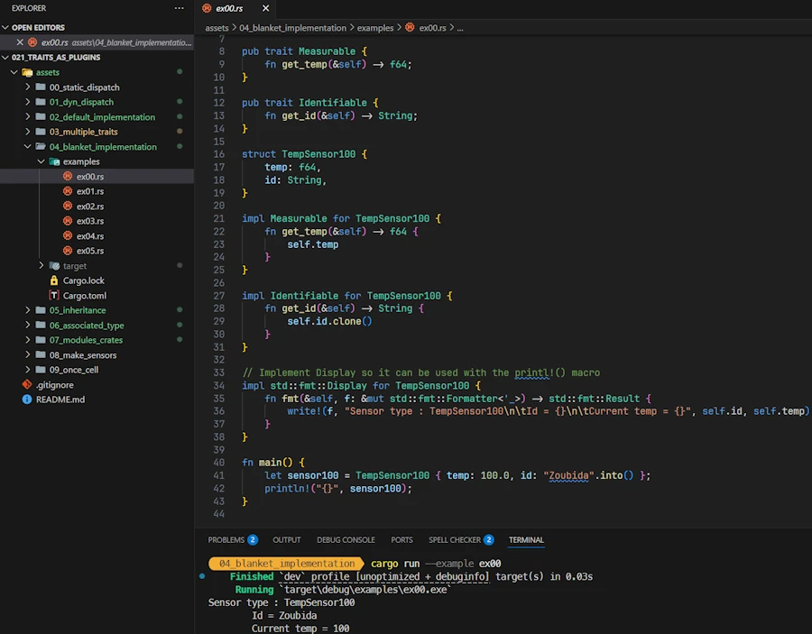
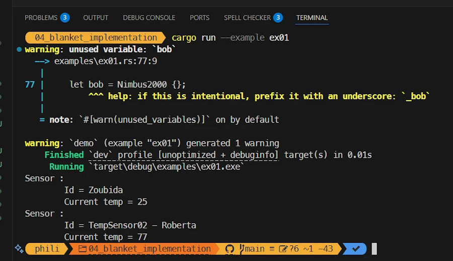

# Rust Traits: Defining Character
{: .no_toc }

From basic syntax to building plugins with once_cell and organizing your Rust projects.
{: .lead }


<!-- <h2 align="center">
<span style="color:orange"><b>This post is under construction.</b></span>    
</h2>
Will be split in 2 or 3     -->

### This is Episode 01
{: .no_toc }


## TL;DR
{: .no_toc }

* For beginners
* The code is on [GitHub](https://github.com/40tude/traits_as_plugins)

<div align="center">
<br/>
<!-- <span>In space, no one can hear you scream.</span> -->
</div>


#### Posts 
{: .no_toc }

* [Episode 00]()
* [Episode 01]()
* [Episode 02]()
* [Episode 03]()

## Table of Contents
{: .no_toc .text-delta}
- TOC
{:toc}


<!-- ###################################################################### -->
<!-- ###################################################################### -->
<!-- ###################################################################### -->
<!-- ###################################################################### -->
<!-- ###################################################################### -->


## Multiple Traits
Where using the generic syntax allow to add more than one trait bounds to the parameters of a function

### Running the demo code
{: .no_toc }

* Right click on `assets/03_multiple_traits`
* Select the option "Open in Integrated Terminal"
* `cargo run`


<div align="center">
<br/>
<!-- <span>Running code in Rust Playground</span> -->
</div>


### Explanations 1/2 
{: .no_toc }

You have played with the last sample code in Rust Playground. Don't you? It is simple, easy to understand and everything looks like we are running a kind of inventory. However, the point was to demonstrate the default implementation and so, in the `main()` function we have a line similar to : `println!("{}°C, label: {}", sensor100.get_temp(), sensor100.get_label());`

Now let's say we want to write a kind of `inventory()` function. One of the constraints *we want to have* is to make sure that the parameters of the function implement the methods we need. Here we needed to be able to invoke `.get_temp()` and `.get_label()`. 

This is where multiple traits and bounds come into the game since they do exactly that. In the function signature, using the generic syntax, we can specify which trait must be available (no matter if it is via a default implementation or not)

Let's read some code.


### Show me the code!
{: .no_toc }

```rust
// ----------------------------
pub trait Measurable {
    fn get_temp(&self) -> f64 {
        -273.15
    }
}

pub trait Identifiable {
    fn get_id(&self) -> String {
        "NA".into()
    }
}

// ----------------------------
struct TempSensor01 {
    temp: f64,
}
impl Identifiable for TempSensor01 {}
impl Measurable for TempSensor01 {
    fn get_temp(&self) -> f64 {
        self.temp
    }
}

// ----------------------------
struct TempSensor02 {
    label: String,
    temp: f64,
}
impl Measurable for TempSensor02 {}
impl Identifiable for TempSensor02 {
    fn get_id(&self) -> String {
        self.label.clone()
    }
}

// ----------------------------
struct TempSensor03 {
    temp: f64,
}
impl Measurable for TempSensor03 {}

// Static dispatch, generic syntax
fn inventory<T: Measurable + Identifiable>(sensor: &T) {
    println!("Sensor : {} ({} °C)", sensor.get_id(), sensor.get_temp());
}

fn main() {
    let sensor1 = TempSensor01 { temp: 100.0 };

    let sensor2 = TempSensor02 {
        label: "thermo-8086".into(),
        temp: 200.0,
    };

    inventory(&sensor1);
    inventory(&sensor2);

    // let sensor3 = TempSensor03 { temp: 300.0 };
    // inventory(&sensor3); // ! Does not compile : Identifiable is required by this bound in `inventory`
}
```


### Explanations 2/2 
{: .no_toc }

At the top of the code we define 2 traits : `Measurable` and `Identifiable`. They both have a unique method and they both propose a default implementation of their respective method : `get_temp()` that we know by heart and `get_id()` which returns the `id` of the temperature sensor.

```rust
pub trait Measurable {
    fn get_temp(&self) -> f64 {
        -273.15
    }
}

pub trait Identifiable {
    fn get_id(&self) -> String {
        "NA".into()
    }
}
```

Then we define our two friends `TempSensor01` and `TempSensor02`. Their respective implementation is not yet complete and they use the default implementations of the trait when needed. For example here is what is written for `TempSensor01`:

```rust
struct TempSensor01 {
    temp: f64,
}
impl Measurable for TempSensor01 {
    fn get_temp(&self) -> f64 {
        self.temp
    }
}
impl Identifiable for TempSensor01 {}
```

There is a last data type, named `TempSensor03`. It has the `Measurable` trait (and it leverages the default implementation) but it does not have the `Identifiable` trait.

```rust
struct TempSensor03 {
    temp: f64,
}
impl Measurable for TempSensor03 {}
```

In the `main()` function we create two sensors and we pass them as argument to the `inventory()` function.

Sorry, nothing exciting here. What did you expect? In fact, the most interesting part of the code is the definition of the `inventory()` function.

```rust
fn inventory<T: Measurable + Identifiable>(sensor: &T) {
    println!("Sensor : {} ({} °C)", sensor.get_id(), sensor.get_temp());
}
```

In plain French it says: My name is `inventory`. I use the generic syntax <T: Measurable + Identifiable> to declare that I work with any type `T` that implements both the `Measurable` and `Identifiable` traits.

When someone calls me, they must pass me a `sensor`, which is a reference to such data type. Because of the trait bounds, I know that this parameter will always provide the methods `get_id()` and `get_temp()`, so I can safely print its identifier and temperature.

**Note:** Between you and me I would prefer to write `fn inventory<T: Measurable x Identifiable>(sensor: &T) {...}` because, for me, `x` is associated with `AND` while `+` is associated with `OR`.      

**Note:** The syntax may become hard to read if we have many trait bounds. This is where the `where` clause can help. In our case it does not make a big difference however :

```rust
fn inventory<T>(sensor: &T)
where
    T: Measurable + Identifiable,
{
    println!("Sensor : {} ({} °C)", sensor.get_id(), sensor.get_temp());
}
```
But it helps with the code below :

```rust
fn combine<A, B, C>(a: &A, b: &B) -> C
where
    A: Measurable + Identifiable,
    B: Identifiable,
    C: From<(String, f64)>,
{
    C::from((a.get_id(), b.get_id().len() as f64))
}
```


### Exercise
{: .no_toc }

1. Uncomment the lines at the end of `main()`
1. Build and make sure the code does not compile
1. Make the code working with `sensor3`


### Summary
{: .no_toc }

* Using the generic syntax
* We can express the fact that a function requires 
    * A type implementing more than one trait  
    * Multiple types implementing various traits 
* The `where` helps to keep function definition clean and lean


<!-- ###################################################################### -->
<!-- ###################################################################### -->
<!-- ###################################################################### -->
<!-- ###################################################################### -->
<!-- ###################################################################### -->


## Blanket Implementation
Where the compiler write for us the code to implement certain traits.

**Warning:** This section is lengthy because I experiment and play with many different ideas. 


<!-- ###################################################################### -->
<!-- ###################################################################### -->
### Implementation for Display

Where we learn to implement an external trait on one of our own data types.

#### Running the demo code
{: .no_toc }

**Pay attention...** The source code is in the `examples/` subdirectory.

* Click on `assets/04_blanket_implementation/examples` to see the list of source code.
* Right click on `assets/04_blanket_implementation`
* Select the option "Open in Integrated Terminal"
* `cargo run --example ex00`

<div align="center">
<br/>
<!-- <span>Running code in Rust Playground</span> -->
</div>


#### Explanations 1/2
{: .no_toc }

With the previous sample code, the way we used the `inventory()` function call in the `main()` was OK but not great. What I would like to write is something like : `println!("{}", sensor1);`

This is possible if we implement the `Display` trait for `TempSensor01`. Let's see how this can be done.


#### Show me the code!
{: .no_toc }

```rust
pub trait Measurable {
    fn get_temp(&self) -> f64;
}

pub trait Identifiable {
    fn get_id(&self) -> String;
}

struct TempSensor01 {
    temp: f64,
    id: String,
}

impl Measurable for TempSensor01 {
    fn get_temp(&self) -> f64 {
        self.temp
    }
}

impl Identifiable for TempSensor01 {
    fn get_id(&self) -> String {
        self.id.clone()
    }
}

impl std::fmt::Display for TempSensor01 {
    fn fmt(&self, f: &mut std::fmt::Formatter<'_>) -> std::fmt::Result {
        write!(f, "Sensor type : TempSensor01\n\tId = {}\n\tCurrent temp = {}", self.id, self.temp)
    }
}

fn main() {
    let sensor1 = TempSensor01 { temp: 100.0, id: "Zoubida".into() };
    println!("{}", sensor1);
}
```


#### Explanations 2/2 
{: .no_toc }

What I like is that in the `main()` function I can write:

```rust
let sensor1 = TempSensor01 { temp: 100.0, id: "Zoubida".into() };
println!("{}", sensor1);
```

This is cool because we print `sensor1` the same way we print an integer or a double. To get this result we *only have to* implement the trait `std::fmt::Display`. I say `std::fmt::Display` and not `Display` because, I want to underline that the `std::fmt::Display` trait is external. It belongs to `std::fmt`, we do not own it. Keep this in mind because we will come back to the ownership issue later.

***OK... But how do you write the implementation of a trait that you do not own (here, `std::fmt::Display`) for trait that you own `TempSensor01`?*** 

First. This might be obvious but, nowhere in the code above, we define the trait `Display`. We don't own it so we don't write something like :

```rust
pub trait Display {
   ...
}
```

However we can write the implementation `std::fmt::Display` for `TempSensor01`. We write : 

```rust
impl std::fmt::Display for TempSensor01 {
    fn fmt(&self, f: &mut std::fmt::Formatter<'_>) -> std::fmt::Result {
        write!(f, "Sensor type : TempSensor01\n\tId = {}\n\tCurrent temp = {}", self.id, self.temp)
    }
}
```

Compared to what we already know when we deal with our own traits, fundamentally there is nothing new. The trait `std::fmt::Display` have in its interface one function named `fmt` which have a specific signature. 

Don't trust me. Double check in your [bedside book](https://doc.rust-lang.org/std/fmt/trait.Display.html) and make sure you can find it again if I don't give you the link (start from [https://doc.rust-lang.org/stable/std/](https://doc.rust-lang.org/stable/std/), Crates `std` on the left hand side, `fmt` module at the bottom of the page, `Display` trait at the bottom of the page...). I know what you think. But we need to invest time in learning how to navigate **and read** the documentation. It worth it.

<div align="center">
<iframe width="560" height="315" src="https://www.youtube.com/embed/ODk38qJ1A3U?si=tQ9bd1UiqDBiWW-c" title="YouTube video player" frameborder="0" allow="accelerometer; autoplay; clipboard-write; encrypted-media; gyroscope; picture-in-picture; web-share" referrerpolicy="strict-origin-when-cross-origin" allowfullscreen></iframe>
</div>

From the documentation we copy the signature of `fmt` and we paste it in our code. Then we write the definition of the `fmt` method for the data type `TempSensor01`. In the signature the `<'_>` is a lifetime specifier which is not used here. Note that we use `self.id` and `self.temp` directly. Life is easy.   


#### Exercise
{: .no_toc }

1. Starting from `https://doc.rust-lang.org/stable/std/`, find your way to `std::fmt::Display` in the documentation. 
1. Read the page
1. In `std::fmt::Display`, use the formatter so that the temperature is displayed with only one digit (27.9, not 27.94) and the label in uppercase.
1. Search on YouTube "Rust traits you should know"


#### Summary
{: .no_toc }

* `Display` is a trait already available in the std library
* Copy and paste the signature
* Write our custom version for a data type that we own
* Now we can `println!` our data
* This apply to many other traits available in the std lib : `From`, `Into`...  


***But the compiler did'nt write anything for us! Did it?*** No it did'nt. You are right, this first sample code shows how we can implement `std::fmt::Display`, an external trait, on a local data type that we own.  

But, now, let's see if a blanket implementation can answer our question.


<!-- ###################################################################### -->
<!-- ###################################################################### -->
### Blanket Implementation for Real 

Where the compiler writes the code of the trait implementation for us.

#### Running the demo code
{: .no_toc }

* Right click on `assets/04_blanket_implementation`
* Select the option "Open in Integrated Terminal"
* `cargo run --example ex01`

<div align="center">
<br/>
<!-- <span>Running code in Rust Playground</span> -->
</div>


#### Explanations 1/2
{: .no_toc }

In the previous sample code we had to write the method. See below : 

```rust
impl std::fmt::Display for TempSensor01 {
    fn fmt(&self, f: &mut std::fmt::Formatter<'_>) -> std::fmt::Result {
        write!(f, "Sensor type : TempSensor01\n\tId = {}\n\tCurrent temp = {}", self.id, self.temp)
    }
}
```

This means that if we continue that way we will have to implement the method `std::fmt::Display` for `TempSensor02`, `TempSensor03`... `TempSensorNN`. This is a waste of time and error prone. This is where Rust **blanket implementation** can help because it can write implementation code for us.   


#### Show me the code!
{: .no_toc }

```rust
use std::fmt::{Display, Formatter, Result as FmtResult};

pub trait Measurable {
    fn get_temp(&self) -> f64;
}

pub trait Identifiable {
    fn get_id(&self) -> String;
}

struct TempSensor01 {
    temp: f64,
    id: String,
}

impl Measurable for TempSensor01 {
    fn get_temp(&self) -> f64 {
        self.temp
    }
}

impl Identifiable for TempSensor01 {
    fn get_id(&self) -> String {
        self.id.clone()
    }
}

struct TempSensor02 {
    temp: f64,
    id: String,
}

impl Measurable for TempSensor02 {
    fn get_temp(&self) -> f64 {
        self.temp * 9.0 / 5.0 + 32.0
    }
}

impl Identifiable for TempSensor02 {
    fn get_id(&self) -> String {
        "TempSensor02 - ".to_owned() + &self.id
    }
}

trait Printable {
    fn print(&self);
}

impl<T> Printable for T
where
    T: Identifiable + Measurable,
{
    fn print(&self) {
        println!("Sensor : \n\tId = {}\n\tCurrent temp = {}", self.get_id(), self.get_temp())
    }
}

fn main() {
    let sensor1 = TempSensor01 { temp: 25.0, id: "Zoubida".into() };
    let sensor2 = TempSensor02 { temp: 25.0, id: "Roberta".into() };

    sensor1.print();
    sensor2.print();

    struct Nimbus2000 {}
    let bob = Nimbus2000 {};
    // bob.print();
}
```


#### Explanations 2/2
{: .no_toc }

I guess I can save some time here because you know the context : 2 TempSensor data types, 2 traits blablabla.

In the `main()` function we write

```rust
fn main() {
    let sensor1 = TempSensor01 { temp: 25.0, id: "Zoubida".into() };
    let sensor2 = TempSensor02 { temp: 25.0, id: "Roberta".into() };

    sensor1.print();
    sensor2.print();
}
```

This is not yet perfect because ideally we would like to write :

```rust
fn main() {
    let sensors: Vec<Box<dyn TempSensor>> = vec![
        Box::new(TempSensor01 { temp: 25.0 }),
        Box::new(TempSensor02 { temp: 25.0 }), // 77 °F
    ];

    for sensor in sensors {
        println!("{}", sensor);
    }
}
```

Nonetheless we made significant progress because we no longer have to write each implementation of the `.print()` method.

***What? Did you stumble upon a secret incantation in some ancient grimoire, or did you just sacrifice a few chickens? Tell me your secret!***

First we define a `Printable` trait and its interface have one `print()` method.

```rust
trait Printable {
    fn print(&self);
}
```
Next we use the generic syntax to define the implementation of the trait `Printable` for any type having the `Identifiable` and `Measurable` traits. 

```rust
impl<T> Printable for T
where
    T: Identifiable + Measurable,
{
    fn print(&self) {
        println!("Sensor : \n\tId = {}\n\tCurrent temp = {}", self.get_id(), self.get_temp())
    }
}
```

**It took me some time to realize:** 
* The code above is a generalized implementation for any type implementing `Identifiable` and `Measurable`
* At compile time, Rust monomorphizes the "template" **for each concrete type** that satisfies the traits bounds (`Identifiable + Measurable`). To tell the truth, I can easily forget this point when reading code.
* Since `TempSensor01` implements `Identifiable` and `Measurable`, it gets the `Printable` implementation for "free", and `sensor1.print()` compiles and works like a charm.
* The same apply to `TempSensor02`.
* In the `main()` function, the code looks like a kind a polymorphism working on `sensor1` and `sensor1` but no, no, and no. Behind the scene each version of `.print()` have been monomorphized for each concrete type.
* The trait bounds checks are done at compile time → no runtime cost, no surprises since everything is checked at compile time.


***In the source code it is written that bob.print() does not compile. Can you explain?*** No. Take it as an exercise. Read again the source code and tell me what you think. Here is a copy of the code fragment :

```rust
    struct Nimbus2000 {}
    let bob = Nimbus2000 {};
    // bob.print();
```

*Ok... On the last line of the bullet list, it is said that the trait bounds checks are done at compile time. Now in the code fragment I understand that `Nimbus200` is a datatype (I thought it was a magic broom). It is empty but, before all, this data type does not implement `Measurable` nor `Identifiable`. When the compiler sees the `bob.print()` call it asks the monomorphization system to generate (expand) the `Printable` trait so that `.print()` can be called. However, this is not possible because `Printable` is monomorphizable if and only if `T` implements the traits `Identifiable` and `Measurable`. This is not the case with `Nimbus2000` data type and the compiler reports errors and suggest options. Did I get it right?*

You're a grand master!

<div align="center">
<iframe width="560" height="315" src="https://www.youtube.com/embed/PobrSpMwKk4?si=tAiOW_xG7Xii33PE" title="YouTube video player" frameborder="0" allow="accelerometer; autoplay; clipboard-write; encrypted-media; gyroscope; picture-in-picture; web-share" referrerpolicy="strict-origin-when-cross-origin" allowfullscreen></iframe>
</div>


#### Exercise
{: .no_toc }

1. Make the code work with `Nimbus200`


#### Summary
{: .no_toc }

<!-- Before to move on, keep in mind : -->
* Blanket implementation (generalized implementation) use the generic syntax
* It generates (monomorphizes) for us code for certain traits
* Trait bounds checking occurs at compile time, not runtime 


***OK... But I in the `main()` function I would like to read `println!("{}", blablabla);` rather than `sensor1.print();`. What can we do ?***


<!-- ###################################################################### -->
<!-- ###################################################################### -->
### Blanket Implementation II 

Where the compiler writes, once again, the code of the trait implementation for us.


#### Running the demo code
{: .no_toc }

* Right click on `assets/04_blanket_implementation`
* Select the option "Open in Integrated Terminal"
* `cargo run --example ex02`

<div align="center">
<br/>
<!-- <span>Running code in Rust Playground</span> -->
</div>


<!-- ### Explanations 1/2
{: .no_toc } -->


#### Show me the code!
{: .no_toc }

```rust
pub trait Measurable {
    fn get_temp(&self) -> f64;
}

pub trait Identifiable {
    fn get_id(&self) -> String;
}

struct TempSensor01 {
    temp: f64,
    id: String,
}

impl Measurable for TempSensor01 {
    fn get_temp(&self) -> f64 {
        self.temp
    }
}

impl Identifiable for TempSensor01 {
    fn get_id(&self) -> String {
        self.id.clone()
    }
}

struct TempSensor02 {
    temp: f64,
    id: String,
}

impl Measurable for TempSensor02 {
    fn get_temp(&self) -> f64 {
        self.temp
    }
}

impl Identifiable for TempSensor02 {
    fn get_id(&self) -> String {
        "TempSensor02 - ".to_owned() + &self.id
    }
}

trait PrettyFmt {
    fn pretty(&self) -> String;
}

impl<T> PrettyFmt for T
where
    T: Identifiable + Measurable,
{
    fn pretty(&self) -> String {
        format!("Sensor : \n\tId = {}\n\tCurrent temp = {}", self.get_id(), self.get_temp())
    }
}

fn main() {
    let sensor1 = TempSensor01 { temp: 100.0, id: "Zoubida".into() };
    let sensor2 = TempSensor02 { temp: 200.0, id: "Roberta".into() };

    println!("{}", sensor1.pretty());
    println!("{}", sensor2.pretty());
}
```

#### Explanations 
{: .no_toc }

This is not yet perfect. Indeed, in the previous version, in the `main()` function we had:

```rust
fn main() {
    let sensor1 = TempSensor01 { temp: 25.0, id: "Zoubida".into() };
    let sensor2 = TempSensor02 { temp: 25.0, id: "Roberta".into() };

    sensor1.print();
    sensor2.print();
}
```

Now we have: 

```rust
fn main() {
    let sensor1 = TempSensor01 { temp: 100.0, id: "Zoubida".into() };
    let sensor2 = TempSensor02 { temp: 200.0, id: "Roberta".into() };

    println!("{}", sensor1.pretty());
    println!("{}", sensor2.pretty());
}
```

It is really a matter of taste. Let's not spend to much time on it because you already have all the information to understand the code. Read it, read it again.


#### Exercise
{: .no_toc }

1. Talk to yourself out loud and explain the difference between both versions of the code. Why in one case we use `sensor1.print();` while in the other we write `println!("{}", sensor1.pretty());`
1. Which one do *you* prefer and provide 3 reasons
1. Check your arguments with ChatGPT or another LLM  


#### Summary
{: .no_toc }

* Rather than using `println!` we use `format!` and return a `String` in the implementation of the trait
* It is really a matter of taste


***So you are saying there is no solution?*** Did I say that? No, but before to go further let's study a source code that **does not compile**. This will help us to underline an important point about the blanket implementation.


<!-- ###################################################################### -->
<!-- ###################################################################### -->
### Orphan/coherence rules 

Where the compiler warns us before we shoot ourselves in the foot.


#### Running the demo code
{: .no_toc }

* Right click on `assets/04_blanket_implementation`
* Select the option "Open in Integrated Terminal"
* `cargo run --example ex03`

Remember the Alamo 

<div align="center">
<br/>
<!-- <span>Running code in Rust Playground</span> -->
</div>

But remember, this code **does not compile**.

<div align="center">
<br/>
<!-- <span>Running code in Rust Playground</span> -->
</div>


#### Explanations 1/2
{: .no_toc }

Earlier we learnt how to implement the `Display` trait for `TempSensor01`. It worked like a charm. We just learnt about the generalized trait implementation. Let's mixt both and get the best of both worlds!


#### Show me the code!
{: .no_toc }

```rust
pub trait Measurable {
    fn get_temp(&self) -> f64;
}

pub trait Identifiable {
    fn get_id(&self) -> String;
}

struct TempSensor01 {
    temp: f64,
    id: String,
}

impl Measurable for TempSensor01 {
    fn get_temp(&self) -> f64 {
        self.temp
    }
}

impl Identifiable for TempSensor01 {
    fn get_id(&self) -> String {
        self.id.clone()
    }
}

impl<T> std::fmt::Display for T
where
    T: Measurable + Identifiable,
{
    fn fmt(&self, f: &mut std::fmt::Formatter<'_>) -> std::fmt::Result {
        write!(f, "id={}, temp={}", self.id, self.temp)
    }
}

fn main() {
    let sensor1 = TempSensor01 { temp: 100.0, id: "Zoubida".into() };
    println!("{}", sensor1);
}
```


#### Explanations 2/2
{: .no_toc }

We have 2 traits (`Measurable` and `Identifiable`). Then we define a `TempSensor01` data type which implements both traits.

In the `main()` function we write `println!("{}", sensor1);` hoping that it will work because we have been brave and smart.

Indeed we use the generic syntax to define the implementation of the trait `std::fmt::Display`. Since we are very smart we do not forget to add some trait bounds because we want to make sure that only the data types having the `Measurable` and `Identifiable` traits will be allowed to use it. 

So beautiful, so well written, so smart... Look below :

```rust
impl<T> std::fmt::Display for T
where
    T: Measurable + Identifiable,
{
    fn fmt(&self, f: &mut std::fmt::Formatter<'_>) -> std::fmt::Result {
        write!(f, "id={}, temp={}", self.id, self.temp)
    }
}
```


Nice try but **NO**. This does not work. To make a long story short 
* This does not compile because of Rust's **orphan/coherence rules**
* Indeed, ``Display`` is a foreign trait (defined in `std::fmt`).
* We are not allowed to implement a **foreign trait** for a **foreign type**.
* Indeed in the code above `impl<T> Display for T where T: ...`, the target type `T` is a generic 'any' type (not a local type that we own) → prohibited.

The idiomatic solution is the **newtype pattern** where we wrap our `T` in a local type (that we own), then we implement `std::fmt::Display` for that wrapper. Additionally we can offer a helper to make it easier to use.

In the next section we will see how the newtype pattern can be used in our case.


#### Exercise
{: .no_toc }

1. Compile the code once again
1. Read the compiler messages. Did you? Really? Line by line from the beginning to the end? Read it again... Just to make sure...
1. Does it make more sense?
1. Will you be able to interpret it the next time you read it?


#### Summary
{: .no_toc }

* Rust's coherence rules do not allow us to implement foreign trait for foreign type
* This is a good thing because multiple implementations could exist in a large app with multiple crates etc. and calling the expected implementation would be impossible.


<!-- ###################################################################### -->
<!-- ###################################################################### -->
### Newtype pattern I
<!-- {: .no_toc } -->

Where the compiler writes implementation code for an *intermediate* data type.

#### Running the demo code
{: .no_toc }

* Right click on `assets/04_blanket_implementation`
* Select the option "Open in Integrated Terminal"
* `cargo run --example ex04`

<div align="center">
<br/>
<!-- <span>Running code in Rust Playground</span> -->
</div>


#### Explanations 1/2 
{: .no_toc }

In the previous sample code we learnt that we cannot write `impl<T> std::fmt::Display for T...`. This is because we do not own the trait `std::fmt::Display` nor the generic type `T`. As often, the trick is to add a [level of indirection]() by defining an intermediate data type that we own and on which we can implement `std::fmt::Display`. Let's see how.


#### Show me the code!
{: .no_toc }

```rust
use std::fmt::{Display, Formatter, Result as FmtResult};

pub trait Measurable {
    fn get_temp(&self) -> f64;
}

pub trait Identifiable {
    fn get_id(&self) -> String;
}

struct TempSensor01 {
    temp: f64,
    id: String,
}

impl Measurable for TempSensor01 {
    fn get_temp(&self) -> f64 {
        self.temp
    }
}

impl Identifiable for TempSensor01 {
    fn get_id(&self) -> String {
        self.id.clone()
    }
}

struct AsDisplay<'a, T: Measurable + Identifiable>(&'a T);

impl<T> Display for AsDisplay<'_, T>
where
    T: Measurable + Identifiable,
{
    fn fmt(&self, f: &mut Formatter<'_>) -> FmtResult {
        write!(f, "id={}, temp={}", self.0.get_id(), self.0.get_temp())
    }
}

fn main() {
    let sensor1 = TempSensor01 { temp: 100.0, id: "Zoubida".into() };
    println!("{}", AsDisplay(&sensor1));
}
```


#### Explanations 2/2 
{: .no_toc }

You know the song... Two traits (`Measurable` and `Identifiable`). Then we define a `TempSensor01` data type which implements both traits.

We also define an intermediate data type named `AsDisplay`. The line below does'nt compile but this is good enough for now because I want to underline that this defines a **tuple struct** with a single field.

```rust
struct AsDisplay<T: Measurable + Identifiable>(&T)
```

**Note:** Just to make sure, don't take it personally if you already know all this:
* A tuple struct looks like : `struct Point(i32, i32);`
* It has unnamed fields, accessed by index (`p.0`, `p.1`)
* It’s syntactically close to a tuple but defines a new distinct type (this is the key of the trick)
* It can be used to define our new type adding a thin wrapper around an existing type : `struct Temperature(f64); // is a different type from plain f64`

In addition, the tuple struct, the wrapper, stores a reference (&T). Any struct that contains a reference **must** name the lifetime of that reference. [Lifetime elision](https://doc.rust-lang.org/reference/lifetime-elision.html) works in function signatures but **not** in struct definitions, so the compiler forces us to add one. Finally the working line of code is :

```rust
struct AsDisplay<'a, T: Measurable + Identifiable>(&'a T);
```

Now we have our intermediate data type and we can implement `Display` on it. It looks like this :

```rust
impl<T> Display for AsDisplay<'_, T>
where
    T: Measurable + Identifiable,
{
    fn fmt(&self, f: &mut Formatter<'_>) -> FmtResult {
        write!(f, "id={}, temp={}", self.0.get_id(), self.0.get_temp())
    }
}
```

The only point of attention is the weird syntax `self.0.get_id()`. However if we remember that `AsDisplay` is a `tuple struct` with a single, unnamed field then this way of writing should be clearer. `self.0` points to the first and unique field. `.get_id()` or `.get_temp()` call the method.

With this way of expressing things, in the `main()` function we can write :

```rust
println!("{}", AsDisplay(&sensor1));
```

Here is what happens : we temporarily wrap a borrow of `sensor1` into `AsDisplay`. `println!` detects that `AsDisplay` data type implements `Display`. It calls our custom `fmt`, which in turn delegates to the `Measurable` and `Identifiable` methods of the underlying sensor, and the resulting string is printed.

**Long version:**
1. **Borrowing the sensor**
   * `&sensor1` creates a shared reference to `sensor1`.
   * The type of that expression is `&TempSensor01`.

2. **Constructing the wrapper**
   * `AsDisplay(&sensor1)` calls the tuple struct constructor for `AsDisplay`.
   * This produces a temporary value of type `AsDisplay<'_, TempSensor01>`.
   * The lifetime `'_` is inferred to be “the lifetime of `&sensor1`,” i.e. the borrow is tied to the scope of the `println!` call.

3. **Macro expansion**
   * The `println!` macro expands roughly into a call to `std::fmt::Arguments::new_v1()` and eventually a call to `std::io::stdout().write_fmt(...)`.
   * Inside this machinery, Rust sees the `{}` placeholder and asks: *Does the type `AsDisplay<'_, TempSensor01>` implement `Display`?*

4. **Trait resolution**
   * The compiler finds our `impl<'a, T> Display for AsDisplay<'a, T>` where `T: Measurable + Identifiable`.
   * Since `TempSensor01` implements both `Measurable` and `Identifiable`, the blanket implementation applies.

5. **Calling `fmt`**
   * The formatting machinery calls `AsDisplay::fmt(&wrapper, f)`.
   * Inside our `fmt` implementation, `self.0` gives access to the inner `&TempSensor01`.
   * Then `get_id()` and `get_temp()` are called on the inner sensor to build the string.

6. **Printing to stdout**
   * The result of `write!(...)` inside `fmt` is passed back up through the formatting machinery.
   * `println!` finally writes the formatted string (`id=Zoubida, temp=100`) followed by a newline to standard output.


#### Exercise
{: .no_toc }

1. Why, in the newtype pattern, we use a tuple struct and not a simple tuple? 
1. When you write `let bob = (18, &sensor1);`. What is love? Oops, what is `bob`? Is it a value, a data type, something else ?

<div align="center">
<iframe width="560" height="315" src="https://www.youtube.com/embed/HEXWRTEbj1I?si=BNdfSwzvtKeduEur" title="YouTube video player" frameborder="0" allow="accelerometer; autoplay; clipboard-write; encrypted-media; gyroscope; picture-in-picture; web-share" referrerpolicy="strict-origin-when-cross-origin" allowfullscreen></iframe>
</div>


#### Summary
{: .no_toc }

* The newtype pattern involve an intermediate data type tha we own
* This type is a tuple struct with a single field
    * `struct AsDisplay<'a, T: Measurable + Identifiable>(&'a T);`
* We create a newtype by passing a reference to a varaible of the initial data type
    * `println!("{}", AsDisplay(&sensor1));`


**However, this is not yet perfect because we create a temporary variable in the `println!` macro. No?** Let's see if we can improve things. 


<!-- ###################################################################### -->
<!-- ###################################################################### -->
### Newtype pattern II

Where we use a convenient function call to hide the use of the ad hoc data type.  


#### Running the demo code
{: .no_toc }

* Right click on `assets/04_blanket_implementation`
* Select the option "Open in Integrated Terminal"
* `cargo run --example ex05`

<div align="center">
<br/>
<!-- <span>Running code in Rust Playground</span> -->
</div>


#### Explanations 1/2
{: .no_toc }

This section will be short and easy because we will apply the trick we used earlier in the `Blanket Implementation II `.


#### Show me the code!
{: .no_toc }

```rust
use std::fmt::{Display, Formatter, Result as FmtResult};

pub trait Measurable {
    fn get_temp(&self) -> f64;
}

pub trait Identifiable {
    fn get_id(&self) -> String;
}

struct TempSensor01 {
    temp: f64,
    id: String,
}

impl Measurable for TempSensor01 {
    fn get_temp(&self) -> f64 {
        self.temp
    }
}

impl Identifiable for TempSensor01 {
    fn get_id(&self) -> String {
        self.id.clone()
    }
}

struct TempSensor02 {
    temp: f64,
    id: String,
}

impl Measurable for TempSensor02 {
    fn get_temp(&self) -> f64 {
        self.temp
    }
}

impl Identifiable for TempSensor02 {
    fn get_id(&self) -> String {
        "TempSensor02 - ".to_owned() + &self.id
    }
}

struct AsDisplay<'a, T: Measurable + Identifiable>(&'a T);

impl<'a, T> Display for AsDisplay<'a, T>
where
    T: Measurable + Identifiable,
{
    fn fmt(&self, f: &mut Formatter<'_>) -> FmtResult {
        write!(f, "id={}, temp={}", self.0.get_id(), self.0.get_temp())
    }
}

fn as_display<T: Measurable + Identifiable>(t: &T) -> AsDisplay<'_, T> {
    AsDisplay(t)
}

fn main() {
    let sensor1 = TempSensor01 { temp: 100.0, id: "Zoubida".into() };
    let sensor2 = TempSensor02 { temp: 200.0, id: "Roberta".into() };

    println!("{}", as_display(&sensor1));
    println!("{}", as_display(&sensor2));
}
```


#### Explanations 
{: .no_toc }

Not much to say. The code is mostly the same. Two traits (`Identifiable` and `Measurable`), two data type (`TempSensor01` and `TempSensor02`). The same newtype pattern. 

We only add a convenient `as_display()` function to build the wrapper without naming the type (`AsDisplay`) at call site.

```rust
fn as_display<T: Measurable + Identifiable>(t: &T) -> AsDisplay<'_, T> {
    AsDisplay(t)
}
```

One thing to keep in mind. In the `main()` function, `as_display()` looks polymorphic but no, no, no. There are 2 monomorphized implementations created at compile time. One per data type.

```rust
fn main() {
    ...
    println!("{}", as_display(&sensor1));
    println!("{}", as_display(&sensor2));
}
```


#### Exercise
{: .no_toc }

1. Compare source code of the sections `Newtype pattern I` and `Newtype pattern II`
1. Which one do *you* prefer ?
1. Why ?
1. Double check the pros and cons with your preferred LLM 


#### Summary
{: .no_toc }

* This is a matter of taste and how you want express things in your code. 
* `println!("{}", AsDisplay(&sensor1));` VS `println!("{}", as_display(&sensor1));`


### Summary
{: .no_toc }


#### Posts 
{: .no_toc }

* [Episode 00]()
* [Episode 01]()
* [Episode 02]()
* [Episode 03]()


