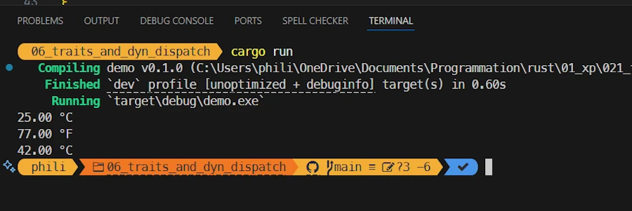

# Rust Traits: Defining Character
{: .no_toc }

From basic syntax to building plugins with once_cell and organizing your Rust projects.
{: .lead }


<h2 align="center">
<span style="color:orange"><b>This post is under construction.</b></span>    
</h2>


## This is Episode 02
{: .no_toc }

## TL;DR
{: .no_toc }

* For beginners
* The code is on [GitHub](https://github.com/40tude/traits_as_plugins)

<div align="center">
<br/>
<!-- <span>In space, no one can hear you scream.</span> -->
</div>


#### Posts 
{: .no_toc }

* [Episode 0]()
* [Episode 1]()
* [Episode 2]()
* [Episode 3]()


## Table of Contents
{: .no_toc .text-delta}
- TOC
{:toc}


<!-- ###################################################################### -->
<!-- ###################################################################### -->
<!-- ###################################################################### -->
<!-- ###################################################################### -->
<!-- ###################################################################### -->

## Trait Bounds Inheritance
Where we force a data type to implement a trait.

### Running the demo code
{: .no_toc }

* Right click on `assets/05_trait_bounds_inheritance`
* Select the option "Open in Integrated Terminal"
* `cargo run`

<div align="center">
<br/>
<!-- <span>Running code in Rust Playground</span> -->
</div>


### Explanations 1/2 
{: .no_toc }

In most of the sample code so far, we have implemented the trait `Display` because we want to print to the console. Would'nt be great if we could sign an agreement with the compiler saying something like : The data type that implements this trait must also implement this trait.   

This could be helpful because if one day we forget, then the compiler will gently remind us. Oh...Calm down! I said gently. Ok?. Ok.

<div align="center">
<br/>
<!-- <span>Running code in Rust Playground</span> -->
</div>

Let see how this works.


### Show me the code!
{: .no_toc }

```rust
use std::fmt::{Display, Formatter, Result as FmtResult};

trait TempSensor: Display {
    fn get_temp(&self) -> f64;
}

struct TempSensor01 {
    temp: f64,
}

impl TempSensor for TempSensor01 {
    fn get_temp(&self) -> f64 {
        self.temp
    }
}

impl Display for TempSensor01 {
    fn fmt(&self, f: &mut Formatter<'_>) -> FmtResult {
        write!(f, "{:.2} °C", self.temp)
    }
}

struct TempSensor02 {
    temp: f64,
}

impl TempSensor for TempSensor02 {
    fn get_temp(&self) -> f64 {
        self.temp * 9.0 / 5.0 + 32.0
    }
}

impl Display for TempSensor02 {
    fn fmt(&self, f: &mut Formatter<'_>) -> FmtResult {
        write!(f, "{:.2} °F", self.get_temp())
    }
}

fn main() {
    let sensors: Vec<Box<dyn TempSensor>> = vec![
        Box::new(TempSensor01 { temp: 25.0 }),
        Box::new(TempSensor02 { temp: 25.0 }), // 77 °F
        Box::new(TempSensor01 { temp: 42.0 }),
    ];

    for sensor in sensors {
        println!("{}", sensor);
    }
}
```


### Explanations 2/2 
{: .no_toc }

A long time ago, in a galaxy far, far away we wrote :

```rust
pub trait Measurable {
    fn get_temp(&self) -> f64;
}

struct TempSensor01 {
    temp: f64,
}
impl Measurable for TempSensor01 {
    fn get_temp(&self) -> f64 {
        self.temp
    }
}
```


Remember, it was in our very first sample code. Now the story begins like this :


```rust
trait TempSensor: Display {
    fn get_temp(&self) -> f64;
}

struct TempSensor01 {
    temp: f64,
}

impl TempSensor for TempSensor01 {
    fn get_temp(&self) -> f64 {
        self.temp
    }
}
```


It is almost the same thing... Except one char, the `:` in the `TempSensor` trait's signature. Do you see it in `trait TempSensor: Display {...}`. In plain english this says : any data type who wants to implement `TempSensor` must also implement `Display`.

This is why, once `TempSensor01` is defined, we first implement `TempSensor` for `TempSensor01` and then... We must implement implement `Display` for `TempSensor01`. See below :

```rust
impl Display for TempSensor01 {
    fn fmt(&self, f: &mut Formatter<'_>) -> FmtResult {
        write!(f, "{:.2} °C", self.temp)
    }
}
```

In the rest of the code the same apply for `TempSensor02`. And now... Tadaaa! 

<div align="center">
<br/>
<!-- <span>Running code in Rust Playground</span> -->
</div>

And look the beautiful body of... The `main()` function: 

```rust
fn main() {
    let sensors: Vec<Box<dyn TempSensor>> = vec![
        Box::new(TempSensor01 { temp: 25.0 }),
        Box::new(TempSensor02 { temp: 25.0 }), // 77 °F
        Box::new(TempSensor01 { temp: 42.0 }),
    ];

    for sensor in sensors {
        println!("{}", sensor);
    }
}
```

We define a vector of sensors. Then we go through all of the vector's values and we print them on the console using the sensor variable's name. 

Just to make sure... In the `main()` function, the code below works like a charm. Make a try in Rust Playground.

```rust
    let sensor1 = TempSensor01 { temp: 25.0 };
    let sensor2 = TempSensor02 { temp: 25.0 }; // 77°F
    println!("{}", sensor1);
    println!("{}", sensor2);
```

So... There is no function call, no method invoked. Just `println!`. Smoking!

<div align="center">
<br/>
<!-- <span>Running code in Rust Playground</span> -->
</div>


Yes... Almost. I say almost because... 
* Yes the `main()` function looks great. 
* Yes, it is impossible to forget to implement the `Display` trait
* But... But we still have to implement the Display trait ourselves. 


***You're right. Wouldn't it be great if we could delegate this task to the compiler?***

This is possible and you already know how : we need a mixt of trait bounds inheritance and blanket implementation so that the code of the Display implementation is generated by the compiler.  


### Exercise
{: .no_toc }

1. Create a new struct called `TempSensor03` that stores its temperature in Kelvin. 
1. Implement the TempSensor trait for it. Make sure that `get_temp()` returns the temperature in Kelvin.
1. Implement the Display trait for it, so that printing the sensor shows the temperature followed by "°K".
1.Add an instance of `TempSensor03` into the sensors vector in `main()` and check that the loop correctly prints all sensors, including your new one.


### Summary
{: .no_toc }


<!-- ###################################################################### -->
<!-- ###################################################################### -->
<!-- ###################################################################### -->
<!-- ###################################################################### -->
<!-- ###################################################################### -->


## Extension trait

Where the compiler generates the implementation code of the traits from which we inherit. 

### Running the demo code
{: .no_toc }

* Right click on `assets/06_extension_trait`
* Select the option "Open in Integrated Terminal"
* `cargo run`

<div align="center">
<br/>
<!-- <span>Running code in Rust Playground</span> -->
</div>


### Explanations 1/2 
{: .no_toc }

In the previous sample code, using inheritance, we make sure that if a data type implement `TempSensor` it also implement `Display`. However we had to copy paste the implementation of `Display` in our data type who wanted to implement `TempSensor` trait. Yes, I know, a data type doesn't want anything but you get the idea.

 


### Show me the code!
{: .no_toc }

```rust
// main.rs
// cargo run

trait TempSensor {
    fn get_temp(&self) -> f64;
    fn get_id(&self) -> String;
}

struct TempSensor01 {
    temp: f64,
    id: String,
}

impl TempSensor for TempSensor01 {
    fn get_temp(&self) -> f64 {
        self.temp
    }

    fn get_id(&self) -> String {
        "TempSensor01 - ".to_owned() + &self.id
    }
}

struct TempSensor02 {
    temp: f64,
    id: String,
}

impl TempSensor for TempSensor02 {
    fn get_temp(&self) -> f64 {
        self.temp * 9.0 / 5.0 + 32.0
    }

    fn get_id(&self) -> String {
        "TempSensor02 - ".to_owned() + &self.id
    }
}

trait SensorDisplay: TempSensor {
    fn pretty(&self) -> String {
        format!("{} {:.2} ", self.get_id(), self.get_temp(),)
    }
}

impl<T: TempSensor> SensorDisplay for T {}

fn main() {
    let sensor1 = TempSensor01 { temp: 25.0, id: "Zoubida".into() };
    let sensor2 = TempSensor02 { temp: 25.0, id: "Roberta".into() }; // 77°F

    println!("Sensor 1: {}", sensor1.pretty());
    println!("Sensor 2: {}", sensor2.pretty());
}
```


### Explanations 2/2 
{: .no_toc }

In the code above, we first create a trait `TempSensor` with 2 functions in the interface (`.get_temp()` and `.get_id()`). Then we create a data type `TempSensor01` and we implements `TempSensor` for it.

So any variable of type `TempSensor01` has the `.get_temp()` and `.get_id()` methods (and we do the same thing for the data type `TempSensor02`).

Now comes the interesting part.

```rust
trait SensorDisplay: TempSensor {
    fn pretty(&self) -> String {
        format!("{} {:.2} ", self.get_id(), self.get_temp(),)
    }
}
```

We know trait bound inheritance so we understand that, with the lines above, any type that implements `SensorDisplay` must also implement `TempSensor`.

We know about default trait implementation. So we understand that `.pretty()` has a default implementation that relies on the TempSensor methods (`.get_temp()` and `.get_id()`).

The code above is called **extension traits**. This is a way to add methods to an existing trait (`TempSensor` here) without impacting the original type definitions.

The next line is important

```rust
impl<T: TempSensor> SensorDisplay for T {}
```

This line implement `SensorDisplay` for every type `T` that implements `TempSensor`. It will expands all `TempSensors` with the defaulted `.pretty()` method of the SensorDisplay trait. This is possible because we own the trait (`SensorDisplay`). Remember : Rust’s coherence rules let us implement method for foreign or local types as long as the trait is local.

As consequence, any data type `T` that implements `TempSensor` automatically gets `.pretty()` for free via the extension trait.

This is cool because `TempSensor01` and `TempSensor02` implement `TempSensor` and so we don't have to copy/paste the code to print them. It is automatically generated by the compiler.

In the `main()` function we simply have :

```rust
    println!("Sensor 1: {}", sensor1.pretty());
    println!("Sensor 2: {}", sensor2.pretty());
```


### Exercise
{: .no_toc }

1. Can you give a definition of extension trait in one line?
1. Do you feel brave enough to add `TempSensor03` that works in Kelvin?


### Summary
{: .no_toc }


***Ok, ok, ok... Displaying thermocouple values was a good excuse to present different possibilities around traits... But how can I write the code below without duplicating Display code etc?***

```rust
fn main() {
    let sensors: Vec<Box<dyn TempSensor>> = vec![
        Box::new(TempSensor01 { temp: 25.0 }),
        Box::new(TempSensor02 { temp: 25.0 }), // 77°F
        Box::new(TempSensor01 { temp: 42.0 }),
    ];

    for sensor in sensors {
        println!("{}", sensor);
    }
}
```

Know the answer, you do, young Padawan.


<!-- ###################################################################### -->
<!-- ###################################################################### -->
<!-- ###################################################################### -->
<!-- ###################################################################### -->
<!-- ###################################################################### -->


## Traits and dynamic dispatch

One sentence

### Running the demo code
{: .no_toc }

* Right click on `assets/06_traits_and_dyn_dispatch`
* Select the option "Open in Integrated Terminal"
* `cargo run`

<div align="center">
<br/>
<!-- <span>Running code in Rust Playground</span> -->
</div>


### Explanations 1/2 
{: .no_toc }


### Show me the code!
{: .no_toc }

```rust
use std::fmt::{Display, Formatter, Result as FmtResult};

trait TempSensor {
    fn get_temp(&self) -> f64;
    fn unit(&self) -> &'static str;
}

struct TempSensor01 {
    temp: f64,
}

impl TempSensor for TempSensor01 {
    fn get_temp(&self) -> f64 {
        self.temp
    }

    fn unit(&self) -> &'static str {
        "°C"
    }
}

struct TempSensor02 {
    temp: f64,
}

impl TempSensor for TempSensor02 {
    fn get_temp(&self) -> f64 {
        self.temp * 9.0 / 5.0 + 32.0
    }

    fn unit(&self) -> &'static str {
        "°F"
    }
}

impl Display for Box<dyn TempSensor> {
    fn fmt(&self, f: &mut Formatter<'_>) -> FmtResult {
        write!(f, "{:.2} {}", self.get_temp(), self.unit())
    }
}

fn main() {
    let sensors: Vec<Box<dyn TempSensor>> = vec![
        Box::new(TempSensor01 { temp: 25.0 }),
        Box::new(TempSensor02 { temp: 25.0 }), // 77°F
        Box::new(TempSensor01 { temp: 42.0 }),
    ];

    for sensor in sensors {
        println!("{}", sensor);
    }
}
```


### Explanations 2/2 
{: .no_toc }

As in the previous sample code we first create a trait `TempSensor` with 2 functions in the interface (`.get_temp()` and `.unit()`). Then we create a data type `TempSensor01` and we implements `TempSensor` for it.

So any variable of type `TempSensor01` has the `.get_temp()` and `.unit()` methods (and we do the same thing for the data type `TempSensor02`).

The key to the answer your question is in data types available in the `main()` function. What is the type of `sensor` in the `for` loop? Exact! This is a `Box<dyn TempSensor>` (it was easy to answer because above you can see that `sensors` is a `Vec<Box<dyn TempSensor>>`, a vector of `Box<dyn TempSensor>`).

So, if you want to write `println!("{}", sensor);` what do you need? I need `Display` for `sensor`... Right? In other words I need to implement the trait `Display` for the data type of `sensor`, I need to implement the trait `Display` for the `Box<dyn TempSensor>` data type.

Bingo! You got it. And this explain the code below

```rust
impl Display for Box<dyn TempSensor> {
    fn fmt(&self, f: &mut Formatter<'_>) -> FmtResult {
        write!(f, "{:.2} {}", self.get_temp(), self.unit())
    }
}
```


### Exercise
{: .no_toc }

1. Add `get_label()` method to the `TempSensor` trait
1. Implement it for `TempSensor01` and `TempSensor02`
1. Make sure the label is displayed while `sensor` walk through `sensors`


### Summary
{: .no_toc }


<!-- ###################################################################### -->
<!-- ###################################################################### -->
<!-- ###################################################################### -->
<!-- ###################################################################### -->
<!-- ###################################################################### -->


## Associated types

Where the type subsystem allow us to have type placeholder associated with a trait to simplify how code is written.

### Running the demo code
{: .no_toc }

* Right click on `assets/07_associated_type`
* Select the option "Open in Integrated Terminal"
* `cargo add rand`
* `cargo run --example ex00`
* `cargo run --example ex01`

<div align="center">
<br/>
<!-- <span>Comment about the picture above</span> -->
</div>


### Explanations 1/3
{: .no_toc }

I just got a call from Switzerland. In the next factory some of the sensors returns values as float (`f64`) while others returns value as integer (`i16`). We need to take it into account and one way of doing could based on a generic trait with type parameters. Let's how it works.


### Show me the code!
{: .no_toc }

The code below correspond to `ex00`.

```rust
trait TempSensor<T> {
    fn get_temp(&self) -> T;
}

struct TempSensor01 {}
impl TempSensor<f64> for TempSensor01 {
    fn get_temp(&self) -> f64 {
        let temp: f64 = rand::random_range(10.0..35.0);
        temp
    }
}

struct TempSensor02 {}
impl TempSensor<i16> for TempSensor02 {
    fn get_temp(&self) -> i16 {
        let temp: i16 = rand::random_range(500..950);
        temp
    }
}

fn log_temperature<T, S>(sensor: &S)
where
    S: TempSensor<T>,
    T: std::fmt::Display,
{
    let reading: T = sensor.get_temp();
    println!("Temperature reading: {}", reading);
}

fn main() {
    let sensor1 = TempSensor01 {};
    let sensor2 = TempSensor02 {};

    log_temperature(&sensor1);
    log_temperature(&sensor2);
}
```


### Explanations 2/3 
{: .no_toc }

First we define a generic trait over the return type. As usual now, it has a `get_temp()` method that returns a value of type... `T` (and not `f64` as before). 

```rust
trait TempSensor<T> {
    fn get_temp(&self) -> T;
}
```
This is cool because now we can implement various sensors returning different data type : `f64`, `i8`... The type is now a "parameter" of the trait.

Then we define `TempSensor01`. Unlike what we did in the previous examples, the struct is empty (no `temp` field). Indeed in this sample code we simulate temperature readings. 

```rust
struct TempSensor01 {}
```

And then we implement `TempSensor` for `TempSensor01`. But wait, we must pass the data type of the returned temperature reading as a parameter. To do so we write :

```rust
impl TempSensor<f64> for TempSensor01 {
    fn get_temp(&self) -> f64 {
        let temp: f64 = rand::random_range(10.0..35.0);
        temp
    }
}
```

Do you see the `<f64>` in `impl TempSensor<f64> for TempSensor01 {...` ? In the body of the function this is business as usual. We just need to make sure we return an `f64`.

We do the same thing for `TempSensor02` which return `°F` encoded as `i16`. Here the temperature in returned as tenth of degree and 752 means 75.2°F.

It is important to see the parameter type (the `<i16>`) in the line `impl TempSensor<i16> for TempSensor02 {...`. This what makes `TempSensor02` a sensore returning `i16` values.

The `main()` function looks like this :

```rust
fn main() {
    let sensor1 = TempSensor01 {};
    let sensor2 = TempSensor02 {};

    log_temperature(&sensor1);
    log_temperature(&sensor2);
}
```

We create 2 sensors : `sensor1` returns °C as `f64` while sensor2 return tenth of °F as `i16`. Then, using the same function, we log temperatures measurements we get from `sensor1` and `sensor2`. It looks great so far. Let see how `log_temperature()` is written :

```rust
fn log_temperature<T, S>(sensor: &S)
where
    S: TempSensor<T>,
    T: std::fmt::Display,
{
    let reading: T = sensor.get_temp();
    println!("Temperature reading: {}", reading);
}
```
It's not the Addams Family house, but it sure looks like it.

<div align="center">
<br/>
<!-- <span>Comment about the picture above</span> -->
</div>

The issue is that whenever we use `TempSensor` in a function or struct, we must specify the type parameter and add trait bounds for it. This is what happens above where the `log_temperature()` function need to be generic over both the sensor type and the return type.

The function signature becomes verbose – we had to introduce a placeholder type `T` and a trait bound `S: TemperatureSensor<T>` to use the sensor. If the trait had multiple type parameters, the complexity would grow even more. 

Worst... One could define multiple implementation of the same temperature sensor overs multiples returned type : `impl TempSensor<f64> for TempSensor01 {...` and `impl TempSensor<i32> for TempSensor01 {...`. This could be misleading, confusing... Read this [page](https://doc.rust-lang.org/book/ch20-02-advanced-traits.html#:~:text=The%20difference%20is%20that%20when,we%20want%20to%20use).

Yes it works but there is a better way. Let's see how associated types can make our life easier.


### Show me the code!
{: .no_toc }

The code below correspond to `ex01`.

```rust
trait TempSensor {
    type Output: std::fmt::Display; 
    fn get_temp(&self) -> Self::Output;
}

struct TemSensor01 {}
impl TempSensor for TempSensor01 {
    type Output = f64; // returns f64
    fn get_temp(&self) -> Self::Output {
        let temp: Self::Output = rand::random_range(10.0..35.0);
        temp
    }
}

struct TempSensor02 {}
impl TempSensor for TempSensor02 {
    type Output = i16; // returns i16

    fn get_temp(&self) -> Self::Output {
        let temp: Self::Output = rand::random_range(500..950);
        temp
    }
}

fn log_temperature<S: TempSensor>(sensor: &S) {
    let reading: S::Output = sensor.get_temp();
    println!("Temperature reading: {}", reading);
}

fn main() {
    let sensor1 = TemSensor01 {};
    let sensor2 = TempSensor02 {}; 

    log_temperature(&sensor1);
    log_temperature(&sensor2);
}
```


### Explanations 3/3 
{: .no_toc }

Most important point. The main function is the same. Nothing change here and this is a good thing.

```rust
fn main() {
    let sensor1 = TemSensor01 {};
    let sensor2 = TempSensor02 {}; 

    log_temperature(&sensor1);
    log_temperature(&sensor2);
}
```

Second point, the `log_temperature()` function becomes much simpler to write. This is again a very good thing because, me, you and all the team members will be able to leave at 5PM on Friday.

```rust
fn log_temperature<S: TempSensor>(sensor: &S) {
    let reading: S::Output = sensor.get_temp();
    println!("Temperature reading: {}", reading);
}
```

Let's read the function signature. It uses a generic syntax and it says : the parameter `sensor` is a reference on a data type `S`. `S` has been introduced before the list of parameters. `S` is a `TempSensor` (see the `<S: TempSensor>`)

***OK, I got it but how the function can log indifferently `f64` and `i16`?*** It does'nt. Don't forget monomorphization will happen at compile time. However you ask a very good question. How do we explain to the monomorphization system that, in this version of the function, the returned value is a float while in this version, it is an integer. One way or another, we need an additional parameter to specify the type of the output.

And this is where the parameter `Output` help us. For now, just replace `Output` by `f64` or `i16` and read the line below :  

```rust
let reading: S::Output = sensor.get_temp();
```

With this in mind the monomorphization will expand/generalize a version of the function that reads an `int16` and a `f64` in another.

***OK... But where the Output parameter comes from?***

Let's look the trait `TempSensor` at the beginning of the code. It looks like :

```rust
trait TempSensor {
    type Output; 
    fn get_temp(&self) -> Self::Output;
}
```

It says something which goes like this : My name is TempSensor, I'm a trait and the syntax of my definition is generic. In this definition, `Output` is an associated type (a `String`, an `i16`...). Any type that implements me must choose what `Output` is and implement `get_temp()` so it returns that `Output`.

However, the code in the example is slightly different :

```rust
trait TempSensor {
    type Output: std::fmt::Display; 
    fn get_temp(&self) -> Self::Output;
}
```
I just add a bound to the associated type so that I'm sure I can print the `Output`. In the same way I could indicate a default value (`type Output = f64;`) but I believe it is unstable. Make a try in Rust Playground.

Now we can read the `TempSensor` implementation for `TempSensor01` (°C as float): 


```rust
struct TemSensor01 {}
impl TempSensor for TempSensor01 {
    type Output = f64; 
    fn get_temp(&self) -> Self::Output {
        let temp: Self::Output = rand::random_range(10.0..35.0);
        temp
    }
}
```
I first indicate the data type of the returned value (see `type Output = f64;`). Then I write the rest of the function as usual and add `Self::Output` to please the compiler. 


### Exercise
{: .no_toc }

1. Add `TempSensor03` working with Kelvin and f32
1. Create `sensor3` in `main()` and log it.


### Summary
{: .no_toc }


<!-- ###################################################################### -->
<!-- ###################################################################### -->
<!-- ###################################################################### -->
<!-- ###################################################################### -->
<!-- ###################################################################### -->


## Associated Functions and Constants

Where we expand traits capabilities with inner constants and static functions defined at the trait level.

### Running the demo code
{: .no_toc }

* Right click on `assets/08_associated_functions_constants`
* Select the option "Open in Integrated Terminal"
* `cargo run --example ex00`
* `cargo run --example ex01`

<div align="center">
<br/>
<!-- <span>Comment about the picture above</span> -->
</div>


### Explanations 1/3 
{: .no_toc }

I got a meeting with the guys from the technical support team. Because of °F (how could it be otherwise) it is a nightmare. One plant was about to explode last week in China while another one, in North Carolina, simply shutdown for 2H. We need to fix this problem, once and for all... 

One idea could be to make sure the unit of the sensor (°C, °K and even °F) is part of the interface/trait. We don't really need a method like `.set_unit()`. Too dangerous because one could call it and change the unit... No, instead we need a constant, something that no one will be able to change.

And... And this is where **trait associated constants** come to the rescue. Let's see how.


### Show me the code!
{: .no_toc }

The code below correspond to `ex00`.


```rust

trait TempSensor {
    const UNIT: &'static str; // associated constant
    fn get_temp(&self) -> f64;
}

struct TempSensor01 {
    temp: f64,
}

impl TempSensor for TempSensor01 {
    const UNIT: &'static str = "°C";
    fn get_temp(&self) -> f64 {
        self.temp
    }
}

struct TempSensor02 {
    temp: f64,
}
impl TempSensor for TempSensor02 {
    const UNIT: &'static str = "°F";
    fn get_temp(&self) -> f64 {
        self.temp * 9.0 / 5.0 + 32.0
    }
}

fn main() {
    let s1 = TempSensor01 { temp: 25.0 };
    let s2 = TempSensor02 { temp: 25.0 }; // 77 °F

    println!("Temp 1: {} {}", s1.get_temp(), TempSensor01::UNIT);
    println!("Temp 2: {} {}", s2.get_temp(), TempSensor02::UNIT);
}
```


### Explanations 2/3 
{: .no_toc }

First, in the trait definition of `TempSensor` we add an associated constant named `UNIT` (all in upper case to please Rustfmt and Clippy). It is important to realize that `UNIT` is not a good old `String`. No, it is a reference pointing to a `'static str`. It points to a string view which will be available as soon as the executable is loaded in memory and as long as the executable in still in memory. IOW : it is a reference to an immutable slice of UTF-8 bytes baked into the binary.


```rust
trait TempSensor {
    const UNIT: &'static str; // associated constant
    fn get_temp(&self) -> f64;
}
```

Think about it this way. After the compilation, the compiler knows the "blocks of of UTF-8 encoded bytes". I don't want to say strings here, but you can think about chars if this help. They are used in the code to describe this `UNIT` of temperatures or this other one. These blocks of chars will be embedded in the final executable. If you open the executable file with a text editor you can find them with others like : "This program cannot be run in DOS mode".  

<div align="center">
<br/>
<span>Open ex00.exe with VScode and search for "°F"</span>
</div>

To be precise, those string literals are part of the read-only data section (`.rodata`) of the binary. When we run the application, it is loaded in memory and the different implementations of `UNIT` point to their respective memory cell, the first char of the block of chars. What I just say is a lie. Indeed, `&'static str` is a fat pointer that stores a pointer to the first byte of the literal, and the length of the slice. But you can keep the first image if this helps.

Once these "requirements" are defined in the interface (trait) we can look at the implementation. Here it's easy, we just fill in the holes.

```rust
impl TempSensor for TempSensor01 {
    const UNIT: &'static str = "°C";
    fn get_temp(&self) -> f64 {
        self.temp
    }
}
```
You know the `get_temp()` method by heart. New and more interesting is the `UNIT` initialization `const UNIT: &'static str = "°C";`. In plain Italian it says that UNIT of this implementation will reference the literal "°C". Easy.

Finally in the `main()` function I show how to use the UNIT of each sensor and make sure display the value and the units. 

```rust
println!("Temp 1: {} {}", s1.get_temp(), TempSensor01::UNIT);
```
Please not that we do not write `s1::UNIT` but `TempSensor01::UNIT`. The constant is associated to the trait not the instance of the trait. This is a very good thing. Indeed, we can be sure that all sensors of type Sensor01 have the same unit. 


What I say about the trait associated constants that are tied to the trait rather than to a specific instance is also true for the trait associated functions. Let's see how :


### Show me the code!
{: .no_toc }

The code below correspond to `ex01`.

```rust
trait TempSensor {
    const UNIT: &'static str;

    fn get_temp(&self) -> f64;

    // Associated function (no self)
    fn new_set_to_zero() -> Self
    where
        Self: Sized;
}

struct TempSensor01 {
    temp: f64,
}

impl TempSensor for TempSensor01 {
    const UNIT: &'static str = "°C";

    fn get_temp(&self) -> f64 {
        self.temp
    }

    fn new_set_to_zero() -> Self {
        TempSensor01 { temp: 0.0 }
    }
}

struct TempSensor02 {
    temp: f64,
}

impl TempSensor for TempSensor02 {
    const UNIT: &'static str = "°F";

    fn get_temp(&self) -> f64 {
        self.temp * 9.0 / 5.0 + 32.0
    }

    fn new_set_to_zero() -> Self {
        TempSensor02 { temp: 0.0 }
    }
}

fn main() {
    let s1 = TempSensor01::new_set_to_zero();
    let s2 = TempSensor02::new_set_to_zero();

    println!("Factory sensor 1: {} {}", s1.get_temp(), TempSensor01::UNIT);
    println!("Factory sensor 2: {} {}", s2.get_temp(), TempSensor02::UNIT);
}
```


### Explanations 3/3 
{: .no_toc }

In the code above, we can now create sensor instances and whose value is reset to 0. Here is how this is expressed in the `main()` function :

```rust
fn main() {
    let s1 = TempSensor01::new_set_to_zero();
    let s2 = TempSensor02::new_set_to_zero();
    ...
}
```
The point is that `new_set_to_zero()` does not apply to an instance (how could it be?) but to the trait (`TempSensor01` or `TempSensor02`). `new_set_to_zero()` returns an instance (see `s1` or `s2`). It is a factory function that does not have a `&self` parameter like `fn get_temp(&self) -> f64 {...}` that we know by heart now.

That being said, if we look at the `TempSensor` trait we can see that it now proposes a new method `new_set_to_zero()` :

```rust
fn new_set_to_zero() -> Self
where
    Self: Sized;
```


What make this function a **trait associated function** is the fact that des not get `&self` as parameter. Instead it returns `Self`. 

Again, the method `.new_set_to_zero()` is a factory. It returns a ready to use instance of "we don't know what yet", this is why it returns `Self` (with a capital `S`) the type that implements the trait. 

Ok... Now it is time to study the `where` clause. To make a long story short, `Sized` a built-in marker trait automatically implemented by all types whose size is known at compile time. So `Self: Sized` is a trait bound saying something like : "this method is only available when the implementing type has a known size at compile time."

Known at compile time? Yes, you are right, this also means that this method can only be called on concrete types that implement the trait, not on trait objects.

***Um... Would you mind giving me a very simple example? Just to make sure.***

```rust
trait Factory {
    fn new() -> Self
    where
        Self: Sized;
}

struct Foo;

impl Factory for Foo {
    fn new() -> Self {
        Foo
    }
}

fn main() {
    let x = Foo::new(); // works, Foo is Sized
    // let y: Box<dyn Factory> = Box::new(Foo);
    // y.new(); // Does not compile, because Self: Sized
                // no method named `new` found for struct `Box<dyn Factory>` in the current scope
}
```
Again, associated function apply to concrete type that apply the trait (`Foo::new()`) NOT on traits objects (`y.new()`).

Now, regarding the implementation of `TempSensor` for `TempSensor01` let's focus on `new_set_to_zero()` method definition (`UNIT` and `get_temp()` are known). It comes :

```rust
impl TempSensor for TempSensor01 {

    fn new_set_to_zero() -> Self {
        TempSensor01 { temp: 0.0 }
    }
}
```

Simpler than expected. Is'nt it? The method create and return a `TempSensor01`. Period.


### Exercise
{: .no_toc }

1. In `ex00.rs`. About trait associated constants. What if one developer writes `const UNIT: &'static str = "Fahrenheit";` and the other writes `const UNIT: &'static str = "°C";`. Modify the code so that the developers has no choice and must pick in a set of predefined unit strings. One possible solution is in `ex02.rs`. 


### Summary
{: .no_toc }

* Methods → depend on `&self` (behavior of the instance).
* Associated constants → fixed data that belongs to the type (like “this sensor speaks °C”).
* Associated functions → helper/static functions defined at the trait level (like factories, converters, validators).


#### Posts 
{: .no_toc }

* [Episode 0]()
* [Episode 1]()
* [Episode 2]()
* [Episode 3]()


---

<!-- ###################################################################### -->
<!-- ###################################################################### -->
<!-- ###################################################################### -->
<!-- ###################################################################### -->
<!-- ###################################################################### -->


<!-- ## Template

One sentence

### Running the demo code
{: .no_toc }

* Right click on `assets/?????`
* Select the option "Open in Integrated Terminal"
* `cargo run`

<div align="center">
<br/>
<span>Comment about the picture above</span>
</div>


### Explanations 1/2 
{: .no_toc }


### Show me the code!
{: .no_toc }

```rust

```


### Explanations 2/2 
{: .no_toc }


### Exercise
{: .no_toc }


### Summary
{: .no_toc } -->
