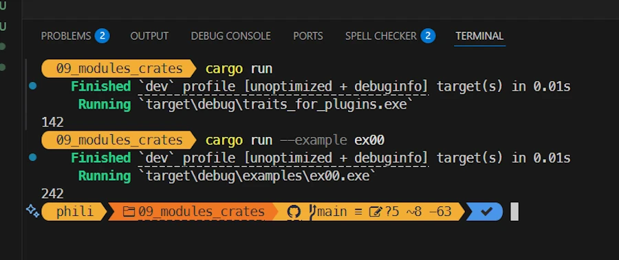

<!-- 
TODO :
* Avant le résumer, donner des exercices des trucs à faire
* Ajouter des question du lecteur. Entre autres pour passer d'une section à l'autre
* Ajouter des liens sur le vocabulaire : 
    * ~~paramètre~~, ~~argument~~, 
    * ~~level of indirection~~
    * ~~statement~~
    * expression
    * fat pointer + vtable
* ???
-->


# Rust Traits: Defining Character
{: .no_toc }

From basic syntax to building plugins with once_cell and organizing your Rust projects.
{: .lead }


<h2 align="center">
<span style="color:orange"><b>This post is under construction.</b></span>    
</h2>
Will be split in 2 or 3    


## TL;DR
{: .no_toc }

* For beginners
* The code is on [GitHub](https://github.com/40tude/traits_as_plugins)

<div align="center">
<br/>
<!-- <span>In space, no one can hear you scream.</span> -->
</div>


#### Posts 
{: .no_toc }

* [Episode 0]()
* [Episode 1]()
* [Episode 2]()
* [Episode 3]()

## Table of Contents
{: .no_toc .text-delta}
- TOC
{:toc}


<!-- ###################################################################### -->
<!-- ###################################################################### -->
<!-- ###################################################################### -->
<!-- ###################################################################### -->
<!-- ###################################################################### -->


## Modules and crates

Where we organize the project around crates and a new directory hierarchy

### Running the demo code
{: .no_toc }

* Right click on `assets/09_modules_crates`
* Select the option "Open in Integrated Terminal"
* `cargo run`
* `cargo run --example ex00`

<div align="center">
<br/>
<span>Comment about the picture above</span>
</div>


### Explanations 1/2 
{: .no_toc }

Hey guys. I just got out of the MMB (Monday Morning Briefing) with the sales and marketing teams... Yes, I know... But anyway, good news. It looks like there are opportunities if our monitoring system can work with other types of sensors : strain gauge, flow meter, ph meter... you name it. And if later it can work with actuators. I was asked to produce a POC (proof of concept) by the end of the week. I said no, no way. But I had to give them something. So we agreed to run a demo version of our application with 2 kinds of temperature sensors but dealing with each of them as if they were different kind of sensors. Before to discuss budget they want to be sure the application can scale.

In other words it is time to reorganize the project and the project's directory.  

**Note:** I will not spend to much time on the subject. Indeed I already have a dedicated short post that you can read [here]().

#### Good to know
{: .no_toc }

* The project had a `main.rs` it will have `main.rs` and `lib.rs`
    * `main.rs` is a consumer of `lib.rs`
* Because the project has both `lib.rs` and `main.rs`, `Cargo` treats the project as a **library crate** plus a **binary crate**.
* The compiler first builds the library, then the binary (using the library’s content).
* The build system doesn’t care about files and directories — it only cares about the module tree it builds in memory

#### Methodology
{: .no_toc }

1. Organize the directories however I like
1. Name the files however I like
1. Use **hub files** to connect everything into a clean module tree
    1. One directory → one hub file in its parent
    1. Hub file name = directory name + .rs
    1. Hub file content = `pub mod ...;` for every child module (files **AND** subdirectories)
    1. Leaf files don’t need hubs

### Show me the code!
{: .no_toc }


```
.
│   Cargo.lock
│   Cargo.toml
│   
├───examples
│       ex00.rs
│       
├───src
│   │   lib.rs
│   │   main.rs
│   │   sensors.rs
│   │
│   └───sensors
│       │   temp.rs
│       │
│       └───temp
│           │   temp_sensor.rs
│           │   temp_sensor1.rs
│           │   temp_sensor2.rs
│           │
│           ├───temp_sensor1
│           │       my_sensor1.rs
│           │
│           └───temp_sensor2
│                   your_sensor2.rs
│
└───target

```


### Explanations 2/2 
{: .no_toc }

#### 1. Files and directories organization
{: .no_toc }

You may not agree with me but here above is how I see the organization. 

* `main.rs` is a consumer of the "features/capabilities" exposed in `lib.rs`
* `ex00.rs` is another shorter consumer of `lib.rs`
* The `sensors` directory contains... The `sensors`. 
* Later an `actuators` directory will contains the different kind of actuators
* So far we only have temperature sensors so there is a wrongly name `temp` subdirectory. It is badly named because it can be confused with a `temporary` directory. Ideally it should be named `temperature`. It is important to detect and fix asap like this.
* For the POC 2 kind of temperature sensors are needed. There respective implementation file are stored in 2 specific directories (`temp_sensor1/` and `temp_sensor2/`).
* Each directory contains the files needed to define each capture.


#### 2. Naming the files
{: .no_toc }


Naming is an Art and we could debate all day long about the file names I use. This is not the point. My point is : name the files the way YOU want and learn about the build system so that it will work with your file hierarchy and naming convention.

In case of doubt, create a side project. Break everything, then come back to your main project.


***All of this seems like good advice, but you haven't provided much information about some of the new files I see in the tree above. Could we go through the list of files, read the code, and understand exactly how the “module tree” will be built?***


#### 3. Files and hub files
{: .no_toc }

Let's start at the top of the directory. Here the content of `Cargo.toml`

```toml
[package]
name = "traits_for_plugins"
version = "0.1.0"
edition = "2024"


[dependencies]
```

I just want to underline that the name is `traits_for_plugins`. Next, we already said that since the directory have a `lib.rs` and a `main.rs` at the root, the compiler will build the lib then the application. They will be respectively named `target/debug/libtraits_for_plugins.rlib`and `target/debug/traits_for_plugins.exe`.

To build the library, the build system reads the content of `lib.rs` (the crate root file). Here it is in all its glory :

```rust
// lib.rs
pub mod sensors;
```

One line and that's all. We declare a top level module named `sensors` and the build systems looks for the `sensors` module code in `src/sensors.rs`. Here it is :

```rust
// sensors.rs
// hub file for `./sensors/` folder
pub mod temp;
```

We declare a module `/sensors/temp` and the build system looks for the `/sensors/temp` module code in `src/sensors/temp.rs`. Here it is :

```rust
// temps.rs
pub mod temp_sensor; // The trait lives here
pub mod temp_sensor1; // Concrete sensor #1 (folder-backed)
pub mod temp_sensor2; // Concrete sensor #2 (folder-backed)
```

We declare 3 modules, respectively : `src/sensors/temp/temp_sensor`, `src/sensors/temp/temp_sensor1` and `src/sensors/temp/temp_sensor2`. The build system
* looks for the `/sensors/temp/temp_sensor` module code in `src/sensors/temp/temps_sensor.rs`
* looks for the `/sensors/temp/temp_sensor1` module code in `src/sensors/temp/temps_sensor2.rs`
* looks for the `/sensors/temp/temp_sensor2` module code in `src/sensors/temp/temps_sensor2.rs`

`temp_sensor.rs` contains the definition of the trait :

```rust
// temp_sensor.rs
pub trait TempSensor {
    fn get_temp(self) -> f64;
}
```
Contents of `temps_sensor1.rs` and `temp_sensor2.rs` are similar

```rust
// temp_sensor1.rs
// hub file for `./temp_sensor1/` folder
pub mod my_sensor1;
```

We declare a module `/sensors/temp/temp_sensor1/my_sensor1` and the build system looks for the `/sensors/temp/temps_sensor1/my_sensor1` module code in `src/sensors/temp/temp_sensor1/my_sensor1.rs`. Here it is :

```rust
// my_sensor1.rs
use crate::sensors::temp::temp_sensor::TempSensor;
pub struct TempSensor01;

impl TempSensor for TempSensor01 {
    fn get_temp(self) -> f64 {
        142.0
    }
}
```

It is important to understand the meaning of the 2 first lines of the source code above :
1. The first line is nothing more than a **shortcut**. 
    * Rather than writing `crate::sensors::temp::temp_sensor::TempSensor` we can write `TempSensor`
    * **IMPORTANT** : when the build system builds the lib, the `lib.rs` file is the crate root file. `my_sensor1` is part of the module tree and so when we need to create a shortcut to point to `TempSensor` we must use `crate::sensors...`. Keep this in mind when we will talk about `main.rs`. 
1. The second line make sure the data type `TempSensor01` is visible from outside the module where it is define. 
    * This allow us to decalre a varaible of type `TempSensor01` in the `main()` function for example. 

Here is the module tree 

```
crate (lib.rs)
└── sensors (sensors.rs)
    └── temp (temp.rs)
        ├── temp_sensor       (temp_sensor.rs, trait definition)
        ├── temp_sensor1      (temp_sensor1.rs → loads folder temp_sensor1/)
        │   └── my_sensor1    (my_sensor1.rs, implements TempSensor01)
        └── temp_sensor2      (temp_sensor2.rs → loads folder temp_sensor2/)
            └── your_sensor2  (your_sensor2.rs, implements TempSensor02)

```

Once the library crate is built then the build system builds the application and it starts by reading `main.rs`. See below :

```rust
use traits_for_plugins::sensors::temp::temp_sensor1::my_sensor1;
use traits_for_plugins::sensors::temp::temp_sensor::TempSensor;

fn main() {
    let my_sensor = my_sensor1::TempSensor01;
    let my_temp = my_sensor.get_temp();
    println!("{my_temp}");
}
```

Again it is important to understand the first 2 lines
1. Since in the body of `main()` we create a variable `my_sensor` of type `TempSensor1` we create a **shortcut** in the module tree so that we can write `my_sensor1::TempSensor01` rather than `traits_for_plugins::sensors::temp::temp_sensor1::my_sensor1::TempSensor01` 
    * **IMPORTANT** : when the build system build the binary crate (the application) the code in main.rs does not see the internal modules via `crate::...` directly. Indeed, `crate::` in `main.rs` refers to the binary crate itself, not to the library crate defined in `lib.rs`. So we have to build the path as if it were an external crate, using the crate name (the one defined in [package] name = “...” in Cargo.toml). Hence the `use traits_for_plugins::...`
1. The second line is required because items from traits can only be used if the trait is in scope. Don't trust me, comment the line and try to build the project.

Once this is understood the body of `main()` should be a piece of cake for you now.


### Exercise
{: .no_toc }

1. Make sur the code run as it is. Now rename and reorganize files and directories the way you want. Make sure it no longer build. Fix everything and make it run again. 
1. In `main.rs` comment the line `use traits_for_plugins::sensors::temp::temp_sensor::TempSensor;`, build the project and read the help messages from the build system.


### Summary
{: .no_toc }


#### Posts 
{: .no_toc }

* [Episode 0]()
* [Episode 1]()
* [Episode 2]()
* [Episode 3]()


---

<!-- ###################################################################### -->
<!-- ###################################################################### -->
<!-- ###################################################################### -->
<!-- ###################################################################### -->
<!-- ###################################################################### -->


<!-- ## Template

One sentence

### Running the demo code
{: .no_toc }

* Right click on `assets/?????`
* Select the option "Open in Integrated Terminal"
* `cargo run`

<div align="center">
<br/>
<span>Comment about the picture above</span>
</div>


### Explanations 1/2 
{: .no_toc }


### Show me the code!
{: .no_toc }

```rust

```


### Explanations 2/2 
{: .no_toc }


### Exercise
{: .no_toc }


### Summary
{: .no_toc } -->
