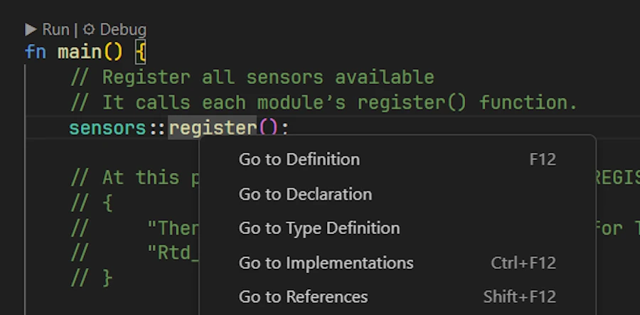

# Rust Traits: Defining Character
{: .no_toc }

From basic syntax to building plugins with once_cell and organizing your Rust projects.
{: .lead }


<h2 align="center">
<span style="color:orange"><b>This post is under construction.</b></span>    
</h2>

### This is Episode 03
{: .no_toc }

## TL;DR
{: .no_toc }

* For beginners
* The code is on [GitHub](https://github.com/40tude/traits_as_plugins)

<div align="center">
<br/>
<!-- <span>In space, no one can hear you scream.</span> -->
</div>


#### Posts 
{: .no_toc }

* [Episode 00]()
* [Episode 01]()
* [Episode 02]()
* [Episode 03]()

## Table of Contents
{: .no_toc .text-delta}
- TOC
{:toc}


<!-- ###################################################################### -->
<!-- ###################################################################### -->
<!-- ###################################################################### -->
<!-- ###################################################################### -->
<!-- ###################################################################### -->


## Modules and Crates

Where we organize the project around crates and a new directory hierarchy

### Running the demo code
{: .no_toc }

* Right click on `assets/09_modules_crates`
* Select the option "Open in Integrated Terminal"
* `cargo run`
* `cargo run --example ex00`

<div align="center">
<br/>
<span>Comment about the picture above</span>
</div>


### Explanations 1/2 
{: .no_toc }

Hey guys. I just got out of the MMB (Monday Morning Briefing) with the sales and marketing teams... Yes, I know... But, anyway, good news... It looks like there are opportunities if our monitoring system can work with other types of sensors (strain gauge, flow meter, ph meter...) as well as actuators. I was asked to produce a POC (proof of concept) by the end of the week. I said no, no way. But I had to give them something. So we agreed to run a demo version of the application with 2 kinds of temperature sensors but dealing with each of them as if they were different kind of sensors. Before to discuss budget they want to be sure the application can scale.

In other words it is time to reorganize the project and the project's directory.  

**Note:** I will not spend to much time on the subject. Indeed I already have a dedicated short post that you can read [here]().

#### Good to know
{: .no_toc }

* The project had a unique `main.rs` file. From now on it will have `main.rs` and `lib.rs`
    * `main.rs` is a consumer of API exposed by `lib.rs`
* Because the project has both `lib.rs` and `main.rs`, `Cargo` considers the project as a **library crate** plus a **binary crate**.
* The build system (rustc and friends) first builds the library crate, then the binary crate (using the library’s content).
* The build system doesn’t care about files and directories — it only cares about the module tree it builds in memory

#### Methodology
{: .no_toc }

1. Organize the directories however I like
1. Name the files however I like
1. Use **hub files** to connect everything into a clean module tree
    1. One directory → one hub file in its parent directory
    1. Hub file name = directory name + `.rs`
    1. Hub file content = `pub mod ...;` for every child module (files **AND** subdirectories)
    1. Leaf files don’t need hub files

### Show me the code!
{: .no_toc }


```
.
│   Cargo.lock
│   Cargo.toml
│   
├───examples
│       ex00.rs
│       
├───src
│   │   lib.rs
│   │   main.rs
│   │   sensors.rs
│   │
│   └───sensors
│       │   temp.rs
│       │
│       └───temp
│           │   temp_sensor.rs
│           │   temp_sensor1.rs
│           │   temp_sensor2.rs
│           │
│           ├───temp_sensor1
│           │       my_sensor1.rs
│           │
│           └───temp_sensor2
│                   your_sensor2.rs
│
└───target

```


### Explanations 2/2 
{: .no_toc }

#### 1. Files and directories organization
{: .no_toc }

You may not agree with me but here above is how I see the organization. 

* `main.rs` is a consumer of the "features/capabilities" exposed by `lib.rs`
* `ex00.rs` is another consumer of `lib.rs` (think about some tests for example)
* The `sensors` directory contains... The sensors. 
* Later an `actuators` directory will contains... Tadaa! You're right, the different kinds of actuators
* So far we only have temperature sensors so there is a wrongly named `temp` subdirectory. It is badly named because it can be confused with a `temporary` directory. Ideally it should be named `temperature`. It is important to detect and fix upfront this class of issues.
* For the POC 2 kinds of temperature sensors are needed. Their respective implementation files are stored in 2 specific directories (`temp_sensor1/` and `temp_sensor2/`).
* Each directory contains the files needed to define each sensor.


#### 2. Naming the files
{: .no_toc }


Naming things is an Art and we could debate all day long about the filenames I use (see [Wadler's law]()). This is not the point. My point is : name the files the way *you* want and learn about the build system so that it works with your file hierarchy and naming convention.

In case of doubt, create a side project. Break everything, then come back to your main project.


***All of this seems like good advice, but you haven't provided much information about some of the new files I see in the tree above. Could we go through the list of files, read the code, and understand how the “module tree” is built?***


#### 3. Files and hub files
{: .no_toc }

Let's start at the top of the directory. Find below the content of `Cargo.toml`

```toml
[package]
name = "traits_for_plugins"
version = "0.1.0"
edition = "2024"


[dependencies]
```

I just want to underline that the name is `traits_for_plugins`. Next, we already said that since the directory have a `lib.rs` and a `main.rs` in the root, the compiler will build the lib crate then the binary crate. They will be respectively named `target/debug/libtraits_for_plugins.rlib` (`.rlib` like Rust lib, a static library plus some metadata. Cannot be linked with C/C++) and `target/debug/traits_for_plugins.exe`.

To build the library crate, the build system reads the content of `lib.rs` (the crate root file). Here it is in all its glory :

```rust
// lib.rs
pub mod sensors;
```

One line and that's all. We declare a top level module named `sensors` and the build systems looks for the `sensors` module code in `src/sensors.rs`. Here it is :

```rust
// sensors.rs
// hub file for `./sensors/` folder
pub mod temp;
```

We declare a module `/sensors/temp` and the build system looks for the `/sensors/temp` module code in `src/sensors/temp.rs`. Here it is :

```rust
// temps.rs
pub mod temp_sensor; // The trait lives here
pub mod temp_sensor1; // Concrete sensor #1 (folder-backed)
pub mod temp_sensor2; // Concrete sensor #2 (folder-backed)
```

We declare 3 modules, respectively : `src/sensors/temp/temp_sensor`, `src/sensors/temp/temp_sensor1` and `src/sensors/temp/temp_sensor2`. The build system
* looks for the `/sensors/temp/temp_sensor` module code in `src/sensors/temp/temps_sensor.rs`
* looks for the `/sensors/temp/temp_sensor1` module code in `src/sensors/temp/temps_sensor2.rs`
* looks for the `/sensors/temp/temp_sensor2` module code in `src/sensors/temp/temps_sensor2.rs`

`temp_sensor.rs` contains the definition of the trait :

```rust
// temp_sensor.rs
pub trait TempSensor {
    fn get_temp(self) -> f64;
}
```
Contents of `temps_sensor1.rs` and `temp_sensor2.rs` are similar

```rust
// temp_sensor1.rs
// hub file for `./temp_sensor1/` folder
pub mod my_sensor1;
```

We declare a module `/sensors/temp/temp_sensor1/my_sensor1` and the build system looks for the `/sensors/temp/temps_sensor1/my_sensor1` module code in `src/sensors/temp/temp_sensor1/my_sensor1.rs`. Here it is :

```rust
// my_sensor1.rs
use crate::sensors::temp::temp_sensor::TempSensor;
pub struct TempSensor01;

impl TempSensor for TempSensor01 {
    fn get_temp(self) -> f64 {
        142.0
    }
}
```

It is important to understand the meaning of the 2 first lines in the source code above :
1. The first line is nothing more than a **shortcut**. 
    * Rather than writing `crate::sensors::temp::temp_sensor::TempSensor` we can write `TempSensor`
    * **IMPORTANT** : when the build system builds the library crate, the `lib.rs` file is the crate root file. `my_sensor1` is part of the module tree and so, when we need to create a shortcut to point to `TempSensor` we must use `crate::sensors...`. Keep this in mind when we will talk about `main.rs`. 
1. The second line make sure that the data type `TempSensor01` is visible from outside the module where it is defined. 
    * This allow us to declare a variable of type `TempSensor01` in the `main()` function for example. 

Here is the module tree 

```
crate (lib.rs)
└── sensors (sensors.rs)
    └── temp (temp.rs)
        ├── temp_sensor       (temp_sensor.rs, trait definition)
        ├── temp_sensor1      (temp_sensor1.rs → loads folder temp_sensor1/)
        │   └── my_sensor1    (my_sensor1.rs, implements TempSensor01)
        └── temp_sensor2      (temp_sensor2.rs → loads folder temp_sensor2/)
            └── your_sensor2  (your_sensor2.rs, implements TempSensor02)

```

Once the library crate is built then the build system builds the binary crate and it starts by reading `main.rs`. See below :

```rust
use traits_for_plugins::sensors::temp::temp_sensor1::my_sensor1;
use traits_for_plugins::sensors::temp::temp_sensor::TempSensor;

fn main() {
    let my_sensor = my_sensor1::TempSensor01;
    let my_temp = my_sensor.get_temp();
    println!("{my_temp}");
}
```

Again it is important to understand the first 2 lines
1. Since we create a variable `my_sensor` of type `TempSensor1` we create a **shortcut** in the module tree so that we can write `my_sensor1::TempSensor01` rather than `traits_for_plugins::sensors::temp::temp_sensor1::my_sensor1::TempSensor01` 
    * **IMPORTANT** : when the build system builds the binary crate (the application) the code in `main.rs` does not see the internal modules via `crate::...` directly. Indeed, `crate::` in `main.rs` refers to the binary crate itself, not to the library crate defined in `lib.rs`. So we have to build the path as if it were an external crate, using the crate name (the name defined in [package] name = “...” in `Cargo.toml`). Hence the `use traits_for_plugins::...`
1. The second line is required because items from traits can only be used if the trait is in scope. Don't trust me, comment the line and try to build the project.

Once this is understood the body of `main()` should be a piece of cake for you now. 

I could modify the first shortcut to be able to write `let my_sensor = TempSensor01;` but, six months from now, when the source code will be much larger, I'll be happy to read `let my_sensor = my_sensor1::TempSensor01;` and know that `TempSensor01` data type belong to `my_sensor1` module. 


### Exercise
{: .no_toc }

1. Make sur the code run as it is. 
1. Once this is checked, rename and reorganize files and directories the way you want. Make sure it no longer build. Fix everything and make it run again. 
1. In `main.rs` comment the line `use traits_for_plugins::sensors::temp::temp_sensor::TempSensor;`, build the project and read the help messages from the build system.


### Summary
{: .no_toc }


<!-- ###################################################################### -->
<!-- ###################################################################### -->
<!-- ###################################################################### -->
<!-- ###################################################################### -->
<!-- ###################################################################### -->


## Dynamic Sensor Creation

Where we dynamically create and use sensors in the new architecture.

### Running the demo code
{: .no_toc }

* Right click on `assets/10_make_sensors`
* Select the option "Open in Integrated Terminal"
* `cargo run`
* `cargo run --example ex00`


<div align="center">
<br/>
<span>Comment about the picture above</span>
</div>


### Explanations 1/2 
{: .no_toc }

Morning! The POC went pretty well. Even the marketing guys understood the demo and the explanations. They are all confident about the scalability of the app. I got two feedbacks however:
1. The first one is known and easy to fix : `temp[_whatever]` is a wrong name. I told them that this was known and that we had planned to use “temperature” instead in order to be very explicit.
1. They understood I was focusing on the organization of the sensors directories and files. They were not surprised when I explained how the `main()` function was working in this demo. However they want me to come back to the next meeting with a new version where the sensors are created dynamically. To tell the truth, I believe they are right.


### Show me the code!
{: .no_toc }

Now the hierarchy of directories and files looks like this :

```
.
│   .gitignore
│   Cargo.lock
│   Cargo.toml
│
├───examples
│       ex00.rs
│
├───src
│   │   lib.rs
│   │   main.rs
│   │   sensors.rs
│   │
│   └───sensors
│       │   temperature.rs
│       │
│       └───temperature
│           │   temperature_sensor.rs
│           │   temperature_sensor1.rs
│           │   temperature_sensor2.rs
│           │
│           ├───temperature_sensor1
│           │       my_sensor1.rs
│           │
│           └───temperature_sensor2
│                   your_sensor2.rs
│
└───target
```


### Explanations 2/2 
{: .no_toc }

#### Files and Directories
{: .no_toc }

I already changed `temp` to `temperature`. Obviously I updated the `use` statements. For example, in `main.rs`, now I have:

```rust
use traits_for_plugins::sensors::temperature::temperature_sensor::{self, TempSensor};
```

While we used to have : 

```rust
use traits_for_plugins::sensors::temp::temp_sensor::TempSensor;
use traits_for_plugins::sensors::temp::temp_sensor1::my_sensor1; 
```

Note that from now on, I combine the two lines in one using `::{self, TempSensor}`


#### Changes in source code
{: .no_toc }

If you agree (but don't take it bad, I'm the writer of this post so you have no choice, you have to agree...) I will focus on what makes the dynamic sensors creation possible. In fact, the file and directory hierarchy is very similar to that of the previous project and does not require any special comments. 

Take few minutes to read the `main()` function we wrote in [Episode 0]() in the section "Dynamic Dispatch". The code was similar to :

```rust
fn main() {
    let mut sensors: Vec<Box<dyn Measurable>> = Vec::new();
    sensors.push(make_sensor("celsius"));
    sensors.push(make_sensor("fahrenheit"));

    for s in &sensors {
        println!("Reading: {}", s.get_temp());
    }
}

fn make_sensor(kind: &str) -> Box<dyn Measurable> {
    match kind {
        "celsius" => Box::new(TempSensor01 { temp: 1.0 }),
        "fahrenheit" => Box::new(TempSensor02 {
            label: "thermocouple".into(),
            temp: 25.0, // 77 °F
        }),
        _ => Box::new(TempSensor01 { temp: 0.0 }),
    }
}
```

In this version of the project we do exactly the same thing and the `main()` function looks like: 

```rust
use traits_for_plugins::sensors::temperature::temperature_sensor::{self, TempSensor};

fn main() {
    let mut sensors: Vec<Box<dyn TempSensor>> = Vec::new();
    sensors.push(temperature_sensor::make_sensor(2));
    sensors.push(temperature_sensor::make_sensor(1));
    sensors.push(temperature_sensor::make_sensor(2));

    for s in sensors {
        println!("{}", s.get_temp());
    }
}
```
The difference is that the `make_sensor()` has been moved to the `temperature_sensor` module. Please note the `use` statement (shortcut) at the top of the source code. In the body of the `main()` function I can write `temperature_sensor::make_sensor(2)`. We already mention it but it is important. In six months, I think this will make the source code easier to read, and we'll be happy to understand right away that `make_sensor()` is defined in the `temperature_sensor` module.

Here is the content of `temperature_sensor.rs`:

```rust
use crate::sensors::temperature::temperature_sensor1::my_sensor1;
use crate::sensors::temperature::temperature_sensor2::your_sensor2;

pub trait TempSensor {
    fn get_temp(&self) -> f64;
}

pub fn make_sensor(kind: usize) -> Box<dyn TempSensor> {
    match kind {
        1 => Box::new(my_sensor1::TempSensor01),
        2 => Box::new(your_sensor2::TempSensor02),
        other => {
            // in production return a Result
            eprintln!("Unknown SENSOR_KIND='{other}', falling back to temp1.");
            Box::new(my_sensor1::TempSensor01)
        }
    }
}
```

The latest version of `make_sensor()` is almost a copy/paste of the previous one. Let's review it again. Just to make sure we are on the same page:
* `make_sensor()` is a factory function
* It returns a `Box<dyn TempSensor>`
    * `Box<T>` is a owning smart pointer to a value of type `T` stored on the heap.
    * It is a smart pointer because when the `Box` is dropped, it deallocates the heap memory for us.
    * `dyn TempSensor` is a trait object. 
    * This can be understood as : "some type that implements TempSensor, but we don’t know which one at compile time"
    * A `dyn Trait` value is unsized. We can’t put it directly on the stack by value. We need a pointer (level of indirection) like `&dyn Trait`, `Box<dyn Trait>`...
* Based on the `kind` parameter and with the help of the arms of the `match` expression
* `make_sensor()` either constructs a concrete `TempSensor1` or `TempSensor2` data type and boxes it
* The caller owns the sensor via the `Box`, and it can call `my_sensor.get_temp()`. The dynamic dispatch picks the right method at runtime.


That's all for the modifications. What has been done is a *mix* between the previous version (the one with the source code reorganized within subdirectories) and the code from the Dynamic Dispatch section of [Episode 0](). A quick win...

<div align="center">
<br/>
<!-- <span>Comment about the picture above</span> -->
</div>


### Optional - Because the evil is in the details
{: .no_toc }

***How does the `s.get_temp()` call works? I'm talking about the one in the for loop that iterates over the collection of sensors in `main()`?***

This is a 1 million dollars question. 

<div align="center">
<br/>
<!-- <span>Comment about the picture above</span> -->
</div>

Before answering this question it would be wise to read "The evil is in the details" section in [Episode 0]().

Ok, first let's read again the `main()` function:

```rust
fn main() {
    let mut sensors: Vec<Box<dyn TempSensor>> = Vec::new();
    sensors.push(temperature_sensor::make_sensor(2));
    sensors.push(temperature_sensor::make_sensor(1));
    sensors.push(temperature_sensor::make_sensor(2));

    for s in sensors {
        println!("{}", s.get_temp());
    }
}
```

* `sensors` is a vector of `Box<dyn TempSensor>`. That means a vector of heap-allocated concrete sensor (`TempSensor01` or `TempSensor02`), accessed through a trait object (`TempSensor`) handle (fat pointer = data ptr + vtable ptr).
* `s.get_temp()` desugars to `TempSensor::get_temp(&*s)` and here’s what happens to produce that `&*s`:
    * Auto-deref: `*s` dereferences the `Box` to get the inner `dyn TempSensor`.
    * Borrow to match the receiver: the method’s receiver is `&self`, so Rust borrows that inner object: `&(*my_sensor)` → `&dyn TempSensor`
* As in the first "The evil is in the details" of [Episode 0]() it is important to understand why `&self` matters in the trait signature (`fn get_temp(&self) -> f64`)       
* All we know on how the actual `.get_temp()` method is chosen still apply here. Read again the Dynamic Dispatch section from [Episode 0]().


Summary of the summary: `s.get_temp()` works with `fn get_temp(&self)` because the dot call autodereferences the `Box` and borrows it, producing an `&dyn TempSensor`. The vtable then dynamically dispatches to the correct concrete `.get_temp()` implementation, without transferring ownership of the `Box`.


### Exercise
{: .no_toc }

1. Modify the `temperature_sensor::make_sensor()` function so that it takes "Celsius" or "Fahrenheit" as parameters rather than the values 1 or 2.


### Summary
{: .no_toc }


<!-- ###################################################################### -->
<!-- ###################################################################### -->
<!-- ###################################################################### -->
<!-- ###################################################################### -->
<!-- ###################################################################### -->


## Once Cell

Where the `once_cell` crate lets us define a global list of sensors dynamically initialized at runtime.

### Running the demo code
{: .no_toc }

* Right click on `assets/11_once_cell_0`
* Select the option "Open in Integrated Terminal"
* `cargo add rand`
* `cargo add once_cell`
* `cargo run`
* `cargo run --example ex00`

<div align="center">
<br/>
<!-- <span>Comment about the picture above</span> -->
</div>


### Explanations 1/2 
{: .no_toc }

Houston, we have a problem. The POC works but I'm not sure it will work with 10_000 thermocouples, different kind of sensors, different kinds of actuators. Do you 
remember, in the previous version of the application, in `temperature_sensor.rs` we had a young and innocent `make_sensor()` function. It looked like this :

```rust
pub fn make_sensor(kind: usize) -> Box<dyn TempSensor> {
    match kind {
        1 => Box::new(my_sensor1::TempSensor01),
        2 => Box::new(your_sensor2::TempSensor02),
        other => {
            // in production return a Result
            eprintln!("Unknown SENSOR_KIND='{other}', falling back to temp1.");
            Box::new(my_sensor1::TempSensor01)
        }
    }
}
```

Pretty young thing, no? No! What will happen with 250 different kind of sensors. We will need a huge match statement. On the other hand, we need to make sure to not overload the application with many sensors while only a dozen is in use... But again, the most critical point is that the match statement above is not scalable and ideally the available sensors should register by themselves.

And this is where the Rust crate [once_cell](https://crates.io/crates/once_cell) comes to the rescue. In this first version we will keep the file organization as close as possible from the previous one (see the section Dynamic Sensor Creation above). One thing however. Instead of `temperature_sensor1` and `temperature_sensor2` we now use `thermocouple` and `rtd` which are 2 different kinds of technologies for temperature sensors. Other than that the hub files are still present and the hierarchy is exactly the same. See below :


### Show me the code!
{: .no_toc }

```
.
│   .gitignore
│   Cargo.lock
│   Cargo.toml
│   
├───examples
│       ex00.rs
│       
├───src
│   │   lib.rs
│   │   main.rs
│   │   sensors.rs
│   │
│   └───sensors
│       │   temperature.rs
│       │
│       └───temperature
│           │   rtd.rs
│           │   temperature_sensor.rs
│           │   thermocouple.rs
│           │
│           ├───rtd
│           │       rtd_512.rs
│           │
│           └───thermocouple
│                   thermocouple_128.rs
│
└───target
```


### Explanations 2/2 
{: .no_toc }

Let's start with `main.rs`

```rust
use demo_registry_0::sensors::{self, temperature::temperature_sensor};

fn main() {
    sensors::register();

    let thermo_01 = temperature_sensor::make_sensor("Thermocouple_type_128").expect("Unknown sensor");
    println!("Thermocouple 01: {:6.2}", thermo_01.get_temp());

    let rtd_01 = temperature_sensor::make_sensor("Rtd_type_512").expect("Unknown sensor");
    println!("RTD 01         : {:6.2}", rtd_01.get_temp());
}
```

At a high level the code should be easy to understand
1. First, the sensors (we don't really know yet what this covers nor how it works) register themselves 
1. On return, the sensors are not yet initialized, they just confirm we can instantiate the ones the app need
1. Using its name (`Thermocouple_type_128`) we create an instance of a temperature sensor and print a temperature measurement   
1. We do the same with `Rtd_type_512`

On the other hand, `ex00.rs` simulates the case where the names of the sensors come from a database and when one reference (`temp_42`) cannot be instantiated.

```rust
fn main() {
    sensors::register();

    for sensor_name in ["Thermocouple_type_128", "Rtd_type_512", "temp42"] {
        match temperature_sensor::make_sensor(sensor_name) {
            Some(sensor) => {
                let temp = sensor.get_temp();
                println!("Sensor {sensor_name}: {:6.2} °C", temp);
            }
            None => {
                println!("Sensor '{sensor_name}': not found in registry!");
            }
        }
    }
}
```

In `main.rs`, let's start with `sensors::register();`. If you use VSCode I recommend to :

* Right click on `assets/11_once_cell_0`
* Select the option "Reveal in File Explorer"

<div align="center">
<br/>
<!-- <span>Comment about the picture above</span> -->
</div>

Once in File Explorer

* Right click on `11_once_cell_0`
* Select the option "Open with VSCode"

<div align="center">
<br/>
<!-- <span>Comment about the picture above</span> -->
</div>

Once in the new instance of VSCode, open `main.rs` click on the word `register` of `sensors::register`. You can either press `F12` or right click and select the option "Go to Definition" 

<div align="center">
<br/>
<!-- <span>Comment about the picture above</span> -->
</div>

The file `sensors.rs` opens and we see :

```rust
// sensors.rs
pub mod temperature;

pub fn register() {
    temperature::register();
}
```

Let's step back and make sure we are on the same page. In `main()` function I know I have some sensors and no actuators. I don't care about the details, I just call `sensors::register()` and I do not call `actuators::register()`. I my mind, calling `sensors::register()` means I delegate to someone else the registrations of the sensors.

Now at `sensors.rs` level, I know I only have temperature sensors so I call `temperature::register()`. This may change later. If we add other kind of sensors (strain gauge, pH meter...) I will then call `strain_gauge:register()`. This is my responsibility, and strain gauges registration will remain transparent to the `main()` function. 

Ok, let's press `F12` once the cursor is on `temperature::register()`. This opens `temperature.rs`.

```rust
// temperature.rs
pub mod rtd; 
pub mod temperature_sensor; 
pub mod thermocouple; 

pub fn register() {
    thermocouple::register();
    rtd::register();
}
```

At `temperature.rs` level, I know I only have only 2 types of temperature sensors : thermocouples and rtd. I call `thermocouple::register()` and `rtd::register()`. Let's press `F12` once the cursor is on `thermocouple::register()`. This opens `thermocouple.rs`.

```rust
// thermocouple.rs
pub mod thermocouple_128;

pub fn register() {
    thermocouple_128::register();
}
```

At `thermocouple.rs` level, I know I only have one kind of thermocouple so I call `thermocouple_128::register()`. Let's press F12. This opens `thermocouple_128.rs` :

```rust
// thermocouple_128.rs
use crate::sensors::temperature::temperature_sensor::{self, TemperatureSensor};

pub struct Thermocouple128; // camel case => no _

impl TemperatureSensor for Thermocouple128 {
    fn get_temp(&self) -> f64 {
        let temp: f64 = rand::random_range(0.0..128.0);
        temp
    }
}
pub fn register() {
    temperature_sensor::register_sensor("Thermocouple_type_128", || Box::new(Thermocouple128));
}
```

The upper part of the source code is well known. We have a `Thermocouple128` data type and we implement the `TemperatureSensor` trait. Nothing new under the sun and as before the `TemperatureSensor` trait is defined in `temperature_sensor.rs` but, if the cursor is on the word `TemperatureSensor`, do not press F12 yet.

Obviously, the most interesting part is the `register()` function definition. However, the syntax looks a bit odd, or at least not that easy to grasp the first time. Click on `temperature_sensor::register_sensor` then press F12. This opens the file `temperature_sensor.rs`. The code below is not complete but it is good enough to understand what is going on :

```rust
// temperature_sensor.rs
use once_cell::sync::Lazy;
use std::collections::HashMap;
use std::sync::Mutex;

pub trait TemperatureSensor {
    fn get_temp(&self) -> f64;
}

type Constructor = fn() -> Box<dyn TemperatureSensor>;

pub static TEMPERATURE_SENSOR_REGISTRY: Lazy<Mutex<HashMap<&'static str, Constructor>>> = Lazy::new(|| Mutex::new(HashMap::new()));

pub fn register_sensor(name: &'static str, constructor: Constructor) {
    let mut map = TEMPERATURE_SENSOR_REGISTRY.lock().expect("registry mutex poisoned");
    map.insert(name, constructor);
}
```

In the upper part part of the file we found the `TemperatureSensor` trait declaration. No change compared to what we already know. Then few lines below there is the definition of `register_sensor()`, the function we want to understand :

```rust
pub fn register_sensor(name: &'static str, constructor: Constructor) {
    let mut map = TEMPERATURE_SENSOR_REGISTRY.lock().expect("registry mutex poisoned");
    map.insert(name, constructor);
}
```

The `register_sensor()` function expects 2 parameters. The first one is a name that identify the kind of temperature sensor in the application (thermocouple, rtd... `Thermocouple_type_128`, `Rtd_512`...). Note that it is a `&str` with a `static` lifetime where `static` must be understood as "valid as long as the program runs". This is usually a string literal (e.g. `"Thermocouple_type_128"`). The second parameter is of type `Constructor`. 

`Constructor` is a type alias (a synonym) declared above the `register_sensor()` function : 

```rust
type Constructor = fn() -> Box<dyn TemperatureSensor>;
```

Now, when we read `Constructor`, we should read `fn() -> Box<dyn TemperatureSensor>`, meaning "a function returning a `Box<dyn TemperatureSensor>`". We already talked about `Box<dyn T>`, you know what this is, I do not have to explain it again: 

Finally  the really weird thing in `register_sensor()` definition is the `TEMPERATURE_SENSOR_REGISTRY`. It is declared this way :

```rust
pub static TEMPERATURE_SENSOR_REGISTRY: Lazy<Mutex<HashMap<&'static str, Constructor>>> = Lazy::new(|| Mutex::new(HashMap::new()));
```

Stay here, don't run away and don't panic... The line above just says something like :
* `TEMPERATURE_SENSOR_REGISTRY` is a global static variable (it lives as long as the application)
    * Its data type is `Lazy<Mutex<HashMap<&'static str, Constructor>>>`
    * It is initialized with the value `once_cell::sync::Lazy::new(|| Mutex::new(HashMap::new()))`

Regarding `TEMPERATURE_SENSOR_REGISTRY` we see that:
* This is a `HashMap` where the keys are the literal of the sensors and the values are the `Constructor()` of the respective sensor
* The `HashMap` is protected by a `Mutex`. 
* **Important:** A static variable cannot be `mut`, so we need **interior mutability** to modify the HashMap at runtime. `Mutex` provides that interior mutability and thread safety.
* Then the `Mutex<HashMap<...>>` is wrapped into a `Lazy` layer.
    * A `once_cell::sync::Lazy<T>` is a wrapper type
    * It says something like : "Here is a static that will be initialized the first time it’s used."
    * "It uses a closure `(|| …)` to specify how to build the value.
    * It guarantees that initialization happens once and only once, even if multiple threads race to access it.
    * That’s why the crate is named "once_cell". It’s like a "memory cell" that can be written exactly once. 

Regarding the initialization value `once_cell::sync::Lazy::new(|| Mutex::new(HashMap::new()))`
* A Lazy value says something like : "When somebody first touches this static, run the closure to build the real value."
    * The closure `|| Mutex::new(HashMap::new())` creates an empty HashMap wrapped in a `Mutex`.
    * So the very first time we call `register_sensor()` the Lazy runs the closure and it builds the `Mutex<HashMap<&'static str, Constructor>>`

Now that we understand what is behind the `TEMPERATURE_SENSOR_REGISTRY` variable declaration we can understand what the `register_sensor()` does :

```rust
pub fn register_sensor(name: &'static str, constructor: Constructor) {
    let mut map = TEMPERATURE_SENSOR_REGISTRY.lock().expect("registry mutex poisoned");
    map.insert(name, constructor);
}
```


* If the `TEMPERATURE_SENSOR_REGISTRY` is not yet created, it creates the HashMap (lazy implementation). 
* Then we call `.lock().expect("registry mutex poisoned")`. If a panic ever occurs while the registry is being updated, the mutex becomes poisoned. In that case, `.expect()` will panic with our custom message. Remember, a `Mutex` gets poisoned if a thread panics while holding the lock.
* To finish we insert the name of the sensor and its constructor in the HashMap.

**Could we recover instead of panicking?** Yes we can, see below one way but I wanted to keep the POC short :

```rust
match TEMPERATURE_SENSOR_REGISTRY.lock() {
    Ok(mut map) => {
        map.insert(name, constructor);
    }
    Err(poisoned) => {
        let mut map = poisoned.into_inner();
        map.insert(name, constructor);
    }
}
```

The idea is that once all the sensors have called `temperature_sensor::register_sensor()` everyone can use the initialized `TEMPERATURE_SENSOR_REGISTRY` value and we don't have to pass it around as a parameter in all the functions of the application. Ok?

***No. I'm lost! Where are we? What should I keep in mind?*** Remember, starting from `main()`, pressing F12, we followed the `register()` functions. Finally we reach `thermocouple_128::register()` which call `temperature_sensor::register_sensor()`. On the first call, `once_cell::sync::Lazy` initializes the registry (a global static variable that holds a HashMap of sensor constructors). Each call then locks the map and inserts `(name, constructor)`. From then on, any code can look up the name and call the stored constructor to obtain a `Box<dyn TemperatureSensor>`.

Let's see how a function could look for a sensor name and for that let's go back to `main()`. Below is a shortened version with one sensor created. After the line `sensors::register();` all sensors are in the global registry with their name and constructor. No constructor have been called. No sensor have been created. Then comes the call `temperature_sensor::make_sensor()` :

```rust
// main.rs
use demo_registry_0::sensors::{self, temperature::temperature_sensor};

fn main() {
    sensors::register();

    let thermo_01 = temperature_sensor::make_sensor("Thermocouple_type_128").expect("Unknown sensor");
    println!("Thermocouple 01: {:6.2}", thermo_01.get_temp());
}
```

You know what to do. Set the cursor and press F12. Below is the definition of `make_sensor` :

```rust
pub fn make_sensor(name: &str) -> Option<Box<dyn TemperatureSensor>> {
    let map = TEMPERATURE_SENSOR_REGISTRY.lock().expect("TEMPERATURE_SENSOR_REGISTRY mutex poisoned");
    map.get(name).map(|ctor| ctor())
}
```

It first we get access to the global registry. As before if the `Mutex` is poisoned `.expect()` panics and prints a custom message. Otherwise we find the sensor by its name (the key) and we call the constructor (the value). The returned value of the constructor is the returned value of `make_sensor()`. 

***What is `ctor` again ?*** Previously, we stored in the static global HashMap (`TEMPERATURE_SENSOR_REGISTRY`) the name of the sensor (`"Thermocouple_type_128"`) as a key and a closure that builds a new instance of this sensor as a value (`|| Box::new(Thermocouple128)`). Here, with `map(|ctor| ctor()`, `|| Box::new(Thermocouple128)` is called and its output becomes the returned value of `make_sensor()`. Look at the signature of `make_sensor()`. It returns an `Option` to a boxed data type which implements the `TemperatureSensor` trait (could be a `Thermocouple128`, `Rtd512`...) 


**OK... Could we recover instead of panicking?** Yes we can. See below one idea :

```rust
pub fn make_sensor(name: &str) -> Option<Box<dyn TemperatureSensor>> {
    match TEMPERATURE_SENSOR_REGISTRY.lock() {
        Ok(map) => map.get(name).map(|ctor| ctor()),
        Err(poisoned) => {
            eprintln!("[warn] TEMPERATURE_SENSOR_REGISTRY mutex poisoned — recovering.");
            let map = poisoned.into_inner(); // take the inner HashMap anyway
            map.get(name).map(|ctor| ctor())
        }
    }
}
```


Let's move on. At the end of the day from the caller point of view, in `main()`, we have : 

```rust
let thermo_01 = temperature_sensor::make_sensor("Thermocouple_type_128").expect("Unknown sensor");
```

`thermo_01` is a ready to use instance of the `Thermocouple_type_128` thermocouple. It implements the `TemperatureSensor` trait so we can call `.get_temp()` on it :

```rust
println!("Thermocouple 01: {:6.2}", thermo_01.get_temp());
```


### Exercise
{: .no_toc }

1. Starting from `main()`, follow the white rabbit, press F12 and retrieve the `register_sensor()` of the rtd.


### Summary
{: .no_toc }

* We wanted to avoid the potentially huge `match` statement of the previous version of the `make_sensor()` function.
* The solution is to let each sensor register itself in a global registry.
* In Rust, plain global variables must be initialized at compile time, which doesn’t work here since the registry must be built dynamically.
* We therefore need a global variable that is created at runtime.
* `once_cell::sync::Lazy` lets us define such a global variable: it ensures the registry is initialized safely on first access.
* The registry is a `HashMap` where:
    * the key is a sensor identifier (usually a string literal),
    * the value is a constructor function returning a `Box<dyn TemperatureSensor>`.
* The `HashMap` is wrapped in a `Mutex` to provide interior mutability and thread safety.
* Sensors register themselves by inserting their constructor into the registry.
* Later, sensors can be instantiated on demand by looking them up in the registry.
* Smoking!


#### Posts 
{: .no_toc }

* [Episode 00]()
* [Episode 01]()
* [Episode 02]()
* [Episode 03]()


---

<!-- ###################################################################### -->
<!-- ###################################################################### -->
<!-- ###################################################################### -->
<!-- ###################################################################### -->
<!-- ###################################################################### -->


<!-- ## Template

One sentence

### Running the demo code
{: .no_toc }

* Right click on `assets/?????`
* Select the option "Open in Integrated Terminal"
* `cargo run`

<div align="center">
<br/>
<span>Comment about the picture above</span>
</div>


### Explanations 1/2 
{: .no_toc }


### Show me the code!
{: .no_toc }

```rust

```


### Explanations 2/2 
{: .no_toc }


### Exercise
{: .no_toc }


### Summary
{: .no_toc } -->
