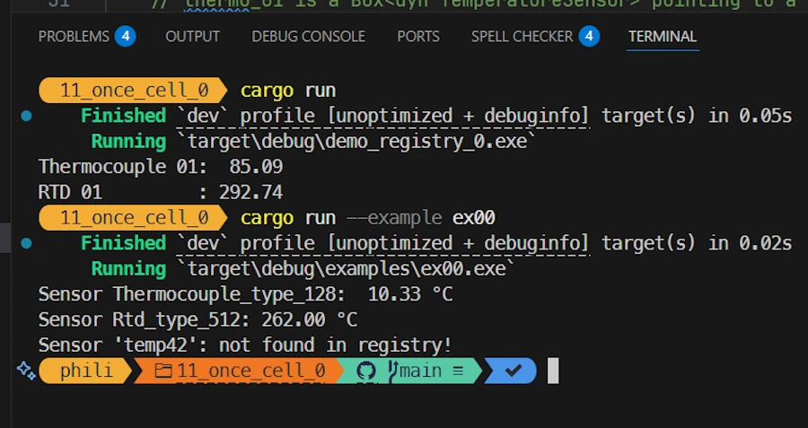

# Rust Traits: Defining Character
{: .no_toc }

From basic syntax to building plugins with once_cell and organizing your Rust projects.
{: .lead }


<h2 align="center">
<span style="color:orange"><b>This post is under construction.</b></span>    
</h2>

### This is Episode 04
{: .no_toc }

## TL;DR
{: .no_toc }

* For beginners
* The code is on [GitHub](https://github.com/40tude/traits_as_plugins)

<div align="center">
<br/>
<!-- <span>In space, no one can hear you scream.</span> -->
</div>


#### Posts 
{: .no_toc }

* [Episode 00]()
* [Episode 01]()
* [Episode 02]()
* [Episode 03]()
* [Episode 04]()

## Table of Contents
{: .no_toc .text-delta}
- TOC
{:toc}


<!-- ###################################################################### -->
<!-- ###################################################################### -->
<!-- ###################################################################### -->
<!-- ###################################################################### -->
<!-- ###################################################################### -->


## Once Cell 1/3

Where the `once_cell` crate lets us define a global list of sensors dynamically initialized at runtime.

### Running the demo code
{: .no_toc }

* Right click on `assets/11_once_cell_0`
* Select the option "Open in Integrated Terminal"
* `cargo add rand`
* `cargo add once_cell`
* `cargo run`
* `cargo run --example ex00`

<div align="center">
<br/>
<!-- <span>Comment about the picture above</span> -->
</div>


### Explanations 1/2 
{: .no_toc }

Houston, we have a problem. The POC works but I'm not sure it will work with 10_000 thermocouples, different kind of sensors, different kinds of actuators. Do you 
remember, in the previous version of the application, in `temperature_sensor.rs` we had a young and innocent `make_sensor()` function. It looked like this :

```rust
pub fn make_sensor(kind: usize) -> Box<dyn TempSensor> {
    match kind {
        1 => Box::new(my_sensor1::TempSensor01),
        2 => Box::new(your_sensor2::TempSensor02),
        other => {
            // in production return a Result
            eprintln!("Unknown SENSOR_KIND='{other}', falling back to temp1.");
            Box::new(my_sensor1::TempSensor01)
        }
    }
}
```

Pretty young thing, no? No! What will happen with 250 different kind of sensors. We will need a huge match statement. On the other hand, we need to make sure to not overload the application with many sensors while only a dozen is in use... But again, the most critical point is that the match statement above is not scalable and ideally the available sensors should register by themselves.

And this is where the Rust crate [once_cell](https://crates.io/crates/once_cell) comes to the rescue. In this first version we will keep the file organization as close as possible from the previous one (see the section Dynamic Sensor Creation above). One thing however. Instead of `temperature_sensor1` and `temperature_sensor2` we now use `thermocouple` and `rtd` which are 2 different kinds of technologies for temperature sensors. Other than that the hub files are still present and the hierarchy is exactly the same. See below :


### Show me the code!
{: .no_toc }

```
.
│   .gitignore
│   Cargo.lock
│   Cargo.toml
│   
├───examples
│       ex00.rs
│       
├───src
│   │   lib.rs
│   │   main.rs
│   │   sensors.rs
│   │
│   └───sensors
│       │   temperature.rs
│       │
│       └───temperature
│           │   rtd.rs
│           │   temperature_sensor.rs
│           │   thermocouple.rs
│           │
│           ├───rtd
│           │       rtd_512.rs
│           │
│           └───thermocouple
│                   thermocouple_128.rs
│
└───target
```


### Explanations 2/2 
{: .no_toc }

Let's start with `main.rs`

```rust
use demo_registry_0::sensors::{self, temperature::temperature_sensor};

fn main() {
    sensors::register();

    let thermo_01 = temperature_sensor::make_sensor("Thermocouple_type_128").expect("Unknown sensor");
    println!("Thermocouple 01: {:6.2}", thermo_01.get_temp());

    let rtd_01 = temperature_sensor::make_sensor("Rtd_type_512").expect("Unknown sensor");
    println!("RTD 01         : {:6.2}", rtd_01.get_temp());
}
```

At a high level the code should be easy to understand
1. First, the sensors (we don't really know yet what this covers nor how it works) register themselves 
1. On return, the sensors are not yet initialized, they just confirm we can instantiate the ones the app need
1. Using its name (`Thermocouple_type_128`) we create an instance of a temperature sensor and print a temperature measurement   
1. We do the same with `Rtd_type_512`

On the other hand, `ex00.rs` simulates the case where the names of the sensors come from a database and when one reference (`temp_42`) cannot be instantiated.

```rust
fn main() {
    sensors::register();

    for sensor_name in ["Thermocouple_type_128", "Rtd_type_512", "temp42"] {
        match temperature_sensor::make_sensor(sensor_name) {
            Some(sensor) => {
                let temp = sensor.get_temp();
                println!("Sensor {sensor_name}: {:6.2} °C", temp);
            }
            None => {
                println!("Sensor '{sensor_name}': not found in registry!");
            }
        }
    }
}
```

In `main.rs`, let's start with `sensors::register();`. If you use VSCode I recommend to :

* Right click on `assets/11_once_cell_0`
* Select the option "Reveal in File Explorer"

<div align="center">
<br/>
<!-- <span>Comment about the picture above</span> -->
</div>

Once in File Explorer

* Right click on `11_once_cell_0`
* Select the option "Open with VSCode"

<div align="center">
<br/>
<!-- <span>Comment about the picture above</span> -->
</div>

Once in the new instance of VSCode, open `main.rs` click on the word `register` of `sensors::register`. You can either press `F12` or right click and select the option "Go to Definition" 

<div align="center">
<br/>
<!-- <span>Comment about the picture above</span> -->
</div>

The file `sensors.rs` opens and we see :

```rust
// sensors.rs
pub mod temperature;

pub fn register() {
    temperature::register();
}
```

Let's step back and make sure we are on the same page. In `main()` function I know I have some sensors and no actuators. I don't care about the details, I just call `sensors::register()` and I do not call `actuators::register()`. I my mind, calling `sensors::register()` means I delegate to someone else the registrations of the sensors.

Now at `sensors.rs` level, I know I only have temperature sensors so I call `temperature::register()`. This may change later. If we add other kind of sensors (strain gauge, pH meter...) I will then call `strain_gauge:register()`. This is my responsibility, and strain gauges registration will remain transparent to the `main()` function. 

Ok, let's press `F12` once the cursor is on `temperature::register()`. This opens `temperature.rs`.

```rust
// temperature.rs
pub mod rtd; 
pub mod temperature_sensor; 
pub mod thermocouple; 

pub fn register() {
    thermocouple::register();
    rtd::register();
}
```

At `temperature.rs` level, I know I only have only 2 types of temperature sensors : thermocouples and rtd. I call `thermocouple::register()` and `rtd::register()`. Let's press `F12` once the cursor is on `thermocouple::register()`. This opens `thermocouple.rs`.

```rust
// thermocouple.rs
pub mod thermocouple_128;

pub fn register() {
    thermocouple_128::register();
}
```

At `thermocouple.rs` level, I know I only have one kind of thermocouple so I call `thermocouple_128::register()`. Let's press F12. This opens `thermocouple_128.rs` :

```rust
// thermocouple_128.rs
use crate::sensors::temperature::temperature_sensor::{self, TemperatureSensor};

pub struct Thermocouple128; // camel case => no _

impl TemperatureSensor for Thermocouple128 {
    fn get_temp(&self) -> f64 {
        let temp: f64 = rand::random_range(0.0..128.0);
        temp
    }
}
pub fn register() {
    temperature_sensor::register_sensor("Thermocouple_type_128", || Box::new(Thermocouple128));
}
```

The upper part of the source code is well known. We have a `Thermocouple128` data type and we implement the `TemperatureSensor` trait. Nothing new under the sun and as before the `TemperatureSensor` trait is defined in `temperature_sensor.rs` but, if the cursor is on the word `TemperatureSensor`, do not press F12 yet.

Obviously, the most interesting part is the `register()` function definition. However, the syntax looks a bit odd, or at least not that easy to grasp the first time. Click on `temperature_sensor::register_sensor` then press F12. This opens the file `temperature_sensor.rs`. The code below is not complete but it is good enough to understand what is going on :

```rust
// temperature_sensor.rs
use once_cell::sync::Lazy;
use std::collections::HashMap;
use std::sync::Mutex;

pub trait TemperatureSensor {
    fn get_temp(&self) -> f64;
}

type Constructor = fn() -> Box<dyn TemperatureSensor>;

pub static TEMPERATURE_SENSOR_REGISTRY: Lazy<Mutex<HashMap<&'static str, Constructor>>> = Lazy::new(|| Mutex::new(HashMap::new()));

pub fn register_sensor(name: &'static str, constructor: Constructor) {
    let mut map = TEMPERATURE_SENSOR_REGISTRY.lock().expect("registry mutex poisoned");
    map.insert(name, constructor);
}
```

In the upper part part of the file we found the `TemperatureSensor` trait declaration. No change compared to what we already know. Then few lines below there is the definition of `register_sensor()`, the function we want to understand :

```rust
pub fn register_sensor(name: &'static str, constructor: Constructor) {
    let mut map = TEMPERATURE_SENSOR_REGISTRY.lock().expect("registry mutex poisoned");
    map.insert(name, constructor);
}
```

The `register_sensor()` function expects 2 parameters. The first one is a name that identify the kind of temperature sensor in the application (thermocouple, rtd... `Thermocouple_type_128`, `Rtd_512`...). Note that it is a `&str` with a `static` lifetime where `static` must be understood as "valid as long as the program runs". This is usually a string literal (e.g. `"Thermocouple_type_128"`). The second parameter is of type `Constructor`. 

`Constructor` is a type alias (a synonym) declared above the `register_sensor()` function : 

```rust
type Constructor = fn() -> Box<dyn TemperatureSensor>;
```

Now, when we read `Constructor`, we should read `fn() -> Box<dyn TemperatureSensor>`, meaning "a function returning a `Box<dyn TemperatureSensor>`". We already talked about `Box<dyn T>`, you know what this is, I do not have to explain it again: 

Finally  the really weird thing in `register_sensor()` definition is the `TEMPERATURE_SENSOR_REGISTRY`. It is declared this way :

```rust
pub static TEMPERATURE_SENSOR_REGISTRY: Lazy<Mutex<HashMap<&'static str, Constructor>>> = Lazy::new(|| Mutex::new(HashMap::new()));
```

Stay here, don't run away and don't panic... The line above just says something like :
* `TEMPERATURE_SENSOR_REGISTRY` is a global static variable (it lives as long as the application)
    * Its data type is `Lazy<Mutex<HashMap<&'static str, Constructor>>>`
    * It is initialized with the value `once_cell::sync::Lazy::new(|| Mutex::new(HashMap::new()))`

Regarding `TEMPERATURE_SENSOR_REGISTRY` we see that:
* This is a `HashMap` where the keys are the literal of the sensors and the values are the `Constructor()` of the respective sensor
* The `HashMap` is protected by a `Mutex`. 
* **Important:** A static variable cannot be `mut`, so we need **interior mutability** to modify the HashMap at runtime. `Mutex` provides that interior mutability and thread safety.
* Then the `Mutex<HashMap<...>>` is wrapped into a `Lazy` layer.
    * A `once_cell::sync::Lazy<T>` is a wrapper type
    * It says something like : "Here is a static that will be initialized the first time it’s used."
    * "It uses a closure `(|| …)` to specify how to build the value.
    * It guarantees that initialization happens once and only once, even if multiple threads race to access it.
    * That’s why the crate is named "once_cell". It’s like a "memory cell" that can be written exactly once. 

Regarding the initialization value `once_cell::sync::Lazy::new(|| Mutex::new(HashMap::new()))`
* A Lazy value says something like : "When somebody first touches this static, run the closure to build the real value."
    * The closure `|| Mutex::new(HashMap::new())` creates an empty HashMap wrapped in a `Mutex`.
    * So the very first time we call `register_sensor()` the Lazy runs the closure and it builds the `Mutex<HashMap<&'static str, Constructor>>`

Now that we understand what is behind the `TEMPERATURE_SENSOR_REGISTRY` variable declaration we can understand what the `register_sensor()` does :

```rust
pub fn register_sensor(name: &'static str, constructor: Constructor) {
    let mut map = TEMPERATURE_SENSOR_REGISTRY.lock().expect("registry mutex poisoned");
    map.insert(name, constructor);
}
```


* If the `TEMPERATURE_SENSOR_REGISTRY` is not yet created, it creates the HashMap (lazy implementation). 
* Then we call `.lock().expect("registry mutex poisoned")`. If a panic ever occurs while the registry is being updated, the mutex becomes poisoned. In that case, `.expect()` will panic with our custom message. Remember, a `Mutex` gets poisoned if a thread panics while holding the lock.
* To finish we insert the name of the sensor and its constructor in the HashMap.

**Could we recover instead of panicking?** Yes we can, see below one way but I wanted to keep the POC short :

```rust
match TEMPERATURE_SENSOR_REGISTRY.lock() {
    Ok(mut map) => {
        map.insert(name, constructor);
    }
    Err(poisoned) => {
        let mut map = poisoned.into_inner();
        map.insert(name, constructor);
    }
}
```

The idea is that once all the sensors have called `temperature_sensor::register_sensor()` everyone can use the initialized `TEMPERATURE_SENSOR_REGISTRY` value and we don't have to pass it around as a parameter in all the functions of the application. Ok?

***No. I'm lost! Where are we? What should I keep in mind?*** Remember, starting from `main()`, pressing F12, we followed the `register()` functions. Finally we reach `thermocouple_128::register()` which call `temperature_sensor::register_sensor()`. On the first call, `once_cell::sync::Lazy` initializes the registry (a global static variable that holds a HashMap of sensor constructors). Each call then locks the map and inserts `(name, constructor)`. From then on, any code can look up the name and call the stored constructor to obtain a `Box<dyn TemperatureSensor>`.

Let's see how a function could look for a sensor name and for that let's go back to `main()`. Below is a shortened version with one sensor created. After the line `sensors::register();` all sensors are in the global registry with their name and constructor. No constructor have been called. No sensor have been created. Then comes the call `temperature_sensor::make_sensor()` :

```rust
// main.rs
use demo_registry_0::sensors::{self, temperature::temperature_sensor};

fn main() {
    sensors::register();

    let thermo_01 = temperature_sensor::make_sensor("Thermocouple_type_128").expect("Unknown sensor");
    println!("Thermocouple 01: {:6.2}", thermo_01.get_temp());
}
```

You know what to do. Set the cursor and press F12. Below is the definition of `make_sensor` :

```rust
pub fn make_sensor(name: &str) -> Option<Box<dyn TemperatureSensor>> {
    let map = TEMPERATURE_SENSOR_REGISTRY.lock().expect("TEMPERATURE_SENSOR_REGISTRY mutex poisoned");
    map.get(name).map(|ctor| ctor())
}
```

It first we get access to the global registry. As before if the `Mutex` is poisoned `.expect()` panics and prints a custom message. Otherwise we find the sensor by its name (the key) and we call the constructor (the value). The returned value of the constructor is the returned value of `make_sensor()`. 

***What is `ctor` again ?*** Previously, we stored in the static global HashMap (`TEMPERATURE_SENSOR_REGISTRY`) the name of the sensor (`"Thermocouple_type_128"`) as a key and a closure that builds a new instance of this sensor as a value (`|| Box::new(Thermocouple128)`). Here, with `map(|ctor| ctor()`, `|| Box::new(Thermocouple128)` is called and its output becomes the returned value of `make_sensor()`. Look at the signature of `make_sensor()`. It returns an `Option` to a boxed data type which implements the `TemperatureSensor` trait (could be a `Thermocouple128`, `Rtd512`...) 


**OK... Could we recover instead of panicking?** Yes we can. See below one idea :

```rust
pub fn make_sensor(name: &str) -> Option<Box<dyn TemperatureSensor>> {
    match TEMPERATURE_SENSOR_REGISTRY.lock() {
        Ok(map) => map.get(name).map(|ctor| ctor()),
        Err(poisoned) => {
            eprintln!("[warn] TEMPERATURE_SENSOR_REGISTRY mutex poisoned — recovering.");
            let map = poisoned.into_inner(); // take the inner HashMap anyway
            map.get(name).map(|ctor| ctor())
        }
    }
}
```


Let's move on. At the end of the day from the caller point of view, in `main()`, we have : 

```rust
let thermo_01 = temperature_sensor::make_sensor("Thermocouple_type_128").expect("Unknown sensor");
```

`thermo_01` is a ready to use instance of the `Thermocouple_type_128` thermocouple. It implements the `TemperatureSensor` trait so we can call `.get_temp()` on it :

```rust
println!("Thermocouple 01: {:6.2}", thermo_01.get_temp());
```


### Exercise
{: .no_toc }

1. Starting from `main()`, follow the white rabbit, press F12 and retrieve the `register_sensor()` of the rtd.
1. Do you feel brave enough to add a new category of temperature sensor?
    * Add `optical` in addition to `rtd` and `temperature` and the kind of optical sensor could be `camera_007`.   
1. It seems the registry is written once per kind of sensor and read once per sensor. We may end up with much more read than write operations. Any idea on how we could improve performances?
    * **Solution:** 
        * Rename `temperature_sensor.rs` as `temperature_sensor.rs.mutex` 
        * Rename `temperature_sensor.rs.rwlock` as `temperature_sensor.rs`
        * `Cargo run`
        * `Mutex` is replaced by `RwLock`


### Summary
{: .no_toc }

* We wanted to avoid the potentially huge `match` statement of the previous version of the `make_sensor()` function.
* The solution is to let each sensor register itself in a global registry.
* In Rust, plain global variables must be initialized at compile time, which doesn’t work here since the registry must be built dynamically.
* We therefore need a global variable that is created at runtime.
* `once_cell::sync::Lazy` lets us define such a global variable: it ensures the registry is initialized safely on first access.
* The registry is a `HashMap` where:
    * the key is a sensor identifier (usually a string literal),
    * the value is a constructor function returning a `Box<dyn TemperatureSensor>`.
* The `HashMap` is wrapped in a `Mutex` to provide interior mutability and thread safety.
* Sensors register themselves by inserting their constructor into the registry.
* Later, sensors can be instantiated on demand by looking them up in the registry.
* Smoking!


<!-- ###################################################################### -->
<!-- ###################################################################### -->
<!-- ###################################################################### -->
<!-- ###################################################################### -->
<!-- ###################################################################### -->


## Once Cell 2/3

Where we have 2 registries. One for temperature sensors and another for pH

### Running the demo code
{: .no_toc }

* Right click on `assets/12_once_cell_1`
* Select the option "Open in Integrated Terminal"
* `cargo run`

<div align="center">
<br/>
<!-- <span>Comment about the picture above</span> -->
</div>


### Explanations 1/2 
{: .no_toc }


### Show me the code!
{: .no_toc }

```rust

```


### Explanations 2/2 
{: .no_toc }


### Exercise
{: .no_toc }


### Summary
{: .no_toc }


<!-- ###################################################################### -->
<!-- ###################################################################### -->
<!-- ###################################################################### -->
<!-- ###################################################################### -->
<!-- ###################################################################### -->


## Once Cell 3/3

One sentence

### Running the demo code
{: .no_toc }

* Right click on `assets/?????`
* Select the option "Open in Integrated Terminal"
* `cargo run`

<div align="center">
<br/>
<span>Comment about the picture above</span>
</div>


### Explanations 1/2 
{: .no_toc }


### Show me the code!
{: .no_toc }

```rust

```


### Explanations 2/2 
{: .no_toc }


### Exercise
{: .no_toc }


### Summary
{: .no_toc }


#### Posts 
{: .no_toc }

* [Episode 00]()
* [Episode 01]()
* [Episode 02]()
* [Episode 03]()
* [Episode 04]()


---

<!-- ###################################################################### -->
<!-- ###################################################################### -->
<!-- ###################################################################### -->
<!-- ###################################################################### -->
<!-- ###################################################################### -->


<!-- ## Template

One sentence

### Running the demo code
{: .no_toc }

* Right click on `assets/?????`
* Select the option "Open in Integrated Terminal"
* `cargo run`

<div align="center">
<br/>
<span>Comment about the picture above</span>
</div>


### Explanations 1/2 
{: .no_toc }


### Show me the code!
{: .no_toc }

```rust

```


### Explanations 2/2 
{: .no_toc }


### Exercise
{: .no_toc }


### Summary
{: .no_toc } -->
