<!-- 
TODO :
* Fournir tous les codes de toutes les solutions
* Rajouter des images 
* Rajouter des vidéos
-->


# Rust Error Handling, Demystified
{: .no_toc }

A beginner-friendly conversation on Errors, Results, Options, and beyond.
{: .lead }


<h2 align="center">
<span style="color:orange"><b>This post is under construction.</b></span>    
</h2>

<!-- ### This is Episode 00
{: .no_toc } -->


## TL;DR
{: .no_toc }

* For beginners.

* The code is on [GitHub](https://github.com/40tude/err_for_blog_post).

* **Rust has no exceptions:** It distinguishes 
    * **recoverable** errors (handled with the `Result<T, E>` type) 
    * **unrecoverable** errors (handled by panicking using `panic!()`) 
    
    This means we must explicitly handle errors.

* **`Result<T, E>` enum:**  Represents either success (`Ok(T)`) or error (`Err(E)`). Use pattern matching ( `match` expression), or methods like `.unwrap()/.expect()` (which `panic!()` on error) to handle these. Prefer `.expect()` with a custom message.

* **`?` operator for propagation:**  To propagate errors upwards without heavy syntax, use the `?` operator. It returns the error to the caller if an operation fails. Only works in functions returning a compatible `Result<T, E>` (or `Option<T>` ). The `main()` function can return a `Result<T, E>` and use `?` 

* **`Option<T>` vs `Result<T, E>`:**  
    * Use **`Option<T>`** when the absence of a value isn’t an error (e.g.[exempli gratia], no search result) and no error info is needed. 
    * Use **`Result<T, E>`** when an operation can fail in an exceptional way and we need to convey an error message or reason [5](https://users.rust-lang.org/t/option-vs-results/113549). 

* **When to panic:** Reserve **`panic!()`** for truly unrecoverable bugs or invalid states (e.g. asserting [invariant](#invariant)). If failure is expected or possible in normal operation (e.g. file not found, invalid user input...), return a `Result<T, E>` instead. Library code should avoid panicking on recoverable errors to let the caller decide how to handle them.

* **Custom error types:** As part of a sophisticated programs or libraries, define our own custom error types (often as `enums`) to represent various error kinds in one type. Implementing `std::error::Error` (via `Display` and `Debug` ) for these types or using `Box<dyn std::error::Error>` can help integrate with the `?` operator and allow different error kinds to propagate seamlessly.


* **Keep in mind**

```rust
use std::fs::File; 
use std::io::Read;

pub type Error = Box<dyn std::error::Error>;
pub type Result<T> = std::result::Result<T, Error>;

fn main() -> Result<()> {
    let f = File::open("foo.txt")?;
    let mut data = vec![];
    f.File.read_to_end(&mut data)?;
    Ok(())
}
```

<div align="center">
<br/>
<span>Let's have a beginner-friendly conversation on Errors, Results, Options, and beyond.</span>
</div>


<!-- 
#### Posts 
{: .no_toc }

* [Episode 00]()
* [Episode 01]()
* [Episode 02]()
* [Episode 03]()
* [Episode 04]() 
-->


## Table of Contents
{: .no_toc .text-delta}
- TOC
{:toc}


<!-- ###################################################################### -->
<!-- ###################################################################### -->
<!-- ###################################################################### -->


## Why Alice and Bob are here?
A long time ago (2010, may be) I read a `.pdf` about the N-Body Simulations. Too bad, I can't find it on the web anymore, but here's a copy of [volume 1](). It was based on Ruby but it was great, easy to follow etc. One thing was that it was written as a conversation between **Bob** and **Alice**. Later the code was re-written in Python and the set of `.pdf` was merged into an expensive printed book (55$ when I bought my copy). Today (sept 2025) you can find it on [AMZN](https://www.amazon.fr/Moving-Planets-Around-Introduction-Exoplanetary/dp/0262539349) for 28€.

<div align="center">
<br/>
<span>Moving Planets Around</span>
</div>

Last week I start reading `The Basics of Bitcoins and Blockchains` ([AMZN](https://www.amazon.fr/dp/1642506737?ref=ppx_yo2ov_dt_b_fed_asin_title)). 

<div align="center">
<br/>
<span>The Basics of Bitcoins and Blockchains</span>
</div>


In Part 3, there is a section `Why Alice and Bob`. Believe it or not, I then discovered where [they came from](https://en.wikipedia.org/wiki/Alice_and_Bob). 

I like to write in a conversational tone, so let's imagine a discussion between Bob and Alice and let's see how it goes...


<!-- ###################################################################### -->
<!-- ###################################################################### -->
<!-- ###################################################################### -->

## Introduction: Why Rust Cares About Errors

**Alice:** I ran a Rust code snippet and it **forced** me to handle an error – it wouldn’t even compile until I did! What’s going here?

**Bob:** The compiler (`rustc`) makes sure we acknowledge and handle errors properly before our code even runs. This helps prevent crashes at runtime.


**Alice:** There are no exceptions at all?

**Bob:** Exactly. Rust doesn’t have exceptions. Instead, it has a different model for errors. Essentially, Rust groups errors into two categories: **recoverable** and **unrecoverable**. 
* **Recoverable** errors are things we expect might happen and can be dealt with (like a file not found – we might just create the file or use a default). These are handled with the `Result<T, E>` type. 
* **Unrecoverable** errors are bugs on our side or unexpected conditions (like indexing past the end of an array – something’s really bad if that happens). For these cases Rust provides the `panic!()` macro to stop the program.


**Alice:** So `Result<T, E>` is for errors I can handle, and `panic!()` is for the program-halting ones?

**Bob:** Yes! 
* Think of `Result<T, E>` as Rust’s way of saying "operation might succeed or fail". We then decide what to do if it fails.
* Whereas a `panic!()` is Rust saying "I can’t deal with this, I must crash now". 

By making error handling explicit with `Result`, Rust ensures we don’t just ignore errors. It won’t let us compile unless we either handle the `Result<T, E>` (e.g., check for an error) or explicitly choose to crash (like using `.unwrap()` which triggers a `panic!()` if there’s an error). This leads to more robust programs because we're less likely to have an error go unnoticed.


**Alice:** Um... This is may be a silly question but, if I know my function can succeed or fail, can it returns `Result<T, E>`.

**Bob:** Yes, absolutely! Even `main()` can return `Result<T, E>`. It is a very good practice. Before writing any code, ask yourselves "can this function fail? Should it return `Option<T>` or `Result<T, E>`?". Then work on the rest of the function or method signature.

<div align="center">
<iframe width="560" height="315" src="https://www.youtube.com/embed/nLSm3Haxz0I?si=k8Xtc_AofCBs3H_T" title="YouTube video player" frameborder="0" allow="accelerometer; autoplay; clipboard-write; encrypted-media; gyroscope; picture-in-picture; web-share" referrerpolicy="strict-origin-when-cross-origin" allowfullscreen></iframe>
</div>


**Alice:** It’s a bit scary that the program can just crash with `panic!()` though. 

**Bob:** Again, `panic!()` is for cases that are **not supposed to happen** like an invariant being broken. And even when a `panic!()` occurs, Rust will unwind the stack and cleanup (or we can opt to abort immediately). Most of the time, you’ll use `Result<T, E>` for possible errors and only `panic!()` on bugs that are your responsibility. We’ll talk more about choosing between them later.


**Alice:** This is may be too early but how can I opt to abort immediately?

**Bob:** Your're right, it's too early but your wishes are my commands. In `Cargo.toml` add the following section:

```toml
[profile.release]
panic = "abort"
```
The default is `unwind`. With `abort` opted in:
* No cleanup: at the first panic, the program terminates immediately with an `abort()`.
* No destructor (Drop) is invoked.
* This reduces the binary size and the build time (fewer symbols to generate)


**Alice:** Ok... So Rust wants me to handle every error. This will be a pain... How do I actually do that with `Result<T, E>`? What does a `Result<T, E>` look like?

**Bob:** That's a good question. We'll answer it by examining how `Result<T, E>` works and how to use it, but before that, it's time to recap and practice a little.


### Summary – Introduction

* Rust requires we handle errors explicitly. Code that can fail must return a `Result<T, E>` (or `Option<T>`   ), forcing the caller to address the possibility of failure [2](https://doc.rust-lang.org/book/ch09-00-error-handling.html#:~:text=Errors%20are%20a%20fact%20of,deploying%20your%20code%20to%20production).
* Rust distinguishes 
    * **recoverable errors** (e.g. file not found, invalid input – handled with `Result`)
    * **unrecoverable errors** (bugs like out-of-bounds access – handled with `panic!()`).
* No exceptions are used. This language design decision helps prevent unchecked errors. We either deal with the error or deliberately choose to `panic!()`/`.unwrap()`, making error handling clear in the code.


### Exercises – Introduction

1. **Identify Error Types:** Think of two scenarios in programming: 
    * one that would be a ***recoverable error*** 
    * one that would be an ***unrecoverable error***

    For each scenario, explain whether we would use Rust’s `Result<T, E>` or a `panic!()`, and why.

2. **Compile-time Check:** Write a Rust code that attempts to open a non-existent file with `std::fs::File::open(foo.txt)` without handling the returned `Result<T, E>`. Observe the compiler error or warning. Then, fix it by handling the `Result<T, E>` (for now, we can just use a simple `panic!()` or print an error message in case of `Err`). One can read [this page](https://doc.rust-lang.org/book/ch09-02-recoverable-errors-with-result.html#:~:text=fn%20main%28%29%20,hello.txt)


### Optional - Setting Up our Development Environment 

Let's make sure we can Debug the code.

**Requirements:** 
* I expect either 
    1. `CodeLLDB` extension (`code --install-extension vadimcn.vscode-lldb`)
    2. **or** the `Build Tools for Visual Studio` to be installed. 

`CodeLLDB` might be faster and easier to install (after all, it is "just" a VSCode extension). Both can be installed on your PC if you wish or need (this is my case). We will see how to use one or the other. We need them to debug our code.

* I also expect the `command-variable` extension to be installed. We need it also to debug our code.
    * `code --install-extension rioj7.command-variable`

This said, I use VSCode under Windows 11 and I wrote a post about [my setup](). Here I use a [workspace](https://doc.rust-lang.org/book/ch14-03-cargo-workspaces.html) because I can have more than one project (packages) in a single "space". Think of workspaces as meta-project. 

Now, having this in mind here is what I do and why.

* Get a copy of the repo from [GitHub](https://github.com/40tude/err_for_blog_post)
* Right click  the directory name then select `Open with Code`
* Once in VSCode, click on `00_u_are_errors/examples/ex00.rs` in the VSCode editor

At the time of writing here is what I see :

<div align="center">
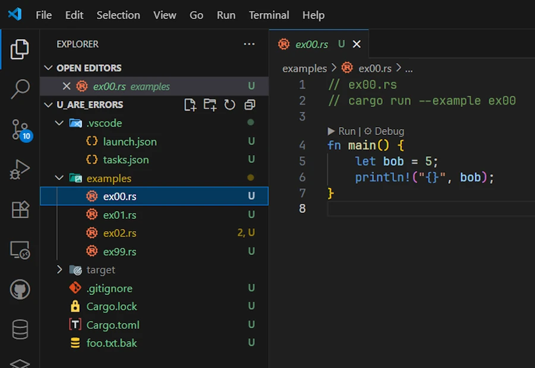<br/>
<span>Click on the image to zoom in</span>
</div>

* Just for testing purpose, delete the `target/` directory if it exists (at this point it should'nt exist yet since you just got the workspace from GitHub)

* Press `CTRL+SHIFT+B`. This should build a debug version of the code
    * Check `target/debug/examples/`. It should contains `ex00.exe`
    * If `CTRL+SHIFT+B` does not work, open a terminal (CTRL+ù on a French keyboard) and use this command : `cargo build -p u_are_errors --example ex00`
    * You need `-p u_are_errors` because in a workspace we need to indicate the name of the package (which you find in `Cargo.toml`)


**If and only if** `(LLDB || Build Tools for Visual Studio) && command-variable` are installed 

* Set the cursor on line 5 then press `F9` 
* This set a breakpoint on line 5. See below:

<div align="center">
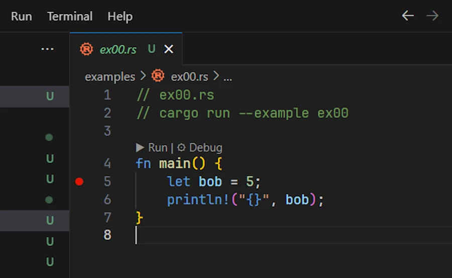
</div>


* Open de `Run & Debug` tab on the side (`CTRL+SHIFT+D`)
* In the list box, select the option corresponding to your configuration (LLDB or MSVC). See below:

<div align="center">
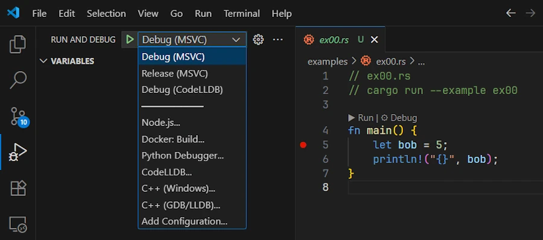
</div>


* Press `F5`
    * This starts the debug session
    * If needed the application is built (not the case here because it is already built) 
    * The execution stops on line 5. See below :

<div align="center">
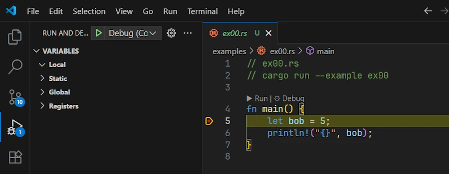
</div>   

* Press `F10` to move forward
    * Line 5 is executed
    * On the left hand side, in the Local subset of variables, we can check that `bob` is now equal to 5. See below:

<div align="center">

</div>

* Press `F5` to continue and reach the end  of the code

Let's make a last test. Just to make sure...
* Delete the `target/` directory
    * Select it then press `DELETE`
* `exe00.rs` should still be open in the editor with a breakpoint set on line 5
* Press `F5`
    * The `ex00.exe` is built
    * The debug session starts
    * Execution stops on line 5 as before

**The making of:**

When reading for the first time, you can skip this section and come back to it later if you really need to understand how compilation and debugging tasks work.

The secret ingredient lies in `./vscode/task.json` and `./vscode/launch.json`

**1. `.vscode/tasks.json`:**
```json
{
  "version": "2.0.0",
  "tasks": [
    {
      "label": "cargo-build-debug",
      "type": "cargo",
      "command": "build",
      "args": [
        "-p",
        "${input:packageName}",
        "--example",
        "${fileBasenameNoExtension}"
      ],
      "problemMatcher": ["$rustc"],
      "group": { "kind": "build", "isDefault": true }
    },
    {
      "label": "cargo-build-release",
      "type": "cargo",
      "command": "build",
      "args": [
        "--release",
        "-p",
        "${input:packageName}",
        "--example",
        "${fileBasenameNoExtension}"
      ],
      "problemMatcher": ["$rustc"]
    },
  ],
  "inputs": [
    {
      "id": "packageName",
      "type": "command",
      "command": "extension.commandvariable.transform",
      "args": {
        "text": "${relativeFileDirname}",
        "find": "^(.{3})([^\\\\/]+)(?:[\\\\/].*)?$",
        "replace": "$2"
      }
    }
  ]
}
```

* In the first object of the array `tasks`, the key named `group` helps to make the task the one by default. This explains how and why `CTRL+SHIFT+B` worked. 
* Note that since the source code to compile is in the `examples/` directory, we pass `--example` and the name of the file (see `${fileBasenameNoExtension}`, e.g. `ex00`) in the `args` array.
* Since we are in a workspace we need `-p` followed by the name of the package (`input:packageName`)
* If you get lost, just review the build command you enter in the terminal before. What we do here is exactly the same thing : `cargo build -p u_are_errors --example ex00`. Except that we want to discover the name of the package dynamically. Indeed not all the source code are in the `u_are_errors` package. You may have seen the 2 other projects: `01_experimentation` and `02_production` for example. 
    * In `01_experimentation/`, in `Cargo.toml` the name of the package in `experimentation` for example
* Finding out the name of the package is done in the `inputs` array and this is where the `command-variable` extension shines. Indeed we create a variable `packageName` which is initialized with the output of a command which is a regular expression applied to the `${relativeFileDirname}` of the source code opened in the editor.
    * To make a long story short from `01_experimentation/examples/` it extracts `experimentation`
* Then the `${input:packageName}` variable can be used in the build tasks.     


To see the list of `tasks`, in VSCode, press `ALT+T` then press `R`
    * Below we can see both tasks : `cargo-build-debug` and `cargo-build-release`

<div align="center">
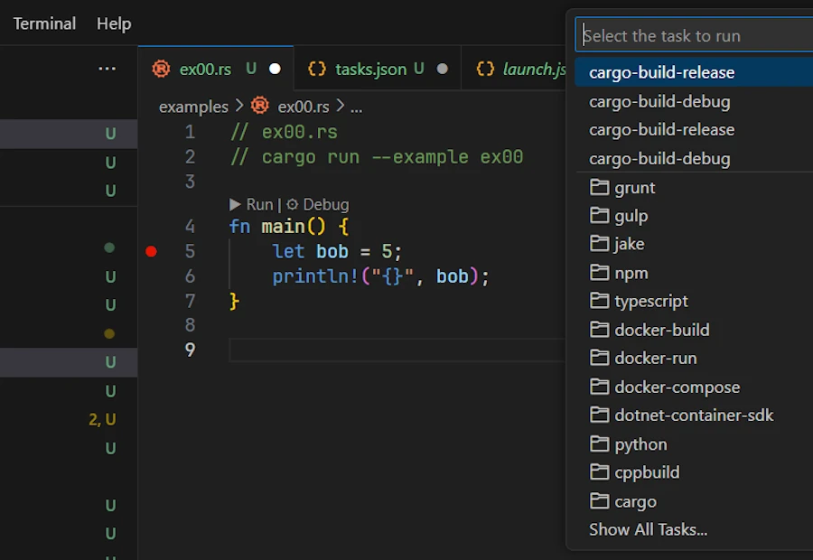
</div>

**2. `.vscode/launch.json`:**

```json
{
    "version": "0.2.0",
    "configurations": [
        {
            "type": "cppvsdbg",
            "request": "launch",
            "name": "Debug (MSVC)",
            "program": "${workspaceFolder}/target/debug/examples/${fileBasenameNoExtension}.exe",
            "args": [],
            "cwd": "${workspaceFolder}",
            "environment": [
                {
                    "name": "RUST_BACKTRACE",
                    "value": "short"
                }
            ],
            "preLaunchTask": "cargo-build-debug"
        },
        {
            "type": "cppvsdbg",
            "request": "launch",
            "name": "Release (MSVC)",
            "program": "${workspaceFolder}/target/release/examples/${fileBasenameNoExtension}.exe",
            "args": [],
            "cwd": "${workspaceFolder}",
            "environment": [
                {
                    "name": "RUST_BACKTRACE",
                    "value": "short"
                }
            ],
            "preLaunchTask": "cargo-build-release"
        },
        {
            "type": "lldb",
            "request": "launch",
            "name": "Debug (CodeLLDB)",
            "program": "${workspaceFolder}/target/debug/examples/${fileBasenameNoExtension}.exe",
            "args": [],
            "cwd": "${workspaceFolder}",
            "sourceLanguages": ["rust"],
            "preLaunchTask": "cargo-build-debug"
        }
    ]
}
```

* There are 3 objects in the array `configurations`. This is why we can debug code with LLDB or MSVC. The third helps to launch the release version.
* In each object of the array `configurations`, the path in the `program` key, points to the executable created at the end of the build (do you see `${fileBasenameNoExtension}`?)
* Note the `preLaunchTask` key. It explains why we can press F5 (debug) even if the executable is not yet built. In such case, the task `cargo-build-debug` is executed then the debug session starts.


### Solution to Exercice #2

Let's take some time and see how one could answer the second exercice. If I search "Rust open txt file" on Google, one of the links drive me to the excellent [Rust By Example](https://doc.rust-lang.org/rust-by-example/std_misc/file/open.html). See below :

<div align="center">
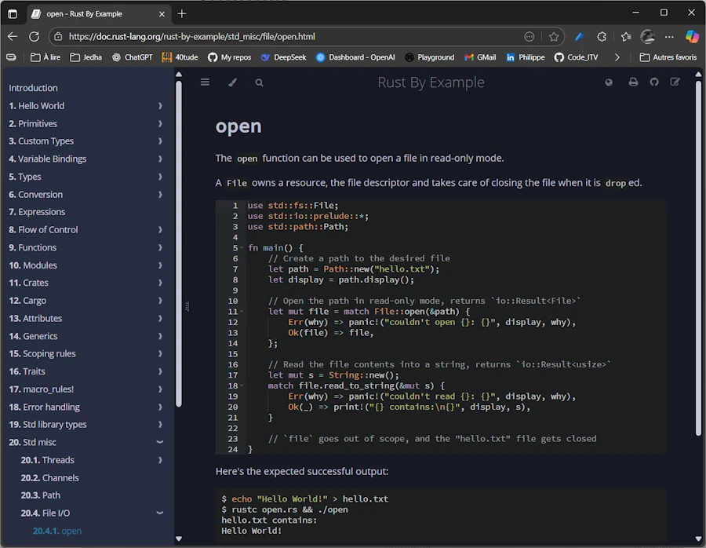<br/>
<!-- <span>Optional comment</span> -->
</div>

This is great because on line 11 it uses `std::fs::File::open()` but it is a little bit too complex for me and it seems it handles errors while I want the compiler to complain then fix the errors.


Copy/paste/save the file as `ex01.rs` or open your eyes : the code is already in `00_u_are_errors/examples/ex01.rs`. To make sure the code works as expected I can press F5 or open a terminal then enter `cargo run -p u_are_errors --example ex01`. Here is what I see in the Debug Console once I pressed F5 :

<div align="center">
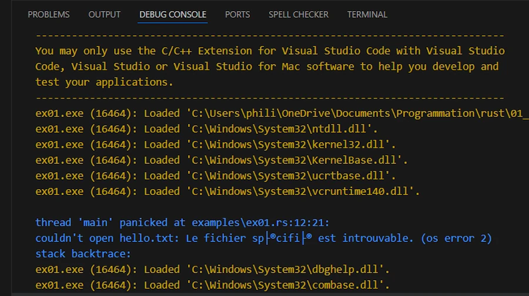<br/>
<!-- <span>Optional comment</span> -->
</div>

The code cannot find `hello.txt` and `panic!()`.


Copy/paste/save the file as `ex02.rs`. From the previous code, I just keep what I need :

```rust
// ex02.rs
fn main() {
    let f = std::fs::File::open("foo.txt");
    println!("'f' after std::fs::File::open() =  {:?}", f);
}
```

Surprisingly if I press F5, it builds and runs in a debug session without complain.

```
------------------------------------------------------------------------------
You may only use the C/C++ Extension for Visual Studio Code with Visual Studio
Code, Visual Studio or Visual Studio for Mac software to help you develop and
test your applications.
------------------------------------------------------------------------------
ex02.exe (30708): Loaded 'C:\Users\phili\OneDrive\Documents\Programmation\rust\01_xp\018_err_for_blog_post\u_are_errors\target\debug\examples\ex02.exe'. Symbols loaded.
ex02.exe (30708): Loaded 'C:\Windows\System32\ntdll.dll'. 
ex02.exe (30708): Loaded 'C:\Windows\System32\kernel32.dll'. 
ex02.exe (30708): Loaded 'C:\Windows\System32\KernelBase.dll'. 
ex02.exe (30708): Loaded 'C:\Windows\System32\ucrtbase.dll'. 
ex02.exe (30708): Loaded 'C:\Windows\System32\vcruntime140.dll'. 
'f' after std::fs::File::open() =  Err(Os { code: 2, kind: NotFound, message: "Le fichier sp├®cifi├® est introuvable." })
ex02.exe (30708): Loaded 'C:\Windows\System32\kernel.appcore.dll'. 
ex02.exe (30708): Loaded 'C:\Windows\System32\msvcrt.dll'. 
The program '[30708] ex02.exe' has exited with code 0 (0x0).
```

In fact, with [my setup](), if I press `CTRL+ALT` I can reveal the datatype.

<div align="center">
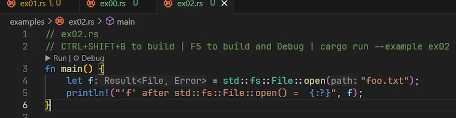<br/>
<!-- <span>Optional comment</span> -->
</div>

`f` is a `Result<File, Error>`. It is a `Result<T, E>` but what happens, is that when I asked to print it with `{:?}`, Rust displays the content of the `Result<T, E>` and this is why we can see :

```
'f' after std::fs::File::open() =  Err(Os { code: 2, kind: NotFound, message: "Le fichier sp├®cifi├® est introuvable." })
```

In fact despite ourselves, we cheat. We call a function returning `Result<T, E>` in a context that expects a file `f` without using it (e.g. trying to read something).


Copy/paste/save the file as `ex03.rs`. Let's make sure the build system complain. Modify the previous code with the one below :

```rust
// ex03.rs
fn main() {
    let f: std::fs::File = std::fs::File::open("foo.txt");
    println!("{:?}", f);
}
```
On the lhs of the equal sign, I express my expectation. I expect a `std::fs::File`. Obviously this does not fly very well. We don't even need to try to build. Indeed, the red squiggles warn us and if we hover them with the cursor we get a clear explanation and some advises. See below : 

<div align="center">
<br/>
<!-- <span>Optional comment</span> -->
</div>


Copy/paste/save the file as `ex04.rs`. Let's find a solution. Modify the previous code with the one below :

```rust
// ex04.rs
use std::fs::File; 

fn main() {
    let result_file = File::open("00_u_are_errors/foo.txt");

    match result_file {
        Ok(file) => println!("Successfully opened file: {:?}", file),
        Err(why) => panic!("Panic! opening the file: {:?}", why),
    }
}
```

* `result_file` is a `Result<T, E>`. It is **NOT** a `File`. **It took me a while** to read it and understand it that way.
* `match` is an expression. It is NOT a statement. This one is easy because almost everything is an expression in Rust.
    * If the difference between [expression](#expressions) and [statement](#statement) is not crystal clear follow and read the 2 previous links.  
* The `match` expression forces us to handle all possible cases
* Set a break point on the line with `match` expression (F9)
* Press F5 and step forward with F10 
* The code starts from the directory at the root of the workspace. This explains why I need to specify `00_u_are_errors/foo.txt` to test the `OK()` arm (with `foo.txt` in `../workspace_directory/00_u_are_errors/foo.txt`) 


Copy/paste/save the file as `ex05.rs`. Let's take advantage of the fact that `match` is an expression. Modify the previous code with the one below :

```rust
// ex05.rs
use std::fs::File; 
use std::io::Read;

fn main() {
    let result_file = File::open("00_u_are_errors/foo.txt");
    let mut bob = match result_file {
        Ok(alice) => alice,
        Err(why) => panic!("Panic! opening the file: {:?}", why),
    };
    println!("{:?}", bob);

    let mut s = String::new();
    match bob.read_to_string(&mut s) {
        Ok(_) => print!("Content:\n{}", s),
        Err(why) => panic!("Panic! reading the file: {:?}", why),
    }
}
```


{: .note-title }
> Side Note
>
> I know, `bob` and `alice` are weird variable names in this context. I just want to make clear that `alice` exists only inside the body of `match` while `bob` exists outside the `match`. Remember from the Rust by Example we had **variable shadowing** on the `file` variable. We had: 
>
```rust
let mut file = match File::open(&path) {
    Err(why) => panic!("couldn't open {}: {}", display, why),
    Ok(file) => file,
};
```
>
>* The outer `let mut file = …;` declares a new variable `file` in the current scope.
>* Inside the `Ok(file)` match arm, the name `file` is a **pattern variable** that temporarily binds the `File` object contained in the `Ok()` variant.
>* That inner `file` variable is [shadowing](https://doc.rust-lang.org/book/ch03-01-variables-and-mutability.html?highlight=shadowing#shadowing) the outer one just for the right-hand side of the assignment.
>* Once the match expression finishes evaluating, the *inner* `file` is moved out of the `Ok(file)` pattern and becomes the value assigned to the *outer* `file`.
>* This is a case of variable shadowing.
>* The `file` in the match pattern and the `file` bound by the `let` are two distinct variables with the same name, in different scopes.


This said, let's go back to the source code :

* As before, `std::fs::File::open()` returns a `Result<File, io::Error>`, which we store in `result_file`.
* Since `match` is an expression, it evaluates to a value, and with the first `match` we assign that value to `bob`.
* It is important to understand that `match` **destructures** the `Result<T, E>`. So that the body of the `match` can be read as:
    * If the `Result<File, io::Error>` in `result_file` matches the pattern `Ok(alice)`, then the inner `File` is bound to the variable `alice`, and that `File` is returned from the `match`. This means `bob` now owns the file handle.
    * If it matches `Err(why)`, the program calls `panic!`. The `panic!` macro has the special “never” type (`!`) which never resolve to any value at all. So this arm never returns. This allows the entire `match` expression to still have type `File`. This arm prints a short message then, "[Don't press the little button on the joystick](https://www.youtube.com/watch?v=yG0vY5lT9yE), abort! abort! abort!"


<div align="center">
<br/>
<span>Don't push the little button on the joystick</span>
</div>

Run the code (F5) to see it in `panic!()`

<div align="center">
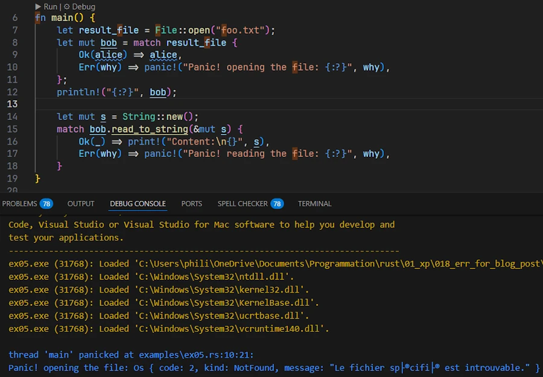<br/>
<!-- <span>Optional comment</span> -->
</div>

Now rename the file `foo.txt.bak` at the root of the project (`00_u_are_errors/`) to `foo.txt` and run the code (F5)

<div align="center">
<br/>
<!-- <span>Optional comment</span> -->
</div>


* When the code doesn’t `panic!` on `open()`, we first `println!()` the `Debug` representation of `bob`.
* Then we call `read_to_string()` on `bob`. The method returns an `io::Result<usize>`, which is just a type alias for `Result<usize, io::Error>`. On success, the `usize` is the number of bytes read.
* In the second `match` we don’t care about this number, so we use `_` to ignore it. Instead, we just `println!()` the contents of the `String s`.
* On `Err`, the code calls `panic!` again, prints a message, and the program aborts.


***Um... And how do I know `io::Result<usize>` is a type alias for `Result<usize, io::Error>`?*** 

**Green Slope:**
1. Set the cursor on `read_to_string`
1. Press F12 (Go To Definition)
1. We can see the function signature : `fn read_to_string(&mut self, buf: &mut String) -> io::Result<usize>`
1. Hover `io::Result<usize>`
1. We get access to the type alias `pub type Result<T> = result::Result<T, Error>` 

<div align="center">
<br/>
<!-- <span>Optional comment</span> -->
</div>

**North Face:**
1. Open the [std web page](https://doc.rust-lang.org/std/index.html)
1. On the left, find the **Crates** section
1. Click on **std**
1. Look for and click on **io**
1. On the right, go down to the **Type Aliases** section
1. Click on **Result**
1. The page Type Alias Result page explains what is going on : `pub type Result<T> = Result<T, Error>;`


**K12**
1. Open the [std web page](https://doc.rust-lang.org/std/index.html)
1. On the left, find the **Crates** section
1. Click on **std**
1. Look for and click on **io**
1. On the right side, go down and find the **Traits** section
    * I know I must reach the **Traits** section and not the **Functions** section (where there is a `read_to_string`) 
    * Because at the top of the source code if I hover the line `use std::io::Read;` I'm told `Read` is a trait. 

<div align="center">
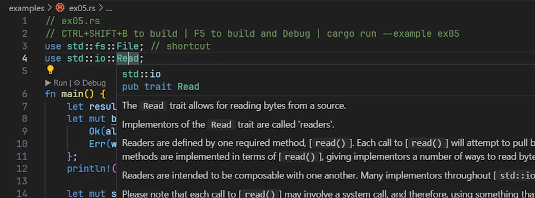<br/>
<!-- <span>Optional comment</span> -->
</div>

6. Click on **Read**
7. At the top you see the function signature: `fn read_to_string(&mut self, buf: &mut String) -> Result<usize> { ... }`
8. At the very end click on `Result<usize>`
9. The page Type Alias Result page explains what is going on : `pub type Result<T> = Result<T, Error>;`


I know what you think. But we need to invest time in learning how to navigate and read the documentation. For example instead of asking Google or ChatGPT, I may want to spend time and loose myself in the documentation of std looking for functions to read a `.txt` file. Or I can look for a sample code in Rust by Example then search for the function signature in the std documentation... Read and navigate the documentation no one can do it for you.

<div align="center">
<iframe width="560" height="315" src="https://www.youtube.com/embed/ODk38qJ1A3U?si=tQ9bd1UiqDBiWW-c" title="YouTube video player" frameborder="0" allow="accelerometer; autoplay; clipboard-write; encrypted-media; gyroscope; picture-in-picture; web-share" referrerpolicy="strict-origin-when-cross-origin" allowfullscreen></iframe>
</div>


It took us some time to reach that point but from now on I consider we know : 
* how to play with code in the project
* how to build (CTRL+SHIFT+B)
* how to set breakpoint (F9) and how to debug (F5)
* how to navigate the documentation (good luck!)

It is time to move on and to dive in `Result<T, E>`.


<!-- ###################################################################### -->
<!-- ###################################################################### -->
<!-- ###################################################################### -->

## The `Result<T, E>` Type: Handling Recoverable Errors


**Alice:** So, `Result<T, E>`... What exactly is it?

**Bob:**  [`Result<T, E>`](https://doc.rust-lang.org/std/result/enum.Result.html) is an `enum` (like a tagged union) defined roughly like this:

```rust
enum Result<T, E> {
    Ok(T),  // success, holding a value of type `T`
    Err(E), // failure, holding an error value of type `E`
}
```

It’s a generic `enum` with two variants: 
* `Ok(T)` means the operation succeeded and yielded a value of type `T` 
* `Err(E)` means it failed, yielding an error of type `E` describing what went wrong 

For example, when we try to open a file, the success type `T` is a file handle ( `std::fs::File` ), and the error type `E` is `std::io::Error`.

<div align="center">
<br/>
<!-- <span>Optional comment</span> -->
</div>


**Alice:** How do I use it? Let’s say I call a function that returns a `Result`. What do I do with that?

**Bob:** We have to check which variant it is. Typically, we use a `match` expression or one of many helper methods. Let’s do a simple example. Suppose we try to parse an integer from a string – this can fail if the string isn’t a number. Copy/paste/try this code in [Rust Playground](https://play.rust-lang.org/?version=stable&mode=debug&edition=2024):


```rust
fn main() {
    let text = "42";
    let number_result = text.parse::<i32>();  // parse() returns Result<i32, ParseIntError>
    
    match number_result {
        Ok(n) => println!("The number is {n}"),              // If parsing succeeds, use the number.
        Err(e) => println!("Could not parse number: {e}"),   // If it fails, handle the error.
    }
}
```

In this code, `text.parse::<i32>()` will return an `Ok(42)` if the string is a valid integer, or an `Err(e)` if it isn’t (for example, if `text = "hello"` ). We then `match` (destructure) on the `number_result`: 
* in the `Ok` arm, we get the parsed `i32` number `n` and print it
* in the `Err` arm, we get an error `e` (of type `std::num::ParseIntError` in this case) and print an error message. 

This way we’ve handled both outcomes explicitly. Using `match` is the standard way to handle a `Result<T, E>` because it forces us to consider both success and error cases.


**Alice:** Cool, but matching on every `Result<T, E>` is verbose. No?

**Bob:** True and this is why Rust provides utility methods on `Result<T, E>` to make life easier. For example, if we just want to crash on error (perhaps in a quick prototype), we can use `.unwrap()` or `.expect(...)`. These will check the `Result<T, E>` for us: 

* [`.unwrap()`](https://doc.rust-lang.org/std/result/enum.Result.html#method.unwrap) returns the success value if it’s `Ok`, but if it’s an `Err`, it will `panic!()` right there. 
* [`.expect(msg)`](https://doc.rust-lang.org/std/result/enum.Result.html#method.expect) does the same but lets us provide a custom panic error message.


**Alice:** So `.unwrap()` is basically a shortcut for "give me the value or panic"? 

**Bob:** Exactly. For example copy/paste/try this code in [Rust Playground](https://play.rust-lang.org/?version=stable&mode=debug&edition=2024):

```rust
fn main() {
    let text = "not a number";
    // This will panic because the string can't be parsed as i32
    let number = text.parse::<i32>().unwrap();
}
```

If we run this, it will panic with a message like: `thread 'main' panicked at src/main.rs:4:38: called 'Result::unwrap()' on an 'Err' value: ParseIntError { kind: InvalidDigit }`

Because "not a number" can’t be parsed, parse returns an `Err`, and `.unwrap()` triggers a `panic!()`.

By contrast, `if text = "42"`, `.unwrap()` would succeed and give us the `i32` value 42 without any panic.


**Alice:** Got it. And `.expect()` is similar but with my own message?

**Bob:** Right. We might do:

```rust
let number = text.parse::<i32>().expect("Expected a number in the string");
```

If it fails, we would get a `panic!()` with our message: `'Expected a number in the string: ParseIntError { ... }'`. Using `.expect()` with a clear message is considered better style code compared to `.unwrap()`, because if a panic happens, the message helps us track down the source and reason.

In fact, developers should prefer `.expect()` over `.unwrap()` so that there's more context in case of a crash.


**Alice:** So I should avoid `.unwrap()` and use `expect()` with a good message if I must panic on an error?

**Bob:** Yes, that’s a good rule of thumb. Even better, where possible, handle the error gracefully instead of panicking. `.unwrap()`/`.expect()` should be used sparingly – basically in scenarios where we are very sure `Err` won’t happen or in code snippet, sample code for brevity.

One more thing: `Result<T, E>` has other handy methods:
* [`.unwrap_or_default()`](https://doc.rust-lang.org/std/result/enum.Result.html#method.unwrap_or_default) will `.unwrap()` the value or give a default if it's an error (no panic). 
* [`.unwrap_or_else(f)`](https://doc.rust-lang.org/std/result/enum.Result.html#method.unwrap_or_else) where we can run a [closure](https://doc.rust-lang.org/book/ch13-01-closures.html) to generate a fallback value or do some other handling for the error. 


To show how to use `.unwrap_or_default()`, here below is a code you can copy/paste in [Rust Playground](https://play.rust-lang.org/?version=stable&mode=debug&edition=2024). Note that the default is the default of the current data type (0 for `i32`, "" for a `String`...)

```rust
fn main() {
    // Option<i32>
    let some_number: Option<i32> = Some(42);
    let none_number: Option<i32> = None;

    // unwrap_or_default() gives the value if Some, or the default (0 for i32) if None
    println!("Some(42).unwrap_or_default() = {}", some_number.unwrap_or_default());
    println!("None::<i32>.unwrap_or_default() = {}", none_number.unwrap_or_default());

    // Option<String>
    let some_text: Option<String> = Some("Hello".to_string());
    let none_text: Option<String> = None;

    // Default for String is empty string ""
    println!("Some(\"Hello\").unwrap_or_default() = '{}'", some_text.unwrap_or_default());
    println!("None::<String>.unwrap_or_default() = '{}'", none_text.unwrap_or_default());
}

```

The code below shows how to use `.unwrap_or_else(f)`. The tricky part might be the source code layout

```rust
// ex06.rs
fn main() {
    let some_number: Option<i32> = Some(42);
    let none_number: Option<i32> = None;

    // unwrap_or_else takes a closure that computes a fallback value
    println!(
        "Some(42).unwrap_or_else(...) = {}",
        some_number.unwrap_or_else(|| {
            println!("Closure not called, since we had Some");
            0
        })
    );

    println!(
        "None::<i32>.unwrap_or_else(...) = {}",
        none_number.unwrap_or_else(|| {
            println!("Closure called, computing fallback value...");
            100
        })
    );
}
```

With this code it might be a good idea to open `ex06.rs` in the project, set a breakpoint on line 5, press F5, click on the `DEBUG CONSOLE` tab when the execution is paused and then to press F10 to step over line by line.

<div align="center">
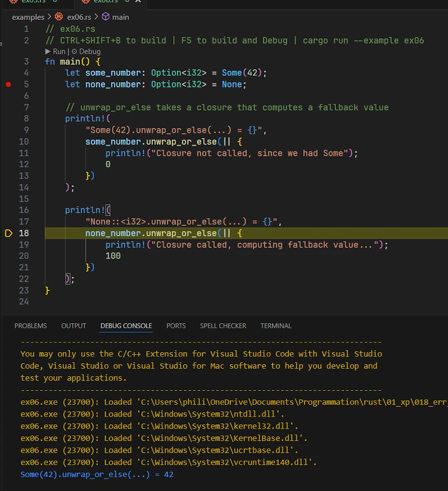<br/>
<!-- <span>Optional comment</span> -->
</div>


**Alice:** Earlier, we mentioned opening files... Is that similar with `Result<T, E>` ?

**Bob:** Yes. Opening a file is a classic example of a function returning `Result`. Let’s look the code below in [Rust Playground](https://play.rust-lang.org/?version=stable&mode=debug&edition=2024):

```rust
use std::fs::File;
use std::io::ErrorKind;

fn main() {
    let file_path = "hello.txt";
    let result = File::open(file_path);  // Result<File, std::io::Error>
    
    let file = match result{
        Ok(file_handle) => file_handle,
        Err(error) => {
            if error.kind() == ErrorKind::NotFound {
                // If file not found, try to create it
                File::create(file_path).expect("Failed to create file")
            } else {
                // For other errors (e.g., permission denied), panic
                panic!("Problem opening the file: {:?}", error);
            }
        }
    };
    println!("File opened: {:?}", file);
}
```

Here, `File::open` returns a `Result<File, Error>` – it could be `Ok(file_handle)` if the file exists and was opened, or `Err(error)` if something went wrong (file missing, no permission, etc.). 

We then `match` on it. 
* If the error kind is `NotFound` , we attempt to create the file (which itself could error, so we use `.expect()` to crash if even creation fails). 
* For any other kind of error, we just panic immediately. 

This way, we handle the "file not found" case by recovering (creating a new file) and let other errors bubble up as a `panic!()`. This example shows how we might handle different error scenarios differently by inspecting the error (here using `error.kind()`).


**Alice:** I see. We could also handle it differently, like notify the user or retry, depending on the context. 

**Bob:** Exactly. The point is that with `Result<T, E>`, we **decide** how to handle it. We could propagate it up, log it, ignore it (not recommended without justification), or crash. But **we have to choose**. That’s the strength of the deign : we won’t accidentally ignore an error.


### Summary – The `Result<T, E>` Type Basics

* **`Result<T, E>` is an enum:** with variants `Ok(T)` (success) and `Err(E)` (error). 

* **Handle with `match` or methods:** 
    * `match`
        * Using `match` on a `Result<T, E>` forces explicit handling of success and error. 
        * `match` **[destructures](https://doc.rust-lang.org/book/ch19-03-pattern-syntax.html?highlight=destructure#destructuring-to-break-apart-values)** the `Result<T, E>`
        * Inside an `Ok(file)` match arm, the name `file` is a **pattern variable** that temporarily binds the `File` object contained in the `Ok()` variant of the enum `Result<T, E>`.
    * Methods
        * Use `.unwrap()`/`.expect()` to get the value or `panic!()` on error.
        * Use `.unwrap_or_default()`/`.unwrap_or_else(func)` to provide fallbacks instead of panicking.

* **Prefer `.expect()`:** If we choose to `panic!()` on an error, prefer `.expect("custom message")` over plain `.unwrap()`. It gives a clearer error message for debugging when the unexpected happens.


### Exercises – `Result<T, E>` Basics

1. Can you find `Result<T, E>` in std documentation?

1. **Match Practice:** Write a function `parse_number(text: &str) -> i32` that tries to convert a string to an integer. Use `match` on `text.parse::<i32>()` (which gives a `Result<i32,std::num::ParseIntError>`) and return the number if successful, or print an error and return `0` if not. Test it with both a numeric string and a non-numeric string.

1. **.unwrap() vs .expect():** Using the same `parse_number` logic, create another function `parse_number_expect(text: &str) -> i32` that does the parsing but uses `.expect()` instead of `match` to crash on error (with a custom message like `Failed to parse number`). Call this function with a bad input to see the panic message. Then replace `.expect()` with `.unwrap()` to see the default panic message. Note the difference in the panic outputs.

1. **File Open Challenge:** Write a small program that attempts to open a file (e.g., `config.txt` ). If it fails because the file is missing, have the program create the file and write a default configuration to it (we can just write a simple string). If it fails for any other reason, have it print a graceful error message (instead of panicking). Use pattern matching on the `Err(e)` and `e.kind()` as shown above to distinguish the cases.


<!-- ###################################################################### -->
<!-- ###################################################################### -->
<!-- ###################################################################### -->


## Propagating Errors with `?` Operator

**Alice:** This `match` stuff is okay, but if I have to bubble up errors from multiple functions, writing a `match` expression in each function sounds painful.

**Bob:** You’re in luck – Rust has a convenience for that: the `?` operator. It’s a little piece of syntax that makes propagating errors much nicer.


**Alice:** I think I already saw `?` here and there in some Rust code. How does it work?

**Bob:** The `?` operator is essentially a shortcut for the kind of match-and-return-on-Err logic we’ve been writing. When we append `?` to a `Result<T, E>` (or an `Option<T>`), it will check the result: 
* If it’s Ok , it *unwraps* the value inside and lets our code continue
* If it’s an Err, it **returns that error from the current function** immediately, *bubbling* it up to the caller. This means we don’t have to write the `match` ourself, `?` does it for us.


**Alice:** So it returns early on error? Nice, that’s like exceptions but checked at compile time.

**Bob:** Right, it’s analogous to exception propagation but explicitly done via return values. Let’s refactor a previous example using `?`. We’ll write a function to read a username from a file. Without `?`, it would look like a lot of nested `match`, while with `?` it becomes straightforward:


```rust
// ex07.rs
use std::fs::File;
use std::io::{self, Read};

fn read_username_from_file() -> Result<String, io::Error> {
    let mut file = File::open("username.txt")?; // if Err, returns Err up
    let mut username = String::new();
    file.read_to_string(&mut username)?; // if Err, returns Err up
    Ok(username) // if we got here, all good
}

fn main() {
    // Use the function and handle any error here
    match read_username_from_file() {
        Ok(name) => println!("Username: {name}"),
        Err(e) => eprintln!("Error reading username: {e}"),
    }
}
```

Open `ex07.rs`
* Set breakpoints on lines 7 and 15 
* Run the code (F5) 
* When the application is done, there is a file named `username.txt.bak` at the root of the project (`00_u_are_errors/`), rename it `username.txt`. 
* Restart the code (F5) 
* When the application is done, open and delete the content of `username.txt`
* Run the code (F5)


<div align="center">
<br/>
<!-- <span>Optional comment</span> -->
</div>


**Bob:** First thing first. Do you see the return type in the signature of `read_username_from_file()`. I confirm, hopefully we can return `Result<T, E>` from our functions.
* At the end of the function, if everything went well we return `OK(username)`
* Otherwise we bubble up the errors with the help of the `?` operator. Do you see those `?` after `File::open` and `read_to_string`? If either operation fails, the function returns a `Err(io::Error)` back to the caller.  


This pattern is so common that using `?` is idiomatic. It makes the code much cleaner by avoiding all the boilerplate of matching and returning errors manually. 


**Alice:** That’s much shorter! And in `main()` we decided to handle the error with a `match` . Could I propagate the error from `main()` as well?

**Bob:** This is a very good point. In fact, yes we can! In "modern" Rust, the `main()` function itself can return a `Result<T, E>` (or any type that implements the [`Termination` trait](https://doc.rust-lang.org/std/process/trait.Termination.html), like `Result<T, E>` does). 

This is a feature that let us use `?` even in `main()` . For example:

```rust
// ex08.rs
use std::error::Error;
use std::fs::File;

fn main() -> Result<(), Box<dyn Error>> {
    let file = File::open("username.txt")?; // if this errors, `main()` will return Err
    println!("File opened successfully: {:?}", file);
    Ok(())
}
```

<div align="center">
<br/>
<!-- <span>Optional comment</span> -->
</div>

By writing `fn main() -> Result<(), Box<dyn Error>>`, we indicate that `main()` might return an error. The `Box<dyn Error>` is a trait object to mean any kind of error – it’s a convenient way to say our error could be of any type that implements the Error trait. 

Now, using `?` in `main()` is allowed because the error can be returned from `main()`. If an error occurs, the runtime will print the error and exit with a non-zero status code. If `main()` returns `Ok(())` , the program exits normally with code 0. 

This is really nice for quick scripts – we can just propagate errors out of `main()` and let the program crash gracefully with an error message,
rather than writing a lot of error handling in `main()`.


We can go one step further with the code below:

```rust
// ex09.rs
use std::fs::File;

type Result<T> = std::result::Result<T, Box<dyn std::error::Error>>; // Type Alias

fn main() -> Result<()> {
    let file = File::open("username.txt")?;
    println!("File opened successfully: {:?}", file);
    Ok(())
}
```

It does exactly the same thing but thanks to type aliases, we lighten the signature of `main()`. Note that the line `use std::error::Error;` is no longer necessary.


**Alice:** So `?` can be used in any function that returns a `Result<T, E>` or `Option<T>` right?

**Bob:** Correct. The rule is: we can use `?` in a function if the return type of that function can absorb the error. Typically, that means if our function returns a `Result<T, E>`. We can use `?` on another `Result<T, E2>` as long as `E2` can convert into `E`. Usually they’re the same `E` or there’s an implementation of the `From` trait to convert one error into the other. Rust does this conversion automatically in many cases. 

For example, below, the `main()` returns a `Result<T, Box<dyn Error>>`, but calls `parse::<i32>()`, which returns a `ParseIntError`. Rust performs the conversion automatically using `From<ParseIntError>` for `Box<dyn Error>`.

```rust
// ex10.rs
type Result<T> = std::result::Result<T, Box<dyn std::error::Error>>;

fn parse_number(s: &str) -> Result<i32> {
    // `parse::<i32>()` returns Result<i32, ParseIntError>
    // The `?` operator works here because ParseIntError implements
    // the `Error` trait, and Rust knows how to convert it into Box<dyn Error>.
    let n: i32 = s.parse()?;
    Ok(n)
}

fn main() -> Result<()> {
    let value = parse_number("123sdfsdf")?;
    println!("Parsed value: {value}");
    Ok(())
}

```

If our function returns `Option<T>` , we can use `?` on another `Option<T>`. If it’s `None`, our function returns `None` early. Play with the code below : 

```rust
// ex11.rs

fn first_char_upper(s: &str) -> Option<char> {
    // `first_char_upper()` returns Option<char>
    // `chars().next()` returns Option<char>
    // => we can use `?` at the end of s.chars().next()
    // If it's None, the function returns None early
    let c = s.chars().next()?;
    Some(c.to_ascii_uppercase())
}

fn main() {
    println!("{:?}", first_char_upper("hello")); // Some('H')
    println!("{:?}", first_char_upper("")); // None
}
```

Please note that the code below would work as well.

```rust
fn first_char_upper(s: &str) -> Option<f64> {
    let c = s.chars().next()?; // c: char
    Some(42.0)
}
```

It compiles without any problems because the `?` always outputs a char but the compiler doesn't care that our function returns an `Option<f64>`. It just checks that the `?` “absorbs” the `Option<char>` by returning `None` when necessary. Then it's up to us to transform the char into whatever we want (in this case, an `f64`).


One thing to remember: **we can’t mix** return types with `?`. For example, if our function returns a `Result`, we can’t directly use `?` on an `Option<T>` without converting it (and vice versa). For example the code below does not compile : 

```rust
// ex12.rs
// ! DOES NOT COMPILE

use std::fs::File;

fn bad_example() -> Option<File> {
    // `File::open` returns Result<File, io::Error>
    // But our function returns Option<File>.
    // The compiler rejects this because it cannot convert Result into Option automatically.
    let file = File::open("username.txt")?;
    Some(file)
}

fn main() {
    let f = bad_example();
    println!("{:?}", f);
}
```

See part of the message from the compiler on build :

```
error[E0277]: the `?` operator can only be used on `Option`s, not `Result`s, in a function that returns `Option`
   |
 8 | fn bad_example() -> Option<File> {
   | -------------------------------- this function returns an `Option`
...
12 |     let file = File::open("username.txt")?;
   |                                          ^ use `.ok()?` if you want to discard the `Result<Infallible, std::io::Error>` error information
```


There are helper methods like [`.ok_or()`](https://doc.rust-lang.org/std/option/enum.Option.html#method.ok_or) to turn an `Option<T>` into a `Result<T, E>` if needed. See below :

```rust
// ex13.rs
type Result<T> = std::result::Result<T, Box<dyn std::error::Error>>;

fn get_first_char(s: &str) -> Result<char> {
    // Convert Option<char> into Result<char, String>
    s.chars().next().ok_or("String was empty".into())
}

fn main() -> Result<()> {
    let c1 = get_first_char("hello")?;
    println!("First char: {c1}");

    let c2 = get_first_char("")?; // This will return Err
    println!("First char: {c2}");

    Ok(())
}
```


**Alice:** Understood. I really like how `?` reduces the clutter. It reads almost like normal linear code, but errors just get propagated automatically.

**Bob:** Exactly. It’s one of the features that make Rust’s error handling ergonomic. Just be sure that when we use `?`, we know what error type our function is returning and that it’s appropriate to let it bubble up to the caller.


{: .new-title }
> Summary
>
* **`?` operator:** A shorthand for propagating errors. It unwraps the `Ok()` value or returns the error to the caller if it’s an `Err()`, effectively doing the `match` + `return Err(...)` for us. This simplifies error handling in functions that just want to pass errors up the chain.
* **Usage requirements:** We can only use `?` in a function that returns a compatible type (e.g., if the function returns `Result<T, E>` or `Option<T>`). Using `?` on a `Result<T, E>` in a function returning `Result<T, E>` will propagate the error; using it in `main()` requires `main()` to return a `Result<T, E>` as well. If we try to use `?` in a function that returns `()` (unit type) or another type that can’t represent an error, the code won’t compile – the compiler will remind we to change the return type or handle the error another way.
* **Converting error types:** When using `?`, if the error type of the `Result<T, E>` you’re handling doesn’t exactly `match` our function’s error type, it will attempt to convert it via the `From` trait. This allows different error types to be mapped into one error type for our function (for example, converting a `std::io::Error` into our custom error type). If no conversion is possible, you’ll get a type mismatch compile error, which we can resolve by using methods like `.map_err()` or implementing `From` for our error.
* **`main()` can return `Result<T, E>`:** To use `?` at the top level, we can have `main()` return `Result<(), E>`. This way, any `Err` that propagates to `main()` will cause the program to exit with a non-zero status and print the error. For example, `main() -> Result<(), Box<dyn std::error::Error>>` is a common choice to allow using `?` in `main()` 
* Let's keep this snippet in mind
    ```rust
    type Result<T> = std::result::Result<T, Box<dyn std::error::Error>>;
    fn main() -> Result<()> {
        // ...
        Ok(())
    }
    ```


### Summary – Propagating Errors with `?`

* **`?` operator:** A shorthand for propagating errors. It unwraps the `Ok()` value or returns the error to the caller if it’s an `Err()`, effectively doing the `match` + `return Err(...)` for us. This simplifies error handling in functions that just want to pass errors up the chain.
* **Usage requirements:** We can only use `?` in a function that returns a compatible type (e.g., if the function returns `Result<T, E>` or `Option<T>`). Using `?` on a `Result<T, E>` in a function returning `Result<T, E>` will propagate the error; using it in `main()` requires `main()` to return a `Result<T, E>` as well. If we try to use `?` in a function that returns `()` (unit type) or another type that can’t represent an error, the code won’t compile – the compiler will remind we to change the return type or handle the error another way.
* **Converting error types:** When using `?`, if the error type of the `Result<T, E>` you’re handling doesn’t exactly `match` our function’s error type, it will attempt to convert it via the `From` trait. This allows different error types to be mapped into one error type for our function (for example, converting a `std::io::Error` into our custom error type). If no conversion is possible, you’ll get a type mismatch compile error, which we can resolve by using methods like `.map_err()` or implementing `From` for our error.
* **`main()` can return `Result<T, E>`:** To use `?` at the top level, we can have `main()` return `Result<(), E>`. This way, any `Err` that propagates to `main()` will cause the program to exit with a non-zero status and print the error. For example, `main() -> Result<(), Box<dyn std::error::Error>>` is a common choice to allow using `?` in `main()` 
* Let's keep this snippet in mind
    ```rust
    type Result<T> = std::result::Result<T, Box<dyn std::error::Error>>;
    fn main() -> Result<()> {
        // ...
        Ok(())
    }
    ```


### Exercises – Propagating Errors

1. **Refactor with `?` :** 
* Take one of our functions from the previous exercises (for instance, a file-reading function or the number-parsing function) that handled errors with `match`. 
* Change it to return a `Result<T, E>` instead of, say, defaulting to a value, and use the `?` operator to propagate errors to the caller. For example, change a `parse_number` that returned 0 on error to instead return `Result<i32, std::num::ParseIntError>` and use `?` inside. 
* Then handle the error at the top level (maybe in `main()`) by printing an error.


2. **Chain calls with `?`:** 
* Write two short functions: `fn get_file_contents(path: &str) -> Result<String, std::io::Error>` that opens and reads a file (using `?`), and `fn count_lines(path: &str) -> Result<usize, std::io::Error>` that calls `get_file_contents` (using `?`) and then returns the number of lines in the file. 
* In `main()`, call `count_lines(somefile.txt)` and handle the error with a `match` or by returning a `Result<T, E>` from `main()` using `?`. 
* This will give us practice in propagating errors through multiple levels.

3. **Using ? with Option:** 
* Write a function `last_char_of_first_line(text: &str) -> Option<char>` that returns the last character of the first line of a string, or `None` if the string is empty or has no lines. 
* Hint: We can use `text.lines().next()?` to get the first line, and then `chars().last()` on that line.
* The `?` will return early with `None` if there is no first line 
* Test it with an empty string, a single-line string, and a multi-line string.


<!-- ###################################################################### -->
<!-- ###################################################################### -->
<!-- ###################################################################### -->

## `Option<T>` vs. `Result<T, E>`: Choosing the Right Type


**Alice:** OK... I think I get `Result<T, E>`. But what about [`Option<T>`](https://doc.rust-lang.org/std/option/enum.Option.html)? I’ve seen that too. Is `Option<T>` also for error handling?

**Bob:** [`Option<T>`](https://doc.rust-lang.org/std/option/enum.Option.html) is a sibling to `Result<T, E>` in a way. It’s an `enum` that can be `Some(T)` or `None`. It doesn’t carry an error value like `Result<T, E>` does. `None` just means **absence of a value**. We usually use `Option<T>` when an outcome isn’t an error, but just "no value found" or "not applicable". For example, a function that searches for a substring in a string might return an `Option<usize>` – `Some(index)` if found, or `None` if not found. Not finding the substring isn’t really an "error", it’s an expected possibility.


**Alice:** So the difference is that 
* `Result<T, E>` provides the reason for the error (`E`)
* `Option<T>` gives us nothing on failure

**Bob:** In the case on `Option<T>` I would not say "on failure" because "we don't know". Again, if we need to know **why** something went wrong, we must use `Result<T, E>` because `Option::None` carries no data. If we call a function and get a `None`, we only know that there was no result, not why. With `Result::Err`, we usually get an error type or message explaining the issue.


Also, there’s a **semantic difference**. Other developers reading our code will usually interpret a return type of `Option<T>` as "`None` means not found or not present, which might be normal", whereas `Result<T, E>` means "`Err` means an error occurred during the operation". It’s about expectation. So, using the right return type is a form of communication.


Sometimes we even see combinations, like `Result<Option<T>, E>`. This means the operation itself can fail with an error `E`, or it can succeed and return either `Some(T)` (a value was found) or `None` (no value was found). But that’s an advanced usage.


**Alice:** Can you show me a simple comparison?

**Bob:** Sure. Let’s take a trivial scenario: safe division. Suppose we want to divide two numbers, but if the divisor is zero, that’s not a valid operation. We have two design choices: return an `Option<f64>` (where `None` means division by zero was not possible), or return a `Result<f64, String>` to explicitly signify an error. Here’s what both might look like:


```rust
// ex14.rs

// Using Option: No error message, just None if invalid
fn safe_divide_option(a: f64, b: f64) -> Option<f64> {
    if b == 0.0 {
        None // indicate failure without detail
    } else {
        Some(a / b)
    }
}

// Using Result: Provide an error message on failure
fn safe_divide_result(a: f64, b: f64) -> Result<f64, &'static str> {
    if b == 0.0 {
        Err("Division by zero") // error string explaining the issue
    } else {
        Ok(a / b)
    }
}

fn main() {
    let x = safe_divide_option(10.0, 0.0);
    let y = safe_divide_result(10.0, 0.0);
    println!("Option version: {:?}", x); // None
    println!("Result version: {:?}", y); // Err("Division by zero")
}
```


* In `safe_divide_option`, if `b` is zero we return `None`. The caller must check for `None` but doesn’t get an automatic reason. They just know it didn’t produce a result. 
* In `safe_divide_result`, if `b` is zero we return an `Err` with a message (here a static `&str` slice, but it could be a more complex error type). The caller on receiving an `Err` knows it was an exceptional case and has a message to work with.

Neither approach is wrong here. It depends on how we view division by zero. If we consider it an error (I would vote for), `Result<T, E>` is suitable. If we treat it like "just no valid answer" and move on without an error context, `Option<T>` could suffice.

The key question to ask: **Is the absence of a value an error condition, or is it an expected case?** If it’s normal/expected (like searching in a map for a key that might not be there), use `Option<T>`. If it’s an error (like couldn’t parse config file), use `Result<T, E>` so we can report what went wrong.


**Alice:** Crystal clear, thanks. And I assume we can use the `?` operator with `Option<T>` similarly, as long as our function returns an `Option<T>`?

**Bob:** Yes, and we already touched on that (see `ex11.rs`). If we use `?` on an `Option<T>` and it’s `None`, it will return `None` from our function early. It’s handy when chaining multiple things that might produce no value. 

But remember, we can’t mix `Result<T, E>` and `Option<T>` with `?` without converting. For example, if we have a `Result<T, E>` and we want to use `?` in a function returning `Option<T>`, we would need to convert that `Result<T, E>` into an `Option<T>` (perhaps by ignoring the error or converting error to `None`). Usually, though, we keep to one or the other in a given function.


You can review `ex13.rs` above where we converted `Option<char>` into `Result<char, String>` but here is an additional sample code where the function returns an `Option<T>` to `main()`:

```rust
// ex15.rs

use std::fs::File;
use std::io::Read;

fn read_file_to_string_as_option(path: &str) -> Option<String> {
    let mut file = File::open(path).ok()?;
    let mut buf = String::new();
    file.read_to_string(&mut buf).ok()?;
    Some(buf)
}

fn main() {
    let existing = "Cargo.toml";
    let missing = "_definitely_missing_.txt";

    println!("--- read_file_to_string_as_option ---");
    match read_file_to_string_as_option(existing) {
        Some(s) => println!("OK: read {} bytes from {existing}", s.len()),
        None => println!("None: could not read {existing}"),
    }
    match read_file_to_string_as_option(missing) {
        Some(s) => println!("OK: read {} bytes from {missing}", s.len()),
        None => println!("None: could not read {missing}"),
    }
}
```


Here is what you should see in the terminal

```
OK: read 167 bytes from Cargo.toml
None: could not read _definitely_missing_.txt
```

* `read_file_to_string_as_option()` read the whole file if possible, otherwise it returns `None`. 
* We decided (don't ask me why) to "intentionally" ignore the error details by converting `Result<T, E>` to `Option<T>` with `.ok()`, so that the `?` operator can be used in the function. Double check:
    * `open()` returns `Result<File, io::Error>`. We convert it to `Option<File>` with `.ok()`, then `?` works with `Option`
    * Same strategy with `read_to_string()` which returns `Result<usize, io::Error>`


**Alice:** I don't get the point, we're losing sight of why the failure is happening!

**Bob:** You are right. We may be asked to design an API acting that way (drop the error and return `None` on failure). It is a choice. Now, if it is really a concern we can add some **observability**. We keep the `Option<T>` API for the caller (so failures collapse to `None`), but we emit/log diagnostics so that the failures are not invisible. See below an example:

```rust
// ex16.rs
use std::fs::File;
use std::io::Read;

fn read_with_logging(path: &str) -> Option<String> {
    let mut file = File::open(path)
        .map_err(|e| {
            eprintln!("[read_with_logging] open error: {e}");
            e
        })
        .ok()?; // Result<File, io::Error> -> Option<File>

    let mut buf = String::new();
    file.read_to_string(&mut buf)
        .map_err(|e| {
            eprintln!("[read_with_logging] read error: {e}");
            e
        })
        .ok()?; // Result<usize, io::Error> -> Option<usize>

    Some(buf)
}

fn main() {
    let existing = "Cargo.toml";
    let missing = "_definitely_missing_.txt";

    match read_with_logging(existing) {
        Some(s) => println!("OK: read {} bytes from {existing}", s.len()),
        None => println!("None: could not read {existing}"),
    }
    match read_with_logging(missing) {
        Some(s) => println!("OK: read {} bytes from {missing}", s.len()),
        None => println!("None: could not read {missing}"),
    }
}
```

You should read the following in the terminal: 

```
OK: read 167 bytes from Cargo.toml
[read_with_logging] open error: Le fichier spécifié est introuvable. (os error 2)
None: could not read _definitely_missing_.txt
```

* With `existing` file, everything works smoothly. At the end, in `main()` we print the number of bytes in the file. Nothing is logged because there is no error.
* With `missing`, `read_with_logging()` log a message then returns immediately. Note how [`.map_err()`](https://doc.rust-lang.org/std/result/enum.Result.html#method.map_err) is used on a `Result<T, E>` and how the calls `read_to_string().map_err().ok()` are daisy chained. 

{: .note-title }
> Side Note
>
> Do not start grumbling... We will discuss `.map_err()` in detail in the Custom Error Types section, later. For now keep in mind that on error, `.map_err()` we log an explanation and propagate (not early return) the error (`e`) to `.ok()?`.


### Summary – `Option<T>` vs `Result<T, E>`

* **Use `Option<T>` for expected no value scenarios:** If not finding or not having a value is a normal possibility (not an error), `Option<T>` **communicates** that clearly. `None` carries no error info – it just means no result.

* **Use `Result<T, E>` for error scenarios:** If an operation can fail in a way that is considered an error (and especially if we need to know *why* it failed), use `Result<T, E>` so we can provide an error message or error type. `Err(E)` can hold information about what went wrong.

* **Semantic clarity:** Other developers will interpret `Option<T>` and `Result<T, E>` in our APIs as triggers. 
    * `Option<T>` implies the caller should expect the nothing case and it’s not an exceptional error
    * `Result<T, E>` implies the caller should expect the possibility of an error condition that should be handled or propagated. 

Examples:
* A lookup in a map (key might be missing) -> return `Option<T>` (absence is normal if key not present)
* Parsing input (could fail due to external conditions or bad format) -> return `Result<T, E>` with an error explaining the failure

* **Failure is not an option:** It's must be clear in your mind when choosing between `Option<T>` vs `Result<T, E>`

<div align="center">
<iframe width="560" height="315" src="https://www.youtube.com/embed/Tid44iy6Rjs?si=eJfnsc8fjGXTqwhq" title="YouTube video player" frameborder="0" allow="accelerometer; autoplay; clipboard-write; encrypted-media; gyroscope; picture-in-picture; web-share" referrerpolicy="strict-origin-when-cross-origin" allowfullscreen></iframe>
</div>


* **`?` works with both:** We can propagate `None` early from a function returning `Option<T>` using `?` just like we can propagate errors from `Result<T, E>` with `?`. Just ensure the function’s return type matches (`Option<T>` with `Option<T>`, `Result<T, E>` with `Result<T, E>`).


### Exercises – Option<T> vs `Result<T, E>`
1. Can you find `Option<T>` in the std lib documentation?

1. **Design Decisions:** For each of the following scenarios, decide whether `Option<T>` or `Result<T, E>` is more appropriate as a return type and briefly explain why:
* A function `find_user(username: &str) -> ???` that searches a database for a user and either returns a User object or indicates the user was not found.
* A function `read_config(path: &str) -> ???` that reads a configuration file and returns a configuration object. (What if the file is missing or has invalid contents?)
* A function `index_of(text: &str, ch: char) -> ???` that returns the index of a character in a string, or something if the char isn’t present.

1. **Converting `Option<T>` to `Result<T,E>`:** Write a function `get_env_var(name: &str) -> Result<String, String>` that tries to read an environment variable and returns an error message if it’s not set. 
* `std::env::var(name)` actually returns a `Result`, but pretend it gave us an `Option<String>` 
* How would we convert that `Option<T>` to a `Result<T, E>`? 
* We can use `.ok_or(error message)` on the `Option<T>` to turn a `None` into an `Err`

1. **Mixing `Option<T>` and `Result<T,E>`:** Sometimes we have to deal with both. Imagine a function that tries to get a configuration value from either an environment variable or a config file: `fn get_config_value(key: &str) -> Result<Option<String>, ConfigError>`. This returns `Ok(Some(val))` if found, `Ok(None)` if not found in either place, or `Err(e)` if an error occurred (like file read error). 
* Outline how we would implement this: we might first try env var (which gives `Option`), then file (`Result`), and combine them
* Don’t worry about full code. Focus on how you’d handle the types
* This is to think about how to combine `Option<T>` and `Result` logically


<!-- ###################################################################### -->
<!-- ###################################################################### -->
<!-- ###################################################################### -->


## To `panic!()` or Not to `panic!()`

**Alice:** Alright... Now I understand recoverable errors. But what about unrecoverable ones? When should I actually use [`panic!()`](https://doc.rust-lang.org/std/macro.panic.html) intentionally?

**Bob:** Panicking is basically saying *this is a fatal problem, abort the mission!* We should use `panic!()` for situations where continuing the program could lead to incorrect results, security vulnerabilities, or when the error is totally unexpected and we don’t have a meaningful way to handle it.

Think of it this way: 
* If failure is something we *expect might happen* occasionally (like a file might not be found, user input might be bad, etc.), we should **not** panic — use `Result<T, E>` and handle it. 
* If something happening indicates a bug in **our code** or an impossible situation (like *this array index should never be out of bounds, something is really wrong*), then jumping thru the window (panicking IOW) is acceptable.


**Alice:** So this happen mostly in cases of logic errors or impossible states. Right?

**Bob:** Exactly. For instance, the standard library panics if we attempt out-of-bounds array access, because that’s a bug in **our code** (we miscalculated an index) and there’s no way to recover or proceed sensibly. The program is in a bad state, so it stops. Another example: if we have a function that absolutely requires a valid, non-null pointer (say, something we built using unsafe code), we might panic if it receives a null pointer. Indeed, that situation should never occur if **our code** is correct.


Panic is also often used to indicate *programmer errors* (violating function contracts). If we document that a function must be called with, say, a positive number, we might choose to panic if someone passes a negative, because the caller violated the API contract. This is not something we want to handle at runtime; it should be fixed in the code. [The Rust Book](https://doc.rust-lang.org/book/ch09-03-to-panic-or-not-to-panic.html#guidelines-for-error-handling) discusses that: when a function’s contract is violated, a panic(with a clear message) is appropriate since it’s the **caller’s bug**, and we want them to notice and fix it.


**Alice:** And in testing, panics are fine because a failed `assert!()` or `.unwrap()` will just fail the test, right?

**Bob:** Yes, exactly. In tests, we often use panics (e.g., `assert!()` macros or `.unwrap()`) to immediately fail a test when an invariant isn’t met. That’s a valid use of panic. We *want* to stop if something unexpected happens in a test.

Also, small quick-and-dirty code snippets might sprinkle `.unwrap()` for brevity if you’re OK with them crashing on error. But in a robust application or library, you’d use panic very sparingly.

There’s also the consideration of library vs binary (application) code. 
* If you’re writing a library, we should almost never panic on a recoverable error. Indeed, that takes the decision away from the library user (the programmer using our library, the consumer). Instead, return a `Result<T, E>` and let them decide. We only panic in a library if it’s a severe **internal** invariant violation or we literally can’t do anything (and ideally, document that it might panic in that case). 
* In application (binary) code, we control the whole program. We might choose to `panic!()` on certain errors if it simplifies things. Even then we should `panic!()` only when it’s truly unrecoverable or we are OK with the program terminating.


**Alice:** What about using a lot of `.unwrap()` in my code? Is that considered bad?

**Bob:** Frequent use of `.unwrap()` is usually a code smell (except in code examples or tests). Each `.unwrap()` is a potential `panic!()` point. It’s fine if we are 100% sure it can’t fail (like we just checked a condition that guarantees it, or it’s in a context where a crash is acceptable). But if an error is possible and we `.unwrap()`, we are basically ignoring the error and we crash instead of handling it. Often it’s better to handle the error or to propagate it. If we find ourself writing many `.unwrap()`s, we should think about using `?` to propagate or handle errors more gracefully.


To sum up:
* Use `panic!()` (or `.unwrap()`, etc.) for **bugs** and **unexpected** **conditions**. Things that should never happen if **our code** is correct.
* Use `Result<T, E>` for errors that we *expect could happen* in normal usage (and thus might want to recover from).


**Alice:** That’s clear. The Rust Book even has a section title "To panic! or Not to panic!" I think.

**Bob:** Yes, and the summary is pretty much what we discussed. One line [from it](https://doc.rust-lang.org/book/ch09-03-to-panic-or-not-to-panic.html): *"when failure is expected, it’s more appropriate to return a `Result<T, E>` than to make a `panic!()` call"*. Only `panic!()` when failure indicates a bug or something so bad that there’s no point in continuing.


One more tip: if we do `panic!()`, let's do it with a helpful message. For example, if a function shouldn’t get a negative number, let's code: 

```rust
panic!("Negative value provided: {}", value);
```

This beats a cryptic panic or (worse) a silent misbehavior. It makes debugging easier by clearly pointing out what went wrong.

And of course, remember that panicking will [unwind the stack](https://doc.rust-lang.org/nomicon/unwinding.html) by default, which cleans up but takes some overhead. In performance-critical or embedded scenarios, sometimes Rust programs are configured to abort immediately on panic!() (no unwind). Remember what we said earlier. If needed, in `Cargo.toml` add the following section:

```toml
[profile.release]
panic = "abort"
```

But that’s an advanced detail. The key point is: `panic!()` = crash. Use with care.


### Summary – Using (or Avoiding) `panic!()`

* **Expected errors -> `Result<T, E>`, Unexpected errors -> `panic!()`:** If an error condition is something we can anticipate and might want to handle (file not found, invalid input, network timeout), **do not panic**. Use `Result<T, E>` and propagate or handle it. If something is truly unexpected or a bug in **our code** (index out of bounds, violated invariant), a `panic!("msg")` is appropriate to immediately stop the program.


* **Library vs Application code:** 
    * **Libraries** should prefer `Result<T, E>` for errors and avoid panicking, except for internal bugs, because panics in a library will crash the user’s application. 
    * **Applications** (especially very small ones) might use `panic!()`, `.unwrap()`, `.expect()` in places where it’s acceptable for the program to crash (or during development to catch bugs). But even here I'm so no convinced. Indeed we should investigate bugs with a Debugger. For the rest, you will understand my point of view reading the section "Errors from Experimentation to Production". 


* **Use meaningful panic messages:** If we use `panic!()` or `.expect() `, provide context. E.g., `panic!("Negative value provided: {}", value)` is better than a blank panic. This helps debugging by indicating why the panic happened.


* **Minimize `.unwrap()` in code:** Every `.unwrap()` is a potential crash. We use it only when we're sure there's no error (or in test code). Prefer to handle or propagate errors instead. Replacing `.unwrap()` with `?` or proper error handling will make our code more robust.

* **Examples of when to panic:**
    * Out-of-range indexing (bug in **our code**) -> standard library panics (cannot recover safely).
    * Asserting a condition in code (`assert!()` macro) -> panics if the condition is false, useful in tests or to validate internal invariants.
    * Contract violations -> e.g., our function got an invalid argument that should have been prevented by earlier checks. We panic to signal programmer error, after possibly using Rust’s type system to avoid such cases where possible.


### Exercises – Panic vs Result

1. **Spot the Panic:** Take a piece of code (perhaps one of our previous exercise solutions) where we used `.unwrap()` or `.expect()`. What would happen if that line did encounter an error? Is it truly a scenario that should crash the program? Modify the code to handle the error with a `Result<T, E>` if appropriate. If you decide to keep the `.unwrap()`, justify why it is OK (for example, if it’s in a test or if logic guarantees the `Result<T, E>` is `Ok()`).

2. **Design a Robust Function:** Imagine you’re writing a library function `fn send_email(address: &str, body: &str) -> Result<(), SendError>`. 
* Come up with two or three different reasons it might fail (e.g., invalid address format, network outage). 
* For each, decide if it should return an error (`Result::Err`) or panic. Explain your reasoning. Hint: as a library function, it should likely return errors for anything that can go wrong due to external factors or bad input, rather than panicking. Panics should be reserved for something like an invariant violation **inside** the library.

3. **Deliberate Panic:** Write a small program that deliberately panics (for example, by indexing an array out of bounds or using `panic!()` directly with a message). Run it to see what the panic message and backtrace look like. Enable backtrace by running the program with `RUST_BACKTRACE=1` environment variable (under WIN11 you can use `$env:RUST_BACKTRACE=1; cargo run -p u_are_errors --example my_panic_code` in a terminal).


<!-- ###################################################################### -->
<!-- ###################################################################### -->
<!-- ###################################################################### -->


## Custom Error Types and Error Handling in Larger Programs


**Alice:** So far we’ve talked about using the built-in errors (like `std::io::Error` or parsing errors). What about in bigger programs where different parts can error in different ways? How should I think about and then design my own error data types, if necessary?

**Bob:** As our Rust program grows, we might call many operations that can fail, potentially with different error types. We have a few choices:
* Use one catch-all error type everywhere (like `Box<dyn std::error::Error>` or a crate like `anyhow` in applications) to simplify things
* Define our own **custom error type** (usually an `enum` ) that enumerates all possible errors in our context, and convert other errors into our type.

Defining a custom error type is common in libraries, so that the library returns one consistent error type that our users can handle, instead of many disparate types.


**Alice:** How would a custom error look?

**Bob:** Usually as an `enum`, you know, the Rust's jewel of the crown. For example, imagine a program that needs to load a configuration file which is in JSON format. Things that could go wrong: file I/O could fail, or JSON parsing could fail. These are two different error types from std or crates (IO errors and parse errors). We might create an `enum` type definition like this:


```rust
// ex17.rs
use serde::Deserialize;
use std::fmt;
use std::fs::{read_to_string, write};
use std::io::ErrorKind;

#[derive(Debug)]
enum ConfigError {
    Io(std::io::Error),
    Parse(serde_json::Error),
}

// Implement Display for our error to satisfy Error trait.
impl fmt::Display for ConfigError {
    fn fmt(&self, f: &mut fmt::Formatter<'_>) -> fmt::Result {
        match self {
            ConfigError::Io(e) => write!(f, "I/O error: {e}"),
            ConfigError::Parse(e) => write!(f, "Parse error: {e}"),
        }
    }
}

// Implement the standard Error trait for integration with other error tooling.
impl std::error::Error for ConfigError {}
```

* `ConfigError` is an enum (a sum type). A value of this type is exactly one of its variants at a time. Here it has two possible variants:
    * `Io(...)` — a variant that carries one payload of type `std::io::Error`
    * `Parse(...)` — a variant that carries one payload of type `serde_json::Error`
* **Important**. Keep in mind that [each enum variant is also a constructor of an instance of the enum](https://doc.rust-lang.org/book/ch06-01-defining-an-enum.html#:~:text=each%20enum%20variant%20that%20we%20define%20also%20becomes%20a%20function%20that%20constructs%20an%20instance%20of%20the%20enum).
    * Think about : `fn Io(e: std::io::Error) -> ConfigError{...}`

* Then we implement the `Display` trait for the data type `ConfigError`. 
    * This is mandatory. In VSCode, if we hover the word `Error` from `impl std::error::Error` we learn that to implement the `Error` trait for `ConfigError`, the later must implement `Debug` and `Display`. `Debug` is easy. It is implemented automatically thanks to the directive `#[derive(Debug)]`. Now, regarding `Display`, for each variant of the `enum` we explain how to `write!()` it so that they can print nicely. 

* Finally comes the empty implementation of `Error` for `ConfigError`. It is empty because the trait only have default methods which is the case here. In other words, the line officially registers our data type as a standard error, without any additional customization.


{: .note-title }
> Side Note
>
> If you don't feel confident with traits you can read this [series of posts]().


* Next, when we write the function `load_config()` we make sure it returns `Result<Config, ConfigError>`. See below :

```rust
fn load_config(path: &str) -> Result<Config, ConfigError> {
    let data = read_to_string(path).map_err(ConfigError::Io)?;
    let cfg = serde_json::from_str::<Config>(&data).map_err(ConfigError::Parse)?;
    Ok(cfg)
}
```

Now, fasten your seat belt and stay with me because what follows is a bit rock ‘n’ roll... In any case, **it took me a while** to really realize what was happening. Indeed, inside `load_config()`, if something bad happen we convert the current errors into `ConfigError` with the help of `.map_err()`. Here is how :

* If it fails, `std::fs::read_to_string` returns a `Result<String, std::io::Error>`
    * `.map_err(ConfigError::Io)` is then executed
    * However, since you remember (you confirm, you remember) that each enum variant of `ConfigError` is also an initializer, when `.map_err(ConfigError::Io)` is executed, it calls the function `ConfigError::Io(e: std::io::Error) -> ConfigError` which construct and return a `ConfigError`
    * The `ConfigError` (which have the trait `std::error::Error`) is presented in front of the `?` operator
    * The `?` operator bubbles up the `ConfigError` immediately since in our case we said `std::fs::read_to_string` failed
* The same mechanics is at work on the next line 


* The caller of `load_config()` only have to handle `ConfigError`. Below we show a part of the `load_or_init()` function. The idea is to focus on how this works from the caller point of view :

<!-- It can `match` on whether it is `Io()` or `Parse()` if it wants to distinguish.  -->

```rust
fn load_or_init(path: &str) -> Result<Config, ConfigError> {
    match load_config(path) {
        ...
        Err(ConfigError::Parse(e)) => {
            eprintln!("Invalid JSON in {path}: {e}");
            Err(ConfigError::Parse(e))
        }
        ...
    }
}
```

* This is a `match` on the value returned by `load_config()`
* If the pattern matches `Err(ConfigError::Parse(e))`, the `.json` in invalid
* The function bubbles up (`Err(...)`) the error to the caller (`main()` here)

Let's have a look at the `main()` function.

```rust
fn main() -> Result<(), Box<dyn std::error::Error>> {
    write("good_config.json", r#"{ "app_name": "Demo", "port": 8080 }"#)?;
    write("bad_config.json", r#"{ "app_name": "Oops", "port": "not a number" }"#)?;

    let cfg = load_or_init("bad_config.json")?;
    println!("Loaded: {} on port {}", cfg.app_name, cfg.port);
    Ok(())
}
```

* Note that `main()` returns `Result<(), Box<dyn std::error::Error>>`
* This is cool because now we can use the `?` operator in the body of the `main()` at the end of certain lines
* Thanks to `Box<dyn std::error::Error>>`, it works even if the error data type from ``write()`` and `load_or_init()` are different. 


Expected output of the `ex17.rs` with ``bad_config.json``: 

```
Invalid JSON in bad_config.json: invalid type: string "not a number", expected u16 at line 1 column 44
Error: Parse(Error("invalid type: string \"not a number\", expected u16", line: 1, column: 44))
error: process didn't exit successfully: `target\debug\examples\ex17.exe` (exit code: 1)
```


Find below `ex17.rs` complete source code because **I hate** partial source code in blog posts that usually never works. 
* Feel free to copy/paste in Rust Playground
* In VSCode, set a breakpoint and take the time to go through the code line by line (F10). 

<div align="center">
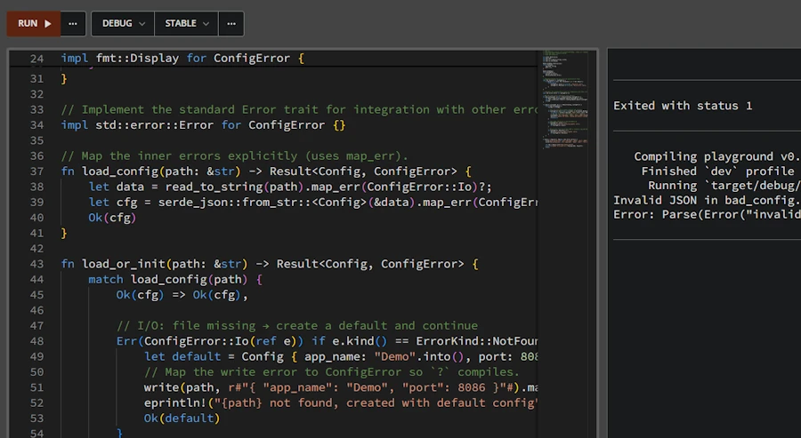<br/>
<span>Click the image to zoom in</span>
</div>


```rust
// ex17.rs
use serde::Deserialize;
use std::fmt;
use std::fs::{read_to_string, write};
use std::io::ErrorKind;

#[derive(Debug, Deserialize)]
struct Config {
    app_name: String,
    port: u16,
}

#[derive(Debug)]
enum ConfigError {
    Io(std::io::Error),
    Parse(serde_json::Error),
}

impl fmt::Display for ConfigError {
    fn fmt(&self, f: &mut fmt::Formatter<'_>) -> fmt::Result {
        match self {
            ConfigError::Io(e) => write!(f, "I/O error: {e}"),
            ConfigError::Parse(e) => write!(f, "Parse error: {e}"),
        }
    }
}

impl std::error::Error for ConfigError {}

fn load_config(path: &str) -> Result<Config, ConfigError> {
    let data = read_to_string(path).map_err(ConfigError::Io)?;
    let cfg = serde_json::from_str::<Config>(&data).map_err(ConfigError::Parse)?;
    Ok(cfg)
}

fn load_or_init(path: &str) -> Result<Config, ConfigError> {
    match load_config(path) {
        Ok(cfg) => Ok(cfg),

        Err(ConfigError::Io(ref e)) if e.kind() == ErrorKind::NotFound => {
            let default = Config { app_name: "Demo".into(), port: 8086 };
            // Map the write error to ConfigError so `?` compiles.
            write(path, r#"{ "app_name": "Demo", "port": 8086 }"#).map_err(ConfigError::Io)?;
            eprintln!("{path} not found, created with default config");
            Ok(default)
        }

        Err(ConfigError::Io(e)) => {
            eprintln!("I/O error accessing {path}: {e}");
            Err(ConfigError::Io(e))
        }

        Err(ConfigError::Parse(e)) => {
            eprintln!("Invalid JSON in {path}: {e}");
            Err(ConfigError::Parse(e))
        }
    }
}

fn main() -> Result<(), Box<dyn std::error::Error>> {
    write("good_config.json", r#"{ "app_name": "Demo", "port": 8080 }"#)?;
    write("bad_config.json", r#"{ "app_name": "Oops", "port": "not a number" }"#)?;

    let cfg = load_or_init("bad_config.json")?;
    println!("Loaded: {} on port {}", cfg.app_name, cfg.port);
    Ok(())
}
```


**Alice:** Got it. So if I have a module that does some operation, I should define an error type in that module representing things that can go wrong there, and use `?` to convert sub-errors into it, then bubble up to `main()`. That way, `main()` just sees my module’s error type (or I convert it further to something else or to `Box<dyn Error>` at the final boundary).

**Bob:** Exactly. Let’s do a quick mini-example of propagating an error from a module to `main()`. Suppose we have a module `math_utils` with a function that can fail:


```rust
// ex19.rs
mod math_utils {
    // This module could be in a file math_utils.rs
    #[derive(Debug)]
    pub enum MathError {
        DivisionByZero { numerator: f64 },
        NegativeLogarithm { value: f64 },
    }

    impl std::fmt::Display for MathError {
        fn fmt(&self, f: &mut std::fmt::Formatter<'_>) -> std::fmt::Result {
            match self {
                MathError::DivisionByZero { numerator } => write!(f, "Cannot divide {} by zero", numerator),
                MathError::NegativeLogarithm { value } => write!(f, "Logarithm of negative number ({})", value),
            }
        }
    }

    impl std::error::Error for MathError {}

    // Functions that return Result<_, MathError>
    pub fn divide(a: f64, b: f64) -> Result<f64, MathError> {
        if b == f64::EPSILON { Err(MathError::DivisionByZero { numerator: a }) } else { Ok(a / b) }
    }

    pub fn log10(x: f64) -> Result<f64, MathError> {
        if x < 0.0 { Err(MathError::NegativeLogarithm { value: x }) } else { Ok(x.log10()) }
    }
}

use math_utils::{divide, log10};
type Result<T> = std::result::Result<T, Box<dyn std::error::Error>>;

fn run() -> Result<()> {
    let my_log = log10(1024.0)?;
    println!("Log10 is {:.3}", my_log);

    let ratio = divide(10.0, 3.0)?;
    println!("Ratio is {:.3}", ratio);

    let bad_ratio = divide(5.0, 0.0)?;
    println!("This won't print because of error above ({})", bad_ratio);
    
    Ok(())
}

fn main() -> Result<()> {
    if let Err(e) = run() {
        eprintln!("Error: {}", e);
        std::process::exit(42);
    }
    Ok(())
}
```

Expected output:

```
Log10 is 3.010
Ratio is 3.333
Error: Cannot divide 5 by zero
error: process didn't exit successfully: `target\debug\examples\ex19.exe` (exit code: 42)
```

If we run this :
* `main()` calls the `run()` function
* There is no problem with `log10()`
* There is no problem with the first `divide()`
* The second `divide()` returns an `Err(MathError::DivisionByZero)` and the `?` bubbles up the error to the caller
* The `println!()` with `bad_ratio` is never executed 
* Back in `main()`, "Ooops, division by zero" is printed, thanks to `Display` implementation for `MathError`   
* Just for the fun, at this point, we return 42 and exit.


We could also catch the error in `main` with a `match` instead, and print something custom. But the point was to illustrate bubbling the error from a module up to `main()`. The key was to define `MathError` and to use it consistently. Each function in the module returns `MathError` on failure, and `run()` and `main()` can deal with `MathError`.


**Alice:** I think I have a much better understanding error handling in Rust now. Thanks.  

**Bob:** It’s a lot to take in at first, but once we get comfortable, we appreciate how Rust’s approach makes us think about errors up front. No more runtime surprises from unhandled exceptions. We decide what to do in each case. And keep in mind, for larger projects, there are crates like `thiserror` to reduce error boilerplate, and `anyhow` for quick-and-easy error handling in applications. Those can be handy, but the fundamentals of `Result<T, E>` and `?` we covered are the building blocks of it all.


### Summary – Custom Errors

* **Custom error types:** We can define our own error type (often an `enum` because our error can only have a value at a time) to represent errors in our application or library. This allows us to consolidate different error sources (IO, parsing, etc.) into one type and make our functions return that. It improves API clarity. Callers deal with one error type and can match on its variants.  

* **Implementing Error trait:** By implementing `std::error::Error` (which means implementing `fmt::Display` and having `#[derive(Debug)]`), our error type becomes interoperable with the standard ecosystem. It lets us use trait objects (`Box<dyn Error>`) if needed and makes our errors printable and convertible.  

* **Converting errors:** We use pattern matching or helper methods like `.map_err()` or the `From` trait implementations to convert underlying errors into our custom error variants. The `?` operator automatically convert errors if our custom error type implements `From` for the error thrown inside the function. This reduces a lot of manual code in propagating errors upward.  

    * Suppose we have an error `enum` `ConfigError { Io(io::Error), Parse(ParseError) }`. If a function reading a config file encounters an `io::Error`, we can do `.map_err(ConfigError::Io)?` to turn it into our error type and return it. The same for parse errors. Now the function returns `Result<Config, ConfigError>`, and the caller only has to handle `ConfigError`.  

* **Using `Box<dyn Error>`:** In application code, if we don’t want to define lots of error types, we can use `Box<dyn Error>` as a catch-all error type (since most errors in std lib implement `Error`). For example, `fn main() -> Result<(), Box<dyn std::error::Error>>` allows us to use `?` with any error that implements `Error` and just propagate it. This is convenient, but in library code you’d usually favor a concrete error type so that the API is self-documented.  


### Exercises – Custom Errors
1. **Define and Use a Custom Error:** Create an enum `MyError` with variants for two different error scenarios (for example, `MyError::EmptyInput` and `MyError::BadFormat(std::num::ParseIntError)`). Implement `std::fmt::Display` for `MyError` to provide human-readable messages. Then write a function `parse_nonempty_int(s: &str) -> Result<i32, MyError>` that returns an error if the input string is empty (`EmptyInput`) or if parsing to int fails (`BadFormat`). Use `?` and appropriate conversions (`map_err`) inside the function. Test it with various inputs (empty string, non-numeric, numeric).  

2. **Combine Two Error Types:** Suppose we have two functions `fn get_data() -> Result<String, io::Error>` and `fn parse_data(data: &str) -> Result<Data, ParseError>`. Write a new function `fn load_data() -> Result<Data, LoadError>` where `LoadError` is our custom enum that has variants for IO and Parse errors. In `load_data`, call `get_data()` and `parse_data()` using `?`, converting their errors into `LoadError` (we can implement `From<io::Error>` and `From<ParseError>` for `LoadError` or use `map_err`). Then try using `load_data()` in a `main` that prints different messages depending on which error occurred (hint: use `match e { LoadError::Io(e) => ..., LoadError::Parse(e) => ... }`).  

3. **Error Propagation in Modules:** Organize a small project with two modules: `network` and `database`. In `network`, create a function `fetch_data()` that might return a network-related error (we can simulate by just returning an `Err` variant like `NetworkError::Offline`). In `database`, create a function `save_data()` that might return a DB-related error (e.g., `DbError::ConnectionLost`). Then in `main`, write a function `run()` that calls `fetch_data` then `save_data`, propagating errors using `?`. Define a combined error type (enum with `Network(NetworkError), Database(DbError)`) to unify them for `run()`. Have `main` call `run()` and handle the unified error. This exercise will give we practice in designing error types and propagating across module boundaries.


<!-- ###################################################################### -->
<!-- ###################################################################### -->
<!-- ###################################################################### -->


## When and Why to Use `anyhow` and `thiserror` crates


**Alice:** You mentioned external crates like `anyhow` and `thiserror`. When should I reach for them?

**Bob:** Short version:  
- **`anyhow`** in **binaries** when we don’t need a public, fine-grained error type and just want easy error propagation with context.
- **`thiserror`** in **libraries** when we need ergonomic custom error types without writing all `impl` for `Display`, `Error`, and conversions.  


### anyhow - binaries (mnemonic: A, B, C...**A**nyhow, **B**inaries)

[`anyhow`](https://docs.rs/anyhow/latest/anyhow/) provides a type called `anyhow::Error` which is a dynamic error type (like `Box<dyn Error>` but with some extras such as easy context via `.context(...)`). It’s great for applications where we just want to bubble errors up to `main()`, print a nice message with context, and exit. Here is an example:

```rust
// ex20.rs
use anyhow::{Context, Result};
use std::fs;

// Result alias = Result<T, anyhow::Error>
fn run() -> Result<()> {
    let data = fs::read_to_string("config.json").context("While reading config.json")?; // adds context if it fails
    let cfg: serde_json::Value = serde_json::from_str(&data).context("While parsing JSON")?;
    println!("Config loaded: {cfg}");
    Ok(())
}

fn main() -> Result<()> {
    run()
}
```

Expected output:

```
Error: While reading config.json

Caused by:
    Le fichier spécifié est introuvable. (os error 2)
```

* Notice how adding `.context(...)` makes error messages much more actionable if something fails.
* Otherwise, the key point to understand the previous code is to realize that `Result` is a type alias for `Result<T, anyhow::Error>`.


**Alice:** OK... But could you show me how we should modify one of the previous code, you know, the one where we were reading JSON config file.

**Bob:** Ah, yes, you're right. Let's rework `ex17.rs` to see the impact and benefices. Tadaa!:

```rust
// ex21.rs
use anyhow::{Context, Result};
use serde::Deserialize;
use std::fs::{read_to_string, write};
use std::io::{self, ErrorKind};

#[derive(Debug, Deserialize)]
struct Config {
    app_name: String,
    port: u16,
}

fn load_config(path: &str) -> Result<Config> {
    let data = read_to_string(path).with_context(|| format!("failed to read config file: {path}"))?;
    let cfg = serde_json::from_str::<Config>(&data).with_context(|| format!("failed to parse JSON in: {path}"))?;
    Ok(cfg)
}

fn load_or_init(path: &str) -> Result<Config> {
    match load_config(path) {
        Ok(cfg) => Ok(cfg),
        Err(err) => {
            if let Some(ioe) = err.downcast_ref::<io::Error>() {
                if ioe.kind() == ErrorKind::NotFound {
                    let default = Config { app_name: "Demo".into(), port: 8086 };
                    let default_json = r#"{ "app_name": "Demo", "port": 8086 }"#;
                    write(path, default_json).with_context(|| format!("failed to write default config to {path}"))?;
                    eprintln!("{path} not found, created with default config");
                    return Ok(default);
                } else {
                    eprintln!("I/O error accessing {path}: {ioe}");
                    return Err(err);
                }
            }
            if let Some(parsee) = err.downcast_ref::<serde_json::Error>() {
                eprintln!("Invalid JSON in {path}: {parsee}");
                return Err(err);
            }
            Err(err)
        }
    }
}

fn main() -> Result<()> {
    write("good_config.json", r#"{ "app_name": "Demo", "port": 8080 }"#).context("writing good_config.json")?;
    write("bad_config.json", r#"{ "app_name": "Oops", "port": "not a number" }"#).context("writing bad_config.json")?;

    let cfg = load_or_init("bad_config.json")?;
    println!("Loaded: {} on port {}", cfg.app_name, cfg.port);
    Ok(())
}
```

Expected output of the `ex21.rs` with ``bad_config.json``: 

```
Invalid JSON in bad_config.json: invalid type: string "not a number", expected u16 at line 1 column 44
Error: failed to parse JSON in: bad_config.json

Caused by:
    invalid type: string "not a number", expected u16 at line 1 column 44
error: process didn't exit successfully: `target\debug\examples\ex21.exe` (exit code: 1)
```


In VSCode, open `ex21.rs` and `ex17.rs` side by side and compare both contents. If you do so and rearrange the source code layout, here is what you should see:

<div align="center">
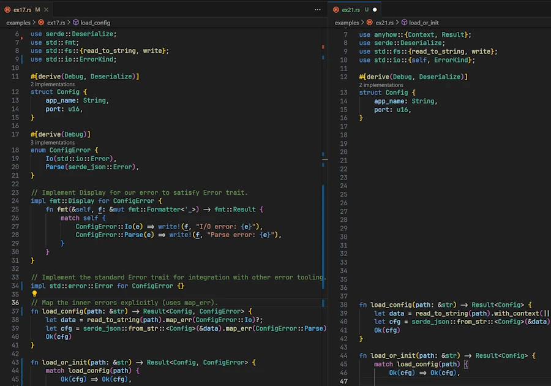<br/>
<span>ex17.rs on lhs, ex21.rs on rhs</span>
</div>

* `ex21.rs` is shorter but this is not the point. 
* `ConfigError` and its implementations has disappear because it is no longer needed. 
* Pay attention to `.with_context()` in `load_or_init()`. 
    * It is similar to `.context()` and the string literals. 
    * It takes a closure that returns a String. 
    * It is used here to dynamically `format!()` string with the value of a variable (`path`).
* Also note how the `.context(...)` in `main()` makes error messages much more actionable. 

This is typically what we need in binaries. Ok, let's read the code:

* In the initial version `ex17.rs` we had `fn load_config(path: &str) -> Result<Config, ConfigError> {...}`
* Now we have `fn load_or_init(path: &str) -> Result<Config> {...}` where `Result` is a type alias so that the signature should be read as `fn load_config(path: &str) -> std::result::Result<Config, anyhow::Error>`
* `anyhow` implement `From<E>` for all `E` that implement `std::error::Error + Send + Sync + 'static`
* If any error happen during `read_to_string()` then the `?` operator converts the error from `std::io::Error` to `anyhow::Error` (idem for `serde_json::Error` from `serde_json::from_str`) 


Now the tricky part is in `load_or_init()`:

* Its signature should be read as `fn load_or_init(path: &str) -> Result<Config, , anyhow::Error>`
* On error, we must downcast the `anyhow::Error` and check if it is an `io::Error`. If it is the case we check if it is an `ErrorKind::NotFound`...
* This is not really fun, I agree. 
* In fact I wanted to keep the logic of `load_or_init()` the same. Since it now receives  `Result<Config, , anyhow::Error>` and not a `Result<Config, ConfigError>` we have some work to do to retrieve the 3 kinds of error (not found, access, invalid json).
* Concerning `main()` except the signature there is no change.


For libraries, we should avoid `anyhow::Error` in our public API and prefer a concrete error type (possibly made with `thiserror`) so that downstream users can `match` on variants. Let's talk about it now.


### thiserror - libraries

[`thiserror`](https://docs.rs/thiserror/latest/thiserror/) is a derive macro crate. Instead of manually implementing by hand `Display` and `Error` and writing `From` conversions (remember `Debug` comes with the directive `#[derive(Debug)]`), we can do something concise like:


```rust
use thiserror::Error;

#[derive(Debug, Error)]
pub enum ConfigError {
    #[error("IO error: {0}")]
    Io(#[from] std::io::Error),   // #[from] automatically implements From
    
    #[error("JSON parse error: {0}")]
    Json(#[from] serde_json::Error),
}
```

Now our `load_config` function can just use the `?` operator and the `#[from]` converts sub-errors automatically. This is excellent for libraries, where we want to expose a stable and descriptive error type to users.


**Alice:** I really don't like code snippet. I like to see all the code. I remember `ex17.rs` was a standalone binary. Could you show me, step by step, how you would split it as a library serving a binary.

**Bob:** Great idea. It is a good opportunity to see code refactoring in practice. Since you want to see all the code, I'll need some space but this should not be a problem here. 

First, let's review `ex17.rs`:

```rust
// ex17.rs
use serde::Deserialize;
use std::fmt;
use std::fs::{read_to_string, write};
use std::io::ErrorKind;

#[derive(Debug, Deserialize)]
struct Config {
    app_name: String,
    port: u16,
}

#[derive(Debug)]
enum ConfigError {
    Io(std::io::Error),
    Parse(serde_json::Error),
}

impl fmt::Display for ConfigError {
    fn fmt(&self, f: &mut fmt::Formatter<'_>) -> fmt::Result {
        match self {
            ConfigError::Io(e) => write!(f, "I/O error: {e}"),
            ConfigError::Parse(e) => write!(f, "Parse error: {e}"),
        }
    }
}

impl std::error::Error for ConfigError {}

fn load_config(path: &str) -> Result<Config, ConfigError> {
    let data = read_to_string(path).map_err(ConfigError::Io)?;
    let cfg = serde_json::from_str::<Config>(&data).map_err(ConfigError::Parse)?;
    Ok(cfg)
}

fn load_or_init(path: &str) -> Result<Config, ConfigError> {
    match load_config(path) {
        Ok(cfg) => Ok(cfg),

        Err(ConfigError::Io(ref e)) if e.kind() == ErrorKind::NotFound => {
            let default = Config { app_name: "Demo".into(), port: 8086 };
            write(path, r#"{ "app_name": "Demo", "port": 8086 }"#).map_err(ConfigError::Io)?;
            eprintln!("{path} not found, created with default config");
            Ok(default)
        }

        Err(ConfigError::Io(e)) => {
            eprintln!("I/O error accessing {path}: {e}");
            Err(ConfigError::Io(e))
        }

        Err(ConfigError::Parse(e)) => {
            eprintln!("Invalid JSON in {path}: {e}");
            Err(ConfigError::Parse(e))
        }
    }
}

fn main() -> Result<(), Box<dyn std::error::Error>> {
    write("good_config.json", r#"{ "app_name": "Demo", "port": 8080 }"#)?;
    write("bad_config.json", r#"{ "app_name": "Oops", "port": "not a number" }"#)?;

    let cfg = load_or_init("bad_config.json")?;
    println!("Loaded: {} on port {}", cfg.app_name, cfg.port);
    Ok(())
}
```

Here is the content of the terminal

```
Invalid JSON in bad_config.json: invalid type: string "not a number", expected u16 at line 1 column 44
Error: Parse(Error("invalid type: string \"not a number\", expected u16", line: 1, column: 44))
error: process didn't exit successfully: `target\debug\examples\ex17.exe` (exit code: 1)
```


As you say, it is a standalone, all-included, kind of binary. So, as a first step, let's split it into a library and a binary. For demo purpose, we can do this with a single file. In `ex22.rs` (see below) we just define a module inside the source code. If needed, review what we did in `ex19.rs` (the code with `log10()`, do you remember?, September?).

<div align="center">
<iframe width="560" height="315" src="https://www.youtube.com/embed/D5XmUnYW5Ks?si=pqdrPrKvEFD3phoV" title="YouTube video player" frameborder="0" allow="accelerometer; autoplay; clipboard-write; encrypted-media; gyroscope; picture-in-picture; web-share" referrerpolicy="strict-origin-when-cross-origin" allowfullscreen></iframe>
</div>

Here is the code after the first step of refactorization:

```rust
// ex22.rs
mod my_api {
    use serde::Deserialize;
    use std::fmt;
    use std::fs::{read_to_string, write};
    use std::io::ErrorKind;

    #[derive(Debug, Deserialize)]
    pub struct Config {
        pub app_name: String,
        pub port: u16,
    }

    #[derive(Debug)]
    pub enum ConfigError {
        Io(std::io::Error),
        Parse(serde_json::Error),
    }

    impl fmt::Display for ConfigError {
        fn fmt(&self, f: &mut fmt::Formatter<'_>) -> fmt::Result {
            match self {
                ConfigError::Io(e) => write!(f, "I/O error: {e}"),
                ConfigError::Parse(e) => write!(f, "Parse error: {e}"),
            }
        }
    }

    impl std::error::Error for ConfigError {}

    fn load_config(path: &str) -> Result<Config, ConfigError> {
        let data = read_to_string(path).map_err(ConfigError::Io)?;
        let cfg = serde_json::from_str::<Config>(&data).map_err(ConfigError::Parse)?;
        Ok(cfg)
    }

    pub fn load_or_init(path: &str) -> Result<Config, ConfigError> {
        match load_config(path) {
            Ok(cfg) => Ok(cfg),

            Err(ConfigError::Io(ref e)) if e.kind() == ErrorKind::NotFound => {
                let default = Config { app_name: "Demo".into(), port: 8086 };
                write(path, r#"{ "app_name": "Demo", "port": 8086 }"#).map_err(ConfigError::Io)?;
                eprintln!("{path} not found, created with default config");
                Ok(default)
            }

            Err(ConfigError::Io(e)) => {
                eprintln!("I/O error accessing {path}: {e}");
                Err(ConfigError::Io(e))
            }

            Err(ConfigError::Parse(e)) => {
                eprintln!("Invalid JSON in {path}: {e}");
                Err(ConfigError::Parse(e))
            }
        }
    }
}

use my_api::load_or_init;
use std::fs::write;

fn main() -> Result<(), Box<dyn std::error::Error>> {
    write("good_config.json", r#"{ "app_name": "Demo", "port": 8080 }"#)?;
    write("bad_config.json", r#"{ "app_name": "Oops", "port": "not a number" }"#)?;

    let cfg = load_or_init("bad_config.json")?;
    println!("Loaded: {} on port {}", cfg.app_name, cfg.port);
    Ok(())
}
```

Hopefully the output is exactly the same:

```
Invalid JSON in bad_config.json: invalid type: string "not a number", expected u16 at line 1 column 44
Error: Parse(Error("invalid type: string \"not a number\", expected u16", line: 1, column: 44))
error: process didn't exit successfully: `target\debug\examples\ex22.exe` (exit code: 1)
```


Now, concerning the refactoring we can observe: 

* Obviously we now have a `mod my_api` at the top of the code
* Think about it as "a file in a file". This is not true but this can help. 
* The `use my_api::load_or_init;` statement is a "shortcut" that helps to write `load_or_init("bad_config.json")` rather than `my_api::load_or_init("bad_config.json")`.


{: .note-title }
> Side Note
>
> If you don't feel 100% confident with modules, crates, files... You can [read this post]()


* `ConfigError` is now public because it is part of `load_or_init()` which is public


In this first step of the refactoring the main idea was to split the code in 2: 
* `my_api` module on one end 
* and a consumer of the API on the other. 

Now that we have our library crate set up, let's explore how to make use of the `thiserror` crate.  So now, we refactor `ex22.rs` into `ex24.rs`. Here it is:

```rust
// ex24.rs
mod my_api {
    use serde::Deserialize;
    use std::fs::{read_to_string, write};
    use std::io::ErrorKind;
    use thiserror::Error;

    type Result<T> = std::result::Result<T, ConfigError>;

    #[derive(Debug, Deserialize)]
    pub struct Config {
        pub app_name: String,
        pub port: u16,
    }

    #[derive(Debug, Error)]
    pub enum ConfigError {
        #[error("I/O error: {0}")]
        Io(#[from] std::io::Error),

        #[error("JSON parse error: {0}")]
        Parse(#[from] serde_json::Error),
    }

    fn load_config(path: &str) -> Result<Config> {
        let data = read_to_string(path).map_err(ConfigError::Io)?;
        let cfg = serde_json::from_str::<Config>(&data).map_err(ConfigError::Parse)?;
        Ok(cfg)
    }

    pub fn load_or_init(path: &str) -> Result<Config> {
        match load_config(path) {
            Ok(cfg) => Ok(cfg),

            Err(ConfigError::Io(ref e)) if e.kind() == ErrorKind::NotFound => {
                let default = Config { app_name: "Demo".into(), port: 8086 };
                write(path, r#"{ "app_name": "Demo", "port": 8086 }"#)?;
                eprintln!("{path} not found, created with default config");
                Ok(default)
            }

            Err(ConfigError::Io(e)) => {
                eprintln!("I/O error accessing {path}: {e}");
                Err(ConfigError::Io(e))
            }

            Err(ConfigError::Parse(e)) => {
                eprintln!("Invalid JSON in {path}: {e}");
                Err(ConfigError::Parse(e))
            }
        }
    }
}

use my_api::load_or_init;
use std::fs::write;
type Result<T> = std::result::Result<T, Box<dyn std::error::Error>>;

fn main() -> Result<()> {
    write("good_config.json", r#"{ "app_name": "Demo", "port": 8080 }"#)?;
    write("bad_config.json", r#"{ "app_name": "Oops", "port": "not a number" }"#)?;

    let cfg = load_or_init("bad_config.json")?;
    println!("Loaded: {} on port {}", cfg.app_name, cfg.port);
    Ok(())
}
```

* The code of the client (`main()`) remains unchanged.
* Changes occurs in the API and the biggest one is in `ConfigError` `enum` definition.

```rust
    #[derive(Debug, Error)]
    pub enum ConfigError {
        #[error("I/O error: {0}")]
        Io(#[from] std::io::Error),

        #[error("JSON parse error: {0}")]
        Parse(#[from] serde_json::Error),
    }
```
* The directive `#[error...` and `#[from...` make the macro generates concrete implementations at compile time, and then the `?` in `load_config()` uses those implementations via static conversions.
* This is why we no longer need the `impl fmt::Display for ConfigError{...}` nor the `impl Error for ConfigError {}`.  
* The signature of `load_config()` can be simplified 
* Idem for the signature of `load_or_init()`. In addition the `map_err()` can be removed.

At the end we have an API and a consumer. In the API, we delegate to `thiserror` the writing of the implementations. I hope your understand the refactoring process that bring us from `ex17.rs` to `ex24.rs` one step after the other. I hope you enjoyed to read complete code at each step.  


### Summary – `anyhow` & `thiserror`

* **`anyhow`**: Binaries. Dynamic error type with great ergonomics and `.context(...)` for adding messages. Best for applications where we just want to bubble errors up and print them, not pattern-`match` on them.  

```rust
use anyhow::{Context, Result};
use std::fs;

fn run() -> Result<String> {
    let data = fs::read_to_string("Cargo.toml").context("while reading Cargo.toml")?; 
    Ok(data)
}

fn main() -> Result<()> {
    let data = run()?;
    println!("Config loaded: {}", data);
    Ok(())
}
```

* **`thiserror`**: Libraries. Derive-based crate to build clear, typed error enums with minimal boilerplate. Best for libraries and public APIs where the caller needs to inspect error kinds.  

```rust
use thiserror::Error;

#[derive(Debug, Error)]
enum ConfigError {
    #[error("I/O error: {0}")]
    Io(#[from] std::io::Error),
}

fn load(path: &str) -> Result<String, ConfigError> {
    Ok(std::fs::read_to_string(path)?) // auto-converts into ConfigError::Io
}

fn main() -> Result<(), ConfigError> {
    let content = load("Cargo.toml")?;
    println!("Loaded: {}", content);
    Ok(())
}
```

* **Don’t mix them blindly**: We can use both in the same project (e.g., library crates with `thiserror` exposed, binary crate using `anyhow` internally), but try to keep public APIs typed and internal app code ergonomic.


### Exercises – `anyhow` & `thiserror` 
1. Can you explain why in the API of `ex24.rs` we found `type Result<T> = std::result::Result<T, ConfigError>;` while in the client's code we have `type Result<T> = std::result::Result<T, Box<dyn std::error::Error>>;`  

1. **Refactor to `thiserror`:** Take our custom error enum from the previous exercise and replace the manual `Display`/`Error` implementations with a `#[derive(Error)]` and `#[error(...)]` attributes from `thiserror`. If we had conversions from `io::Error` or `serde_json::Error`, add `#[from]` to those variants and remove our manual `From` impls.  

1. **Add Context with `anyhow`:** Write a small binary that reads a file and parses JSON, returning `anyhow::Result<()>`. Add `.context(reading file)` and `.context(parsing JSON)` to the respective fallible operations. Run it with a missing file and with invalid JSON to see the difference in error messages with the added context.  

1. **Design Choice:** Given a project that has both a library crate (`my_lib`) and a binary crate (`my_cli`) in a Cargo workspace, decide how we would structure error handling across both. Hint: `my_lib` exposes typed errors with `thiserror`, while `my_cli` depends on `my_lib` and uses `anyhow` in `main` to convert `my_lib::Error` into `anyhow::Error` using `?` and print user-friendly messages.


<!-- ###################################################################### -->
<!-- ###################################################################### -->
<!-- ###################################################################### -->

## Errors from Experimentation to Production

**Alice:** ...

**Bob:** ...

### Key Concepts
* [Gall’s law](#galls-law)
* The fewer the better
* The sooner the better
* ...

<!-- 
* A complex system that works is invariably found to have evolved from a simple system that worked.
* A complex system designed from scratch never works and cannot be patched up to make it work. You have to start over with a working simple system. 
-->

* Errors management must be able to scale while we transition from Experimentation to Production
    * From `?` in experimentation
    * To Custom Error Type in production

### Experimentation

### Production


### Summary – Experimentation to Production

* **`derive_more`:** ...  
* **...:** ...  


### Exercises – Experimentation to Production 

1. ...
1. ...


<!-- ###################################################################### -->
<!-- ###################################################################### -->
<!-- ###################################################################### -->

## Conclusion


<!-- ###################################################################### -->
<!-- ###################################################################### -->
<!-- ###################################################################### -->

## Webliography
* [THE book](https://doc.rust-lang.org/book/ch09-00-error-handling.html)
