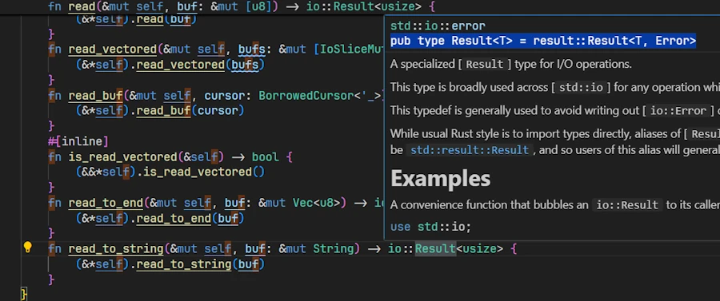

<!-- 
TODO :
* ???
-->


# Rust Errors, Without the Drama
{: .no_toc }

A beginner-friendly conversation on Errors, Results, Options, and beyond.
{: .lead }


<h2 align="center">
<span style="color:orange"><b>This post is under construction.</b></span>    
</h2>

<!-- ### This is Episode 00
{: .no_toc } -->


## TL;DR
{: .no_toc }

* For beginners.

* The code is on GitHub.

* **Rust has no exceptions:** It distinguishes 
    * **recoverable** errors (handled with the `Result<T, E>` type) 
    * **unrecoverable** errors (handled by panicking using `panic!()`) [1](https://doc.rust-lang.org/book/ch09-00-error-handling.html#:~:text=Most%20languages%20don%E2%80%99t%20distinguish%20between,an%20error%20or%20to%20stop). 

    This means we must explicitly handle errors [2](https://doc.rust-lang.org/book/ch09-00-error-handling.html#:~:text=Errors%20are%20a%20fact%20of,deploying%20your%20code%20to%20production).

* **`Result<T, E>` enum:**  Represents either success (`Ok(T)`) or error (`Err(E)`). Use pattern matching ( `match` expression), or methods like `.unwrap()/.expect()` (which `panic!()` on error) to handle these. Prefer `.expect()` with a custom message [3](https://doc.rust-lang.org/book/ch09-02-recoverable-errors-with-result.html#:~:text=In%20production,information%20to%20use%20in%20debugging)

* **`?` operator for propagation:**  To propagate errors upwards without heavy syntax, use the `?` operator. It returns the error to the caller if an operation fails. Only works in functions returning a compatible `Result<T, E>` (or `Option<T>` ). The `main()` function can return a `Result<T, E>` and use `?` 

* **`Option<T>` vs `Result<T, E>`:**  
    * Use **`Option<T>`** when the absence of a value isn’t an error (e.g.[exempli gratia], no search result) and no error info is needed. 
    * Use **`Result<T, E>`** when an operation can fail in an exceptional way and we need to convey an error message or reason [5](https://users.rust-lang.org/t/option-vs-results/113549). 
    <!-- [6](https://users.rust-lang.org/t/option-vs-results/113549#:~:text=For%20example%2C%20an%20arbitrary%20error,function%20where%20the%20error%20occurred) -->

* **When to panic:** Reserve **`panic!()`** for truly unrecoverable bugs or invalid states (e.g. asserting [invariant]()). If failure is expected or possible in normal operation (e.g. file not found, invalid user input...), return a `Result<T, E>` instead [7](https://doc.rust-lang.org/book/ch09-03-to-panic-or-not-to-panic.html#:~:text=However%2C%20when%20failure%20is%20expected%2C,indicates%20that%20failure%20is%20an). Library code should avoid panicking on recoverable errors to let the caller decide how to handle them.

* **Custom error types:** As part of a sophisticated programs or libraries, define our own custom error types (often as `enums`) to represent various error kinds in one type. Implementing `std::error::Error` (via `Display` and `Debug` ) for these types or using `Box<dyn std::error::Error>` can help integrate with the `?` operator and allow different error kinds to propagate seamlessly [8](https://doc.rust-lang.org/book/ch09-02-recoverable-errors-with-result.html#:~:text=There%20is%20a%20difference%20between,fail%20for%20many%20different%20reasons)

* **Keep in mind**

```rust
use std::fs::File; // shortcut
use std::io::Read;

pub type Result<T> = std::result::Result<T, Error>; // alias
pub type Error = Box<dyn std::error::Error>;

fn main() -> Result<()> {
    let f = File::open("foo.txt")?;
    let mut data = vec![];
    f.File.read_to_end(&mut data)?;
    Ok(())
}
```

<div align="center">
<br/>
<span>Let's have a beginner-friendly conversation on Errors, Results, Options, and beyond.</span>
</div>


<!-- 
#### Posts 
{: .no_toc }

* [Episode 00]()
* [Episode 01]()
* [Episode 02]()
* [Episode 03]()
* [Episode 04]() 
-->


## Table of Contents
{: .no_toc .text-delta}
- TOC
{:toc}


<!-- ###################################################################### -->
<!-- ###################################################################### -->
<!-- ###################################################################### -->


## Why Alice and Bob are here?
A long time ago (2010, may be) I read a `.pdf` about the N-Body Simulations. Too bad, I can't find it on the web anymore, but here's a copy of [volume 1](). It was based on Ruby but it was great, easy to follow etc. One thing was that it was written as a conversation between **Bob** and **Alice**. Later the code was re-written in Python and the set of `.pdf` was merged into an expensive printed book (55$ when I bought my copy). Today (sept 2025) you can find it on [AMZN](https://www.amazon.fr/Moving-Planets-Around-Introduction-Exoplanetary/dp/0262539349) for 28€.

<div align="center">
<br/>
<span>Moving Planets Around</span>
</div>

Last week I start reading `The Basics of Bitcoins and Blockchains` ([link to AMZN](https://www.amazon.fr/dp/1642506737?ref=ppx_yo2ov_dt_b_fed_asin_title)). 

<div align="center">
<br/>
<span>The Basics of Bitcoins and Blockchains</span>
</div>


In Part 3, there is a section `Why Alice and Bob`. Believe it or not, I then discovered where [they came from](https://en.wikipedia.org/wiki/Alice_and_Bob). 

I like to write in a conversational tone, so let's imagine a discussion between Bob and Alice and let's see how it goes...


<!-- ###################################################################### -->
<!-- ###################################################################### -->
<!-- ###################################################################### -->

## Introduction: Why Rust Cares About Errors

**Alice:** I ran a Rust code snippet and it **forced** me to handle an error – it wouldn’t even compile until I did! What’s going here?

**Bob:** The compiler (`rustc`) makes sure we acknowledge and handle errors properly before our code even runs. This helps prevent crashes at runtime [2](https://doc.rust-lang.org/book/ch09-00-error-handling.html#:~:text=Errors%20are%20a%20fact%20of,deploying%20your%20code%20to%20production).


**Alice:** There are no exceptions at all?

**Bob:** Exactly. Rust doesn’t have exceptions. Instead, it has a different model for errors. Essentially, Rust groups errors into two categories: **recoverable** and **unrecoverable** [9](https://doc.rust-lang.org/book/ch09-00-error-handling.html#:~:text=Rust%20groups%20errors%20into%20two,to%20immediately%20stop%20the%20program). 
* **Recoverable** errors are things we expect might happen and can be dealt with (like a file not found – we might just create the file or use a default). These are handled with the `Result<T, E>` type. 
* **Unrecoverable** errors are bugs on our side or unexpected conditions (like indexing past the end of an array – something’s really bad if that happens). For these cases Rust provides the `panic!()` macro to stop the program [1](https://doc.rust-lang.org/book/ch09-00-error-handling.html#:~:text=Most%20languages%20don%E2%80%99t%20distinguish%20between,an%20error%20or%20to%20stop).


**Alice:** So `Result<T, E>` is for errors I can handle, and `panic!()` is for the program-halting ones?

**Bob:** Yes! 
* Think of `Result<T, E>` as Rust’s way of saying "operation might succeed or fail". We then decide what to do if it fails.
* Whereas a `panic!()` is Rust saying "I can’t deal with this, I must crash now". 

By making error handling explicit with `Result`, Rust ensures we don’t just ignore errors. It won’t let us compile unless we either handle the `Result<T, E>` (e.g., check for an error) or explicitly choose to crash (like using `.unwrap()` which triggers a `panic!()` if there’s an error). This leads to more robust programs because we're less likely to have an error go unnoticed.


**Alice:** Um... This is may be a silly question but, if I know my function can succeed or fail, can it returns `Result<T, E>`.

**Bob:** Yes, absolutely! Even `main()` can return `Result<T, E>`. It is a very good practice. Before writing any code, ask yourselves "can this function fail? Should it return `Option<T>` or `Result<T, E>`?". Then work on the rest of the function or method signature.

<div align="center">
<iframe width="560" height="315" src="https://www.youtube.com/embed/nLSm3Haxz0I?si=k8Xtc_AofCBs3H_T" title="YouTube video player" frameborder="0" allow="accelerometer; autoplay; clipboard-write; encrypted-media; gyroscope; picture-in-picture; web-share" referrerpolicy="strict-origin-when-cross-origin" allowfullscreen></iframe>
</div>


**Alice:** It’s a bit scary that the program can just crash with `panic!()` though. 

**Bob:** Again, `panic!()` is for cases that are **not supposed to happen** like an invariant being broken. And even when a `panic!()` occurs, Rust will unwind the stack and cleanup (or we can opt to abort immediately). Most of the time, you’ll use `Result<T, E>` for possible errors and only `panic!()` on bugs that are your responsibility. We’ll talk more about choosing between them later [7](https://doc.rust-lang.org/book/ch09-03-to-panic-or-not-to-panic.html#:~:text=However%2C%20when%20failure%20is%20expected%2C,indicates%20that%20failure%20is%20an).


**Alice:** This is may be too early but how can I opt to abort immediately?

**Bob:** Your're right, it's too early but your wishes are my commands. In `Cargo.toml` add the following section:

```toml
[profile.release]
panic = "abort"
```
The default is `unwind`. With `abort` opted in:
* No cleanup: at the first panic, the program terminates immediately with an `abort()`.
* No destructor (Drop) is invoked.
* This reduces the binary size and the build time (fewer symbols to generate)


**Alice:** Ok... So Rust wants me to handle every error. This will be a pain... How do I actually do that with `Result<T, E>`? What does a `Result<T, E>` look like?

**Bob:** That's a good question. We'll answer it by examining how `Result<T, E>` works and how to use it, but before that, it's time to recap and practice a little.


### Summary – Introduction

* Rust requires we handle errors explicitly. Code that can fail must return a `Result<T, E>` (or `Option<T>`   ), forcing the caller to address the possibility of failure [2](https://doc.rust-lang.org/book/ch09-00-error-handling.html#:~:text=Errors%20are%20a%20fact%20of,deploying%20your%20code%20to%20production).
* Rust distinguishes 
    * **recoverable errors** (e.g. file not found, invalid input – handled with `Result`)
    * **unrecoverable errors** (bugs like out-of-bounds access – handled with `panic!()`) [9](https://doc.rust-lang.org/book/ch09-00-error-handling.html#:~:text=Rust%20groups%20errors%20into%20two,to%20immediately%20stop%20the%20program).
* No exceptions are used. This language design decision helps prevent unchecked errors. We either deal with the error or deliberately choose to `panic!()`/`.unwrap()`, making error handling clear in the code.


### Exercises – Introduction

1. **Identify Error Types:** Think of two scenarios in programming: 
    * one that would be a ***recoverable error*** 
    * one that would be an ***unrecoverable error***

    For each scenario, explain whether we would use Rust’s `Result<T, E>` or a `panic!()`, and why.

2. **Compile-time Check:** Write a Rust code that attempts to open a non-existent file with `std::fs::File::open(foo.txt)` without handling the returned `Result<T, E>`. Observe the compiler error or warning. Then, fix it by handling the `Result<T, E>` (for now, we can just use a simple `panic!()` or print an error message in case of `Err`). One can read [4](https://doc.rust-lang.org/book/ch09-02-recoverable-errors-with-result.html#:~:text=fn%20main%28%29%20,hello.txt)


### Optional - Setting Up our Development Environment 

Let's make sure we can Debug the code.

**Requirements:** I expect either the `CodeLLDB` extension or the `Build Tools for Visual Studio` to be installed. `CodeLLDB` might be faster and easier to install (it is "just" a VSCode extension). Both can be installed if you wish or need (this is my case). We will see how to use or the other.

I use VSCode under Windows 11 and I already wrote a post about [my setup](). I don't know yet if I will need more than one project accompanying this post. However, I already know the first project does'nt have `main.rs` file. Instead there are multiple short sample code in the `examples/` directory. This is fine but I want to make sure we can quickly modify, build, debug and go step by step in the source code. 

Now, having this in mind here is what I do and why.

* Get a copy of the project from GitHub
* Open `/examples/ex00.rs` in the VSCode editor

At the time of writing here is what I see :

<div align="center">
<br/>
<span>Click the image to zoom in</span>

</div>

* Just for testing purpose, delete the `target/` directory if it exists (at this point it should'nt exist yet)

* Press `CTRL+SHIFT+B`. This should build a debug version of the code
    * Check `target/debug/examples/`. It should contains `ex00.exe`
* Set the cursor on line 5 then press `F9` 
    * This set a breakpoint on line 5. See below:

<div align="center">

</div>


* Open de `Run & Debug` tab on the side (`CTRL+SHIFT+D`)
* In the list box, select the option corresponding to our configuration (LLDB or MSVC). See below:

<div align="center">

</div>


* Press `F5`
    * This starts the debug session
    * If needed the application is built (not the case here because it is already built) 
    * The execution stops on line 5. See below :

<div align="center">

</div>   

* Press `F10` to move forward
    * Line 5 is executed
    * On the left hand side, in the Local subset of variables, we can check that `bob` is now equal to 5. See below:

<div align="center">

</div>

* Press `F5` to continue and reach the end  of the code

Let's make a last test. Just to make sure...
* Delete the `target/` directory
    * Select it then press `DELETE`
* `exe00.rs` should still be open in the editor with a breakpoint set on line 5
* Press `F5`
    * The `ex00.exe` is built
    * The debug session starts
    * Execution stops on line 5 as before

**The making of:**

The secret ingredient lies in `./vscode/task.json` and `./vscode/launch.json`

**1. `.vscode/tasks.json`:**
```json
{
    "version": "2.0.0",
    "tasks": [
        {
            "label": "cargo-build-debug",
            "type": "cargo",
            "command": "build",
            "args": [
                "--example",
                "${fileBasenameNoExtension}",
            ],
            "problemMatcher": [
                "$rustc"
            ],
            "group": {
                "kind": "build",
                "isDefault": true
            }
        },
        {
            "label": "cargo-build-release",
            "type": "cargo",
            "command": "build",
            "args": [
                "--release",
                "--example",
                "${fileBasenameNoExtension}",

            ],
            "problemMatcher": [
                "$rustc"
            ]
        }
    ]
}
```
* In the first object of the array `tasks`, the key named `group` helps to make the task the one by default. This explains how and why `CTRL+SHIFT+B` worked. 
* Note that since the source code to compile is in the `examples/` directory, we pass `--example` and the name of the file (e.g. `ex00`) in the `args` array.
* To see the list of `tasks`, in VSCode, press `ALT+T` then press `R`
    * Below we can see both tasks : `cargo-build-debug` and `cargo-build-release`

<div align="center">

</div>

**2. `.vscode/launch.json`:**

```json
{
    "version": "0.2.0",
    "configurations": [
        {
            "type": "cppvsdbg",
            "request": "launch",
            "name": "Debug (MSVC)",
            "program": "${workspaceFolder}/target/debug/examples/${fileBasenameNoExtension}.exe",
            "args": [],
            "cwd": "${workspaceFolder}",
            "environment": [
                {
                    "name": "RUST_BACKTRACE",
                    "value": "short"
                }
            ],
            "preLaunchTask": "cargo-build-debug"
        },
        {
            "type": "cppvsdbg",
            "request": "launch",
            "name": "Release (MSVC)",
            "program": "${workspaceFolder}/target/release/examples/${fileBasenameNoExtension}.exe",
            "args": [],
            "cwd": "${workspaceFolder}",
            "environment": [
                {
                    "name": "RUST_BACKTRACE",
                    "value": "short"
                }
            ],
            "preLaunchTask": "cargo-build-release"
        },
        {
            "type": "lldb",
            "request": "launch",
            "name": "Debug (CodeLLDB)",
            "program": "${workspaceFolder}/target/debug/examples/${fileBasenameNoExtension}.exe",
            "args": [],
            "cwd": "${workspaceFolder}",
            "sourceLanguages": ["rust"],
            "preLaunchTask": "cargo-build-debug"
        }
    ]
}
```
* The path in the `program` key, points to the executable created at the end of the build (do you see `${fileBasenameNoExtension}`?)
* Note the `preLaunchTask` key. This explains why we can press F5 (debug) even if the executable is not yet built. In such case, the task `cargo-build-debug` is executed then the debug session starts.


### Solution to Exercice #2 above

Let's take some time and see how one could answer the second exercice. If I search "Rust open txt file" on Google, one of the links drive me to the excellent [Rust By Example](https://doc.rust-lang.org/rust-by-example/std_misc/file/open.html). See below :

<div align="center">
<br/>
<!-- <span>Optional comment</span> -->
</div>

This is great because on line 11 it uses `std::fs::File::open()` but it is a little bit too complex for me and it seems it handles errors while I want the compiler to complains then fix the errors.


Copy/paste/save the file as `ex01.rs`. To make sure the code works as expected I can press F5 or open a terminal then enter `cargo run --example ex01`. Here is what I see in the Debug Console once I pressed F5 :

<div align="center">
<br/>
<!-- <span>Optional comment</span> -->
</div>

The code cannot find `hello.txt` and `panic!()`.


Copy/paste/save the file as `ex02.rs`. From the previous code, I just keep what I need :

```rust
// ex02.rs
fn main() {
    let f = std::fs::File::open("foo.txt");
    println!("'f' after std::fs::File::open() =  {:?}", f);
}
```

Surprisingly if I press F5, it builds and runs in a debug session without complain.

```
------------------------------------------------------------------------------
You may only use the C/C++ Extension for Visual Studio Code with Visual Studio
Code, Visual Studio or Visual Studio for Mac software to help you develop and
test your applications.
------------------------------------------------------------------------------
ex02.exe (30708): Loaded 'C:\Users\phili\OneDrive\Documents\Programmation\rust\01_xp\018_err_for_blog_post\u_are_errors\target\debug\examples\ex02.exe'. Symbols loaded.
ex02.exe (30708): Loaded 'C:\Windows\System32\ntdll.dll'. 
ex02.exe (30708): Loaded 'C:\Windows\System32\kernel32.dll'. 
ex02.exe (30708): Loaded 'C:\Windows\System32\KernelBase.dll'. 
ex02.exe (30708): Loaded 'C:\Windows\System32\ucrtbase.dll'. 
ex02.exe (30708): Loaded 'C:\Windows\System32\vcruntime140.dll'. 
'f' after std::fs::File::open() =  Err(Os { code: 2, kind: NotFound, message: "Le fichier sp├®cifi├® est introuvable." })
ex02.exe (30708): Loaded 'C:\Windows\System32\kernel.appcore.dll'. 
ex02.exe (30708): Loaded 'C:\Windows\System32\msvcrt.dll'. 
The program '[30708] ex02.exe' has exited with code 0 (0x0).
```

In fact, with my setup, if I press `CTRL+ALT` I can reveal the datatype.

<div align="center">
<br/>
<!-- <span>Optional comment</span> -->
</div>

`f` is a `Result<File, Error>`. It is a `Result<T, E>` but what happens, is that when I asked to print it with `{:?}`, Rust displays the content of the `Result<T, E>` and this is why we can see :

```
'f' after std::fs::File::open() =  Err(Os { code: 2, kind: NotFound, message: "Le fichier sp├®cifi├® est introuvable." })
```

In fact despite ourselves, we cheat. We call a function returning `Result<T, E>` in a context that expects a file `f` without using it (e.g. trying to read something).


Copy/paste/save the file as `ex03.rs`. Let's make sure the build system complain. Modify the previous code with the one below :

```rust
// ex03.rs
fn main() {
    let f: std::fs::File = std::fs::File::open("foo.txt");
    println!("{:?}", f);
}
```
On the lhs of the equal sign, I express my expectation. I expect a `std::fs::File`. Obviously this does not fly very well. We don't even need to try to build. Indeed, the red squiggles warn us and if we hover them with the cursor we get a clear explanation and some advises. See below : 

<div align="center">
<br/>
<!-- <span>Optional comment</span> -->
</div>


Copy/paste/save the file as `ex04.rs`. Let's find a solution. Modify the previous code with the one below :

```rust
// ex04.rs
use std::fs::File; 

fn main() {
    let result_file = File::open("foo.txt");

    match result_file {
        Ok(file) => println!("Successfully opened file: {:?}", file),
        Err(why) => panic!("Panic! opening the file: {:?}", why),
    }
}
```

* `result_file` is a `Result<T, E>`. It is NOT a `File`
* `match` is an expression. It is NOT a statement
    * If the difference between expression and statement is not crystal clear read this [page]() 
* The `match` expression forces us to handle all possible cases
* Set a break point on the line with `match` expression (F9)
* Press F5 and step forward with F10 


Copy/paste/save the file as `ex05.rs`. Let's take advantage of the fact that `match` is an expression. Modify the previous code with the one below :

```rust
// ex05.rs
use std::fs::File; // shortcut
use std::io::Read;

fn main() {
    let result_file = File::open("foo.txt");
    let mut bob = match result_file {
        Ok(alice) => alice,
        Err(why) => panic!("Panic! opening the file: {:?}", why),
    };
    println!("{:?}", bob);

    let mut s = String::new();
    match bob.read_to_string(&mut s) {
        Ok(_) => print!("Content:\n{}", s),
        Err(why) => panic!("Panic! reading the file: {:?}", why),
    }
}
```

<!-- * It is important to understand that `match` destructures the `Result<T, E>`. So the body of the first `match` says something like:
    * When the `Result<File, io::Error>` stored in `result_file` matches the pattern `Ok(alice)`, the inner `File` value is bound to the variable `alice`. Doing so `bob` receive the value of `alice`.
    * If the value of `result_file` matches `Err(why)`, bind the inner `File` to `alice` and use it
    * If `result_file` is `Ok(alice)` then return `alice` (a `File`). 
    * If `result_file` is `Err(why)` then do not return anything,  -->

**Note:** I know `bob` and `alice` are weird variable names in this context. I just want to make clear that `alice` exists only inside the body of `match` while `bob` exists outside the `match`. Remember from the Rust by Example we had **variable shadowing** on the `file` variable. We had: 

```rust
let mut file = match File::open(&path) {
    Err(why) => panic!("couldn't open {}: {}", display, why),
    Ok(file) => file,
};
```

* The outer `let mut file = …;` declares a new variable `file` in the current scope.
* Inside the `Ok(file)` match arm, the name `file` is a **pattern variable** that temporarily binds the `File` object contained in the `Ok` variant.
* That inner `file` shadows the outer one *just for the right-hand side of the assignment*.
* Once the match expression finishes evaluating, the *inner* `file` is moved out of the `Ok(file)` pattern and becomes the value assigned to the *outer* `file`.
* This is a case of variable shadowing.
* The `file` in the match pattern and the `file` bound by the `let` are two distinct variables with the same name, in different scopes.


This said, let's go back to the source code :

* As before, `std::fs::File::open()` returns a `Result<File, io::Error>`, which we store in `result_file`.
* Since `match` is an expression, it evaluates to a value, and with the first `match` we assign that value to `bob`.
* It is important to understand that `match` **destructures** the `Result<T, E>`. So that the body of the `match` can be read as:
    * If the `Result<File, io::Error>` in `result_file` matches the pattern `Ok(alice)`, then the inner `File` is bound to the variable `alice`, and that `File` is returned from the `match`. This means `bob` now owns the file handle.
    * If it matches `Err(why)`, the program calls `panic!`. The `panic!` macro has the special “never” type (`!`) which never resolve to any value at all. So this arm never returns. This allows the entire `match` expression to still have type `File`. This arm prints a short message then, "Don't press the red button on the joystick, abort! abort! abort!"


<div align="center">
<br/>
<span>Don't push the little button on the joystick</span>
</div>

Run the code (F5) to see it in `panic!()`

<div align="center">
<br/>
<!-- <span>Optional comment</span> -->
</div>

Now rename the file `foo.txt.bak` at the root of the project to `foo.txt` and run the code (F5)

<div align="center">
<br/>
<!-- <span>Optional comment</span> -->
</div>


* When the code doesn’t `panic!` on `open()`, we first `println!()` the `Debug` representation of `bob`.
* Then we call `read_to_string()` on `bob`. The method returns an `io::Result<usize>`, which is just a type alias for `Result<usize, io::Error>`. On success, the `usize` is the number of bytes read.
* In the second `match` we don’t care about this number, so we use `_` to ignore it. Instead, we just `println!()` the contents of the `String s`.
* On `Err`, the code calls `panic!` again, prints a message, and the program aborts.


***Um... And how do I know `io::Result<usize>` is a type alias for `Result<usize, io::Error>`?*** 

**Green Slope:**
1. Set the cursor on `read_to_string`
1. Press F12 (Go To Definition)
1. We can see the function signature : `fn read_to_string(&mut self, buf: &mut String) -> io::Result<usize>`
1. Hover `io::Result<usize>`
1. We get access to the type alias `pub type Result<T> = result::Result<T, Error>` 

<div align="center">
<br/>
<!-- <span>Optional comment</span> -->
</div>

**North Face:**
1. Open the [std web page](https://doc.rust-lang.org/std/index.html)
1. On the left, find the **Crates** section
1. Click on **std**
1. Look for and click on **io**
1. On the right, go down to the **Type Aliases** section
1. Click on **Result**
1. The page Type Alias Result page explains what is going on : `pub type Result<T> = Result<T, Error>;`


**K12**
1. Open the [std web page](https://doc.rust-lang.org/std/index.html)
1. On the left, find the **Crates** section
1. Click on **std**
1. Look for and click on **io**
1. On the right side, go down and find the **Traits** section
    * I know I must reach the **Traits** section and not the **Functions** section (where there is a `read_to_string`) 
    * Because at the top of the source code if I hover the line `use std::io::Read;` I'm told `Read` is a trait. 

<div align="center">
<br/>
<!-- <span>Optional comment</span> -->
</div>

6. Click on **Read**
1. At the top you see the function signature: `fn read_to_string(&mut self, buf: &mut String) -> Result<usize> { ... }`
1. At the very end click on `Result<usize>`
1. The page Type Alias Result page explains what is going on : `pub type Result<T> = Result<T, Error>;`


I know what you think. But we need to invest time in learning how to navigate and read the documentation. For example instead of asking Google or ChatGPT, I may want to spend time and loose myself in the documentation of std looking for functions to read a `.txt` file. Or I can look for a sample code in Rust by Example then search for the function signature in the std documentation... Read and navigate the documentation no one can do it for you.

<div align="center">
<iframe width="560" height="315" src="https://www.youtube.com/embed/ODk38qJ1A3U?si=tQ9bd1UiqDBiWW-c" title="YouTube video player" frameborder="0" allow="accelerometer; autoplay; clipboard-write; encrypted-media; gyroscope; picture-in-picture; web-share" referrerpolicy="strict-origin-when-cross-origin" allowfullscreen></iframe>
</div>


It took us some time to reach that point but from now on I consider we know : 
* how to play with code in the project
* how to build (CTRL+SHIFT+B)
* how to set breakpoint (F9) and how to debug (F5)
* how to navigate the documentation (good luck!)

It is time to move on and to dive in `Result<T, E>`.


<!-- ###################################################################### -->
<!-- ###################################################################### -->
<!-- ###################################################################### -->

## The `Result<T, E>` Type: Handling Recoverable Errors


**Alice:** So, `Result<T, E>`... What exactly is it?

**Bob:**  `Result<T, E>` is an `enum` (like a tagged union) defined roughly like this:

```rust
enum Result<T, E> {
    Ok(T),  // success, holding a value of type `T`
    Err(E), // failure, holding an error value of type `E`
}
```

It’s a generic `enum` with two variants: 
* `Ok(T)` means the operation succeeded and yielded a value of type `T` 
* `Err(E)` means it failed, yielding an error of type `E` describing what went wrong [10](https://doc.rust-lang.org/book/ch09-02-recoverable-errors-with-result.html#listing-9-3#:~:text=,) 

For example, when we try to open a file, the success type `T` is a file handle ( `std::fs::File` ), and the error type `E` is `std::io::Error`.


**Alice:** How do I use it? Let’s say I call a function that returns a `Result`. What do I do with that?

**Bob:** We have to check which variant it is. Typically, we use a `match` expression or one of many helper methods. Let’s do a simple example. Suppose we try to parse an integer from a string – this can fail if the string isn’t a number.

```rust
fn main() {
    let text = "42";
    let number_result = text.parse::<i32>();  // parse() returns Result<i32, ParseIntError>
    
    match number_result {
        Ok(n) => println!("The number is {n}"),              // If parsing succeeds, use the number.
        Err(e) => println!("Could not parse number: {e}"),   // If it fails, handle the error.
    }
}
```

In this code, `text.parse::<i32>()` will return an `Ok(42)` if the string is a valid integer, or an `Err(e)` if it isn’t (for example, if `text = "hello"` ). We then `match` (destructure) on the `number_result`: 
* in the `Ok` arm, we get the parsed `i32` number `n` and print it
* in the `Err` arm, we get an error `e` (of type `std::num::ParseIntError` in this case) and print an error message. 

This way we’ve handled both outcomes explicitly. Using `match` is the standard way to handle a `Result<T, E>` because it forces us to consider both success and error cases.


**Alice:** Cool, but matching on every `Result<T, E>` is verbose. No?

**Bob:** True and this is why Rust provides utility methods on `Result<T, E>` to make life easier. For example, if we just want to crash on error (perhaps in a quick prototype), we can use `.unwrap()` or `.expect(...)`. These will check the `Result<T, E>` for us: 

* `.unwrap()` returns the success value if it’s `Ok`, but if it’s an `Err`, it will `panic!()` right there [12](https://doc.rust-lang.org/book/ch09-02-recoverable-errors-with-result.html#:~:text=on%20it%20to%20do%20various%2C,in%20action). 
* `.expect(msg)` does the same but lets us provide a custom panic error message [14](https://doc.rust-lang.org/book/ch09-02-recoverable-errors-with-result.html#:~:text=Similarly%2C%20the%20,looks%20like%20this).


**Alice:** So `.unwrap()` is basically a shortcut for "give me the value or panic"? 

**Bob:** Exactly. For example:

```rust
fn main() {
    let text = "not a number";
    // This will panic because the string can't be parsed as i32
    let number = text.parse::<i32>().unwrap();
}
```

If we run this, it will panic with a message like: `thread 'main' panicked at src/main.rs:4:38: called 'Result::unwrap()' on an 'Err' value: ParseIntError { kind: InvalidDigit }`

Because "not a number" can’t be parsed, parse returns an `Err`, and `.unwrap()` triggers a `panic!()`.

By contrast, `if text = "42"`, `.unwrap()` would succeed and give us the `i32` value 42 without any panic.


**Alice:** Got it. And `.expect()` is similar but with my own message?

**Bob:** Right. We might do:

```rust
let number = text.parse::<i32>().expect("Expected a number in the string");
```

If it fails, we would get a `panic!()` with our message: `'Expected a number in the string: ParseIntError { ... }'`. Using `.expect()` with a clear message is considered better style in production code compared to `.unwrap()`, because if a panic happens, the message helps us track down the source and reason [16](https://doc.rust-lang.org/book/ch09-02-recoverable-errors-with-result.html#:~:text=message%3A%20,). 

In fact, developers should prefer `.expect()` over `.unwrap()` so that there's more context in case of a crash [3](https://doc.rust-lang.org/book/ch09-02-recoverable-errors-with-result.html#:~:text=In%20production,information%20to%20use%20in%20debugging).


**Alice:** So I should avoid `.unwrap()` and use `expect()` with a good message if I must panic on an error?

**Bob:** Yes, that’s a good rule of thumb. Even better, where possible, handle the error gracefully instead of panicking. `.unwrap()`/`.expect()` should be used sparingly – basically in scenarios where we are very sure `Err` won’t happen or in code snippet, sample code for brevity.

One more thing: `Result<T, E>` has other handy methods:
* `.unwrap_or_default()` will `.unwrap()` the value or give a default if it's an error (no panic). 
* `.unwrap_or_else(f)` where we can run a closure to generate a fallback value or do some other handling for the error. 

These can sometimes be more convenient than writing a full `match` if we want a quick fallback.


**Alice:** Earlier, we mentioned opening files... Is that similar with `Result<T, E>` ?

**Bob:** Yes. Opening a file is a classic example of a function returning `Result`. Let’s briefly look at that:

```rust
use std::fs::File;
use std::io::ErrorKind;

fn main() {
    let file_path = "hello.txt";
    let result = File::open(file_path);  // Result<File, std::io::Error>
    
    let file = match result{
        Ok(file_handle) => file_handle,
        Err(error) => {
            if error.kind() == ErrorKind::NotFound {
                // If file not found, try to create it
                File::create(file_path).expect("Failed to create file")
            } else {
                // For other errors (e.g., permission denied), panic
                panic!("Problem opening the file: {:?}", error);
            }
        }
    };
    println!("File opened: {:?}", file);
}
```

Here, `File::open` returns a `Result<File, Error>` – it could be `Ok(file_handle)` if the file exists and was opened, or `Err(error)` if something went wrong (file missing, no permission, etc.). 

We then `match` on it. 
* If the error kind is `NotFound` , we attempt to create the file (which itself could error, so we use `.expect()` to crash if even creation fails). 
* For any other kind of error, we just panic immediately. 

This way, we handle the "file not found" case by recovering (creating a new file) and let other errors bubble up as a `panic!()`. This example shows how we might handle different error scenarios differently by inspecting the error (here using `error.kind()`).


**Alice:** I see. We could also handle it differently, like notify the user or retry, depending on the context. 

**Bob:** Exactly. The point is that with `Result<T, E>`, we **decide** how to handle it. We could propagate it up, log it, ignore it (not recommended without justification), or crash. But **we have to choose**. That’s the strength of the deign : we won’t accidentally ignore an error.


### Summary – The `Result<T, E>` Type Basics

 * **`Result<T, E>` is an enum:** with variants `Ok(T)` (success) and `Err(E)` (error). We can pattern `match` on it to handle each case.
 * **Handle with `match` or methods:** 
    * Using `match` on a `Result<T, E>` forces explicit handling of success and error. 
    * Alternatively, use helper methods like `.unwrap()`/`.expect()` to get the value or `panic!()` on error.
    * Use `.unwrap_or_default()`/`.unwrap_or_else(func)` to provide fallbacks instead of panicking.
**Prefer `.expect()`:** If we choose to `panic!()` on an error, prefer `.expect("custom message")` over plain `.unwrap()`. It gives a clearer error message for debugging when the unexpected happens.


### Exercises – `Result<T, E>` Basics

1. **Match Practice:** Write a function `parse_number(text: &str) -> i32` that tries to convert a string to an integer. Use `match` on `text.parse::<i32>()` (which gives a `Result<i32,std::num::ParseIntError>`) and return the number if successful, or print an error and return `0` if not. Test it with both a numeric string and a non-numeric string.

2. **.unwrap() vs .expect():** Using the same `parse_number` logic, create another function `parse_number_expect(text: &str) -> i32` that does the parsing but uses `.expect()` instead of `match` to crash on error (with a custom message like `Failed to parse number`). Call this function with a bad input to see the panic message. Then replace `.expect()` with `.unwrap()` to see the default panic message. Note the difference in the panic outputs.

3. **File Open Challenge:** Write a small program that attempts to open a file (e.g., `config.txt` ). If it fails because the file is missing, have the program create the file and write a default configuration to it (we can just write a simple string). If it fails for any other reason, have it print a graceful error message (instead of panicking). Use pattern matching on the `Err(e)` and `e.kind()` as shown above to distinguish the cases.


<!-- ###################################################################### -->
<!-- ###################################################################### -->
<!-- ###################################################################### -->


<!-- 


## Propagating Errors with `?` Operator

**Alice:** This `match` stuff is okay, but if I have to propagate errors up multiple functions, writing a `match` in each function sounds painful.

**Bob:** You’re in luck – Rust has a convenience for that: the `?` operator. It’s a little piece of syntax that makes propagating errors much nicer.


**Alice:** I think I saw something like ? in some Rust code. How does it work?

**Bob:** The `?` operator is essentially a shortcut for the kind of match-and-return-on-Err logic we’ve been writing. When we append ? to a `Result<T, E>` (or an `Option<T>`), it will check the result: if it’s Ok , it *unwraps* the value inside and lets our code continue. If it’s an Err, it **returns that error from the current**
**function** immediately, *bubbling* it up to the caller [18](https://doc.rust-lang.org/book/ch09-02-recoverable-errors-with-result.html#:~:text=The%20,propagated%20to%20the%20calling%20code)
[19](https://doc.rust-lang.org/book/ch09-02-recoverable-errors-with-result.html#:~:text=In%20the%20context%20of%20Listing,call). This means we don’t have to write the `match` yourself – ? does it for we.


**Alice:** So it returns early on error? Nice, that’s like exceptions but checked at compile time.
**Bob:**Right,it’s analogous to exception propagation but explicitly done via return values. Let’s refactor a
previous example using `?`. We’ll write a function to read a username from a file. Without `?` , it would look like a lot of nested matches; with `?` it becomes straightforward:


```rust
use std::fs::File;
use std::io::{self, Read};

fn read_username_from_file() -> Result<String, io::Error> {
    let mut file = File::open(username.txt)?;       // if Err, returns Err up
    let mut username = String::new();
    file.read_to_string(&mut username)?;              // if Err, returns Err up
    Ok(username)                                      // if we got here, all good
}

fn main() {
    // Use the function and handle any error here
    `match` read_username_from_file() {
        Ok(name) => println!(Username: {name}),
        `Err(E)` => eprintln!(Error reading username: {e}),
    }
}
```

See those `?` after `File::open` and `read_to_string`? If either operation fails, the function `read_username_from_file()` will immediately return a `Err(io::Error)` back to the caller, so the error is propagated upward [18](https://doc.rust-lang.org/book/ch09-02-recoverable-errors-with-result.html#:~:text=The%20,propagated%20to%20the%20calling%20code) [19](https://doc.rust-lang.org/book/ch09-02-recoverable-errors-with-result.html#:~:text=In%20the%20context%20of%20Listing,call). If they succeed, the code continues, and at the end we return `Ok(username)` normally. This pattern is so common that using ? is
idiomatic Rust. It makes the code much cleaner by avoiding all the boilerplate of matching and returning errors manually [20](https://doc.rust-lang.org/book/ch09-02-recoverable-errors-with-result.html#:~:text=The%20,8).


**Alice:** That’s much shorter! And in `main()` we decided to handle the error with a `match` . Could I propagate the error from `main()` as well?

**Bob:** Good point. In fact, we can! In modern Rust, the `main()` function itself can return a `Result<T, E>` (or any type that implements the `Termination` trait, like `Result<T, E>` does). This is a feature that lets we use `?` even in `main()` . For example:

```rust
use std::error::Error;
use std::fs::File;

fn main() -> Result<(), Box<dyn Error>> {
    let file = File::open(data.txt)?;  // if this errors, `main()` will return Err
    println!(File opened successfully: {:?}, file);
    Ok(())
}
```

By writing `fn main() -> Result<(), Box<dyn Error>>`, we indicate that `main()` might return an error (the `Box<dyn Error>` is just a trait object to mean any kind of error – it’s a convenient way to say our error could be of any type that implements the Error trait). Now, using `?` in `main()` is allowed because the error can be returned from `main()` [4](https://doc.rust-lang.org/book/ch09-02-recoverable-errors-with-result.html#:~:text=fn%20main%28%29%20,hello.txt) [21](https://doc.rust-lang.org/book/ch09-02-recoverable-errors-with-result.html#:~:text=The%20%60Box,main). If an error occurs, the runtime will print the error and exit with a non-zero status code. If `main()` returns `Ok(())` , the program exits
normally with code 0 [22](https://doc.rust-lang.org/book/ch09-02-recoverable-errors-with-result.html#:~:text=When%20a%20,be%20compatible%20with%20this%20convention). This is really nice for quick scripts – we can just propagate errors out of `main()` and let the program crash gracefully with an error message,
rather than writing a lot of error handling in `main()`.


**Alice:** That makes sense. So `?` can be used in any function that returns a `Result<T, E>` (or even an `Option<T>`   for `Option<T>`   return types, similarly)?

**Bob:** Correct.The rule is: we can use `?` in a function if the return type of that function can absorb the error. Typically, that means if our function returns a `Result<..., E>` , we can use `?` on another `Result<..., E2>` as long as `E2` can convert into `E`. Usually they’re the same E or there’s an implementation of the `From` trait to convert one error into the other [8](https://doc.rust-lang.org/book/ch09-02-recoverable-errors-with-result.html#:~:text=There%20is%20a%20difference%20between,fail%20for%20many%20different%20reasons). Rust does this conversion automatically in many cases. And as we noted, if our function returns `Option<T>` , we can use `?` on another `Option<T>`   – if it’s `None`, our function returns None early [23](https://doc.rust-lang.org/book/ch09-02-recoverable-errors-with-result.html#:~:text=The%20error%20message%20also%20mentioned,line%20in%20the%20given%20text)
[24](https://doc.rust-lang.org/book/ch09-02-recoverable-errors-with-result.html#:~:text=function%20that%20returns%20an%20,line%20in%20the%20given%20text).

One thing to remember: we can’t mix return types with `?` . For example, if our function returns a `Result`, we can’t directly use `?` on an `Option<T>`   without converting it (and vice versa) [25](https://doc.rust-lang.org/book/ch09-02-recoverable-errors-with-result.html#:~:text=Note%20that%20you%20can%20use,method%20on). There are helper methods like `.ok_or()` to turn an `Option<T>`   into a `Result<T, E>` if needed.

**Alice:** Understood. I really like how `?` reduces the clutter. It reads almost like normal linear code, but errors just get propagated automatically.

**Bob:** Exactly. It’s one of the features that make Rust’s error handling ergonomic. Just be sure that when we use ? , we know what error type our function is returning and that it’s appropriate to let it bubble up to the caller.


### Summary – Propagating Errors with `?`

1. **`?` operator:** A shorthand for propagating errors. It unwraps the Ok value or returns the error to the caller if it’s an Err, effectively doing the `match` + `return Err(...)` for we [18](https://doc.rust-lang.org/book/ch09-02-recoverable-errors-with-result.html#:~:text=The%20,propagated%20to%20the%20calling%20code) [19](https://doc.rust-lang.org/book/ch09-02-recoverable-errors-with-result.html#:~:text=In%20the%20context%20of%20Listing,call). This simplifies error handling in functions that just want to pass errors up the chain.

2. **Usage requirements:** We can only use `?` in a function that returns a compatible type (e.g., if the function returns `Result<T, E>` or `Option<T>`). Using `?` on a `Result<T, E>` in a function returning `Result<T, E>` will propagate the error; using it in `main()` requires `main()` to return a `Result<T, E>` as well [4](https://doc.rust-lang.org/book/ch09-02-recoverable-errors-with-result.html#:~:text=fn%20main%28%29%20,hello.txt). If we try to use `?` in a function that returns `()` (unit type) or another type that can’t represent an error, the code won’t compile – the compiler will remind we to change the return type or handle the error another way.

3. **Converting error types:** When using `?`, if the error type of the `Result<T, E>` you’re handling doesn’t exactly `match` our function’s error type, it will attempt to convert it via the `From` trait. This allows different error types to be mapped into one error type for our function [8](https://doc.rust-lang.org/book/ch09-02-recoverable-errors-with-result.html#:~:text=There%20is%20a%20difference%20between,fail%20for%20many%20different%20reasons) (for example, converting a `std::io::Error` into our custom error type). If no conversion is possible, you’ll get a type mismatch compile error, which we can resolve by using methods like `.map_err()` or implementing `From` for our error.

4. **`main()` can return Result:** To use `?` at the top level, we can have `main()` return `Result<(), E>`. This way, any `Err` that propagates to `main()` will cause the program to exit with a non-zero status and print the error. For example, `main() -> Result<(), Box<dyn std::error::Error>>` is a common choice to allow using `?` in `main()` [4](https://doc.rust-lang.org/book/ch09-02-recoverable-errors-with-result.html#:~:text=fn%20main%28%29%20,hello.txt) [22](https://doc.rust-lang.org/book/ch09-02-recoverable-errors-with-result.html#:~:text=When%20a%20,be%20compatible%20with%20this%20convention).


### Exercises – Propagating Errors

1. **Refactor with `?` :** Take one of our functions from the previous exercises (for instance, a file-reading function or the number-parsing function) that handled errors with `match` . Change it to return a `Result<T, E>` instead of, say, defaulting to a value, and use the ? operator to propagate errors to the caller. For example, change a `parse_number` that returned 0 on error to instead return `Result<i32, std::num::ParseIntError>` and use `?` inside. Then handle the error at the top level (maybe in `main()`) by printing an error.

2. **Chain calls with `?`:** Write two small functions: `fn get_file_contents(path: &str) -> Result<String, std::io::Error>` that opens and reads a file (using `?` ), and `fn count_lines(path: &str) -> Result<usize, std::io::Error>` that calls `get_file_contents` (using `?` ) and then returns the number of lines in the file. In `main()`, call `count_lines(somefile.txt)` and handle the error with a `match` or by returning a `Result<T, E>` from `main()` using `?`. This will give we practice in propagating errors through multiple levels.

3. **Using ? with Option:** Write a function `last_char_of_first_line(text: &str) -> Option<char>` that returns the last character of the first line of a string, or `None` if the string is empty or has no lines. (Hint: We can use `text.lines().next()?` to get the first line, and then `chars().last()` on that line. The `?` will return early with `None` if there is no first line [23](https://doc.rust-lang.org/book/ch09-02-recoverable-errors-with-result.html#:~:text=The%20error%20message%20also%20mentioned,line%20in%20the%20given%20text) [26](https://doc.rust-lang.org/book/ch09-02-recoverable-errors-with-result.html#:~:text=fn%20last_char_of_first_line%28text%3A%20%26str%29%20,last%28%29).) Test it with an empty string, a single-line string, and a multi-line string.


-->


<!-- ###################################################################### -->
<!-- ###################################################################### -->
<!-- ###################################################################### -->


<!--


## Option<T> vs. `Result<T, E>`: Choosing the Right Type

**Alice:** Alright, I think I get `Result`. But what about `Option<T>`? I’ve seen that too. Is `Option<T>`   also for error handling?

**Bob:** `Option<T>` is a sibling to `Result<T, E>` in a way. It’s an enum that can be `Some(T)` or `None`. It doesn’t carry an error value like `Result<T, E>` does; `None` just means absence of a value. We usually use `Option<T>`   when an outcome isn’t an error, but just ‘no value found’ or ‘not applicable’. For example, a function that searches for a substring in a string might return an `Option<usize>` – `Some(index)` if found, or `None` if not found. Not finding the substring isn’t really an *error*, it’s an expected possibility.

**Alice:** So the difference is that `Result<T, E>` gives an error *reason* (`E`), whereas `Option<T>`   just gives we nothing on failure.

**Bob:** Exactly. If we need to know **why** something went wrong, we must use `Result<T, E>` because `Option::None` carries no data [5](https://users.rust-lang.org/t/option-vs-results/113549#:~:text=paramagnetic%20%20June%2027%2C%202024%2C,11%3A41am%20%204) [6](https://users.rust-lang.org/t/option-vs-results/113549#:~:text=For%20example%2C%20an%20arbitrary%20error,function%20where%20the%20error%20occurred). If we call a function and get a `None`, we only know that there was no `Result<T, E>` – not why. With `Result::Err`, we usually get an error type or message explaining the issue.

Also, there’s a semantic difference. Other developers reading our code will usually interpret a return type of `Option<T>` as ‘None means not found or not present, which might be normal’, whereas `Result<T, E>` means ‘Err means an error occurred during the operation’ [27](https://users.rust-lang.org/t/option-vs-results/113549#:~:text=There%27s%20also%20a%20semantic%20difference,Result). It’s about expectation. So using the right type is a form of communication.

Sometimes we even see combinations, like `Result<Option<T>, E>` (which means the operation itself could error, *or* succeed with an optional `Result<T, E>` – e.g., a search that could fail due to I/O error *or* succeed but find nothing). But that’s an advanced usage.


**Alice:** Can we show a simple comparison?

**Bob:** Sure. Let’s take a trivial scenario: safe division. Suppose we want to divide two numbers, but if the divisor is zero, that’s not a valid operation. We have two design choices: return an `Option<f64>` (where None means division by zero was not possible), or return a `Result<f64, String>` (or a custom error) to explicitly signify an error. Here’s what both might look like:


```rust
// Using Option: No error message, just None if invalid.
fn safe_divide_option(a: f64, b: f64) -> Option<f64> {
    if b == 0.0 {
        None  // indicate failure without detail
    } else {
        Some(a / b)
    }
}

// Using Result: Provide an error message on failure.
fn safe_divide_result(a: f64, b: f64) -> Result<f64, &'static str> {
    if b == 0.0 {
        Err(Division by zero)  // error string explaining the issue
    } else {
        Ok(a / b)
    }
}

fn main() {
    // Example usage:
    let x = safe_divide_option(10.0, 0.0);
    let y = safe_divide_result(10.0, 0.0);
    println!(Option version: {:?}, x); // None
    println!(Result version: {:?}, y); // Err(Division by zero)
}
```


In `safe_divide_option` , if `b` is zero we return `None`. The caller must check for `None` but doesn’t get an automatic reason; they just know it didn’t producea result. In `safe_divide_result`, if `b` is zero we return an `Err` with a message (here a `&'static str` slice, but it could be a more complex error type). The caller on receiving an `Err` knows it was an exceptional case and has a message to work with.


Neither approach is wrong here – it depends on how we view division by zero. If we consider it an error (which many would), `Result<T, E>` is suitable. If we treat it like just no valid answer and move on without an error context, `Option<T>`   could sufice.


The key question to ask: **Is the absence of a value an error condition, or is it a normal, expected case?**If it’s normal/expected (like searching in a map for a key that might not be there), use `Option<T>`  .If it’s an error (like couldn’t parse config file), use `Result<T, E>` so we can report what went wrong.


**Alice:** That clarifies it. And I assume we can use the `?` operator with `Option<T>`   similarly, as long as our function returns an `Option<T>`   ?

**Bob:** Yes, we touched on that. If we use `?` on an `Option<T>`   and it’s `None` , it will return None from our function early [23](https://doc.rust-lang.org/book/ch09-02-recoverable-errors-with-result.html#:~:text=The%20error%20message%20also%20mentioned,line%20in%20the%20given%20text) [26](https://doc.rust-lang.org/book/ch09-02-recoverable-errors-with-result.html#:~:text=fn%20last_char_of_first_line%28text%3A%20%26str%29%20,last%28%29). It’s handy when chaining multiple things that might produce no value. But remember, we can’t directly mix `Result<T, E>` and `Option<T>`   with `?` without converting. For example, if we have a `Result<T, E>` and we want to use ? in a function returning `Option<T>`   , you’d need to convert that `Result<T, E>` into an `Option<T>`   (perhaps by ignoring the error or converting error to None). Usually, though, we keep to one or the other in a given function.


### Summary – `Option<T>` vs `Result<T, E>`

1. **Use `Option<T>` for expected no value scenarios:** If not finding or not having a value is a normal possibility (not an error), `Option<T>`   communicates that clearly. `None` carries no error info – it just means no result.

1. **Use `Result<T, E>` for error scenarios:** If an operation can fail in a way that is considered an error (and especially if we need to know *why* it failed), use `Result<T, E>` so we can provide an error message or error type. `Err(E)` can hold information about what went wrong [5](https://users.rust-lang.org/t/option-vs-results/113549#:~:text=paramagnetic%20%20June%2027%2C%202024%2C,11%3A41am%20%204) [6](https://users.rust-lang.org/t/option-vs-results/113549#:~:text=For%20example%2C%20an%20arbitrary%20error,function%20where%20the%20error%20occurred).

1. **Semantic clarity:** Other developers will interpret `Option<T>`   vs `Result<T, E>` in our APIs as a signal. `Option<T>`   implies the caller should expect the nothing case and it’s not an exceptional error. `Result<T, E>` implies the caller should expect the possibility of an error condition that should be handled or propagated [27](https://users.rust-lang.org/t/option-vs-results/113549#:~:text=There%27s%20also%20a%20semantic%20difference,Result)
     *Examples:**
    * A lookup in a map (key might be missing) -> return `Option<Value>` (absence is normal if key not present).
    * Reading from a file or parsing input (could fail due to external conditions or bad format) -> return `Result<T, E>` with an error explaining the failure.

1. **`?` works with both:** We can propagate `None` early from a function returning `Option<T>`   using `?` just like we propagate errors from `Result<T, E>` with `?`. Just ensure the function’s return type matches ( `Option<T>`   with `Option<T>`   , `Result<T, E>` with `Result`) [23](https://doc.rust-lang.org/book/ch09-02-recoverable-errors-with-result.html#:~:text=The%20error%20message%20also%20mentioned,line%20in%20the%20given%20text) [26](https://doc.rust-lang.org/book/ch09-02-recoverable-errors-with-result.html#:~:text=fn%20last_char_of_first_line%28text%3A%20%26str%29%20,last%28%29).


### Exercises – Option<T> vs `Result<T, E>`

1. **Design Decisions:** For each of the following scenarios,
decide whether `Option<T>`   or `Result<T, E>` is more appropriate as a return type,
and briefly explain why:
* A function `find_user(username: &str) -> ???` that searches a database for a user and either returns a User object or indicates the user was not found.
* A function `read_config(path: &str) -> ???` that reads a configuration file and returns a configuration object. (What if the file is missing or has invalid contents?)
* A function `index_of(text: &str, ch: char) -> ???` that returns the index of a character in a string, or something if the char isn’t present.
2. **Converting `Option<T>` to `Result<T,E>`:** Write a function `get_env_var(name: &str) -> Result<String, String>` that tries to read an environment variable and returns an error message if it’s not set. ( `std::env::var(name)` actually returns a `Result`, but pretend it gave we an `Option<String>` – how would we convert that `Option<T>`   to a `Result<T, E>` ? We can use `.ok_or(error message)` on the `Option<T>`   to turn a `None` into an `Err`.)
3. **Mixing `Option<T>` and `Result<T,E>`:** (Challenge) Sometimes we have to deal with both. Imagine a function that tries to get a configuration value from either an environment variable or a config file: `fn get_config_value(key: &str) -> Result<Option<String>, ConfigError>`. This returns `Ok(Some(val))` if found, `Ok(None)` if not found in either place, or `Err(e)` if an error occurred (like file read error). Outline how we would implement this: we might first try env var (which gives Option), then file (Result), and combine them. Don’t worry about full code; focus on how you’d handle the types. (This is to think about how to combine `Option<T>`   and `Result`logically.)


-->


<!-- ###################################################################### -->
<!-- ###################################################################### -->
<!-- ###################################################################### -->


<!--


## To `panic!()` or Not to `panic!()`

**Alice:** Alright, now I understand recoverable errors. But what about unrecoverable ones? When should I actually use `panic!()` intentionally?

**Bob:** Good question. Panicking is basically saying *this is a fatal problem, abort the mission!* We should use `panic!()` for situations where continuing the program could lead to incorrect results, security vulnerabilities, or when the error is totally unexpected and we don’t have a meaningful way to handle it.

Think of it this way: if failure is something we *expect might happen* occasionally (like a file might not be found, user input might be bad, etc.), we should **not** panic — use `Result<T, E>` and handle it. But if something happening indicates a bug in our code or an impossible situation (like *this array index should never be out of bounds, something is really wrong*), then panicking is acceptable [7](https://doc.rust-lang.org/book/ch09-03-to-panic-or-not-to-panic.html#:~:text=However%2C%20when%20failure%20is%20expected%2C,indicates%20that%20failure%20is%20an).


**Alice:** So mostly in cases of logic errors or impossible states?

**Bob:** Exactly. For instance, the standard library panics if we attempt out-of-bounds array access, because that’s a bug in our code (we miscalculated an index) and there’s no way to recover or proceed sensibly — the program is in a bad state, so it stops [28](https://doc.rust-lang.org/book/ch09-03-to-panic-or-not-to-panic.html#:~:text=When%20your%20code%20performs%20an,it%E2%80%99s%20not%20a%20kind%20of). Another example: if we have a function that absolutely requires a valid, non-null pointer (perhaps we constructed something unsafely), we might panic if it gets a null because that should never happen if our code is correct.

Panic is also often used to indicate *programmer errors* (violating function contracts). If we document that a function must be called with, say, a positive number, we might choose to panic if someone passes a negative, because the caller violated the API contract — this is not something we want to handle at runtime; it should be fixed in the code. The Rust Book discusses that: when a function’s contractisviolated,apanic(withaclearmessage)isappropriatesinceit’sthecaller’sbug,andyouwant them to notice and fix it [29](https://doc.rust-lang.org/book/ch09-03-to-panic-or-not-to-panic.html#:~:text=This%20is%20the%20main%20reason,a%20violation%20will%20cause%20a).

**Alice:** And in testing, panics are fine because a failed `assert!` or `.unwrap()` will just fail the test, right?

**Bob:**Yes,exactly.Intests,weoftenusepanics(e.g., `assert!` macros or `.unwrap()`)toimmediatelyfaila test when an invariant isn’t met. That’s a valid use of panic – we *want* to stop if something unexpected happens in a test.

Also, small quick-and-dirty scripts might sprinkle `.unwrap()` for brevity if you’re okay with them crashing on error. But in a robust application or library, you’d use panic very sparingly.

There’s also the consideration of library vs binary (application) code. If you’re writing a library, we should almost never panic on a recoverable error — because that takes the decision away from the library user (the programmer using our library). Instead, return a `Result<T, E>` and let them decide. We only panic in a library if it’s a severe internal invariant violation or we literally can’t do anything (and ideally, document that it might panic in that case). In application (binary) code, we control the whole program, so we might choose to panic on certain errors if it simplifies things, but even then only when it’s truly unrecoverable or you’re okay with the program terminating.

**Alice:** What about using a lot of `.unwrap()` in my code? Is that considered bad?

**Bob:** Frequent use of `.unwrap()` is usually a code smell (except in examples or tests). Each `.unwrap()` is a potential panic point. It’s fine if you’re 100% sure it can’t fail (like we just checked a condition that guarantees it, or it’s in a context where a crash is acceptable). But if an `Err` is possible and we `.unwrap()`, you’re basically ignoring the error and will crash instead of handling it. Often it’s better to handle the error or propagate it. If we find yourself writing many `unwrap`s, think about using `?` to propagate or handle errors more gracefully.


To sum up:
* Use `panic!()` (or `.unwrap()` , etc.) for **bugs** and **unexpected** **conditions** – things that should never happen if our code is correct.
* Use `Result<T, E>` for errors that we *expect could happen* in normal usage(and thus might want to recover from).


**Alice:** That’s clear. Rust even has a section title ‘to panic or not to panic’ I think.

**Bob:** Yes, and the summary is pretty much what we discussed. One line from it: *'when failure is expected, it’s more appropriate to return a `Result<T, E>` than to make a `panic!()` call’* [7](https://doc.rust-lang.org/book/ch09-03-to-panic-or-not-to-panic.html#:~:text=However%2C%20when%20failure%20is%20expected%2C,indicates%20that%20failure%20is%20an). Only `panic!()` when failure indicates a bug or something so bad that there’s no point in continuing.

One more tip: if we do panic, do it with a helpful message. For example, if a function shouldn’t get a negative number, do: `panic!(Negative value provided: {}, value)`. This beats a cryptic panic or (worse) a silent misbehavior. It makes debugging easier by clearly pointing out what went wrong.

And of course, remember that panicking will unwind the stack by default, which cleans up but takes some overhead. In performance-critical or embedded scenarios, sometimes Rust programs are configured to abort immediately on panic (no unwind). But that’s an advanced detail. The key point is: panic = crash. Use with care.


### Summary – Using (or Avoiding) `panic!()`

1. **Expected errors -> `Result`, Unexpected** **errors -> `panic!()`:** If an error condition is something we can anticipate and might want to handle (file not found, invalid input, network timeout), **do not panic** – use `Result<T, E>` and propagate or handle it [7](https://doc.rust-lang.org/book/ch09-03-to-panic-or-not-to-panic.html#:~:text=However%2C%20when%20failure%20is%20expected%2C,indicates%20that%20failure%20is%20an) . If something is truly unexpected or a bug (index out of bounds, violated invariant), a `panic!()` with a clear message is appropriate to immediately stop the program.

1. **Library vs Application code:** Libraries should prefer `Result<T, E>` for errors and avoid panicking, except for internal bugs, because panics in a library will crash the user’s application [29](https://doc.rust-lang.org/book/ch09-03-to-panic-or-not-to-panic.html#:~:text=This%20is%20the%20main%20reason,a%20violation%20will%20cause%20a) . Applications (especially small ones or prototypes) might use panic in places where it’s acceptable for the program to crash (or during development to catch bugs).

1. **Use meaningful panic messages:** If we use `panic!()` or `.expect() `, provide context. E.g., `expect(config file missing, please create one)` is better than a blank panic. This aids debugging by indicating why the panic happened [16](https://doc.rust-lang.org/book/ch09-02-recoverable-errors-with-result.html#:~:text=message%3A%20,) .

1. **Minimize `.unwrap()` in production code:** Every `.unwrap()` is a potential crash. Use it only when we're sure there's no error (or in test code). Prefer to handle or propagate errors instead. Replacing `.unwrap()` with `?` or proper error handling will make our code more robust.

1. **Examples of when to panic:**
* Out-of-range indexing (bug in code) -> standard library panics (cannot recover safely) [28](https://doc.rust-lang.org/book/ch09-03-to-panic-or-not-to-panic.html#:~:text=When%20your%20code%20performs%20an,it%E2%80%99s%20not%20a%20kind%20of) .
* Asserting a condition in code ( `assert!()` macro) -> panics if the condition is false, useful in tests or to validate internal invariants.
* Contract violations -> e.g., our function got an invalid argument that should have been prevented by earlier checks; we panic to signal programmer error, after possibly using Rust’s type system to avoid such cases where possible.


### Exercises – Panic vs Result

1. **Spot the Panic:** Take a piece of code (perhaps one of our previous exercise solutions) where we used `.unwrap()` or `expect()` . Consider: what would happen if that line did encounter an error? Is it truly a scenario that should crash the program? Modify the code to handle the error with a `Result<T, E>` if appropriate. If we decide to keep the `.unwrap()` , justify why it would be okay (for example, if it’s in a test or if logic guarantees the `Result<T, E>` is Ok).

2. **Design a Robust Function:** Imagine you’re writing a library function `fn send_email(address: &str, body: &str) -> Result<(), SendError>`. Come up with two or three different reasons it might fail (e.g., invalid address format, network outage). For each, decide if it should return an error ( `Result::Err` ) or panic. Explain our reasoning. (Hint: as a library function, it should likely return errors for anything that can go wrong due to external factors or bad input, rather than panicking – panics would be reserved for something like an invariant violation inside the library.)

3. **Deliberate Panic:** Write a small program that deliberately panics (for example, by indexing an array out of bounds or using `panic!()` directly with a message). Run it to see what the panic message and backtrace look like (enable backtrace by running the program with `RUST_BACKTRACE=1` environment variable). This exercise helps we recognize what a panic error looks like and what information it provides.


-->


<!-- ###################################################################### -->
<!-- ###################################################################### -->
<!-- ###################################################################### -->


<!--


## Custom Error Types and Error Handling in Larger Programs


**Alice:** So far we’ve talked about using the built-in errors (like `std::io::Error` or parsing errors). What about in bigger programs where different parts can error in different ways? How do I design my own error types?

**Bob:** Great question. As our Rust program grows, we might call many operations that can fail, potentially with different error types. We have a few choices:
* Use one catch-all error type everywhere (like `Box<dyn std::error::Error>` or a crate like `anyhow` in applications) to simplify things, * Or define our own **custom error type** (usually an `enum` ) that enumerates all possible errors in our context, and convert other errors into our type.

Defining a custom error type is common in libraries, so that the library returns one consistent error type that our users can handle, instead of many disparate types.


**Alice:** How would a custom error look?

**Bob:** Usually as an enum. For example,imagine a program that needs to load a configuration file which is in JSON format. Things that could go wrong: file I/O could fail, or JSON parsing could fail. These are two different error types from std or crates (IO errors and parse errors). We might create an enum like:


```rust
use std::fmt;
use std::error::Error;

#[derive(Debug)]
enum ConfigError {
    Io(std::io::Error),
    Parse(json::Error),  // assuming some JSON library's error type
}

// Implement Display for our error to satisfy Error trait.
impl fmt::Display for ConfigError {
    fn fmt(&self, f: &mut fmt::Formatter<'_>) -> fmt::Result{
        `match` self {
            ConfigError::Io(e) => write!(f, IO error: {}, e),
            ConfigError::Parse(e) => write!(f, Parse error: {}, e),
        }
    }
}

// Implement the std::error::Error trait for ConfigError.
impl Error for ConfigError {}
```


*(Note: In real code, we might use the `thiserror` crate to derive these implementations, but here it’s shown manually.)*

Now `ConfigError` can represent either kind of error. Next, when we write functions, we make them return `Result<T, ConfigError>`. Inside those functions, we can convert errors into `ConfigError`. For example:

```rust
fn load_config(path: &str) -> Result<Config, ConfigError> {
    let data = std::fs::read_to_string(path).map_err(ConfigError::Io)?;
    let config = json::from_str::<Config>(&data).map_err(ConfigError::Parse)?;
    Ok(config)
}
```

Here, `std::fs::read_to_string` returns a `Result<String, std::io::Error>`. We use `.map_err(ConfigError::Io)` to convert an `io::Error` into our `ConfigError::Io` variant if it fails. Similarly, the JSON parse returns a `Result<Config, json::Error>`, and we map that error to `ConfigError::Parse`. By using `?`, any error will be converted and bubbled up as our `ConfigError`. The caller of `load_config` now only has to handle `ConfigError` and can match on whether it was Io or Parse if they want to distinguish. 

Also note how implementing the `Error` trait (which mainly requires `Display` and `Debug`) makes our `ConfigError` interoperable with other error handling (and we could combine it with trait objects, etc.). The `?` operator was able to work because we provided a conversion via `map_err`. Alternatively, we could implement `From<std::io::Error> for ConfigError` and `From<json::Error> for ConfigError` and then `?` would automatically convert the errors using those `From` implementations [8](https://doc.rust-lang.org/book/ch09-02-recoverable-errors-with-result.html#:~:text=There%20is%20a%20difference%20between,fail%20for%20many%20different%20reasons). That’s another neat trick: implementing `From<OtherError>` for our error type lets `?` do the conversion implicitly.”


**Alice:** That’s cool. It is a bit of work to set up, but it results in clean error handling for the caller.

**Bob:** Yes. In larger applications, we might have a few layers of these. Sometimes, to avoid too many different error types, people use `Box<dyn Error>` as a kind of unified error type. For example, our `main()` could just use `Result<(), Box<dyn std::error::Error>>` so it can return any error without needing to define a new type for it [21](https://doc.rust-lang.org/book/ch09-02-recoverable-errors-with-result.html#:~:text=The%20%60Box,main) . This is fine for applications where we just want to print the error and quit, but in library code or more structured error handling, having specific error types (or at least error *kinds*) is useful.

Also, error traits allow chaining and context, but that’s beyond a beginner-intermediate discussion. Just know that custom error types are how we represent domain-specific errors in Rust.


**Alice:** Got it. So if I had a module that does some operation, I should define an error type in that module representing things that can go wrong there, and use `?` to convert sub-errors into it, then bubble up to `main`. That way, `main` just sees my module’s error type (or I convert it further to something else or to `Box<dyn Error>` at the final boundary).

**Bob:** Exactly. Let’s do a quick mini-example of propagating an error from a module to `main`. Suppose we have a module `math_utils` with a function that can fail:


```rust
// In math_utils.rs
#[derive(Debug)]
pub enum MathError {
    DivisionByZero,
    NegativeLogarithm,
}

impl std::fmt::Display for MathError {
    fn fmt(&self, f: &mut std::fmt::Formatter<'_>) -> std::fmt::Result{
        `match` self {
            MathError::DivisionByZero => write!(f, division by zero),
            MathError::NegativeLogarithm => write!(f, logarithm of negative number),
        }
    }
}
impl std::error::Error for MathError {}

// Some functions that return Result<_, MathError>
pub fn divide(a: f64, b: f64) -> Result<f64, MathError> {
    if b == 0.0 {
        Err(MathError::DivisionByZero)
    } else {
        Ok(a / b)
    }
}

pub fn log10(x: f64) -> Result<f64, MathError> {
    if x < 0.0 {
        Err(MathError::NegativeLogarithm)
    } else {
        Ok(x.log10())
    }
}
```

Now in our `main.rs` , we use these:

```rust
// In main.rs
mod math_utils;
use math_utils::{divide, log10, MathError};

fn main() -> Result<(), MathError> {
    let ratio = divide(10.0, 2.0)?;      // uses MathError if fails
    println!(Ratio is {}, ratio);
    let bad_ratio = divide(5.0, 0.0)?;   // this will trigger an error -> propagate
    println!(This won't run because of error above);
    Ok(())
}
```

If we run this, when it tries to divide by 0, it will return `Err(MathError::DivisionByZero)`, the `?` will make `main` return that error, and the program will end with an error. Since we made `main` return `Result<(), MathError>`, the runtime will print the error (via the `Display` impl) for us. You’d see output like: `Error: division by zero` (depending on how Rust formats the `MathError`). 

We could also catch the error in `main` with a `match` instead, and print something custom. But this illustrates bubbling the error from a module up to `main`. The key was defining `MathError` and using it consistently. Each function in the module returns `MathError` on failure, and `main` knows about `MathError` too.


**Alice:** “This is really thorough. I think I have a solid grasp of error handling in Rust now!”  

**Bob:** “Excellent. It’s a lot to take in at first, but once we get comfortable, you’ll appreciate how Rust’s approach makes we think about errors up front. No more runtime surprises from unhandled exceptions – we decide what to do in each case. And remember, for larger projects, there are crates like `thiserror` to reduce error boilerplate, and `anyhow` for quick-and-easy error handling in applications. Those can be handy, but the fundamentals of `Result<T, E>` and `?` we covered are the building blocks of it all.”


### Summary – Custom Errors and Advanced Topics

### Summary – Custom Errors and Advanced Topics
- **Custom error types:** We can define our own error type (often an enum) to represent errors in our application or library. This allows we to consolidate different error sources (IO, parsing, etc.) into one type and make our functions return that. It improves API clarity — callers deal with one error type and can match on its variants.  
- **Implementing Error trait:** By implementing `std::error::Error` (which usually means implementing `fmt::Display` and having `Debug`), our error type becomes interoperable with the standard ecosystem. It lets we use trait objects (`Box<dyn Error>`) if needed and makes our errors printable and convertible.  
- **Converting errors:** Use pattern matching or helper methods like `.map_err()` or the `From` trait implementations to convert underlying errors into our custom error variants [8](https://doc.rust-lang.org/book/ch09-02-recoverable-errors-with-result.html#:~:text=There%20is%20a%20difference%20between,fail%20for%20many%20different%20reasons). The `?` operator will automatically convert errors if our custom error type implements `From` for the error thrown inside the function. This reduces a lot of manual code in propagating errors upward.  
- **Example:** Suppose we have an error enum `ConfigError { Io(io::Error), Parse(ParseError) }`. If a function reading a config file encounters an `io::Error`, we can do `.map_err(ConfigError::Io)?` to turn it into our error type and return it. The same for parse errors. Now the function returns `Result<Config, ConfigError>`, and the caller only has to handle `ConfigError`.  
- **Using `Box<dyn Error>`:** In application code, if we don’t want to define lots of error types, we can use `Box<dyn Error>` as a catch-all error type (since most errors in std implement `Error`). For example, `fn main() -> Result<(), Box<dyn std::error::Error>>` allows we to use `?` with any error that implements `Error` and just propagate it. This is convenient, but in library code you’d usually favor a concrete error type so that the API is self-documented.  
- **Crates for error handling:** While not the focus here, be aware that community libraries like **`thiserror`** (for deriving Error implementations) and **`anyhow`** (for easy dynamic error handling with context) can significantly simplify error handling in larger projects. These build on the same principles we discussed.  
- **Big picture:** Error handling in Rust might require a bit more thought and code compared to languages with exceptions, but it leads to explicit, robust code. By deciding how to handle each error case (propagate, default, retry, or crash), we make our program’s behavior in failure cases predictable and clear.


### Exercises – Custom Errors
1. **Define and Use a Custom Error:** Create an enum `MyError` with variants for two different error scenarios (for example, `MyError::EmptyInput` and `MyError::BadFormat(std::num::ParseIntError)`). Implement `std::fmt::Display` for `MyError` to provide human-readable messages. Then write a function `parse_nonempty_int(s: &str) -> Result<i32, MyError>` that returns an error if the input string is empty (`EmptyInput`) or if parsing to int fails (`BadFormat`). Use `?` and appropriate conversions (`map_err`) inside the function. Test it with various inputs (empty string, non-numeric, numeric).  

2. **Combine Two Error Types:** Suppose we have two functions `fn get_data() -> Result<String, io::Error>` and `fn parse_data(data: &str) -> Result<Data, ParseError>`. Write a new function `fn load_data() -> Result<Data, LoadError>` where `LoadError` is our custom enum that has variants for IO and Parse errors. In `load_data`, call `get_data()` and `parse_data()` using `?`, converting their errors into `LoadError` (we can implement `From<io::Error>` and `From<ParseError>` for `LoadError` or use `map_err`). Then try using `load_data()` in a `main` that prints different messages depending on which error occurred (hint: use `match e { LoadError::Io(e) => ..., LoadError::Parse(e) => ... }`).  

3. **Error Propagation in Modules:** Organize a small project with two modules: `network` and `database`. In `network`, create a function `fetch_data()` that might return a network-related error (we can simulate by just returning an `Err` variant like `NetworkError::Offline`). In `database`, create a function `save_data()` that might return a DB-related error (e.g., `DbError::ConnectionLost`). Then in `main`, write a function `run()` that calls `fetch_data` then `save_data`, propagating errors using `?`. Define a combined error type (enum with `Network(NetworkError), Database(DbError)`) to unify them for `run()`. Have `main` call `run()` and handle the unified error. This exercise will give we practice in designing error types and propagating across module boundaries.


-->


<!-- ###################################################################### -->
<!-- ###################################################################### -->
<!-- ###################################################################### -->


<!--


## When to Use `anyhow` and `thiserror` (and why)

**Alice:** “You mentioned external crates like `anyhow` and `thiserror`. When should I reach for them?”  
**Bob:** “Short version:  
- Use **`thiserror`** to quickly define ergonomic custom error types (especially in libraries) without writing all the boilerplate for `Display`, `Error`, and conversions.  
- Use **`anyhow`** in **applications** (binaries) when we don’t need a public, fine-grained error type and just want easy error propagation with context.

**`thiserror`** is a derive macro crate. Instead of manually implementing `Display` and `Error` and writing `From` conversions, we can do something concise like:


```rust
use thiserror::Error;

#[derive(Debug, Error)]
pub enum ConfigError {
    #[error(IO error: {0})]
    Io(#[from] std::io::Error),   // #[from] automatically implements From
    #[error(JSON parse error: {0})]
    Json(#[from] serde_json::Error),
}
```

Now our `load_config` function can just use `?` and the `#[from]` will convert sub-errors automatically. This is excellent for **libraries**, where we want to expose a stable and descriptive error type to users.

**`anyhow`** provides a type called `anyhow::Error` which is basically a convenient, dynamic error type (like `Box<dyn Error>` but with extras such as easy context via `.context(...)`). It’s great for **applications** where we just want to bubble errors up to `main`, print a nice message with context, and exit. Example:

```rust
use anyhow::{Context, Result};
use std::fs;

fn run() -> Result<()> {            // Result alias = Result<T, anyhow::Error>
    let data = fs::read_to_string(config.json)
        .context(While reading config.json)?;  // adds context if it fails
    let cfg: serde_json::Value = serde_json::from_str(&data)
        .context(While parsing JSON)?;
    println!(Config loaded: {cfg});
    Ok(())
}

fn main() -> Result<()> {
    run()
}
```

Notice how adding `.context(...)` makes error messages much more actionable if something fails (you’ll see a chain of contexts). This is ideal in binaries. In libraries, avoid `anyhow::Error` in our public API — prefer a concrete error type (possibly made with `thiserror`) so downstream users can `match` on variants. 

**Rule of thumb:**  
- **Library/public API** → concrete error types (e.g., enum) with `thiserror` to keep it ergonomic.  
- **Application/binary** → `anyhow` (or `Box<dyn Error>`) for quick, flexible error propagation and rich context messages.


### Summary – `thiserror` vs `anyhow`
- **`thiserror`**: derive-based crate to build clear, typed error enums with minimal boilerplate. Best for libraries and public APIs where the caller needs to inspect error kinds.  
- **`anyhow`**: flexible, dynamic error type with great ergonomics and `.context(...)` for adding messages. Best for applications where we just want to bubble errors up and print them, not pattern-`match` on them.  
- **Don’t mix them blindly**: We can use both in the same project (e.g., library crates with `thiserror` exposed, binary crate using `anyhow` internally), but try to keep public APIs typed and internal app code ergonomic.


### Exercises – `thiserror` & `anyhow`
1. **Refactor to `thiserror`:** Take our custom error enum from the previous exercise and replace the manual `Display`/`Error` implementations with a `#[derive(Error)]` and `#[error(...)]` attributes from `thiserror`. If we had conversions from `io::Error` or `serde_json::Error`, add `#[from]` to those variants and remove our manual `From` impls.  
2. **Add Context with `anyhow`:** Write a small binary that reads a file and parses JSON, returning `anyhow::Result<()>`. Add `.context(reading file)` and `.context(parsing JSON)` to the respective fallible operations. Run it with a missing file and with invalid JSON to see the difference in error messages with the added context.  
3. **Design Choice:** Given a project that has both a library crate (`my_lib`) and a binary crate (`my_cli`) in a Cargo workspace, decide how we would structure error handling across both. Hint: `my_lib` exposes typed errors with `thiserror`, while `my_cli` depends on `my_lib` and uses `anyhow` in `main` to convert `my_lib::Error` into `anyhow::Error` using `?` and print user-friendly messages.


-->


<!-- ###################################################################### -->
<!-- ###################################################################### -->
<!-- ###################################################################### -->


<!--


## Wrap up 
In this conversation, we explored how Rust tackles
error handling through a combination of the `Result<T, E>` and `Option<T>` types, the
`?` operator for propagation, and thoughtful usage of panic when
necessary. Rust’s approach may feel strict at first, but it leads to
code where error cases are explicitly handled. As we write more Rust,
you’ll appreciate how catching errors early (at compile time) and
handling them deliberately makes our programs more resilient. Happy
coding, and may our programs always handle errors gracefully (or crash
loudly when they must)!
 -->


<!-- ###################################################################### -->
<!-- ###################################################################### -->
<!-- ###################################################################### -->

## Webliography
* [THE book](https://doc.rust-lang.org/book/ch09-00-error-handling.html)

<!-- 
[1](https://doc.rust-lang.org/book/ch09-00-error-handling.html#:~:text=Most%20languages%20don%E2%80%99t%20distinguish%20between,an%20error%20or%20to%20stop)
[2](https://doc.rust-lang.org/book/ch09-00-error-handling.html#:~:text=Errors%20are%20a%20fact%20of,deploying%20your%20code%20to%20production)
[9](https://doc.rust-lang.org/book/ch09-00-error-handling.html#:~:text=Rust%20groups%20errors%20into%20two,to%20immediately%20stop%20the%20program)
Error Handling - The Rust Programming Language
<https://doc.rust-lang.org/book/ch09-00-error-handling.html>

[3](https://doc.rust-lang.org/book/ch09-02-recoverable-errors-with-result.html#:~:text=In%20production,information%20to%20use%20in%20debugging)
[4](https://doc.rust-lang.org/book/ch09-02-recoverable-errors-with-result.html#:~:text=fn%20main%28%29%20,hello.txt)
[8](https://doc.rust-lang.org/book/ch09-02-recoverable-errors-with-result.html#:~:text=There%20is%20a%20difference%20between,fail%20for%20many%20different%20reasons)
[10](https://doc.rust-lang.org/book/ch09-02-recoverable-errors-with-result.html#listing-9-3#:~:text=,)
[11](https://doc.rust-lang.org/book/ch09-02-recoverable-errors-with-result.html#listing-9-3#:~:text=The%20return%20type%20of%20,This)
[12](https://doc.rust-lang.org/book/ch09-02-recoverable-errors-with-result.html#:~:text=on%20it%20to%20do%20various%2C,in%20action)
[13](https://doc.rust-lang.org/book/ch09-02-recoverable-errors-with-result.html#:~:text=fn%20main%28%29%20,unwrap%28%29%3B)
[14](https://doc.rust-lang.org/book/ch09-02-recoverable-errors-with-result.html#:~:text=Similarly%2C%20the%20,looks%20like%20this)
[15](https://doc.rust-lang.org/book/ch09-02-recoverable-errors-with-result.html#:~:text=fn%20main%28%29%20,)
[16](https://doc.rust-lang.org/book/ch09-02-recoverable-errors-with-result.html#:~:text=message%3A%20,)
[17](https://doc.rust-lang.org/book/ch09-02-recoverable-errors-with-result.html#listing-9-3#:~:text=Most%20errors%20aren%E2%80%99t%20serious%20enough,instead%20of%20terminating%20the%20process)
[18](https://doc.rust-lang.org/book/ch09-02-recoverable-errors-with-result.html#:~:text=The%20,propagated%20to%20the%20calling%20code)
[19](https://doc.rust-lang.org/book/ch09-02-recoverable-errors-with-result.html#:~:text=In%20the%20context%20of%20Listing,call)
[20](https://doc.rust-lang.org/book/ch09-02-recoverable-errors-with-result.html#:~:text=The%20,8)
[21](https://doc.rust-lang.org/book/ch09-02-recoverable-errors-with-result.html#:~:text=The%20%60Box,main)
[22](https://doc.rust-lang.org/book/ch09-02-recoverable-errors-with-result.html#:~:text=When%20a%20,be%20compatible%20with%20this%20convention)
[23](https://doc.rust-lang.org/book/ch09-02-recoverable-errors-with-result.html#:~:text=The%20error%20message%20also%20mentioned,line%20in%20the%20given%20text)
[24](https://doc.rust-lang.org/book/ch09-02-recoverable-errors-with-result.html#:~:text=function%20that%20returns%20an%20,line%20in%20the%20given%20text)
[25](https://doc.rust-lang.org/book/ch09-02-recoverable-errors-with-result.html#:~:text=Note%20that%20you%20can%20use,method%20on)
[26](https://doc.rust-lang.org/book/ch09-02-recoverable-errors-with-result.html#:~:text=fn%20last_char_of_first_line%28text%3A%20%26str%29%20,last%28%29)
Recoverable Errors with `Result<T, E>` - The Rust Programming Language

<https://doc.rust-lang.org/book/ch09-02-recoverable-errors-with-result.html>

[5](https://users.rust-lang.org/t/option-vs-results/113549#:~:text=paramagnetic%20%20June%2027%2C%202024%2C,11%3A41am%20%204)
[6](https://users.rust-lang.org/t/option-vs-results/113549#:~:text=For%20example%2C%20an%20arbitrary%20error,function%20where%20the%20error%20occurred)
[27](https://users.rust-lang.org/t/option-vs-results/113549#:~:text=There%27s%20also%20a%20semantic%20difference,Result)
Option vs Results - The Rust Programming Language Forum
<https://users.rust-lang.org/t/option-vs-results/113549>

[7](https://doc.rust-lang.org/book/ch09-03-to-panic-or-not-to-panic.html#:~:text=However%2C%20when%20failure%20is%20expected%2C,indicates%20that%20failure%20is%20an)
[28](https://doc.rust-lang.org/book/ch09-03-to-panic-or-not-to-panic.html#:~:text=When%20your%20code%20performs%20an,it%E2%80%99s%20not%20a%20kind%20of)
[29](https://doc.rust-lang.org/book/ch09-03-to-panic-or-not-to-panic.html#:~:text=This%20is%20the%20main%20reason,a%20violation%20will%20cause%20a)
To `panic!()` or Not to `panic!()` - The Rust Programming Language
<https://doc.rust-lang.org/book/ch09-03-to-panic-or-not-to-panic.html>

 -->


