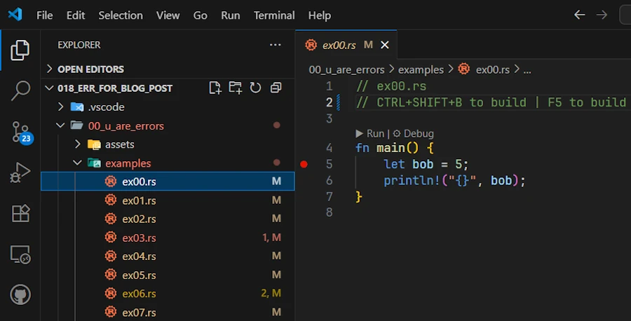
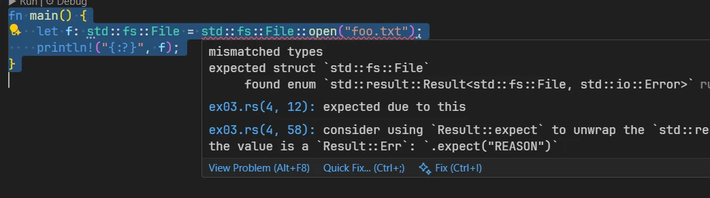

<!-- 
TODO :
* Fournir tous les codes de toutes les solutions
* Rajouter des images 
* Rajouter des vidéos
-->


# Rust Error Handling, Demystified
{: .no_toc }

A beginner-friendly conversation on Errors, Results, Options, and beyond.
{: .lead }


<!-- <h2 align="center">
<span style="color:orange"><b> 🚧 This post is under construction 🚧</b></span>    
</h2> -->


### This is Episode 00
{: .no_toc }


## TL;DR
{: .no_toc }

* For beginners.

* The code is on [GitHub](https://github.com/40tude/err_for_blog_post).

* **Rust has no exceptions:**  
    * [Episode 00]()
    * **recoverable** errors (handled with the `Result<T, E>` type). 
    * **unrecoverable** errors (handled by panicking using `panic!()`). 
    * We must explicitly handle errors.

* **`Result<T, E>` enum:**  
    * [Episode 00]()
    * Represents either success (`Ok(T)`) or error (`Err(E)`). 
    * Use `match` expression or methods like `.unwrap()/.expect()` (which `panic!()` on error). 
    * Prefer `.expect()` with a meaningful message.

* **`?` operator for propagation:**  
    * [Episode 00]()
    * To propagate errors upward with a lite syntax.
    * Only works in functions returning a compatible `Result<T, E>` (or `Option<T>` ). 
    * When `main()` returns `Result<T, E>` we can use `?` here 

* **`Option<T>` vs `Result<T, E>`:**  
    * [Episode 01]()
    * Use **`Option<T>`** when the **absence** of a value is not an error (e.g., no search result) and no error info is needed. 
    * Use **`Result<T, E>`** when an operation **can fail** in an exceptional way and we need to convey an error message or reason.

* **When to panic:** 
    * [Episode 01]()
    * On bugs or invalid states in **our code** (e.g. asserting [invariant](#invariant)). 
    * If failure is possible in normal operation (e.g. invalid user input...), return a `Result<T, E>`. 
    * Library code should avoid panicking on recoverable errors, bubbles them up and let the caller decide.

* **Custom error types:** 
    * [Episode 01]()
    * For sophisticated libraries or binaries.
    * Define our own error types to represent various error kinds in one type. 
    * Implementing `std::error::Error` (=> impl `fmt::Display` and `#[derive(Debug)]`)
    * Use pattern matching or helper methods like `.map_err()` (or the `From` trait implementation) to convert std lib errors into our custom error and return it with `?`

* **`anyhow` and `thiserror`**
    * [Episode 01]()
    * **`anyhow`** in **binaries** when we don’t need a public, fine-grained error type and just want easy error propagation with `.context("blablabla")`.
    * **`thiserror`** in **libraries** when we need custom error types without writing all implementations for `Display`, `Debug`, `From` trait and `Error`. 
    * Don’t mix them blindly (anyhow inside the lib, thiserror API of the lib) 

* **From Experimentation to Production:**
    * [Episode 02]()
    * Key Concepts
    * 3 Experimentation projects, 1 template
    * From Experimentation to Production (including testing) in 7 steps

<!-- * **Keep in mind**

```rust
use std::fs::File; 
use std::io::Read;

pub type Error = Box<dyn std::error::Error>;
pub type Result<T> = std::result::Result<T, Error>;

fn main() -> Result<()> {
    let f = File::open("foo.txt")?;
    let mut data = vec![];
    f.File.read_to_end(&mut data)?;
    Ok(())
}
``` -->

<div align="center">
<br/>
<span>Let's have a beginner-friendly conversation on Errors, Results, Options, and beyond.</span>
</div>


#### Posts 
{: .no_toc }
* [Episode 00]()
* [Episode 01]()
* [Episode 02]()


## Table of Contents
{: .no_toc .text-delta}
- TOC
{:toc}


<!-- ###################################################################### -->
<!-- ###################################################################### -->
<!-- ###################################################################### -->


## Why Alice and Bob are here?
A long time ago (2010, may be) I read a `.pdf` about the N-Body Simulations. Too bad, I can't find it on the web anymore, but here's a copy of [volume 1](). It was based on Ruby but it was great, easy to follow etc. One thing was that it was written as a conversation between **Bob** and **Alice**. Later the code was re-written in Python and the set of `.pdf` was merged into an expensive printed book (55$ when I bought my copy). Today (sept 2025) you can find it on [AMZN](https://www.amazon.fr/Moving-Planets-Around-Introduction-Exoplanetary/dp/0262539349) for 28€.

<div align="center">
<br/>
<span>Moving Planets Around</span>
</div>

Last week I start reading `The Basics of Bitcoins and Blockchains` ([AMZN](https://www.amazon.fr/dp/1642506737?ref=ppx_yo2ov_dt_b_fed_asin_title)). 

<div align="center">
<br/>
<span>The Basics of Bitcoins and Blockchains</span>
</div>


In Part 3, there is a section `Why Alice and Bob`. Believe it or not, I then discovered where [they came from](https://en.wikipedia.org/wiki/Alice_and_Bob). 

I like to write in a conversational tone, so let's imagine a discussion between Bob and Alice and let's see how it goes...


<!-- ###################################################################### -->
<!-- ###################################################################### -->
<!-- ###################################################################### -->

## Introduction: Why Rust Cares About Errors

**Alice:** I ran a Rust code snippet and it **forced** me to handle an error – it wouldn’t even compile until I did! What’s going here?

**Bob:** The compiler (`rustc`) makes sure we acknowledge and handle errors properly before our code even runs. This helps prevent crashes at runtime.


**Alice:** There are no exceptions at all?

**Bob:** Exactly. Rust doesn’t have exceptions. Instead, it has a different model for errors. Essentially, Rust groups errors into two categories: **recoverable** and **unrecoverable**. 
* **Recoverable** errors are things we expect might happen and can be dealt with (like a file not found – we might just create the file or use a default). These are handled with the `Result<T, E>` type. 
* **Unrecoverable** errors are bugs on our side or unexpected conditions (like indexing past the end of an array – something’s really bad if that happens). For these cases Rust provides the `panic!()` macro to stop the program.


**Alice:** So `Result<T, E>` is for errors I can handle, and `panic!()` is for the program-halting ones?

**Bob:** Yes! 
* Think of `Result<T, E>` as Rust’s way of saying "operation might succeed or fail". We then decide what to do if it fails.
* Whereas a `panic!()` is Rust saying "I can’t deal with this, I must crash now". 

By making error handling explicit with `Result`, Rust ensures we don’t just ignore errors. It won’t let us compile unless we either handle the `Result<T, E>` (e.g. [exempli gratia],check for an error) or explicitly choose to crash (like using `.unwrap()` which triggers a `panic!()` if there’s an error). This leads to more robust programs because we're less likely to have an error go unnoticed.


**Alice:** Um... This is may be a silly question but, if I know my function can succeed or fail, can it returns `Result<T, E>`.

**Bob:** Yes, absolutely! Returning a `Result<T, E>` is not limited to functions in the std library. All your function, even `main()` can return `Result<T, E>` and it is a very good practice. Before writing any function code, ask yourselves "can this function fail? Should it return `Result<T, E>` (or `Option<T>`)?". Then work on the rest of the function's signature.

<div align="center">
<iframe width="560" height="315" src="https://www.youtube.com/embed/nLSm3Haxz0I?si=k8Xtc_AofCBs3H_T" title="YouTube video player" frameborder="0" allow="accelerometer; autoplay; clipboard-write; encrypted-media; gyroscope; picture-in-picture; web-share" referrerpolicy="strict-origin-when-cross-origin" allowfullscreen></iframe>
</div>


**Alice:** It’s a bit scary that the program can just crash with `panic!()` though. 

**Bob:** Again, `panic!()` is for cases that are **not supposed to happen** like an invariant being broken. And even when a `panic!()` occurs, Rust will unwind the stack and cleanup (or we can opt to abort immediately). Most of the time, you’ll use `Result<T, E>` for possible errors and only `panic!()` on bugs that are your responsibility. We’ll talk more about choosing between them later.


**Alice:** This is may be too early but how can I opt to abort immediately?

**Bob:** Your're right, it's too early but your wishes are my commands. In `Cargo.toml` add the following section:

```toml
[profile.release]
panic = "abort"
```
The default is `unwind`. With `abort` opted in:
* No cleanup: at the first panic, the program terminates immediately with an `abort()`.
* No destructor (Drop) is invoked.
* This reduces the binary size and the build time (fewer symbols to generate)


**Alice:** Ok... So Rust wants me to handle every error. This will be a pain... How do I actually do that with `Result<T, E>`? What does a `Result<T, E>` look like?

**Bob:** That's a good question. We'll answer it by examining how `Result<T, E>` works and how to use it, but before that, it's time to recap and practice a little.


### Summary – Introduction -->

{: .new-title }
> Summary – Introduction
>
* Rust requires we handle errors explicitly. Code that can fail must return a `Result<T, E>` (or `Option<T>`), forcing the caller to address the possibility of failure.
* Rust distinguishes 
    * **recoverable errors** (e.g. file not found, invalid input – handled with `Result`)
    * **unrecoverable errors** (bugs like out-of-bounds access – handled with `panic!()`).
* No exceptions are used. This language design decision helps prevent unchecked errors. We either deal with the error or deliberately choose to `panic!()`/`.unwrap()`, making error handling clear in the code.


### Exercises – Introduction

1. **Identify Error Types:** Think of two scenarios in programming: 
    * one that would be a ***recoverable error*** 
    * one that would be an ***unrecoverable error***

    For each scenario, explain whether we would use Rust’s `Result<T, E>` or a `panic!()`, and why.

2. **Compile-time Check:** Write a Rust code that attempts to open a non-existent file with `std::fs::File::open(foo.txt)` without handling the returned `Result<T, E>`. Observe the compiler error or warning. Then, fix it by handling the `Result<T, E>` (for now, we can just use a simple `panic!()` or print an error message in case of `Err`). One can read [this page](https://doc.rust-lang.org/book/ch09-02-recoverable-errors-with-result.html#:~:text=fn%20main%28%29%20,hello.txt)


### Optional - Setting Up our Development Environment 

Let's make sure we can Debug the code.

**Requirements:** 
* I expect either 
    1. `CodeLLDB` extension (`code --install-extension vadimcn.vscode-lldb`)
    2. **or** the `Build Tools for Visual Studio` to be installed. 

`CodeLLDB` might be faster and easier to install (after all, it is "just" a VSCode extension). Both can be installed on your PC if you wish or need (this is my case). We will see how to use one or the other. We need them to debug our code.

* I also expect the `command-variable` extension to be installed. We need it also to debug our code.
    * `code --install-extension rioj7.command-variable`

This said, I use VSCode under Windows 11 and I wrote a post about [my setup](). Here I use a [workspace](https://doc.rust-lang.org/book/ch14-03-cargo-workspaces.html) because I can have more than one project (packages) in a single "space". Think of workspaces as meta-project. 

Now, having this in mind here is what I do and why.

* Get a copy of the repo from [GitHub](https://github.com/40tude/err_for_blog_post)
* Right click  the directory name then select `Open with Code`
* Once in VSCode, click on `00_u_are_errors/examples/ex00.rs` in the VSCode editor

At the time of writing here is what I see :

<div align="center">
<br/>
<span>Click on the image to zoom in</span>
</div>

* Just for testing purpose, delete the `target/` directory if it exists (at this point it should'nt exist yet since you just got the workspace from GitHub)

* Press `CTRL+SHIFT+B`. This should build a debug version of the code
    * Check `target/debug/examples/`. It should contains `ex00.exe`
    * If `CTRL+SHIFT+B` does not work, open a terminal (CTRL+ù on a French keyboard) and use this command : `cargo build -p u_are_errors --example ex00`
    * You need `-p u_are_errors` because in a workspace we need to indicate the name of the package (which you find in `Cargo.toml`)


**If and only if** `(LLDB || Build Tools for Visual Studio) && command-variable` are installed 

* Set the cursor on line 5 then press `F9` 
* This set a breakpoint on line 5. See below:

<div align="center">

</div>


* Open de `Run & Debug` tab on the side (`CTRL+SHIFT+D`)
* In the list box, select the option corresponding to your configuration (LLDB or MSVC). See below:

<div align="center">

</div>


* Press `F5`
    * This starts the debug session
    * If needed the application is built (not the case here because it is already built) 
    * The execution stops on line 5. See below :

<div align="center">

</div>   

* Press `F10` to move forward
    * Line 5 is executed
    * On the left hand side, in the Local subset of variables, we can check that `bob` is now equal to 5. See below:

<div align="center">

</div>

* Press `F5` to continue and reach the end  of the code

Let's make a last test. Just to make sure...
* Delete the `target/` directory
    * Select it then press `DELETE`
* `exe00.rs` should still be open in the editor with a breakpoint set on line 5
* Press `F5`
    * The `ex00.exe` is built
    * The debug session starts
    * Execution stops on line 5 as before

**The making of:**

When reading for the first time, you can skip this section and come back to it later if you really need to understand how compilation and debugging tasks work.

The secret ingredient lies in `./vscode/task.json` and `./vscode/launch.json`

**1. `.vscode/tasks.json`:**
```json
{
  "version": "2.0.0",
  "tasks": [
    {
      "label": "cargo-build-debug",
      "type": "cargo",
      "command": "build",
      "args": [
        "-p",
        "${input:packageName}",
        "--example",
        "${fileBasenameNoExtension}"
      ],
      "problemMatcher": ["$rustc"],
      "group": { "kind": "build", "isDefault": true }
    },
    {
      "label": "cargo-build-release",
      "type": "cargo",
      "command": "build",
      "args": [
        "--release",
        "-p",
        "${input:packageName}",
        "--example",
        "${fileBasenameNoExtension}"
      ],
      "problemMatcher": ["$rustc"]
    },
  ],
  "inputs": [
    {
      "id": "packageName",
      "type": "command",
      "command": "extension.commandvariable.transform",
      "args": {
        "text": "${relativeFileDirname}",
        "find": "^(.{3})([^\\\\/]+)(?:[\\\\/].*)?$",
        "replace": "$2"
      }
    }
  ]
}
```

* In the first object of the array `tasks`, the key named `group` helps to make the task the one by default. This explains how and why `CTRL+SHIFT+B` worked. 
* Note that since the source code to compile is in the `examples/` directory, we pass `--example` and the name of the file (see `${fileBasenameNoExtension}`, e.g. `ex00`) in the `args` array.
* Since we are in a workspace we need `-p` followed by the name of the package (`input:packageName`)
* If you get lost, just review the build command you enter in the terminal before. What we do here is exactly the same thing : `cargo build -p u_are_errors --example ex00`. Except that we want to discover the name of the package dynamically. Indeed not all the source code are in the `u_are_errors` package. You may have seen the 2 other projects: `01_experimentation` and `02_production` for example. 
    * In `01_experimentation/`, in `Cargo.toml` the name of the package in `experimentation` for example
* Finding out the name of the package is done in the `inputs` array and this is where the `command-variable` extension shines. Indeed we create a variable `packageName` which is initialized with the output of a command which is a regular expression applied to the `${relativeFileDirname}` of the source code opened in the editor.
    * To make a long story short from `01_experimentation/examples/` it extracts `experimentation`
* Then the `${input:packageName}` variable can be used in the build tasks.     


To see the list of `tasks`, in VSCode, press `ALT+T` then press `R`
    * Below we can see both tasks : `cargo-build-debug` and `cargo-build-release`

<div align="center">

</div>

**2. `.vscode/launch.json`:**

```json
{
    "version": "0.2.0",
    "configurations": [
        {
            "type": "cppvsdbg",
            "request": "launch",
            "name": "Debug (MSVC)",
            "program": "${workspaceFolder}/target/debug/examples/${fileBasenameNoExtension}.exe",
            "args": [],
            "cwd": "${workspaceFolder}",
            "environment": [
                {
                    "name": "RUST_BACKTRACE",
                    "value": "short"
                }
            ],
            "preLaunchTask": "cargo-build-debug"
        },
        {
            "type": "cppvsdbg",
            "request": "launch",
            "name": "Release (MSVC)",
            "program": "${workspaceFolder}/target/release/examples/${fileBasenameNoExtension}.exe",
            "args": [],
            "cwd": "${workspaceFolder}",
            "environment": [
                {
                    "name": "RUST_BACKTRACE",
                    "value": "short"
                }
            ],
            "preLaunchTask": "cargo-build-release"
        },
        {
            "type": "lldb",
            "request": "launch",
            "name": "Debug (CodeLLDB)",
            "program": "${workspaceFolder}/target/debug/examples/${fileBasenameNoExtension}.exe",
            "args": [],
            "cwd": "${workspaceFolder}",
            "sourceLanguages": ["rust"],
            "preLaunchTask": "cargo-build-debug"
        }
    ]
}
```

* There are 3 objects in the array `configurations`. This is why we can debug code with LLDB or MSVC. The third helps to launch the release version.
* In each object of the array `configurations`, the path in the `program` key, points to the executable created at the end of the build (do you see `${fileBasenameNoExtension}`?)
* Note the `preLaunchTask` key. It explains why we can press F5 (debug) even if the executable is not yet built. In such case, the task `cargo-build-debug` is executed then the debug session starts.


### Solution to Exercice #2

Let's take some time and see how one could answer the second exercice. If I search "Rust open txt file" on Google, one of the links drive me to the excellent [Rust By Example](https://doc.rust-lang.org/rust-by-example/std_misc/file/open.html). See below :

<div align="center">
<br/>
<!-- <span>Optional comment</span> -->
</div>

This is great because on line 11 it uses `std::fs::File::open()` but it is a little bit too complex for me and it seems it handles errors while I want the compiler to complain then fix the errors.


Copy/paste/save the file as `ex01.rs` or open your eyes : the code is already in `00_u_are_errors/examples/ex01.rs`. To make sure the code works as expected I can press F5 or open a terminal then enter `cargo run -p u_are_errors --example ex01`. Here is what I see in the Debug Console once I pressed F5 :

<div align="center">
<br/>
<!-- <span>Optional comment</span> -->
</div>

The code cannot find `hello.txt` and `panic!()`.


Copy/paste/save the file as `ex02.rs`. From the previous code, I just keep what I need :

```rust
// ex02.rs
fn main() {
    let f = std::fs::File::open("foo.txt");
    println!("'f' after std::fs::File::open() =  {:?}", f);
}
```

Surprisingly if I press F5, it builds and runs in a debug session without complain.

```
------------------------------------------------------------------------------
You may only use the C/C++ Extension for Visual Studio Code with Visual Studio
Code, Visual Studio or Visual Studio for Mac software to help you develop and
test your applications.
------------------------------------------------------------------------------
ex02.exe (30708): Loaded 'C:\Users\phili\OneDrive\Documents\Programmation\rust\01_xp\018_err_for_blog_post\u_are_errors\target\debug\examples\ex02.exe'. Symbols loaded.
ex02.exe (30708): Loaded 'C:\Windows\System32\ntdll.dll'. 
ex02.exe (30708): Loaded 'C:\Windows\System32\kernel32.dll'. 
ex02.exe (30708): Loaded 'C:\Windows\System32\KernelBase.dll'. 
ex02.exe (30708): Loaded 'C:\Windows\System32\ucrtbase.dll'. 
ex02.exe (30708): Loaded 'C:\Windows\System32\vcruntime140.dll'. 
'f' after std::fs::File::open() =  Err(Os { code: 2, kind: NotFound, message: "Le fichier sp├®cifi├® est introuvable." })
ex02.exe (30708): Loaded 'C:\Windows\System32\kernel.appcore.dll'. 
ex02.exe (30708): Loaded 'C:\Windows\System32\msvcrt.dll'. 
The program '[30708] ex02.exe' has exited with code 0 (0x0).
```

In fact, with [my setup](), if I press `CTRL+ALT` I can reveal the datatype.

<div align="center">
<br/>
<!-- <span>Optional comment</span> -->
</div>

`f` is a `Result<File, Error>`. It is a `Result<T, E>` but what happens, is that when I asked to print it with `{:?}`, Rust displays the content of the `Result<T, E>` and this is why we can see :

```
'f' after std::fs::File::open() =  Err(Os { code: 2, kind: NotFound, message: "Le fichier sp├®cifi├® est introuvable." })
```

In fact despite ourselves, we cheat. We call a function returning `Result<T, E>` in a context that expects a file `f` without using it (e.g. trying to read something).


Copy/paste/save the file as `ex03.rs`. Let's make sure the build system complain. Modify the previous code with the one below :

```rust
// ex03.rs
fn main() {
    let f: std::fs::File = std::fs::File::open("foo.txt");
    println!("{:?}", f);
}
```
On the lhs of the equal sign, I express my expectation. I expect a `std::fs::File`. Obviously this does not fly very well. We don't even need to try to build. Indeed, the red squiggles warn us and if we hover them with the cursor we get a clear explanation and some advises. See below : 

<div align="center">
<br/>
<!-- <span>Optional comment</span> -->
</div>


Copy/paste/save the file as `ex04.rs`. Let's find a solution. Modify the previous code with the one below :

```rust
// ex04.rs
use std::fs::File; 

fn main() {
    let result_file = File::open("00_u_are_errors/foo.txt");

    match result_file {
        Ok(file) => println!("Successfully opened file: {:?}", file),
        Err(why) => panic!("Panic! opening the file: {:?}", why),
    }
}
```

* `result_file` is a `Result<T, E>`. It is **NOT** a `File`. **It took me a while** to read it and understand it that way.
* `match` is an expression. It is NOT a statement. This one is easy because almost everything is an expression in Rust.
    * If the difference between [expression](#expressions) and [statement](#statement) is not crystal clear follow and read the 2 previous links.  
* The `match` expression forces us to handle all possible cases
* Set a break point on the line with `match` expression (F9)
* Press F5 and step forward with F10 
* The code starts from the directory at the root of the workspace. This explains why I need to specify `00_u_are_errors/foo.txt` to test the `OK()` arm (with `foo.txt` in `../workspace_directory/00_u_are_errors/foo.txt`) 


Copy/paste/save the file as `ex05.rs`. Let's take advantage of the fact that `match` is an expression. Modify the previous code with the one below :

```rust
// ex05.rs
use std::fs::File; 
use std::io::Read;

fn main() {
    let result_file = File::open("00_u_are_errors/foo.txt");
    let mut bob = match result_file {
        Ok(alice) => alice,
        Err(why) => panic!("Panic! opening the file: {:?}", why),
    };
    println!("{:?}", bob);

    let mut s = String::new();
    match bob.read_to_string(&mut s) {
        Ok(_) => print!("Content:\n{}", s),
        Err(why) => panic!("Panic! reading the file: {:?}", why),
    }
}
```


{: .note-title }
> Side Note
>
> I know, `bob` and `alice` are weird variable names in this context. I just want to make clear that `alice` exists only inside the body of `match` while `bob` exists outside the `match`. Remember from the Rust by Example we had **variable shadowing** on the `file` variable. We had: 
>
```rust
let mut file = match File::open(&path) {
    Err(why) => panic!("couldn't open {}: {}", display, why),
    Ok(file) => file,
};
```
>
>* The outer `let mut file = …;` declares a new variable `file` in the current scope.
>* Inside the `Ok(file)` match arm, the name `file` is a **pattern variable** that temporarily binds the `File` object contained in the `Ok()` variant.
>* That inner `file` variable is [shadowing](https://doc.rust-lang.org/book/ch03-01-variables-and-mutability.html?highlight=shadowing#shadowing) the outer one just for the right-hand side of the assignment.
>* Once the match expression finishes evaluating, the *inner* `file` is moved out of the `Ok(file)` pattern and becomes the value assigned to the *outer* `file`.
>* This is a case of variable shadowing.
>* The `file` in the match pattern and the `file` bound by the `let` are two distinct variables with the same name, in different scopes.


This said, let's go back to the source code :

* As before, `std::fs::File::open()` returns a `Result<File, io::Error>`, which we store in `result_file`.
* Since `match` is an expression, it evaluates to a value, and with the first `match` we assign that value to `bob`.
* It is **important** to understand that `match` **destructures** the `Result<T, E>`. So that the body of the `match` can be read as:
    * If the `Result<File, io::Error>` in `result_file` matches the pattern `Ok(alice)`, then the inner `File` is bound to the variable `alice`, and that `File` is returned from the `match`. This means `bob` now owns the file handle.
    * If it matches `Err(why)`, the program calls `panic!`. The `panic!` macro has the special “never” type (`!`) which never resolve to any value at all. So this arm never returns. This allows the entire `match` expression to still have type `File`. This arm prints a short message then, "[Don't press the little button on the joystick](https://www.youtube.com/watch?v=yG0vY5lT9yE), abort! abort! abort!"


<div align="center">
<br/>
<span>Don't push the little button on the joystick</span>
</div>

Run the code (F5) to see it in `panic!()`

<div align="center">
<br/>
<!-- <span>Optional comment</span> -->
</div>

Now rename the file `foo.txt.bak` at the root of the project (`00_u_are_errors/`) to `foo.txt` and run the code (F5)

<div align="center">
<br/>
<!-- <span>Optional comment</span> -->
</div>


* When the code doesn’t `panic!` on `open()`, we first `println!()` the `Debug` representation of `bob`.
* Then we call `read_to_string()` on `bob`. The method returns an `io::Result<usize>`, which is just a type alias for `Result<usize, io::Error>`. On success, the `usize` is the number of bytes read.
* In the second `match` we don’t care about this number, so we use `_` to ignore it. Instead, we just `println!()` the contents of the `String s`.
* On `Err`, the code calls `panic!` again, prints a message, and the program aborts.


***Um... And how do I know `io::Result<usize>` is a type alias for `Result<usize, io::Error>`?*** 

**Green Slope:**
1. Set the cursor on `read_to_string`
1. Press F12 (Go To Definition)
1. We can see the function signature : `fn read_to_string(&mut self, buf: &mut String) -> io::Result<usize>`
1. Hover `io::Result<usize>`
1. We get access to the type alias `pub type Result<T> = result::Result<T, Error>` 

<div align="center">
<br/>
<!-- <span>Optional comment</span> -->
</div>

**North Face:**
1. Open the [std web page](https://doc.rust-lang.org/std/index.html)
1. On the left, find the **Crates** section
1. Click on **std**
1. Look for and click on **io**
1. On the right, go down to the **Type Aliases** section
1. Click on **Result**
1. The page Type Alias Result page explains what is going on : `pub type Result<T> = Result<T, Error>;`


**K12**
1. Open the [std web page](https://doc.rust-lang.org/std/index.html)
1. On the left, find the **Crates** section
1. Click on **std**
1. Look for and click on **io**
1. On the right side, go down and find the **Traits** section
    * I know I must reach the **Traits** section and not the **Functions** section (where there is a `read_to_string`) 
    * Because at the top of the source code if I hover the line `use std::io::Read;` I'm told `Read` is a trait. 

<div align="center">
<br/>
<!-- <span>Optional comment</span> -->
</div>

6. Click on **Read**
7. At the top you see the function signature: `fn read_to_string(&mut self, buf: &mut String) -> Result<usize> { ... }`
8. At the very end click on `Result<usize>`
9. The page Type Alias Result page explains what is going on : `pub type Result<T> = Result<T, Error>;`


I know what you think. But we need to invest time in learning how to navigate and read the documentation. For example instead of asking Google or ChatGPT, I may want to spend time and loose myself in the documentation of std looking for functions to read a `.txt` file. Or I can look for a sample code in Rust by Example then search for the function signature in the std documentation... Read and navigate the documentation no one can do it for you.

<div align="center">
<iframe width="560" height="315" src="https://www.youtube.com/embed/ODk38qJ1A3U?si=tQ9bd1UiqDBiWW-c" title="YouTube video player" frameborder="0" allow="accelerometer; autoplay; clipboard-write; encrypted-media; gyroscope; picture-in-picture; web-share" referrerpolicy="strict-origin-when-cross-origin" allowfullscreen></iframe>
</div>


It took us some time to reach that point but from now on I consider we know : 
* how to play with code in the project
* how to build (CTRL+SHIFT+B)
* how to set breakpoint (F9) and how to debug (F5)
* how to navigate the documentation (good luck!)

It is time to move on and to dive in `Result<T, E>`.


<!-- ###################################################################### -->
<!-- ###################################################################### -->
<!-- ###################################################################### -->

## The `Result<T, E>` Type: Handling Recoverable Errors


**Alice:** So, `Result<T, E>`... What exactly is it?

**Bob:**  [`Result<T, E>`](https://doc.rust-lang.org/std/result/enum.Result.html) is an `enum` (like a tagged union) defined roughly like this:

```rust
enum Result<T, E> {
    Ok(T),  // success, holding a value of type `T`
    Err(E), // failure, holding an error value of type `E`
}
```

It’s a generic `enum` with two variants: 
* `Ok(T)` means the operation succeeded and yielded a value of type `T` 
* `Err(E)` means it failed, yielding an error of type `E` describing what went wrong 

For example, when we try to open a file, the success type `T` is a file handle ( `std::fs::File` ), and the error type `E` is `std::io::Error`.

<div align="center">
<br/>
<!-- <span>Optional comment</span> -->
</div>


**Alice:** How do I use it? Let’s say I call a function that returns a `Result`. What do I do with that?

**Bob:** We have to check which variant it is. Typically, we use a `match` expression or one of many helper methods. Let’s do a simple example. Suppose we try to parse an integer from a string – this can fail if the string isn’t a number. Copy/paste/try this code in [Rust Playground](https://play.rust-lang.org/?version=stable&mode=debug&edition=2024):


```rust
fn main() {
    let text = "42";
    let number_result = text.parse::<i32>();  // parse() returns Result<i32, ParseIntError>
    
    match number_result {
        Ok(n) => println!("The number is {n}"),              // If parsing succeeds, use the number.
        Err(e) => println!("Could not parse number: {e}"),   // If it fails, handle the error.
    }
}
```

In this code, `text.parse::<i32>()` will return an `Ok(42)` if the string is a valid integer, or an `Err(e)` if it isn’t (for example, if `text = "hello"` ). We then `match` (destructure) on the `number_result`: 
* in the `Ok` arm, we get the parsed `i32` number `n` and print it
* in the `Err` arm, we get an error `e` (of type `std::num::ParseIntError` in this case) and print an error message. 

This way we’ve handled both outcomes explicitly. Using `match` is the standard way to handle a `Result<T, E>` because it forces us to consider both success and error cases.


**Alice:** Cool, but matching on every `Result<T, E>` is verbose. No?

**Bob:** True and this is why Rust provides utility methods on `Result<T, E>` to make life easier. For example, if we just want to crash on error (perhaps in a quick prototype), we can use `.unwrap()` or `.expect(...)`. These will check the `Result<T, E>` for us: 

* [`.unwrap()`](https://doc.rust-lang.org/std/result/enum.Result.html#method.unwrap) returns the success value if it’s `Ok`, but if it’s an `Err`, it will `panic!()` right there. 
* [`.expect(msg)`](https://doc.rust-lang.org/std/result/enum.Result.html#method.expect) does the same but lets us provide a custom panic error message.


**Alice:** So `.unwrap()` is basically a shortcut for "give me the value or panic"? 

**Bob:** Exactly. For example copy/paste/try this code in [Rust Playground](https://play.rust-lang.org/?version=stable&mode=debug&edition=2024):

```rust
fn main() {
    let text = "not a number";
    // This will panic because the string can't be parsed as i32
    let number = text.parse::<i32>().unwrap();
}
```

If we run this, it will panic with a message like: `thread 'main' panicked at src/main.rs:4:38: called 'Result::unwrap()' on an 'Err' value: ParseIntError { kind: InvalidDigit }`

Because "not a number" can’t be parsed, parse returns an `Err`, and `.unwrap()` triggers a `panic!()`.

By contrast, `if text = "42"`, `.unwrap()` would succeed and give us the `i32` value 42 without any panic.


**Alice:** Got it. And `.expect()` is similar but with my own message?

**Bob:** Right. We might do:

```rust
let number = text.parse::<i32>().expect("Expected a number in the string");
```

If it fails, we would get a `panic!()` with our message: `'Expected a number in the string: ParseIntError { ... }'`. Using `.expect()` with a clear message is considered better style code compared to `.unwrap()`, because if a panic happens, the message helps us track down the source and reason.

In fact, developers should prefer `.expect()` over `.unwrap()` so that there's more context in case of a crash.


**Alice:** So I should avoid `.unwrap()` and use `expect()` with a good message if I must panic on an error?

**Bob:** Yes, that’s a good rule of thumb. Even better, where possible, handle the error gracefully instead of panicking. `.unwrap()`/`.expect()` should be used sparingly – basically in scenarios where we are very sure `Err` won’t happen or in code snippet, sample code for brevity.

One more thing: `Result<T, E>` has other handy methods:
* [`.unwrap_or_default()`](https://doc.rust-lang.org/std/result/enum.Result.html#method.unwrap_or_default) will `.unwrap()` the value or give a default if it's an error (no panic). 
* [`.unwrap_or_else(f)`](https://doc.rust-lang.org/std/result/enum.Result.html#method.unwrap_or_else) where we can run a [closure](https://doc.rust-lang.org/book/ch13-01-closures.html) to generate a fallback value or do some other handling for the error. 


To show how to use `.unwrap_or_default()`, here below is a code you can copy/paste in [Rust Playground](https://play.rust-lang.org/?version=stable&mode=debug&edition=2024). Note that the default is the default of the current data type (0 for `i32`, "" for a `String`...)

```rust
fn main() {
    // Option<i32>
    let some_number: Option<i32> = Some(42);
    let none_number: Option<i32> = None;

    // unwrap_or_default() gives the value if Some, or the default (0 for i32) if None
    println!("Some(42).unwrap_or_default() = {}", some_number.unwrap_or_default());
    println!("None::<i32>.unwrap_or_default() = {}", none_number.unwrap_or_default());

    // Option<String>
    let some_text: Option<String> = Some("Hello".to_string());
    let none_text: Option<String> = None;

    // Default for String is empty string ""
    println!("Some(\"Hello\").unwrap_or_default() = '{}'", some_text.unwrap_or_default());
    println!("None::<String>.unwrap_or_default() = '{}'", none_text.unwrap_or_default());
}

```

The code below shows how to use `.unwrap_or_else(f)`. The tricky part might be the source code layout

```rust
// ex06.rs
fn main() {
    let some_number: Option<i32> = Some(42);
    let none_number: Option<i32> = None;

    // unwrap_or_else takes a closure that computes a fallback value
    println!(
        "Some(42).unwrap_or_else(...) = {}",
        some_number.unwrap_or_else(|| {
            println!("Closure not called, since we had Some");
            0
        })
    );

    println!(
        "None::<i32>.unwrap_or_else(...) = {}",
        none_number.unwrap_or_else(|| {
            println!("Closure called, computing fallback value...");
            100
        })
    );
}
```

With this code it might be a good idea to open `ex06.rs` in the project, set a breakpoint on line 5, press F5, click on the `DEBUG CONSOLE` tab when the execution is paused and then to press F10 to step over line by line.

<div align="center">
<br/>
<!-- <span>Optional comment</span> -->
</div>


**Alice:** Earlier, we mentioned opening files... Is that similar with `Result<T, E>` ?

**Bob:** Yes. Opening a file is a classic example of a function returning `Result`. Let’s look the code below in [Rust Playground](https://play.rust-lang.org/?version=stable&mode=debug&edition=2024):

```rust
use std::fs::File;
use std::io::ErrorKind;

fn main() {
    let file_path = "hello.txt";
    let result = File::open(file_path);  // Result<File, std::io::Error>
    
    let file = match result{
        Ok(file_handle) => file_handle,
        Err(error) => {
            if error.kind() == ErrorKind::NotFound {
                // If file not found, try to create it
                File::create(file_path).expect("Failed to create file")
            } else {
                // For other errors (e.g., permission denied), panic
                panic!("Problem opening the file: {:?}", error);
            }
        }
    };
    println!("File opened: {:?}", file);
}
```

Here, `File::open` returns a `Result<File, Error>` – it could be `Ok(file_handle)` if the file exists and was opened, or `Err(error)` if something went wrong (file missing, no permission, etc.). 

We then `match` on it. 
* If the error kind is `NotFound` , we attempt to create the file (which itself could error, so we use `.expect()` to crash if even creation fails). 
* For any other kind of error, we just panic immediately. 

This way, we handle the "file not found" case by recovering (creating a new file) and let other errors bubble up as a `panic!()`. This example shows how we might handle different error scenarios differently by inspecting the error (here using `error.kind()`).


**Alice:** I see. We could also handle it differently, like notify the user or retry, depending on the context. 

**Bob:** Exactly. The point is that with `Result<T, E>`, we **decide** how to handle it. We could propagate it up, log it, ignore it (not recommended without justification), or crash. But **we have to choose**. That’s the strength of the deign : we won’t accidentally ignore an error.


### Summary – The `Result<T, E>` Type Basics

{: .new-title }
> Summary – The `Result<T, E>` Type Basics
>
* **`Result<T, E>` is an enum:** with variants `Ok(T)` (success) and `Err(E)` (error). 
* **Handle with `match` or methods:** 
    * `match`
        * Using `match` on a `Result<T, E>` forces explicit handling of success and error. 
        * `match` **[destructures](https://doc.rust-lang.org/book/ch19-03-pattern-syntax.html?highlight=destructure#destructuring-to-break-apart-values)** the `Result<T, E>`
        * Inside an `Ok(file)` match arm, the name `file` is a **pattern variable** that temporarily binds the `File` object contained in the `Ok()` variant of the enum `Result<T, E>`.
    * Methods
        * Use `.unwrap()`/`.expect()` to get the value or `panic!()` on error.
        * Use `.unwrap_or_default()`/`.unwrap_or_else(func)` to provide fallbacks instead of panicking.
* **Prefer `.expect()`:** If we choose to `panic!()` on an error, prefer `.expect("custom message")` over plain `.unwrap()`. It gives a clearer error message for debugging when the unexpected happens.


### Exercises – `Result<T, E>` Basics

1. Can you find `Result<T, E>` in std documentation?

1. **Match Practice:** Write a function `parse_number(text: &str) -> i32` that tries to convert a string to an integer. Use `match` on `text.parse::<i32>()` (which gives a `Result<i32,std::num::ParseIntError>`) and return the number if successful, or print an error and return `0` if not. Test it with both a numeric string and a non-numeric string.

1. **.unwrap() vs .expect():** Using the same `parse_number` logic, create another function `parse_number_expect(text: &str) -> i32` that does the parsing but uses `.expect()` instead of `match` to crash on error (with a custom message like `Failed to parse number`). Call this function with a bad input to see the panic message. Then replace `.expect()` with `.unwrap()` to see the default panic message. Note the difference in the panic outputs.

1. **File Open Challenge:** Write a small program that attempts to open a file (e.g., `config.txt` ). If it fails because the file is missing, have the program create the file and write a default configuration to it (we can just write a simple string). If it fails for any other reason, have it print a graceful error message (instead of panicking). Use pattern matching on the `Err(e)` and `e.kind()` as shown above to distinguish the cases.


<!-- ###################################################################### -->
<!-- ###################################################################### -->
<!-- ###################################################################### -->


## Propagating Errors with `?` Operator

**Alice:** This `match` stuff is okay, but if I have to bubble up errors from multiple functions, writing a `match` expression in each function sounds painful.

**Bob:** You’re in luck – Rust has a convenience for that: the `?` operator. It’s a little piece of syntax that makes propagating errors much nicer.


**Alice:** I think I already saw `?` here and there in some Rust code. How does it work?

**Bob:** The `?` operator is essentially a shortcut for the kind of match-and-return-on-Err logic we’ve been writing. When we append `?` to a `Result<T, E>` (or an `Option<T>`), it will check the result: 
* If it’s Ok , it *unwraps* the value inside and lets our code continue
* If it’s an Err, it **returns that error from the current function** immediately, *bubbling* it up to the caller. This means we don’t have to write the `match` ourself, `?` does it for us.


**Alice:** So it returns early on error? Nice, that’s like exceptions but checked at compile time.

**Bob:** Right, it’s analogous to exception propagation but explicitly done via return values. Let’s refactor a source code that use `match` expressions into one using `?` operator. First copy/paste and execute (CTRL+ENTER) the code below in [Rust Playground](https://play.rust-lang.org/?version=stable&mode=debug&edition=2024). It works but... Too much `match` everywhere... 

```rust
use std::fs::File;
use std::io::{self, Read};

fn read_username_from_file() -> Result<String, io::Error> {
    let mut file = match File::open("username.txt") {
        Ok(file) => file,           // success, variable shadowing on file, continue
        Err(e) => return Err(e),    // early return
    };
    
    let mut username = String::new();
    
    match file.read_to_string(&mut username) {
        Ok(_) => Ok(username),      // success, returns
        Err(e) => Err(e),           // returns the error e
    }                               // no ; here
}

fn main() {
    match read_username_from_file() {
        Ok(name) => println!("Username: {name}"),
        Err(e) => eprintln!("Error reading username: {e}"),
    }
}
```
Now, modify the code above in Rust Playground and when it is working paste it, locally in `ex07.rs`.

```rust
// ex07.rs
use std::fs::File;
use std::io::{self, Read};

fn read_username_from_file() -> Result<String, io::Error> {
    let mut file = File::open("username.txt")?; // if Err, returns Err up
    let mut username = String::new();
    file.read_to_string(&mut username)?; // if Err, returns Err up
    Ok(username) // if we got here, all good
}

fn main() {
    // Use the function and handle any error here
    match read_username_from_file() {
        Ok(name) => println!("Username: {name}"),
        Err(e) => eprintln!("Error reading username: {e}"),
    }
}
```

While `ex07.rs` is open in VSCode:

* Set breakpoints on lines 7 and 15 
* Run the code (F5) 
* When the application is done, there is a file named `username.txt.bak` at the root of the project (`00_u_are_errors/`), rename it `username.txt`. 
* Restart the code (F5) 
* When the application is done, open and delete the content of `username.txt`
* Run the code (F5)


<div align="center">
<br/>
<!-- <span>Optional comment</span> -->
</div>


**Bob:** First thing first. Do you see the return type in the signature of `read_username_from_file()`. I confirm, hopefully we can return `Result<T, E>` from our functions.
* At the end of the function, if everything went well we return `OK(username)`
* Otherwise we bubble up the errors with the help of the `?` operator. Do you see those `?` after `File::open` and `read_to_string`? If either operation fails, the function returns a `Err(io::Error)` back to the caller.  


This pattern is so common that using `?` is idiomatic. It makes the code much cleaner by avoiding all the boilerplate of matching and returning errors manually. 


**Alice:** That’s much shorter! And in `main()` we decided to handle the error with a `match` . Could I propagate the error from `main()` as well?

**Bob:** This is a very good point. In fact, yes we can! In "modern" Rust, the `main()` function itself can return a `Result<T, E>` (or any type that implements the [`Termination` trait](https://doc.rust-lang.org/std/process/trait.Termination.html), like `Result<T, E>` does). 

This is a feature that let us use `?` even in `main()` . For example:

```rust
// ex08.rs
use std::error::Error;
use std::fs::File;

fn main() -> Result<(), Box<dyn Error>> {
    let file = File::open("username.txt")?; // if this errors, `main()` will return Err
    println!("File opened successfully: {:?}", file);
    Ok(())
}
```

<div align="center">
<br/>
<!-- <span>Optional comment</span> -->
</div>

By writing `fn main() -> Result<(), Box<dyn Error>>`, we indicate that `main()` might return an error. The `Box<dyn Error>` is a trait object to mean any kind of error – it’s a convenient way to say our error could be of any type that implements the Error trait. 

Now, using `?` in `main()` is allowed because the error can be returned from `main()`. If an error occurs, the runtime will print the error and exit with a non-zero status code. If `main()` returns `Ok(())` , the program exits normally with code 0. 

This is really nice for quick scripts – we can just propagate errors out of `main()` and let the program crash gracefully with an error message,
rather than writing a lot of error handling in `main()`.


We can go one step further with the code below:

```rust
// ex09.rs
use std::fs::File;

type Result<T> = std::result::Result<T, Box<dyn std::error::Error>>; // Type Alias

fn main() -> Result<()> {
    let file = File::open("username.txt")?;
    println!("File opened successfully: {:?}", file);
    Ok(())
}
```

It does exactly the same thing but thanks to type aliases, we lighten the signature of `main()`. Note that the line `use std::error::Error;` is no longer necessary.


**Alice:** So `?` can be used in any function that returns a `Result<T, E>` or `Option<T>` right?

**Bob:** Correct. The rule is: we can use `?` in a function if the return type of that function can absorb the error. Typically, that means if our function returns a `Result<T, E>`. We can use `?` on another `Result<T, E2>` as long as `E2` can convert into `E`. Usually they’re the same `E` or there’s an implementation of the `From` trait to convert one error into the other. Rust does this conversion automatically in many cases. 

For example, below, the `main()` returns a `Result<T, Box<dyn Error>>`, but calls `parse::<i32>()`, which returns a `ParseIntError`. Rust performs the conversion automatically using `From<ParseIntError>` for `Box<dyn Error>`.

```rust
// ex10.rs
type Result<T> = std::result::Result<T, Box<dyn std::error::Error>>;

fn parse_number(s: &str) -> Result<i32> {
    // `parse::<i32>()` returns Result<i32, ParseIntError>
    // The `?` operator works here because ParseIntError implements
    // the `Error` trait, and Rust knows how to convert it into Box<dyn Error>.
    let n: i32 = s.parse()?;
    Ok(n)
}

fn main() -> Result<()> {
    let value = parse_number("123sdfsdf")?;
    println!("Parsed value: {value}");
    Ok(())
}

```

If our function returns `Option<T>` , we can use `?` on another `Option<T>`. If it’s `None`, our function returns `None` early. Play with the code below : 

```rust
// ex11.rs

fn first_char_upper(s: &str) -> Option<char> {
    // `first_char_upper()` returns Option<char>
    // `chars().next()` returns Option<char>
    // => we can use `?` at the end of s.chars().next()
    // If it's None, the function returns None early
    let c = s.chars().next()?;
    Some(c.to_ascii_uppercase())
}

fn main() {
    println!("{:?}", first_char_upper("hello")); // Some('H')
    println!("{:?}", first_char_upper("")); // None
}
```

Please note that the code below would work as well.

```rust
fn first_char_upper(s: &str) -> Option<f64> {
    let c = s.chars().next()?; // c: char
    Some(42.0)
}
```

It compiles without any problems because the `?` always outputs a char but the compiler doesn't care that our function returns an `Option<f64>`. It just checks that the `?` “absorbs” the `Option<char>` by returning `None` when necessary. Then it's up to us to transform the char into whatever we want (in this case, an `f64`).


One thing to remember: **we can’t mix** return types with `?`. For example, if our function returns a `Result`, we can’t directly use `?` on an `Option<T>` without converting it (and vice versa). For example the code below does not compile : 

```rust
// ex12.rs
// ! DOES NOT COMPILE

use std::fs::File;

fn bad_example() -> Option<File> {
    // `File::open` returns Result<File, io::Error>
    // But our function returns Option<File>.
    // The compiler rejects this because it cannot convert Result into Option automatically.
    let file = File::open("username.txt")?;
    Some(file)
}

fn main() {
    let f = bad_example();
    println!("{:?}", f);
}
```

See part of the message from the compiler on build :

```
error[E0277]: the `?` operator can only be used on `Option`s, not `Result`s, in a function that returns `Option`
   |
 8 | fn bad_example() -> Option<File> {
   | -------------------------------- this function returns an `Option`
...
12 |     let file = File::open("username.txt")?;
   |                                          ^ use `.ok()?` if you want to discard the `Result<Infallible, std::io::Error>` error information
```


There are helper methods like [`.ok_or()`](https://doc.rust-lang.org/std/option/enum.Option.html#method.ok_or) to turn an `Option<T>` into a `Result<T, E>` if needed. See below :

```rust
// ex13.rs
type Result<T> = std::result::Result<T, Box<dyn std::error::Error>>;

fn get_first_char(s: &str) -> Result<char> {
    // Convert Option<char> into Result<char, String>
    s.chars().next().ok_or("String was empty".into())
}

fn main() -> Result<()> {
    let c1 = get_first_char("hello")?;
    println!("First char: {c1}");

    let c2 = get_first_char("")?; // This will return Err
    println!("First char: {c2}");

    Ok(())
}
```


**Alice:** Understood. I really like how `?` reduces the clutter. It reads almost like normal linear code, but errors just get propagated automatically.

**Bob:** Exactly. It’s one of the features that make Rust’s error handling ergonomic. Just be sure that when we use `?`, we know what error type our function is returning and that it’s appropriate to let it bubble up to the caller.


### Summary – Propagating Errors with `?`

{: .new-title }
> Summary – Propagating Errors with `?`
>
* **`?` operator:** A shorthand for propagating errors. It unwraps the `Ok()` value or returns the error to the caller if it’s an `Err()`, effectively doing the `match` + `return Err(...)` for us. This simplifies error handling in functions that just want to pass errors up the chain.
* **Usage requirements:** We can only use `?` in a function that returns a compatible type (e.g., if the function returns `Result<T, E>` or `Option<T>`). Using `?` on a `Result<T, E>` in a function returning `Result<T, E>` will propagate the error; using it in `main()` requires `main()` to return a `Result<T, E>` as well. If we try to use `?` in a function that returns `()` (unit type) or another type that can’t represent an error, the code won’t compile – the compiler will remind we to change the return type or handle the error another way.
* **Converting error types:** When using `?`, if the error type of the `Result<T, E>` you’re handling doesn’t exactly `match` our function’s error type, it will attempt to convert it via the `From` trait. This allows different error types to be mapped into one error type for our function (for example, converting a `std::io::Error` into our custom error type). If no conversion is possible, you’ll get a type mismatch compile error, which we can resolve by using methods like `.map_err()` or implementing `From` for our error.
* **`main()` can return `Result<T, E>`:** To use `?` at the top level, we can have `main()` return `Result<(), E>`. This way, any `Err` that propagates to `main()` will cause the program to exit with a non-zero status and print the error. For example, `main() -> Result<(), Box<dyn std::error::Error>>` is a common choice to allow using `?` in `main()` 
* Let's keep this snippet in mind
    ```rust
    type Result<T> = std::result::Result<T, Box<dyn std::error::Error>>;
    fn main() -> Result<()> {
        // ...
        Ok(())
    }
    ```


### Exercises – Propagating Errors

1. **Refactor with `?` :** 
* Take one of our functions from the previous exercises (for instance, a file-reading function or the number-parsing function) that handled errors with `match`. 
* Change it to return a `Result<T, E>` instead of, say, defaulting to a value, and use the `?` operator to propagate errors to the caller. For example, change a `parse_number` that returned 0 on error to instead return `Result<i32, std::num::ParseIntError>` and use `?` inside. 
* Then handle the error at the top level (maybe in `main()`) by printing an error.


2. **Chain calls with `?`:** 
* Write two short functions: `fn get_file_contents(path: &str) -> Result<String, std::io::Error>` that opens and reads a file (using `?`), and `fn count_lines(path: &str) -> Result<usize, std::io::Error>` that calls `get_file_contents` (using `?`) and then returns the number of lines in the file. 
* In `main()`, call `count_lines(somefile.txt)` and handle the error with a `match` or by returning a `Result<T, E>` from `main()` using `?`. 
* This will give us practice in propagating errors through multiple levels.

3. **Using ? with Option:** 
* Write a function `last_char_of_first_line(text: &str) -> Option<char>` that returns the last character of the first line of a string, or `None` if the string is empty or has no lines. 
* Hint: We can use `text.lines().next()?` to get the first line, and then `chars().last()` on that line.
* The `?` will return early with `None` if there is no first line 
* Test it with an empty string, a single-line string, and a multi-line string.


<!-- ###################################################################### -->
<!-- ###################################################################### -->
<!-- ###################################################################### -->


#### Posts 
{: .no_toc }
* [Episode 00]()
* [Episode 01]()
* [Episode 02]()
