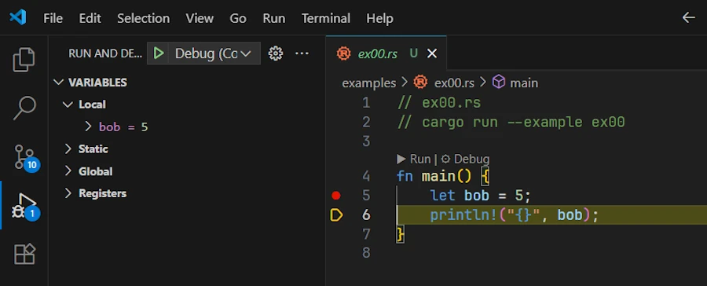

<!--
TODO:
* Fournir tous les codes de toutes les solutions
-->


# Rust Error Handling, Demystified
{: .no_toc }

A beginner-friendly conversation on Errors, Results, Options, and beyond.
{: .lead }


<!-- <h2 align="center">
<span style="color:orange"><b> 🚧 This post is under construction 🚧</b></span>
</h2> -->


### This is Episode 00
{: .no_toc }


## TL;DR
{: .no_toc }

* For beginners.

* The code is on [GitHub](https://github.com/40tude/err_for_blog_post).

* **Rust has no exceptions:**
    * [Episode 00]()
    * **recoverable** errors (handled with the `Result<T, E>` type).
    * **unrecoverable** errors (handled by panicking using `panic!()`).
    * We must explicitly handle errors.

* **`Result<T, E>` enum:**
    * [Episode 01]()
    * Represents either success (`Ok(T)`) or error (`Err(E)`).
    * Use `match` expression or methods like `.unwrap()/.expect()` (which `panic!()` on error).
    * Prefer `.expect()` with a meaningful message.

* **`?` operator for propagation:**
    * [Episode 01]()
    * To propagate errors upward with a lite syntax.
    * Only works in functions returning a compatible `Result<T, E>` (or `Option<T>` ).
    * When `main()` returns `Result<T, E>` we can use `?` here

* **`Option<T>` vs `Result<T, E>`:**
    * [Episode 02]()
    * Use **`Option<T>`** when the **absence** of a value is not an error (e.g., no search result) and no error info is needed.
    * Use **`Result<T, E>`** when an operation **can fail** in an exceptional way and we need to convey an error message or reason.

* **When to panic:**
    * [Episode 02]()
    * On bugs or invalid states in **our code** (e.g. asserting [invariant](#invariant)).
    * If failure is possible in normal operation (e.g. invalid user input...), return a `Result<T, E>`.
    * Library code should avoid panicking on recoverable errors, bubbles them up and let the caller decide.

* **Custom error types:**
    * [Episode 03]()
    * For sophisticated libraries or binaries.
    * Define our own error types to represent various error kinds in one type.
    * Implementing `std::error::Error` (=> impl `fmt::Display` and `#[derive(Debug)]`)
    * Use pattern matching or helper methods like `.map_err()` (or the `From` trait implementation) to convert std lib errors into our custom error and return it with `?`

* **`anyhow` and `thiserror`**
    * [Episode 04]()
    * **`anyhow`** in **binaries** when we don’t need a public, fine-grained error type and just want easy error propagation with `.context("blah blah blah")`.
    * **`thiserror`** in **libraries** when we need custom error types without writing all implementations for `Display`, `Debug`, `From` trait and `Error`.
    * Don’t mix them blindly (anyhow inside the lib, thiserror API of the lib)

* **From Experimentation to Production:**
    * [Episode 05]()
    * Key Concepts
    * 3 experimental prototypes, 1 template

* **Steps to Production:**
    * [Episode 06]()
    * From Experimentation to Production (including testing) in 7 steps

<!--
* **Keep in mind**

```rust
use std::fs::File;
use std::io::Read;

pub type Error = Box<dyn std::error::Error>;
pub type Result<T> = std::result::Result<T, Error>;

fn main() -> Result<()> {
    let f = File::open("foo.txt")?;
    let mut data = vec![];
    f.File.read_to_end(&mut data)?;
    Ok(())
}
```
-->

<div align="center">
<br/>
<span>Let's have a beginner-friendly conversation on Errors, Results, Options, and beyond.</span>
</div>


#### Posts
{: .no_toc }
* [Episode 00]()
* [Episode 01]()
* [Episode 02]()
* [Episode 03]()
* [Episode 04]()
* [Episode 05]()
* [Episode 06]()


## Table of Contents
{: .no_toc .text-delta}
- TOC
{:toc}


<!-- ###################################################################### -->
<!-- ###################################################################### -->
<!-- ###################################################################### -->


## Why Alice and Bob are here?
A long time ago (2010, may be) I read a `.pdf` about the N-Body Simulations. Too bad, I can't find it on the web anymore, but here's a copy of [volume 1](). It was based on Ruby but it was great, easy to follow etc. One thing was that it was written as a conversation between **Bob** and **Alice**. Later the code was re-written in Python and the set of `.pdf` was merged into an expensive printed book (55$ when I bought my copy). Today (sept 2025) you can find it on [AMZN](https://www.amazon.fr/Moving-Planets-Around-Introduction-Exoplanetary/dp/0262539349) for 28€.

<div align="center">
<br/>
<span>Moving Planets Around</span>
</div>

Last week I start reading `The Basics of Bitcoins and Blockchains` ([AMZN](https://www.amazon.fr/dp/1642506737?ref=ppx_yo2ov_dt_b_fed_asin_title)).

<div align="center">
<br/>
<span>The Basics of Bitcoins and Blockchains</span>
</div>


In Part 3, there is a section `Why Alice and Bob`. Believe it or not, I then discovered where [they came from](https://en.wikipedia.org/wiki/Alice_and_Bob).

I like to write in a conversational tone, so let's imagine a discussion between Bob and Alice and let's see how it goes...


<!-- ###################################################################### -->
<!-- ###################################################################### -->
<!-- ###################################################################### -->

## Introduction: Why Rust Cares About Errors

**Alice:** I ran a Rust code snippet and it **forced** me to handle an error – it wouldn’t even compile until I did! What’s going here?

**Bob:** The compiler (`rustc`) makes sure we acknowledge and handle errors properly before our code even runs. This helps prevent crashes at runtime.


**Alice:** There are no exceptions at all?

**Bob:** Exactly. Rust doesn’t have exceptions. Instead, it has a different model for errors. Essentially, Rust groups errors into two categories: **recoverable** and **unrecoverable**.
* **Recoverable** errors are things we expect might happen and can be dealt with (like a file not found – we might just create the file or use a default). These are handled with the `Result<T, E>` type.
* **Unrecoverable** errors are bugs on our side or unexpected conditions (like indexing past the end of an array – something’s really bad if that happens). For these cases Rust provides the `panic!()` macro to stop the program.


**Alice:** So `Result<T, E>` is for errors I can handle, and `panic!()` is for the program-halting ones?

**Bob:** Yes!
* Think of `Result<T, E>` as Rust’s way of saying "operation might succeed or fail". We then decide what to do if it fails.
* Whereas a `panic!()` is Rust saying "I can’t deal with this, I must crash now".

By making error handling explicit with `Result`, Rust ensures we don’t just ignore errors. It won’t let us compile unless we either handle the `Result<T, E>` (e.g. [exempli gratia], check for an error) or explicitly choose to crash (like using `.unwrap()` which triggers a `panic!()` if there’s an error). This leads to more robust programs because we're less likely to have an error go unnoticed.


**Alice:** Um... This is may be a silly question but, if I know my function can succeed or fail, can it returns `Result<T, E>`.

**Bob:** Yes, absolutely! Returning a `Result<T, E>` is not limited to functions of the std library. Oh, by the way, do you know how to read the [documentation of the std lib?](). Anyway... All your functions, even `main()` can return `Result<T, E>` and it is a very good practice. Before writing any function code, ask yourselves "can this function fail? Should it return `Result<T, E>` (or `Option<T>`)?". Then work on the rest of the function's signature.


<div align="center">
<iframe width="560" height="315" src="https://www.youtube.com/embed/nLSm3Haxz0I?si=k8Xtc_AofCBs3H_T" title="YouTube video player" frameborder="0" allow="accelerometer; autoplay; clipboard-write; encrypted-media; gyroscope; picture-in-picture; web-share" referrerpolicy="strict-origin-when-cross-origin" allowfullscreen></iframe>
</div>


**Alice:** It’s a bit scary that the program can just crash with `panic!()` though.

**Bob:** Again, `panic!()` is for cases that are **not supposed to happen** like an [invariant](#invariant) being broken. And even when a `panic!()` occurs, Rust will unwind the stack and cleanup (or we can opt to abort immediately). Most of the time, you’ll use `Result<T, E>` for possible errors and only `panic!()` on bugs that are your responsibility. We’ll talk more about choosing between them later.


**Alice:** This is may be too early but how can I opt to abort immediately?

**Bob:** Your're right, it's too early but your wishes are my commands. In `Cargo.toml` add the following section:

```toml
[profile.release]
panic = "abort"
```
The default is `unwind`. With `abort` opted in:
* No cleanup: at the first panic, the program terminates immediately with an `abort()`.
* No destructor (Drop) is invoked.
* This reduces the binary size and the build time (fewer symbols to generate)


**Alice:** Ok... So Rust wants me to handle every error. This will be a pain... How do I actually do that with `Result<T, E>`? What does a `Result<T, E>` look like?

**Bob:** That's a good question. We'll answer it by examining how `Result<T, E>` works and how to use it, but before that, it's time to recap and practice a little.


### Summary – Introduction
{: .no_toc }

{: .new-title }
> Summary – Introduction
>
* Rust requires we handle errors explicitly. Code that can fail must return a `Result<T, E>` (or `Option<T>`), forcing the caller to address the possibility of failure.
* Rust distinguishes
    * **recoverable errors** (e.g. file not found, invalid input – handled with `Result`)
    * **unrecoverable errors** (bugs like out-of-bounds access – handled with `panic!()`).
* No exceptions are used. This language design decision helps prevent unchecked errors. We either deal with the error or deliberately choose to `panic!()`/`.unwrap()`, making error handling clear in the code.


### Exercises – Introduction
{: .no_toc }

1. **Identify Error Types:** Think of two scenarios in programming:
    * one that would be a ***recoverable error***
    * one that would be an ***unrecoverable error***

    For each scenario, explain whether we would use Rust’s `Result<T, E>` or a `panic!()`, and why.

2. **Compile-time Check:** Write a Rust code that attempts to open a non-existent file with `std::fs::File::open(foo.txt)` without handling the returned `Result<T, E>`. Observe the compiler error or warning. Then, fix it by handling the `Result<T, E>` (for now, we can just use a simple `panic!()` or print an error message in case of `Err`). One can read [this page](https://doc.rust-lang.org/book/ch09-02-recoverable-errors-with-result.html#:~:text=fn%20main%28%29%20,hello.txt)


<!-- ###################################################################### -->
<!-- ###################################################################### -->
<!-- ###################################################################### -->

## Setting Up our Development Environment

Let's make sure we can Debug our code. If your IDE is already set up and you know how to execute your code step by step, jump over this section and check your [Solution to Exercice #2](#solution-to-exercice-2)


<!-- ###################################################################### -->
### Let's install what we need
{: .no_toc }

**Requirements:**
* I expect either
    1. `CodeLLDB` extension (`code --install-extension vadimcn.vscode-lldb`)
    2. **or** the `Build Tools for Visual Studio` to be installed.

`CodeLLDB` might be faster and easier to install (after all, it is "just" a VSCode extension). Both can be installed on your PC if you wish or need (this is my case). We will see how to use one or the other. We need them to debug our code.

* I also expect the `command-variable` extension to be installed. We need it also to debug our code.
    * `code --install-extension rioj7.command-variable`

This said, I use VSCode under Windows 11 and I wrote a post about [my setup](). Here I use a [workspace](https://doc.rust-lang.org/book/ch14-03-cargo-workspaces.html) because I can have more than one package in a single "space". Think of workspaces as meta-package.

Now, having this in mind here is what I do and why.

* Get a copy of the repo from [GitHub](https://github.com/40tude/err_for_blog_post)
* Right click  the directory name then select `Open with Code`
* Once in VSCode, click on `00_u_are_errors/examples/ex00.rs` in the VSCode editor

At the time of writing here is what I see:

<div align="center">
<br/>
<span>Click on the image to zoom in</span>
</div>

* Just for testing purpose, delete the `target/` directory if it exists (at this point it should'nt exist yet since you just got the workspace from GitHub)

* Press `CTRL+SHIFT+B`. This should build a debug version of the code
    * Check `target/debug/examples/`. It should contains `ex00.exe`
    * If `CTRL+SHIFT+B` does not work, open a terminal (CTRL+ù on a French keyboard) and use this command: `cargo build -p u_are_errors --example ex00`
    * You need `-p u_are_errors` because in a workspace we need to indicate the name of the package (which you find in `Cargo.toml`)


<!-- ###################################################################### -->
### Using the debugger
{: .no_toc }

**If and only if** `(LLDB || Build Tools for Visual Studio) && command-variable` are installed

* Set the cursor on line 5 then press `F9`
* This set a breakpoint on line 5. See below:

<div align="center">

</div>


* Open de `Run & Debug` tab on the side (`CTRL+SHIFT+D`)
* In the list box, select the option corresponding to your configuration (LLDB or MSVC). See below:

<div align="center">

</div>


* Press `F5`
    * This starts the debug session
    * If needed the application is built (not the case here because it is already built)
    * The execution stops on line 5. See below:

<div align="center">

</div>

* Press `F10` to move forward
    * Line 5 is executed
    * On the left hand side, in the Local subset of variables, we can check that `bob` is now equal to 5. See below:

<div align="center">

</div>

* Press `F5` to continue and reach the end  of the code

Let's make a last test. Just to make sure...
* Delete the `target/` directory
    * Select it then press `DELETE`
* `exe00.rs` should still be open in the editor with a breakpoint set on line 5
* Press `F5`
    * The `ex00.exe` is built
    * The debug session starts
    * Execution stops on line 5 as before


<!-- ###################################################################### -->
### The making of
{: .no_toc }

If you read this post for the first time, **skip this section** and come back to it later when you really need to understand how compilation and debugging tasks work.

The secret ingredient lies in `./vscode/task.json` and `./vscode/launch.json`


**1. `.vscode/tasks.json`:**

```json
{
  "version": "2.0.0",
  "tasks": [
    {
      "label": "cargo-build-debug",
      "type": "cargo",
      "command": "build",
      "args": [
        "-p",
        "${input:packageName}",
        "--example",
        "${fileBasenameNoExtension}"
      ],
      "problemMatcher": ["$rustc"],
      "group": { "kind": "build", "isDefault": true }
    },
    {
      "label": "cargo-build-release",
      "type": "cargo",
      "command": "build",
      "args": [
        "--release",
        "-p",
        "${input:packageName}",
        "--example",
        "${fileBasenameNoExtension}"
      ],
      "problemMatcher": ["$rustc"]
    },
  ],
  "inputs": [
    {
      "id": "packageName",
      "type": "command",
      "command": "extension.commandvariable.transform",
      "args": {
        "text": "${relativeFileDirname}",
        "find": "^(.{3})([^\\\\/]+)(?:[\\\\/].*)?$",
        "replace": "$2"
      }
    }
  ]
}
```

* In the first object of the array `tasks`, the key named `group` helps to make the task the one by default. This explains how and why `CTRL+SHIFT+B` worked.
* Note that since the source code to compile is in the `examples/` directory, we pass `--example` and the name of the file (see `${fileBasenameNoExtension}`, e.g. `ex00`) in the `args` array.
* Since we are in a workspace we need `-p` followed by the name of the package (`input:packageName`)
* If you get lost, just review the build command you enter in the terminal before. What we do here is exactly the same thing: `cargo build -p u_are_errors --example ex00`. Except that we want to discover the name of the package dynamically. Indeed not all the source code are in the `u_are_errors` package. You may have seen the 2 other directories: `01_experimentation` and `02_production` for example.
    * In `01_experimentation/`, in `Cargo.toml`, the name of the package is `experimentation` for example
* Finding out the name of the package is done in the `inputs` array and this is where the `command-variable` extension shines. Indeed we create a variable `packageName` which is initialized with the output of a command which is a regular expression applied to the `${relativeFileDirname}` of the source code opened in the editor.
    * To make a long story short from `01_experimentation/examples/` it extracts `experimentation`
* Then the `${input:packageName}` variable can be used in the build tasks.


To see the list of `tasks`, in VSCode, press `ALT+T` then press `R`. Below we can see both tasks:
* `cargo-build-debug`
* and `cargo-build-release`


<div align="center">

</div>


**2. `.vscode/launch.json`:**

```json
{
    "version": "0.2.0",
    "configurations": [
        {
            "type": "cppvsdbg",
            "request": "launch",
            "name": "Debug (MSVC)",
            "program": "${workspaceFolder}/target/debug/examples/${fileBasenameNoExtension}.exe",
            "args": [],
            "cwd": "${workspaceFolder}",
            "environment": [
                {
                    "name": "RUST_BACKTRACE",
                    "value": "short"
                }
            ],
            "preLaunchTask": "cargo-build-debug"
        },
        {
            "type": "cppvsdbg",
            "request": "launch",
            "name": "Release (MSVC)",
            "program": "${workspaceFolder}/target/release/examples/${fileBasenameNoExtension}.exe",
            "args": [],
            "cwd": "${workspaceFolder}",
            "environment": [
                {
                    "name": "RUST_BACKTRACE",
                    "value": "short"
                }
            ],
            "preLaunchTask": "cargo-build-release"
        },
        {
            "type": "lldb",
            "request": "launch",
            "name": "Debug (CodeLLDB)",
            "program": "${workspaceFolder}/target/debug/examples/${fileBasenameNoExtension}.exe",
            "args": [],
            "cwd": "${workspaceFolder}",
            "sourceLanguages": ["rust"],
            "preLaunchTask": "cargo-build-debug"
        }
    ]
}
```

* There are 3 objects in the array `configurations`. This is why we can debug code with LLDB or MSVC. The third helps to launch the release version.
* In each object of the array `configurations`, the path in the `program` key, points to the executable created at the end of the build (do you see `${fileBasenameNoExtension}`?)
* Note the `preLaunchTask` key. It explains why we can press F5 (debug) even if the executable is not yet built. In such case, the task `cargo-build-debug` is executed then the debug session starts.


<!-- ###################################################################### -->
<!-- ###################################################################### -->
<!-- ###################################################################### -->

## Solution to Exercice #2

Let's take some time and see how one could work on the second exercice. If I search "Rust open txt file" on Google, one of the links drive me to the excellent [Rust By Example](https://doc.rust-lang.org/rust-by-example/std_misc/file/open.html). See below:

<div align="center">
<br/>
<!-- <span>Optional comment</span> -->
</div>

This is great because on line 11 it uses `std::fs::File::open()` but the code is a little bit too complex for me and it seems it handles errors while I want the compiler to complain then fix the errors.


<!-- ###################################################################### -->
### Let's make a fist test
{: .no_toc }

Copy/paste/save the file as `ex01.rs` or open your eyes: the code is already in `00_u_are_errors/examples/ex01.rs`. To make sure the code works as expected I can press F5 or open a terminal then enter `cargo run -p u_are_errors --example ex01`. Here is what I see in the Debug Console once I pressed F5:

<div align="center">
<br/>
<!-- <span>Optional comment</span> -->
</div>

The code cannot find `hello.txt` and `panic!()`.


<!-- ###################################################################### -->
### Let's try something else
{: .no_toc }

Copy/paste/save the file as `ex02.rs`. From the previous code, I just keep what I need:

```rust
// ex02.rs
fn main() {
    let f = std::fs::File::open("foo.txt");
    println!("'f' after std::fs::File::open() =  {:?}", f);
}
```

Surprisingly if I press F5, it builds and runs in a debug session without complain.

```
------------------------------------------------------------------------------
You may only use the C/C++ Extension for Visual Studio Code with Visual Studio
Code, Visual Studio or Visual Studio for Mac software to help you develop and
test your applications.
------------------------------------------------------------------------------
ex02.exe (30708): Loaded 'C:\Users\phili\OneDrive\Documents\Programmation\rust\01_xp\018_err_for_blog_post\u_are_errors\target\debug\examples\ex02.exe'. Symbols loaded.
ex02.exe (30708): Loaded 'C:\Windows\System32\ntdll.dll'.
ex02.exe (30708): Loaded 'C:\Windows\System32\kernel32.dll'.
ex02.exe (30708): Loaded 'C:\Windows\System32\KernelBase.dll'.
ex02.exe (30708): Loaded 'C:\Windows\System32\ucrtbase.dll'.
ex02.exe (30708): Loaded 'C:\Windows\System32\vcruntime140.dll'.
'f' after std::fs::File::open() =  Err(Os { code: 2, kind: NotFound, message: "Le fichier sp├®cifi├® est introuvable." })
ex02.exe (30708): Loaded 'C:\Windows\System32\kernel.appcore.dll'.
ex02.exe (30708): Loaded 'C:\Windows\System32\msvcrt.dll'.
The program '[30708] ex02.exe' has exited with code 0 (0x0).
```

In fact, with [my setup](), if I press `CTRL+ALT` I can reveal the datatype. Click on the screen capture below and look for the data type in gray:

<div align="center">
<br/>
<!-- <span>Optional comment</span> -->
</div>

We can see that `f` is a `Result<File, Error>`. It is a `Result<T, E>` but what happens, is that when I asked to print it with `{:?}`, Rust displays the content of the `Result<T, E>` and this is why we can see:

```
'f' after std::fs::File::open() =  Err(Os { code: 2, kind: NotFound, message: "Le fichier sp├®cifi├® est introuvable." })
```

In fact despite ourselves, we cheat. We call a function returning `Result<T, E>` in a context that expects a file `f` without using it (e.g. trying to read something).


<!-- ###################################################################### -->
### Let's make sure the build system complains
{: .no_toc }


Copy/paste/save the file as `ex03.rs`. Let's make sure the build system complains. Modify the previous code with the one below:

```rust
// ex03.rs
fn main() {
    let f: std::fs::File = std::fs::File::open("foo.txt");
    println!("{:?}", f);
}
```
On the lhs of the equal sign, I express my expectation. I expect a `std::fs::File`. Obviously this does not fly very well. We don't even need to try to build. Indeed, the red squiggles warn us and if we hover them with the cursor we get a clear explanation and some advises. See below:

<div align="center">
<br/>
<!-- <span>Optional comment</span> -->
</div>


<!-- ###################################################################### -->
### Let's fix it
{: .no_toc }

Copy/paste/save the file as `ex04.rs`. Let's find a solution. Modify the previous code with the one below:

```rust
// ex04.rs
use std::fs::File;

fn main() {
    let result_file = File::open("00_u_are_errors/foo.txt");

    match result_file {
        Ok(file) => println!("Successfully opened file: {:?}", file),
        Err(why) => panic!("Panic! opening the file: {:?}", why),
    }
}
```

* `result_file` is a `Result<T, E>`, it is **not** a `File`. It took me a moment to realize that when reading the code.
* `match` is an expression. It is not a statement. This one is easy because almost everything is an expression in Rust.
    * If the difference between [expression](#expressions) and [statement](#statement) is not crystal clear follow and read the 2 previous links.
* The `match` expression forces us to handle all possible cases
* Set a break point on the line with `match` expression (F9)
* Press F5 and step forward with F10
* The code starts from the directory at the root of the workspace. This explains why I need to specify `00_u_are_errors/foo.txt` to test the `OK()` arm (with `foo.txt` in `../workspace_directory/00_u_are_errors/foo.txt`)


<!-- ###################################################################### -->
### `match` is an expression
{: .no_toc }


Copy/paste/save the file as `ex05.rs`. Let's take advantage of the fact that `match` is an expression. Modify the previous code with the one below:

```rust
// ex05.rs
use std::fs::File;
use std::io::Read;

fn main() {
    let result_file = File::open("00_u_are_errors/foo.txt");
    let mut bob = match result_file {
        Ok(alice) => alice,
        Err(why) => panic!("Panic! opening the file: {:?}", why),
    };
    println!("{:?}", bob);

    let mut s = String::new();
    match bob.read_to_string(&mut s) {
        Ok(_) => print!("Content:\n{}", s),
        Err(why) => panic!("Panic! reading the file: {:?}", why),
    }
}
```


{: .note-title }
> Side Note
>
> I know, `bob` and `alice` are weird variable names in this context. I just want to make clear that `alice` exists only inside the body of `match` while `bob` exists outside the `match`. Remember from the [Rust By Example](https://doc.rust-lang.org/rust-by-example/) we had **variable shadowing** on the `file` variable. We had:
>
```rust
let mut file = match File::open(&path) {
    Err(why) => panic!("couldn't open {}: {}", display, why),
    Ok(file) => file,
};
```
>
>* The outer `let mut file = …;` declares a new variable `file` in the current scope.
>* Inside the `Ok(file)` match arm, the name `file` is a **pattern variable** that temporarily binds the `File` object contained in the `Ok()` variant.
>* That inner `file` variable is [shadowing](https://doc.rust-lang.org/book/ch03-01-variables-and-mutability.html?highlight=shadowing#shadowing) the outer one just for the right-hand side of the assignment.
>* Once the match expression finishes evaluating, the *inner* `file` is moved out of the `Ok(file)` pattern and becomes the value assigned to the *outer* `file`.
>* This is a case of variable shadowing.
>* The `file` in the match pattern and the `file` bound by the `let` are two distinct variables with the same name, in different scopes.


This said, let's go back to the source code:

* As before, `std::fs::File::open()` returns a `Result<File, io::Error>`, that we store in `result_file`.
* Since `match` is an expression, it evaluates to a value, and with the first `match` we assign that value to `bob`.
* It is **important** to understand that `match` **destructures** the `Result<T, E>`. So that the body of the `match` can be read as:
    * If the `Result<File, io::Error>` in `result_file` matches the pattern `Ok(alice)`, then the inner `File` is bound to the variable `alice`, and that `File` is returned from the `match`. This means `bob` now owns the file handle.
    * If it matches `Err(why)`, the program calls `panic!`. The `panic!` macro has the special “never” type (`!`) which never resolve to any value at all. So this arm never returns. This allows the entire `match` expression to still have type `File`. This arm prints a short message then... "[Don't press the little button on the joystick](https://www.youtube.com/watch?v=yG0vY5lT9yE), abort! abort! abort!"


<div align="center">
<br/>
<span>Don't push the little button on the joystick</span>
</div>

Run the code (F5) to see it in `panic!()`

<div align="center">
<br/>
<!-- <span>Optional comment</span> -->
</div>

Now rename the file `foo.txt.bak` at the root of the directory (`00_u_are_errors/`) to `foo.txt` and run the code (F5)

<div align="center">
<br/>
<!-- <span>Optional comment</span> -->
</div>


* When the code doesn’t `panic!` on `open()`, we first `println!()` the `Debug` representation of `bob`.
* Then we call `read_to_string()` on `bob`. The method returns an `io::Result<usize>`, which is just a type alias for `Result<usize, io::Error>`. On success, the `usize` is the number of bytes read.
* In the second `match` we don’t care about this number, so we use `_` to ignore it. Instead, we just `println!()` the contents of the `String s`.
* On `Err`, the code calls `panic!` again, prints a message, and the program aborts.


<!-- ###################################################################### -->
### Um... And how do I know `io::Result<usize>` is a type alias for `Result<usize, io::Error>`?
{: .no_toc }

**Green Slope:**
1. Set the cursor on `read_to_string`
1. Press F12 (Go To Definition)
1. We can see the function signature: `fn read_to_string(&mut self, buf: &mut String) -> io::Result<usize>`
1. Hover `io::Result<usize>`
1. We get access to the type alias `pub type Result<T> = result::Result<T, Error>`

<div align="center">
<br/>
<!-- <span>Optional comment</span> -->
</div>

**North Face:**
1. Open the [std web page](https://doc.rust-lang.org/std/index.html)
1. On the left, find the **Crates** section
1. Click on **std**
1. Look for and click on **io**
1. On the right, go down to the **Type Aliases** section
1. Click on **Result**
1. The page Type Alias Result page explains what is going on: `pub type Result<T> = Result<T, Error>;`


**K12**
1. Open the [std web page](https://doc.rust-lang.org/std/index.html)
1. On the left, find the **Crates** section
1. Click on **std**
1. Look for and click on **io**
1. On the right side, go down and find the **Traits** section
    * I know I must reach the **Traits** section and not the **Functions** section (where there is a `read_to_string`)
    * Because at the top of the source code if I hover the line `use std::io::Read;` I'm told `Read` is a trait.

<div align="center">
<br/>
<!-- <span>Optional comment</span> -->
</div>

6. Click on **Read**
7. At the top you see the function signature: `fn read_to_string(&mut self, buf: &mut String) -> Result<usize> { ... }`
8. At the very end click on `Result<usize>`
9. The page Type Alias Result page explains what is going on: `pub type Result<T> = Result<T, Error>;`


I know what you think. But we need to **invest** time in learning [how to navigate and read the documentation](). No one can do it for us.

For example instead of asking Google or ChatGPT, I may want to spend time and loose myself in the documentation of std looking for functions to read a `.txt` file. Or I can look for a sample code in [Rust By Example](https://doc.rust-lang.org/rust-by-example/) then search for the function signature in the std documentation... Read and navigate the documentation the ROI is high.

<div align="center">
<iframe width="560" height="315" src="https://www.youtube.com/embed/ODk38qJ1A3U?si=tQ9bd1UiqDBiWW-c" title="YouTube video player" frameborder="0" allow="accelerometer; autoplay; clipboard-write; encrypted-media; gyroscope; picture-in-picture; web-share" referrerpolicy="strict-origin-when-cross-origin" allowfullscreen></iframe>
</div>


It took us some time to reach that point but from now on I consider we know:
* How to play with code of the [repo](https://github.com/40tude/err_for_blog_post)
* How to build (CTRL+SHIFT+B)
* How to set breakpoint (F9) and how to debug (F5)
* How to navigate the documentation (good luck!)

It is time to move on and to read [Episode 01]() and to dive in `Result<T, E>`.


<!-- ###################################################################### -->
<!-- ###################################################################### -->
<!-- ###################################################################### -->

#### Posts
{: .no_toc }
* [Episode 00]()
* [Episode 01]()
* [Episode 02]()
* [Episode 03]()
* [Episode 04]()
* [Episode 05]()
* [Episode 06]()
