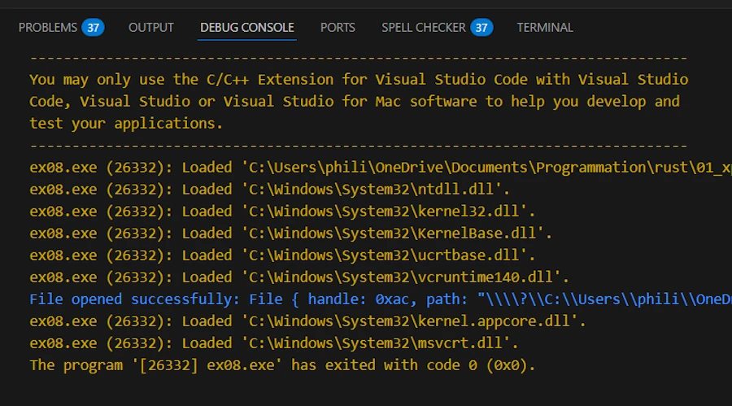

# Rust Error Handling, Demystified
{: .no_toc }

A beginner-friendly conversation on Errors, Results, Options, and beyond.
{: .lead }


<!-- <h2 align="center">
<span style="color:orange"><b> 🚧 This post is under construction 🚧</b></span>    
</h2> -->


### This is Episode 01
{: .no_toc }


<!-- ## TL;DR
{: .no_toc }

* For beginners.

* The code is on [GitHub](https://github.com/40tude/err_for_blog_post).

* **Rust has no exceptions:**  
    * **recoverable** errors (handled with the `Result<T, E>` type). 
    * **unrecoverable** errors (handled by panicking using `panic!()`). 
    * We must explicitly handle errors.

* **`Result<T, E>` enum:**  
    * Represents either success (`Ok(T)`) or error (`Err(E)`). 
    * Use `match` expression or methods like `.unwrap()/.expect()` (which `panic!()` on error). 
    * Prefer `.expect()` with a meaningful message.

* **`?` operator for propagation:**  
    * To propagate errors upward with a lite syntax.
    * Only works in functions returning a compatible `Result<T, E>` (or `Option<T>` ). 
    * When `main()` returns `Result<T, E>` we can use `?` here 

* **`Option<T>` vs `Result<T, E>`:**  
    * Use **`Option<T>`** when the **absence** of a value is not an error (e.g., no search result) and no error info is needed. 
    * Use **`Result<T, E>`** when an operation **can fail** in an exceptional way and we need to convey an error message or reason.

* **When to panic:** 
    * On bugs or invalid states in **our code** (e.g. asserting [invariant](#invariant)). 
    * If failure is possible in normal operation (e.g. invalid user input...), return a `Result<T, E>`. 
    * Library code should avoid panicking on recoverable errors, bubbles them up and let the caller decide.

* **Custom error types:** 
    * For sophisticated libraries or binaries.
    * Define our own error types to represent various error kinds in one type. 
    * Implementing `std::error::Error` (=> impl `fmt::Display` and `#[derive(Debug)]`)
    * Use pattern matching or helper methods like `.map_err()` (or the `From` trait implementation) to convert std lib errors into our custom error and return it with `?`

* **`anyhow` and `thiserror`**
    * **`anyhow`** in **binaries** when we don’t need a public, fine-grained error type and just want easy error propagation with `.context("blablabla")`.
    * **`thiserror`** in **libraries** when we need custom error types without writing all implementations for `Display`, `Debug`, `From` trait and `Error`. 
    * Don’t mix them blindly (anyhow inside the lib, thiserror API of the lib) 

* **From Experimentation to Production:**
    * ... -->

<!-- * **Keep in mind**

```rust
use std::fs::File; 
use std::io::Read;

pub type Error = Box<dyn std::error::Error>;
pub type Result<T> = std::result::Result<T, Error>;

fn main() -> Result<()> {
    let f = File::open("foo.txt")?;
    let mut data = vec![];
    f.File.read_to_end(&mut data)?;
    Ok(())
}
``` -->

<div align="center">
<br/>
<span>Let's have a beginner-friendly conversation on Errors, Results, Options, and beyond.</span>
</div>


#### Posts 
{: .no_toc }
* [Episode 00]()
* [Episode 01]()
* [Episode 02]()


## Table of Contents
{: .no_toc .text-delta}
- TOC
{:toc}


<!-- ###################################################################### -->
<!-- ###################################################################### -->
<!-- ###################################################################### -->


## Propagating Errors with `?` Operator

**Alice:** This `match` stuff is okay, but if I have to bubble up errors from multiple functions, writing a `match` expression in each function sounds painful.

**Bob:** You’re in luck – Rust has a convenience for that: the `?` operator. It’s a little piece of syntax that makes propagating errors much nicer.


**Alice:** I think I already saw `?` here and there in some Rust code. How does it work?

**Bob:** The `?` operator is essentially a shortcut for the kind of match-and-return-on-Err logic we’ve been writing. When we append `?` to a `Result<T, E>` (or an `Option<T>`), it will check the result: 
* If it’s Ok , it *unwraps* the value inside and lets our code continue
* If it’s an Err, it **returns that error from the current function** immediately, *bubbling* it up to the caller. This means we don’t have to write the `match` ourself, `?` does it for us.


**Alice:** So it returns early on error? Nice, that’s like exceptions but checked at compile time.

**Bob:** Right, it’s analogous to exception propagation but explicitly done via return values. Let’s refactor a source code that use `match` expressions into one using `?` operator. First copy/paste and execute (CTRL+ENTER) the code below in [Rust Playground](https://play.rust-lang.org/?version=stable&mode=debug&edition=2024). It works but... Too much `match` everywhere... 

```rust
use std::fs::File;
use std::io::{self, Read};

fn read_username_from_file() -> Result<String, io::Error> {
    let mut file = match File::open("username.txt") {
        Ok(file) => file,           // success, variable shadowing on file, continue
        Err(e) => return Err(e),    // early return
    };
    
    let mut username = String::new();
    
    match file.read_to_string(&mut username) {
        Ok(_) => Ok(username),      // success, returns
        Err(e) => Err(e),           // returns the error e
    }                               // no ; here
}

fn main() {
    match read_username_from_file() {
        Ok(name) => println!("Username: {name}"),
        Err(e) => eprintln!("Error reading username: {e}"),
    }
}
```
Now, modify the code above in Rust Playground and when it is working paste it, locally in `ex07.rs`.

```rust
// ex07.rs
use std::fs::File;
use std::io::{self, Read};

fn read_username_from_file() -> Result<String, io::Error> {
    let mut file = File::open("username.txt")?; // if Err, returns Err up
    let mut username = String::new();
    file.read_to_string(&mut username)?; // if Err, returns Err up
    Ok(username) // if we got here, all good
}

fn main() {
    // Use the function and handle any error here
    match read_username_from_file() {
        Ok(name) => println!("Username: {name}"),
        Err(e) => eprintln!("Error reading username: {e}"),
    }
}
```

While `ex07.rs` is open in VSCode:

* Set breakpoints on lines 7 and 15 
* Run the code (F5) 
* When the application is done, there is a file named `username.txt.bak` at the root of the project (`00_u_are_errors/`), rename it `username.txt`. 
* Restart the code (F5) 
* When the application is done, open and delete the content of `username.txt`
* Run the code (F5)


<div align="center">
<br/>
<!-- <span>Optional comment</span> -->
</div>


**Bob:** First thing first. Do you see the return type in the signature of `read_username_from_file()`. I confirm, hopefully we can return `Result<T, E>` from our functions.
* At the end of the function, if everything went well we return `OK(username)`
* Otherwise we bubble up the errors with the help of the `?` operator. Do you see those `?` after `File::open` and `read_to_string`? If either operation fails, the function returns a `Err(io::Error)` back to the caller.  


This pattern is so common that using `?` is idiomatic. It makes the code much cleaner by avoiding all the boilerplate of matching and returning errors manually. 


**Alice:** That’s much shorter! And in `main()` we decided to handle the error with a `match` . Could I propagate the error from `main()` as well?

**Bob:** This is a very good point. In fact, yes we can! In "modern" Rust, the `main()` function itself can return a `Result<T, E>` (or any type that implements the [`Termination` trait](https://doc.rust-lang.org/std/process/trait.Termination.html), like `Result<T, E>` does). 

This is a feature that let us use `?` even in `main()` . For example:

```rust
// ex08.rs
use std::error::Error;
use std::fs::File;

fn main() -> Result<(), Box<dyn Error>> {
    let file = File::open("username.txt")?; // if this errors, `main()` will return Err
    println!("File opened successfully: {:?}", file);
    Ok(())
}
```

<div align="center">
<br/>
<!-- <span>Optional comment</span> -->
</div>

By writing `fn main() -> Result<(), Box<dyn Error>>`, we indicate that `main()` might return an error. The `Box<dyn Error>` is a trait object to mean any kind of error – it’s a convenient way to say our error could be of any type that implements the Error trait. 

Now, using `?` in `main()` is allowed because the error can be returned from `main()`. If an error occurs, the runtime will print the error and exit with a non-zero status code. If `main()` returns `Ok(())` , the program exits normally with code 0. 

This is really nice for quick scripts – we can just propagate errors out of `main()` and let the program crash gracefully with an error message,
rather than writing a lot of error handling in `main()`.


We can go one step further with the code below:

```rust
// ex09.rs
use std::fs::File;

type Result<T> = std::result::Result<T, Box<dyn std::error::Error>>; // Type Alias

fn main() -> Result<()> {
    let file = File::open("username.txt")?;
    println!("File opened successfully: {:?}", file);
    Ok(())
}
```

It does exactly the same thing but thanks to type aliases, we lighten the signature of `main()`. Note that the line `use std::error::Error;` is no longer necessary.


**Alice:** So `?` can be used in any function that returns a `Result<T, E>` or `Option<T>` right?

**Bob:** Correct. The rule is: we can use `?` in a function if the return type of that function can absorb the error. Typically, that means if our function returns a `Result<T, E>`. We can use `?` on another `Result<T, E2>` as long as `E2` can convert into `E`. Usually they’re the same `E` or there’s an implementation of the `From` trait to convert one error into the other. Rust does this conversion automatically in many cases. 

For example, below, the `main()` returns a `Result<T, Box<dyn Error>>`, but calls `parse::<i32>()`, which returns a `ParseIntError`. Rust performs the conversion automatically using `From<ParseIntError>` for `Box<dyn Error>`.

```rust
// ex10.rs
type Result<T> = std::result::Result<T, Box<dyn std::error::Error>>;

fn parse_number(s: &str) -> Result<i32> {
    // `parse::<i32>()` returns Result<i32, ParseIntError>
    // The `?` operator works here because ParseIntError implements
    // the `Error` trait, and Rust knows how to convert it into Box<dyn Error>.
    let n: i32 = s.parse()?;
    Ok(n)
}

fn main() -> Result<()> {
    let value = parse_number("123sdfsdf")?;
    println!("Parsed value: {value}");
    Ok(())
}

```

If our function returns `Option<T>` , we can use `?` on another `Option<T>`. If it’s `None`, our function returns `None` early. Play with the code below : 

```rust
// ex11.rs

fn first_char_upper(s: &str) -> Option<char> {
    // `first_char_upper()` returns Option<char>
    // `chars().next()` returns Option<char>
    // => we can use `?` at the end of s.chars().next()
    // If it's None, the function returns None early
    let c = s.chars().next()?;
    Some(c.to_ascii_uppercase())
}

fn main() {
    println!("{:?}", first_char_upper("hello")); // Some('H')
    println!("{:?}", first_char_upper("")); // None
}
```

Please note that the code below would work as well.

```rust
fn first_char_upper(s: &str) -> Option<f64> {
    let c = s.chars().next()?; // c: char
    Some(42.0)
}
```

It compiles without any problems because the `?` always outputs a char but the compiler doesn't care that our function returns an `Option<f64>`. It just checks that the `?` “absorbs” the `Option<char>` by returning `None` when necessary. Then it's up to us to transform the char into whatever we want (in this case, an `f64`).


One thing to remember: **we can’t mix** return types with `?`. For example, if our function returns a `Result`, we can’t directly use `?` on an `Option<T>` without converting it (and vice versa). For example the code below does not compile : 

```rust
// ex12.rs
// ! DOES NOT COMPILE

use std::fs::File;

fn bad_example() -> Option<File> {
    // `File::open` returns Result<File, io::Error>
    // But our function returns Option<File>.
    // The compiler rejects this because it cannot convert Result into Option automatically.
    let file = File::open("username.txt")?;
    Some(file)
}

fn main() {
    let f = bad_example();
    println!("{:?}", f);
}
```

See part of the message from the compiler on build :

```
error[E0277]: the `?` operator can only be used on `Option`s, not `Result`s, in a function that returns `Option`
   |
 8 | fn bad_example() -> Option<File> {
   | -------------------------------- this function returns an `Option`
...
12 |     let file = File::open("username.txt")?;
   |                                          ^ use `.ok()?` if you want to discard the `Result<Infallible, std::io::Error>` error information
```


There are helper methods like [`.ok_or()`](https://doc.rust-lang.org/std/option/enum.Option.html#method.ok_or) to turn an `Option<T>` into a `Result<T, E>` if needed. See below :

```rust
// ex13.rs
type Result<T> = std::result::Result<T, Box<dyn std::error::Error>>;

fn get_first_char(s: &str) -> Result<char> {
    // Convert Option<char> into Result<char, String>
    s.chars().next().ok_or("String was empty".into())
}

fn main() -> Result<()> {
    let c1 = get_first_char("hello")?;
    println!("First char: {c1}");

    let c2 = get_first_char("")?; // This will return Err
    println!("First char: {c2}");

    Ok(())
}
```


**Alice:** Understood. I really like how `?` reduces the clutter. It reads almost like normal linear code, but errors just get propagated automatically.

**Bob:** Exactly. It’s one of the features that make Rust’s error handling ergonomic. Just be sure that when we use `?`, we know what error type our function is returning and that it’s appropriate to let it bubble up to the caller.


### Summary – Propagating Errors with `?`

{: .new-title }
> Summary – Propagating Errors with `?`
>
* **`?` operator:** A shorthand for propagating errors. It unwraps the `Ok()` value or returns the error to the caller if it’s an `Err()`, effectively doing the `match` + `return Err(...)` for us. This simplifies error handling in functions that just want to pass errors up the chain.
* **Usage requirements:** We can only use `?` in a function that returns a compatible type (e.g., if the function returns `Result<T, E>` or `Option<T>`). Using `?` on a `Result<T, E>` in a function returning `Result<T, E>` will propagate the error; using it in `main()` requires `main()` to return a `Result<T, E>` as well. If we try to use `?` in a function that returns `()` (unit type) or another type that can’t represent an error, the code won’t compile – the compiler will remind we to change the return type or handle the error another way.
* **Converting error types:** When using `?`, if the error type of the `Result<T, E>` you’re handling doesn’t exactly `match` our function’s error type, it will attempt to convert it via the `From` trait. This allows different error types to be mapped into one error type for our function (for example, converting a `std::io::Error` into our custom error type). If no conversion is possible, you’ll get a type mismatch compile error, which we can resolve by using methods like `.map_err()` or implementing `From` for our error.
* **`main()` can return `Result<T, E>`:** To use `?` at the top level, we can have `main()` return `Result<(), E>`. This way, any `Err` that propagates to `main()` will cause the program to exit with a non-zero status and print the error. For example, `main() -> Result<(), Box<dyn std::error::Error>>` is a common choice to allow using `?` in `main()` 
* Let's keep this snippet in mind
    ```rust
    type Result<T> = std::result::Result<T, Box<dyn std::error::Error>>;
    fn main() -> Result<()> {
        // ...
        Ok(())
    }
    ```


### Exercises – Propagating Errors

1. **Refactor with `?` :** 
* Take one of our functions from the previous exercises (for instance, a file-reading function or the number-parsing function) that handled errors with `match`. 
* Change it to return a `Result<T, E>` instead of, say, defaulting to a value, and use the `?` operator to propagate errors to the caller. For example, change a `parse_number` that returned 0 on error to instead return `Result<i32, std::num::ParseIntError>` and use `?` inside. 
* Then handle the error at the top level (maybe in `main()`) by printing an error.


2. **Chain calls with `?`:** 
* Write two short functions: `fn get_file_contents(path: &str) -> Result<String, std::io::Error>` that opens and reads a file (using `?`), and `fn count_lines(path: &str) -> Result<usize, std::io::Error>` that calls `get_file_contents` (using `?`) and then returns the number of lines in the file. 
* In `main()`, call `count_lines(somefile.txt)` and handle the error with a `match` or by returning a `Result<T, E>` from `main()` using `?`. 
* This will give us practice in propagating errors through multiple levels.

3. **Using ? with Option:** 
* Write a function `last_char_of_first_line(text: &str) -> Option<char>` that returns the last character of the first line of a string, or `None` if the string is empty or has no lines. 
* Hint: We can use `text.lines().next()?` to get the first line, and then `chars().last()` on that line.
* The `?` will return early with `None` if there is no first line 
* Test it with an empty string, a single-line string, and a multi-line string.


<!-- ###################################################################### -->
<!-- ###################################################################### -->
<!-- ###################################################################### -->

## `Option<T>` vs. `Result<T, E>`: Choosing the Right Type


**Alice:** OK... I think I get `Result<T, E>`. But what about [`Option<T>`](https://doc.rust-lang.org/std/option/enum.Option.html)? I’ve seen that too. Is `Option<T>` also for error handling?

**Bob:** [`Option<T>`](https://doc.rust-lang.org/std/option/enum.Option.html) is a sibling to `Result<T, E>` in a way. It’s an `enum` that can be `Some(T)` or `None`. It doesn’t carry an error value like `Result<T, E>` does. `None` just means **absence of a value**. We usually use `Option<T>` when an outcome isn’t an error, but just "no value found" or "not applicable". For example, a function that searches for a substring in a string might return an `Option<usize>` – `Some(index)` if found, or `None` if not found. Not finding the substring isn’t really an "error", it’s an expected possibility.


**Alice:** So the difference is that 
* `Result<T, E>` provides the reason for the error (`E`)
* `Option<T>` gives us nothing on failure

**Bob:** In the case on `Option<T>` I would not say "on failure" because "we don't know". Again, if we need to know **why** something went wrong, we must use `Result<T, E>` because `Option::None` carries no data. If we call a function and get a `None`, we only know that there was no result, not why. With `Result::Err`, we usually get an error type or message explaining the issue.


Also, there’s a **semantic difference**. Other developers reading our code will usually interpret a return type of `Option<T>` as "`None` means not found or not present, which might be normal", whereas `Result<T, E>` means "`Err` means an error occurred during the operation". It’s about expectation. So, using the right return type is a form of communication.


Sometimes we even see combinations, like `Result<Option<T>, E>`. This means the operation itself can fail with an error `E`, or it can succeed and return either `Some(T)` (a value was found) or `None` (no value was found). But that’s an advanced usage.


**Alice:** Can you show me a simple comparison?

**Bob:** Sure. Let’s take a trivial scenario: safe division. Suppose we want to divide two numbers, but if the divisor is zero, that’s not a valid operation. We have two design choices: return an `Option<f64>` (where `None` means division by zero was not possible), or return a `Result<f64, String>` to explicitly signify an error. Here’s what both might look like:


```rust
// ex14.rs

// Using Option: No error message, just None if invalid
fn safe_divide_option(a: f64, b: f64) -> Option<f64> {
    if b == 0.0 {
        None // indicate failure without detail
    } else {
        Some(a / b)
    }
}

// Using Result: Provide an error message on failure
fn safe_divide_result(a: f64, b: f64) -> Result<f64, &'static str> {
    if b == 0.0 {
        Err("Division by zero") // error string explaining the issue
    } else {
        Ok(a / b)
    }
}

fn main() {
    let x = safe_divide_option(10.0, 0.0);
    let y = safe_divide_result(10.0, 0.0);
    println!("Option version: {:?}", x); // None
    println!("Result version: {:?}", y); // Err("Division by zero")
}
```


* In `safe_divide_option`, if `b` is zero we return `None`. The caller must check for `None` but doesn’t get an automatic reason. They just know it didn’t produce a result. 
* In `safe_divide_result`, if `b` is zero we return an `Err` with a message (here a static `&str` slice, but it could be a more complex error type). The caller on receiving an `Err` knows it was an exceptional case and has a message to work with.

Neither approach is wrong here. It depends on how we view division by zero. If we consider it an error (I would vote for), `Result<T, E>` is suitable. If we treat it like "just no valid answer" and move on without an error context, `Option<T>` could suffice.

The key question to ask: **Is the absence of a value an error condition, or is it an expected case?** If it’s normal/expected (like searching in a map for a key that might not be there), use `Option<T>`. If it’s an error (like couldn’t parse config file), use `Result<T, E>` so we can report what went wrong.


**Alice:** Crystal clear, thanks. And I assume we can use the `?` operator with `Option<T>` similarly, as long as our function returns an `Option<T>`?

**Bob:** Yes, and we already touched on that (see `ex11.rs`). If we use `?` on an `Option<T>` and it’s `None`, it will return `None` from our function early. It’s handy when chaining multiple things that might produce no value. 

But remember, we can’t mix `Result<T, E>` and `Option<T>` with `?` without converting. For example, if we have a `Result<T, E>` and we want to use `?` in a function returning `Option<T>`, we would need to convert that `Result<T, E>` into an `Option<T>` (perhaps by ignoring the error or converting error to `None`). Usually, though, we keep to one or the other in a given function.


You can review `ex13.rs` above where we converted `Option<char>` into `Result<char, String>` but here is an additional sample code where the function returns an `Option<T>` to `main()`:

```rust
// ex15.rs

use std::fs::File;
use std::io::Read;

fn read_file_to_string_as_option(path: &str) -> Option<String> {
    let mut file = File::open(path).ok()?;
    let mut buf = String::new();
    file.read_to_string(&mut buf).ok()?;
    Some(buf)
}

fn main() {
    let existing = "Cargo.toml";
    let missing = "_definitely_missing_.txt";

    println!("--- read_file_to_string_as_option ---");
    match read_file_to_string_as_option(existing) {
        Some(s) => println!("OK: read {} bytes from {existing}", s.len()),
        None => println!("None: could not read {existing}"),
    }
    match read_file_to_string_as_option(missing) {
        Some(s) => println!("OK: read {} bytes from {missing}", s.len()),
        None => println!("None: could not read {missing}"),
    }
}
```


Here is what you should see in the terminal

```
OK: read 167 bytes from Cargo.toml
None: could not read _definitely_missing_.txt
```

* `read_file_to_string_as_option()` read the whole file if possible, otherwise it returns `None`. 
* We decided (don't ask me why) to "intentionally" ignore the error details by converting `Result<T, E>` to `Option<T>` with `.ok()`, so that the `?` operator can be used in the function. Double check:
    * `open()` returns `Result<File, io::Error>`. We convert it to `Option<File>` with `.ok()`, then `?` works with `Option`
    * Same strategy with `read_to_string()` which returns `Result<usize, io::Error>`


**Alice:** I don't get the point, we're losing sight of why the failure is happening!

**Bob:** You are right. We may be asked to design an API acting that way (drop the error and return `None` on failure). It is a choice. Now, if it is really a concern we can add some **observability**. We keep the `Option<T>` API for the caller (so failures collapse to `None`), but we emit/log diagnostics so that the failures are not invisible. See below an example:

```rust
// ex16.rs
use std::fs::File;
use std::io::Read;

fn read_with_logging(path: &str) -> Option<String> {
    let mut file = File::open(path)
        .map_err(|e| {
            eprintln!("[read_with_logging] open error: {e}");
            e
        })
        .ok()?; // Result<File, io::Error> -> Option<File>

    let mut buf = String::new();
    file.read_to_string(&mut buf)
        .map_err(|e| {
            eprintln!("[read_with_logging] read error: {e}");
            e
        })
        .ok()?; // Result<usize, io::Error> -> Option<usize>

    Some(buf)
}

fn main() {
    let existing = "Cargo.toml";
    let missing = "_definitely_missing_.txt";

    match read_with_logging(existing) {
        Some(s) => println!("OK: read {} bytes from {existing}", s.len()),
        None => println!("None: could not read {existing}"),
    }
    match read_with_logging(missing) {
        Some(s) => println!("OK: read {} bytes from {missing}", s.len()),
        None => println!("None: could not read {missing}"),
    }
}
```

You should read the following in the terminal: 

```
OK: read 167 bytes from Cargo.toml
[read_with_logging] open error: Le fichier spécifié est introuvable. (os error 2)
None: could not read _definitely_missing_.txt
```

* With `existing` file, everything works smoothly. At the end, in `main()` we print the number of bytes in the file. Nothing is logged because there is no error.
* With `missing`, `read_with_logging()` log a message then returns immediately. Note how [`.map_err()`](https://doc.rust-lang.org/std/result/enum.Result.html#method.map_err) is used on a `Result<T, E>` and how the calls `read_to_string().map_err().ok()` are daisy chained. 

{: .note-title }
> Side Note
>
> Do not start grumbling... We will discuss `.map_err()` in detail in the Custom Error Types section, later. For now keep in mind that on error, `.map_err()` we log an explanation and propagate (not early return) the error (`e`) to `.ok()?`.


### Summary – `Option<T>` vs `Result<T, E>`

{: .new-title }
> Summary – `Option<T>` vs `Result<T, E>`
>
* **Use `Option<T>` for expected no value scenarios:** If not finding or not having a value is a normal possibility (not an error), `Option<T>` **communicates** that clearly. `None` carries no error info – it just means no result.
* **Use `Result<T, E>` for error scenarios:** If an operation can fail in a way that is considered an error (and especially if we need to know *why* it failed), use `Result<T, E>` so we can provide an error message or error type. `Err(E)` can hold information about what went wrong.
* **Semantic clarity:** Other developers will interpret `Option<T>` and `Result<T, E>` in our APIs as triggers. 
    * `Option<T>` implies the caller should expect the nothing case and it’s not an exceptional error
    * `Result<T, E>` implies the caller should expect the possibility of an error condition that should be handled or propagated. 
Examples:
* A lookup in a map (key might be missing) -> return `Option<T>` (absence is normal if key not present)
* Parsing input (could fail due to external conditions or bad format) -> return `Result<T, E>` with an error explaining the failure
* **Failure is not an option:** It's must be clear in your mind when choosing between `Option<T>` vs `Result<T, E>`


<div align="center">
<iframe width="560" height="315" src="https://www.youtube.com/embed/Tid44iy6Rjs?si=eJfnsc8fjGXTqwhq" title="YouTube video player" frameborder="0" allow="accelerometer; autoplay; clipboard-write; encrypted-media; gyroscope; picture-in-picture; web-share" referrerpolicy="strict-origin-when-cross-origin" allowfullscreen></iframe>
</div>


* **`?` works with both:** We can propagate `None` early from a function returning `Option<T>` using `?` just like we can propagate errors from `Result<T, E>` with `?`. Just ensure the function’s return type matches (`Option<T>` with `Option<T>`, `Result<T, E>` with `Result<T, E>`).


### Exercises – Option<T> vs `Result<T, E>`
1. Can you find `Option<T>` in the std lib documentation?

1. **Design Decisions:** For each of the following scenarios, decide whether `Option<T>` or `Result<T, E>` is more appropriate as a return type and briefly explain why:
* A function `find_user(username: &str) -> ???` that searches a database for a user and either returns a User object or indicates the user was not found.
* A function `read_config(path: &str) -> ???` that reads a configuration file and returns a configuration object. (What if the file is missing or has invalid contents?)
* A function `index_of(text: &str, ch: char) -> ???` that returns the index of a character in a string, or something if the char isn’t present.

1. **Converting `Option<T>` to `Result<T,E>`:** Write a function `get_env_var(name: &str) -> Result<String, String>` that tries to read an environment variable and returns an error message if it’s not set. 
* `std::env::var(name)` actually returns a `Result`, but pretend it gave us an `Option<String>` 
* How would we convert that `Option<T>` to a `Result<T, E>`? 
* We can use `.ok_or(error message)` on the `Option<T>` to turn a `None` into an `Err`

1. **Mixing `Option<T>` and `Result<T,E>`:** Sometimes we have to deal with both. Imagine a function that tries to get a configuration value from either an environment variable or a config file: `fn get_config_value(key: &str) -> Result<Option<String>, ConfigError>`. This returns `Ok(Some(val))` if found, `Ok(None)` if not found in either place, or `Err(e)` if an error occurred (like file read error). 
* Outline how we would implement this: we might first try env var (which gives `Option`), then file (`Result`), and combine them
* Don’t worry about full code. Focus on how you’d handle the types
* This is to think about how to combine `Option<T>` and `Result` logically


<!-- ###################################################################### -->
<!-- ###################################################################### -->
<!-- ###################################################################### -->


## To `panic!()` or Not to `panic!()`

**Alice:** Alright... Now I understand recoverable errors. But what about unrecoverable ones? When should I actually use [`panic!()`](https://doc.rust-lang.org/std/macro.panic.html) intentionally?

**Bob:** Panicking is basically saying *this is a fatal problem, abort the mission!* We should use `panic!()` for situations where continuing the program could lead to incorrect results, security vulnerabilities, or when the error is totally unexpected and we don’t have a meaningful way to handle it.

Think of it this way: 
* If failure is something we *expect might happen* occasionally (like a file might not be found, user input might be bad, etc.), we should **not** panic — use `Result<T, E>` and handle it. 
* If something happening indicates a bug in **our code** or an impossible situation (like *this array index should never be out of bounds, something is really wrong*), then jumping thru the window (panicking IOW) is acceptable.


**Alice:** So this happen mostly in cases of logic errors or impossible states. Right?

**Bob:** Exactly. For instance, the standard library panics if we attempt out-of-bounds array access, because that’s a bug in **our code** (we miscalculated an index) and there’s no way to recover or proceed sensibly. The program is in a bad state, so it stops. Another example: if we have a function that absolutely requires a valid, non-null pointer (say, something we built using unsafe code), we might panic if it receives a null pointer. Indeed, that situation should never occur if **our code** is correct.


Panic is also often used to indicate *programmer errors* (violating function contracts). If we document that a function must be called with, say, a positive number, we might choose to panic if someone passes a negative, because the caller violated the API contract. This is not something we want to handle at runtime; it should be fixed in the code. [The Rust Book](https://doc.rust-lang.org/book/ch09-03-to-panic-or-not-to-panic.html#guidelines-for-error-handling) discusses that: when a function’s contract is violated, a panic(with a clear message) is appropriate since it’s the **caller’s bug**, and we want them to notice and fix it.


**Alice:** And in testing, panics are fine because a failed `assert!()` or `.unwrap()` will just fail the test, right?

**Bob:** Yes, exactly. In tests, we often use panics (e.g., `assert!()` macros or `.unwrap()`) to immediately fail a test when an invariant isn’t met. That’s a valid use of panic. We *want* to stop if something unexpected happens in a test.

Also, small quick-and-dirty code snippets might sprinkle `.unwrap()` for brevity if you’re OK with them crashing on error. But in a robust application or library, you’d use panic very sparingly.

There’s also the consideration of library vs binary (application) code. 
* If you’re writing a library, we should almost never panic on a recoverable error. Indeed, that takes the decision away from the library user (the programmer using our library, the consumer). Instead, return a `Result<T, E>` and let them decide. We only panic in a library if it’s a severe **internal** invariant violation or we literally can’t do anything (and ideally, document that it might panic in that case). 
* In application (binary) code, we control the whole program. We might choose to `panic!()` on certain errors if it simplifies things. Even then we should `panic!()` only when it’s truly unrecoverable or we are OK with the program terminating.


**Alice:** What about using a lot of `.unwrap()` in my code? Is that considered bad?

**Bob:** Frequent use of `.unwrap()` is usually a code smell (except in code examples or tests). Each `.unwrap()` is a potential `panic!()` point. It’s fine if we are 100% sure it can’t fail (like we just checked a condition that guarantees it, or it’s in a context where a crash is acceptable). But if an error is possible and we `.unwrap()`, we are basically ignoring the error and we crash instead of handling it. Often it’s better to handle the error or to propagate it. If we find ourself writing many `.unwrap()`s, we should think about using `?` to propagate or handle errors more gracefully.


To sum up:
* Use `panic!()` (or `.unwrap()`, etc.) for **bugs** and **unexpected** **conditions**. Things that should never happen if **our code** is correct.
* Use `Result<T, E>` for errors that we *expect could happen* in normal usage (and thus might want to recover from).


**Alice:** That’s clear. The Rust Book even has a section title "To panic! or Not to panic!" I think.

**Bob:** Yes, and the summary is pretty much what we discussed. One line [from it](https://doc.rust-lang.org/book/ch09-03-to-panic-or-not-to-panic.html): *"when failure is expected, it’s more appropriate to return a `Result<T, E>` than to make a `panic!()` call"*. Only `panic!()` when failure indicates a bug or something so bad that there’s no point in continuing.


One more tip: if we do `panic!()`, let's do it with a helpful message. For example, if a function shouldn’t get a negative number, let's code: 

```rust
panic!("Negative value provided: {}", value);
```

This beats a cryptic panic or (worse) a silent misbehavior. It makes debugging easier by clearly pointing out what went wrong.

And of course, remember that panicking will [unwind the stack](https://doc.rust-lang.org/nomicon/unwinding.html) by default, which cleans up but takes some overhead. In performance-critical or embedded scenarios, sometimes Rust programs are configured to abort immediately on panic!() (no unwind). Remember what we said earlier. If needed, in `Cargo.toml` add the following section:

```toml
[profile.release]
panic = "abort"
```

But that’s an advanced detail. The key point is: `panic!()` = crash. Use with care.


### Summary – Using (or Avoiding) `panic!()`

{: .new-title }
> Summary – Using (or Avoiding) `panic!()
>
* **Expected errors -> `Result<T, E>`, Unexpected errors -> `panic!()`:** If an error condition is something we can anticipate and might want to handle (file not found, invalid input, network timeout), **do not panic**. Use `Result<T, E>` and propagate or handle it. If something is truly unexpected or a bug in **our code** (index out of bounds, violated invariant), a `panic!("msg")` is appropriate to immediately stop the program.
* **Library vs Application code:** 
    * **Libraries** should prefer `Result<T, E>` for errors and avoid panicking, except for internal bugs, because panics in a library will crash the user’s application. 
    * **Applications** (especially very small ones) might use `panic!()`, `.unwrap()`, `.expect()` in places where it’s acceptable for the program to crash (or during development to catch bugs). But even here I'm so no convinced. Indeed we should investigate bugs with a Debugger. For the rest, you will understand my point of view reading the section "Errors from Experimentation to Production". 
* **Use meaningful panic messages:** If we use `panic!()` or `.expect() `, provide context. E.g., `panic!("Negative value provided: {}", value)` is better than a blank panic. This helps debugging by indicating why the panic happened.
* **Minimize `.unwrap()` in code:** Every `.unwrap()` is a potential crash. We use it only when we're sure there's no error (or in test code). Prefer to handle or propagate errors instead. Replacing `.unwrap()` with `?` or proper error handling will make our code more robust.
* **Examples of when to panic:**
    * Out-of-range indexing (bug in **our code**) -> standard library panics (cannot recover safely).
    * Asserting a condition in code (`assert!()` macro) -> panics if the condition is false, useful in tests or to validate internal invariants.
    * Contract violations -> e.g., our function got an invalid argument that should have been prevented by earlier checks. We panic to signal programmer error, after possibly using Rust’s type system to avoid such cases where possible.


### Exercises – Panic vs Result

1. **Spot the Panic:** Take a piece of code (perhaps one of our previous exercise solutions) where we used `.unwrap()` or `.expect()`. What would happen if that line did encounter an error? Is it truly a scenario that should crash the program? Modify the code to handle the error with a `Result<T, E>` if appropriate. If you decide to keep the `.unwrap()`, justify why it is OK (for example, if it’s in a test or if logic guarantees the `Result<T, E>` is `Ok()`).

2. **Design a Robust Function:** Imagine you’re writing a library function `fn send_email(address: &str, body: &str) -> Result<(), SendError>`. 
* Come up with two or three different reasons it might fail (e.g., invalid address format, network outage). 
* For each, decide if it should return an error (`Result::Err`) or panic. Explain your reasoning. Hint: as a library function, it should likely return errors for anything that can go wrong due to external factors or bad input, rather than panicking. Panics should be reserved for something like an invariant violation **inside** the library.

3. **Deliberate Panic:** Write a small program that deliberately panics (for example, by indexing an array out of bounds or using `panic!()` directly with a message). Run it to see what the panic message and backtrace look like. Enable backtrace by running the program with `RUST_BACKTRACE=1` environment variable (under WIN11 you can use `$env:RUST_BACKTRACE=1; cargo run -p u_are_errors --example my_panic_code` in a terminal).


<!-- ###################################################################### -->
<!-- ###################################################################### -->
<!-- ###################################################################### -->


#### Posts 
{: .no_toc }
* [Episode 00]()
* [Episode 01]()
* [Episode 02]()
