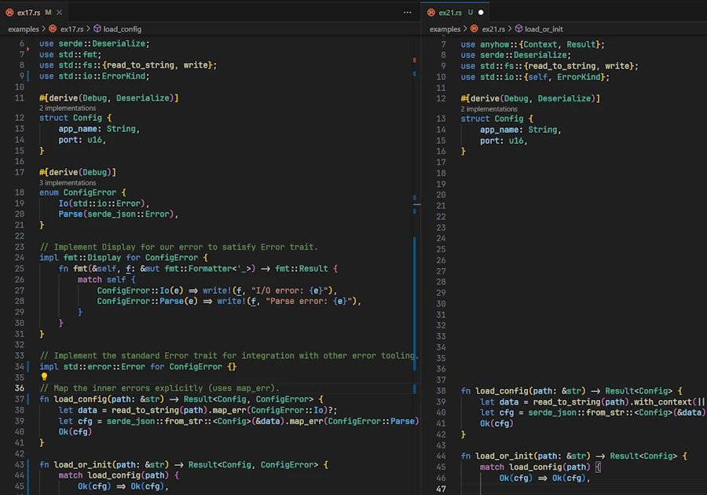

# Rust Error Handling, Demystified
{: .no_toc }

A beginner-friendly conversation on Errors, Results, Options, and beyond.
{: .lead }


<h2 align="center">
<span style="color:orange"><b> 🚧 This post is under construction 🚧</b></span>    
</h2>

### This is Episode 02
{: .no_toc }


<!-- ## TL;DR
{: .no_toc }

* For beginners.

* The code is on [GitHub](https://github.com/40tude/err_for_blog_post).

* **Rust has no exceptions:**  
    * **recoverable** errors (handled with the `Result<T, E>` type). 
    * **unrecoverable** errors (handled by panicking using `panic!()`). 
    * We must explicitly handle errors.

* **`Result<T, E>` enum:**  
    * Represents either success (`Ok(T)`) or error (`Err(E)`). 
    * Use `match` expression or methods like `.unwrap()/.expect()` (which `panic!()` on error). 
    * Prefer `.expect()` with a meaningful message.

* **`?` operator for propagation:**  
    * To propagate errors upward with a lite syntax.
    * Only works in functions returning a compatible `Result<T, E>` (or `Option<T>` ). 
    * When `main()` returns `Result<T, E>` we can use `?` here 

* **`Option<T>` vs `Result<T, E>`:**  
    * Use **`Option<T>`** when the **absence** of a value is not an error (e.g., no search result) and no error info is needed. 
    * Use **`Result<T, E>`** when an operation **can fail** in an exceptional way and we need to convey an error message or reason.

* **When to panic:** 
    * On bugs or invalid states in **our code** (e.g. asserting [invariant](#invariant)). 
    * If failure is possible in normal operation (e.g. invalid user input...), return a `Result<T, E>`. 
    * Library code should avoid panicking on recoverable errors, bubbles them up and let the caller decide.

* **Custom error types:** 
    * For sophisticated libraries or binaries.
    * Define our own error types to represent various error kinds in one type. 
    * Implementing `std::error::Error` (=> impl `fmt::Display` and `#[derive(Debug)]`)
    * Use pattern matching or helper methods like `.map_err()` (or the `From` trait implementation) to convert std lib errors into our custom error and return it with `?`

* **`anyhow` and `thiserror`**
    * **`anyhow`** in **binaries** when we don’t need a public, fine-grained error type and just want easy error propagation with `.context("blablabla")`.
    * **`thiserror`** in **libraries** when we need custom error types without writing all implementations for `Display`, `Debug`, `From` trait and `Error`. 
    * Don’t mix them blindly (anyhow inside the lib, thiserror API of the lib) 

* **From Experimentation to Production:**
    * ... -->

<!-- * **Keep in mind**

```rust
use std::fs::File; 
use std::io::Read;

pub type Error = Box<dyn std::error::Error>;
pub type Result<T> = std::result::Result<T, Error>;

fn main() -> Result<()> {
    let f = File::open("foo.txt")?;
    let mut data = vec![];
    f.File.read_to_end(&mut data)?;
    Ok(())
}
``` -->

<div align="center">
<br/>
<span>Let's have a beginner-friendly conversation on Errors, Results, Options, and beyond.</span>
</div>


#### Posts 
{: .no_toc }
* [Episode 00]()
* [Episode 01]()
* [Episode 02]()


## Table of Contents
{: .no_toc .text-delta}
- TOC
{:toc}


<!-- ###################################################################### -->
<!-- ###################################################################### -->
<!-- ###################################################################### -->


## Custom Error Types and Error Handling in Larger Programs


**Alice:** So far we’ve talked about using the built-in errors (like `std::io::Error` or parsing errors). What about in bigger programs where different parts can error in different ways? How should I think about and then design my own error data types, if necessary?

**Bob:** As our Rust program grows, we might call many operations that can fail, potentially with different error types. We have a few choices:
* Use one catch-all error type everywhere (like `Box<dyn std::error::Error>` or a crate like `anyhow` in applications) to simplify things
* Define our own **custom error type** (usually an `enum` ) that enumerates all possible errors in our context, and convert other errors into our type.

Defining a custom error type is common in libraries, so that the library returns one consistent error type that our users can handle, instead of many disparate types.


**Alice:** How would a custom error look?

**Bob:** Usually as an `enum`, you know, the Rust's jewel of the crown. For example, imagine a program that needs to load a configuration file which is in JSON format. Things that could go wrong: file I/O could fail, or JSON parsing could fail. These are two different error types from std or crates (IO errors and parse errors). We might create an `enum` type definition like this:


```rust
// ex17.rs
use serde::Deserialize;
use std::fmt;
use std::fs::{read_to_string, write};
use std::io::ErrorKind;

#[derive(Debug)]
enum ConfigError {
    Io(std::io::Error),
    Parse(serde_json::Error),
}

// Implement Display for our error to satisfy Error trait.
impl fmt::Display for ConfigError {
    fn fmt(&self, f: &mut fmt::Formatter<'_>) -> fmt::Result {
        match self {
            ConfigError::Io(e) => write!(f, "I/O error: {e}"),
            ConfigError::Parse(e) => write!(f, "Parse error: {e}"),
        }
    }
}

// Implement the standard Error trait for integration with other error tooling.
impl std::error::Error for ConfigError {}
```

* `ConfigError` is an enum (a sum type). A value of this type is exactly one of its variants at a time. Here it has two possible variants:
    * `Io(...)` — a variant that carries one payload of type `std::io::Error`
    * `Parse(...)` — a variant that carries one payload of type `serde_json::Error`
* Keep in mind that [each enum variant is also a constructor of an instance of the enum](https://doc.rust-lang.org/book/ch06-01-defining-an-enum.html#:~:text=each%20enum%20variant%20that%20we%20define%20also%20becomes%20a%20function%20that%20constructs%20an%20instance%20of%20the%20enum).
    * Think about : `fn Io(e: std::io::Error) -> ConfigError{...}`

{: .warning-title}
> This is key
>
Each enum variant is also a constructor of an instance of the enum.


* Then we implement the `Display` trait for the data type `ConfigError`. 
    * This is mandatory. In VSCode, if we hover the word `Error` from `impl std::error::Error` we learn that to implement the `Error` trait for `ConfigError`, the later must implement `Debug` and `Display`. `Debug` is easy. It is implemented automatically thanks to the directive `#[derive(Debug)]`. Now, regarding `Display`, for each variant of the `enum` we explain how to `write!()` it so that they can print nicely. 

* Finally comes the empty implementation of `Error` for `ConfigError`. It is empty because the trait only have default methods which is the case here. In other words, the line officially registers our data type as a standard error, without any additional customization.


{: .note-title }
> Side Note
>
> If you don't feel confident with traits you can read this [series of posts]().


* Next, when we write the function `load_config()` we make sure it returns `Result<Config, ConfigError>`. See below :

```rust
fn load_config(path: &str) -> Result<Config, ConfigError> {
    let data = read_to_string(path).map_err(ConfigError::Io)?;
    let cfg = serde_json::from_str::<Config>(&data).map_err(ConfigError::Parse)?;
    Ok(cfg)
}
```

Now, fasten your seat belt and stay with me because what follows is a bit rock ‘n’ roll... In any case, **it took me a while** to really realize what was happening. Indeed, inside `load_config()`, if something bad happen we convert the current error into `ConfigError` with the help of `.map_err()`. Here is how :

* If it fails, `std::fs::read_to_string` returns a `Result<String, std::io::Error>`
    * `.map_err(ConfigError::Io)` is then executed
    * However, since you remember (you confirm, you remember) that each enum variant of `ConfigError` is also an initializer of the enum, when `.map_err(ConfigError::Io)` is executed, it calls the function `ConfigError::Io(e: std::io::Error) -> ConfigError` which constructs and returns a `ConfigError`
    * The `ConfigError` (which have the trait `std::error::Error`) is presented in front of the `?` operator
    * The `?` operator bubbles up the `ConfigError` immediately since in our case we said `std::fs::read_to_string` failed
* The same mechanics is at work on the next line 


* The caller of `load_config()` only have to handle `ConfigError`. Below we show a part of the `load_or_init()` function. The idea is to focus on how this works from the caller point of view :

<!-- It can `match` on whether it is `Io()` or `Parse()` if it wants to distinguish.  -->

```rust
fn load_or_init(path: &str) -> Result<Config, ConfigError> {
    match load_config(path) {
        ...
        Err(ConfigError::Parse(e)) => {
            eprintln!("Invalid JSON in {path}: {e}");
            Err(ConfigError::Parse(e))
        }
        ...
    }
}
```

* This is a `match` on the value returned by `load_config()`
* If the pattern matches `Err(ConfigError::Parse(e))`, the `.json` in invalid
* The function bubbles up (`Err(...)`) the error to the caller (`main()` here)

Let's have a look at the `main()` function.

```rust
fn main() -> Result<(), Box<dyn std::error::Error>> {
    write("good_config.json", r#"{ "app_name": "Demo", "port": 8080 }"#)?;
    write("bad_config.json", r#"{ "app_name": "Oops", "port": "not a number" }"#)?;

    let cfg = load_or_init("bad_config.json")?;
    println!("Loaded: {} on port {}", cfg.app_name, cfg.port);
    Ok(())
}
```

* Note that `main()` returns `Result<(), Box<dyn std::error::Error>>`
* This is cool because now we can use the `?` operator in the body of the `main()` at the end of certain lines
* Thanks to `Box<dyn std::error::Error>>`, it works even if the error data type from ``write()`` and `load_or_init()` are different. 


Expected output of the `ex17.rs` with ``bad_config.json``: 

```
Invalid JSON in bad_config.json: invalid type: string "not a number", expected u16 at line 1 column 44
Error: Parse(Error("invalid type: string \"not a number\", expected u16", line: 1, column: 44))
error: process didn't exit successfully: `target\debug\examples\ex17.exe` (exit code: 1)
```


Find below `ex17.rs` complete source code because **I hate** partial source code in blog posts that usually never works. 
* Feel free to copy/paste in Rust Playground
* In VSCode, set a breakpoint and take the time to go through the code line by line (F10). 

<div align="center">
<br/>
<span>Click the image to zoom in</span>
</div>


```rust
// ex17.rs
use serde::Deserialize;
use std::fmt;
use std::fs::{read_to_string, write};
use std::io::ErrorKind;

#[derive(Debug, Deserialize)]
struct Config {
    app_name: String,
    port: u16,
}

#[derive(Debug)]
enum ConfigError {
    Io(std::io::Error),
    Parse(serde_json::Error),
}

impl fmt::Display for ConfigError {
    fn fmt(&self, f: &mut fmt::Formatter<'_>) -> fmt::Result {
        match self {
            ConfigError::Io(e) => write!(f, "I/O error: {e}"),
            ConfigError::Parse(e) => write!(f, "Parse error: {e}"),
        }
    }
}

impl std::error::Error for ConfigError {}

fn load_config(path: &str) -> Result<Config, ConfigError> {
    let data = read_to_string(path).map_err(ConfigError::Io)?;
    let cfg = serde_json::from_str::<Config>(&data).map_err(ConfigError::Parse)?;
    Ok(cfg)
}

fn load_or_init(path: &str) -> Result<Config, ConfigError> {
    match load_config(path) {
        Ok(cfg) => Ok(cfg),

        Err(ConfigError::Io(ref e)) if e.kind() == ErrorKind::NotFound => {
            let default = Config { app_name: "Demo".into(), port: 8086 };
            // Map the write error to ConfigError so `?` compiles.
            write(path, r#"{ "app_name": "Demo", "port": 8086 }"#).map_err(ConfigError::Io)?;
            eprintln!("{path} not found, created with default config");
            Ok(default)
        }

        Err(ConfigError::Io(e)) => {
            eprintln!("I/O error accessing {path}: {e}");
            Err(ConfigError::Io(e))
        }

        Err(ConfigError::Parse(e)) => {
            eprintln!("Invalid JSON in {path}: {e}");
            Err(ConfigError::Parse(e))
        }
    }
}

fn main() -> Result<(), Box<dyn std::error::Error>> {
    write("good_config.json", r#"{ "app_name": "Demo", "port": 8080 }"#)?;
    write("bad_config.json", r#"{ "app_name": "Oops", "port": "not a number" }"#)?;

    let cfg = load_or_init("bad_config.json")?;
    println!("Loaded: {} on port {}", cfg.app_name, cfg.port);
    Ok(())
}
```


**Alice:** Got it. So if I have a module that does some operation, I should define an error type in that module representing things that can go wrong there, and use `?` to convert sub-errors into it, then bubble up to `main()`. That way, `main()` just sees my module’s error type (or I convert it further to something else or to `Box<dyn Error>` at the final boundary).

**Bob:** Exactly. Let’s do a quick mini-example of propagating an error from a module to `main()`. Suppose we have a module `math_utils` with a function that can fail:


```rust
// ex19.rs
mod math_utils {
    // This module could be in a file math_utils.rs
    #[derive(Debug)]
    pub enum MathError {
        DivisionByZero { numerator: f64 },
        NegativeLogarithm { value: f64 },
    }

    impl std::fmt::Display for MathError {
        fn fmt(&self, f: &mut std::fmt::Formatter<'_>) -> std::fmt::Result {
            match self {
                MathError::DivisionByZero { numerator } => write!(f, "Cannot divide {} by zero", numerator),
                MathError::NegativeLogarithm { value } => write!(f, "Logarithm of negative number ({})", value),
            }
        }
    }

    impl std::error::Error for MathError {}

    // Functions that return Result<_, MathError>
    pub fn divide(a: f64, b: f64) -> Result<f64, MathError> {
        if b == f64::EPSILON { Err(MathError::DivisionByZero { numerator: a }) } else { Ok(a / b) }
    }

    pub fn log10(x: f64) -> Result<f64, MathError> {
        if x < 0.0 { Err(MathError::NegativeLogarithm { value: x }) } else { Ok(x.log10()) }
    }
}

use math_utils::{divide, log10};
type Result<T> = std::result::Result<T, Box<dyn std::error::Error>>;

fn run() -> Result<()> {
    let my_log = log10(1024.0)?;
    println!("Log10 is {:.3}", my_log);

    let ratio = divide(10.0, 3.0)?;
    println!("Ratio is {:.3}", ratio);

    let bad_ratio = divide(5.0, 0.0)?;
    println!("This won't print because of error above ({})", bad_ratio);
    
    Ok(())
}

fn main() -> Result<()> {
    if let Err(e) = run() {
        eprintln!("Error: {}", e);
        std::process::exit(42);
    }
    Ok(())
}
```

Expected output:

```
Log10 is 3.010
Ratio is 3.333
Error: Cannot divide 5 by zero
error: process didn't exit successfully: `target\debug\examples\ex19.exe` (exit code: 42)
```

If we run this :
* `main()` calls the `run()` function
* There is no problem with `log10()`
* There is no problem with the first `divide()`
* The second `divide()` returns an `Err(MathError::DivisionByZero)` and the `?` bubbles up the error to the caller
* The `println!()` with `bad_ratio` is never executed 
* Back in `main()`, "Ooops, division by zero" is printed, thanks to `Display` implementation for `MathError`   
* Just for the fun, at this point, we return 42 and exit.


We could also catch the error in `main` with a `match` instead, and print something custom. But the point was to illustrate bubbling the error from a module up to `main()`. The key was to define `MathError` and to use it consistently. Each function in the module returns `MathError` on failure, and `run()` and `main()` can deal with `MathError`.


**Alice:** I think I have a much better understanding error handling in Rust now. Thanks.  

**Bob:** It’s a lot to take in at first, but once we get comfortable, we appreciate how Rust’s approach makes us think about errors up front. No more runtime surprises from unhandled exceptions. We decide what to do in each case. And keep in mind, for larger projects, there are crates like `thiserror` to reduce error boilerplate, and `anyhow` for quick-and-easy error handling in applications. Those can be handy, but the fundamentals of `Result<T, E>` and `?` we covered are the building blocks of it all.


### Summary – Custom Errors

{: .new-title }
> Summary – Custom Errors
>
* **Custom error types:** We can define our own error type (often an `enum` because our error can only have a value at a time) to represent errors in our application or library. This allows us to consolidate different error sources (IO, parsing, etc.) into one type and make our functions return that. It improves API clarity. Callers deal with one error type and can match on its variants.  
* **Implementing Error trait:** By implementing `std::error::Error` (which means implementing `fmt::Display` and having `#[derive(Debug)]`), our error type becomes interoperable with the standard ecosystem. It lets us use trait objects (`Box<dyn Error>`) if needed and makes our errors printable and convertible.  
* **Converting errors:** We use pattern matching or helper methods like `.map_err()` (or the `From` trait implementations) to convert underlying errors into our custom error variants. The `?` operator automatically convert errors if our custom error type implements `From` for the error thrown inside the function. This reduces a lot of manual code in propagating errors upward.  
    * Suppose we have an error `enum` `ConfigError { Io(io::Error), Parse(ParseError) }`. If a function reading a config file encounters an `io::Error`, we can do `.map_err(ConfigError::Io)?` to turn it into our error type and return it. The same for parse errors. Now the function returns `Result<Config, ConfigError>`, and the caller only has to handle `ConfigError`.  
* **Using `Box<dyn Error>`:** In application code, if we don’t want to define lots of error types, we can use `Box<dyn Error>` as a catch-all error type (since most errors in std lib implement `Error`). For example, `fn main() -> Result<(), Box<dyn std::error::Error>>` allows us to use `?` with any error that implements `Error` and just propagate it. This is convenient, but in library code you’d usually favor a concrete error type so that the API is self-documented.  


### Exercises – Custom Errors
1. **Define and Use a Custom Error:** Create an enum `MyError` with variants for two different error scenarios (for example, `MyError::EmptyInput` and `MyError::BadFormat(std::num::ParseIntError)`). Implement `std::fmt::Display` for `MyError` to provide human-readable messages. Then write a function `parse_nonempty_int(s: &str) -> Result<i32, MyError>` that returns an error if the input string is empty (`EmptyInput`) or if parsing to int fails (`BadFormat`). Use `?` and appropriate conversions (`map_err`) inside the function. Test it with various inputs (empty string, non-numeric, numeric).  

2. **Combine Two Error Types:** Suppose we have two functions `fn get_data() -> Result<String, io::Error>` and `fn parse_data(data: &str) -> Result<Data, ParseError>`. Write a new function `fn load_data() -> Result<Data, LoadError>` where `LoadError` is our custom enum that has variants for IO and Parse errors. In `load_data`, call `get_data()` and `parse_data()` using `?`, converting their errors into `LoadError` (we can implement `From<io::Error>` and `From<ParseError>` for `LoadError` or use `map_err`). Then try using `load_data()` in a `main` that prints different messages depending on which error occurred (hint: use `match e { LoadError::Io(e) => ..., LoadError::Parse(e) => ... }`).  

3. **Error Propagation in Modules:** Organize a small project with two modules: `network` and `database`. In `network`, create a function `fetch_data()` that might return a network-related error (we can simulate by just returning an `Err` variant like `NetworkError::Offline`). In `database`, create a function `save_data()` that might return a DB-related error (e.g., `DbError::ConnectionLost`). Then in `main`, write a function `run()` that calls `fetch_data` then `save_data`, propagating errors using `?`. Define a combined error type (enum with `Network(NetworkError), Database(DbError)`) to unify them for `run()`. Have `main` call `run()` and handle the unified error. This exercise will give we practice in designing error types and propagating across module boundaries.


<!-- ###################################################################### -->
<!-- ###################################################################### -->
<!-- ###################################################################### -->


## When and Why to Use `anyhow` and `thiserror` crates


**Alice:** You mentioned external crates like `anyhow` and `thiserror`. When should I reach for them?

**Bob:** Short version:  
- **`anyhow`** in **binaries** when we don’t need a public, fine-grained error type and just want easy error propagation with context.
- **`thiserror`** in **libraries** when we need ergonomic custom error types without writing all `impl` for `Display`, `Error`, and conversions.  


### anyhow - binaries (mnemonic: A, B, C...**A**nyhow, **B**inaries)

[`anyhow`](https://docs.rs/anyhow/latest/anyhow/) provides a type called `anyhow::Error` which is a dynamic error type (like `Box<dyn Error>` but with some extras such as easy context via `.context(...)`). It’s great for applications where we just want to bubble errors up to `main()`, print a nice message with context, and exit. Here is an example:

```rust
// ex20.rs
use anyhow::{Context, Result};
use std::fs;

// Result alias = Result<T, anyhow::Error>
fn run() -> Result<()> {
    let data = fs::read_to_string("config.json").context("While reading config.json")?; // adds context if it fails
    let cfg: serde_json::Value = serde_json::from_str(&data).context("While parsing JSON")?;
    println!("Config loaded: {cfg}");
    Ok(())
}

fn main() -> Result<()> {
    run()
}
```

Expected output:

```
Error: While reading config.json

Caused by:
    Le fichier spécifié est introuvable. (os error 2)
```

* Notice how adding `.context(...)` makes error messages much more actionable if something fails.
* Otherwise, the key point to understand the previous code is to realize that `Result` is a type alias for `Result<T, anyhow::Error>`.


**Alice:** OK... But could you show me how we should modify one of the previous code, you know, the one where we were reading JSON config file.

**Bob:** Ah, yes, you're right. Let's rework `ex17.rs` to see the impact and benefices. Tadaa!:

```rust
// ex21.rs
use anyhow::{Context, Result};
use serde::Deserialize;
use std::fs::{read_to_string, write};
use std::io::{self, ErrorKind};

#[derive(Debug, Deserialize)]
struct Config {
    app_name: String,
    port: u16,
}

fn load_config(path: &str) -> Result<Config> {
    let data = read_to_string(path).with_context(|| format!("failed to read config file: {path}"))?;
    let cfg = serde_json::from_str::<Config>(&data).with_context(|| format!("failed to parse JSON in: {path}"))?;
    Ok(cfg)
}

fn load_or_init(path: &str) -> Result<Config> {
    match load_config(path) {
        Ok(cfg) => Ok(cfg),
        Err(err) => {
            if let Some(ioe) = err.downcast_ref::<io::Error>() {
                if ioe.kind() == ErrorKind::NotFound {
                    let default = Config { app_name: "Demo".into(), port: 8086 };
                    let default_json = r#"{ "app_name": "Demo", "port": 8086 }"#;
                    write(path, default_json).with_context(|| format!("failed to write default config to {path}"))?;
                    eprintln!("{path} not found, created with default config");
                    return Ok(default);
                } else {
                    eprintln!("I/O error accessing {path}: {ioe}");
                    return Err(err);
                }
            }
            if let Some(parsee) = err.downcast_ref::<serde_json::Error>() {
                eprintln!("Invalid JSON in {path}: {parsee}");
                return Err(err);
            }
            Err(err)
        }
    }
}

fn main() -> Result<()> {
    write("good_config.json", r#"{ "app_name": "Demo", "port": 8080 }"#).context("writing good_config.json")?;
    write("bad_config.json", r#"{ "app_name": "Oops", "port": "not a number" }"#).context("writing bad_config.json")?;

    let cfg = load_or_init("bad_config.json")?;
    println!("Loaded: {} on port {}", cfg.app_name, cfg.port);
    Ok(())
}
```

Expected output of the `ex21.rs` with ``bad_config.json``: 

```
Invalid JSON in bad_config.json: invalid type: string "not a number", expected u16 at line 1 column 44
Error: failed to parse JSON in: bad_config.json

Caused by:
    invalid type: string "not a number", expected u16 at line 1 column 44
error: process didn't exit successfully: `target\debug\examples\ex21.exe` (exit code: 1)
```


In VSCode, open `ex21.rs` and `ex17.rs` side by side and compare both contents. If you do so and rearrange the source code layout, here is what you should see:

<div align="center">
<br/>
<span>ex17.rs on lhs, ex21.rs on rhs</span>
</div>

* `ex21.rs` is shorter but this is not the point. 
* `ConfigError` and its implementations has disappear because it is no longer needed. 
* Pay attention to `.with_context()` in `load_or_init()`. 
    * It is similar to `.context()` and the string literals. 
    * It takes a closure that returns a String. 
    * It is used here to dynamically `format!()` string with the value of a variable (`path`).
* Also note how the `.context(...)` in `main()` makes error messages much more actionable. 

This is typically what we need in binaries. Ok, let's read the code:

* In the initial version `ex17.rs` we had `fn load_config(path: &str) -> Result<Config, ConfigError> {...}`
* Now we have `fn load_or_init(path: &str) -> Result<Config> {...}` where `Result` is a type alias so that the signature should be read as `fn load_config(path: &str) -> std::result::Result<Config, anyhow::Error>`
* `anyhow` implement `From<E>` for all `E` that implement `std::error::Error + Send + Sync + 'static`
* If any error happen during `read_to_string()` then the `?` operator converts the error from `std::io::Error` to `anyhow::Error` (idem for `serde_json::Error` from `serde_json::from_str`) 


Now the tricky part is in `load_or_init()`:

* Its signature should be read as `fn load_or_init(path: &str) -> Result<Config, , anyhow::Error>`
* On error, we must downcast the `anyhow::Error` and check if it is an `io::Error`. If it is the case we check if it is an `ErrorKind::NotFound`...
* This is not really fun, I agree. 
* In fact I wanted to keep the logic of `load_or_init()` the same. Since it now receives  `Result<Config, , anyhow::Error>` and not a `Result<Config, ConfigError>` we have some work to do to retrieve the 3 kinds of error (not found, access, invalid json).
* Concerning `main()` except the signature there is no change.


For libraries, we should avoid `anyhow::Error` in our public API and prefer a concrete error type (possibly made with `thiserror`) so that downstream users can `match` on variants. Let's talk about it now.


### thiserror - libraries

[`thiserror`](https://docs.rs/thiserror/latest/thiserror/) is a derive macro crate. Instead of manually implementing by hand `Display` and `Error` and writing `From` conversions (remember `Debug` comes with the directive `#[derive(Debug)]`), we can do something concise like:


```rust
use thiserror::Error;

#[derive(Debug, Error)]
pub enum ConfigError {
    #[error("IO error: {0}")]
    Io(#[from] std::io::Error),   // #[from] automatically implements From
    
    #[error("JSON parse error: {0}")]
    Json(#[from] serde_json::Error),
}
```

Now our `load_config()` function can just use the `?` operator and the `#[from]` converts sub-errors automatically. This is excellent for libraries, where we want to expose a stable and descriptive error type to users.


**Alice:** I really don't like code snippet. I like to see all the code. `ex17.rs` is a standalone binary. Could you show me, step by step, how you would split it as a library serving a binary?

**Bob:** Great idea. It is a good opportunity to see code refactoring in practice. Since you want to see all the code each time, I'll need some space but this should not be a problem here. 

First, let's review `ex17.rs` once again:

```rust
// ex17.rs
use serde::Deserialize;
use std::fmt;
use std::fs::{read_to_string, write};
use std::io::ErrorKind;

#[derive(Debug, Deserialize)]
struct Config {
    app_name: String,
    port: u16,
}

#[derive(Debug)]
enum ConfigError {
    Io(std::io::Error),
    Parse(serde_json::Error),
}

impl fmt::Display for ConfigError {
    fn fmt(&self, f: &mut fmt::Formatter<'_>) -> fmt::Result {
        match self {
            ConfigError::Io(e) => write!(f, "I/O error: {e}"),
            ConfigError::Parse(e) => write!(f, "Parse error: {e}"),
        }
    }
}

impl std::error::Error for ConfigError {}

fn load_config(path: &str) -> Result<Config, ConfigError> {
    let data = read_to_string(path).map_err(ConfigError::Io)?;
    let cfg = serde_json::from_str::<Config>(&data).map_err(ConfigError::Parse)?;
    Ok(cfg)
}

fn load_or_init(path: &str) -> Result<Config, ConfigError> {
    match load_config(path) {
        Ok(cfg) => Ok(cfg),

        Err(ConfigError::Io(ref e)) if e.kind() == ErrorKind::NotFound => {
            let default = Config { app_name: "Demo".into(), port: 8086 };
            write(path, r#"{ "app_name": "Demo", "port": 8086 }"#).map_err(ConfigError::Io)?;
            eprintln!("{path} not found, created with default config");
            Ok(default)
        }

        Err(ConfigError::Io(e)) => {
            eprintln!("I/O error accessing {path}: {e}");
            Err(ConfigError::Io(e))
        }

        Err(ConfigError::Parse(e)) => {
            eprintln!("Invalid JSON in {path}: {e}");
            Err(ConfigError::Parse(e))
        }
    }
}

fn main() -> Result<(), Box<dyn std::error::Error>> {
    write("good_config.json", r#"{ "app_name": "Demo", "port": 8080 }"#)?;
    write("bad_config.json", r#"{ "app_name": "Oops", "port": "not a number" }"#)?;

    let cfg = load_or_init("bad_config.json")?;
    println!("Loaded: {} on port {}", cfg.app_name, cfg.port);
    Ok(())
}
```

Here is the content of the terminal

```
Invalid JSON in bad_config.json: invalid type: string "not a number", expected u16 at line 1 column 44
Error: Parse(Error("invalid type: string \"not a number\", expected u16", line: 1, column: 44))
error: process didn't exit successfully: `target\debug\examples\ex17.exe` (exit code: 1)
```


As you say, it is a standalone, all-included, kind of binary. So, as a first step, let's split it into a library and a binary. For demo purpose, we can do this with a single file. In `ex22.rs` (see below) we just define a module inside the source code. If needed, review what we did in `ex19.rs` (the code with `log10()`, do you remember?, September?).

<div align="center">
<iframe width="560" height="315" src="https://www.youtube.com/embed/D5XmUnYW5Ks?si=pqdrPrKvEFD3phoV" title="YouTube video player" frameborder="0" allow="accelerometer; autoplay; clipboard-write; encrypted-media; gyroscope; picture-in-picture; web-share" referrerpolicy="strict-origin-when-cross-origin" allowfullscreen></iframe>
</div>

Here is the code after the first step of refactorization:

```rust
// ex22.rs
mod my_api {
    use serde::Deserialize;
    use std::fmt;
    use std::fs::{read_to_string, write};
    use std::io::ErrorKind;

    #[derive(Debug, Deserialize)]
    pub struct Config {
        pub app_name: String,
        pub port: u16,
    }

    #[derive(Debug)]
    pub enum ConfigError {
        Io(std::io::Error),
        Parse(serde_json::Error),
    }

    impl fmt::Display for ConfigError {
        fn fmt(&self, f: &mut fmt::Formatter<'_>) -> fmt::Result {
            match self {
                ConfigError::Io(e) => write!(f, "I/O error: {e}"),
                ConfigError::Parse(e) => write!(f, "Parse error: {e}"),
            }
        }
    }

    impl std::error::Error for ConfigError {}

    fn load_config(path: &str) -> Result<Config, ConfigError> {
        let data = read_to_string(path).map_err(ConfigError::Io)?;
        let cfg = serde_json::from_str::<Config>(&data).map_err(ConfigError::Parse)?;
        Ok(cfg)
    }

    pub fn load_or_init(path: &str) -> Result<Config, ConfigError> {
        match load_config(path) {
            Ok(cfg) => Ok(cfg),

            Err(ConfigError::Io(ref e)) if e.kind() == ErrorKind::NotFound => {
                let default = Config { app_name: "Demo".into(), port: 8086 };
                write(path, r#"{ "app_name": "Demo", "port": 8086 }"#).map_err(ConfigError::Io)?;
                eprintln!("{path} not found, created with default config");
                Ok(default)
            }

            Err(ConfigError::Io(e)) => {
                eprintln!("I/O error accessing {path}: {e}");
                Err(ConfigError::Io(e))
            }

            Err(ConfigError::Parse(e)) => {
                eprintln!("Invalid JSON in {path}: {e}");
                Err(ConfigError::Parse(e))
            }
        }
    }
}

use my_api::load_or_init;
use std::fs::write;

fn main() -> Result<(), Box<dyn std::error::Error>> {
    write("good_config.json", r#"{ "app_name": "Demo", "port": 8080 }"#)?;
    write("bad_config.json", r#"{ "app_name": "Oops", "port": "not a number" }"#)?;

    let cfg = load_or_init("bad_config.json")?;
    println!("Loaded: {} on port {}", cfg.app_name, cfg.port);
    Ok(())
}
```

Hopefully the output is exactly the same:

```
Invalid JSON in bad_config.json: invalid type: string "not a number", expected u16 at line 1 column 44
Error: Parse(Error("invalid type: string \"not a number\", expected u16", line: 1, column: 44))
error: process didn't exit successfully: `target\debug\examples\ex22.exe` (exit code: 1)
```


Now, concerning the refactoring we can observe: 

* Obviously we now have a `mod my_api` at the top of the code
* Think about it as "a file in a file". This is not true but this can help. 
* The `use my_api::load_or_init;` statement is a "shortcut" that helps to write `load_or_init("bad_config.json")` rather than `my_api::load_or_init("bad_config.json")`.


{: .note-title }
> Side Note
>
> If you don't feel 100% confident with modules, crates, files... You can [read this post]()


* `ConfigError` is now public because it is part of `load_or_init()` which is public


In this first step of the refactoring the main idea was to split the code in 2: 
* `my_api` module on one end 
* and a consumer of the API on the other. 

Now that we have our library crate set up, let's explore how to make use of the `thiserror` crate.  So now, we refactor `ex22.rs` into `ex24.rs`. Here it is:

```rust
// ex24.rs
mod my_api {
    use serde::Deserialize;
    use std::fs::{read_to_string, write};
    use std::io::ErrorKind;
    use thiserror::Error;

    type Result<T> = std::result::Result<T, ConfigError>;

    #[derive(Debug, Deserialize)]
    pub struct Config {
        pub app_name: String,
        pub port: u16,
    }

    #[derive(Debug, Error)]
    pub enum ConfigError {
        #[error("I/O error: {0}")]
        Io(#[from] std::io::Error),

        #[error("JSON parse error: {0}")]
        Parse(#[from] serde_json::Error),
    }

    fn load_config(path: &str) -> Result<Config> {
        let data = read_to_string(path).map_err(ConfigError::Io)?;
        let cfg = serde_json::from_str::<Config>(&data).map_err(ConfigError::Parse)?;
        Ok(cfg)
    }

    pub fn load_or_init(path: &str) -> Result<Config> {
        match load_config(path) {
            Ok(cfg) => Ok(cfg),

            Err(ConfigError::Io(ref e)) if e.kind() == ErrorKind::NotFound => {
                let default = Config { app_name: "Demo".into(), port: 8086 };
                write(path, r#"{ "app_name": "Demo", "port": 8086 }"#)?;
                eprintln!("{path} not found, created with default config");
                Ok(default)
            }

            Err(ConfigError::Io(e)) => {
                eprintln!("I/O error accessing {path}: {e}");
                Err(ConfigError::Io(e))
            }

            Err(ConfigError::Parse(e)) => {
                eprintln!("Invalid JSON in {path}: {e}");
                Err(ConfigError::Parse(e))
            }
        }
    }
}

use my_api::load_or_init;
use std::fs::write;
type Result<T> = std::result::Result<T, Box<dyn std::error::Error>>;

fn main() -> Result<()> {
    write("good_config.json", r#"{ "app_name": "Demo", "port": 8080 }"#)?;
    write("bad_config.json", r#"{ "app_name": "Oops", "port": "not a number" }"#)?;

    let cfg = load_or_init("bad_config.json")?;
    println!("Loaded: {} on port {}", cfg.app_name, cfg.port);
    Ok(())
}
```

* The code of the client (`main()`) remains unchanged.
* Changes occurs in the API and the biggest one is in `ConfigError` `enum` definition.

```rust
    #[derive(Debug, Error)]
    pub enum ConfigError {
        #[error("I/O error: {0}")]
        Io(#[from] std::io::Error),

        #[error("JSON parse error: {0}")]
        Parse(#[from] serde_json::Error),
    }
```

* The directive `#[error...` and `#[from...` make the macro generates concrete implementations at compile time, and then the `?` in `load_config()` uses those implementations via static conversions.
* This is why we no longer need the `impl fmt::Display for ConfigError{...}` nor the `impl Error for ConfigError {}`.  
* The signature of `load_config()` can be simplified 
* Idem for the signature of `load_or_init()`. In addition the `map_err()` can be removed.

At the end we have an API and a consumer. In the API, we delegate to `thiserror` the writing of the implementations. I hope your understand the refactoring process that bring us from `ex17.rs` to `ex24.rs` one step after the other. I hope you enjoyed to read complete code at each step.  


### Summary – `anyhow` & `thiserror`

{: .new-title }
> Summary – `anyhow` & `thiserror`
>
* **`anyhow`**: Binaries. Dynamic error type with great ergonomics and `.context(...)` for adding messages. Best for applications where we just want to bubble errors up and print them, not pattern-`match` on them.  
```rust
use anyhow::{Context, Result};
use std::fs;
fn run() -> Result<String> {
    let data = fs::read_to_string("Cargo.toml").context("while reading Cargo.toml")?; 
    Ok(data)
}
fn main() -> Result<()> {
    let data = run()?;
    println!("Config loaded: {}", data);
    Ok(())
}
```
* **`thiserror`**: Libraries. Derive-based crate to build clear, typed error enums with minimal boilerplate. Best for libraries and public APIs where the caller needs to inspect error kinds.  
```rust
use thiserror::Error;
#[derive(Debug, Error)]
enum ConfigError {
    #[error("I/O error: {0}")]
    Io(#[from] std::io::Error),
}
fn load(path: &str) -> Result<String, ConfigError> {
    Ok(std::fs::read_to_string(path)?) // auto-converts into ConfigError::Io
}
fn main() -> Result<(), ConfigError> {
    let content = load("Cargo.toml")?;
    println!("Loaded: {}", content);
    Ok(())
}
```
* **Don’t mix them blindly**: We can use both in the same project (e.g., library crates with `thiserror` exposed, binary crate using `anyhow` internally), but try to keep public APIs typed and internal app code ergonomic.


### Exercises – `anyhow` & `thiserror` 
1. Can you explain why in the API of `ex24.rs` we found `type Result<T> = std::result::Result<T, ConfigError>;` while in the client's code we have `type Result<T> = std::result::Result<T, Box<dyn std::error::Error>>;`  

1. **Refactor to `thiserror`:** Take our custom error enum from the previous exercise and replace the manual `Display`/`Error` implementations with a `#[derive(Error)]` and `#[error(...)]` attributes from `thiserror`. If we had conversions from `io::Error` or `serde_json::Error`, add `#[from]` to those variants and remove our manual `From` impls.  

1. **Add Context with `anyhow`:** Write a small binary that reads a file and parses JSON, returning `anyhow::Result<()>`. Add `.context(reading file)` and `.context(parsing JSON)` to the respective fallible operations. Run it with a missing file and with invalid JSON to see the difference in error messages with the added context.  

1. **Design Choice:** Given a project that has both a library crate (`my_lib`) and a binary crate (`my_cli`) in a Cargo workspace, decide how we would structure error handling across both. Hint: `my_lib` exposes typed errors with `thiserror`, while `my_cli` depends on `my_lib` and uses `anyhow` in `main` to convert `my_lib::Error` into `anyhow::Error` using `?` and print user-friendly messages.


<!-- ###################################################################### -->
<!-- ###################################################################### -->
<!-- ###################################################################### -->

## Errors from Experimentation to Production

**Alice:** It was a lot... Again, many, many thanks because it really helps to organized my thoughts about errors management. 

There is, may be, one last thing I would like to discuss with you. I know, I'm still a young Padawan, and most of my projects are just experiments I tinker with on weekends. Ok, ok, ok... But I'm wondering how errors are managed in more "serious" code. I mean, I would like to learn more so that I will not be "lost" while reading code from others on GitHub. More importantly, I would like to put in place the good practices, up front, so that I can transition happily my project to production code.

<div align="center">
<br/>
<!-- <span>Optional comment</span> -->
</div>

**Bob:** *Help you in this quest, I can.* And since you already know almost everything you need ti know, I propose we follow this path:

1. First, we’ll recap what we’d like to see — and actually live with — when it comes to error management. Kind of like a wish list, if you will. I don’t have much to add here, since you already have the answers.
2. Then we will put ourself in a situation were you start few experimental projects. It will be a good opportunity to write some code, check our knowledge and put in place good practices.
3. Finally you will transition your projects in production ready state. At least we will put in place what we need from the error management point of view.

Do you agree?

**Alice:** This would be perfect. Let's go.


### Key Concepts

**Bob** : Have you ever heard about the [Gall’s law](#galls-law)? No? It translates in words your intuition. Indeed you feel the Force but you also feel that, ideally, your sample code will evolve. The law says (read it with a strong voice like in the film The Ten Commandments): "A complex system that works is invariably found to have evolved from a simple system that worked..."

<div align="center">
<br/>
<!-- <span>Optional comment</span> -->
</div>

So, good news, you are right. You must start with an experimental code that works and which will evolve (may be) in a million dollar class of application.

I can also confirm you are right when you say that you want to put it place, up front, an error management system that scales with your app.

Now, I have a question for you. Without entering in the technical details, what do *you* want from the error management standpoint?

**Alice:** Um... I would say...
* The sooner the better. I mean, get help from the rust type and build systems to detect most of errors at compile time. You know what I mean.
* The fewer the better. This is obvious. Ideally I don't want error in my code.
* I told you, I really like the `?` operator. It makes the code easy to read. It is my friend. I would like to keep it in the transition from prototype to production.
* I want to be able to prototype experimentation code quickly, while still applying the lessons we learned with the custom error type in production. `enum` and related features are powerful, but I’m not sure I want to bother with them in my experimental code.
* I also remember what we say. If I write a library it should return the errors to the consumer and let him decide. It should almost never `panic!()`.
* Library should expose one error data type in their API even if internally it use `anyhow` and different options. I'm not sure I'm very clear on this point...  
* What else? An espresso? More seriously, I don’t have much to add, except that I’d like to avoid rewriting my code when transitioning to production.

<div align="center">
<br/>
<!-- <span>Optional comment</span> -->
</div>

**Bob:** It's really good. You are definitively on the right track. Let's keep all this in mind and let's move to the experimentation phase.


### Experimentation

{: .note-title }
> Side Note
>
> In the [workspace](https://github.com/40tude/err_for_blog_post), the source code discussed below are in the `01_experimentation/examples/` directory. 


**Bob:** It is Saturday night. The house is silent, your young sister is out (you don't want to kow where nor with who). This is the best time to play with Rust. No?

<div align="center">
<br/>
<!-- <span>Optional comment</span> -->
</div>

Based on what you just learnt, can you write your version of "Hello, World!"?

**Alice:** "Hello, World!"... It is a very simple code. I would start with:

```rust
fn main() {
    println!("Hello, world!");
}
```

Then... Yes, I know what you want. Let's make sure I can use my friend `?` in `main()`. Since I don't know yet what kind of std lib and crate functions I will call, I make sure `main()` can handle and returns all of them. I don't really remember, but it was based on `Box`, `dyn`, blablabla...

**Bob:** It is not a problem. Go back and review `00_u_are_errors\examples\ex08.rs` in [Episode 01]() for example.

**Alice:** Thanks for the nudge. So I would write the code like this:

```rust
use std::error::Error;

fn main() -> Result<(), Box<dyn Error>> {
    println!("Hello, world!");
    Ok(()) // we must return a Result whose value here is Ok(())
}
```

But then I can imagine that other functions in `main.rs` will need to return the same `Result`. So in order to simplify the writing of the functions signature I write:

```rust
// ex000.rs
ype Result<T> = std::result::Result<T, Box<dyn std::error::Error>>;

fn main() -> Result<()> {
    println!("Hello, world!");
    Ok(()) 
}
```

**Bob:** Pretty cool. Now, I want you to *trust in me, just in me...*. 

<div align="center">
<br/>
<!-- <span>Optional comment</span> -->
</div>

Let me rewrite your code like this:

```rust
// ex001.rs
pub type Error = Box<dyn std::error::Error>;
pub type Result<T> = std::result::Result<T, Error>;

fn main() -> Result<()> {
    println!("Hello, world!");
    Ok(()) 
}
```

No big change. 
1. Since we want to use the same code from experimentation to production it is smarter to keep `Error` and `Result<T>` type aliases on 2 type alias declarations. Doing so, even if in production, the `Error` type evolve to something different (e.g. a custom error type) the `Result` type will not be impacted (it will always refers to `Error`) and this is exactly what we want.
1. Do you see the `pub` word? Here it does not really matter because the code is monolithic. Tomorrow, if you want to make sure `Result<T>` (and `Error`) can be used elsewhere it is better to anticipate and to give them a public access modifier upfront.  

By the way do you have any idea of what I did?

**Alice:** No. You split my line in two and you explained that later if the `Error` type becomes very complicated, this will have no impact on `Result<T>` 


**Bob:** I just add what we call a level of [indirection](#indirection) which, according to [David Wheeler](https://en.wikipedia.org/wiki/David_Wheeler_(computer_scientist)), is THE way to solve most of problems in computer science.

So, at this point, we agree to say that `ex001.rs` is by now your official code template. Ok? Ok, let's move on.

Do you know what BMI is?

**Alice:** Yes I do. My young sister is always talking about it. I read this a statistical value which is more valuable for population than for individuals. It indicates if the group is overweight or not. Basically you take a weight (in kg) and divide it by the square of the height (in meters). This give a result in number of kilograms per square meter. If the group is between 18.5 and 24.9 it is OK.

**Bob:** Using your code template write a prototype to calculate the BMI.

**Alice:** Here is what I have so far. 

```rust
// ex100.rs
pub type Error = Box<dyn std::error::Error>;
pub type Result<T> = std::result::Result<T, Error>;

fn main() -> Result<()> {
    let my_bmi = bmi(70.0, 1.7)?;
    println!("BMI: {my_bmi:.2}");
    Ok(()) 
}

fn bmi(w: f64, h: f64) -> Result<f64> {
    if h.abs() < f64::EPSILON {
        return Err("Height cannot be 0.0".into());
    }
    Ok(w / (h * h))
}
```

While writing the code, the most difficult part was the line 
```rust
return Err("Height cannot be 0.0".into());
```

I lost some time because initially I wanted to write

```rust
return Err("Height cannot be 0.0"); 
```
 
But this does'nt work. Indeed `bmi()` returns a `Result<f64>`, this means a `Result<f64, Box<dyn Error>>`. So I have to convert the `&'static str` into a `Box<dyn std::error::Error>` first. I hope that now on, I will remember the `.into()`.


**Bob:** Don't worry this will come with practice. Now, for a new experiment, I want you to write a function that receives a vector of integers written as strings and returns their sum as an `i32`.

**Alice:** If we look at it from the perspective of the `main()` function, is the code below  what you have in mind?

```rust
// ex200.rs
pub type Error = Box<dyn std::error::Error>;
pub type Result<T> = std::result::Result<T, Error>;

fn main() -> Result<()> {
    let numbers = vec!["10", "20", "89", "30"];

    let total = sum_strings(&numbers)?;
    println!("The total is: {total}");
    Ok(())
}
```
**Bob:** Yes, keep going.

**Alice:** My first idea for `sum_strings()` is the code below

```rust
fn sum_strings(values: &[&str]) -> Result<i32> {
    let mut sum = 0;
    for s in values {
        let current_val = s.parse::<i32>();
        sum += current_val.unwrap();
    }
    Ok(sum)
}
```


* It returns a `Result<32>` so that I can use `?` in `main()`
* `values: &[&str]` may look weird but no, it is not. In `main()` I pass the vector `numbers` by reference because I borrow it (I don't want to give it) to `sum_strings()`. Now in `main()`, if I press`CTRL+ALT`, I see the exact type of `numbers` (`Vec<&'static str>`). So `sum_strings()`'s parameter is a reference to an array (`&[...]`) of static strings (`&str`). 
* Then, there is a `for` loop which traverses the vector `values`
* I remembered we used `.parse()` at the beginning of the section ["The `Result<T, E>` Type: Handling Recoverable Errors"](#the-resultt-e-type-handling-recoverable-errors) 
* Pressing `CTRL+ALT`, I see `.parse::<i32>()` returns a `Result<i32, ParseIntError>`
* If `current_val` is Ok I add its value to the running `sum`, otherwise... With the help of `.unwrap()` the code `panic!()`
* At the end of the loop, `sum` is a valid number and I return it with `Ok(sum)`

The code work, but to tell the truth, I'm not really proud of the `.unwrap()` and I know I should avoid the raw loop.

<div align="center">
<iframe width="560" height="315" src="https://www.youtube.com/embed/W2tWOdzgXHA?si=eg4uz51KzDt47q2o&amp;start=41" title="YouTube video player" frameborder="0" allow="accelerometer; autoplay; clipboard-write; encrypted-media; gyroscope; picture-in-picture; web-share" referrerpolicy="strict-origin-when-cross-origin" allowfullscreen></iframe>
</div>

**Bob:** Then?

**Alice:** Now, I have this version of `sum_strings()` without any raw loop

```rust
fn sum_strings(values: &[&str]) -> Result<i32> {
    let sum: i32 = values
        .iter()
        .map(|s| s.parse::<i32>().unwrap())
        .sum();
    Ok(sum)
}
```

But I remember what we said about `.unwrap()`, and `.expect()`. Finally I have this version which prints a custom message on error. See below : 

```rust
// ex200.rs
pub type Error = Box<dyn std::error::Error>;
pub type Result<T> = std::result::Result<T, Error>;

fn main() -> Result<()> {
    let numbers = vec!["10", "20", "oops", "30"];

    let total = sum_strings(&numbers)?;
    println!("The total is: {total}");
    Ok(())
}

fn sum_strings(values: &[&str]) -> Result<i32> {
    let sum: i32 = values
        .iter()
        .map(|s| s.parse::<i32>().expect(&format!("Failed to parse '{}' as integer", s)))
        .sum();
    Ok(sum)
}
```

Here is what I can see in the terminal when "oops" is in the initial vector.

```
thread 'main' panicked at 01_experimentation\examples\ex200.rs:19:59:
Failed to parse 'oops' as integer: ParseIntError { kind: InvalidDigit }
note: run with `RUST_BACKTRACE=1` environment variable to display a backtrace
error: process didn't exit successfully: `target\debug\examples\ex200.exe` (exit code: 101)
```


**Bob:** This is pretty cool for a young Padawan. Last but not least I would like you to use your template and write an application that print the names of the files in a directory. Easy? No?

**Alice:** Same test. Just to make sure... From the point of view of `main()` is it what you expect?

```rust
// ex300.rs
pub type Error = Box<dyn std::error::Error>;
pub type Result<T> = std::result::Result<T, Error>;

fn main() -> Result<()> {
    let files = list_files(".")?; 
    println!("{files:#?}");
    Ok(())
}
```

**Bob:** Yes. Now, show me the `list_files()` function please.

**Alice:** Here is what I have so far (no raw loop):

```rust
fn list_files(path: &str) -> Result<Vec<String>> {
    let files: Vec<String> = std::fs::read_dir(path)? 
        .filter_map(|re| re.ok()) 
        .filter(|e| e.file_type().map(|ft| ft.is_file()).unwrap_or(false)) 
        .filter_map(|e| e.file_name().into_string().ok()) 
        .collect();
    Ok(files)
}
```
* I looked around in the documentation and on the web how to list files in a directory with Rust.
* Then I met [`read_dir()`](https://doc.rust-lang.org/std/fs/fn.read_dir.html) which returns an `io::Result<ReadDir>`
* When OK it can be used as an iterator over the entries within the directory (there is an `impl Iterator for ReadDir`)
* If it is an iterator I can daisy chain multiple filters and keep the files of interest
* `.filter_map()`, `.filter()` and `.collect()` operate on an `Iterator<Item = DirEntry>` once the `Result` has been unwrapped by `?` right after `read_dir()`
* These iterator methods do not return a `Result`. They cannot fail in a way that would require error propagation.
* They simply transform the data from one form to another 
* This is why there is no `?` at the end of the steps
    * the first `.filter_map()` silently drops entries that errored
    * the second `.filter()` ask the filesystem whether the entry is a file. If that check errors because it is a directory, it is treated as false and not kept in the list of files.
    * the last `filter_map()` only keeps filenames that are valid UTF-8 while the others are dropped
* The last step is `.collect()` which creates a vector with the filtered filenames
* Finally the function returns the vector to `main()` with `Ok(files)`        


**Bob:** Did you notice how your template worked fine in 3 different experiments? I guess we can keep it in our toolbox.

Now in the last sample code, rather than panicking on error after the call to `read_dir()`, could you avoid the `?` and return a custom message to `main()` explaining what's happen?  

**Alice:** Ok... I start by removing the `?` then... I don't know!

**Bob:** Do you remember the section "`Option<T>` vs. `Result<T, E>`: Choosing the Right Type" in [Episode 01]()? We were discussing about the `Option<T>` and the fact we were loosing the reason why the failure happened. I told you we can return an `Option<T>` but log the reason of failure. To do so I used `.map_err()`. Do you remember? Review `ex16.rs` then come back here.

**Alice:** I get it. Here is my new version of the code

```rust
// ex301.rs
pub type Error = Box<dyn std::error::Error>;
pub type Result<T> = std::result::Result<T, Error>;

fn main() -> Result<()> {
    let files = list_files("")?;
    println!("{files:#?}");
    Ok(())
}

fn list_files(path: &str) -> Result<Vec<String>> {
    let files: Vec<String> = std::fs::read_dir(path) // no `?` here
        .map_err(|_| "❗Error while reading dir.")? // but `?` is here. On error, return a static string
        .filter_map(|re| re.ok())
        .filter(|e| e.file_type().map(|ft| ft.is_file()).unwrap_or(false))
        .filter_map(|e| e.file_name().into_string().ok())
        .collect();
    Ok(files)
}
```

* You are right. The key is to remember `.map_err()` and how it works. Let me rephrase my understanding... At the exit of `read_dir()`
    * If the `Result` is an `Ok(value)`, `.map_err()` does nothing. The `?` operator evaluates to `value` and the execution continues
    * If the `Result` is `Err(e)`, `.map_err()` applies the closure to `e` and returns `Err(closure(e))`
        * Here the closure ignores the actual `io::Error` (`|_|` discards it) and replaces it with a static string slice `"Error while reading dir."`
        * The `?` operator immediately returns that error from the current function.


Now, let me repeat the details of the operations. Just to make sure...

* The return type of the `list_files()` function is `Result<Vec<String>, Box<dyn std::error::Error>>`
* So when the `Err(&str)` need to be bubbled up, Rust needs to find a way to transform the `&str` into a `Box<dyn std::error::Error>`
* The promotion from `&str` to `Box<dyn std::error::Error>` is possible because std lib includes `impl<'a> From<&str> for Box<dyn Error + 'a>`. I took the time to [read this page](https://doc.rust-lang.org/stable/std/boxed/struct.Box.html#impl-From%3C%26str%3E-for-Box%3Cdyn+Error%3E:~:text=impl%3C%27a%3E%20From%3C%26str%3E%20for%20Box%3Cdyn%20Error%20%2B%20%27a%3E).
* This explains why we can return a bare "`Error while reading dir.`" and how it gets "promoted" into a proper `Box<dyn Error>`.

{: .warning-title}
> This is key
>
The promotion from `&str` to `Box<dyn std::error::Error>` works because std lib includes an implementation of the `From` trait which does exactly that. See `impl<'a> From<&str> for Box<dyn Error + 'a>`.  

**Bob:** I'm truly impressed. Now, even if it is a little bit overkill because we are supposed to be in an experiment, if I ask you to return *also* the reason *why* the error occurs I guess it is a matter of seconds. No?

**Alice:** You're right. Now it is much easier. Here is the new version of the code

```rust
// ex302.rs
pub type Error = Box<dyn std::error::Error>;
pub type Result<T> = std::result::Result<T, Error>;

fn main() -> Result<()> {
    let files = list_files("")?;
    println!("{files:#?}");
    Ok(())
}

fn list_files(path: &str) -> Result<Vec<String>> {
    let files: Vec<String> = std::fs::read_dir(path)
        .map_err(|why| format!("❗Error while reading dir. Reason = {why}"))? 
        .filter_map(|re| re.ok())
        .filter(|e| e.file_type().map(|ft| ft.is_file()).unwrap_or(false))
        .filter_map(|e| e.file_name().into_string().ok())
        .collect();
    Ok(files)
}
```
* Above, `.map_err()` now returns a custom error as formatted `String`.
* The promotion from `String` to `Box<dyn std::error::Error>` works because std lib includes [`impl<'a> From<String> for Box<dyn Error + 'a>`](https://doc.rust-lang.org/stable/std/boxed/struct.Box.html#impl-From%3C&str%3E-for-Box%3Cdyn+Error%3E:~:str%3E%20for%20Box%3Cdyn%20Error%20+%20'a%3E&text=impl%3C%27a%3E%20From%3CString%3E%20for%20Box%3Cdyn%20Error%20%2B%20%27a%3E). 


**Bob:** *A Padawan no more, you are. Prove a Jedi Knight you have become...* Let's go back to the first experiment and show me how you would return an meaningful error message if the directory is empty.

**Alice:** Here is my code

```rust
// ex303.rs
pub type Error = Box<dyn std::error::Error>;
pub type Result<T> = std::result::Result<T, Error>;

fn main() -> Result<()> {
    let files = list_files("./01_experimentation/empty")?; 
    println!("{files:#?}");
    Ok(())
}

fn list_files(path: &str) -> Result<Vec<String>> {
    let files: Vec<String> = std::fs::read_dir(path)?
        .filter_map(|re| re.ok())
        .filter(|e| e.file_type().map(|ft| ft.is_file()).unwrap_or(false))
        .filter_map(|e| e.file_name().into_string().ok())
        .collect();

    if files.is_empty() {
        return Err("Cannot list empty folder.".into()); 
    }
    Ok(files)
}
```
* This time it's easier because I remember about `.into()`
* I keep the initial code but once the `files` vector is collected, I check if it is empty.
* If it is I return an ad hoc message.
* Otherwise, as before, we reach the end of the body of `list_files()`, the `files` vector is Ok and I return `Ok(files)`


**Bob:** We are still in the experimentation phase where we can take the time to learn, discover, crash and repair things. Can you tell me, in detail, why and how the `.into()` works? Take your time, read the documentation before to anser.

**Alice:** It turned out to be a real caving expedition, and it took me more time than I had anticipated. Sorry about that. 

<div align="center">
<br/>
<!-- <span>Optional comment</span> -->
</div>

I focus on the lines below:

```rust
    if files.is_empty() {
        return Err("Cannot list empty folder.".into()); 
    }
```
The `.into()` works because std lib includes [`impl<'a> From<&str> for Box<dyn Error + 'a>`](https://doc.rust-lang.org/stable/std/boxed/struct.Box.html#impl-From%3C%26str%3E-for-Box%3Cdyn+Error%3E:~:text=impl%3C%27a%3E%20From%3C%26str%3E%20for%20Box%3Cdyn%20Error%20%2B%20%27a%3E) and here is why:
* When I write `"Cannot list empty folder.".into();`
* It starts as a `&'static str`
* The compiler knows that the expected type is `Box<dyn Error>`
* It founds `impl<'a> From<&str> for Box<dyn Error + 'a>` in the std lib
* But in Rust if we have `From<A> to B` then we get `Into<B> for A` for free
* Here this means `Into<Box<dyn Error> for &str` exists
* Then the `static &str` is automatically converted to `Box<dyn Error>`

The story has a happy ending: they got married and lived happily ever after.


{: .warning-title}
> This is key
>
In Rust if the trait `From<A> for B` exists, then we get the trait `Into<B> for A` for free.  


<div align="center">
<br/>
<!-- <span>Optional comment</span> -->
</div>

**Bob:** It's showtime! Let's transition to production.


### Production

<div align="center">
<iframe width="560" height="315" src="https://www.youtube.com/embed/LUapZhcsdx8?si=cxsAd5AjKMZfTm1x&amp;start=12" title="YouTube video player" frameborder="0" allow="accelerometer; autoplay; clipboard-write; encrypted-media; gyroscope; picture-in-picture; web-share" referrerpolicy="strict-origin-when-cross-origin" allowfullscreen></iframe>
</div>


**Bob:** You know what? We will use the last experiment code as a starting point. Again the objective is to transition to a production ready code (at least from the error management standpoint). As it is, the code is monolithic and it looks like this:  

```rust
// ex303.rs
pub type Error = Box<dyn std::error::Error>;
pub type Result<T> = std::result::Result<T, Error>;

fn main() -> Result<()> {
    let files = list_files("./01_experimentation/empty")?; 
    println!("{files:#?}");
    Ok(())
}

fn list_files(path: &str) -> Result<Vec<String>> {
    let files: Vec<String> = std::fs::read_dir(path)?
        .filter_map(|re| re.ok())
        .filter(|e| e.file_type().map(|ft| ft.is_file()).unwrap_or(false))
        .filter_map(|e| e.file_name().into_string().ok())
        .collect();

    if files.is_empty() {
        return Err("Cannot list empty folder.".into()); 
    }
    Ok(files)
}
```
The output is :

```
Error: "Cannot list empty folder."
error: process didn't exit successfully: `target\debug\examples\ex303.exe` (exit code: 1)
```

What would you do?

**Alice:** As explained in [THE book](https://doc.rust-lang.org/book/ch07-00-managing-growing-projects-with-packages-crates-and-modules.html), I would create a lib so that `main()` acts as a consumer of the exposed API. This will also helps, later, when we will need to write tests... So first thing first, we should split the code according to the responsibilities.

**Bob:** Ok, but I would like to be very cautious here and go one step at a time. As a very first step I want you to split the code among modules (not lib) and make sure everything works as before. You could create a project in a `00_project` directory and since you read the [Modules Cheat Sheet](https://doc.rust-lang.org/book/ch07-02-defining-modules-to-control-scope-and-privacy.html#modules-cheat-sheet), use the modern way of doing meaning you're not allowed to create any `mod.rs` file. And please, explain what you do as you move forward.


{: .note-title }
> Side Note
>
> From now on, in the workspace, the projects discussed below are in the `02_production/` directory.  


**Alice :** OK... 
* I create a project in the `02_production/00_project/` directory
* Below you can see how files and directories are organized

```
.
│   Cargo.lock
│   Cargo.toml
│   
├───empty
└───src
    │   main.rs
    │   files.rs
    │
    └───files
            listing.rs

```
* In the `Cargo.toml` the package is named `step_00` because I suppose we will have more than one step on our path to the Valhalla (production code). Here is `Cargo.toml`:

```toml
# Cargo.toml
[package]
name = "step_00"
version = "0.1.0"
edition = "2024"

[dependencies]
```
* I create a directory named `empty` to perform some tests 
* Since I can't yet create a library, there is no `lib.rs` in the project directory just a `main.rs`
* Since there is a `main.rs` this means that the crate (the output of the build system) will be a binary crate, an application (`step_00.exe`)
* In `main.rs` I basically keep the minimum, a `main()` function with a call to `list_files()`. See below: 

```rust
// main.rs
pub type Result<T> = std::result::Result<T, Error>;
pub type Error = Box<dyn std::error::Error>;

mod files;

use crate::files::listing;

fn main() -> Result<()> {
    let files = listing::list_files("./02_production/00_project/empty")?; // see the ? here
    println!("{files:#?}");
    Ok(())
}

```
* The type alias declarations for `Result` and `Error` remain unchanged.
* The line `mod files;` declares the existence and load a module named `files` in the binary crate. It includes the content of the module found in the external file `files.rs`. A module is a namespace. The line brings its content to local scope (crate root).
* It is important to understand that the module tree that we start building with the `mod files;` declaration is the only thing that matters for the build system. At the top of the tree is the crate root (binary crate here). Then, underneath there is a tree where on each branch and each leaf we have modules (not files). Modules are namespaces which organize code inside the crate. Files do not matter and this is why we can have multiple modules in one file (check what we did in `ex19.rs` with the `math_utils` module). Files are just containers of modules. Here, the module tree will look like this:

```
crate           The crate root module is stored in main.rs
└─ files        The `files`    module is stored in files.rs
   └─ listing   The `listing`  module is stored in files/listing.rs
```

* `use crate::files::listing;` is a shortcut, nothing more.
    * Rather than writing `files::listing::list_files()`, I can write `listing::list_files()`. 
    * Alternatively I could write `use crate::files::listing::list_files;` and call `list_files()` directly but I prefer to write `listing::list_files()`. Indeed, 6 months from now, the code will auto documented and easier to read. I will not have to remember in which module `list_files()` is defined, instead I will "read" that `list_files` is defined in the module named `listing`.  


{: .note-title }
> Side Note
>
> If you don't feel 100% confident with crates, modules, files... You should read this short [dedicated post]()


* In the directory tree, `files.rs` is a hub file. I mean it is a short file that declares ans loads one or more modules at a given level. Here it declares and loads the module `listing` one level below in the module tree. Review the module tree (not the directory tree) above, make sure this make sens.

```rust
// files.rs
pub mod listing;
```

* And now here is the content of the file `files/listing.rs`

```rust
// listing.rs
use crate::Result; 

pub fn list_files(path: &str) -> Result<Vec<String>> {
    let files: Vec<String> = std::fs::read_dir(path)?
        .filter_map(|re| re.ok())
        .filter(|e| e.file_type().map(|ft| ft.is_file()).unwrap_or(false))
        .filter_map(|e| e.file_name().into_string().ok())
        .collect();
    if files.is_empty() {
        return Err("Cannot list empty folder.".into());
    }
    Ok(files)
}
```

* At the top of the file the line `use crate::Result;` is a shortcut. I can write `Result<T>` rather than `crate::Result<T>`.
    * It is important to note that the module `listing` is a child of the crate root (check the module tree). 
    * This said, if we recall that the visibility rule says that a private item is visible in the curent module and in all its children modules 
    * Then this explain why `crate::Result` is accessible in the module `listing`
    * 🦀 To check my understanding, I did a quick test.
        * In `listing.rs` above, I comment the line `use crate::Result;`
        * I modify the signature of `list_files()`

        ```rust
        pub fn list_files(path: &str) -> crate::Result<Vec<String>> {...}
        ``` 
        * I can build the project
        * Then I deleted my modifications
    * 🦀 I did a second test. 
        * In `main.rs`, in front of the `Result` and `Error` type alias declarations I remove the `pub` access specifier 
        * I can build the project. 
        * Indeed, we build a binary crate so nothing is accessible from the outside and so, in this context, `pub` does'nt hurt but is useless  
        * Then I put the `pub` back in place because they seem important to you. 


<!-- imports the `Result` type from the crate root into the current scope. This is what allows the local function `list_files()` to return a `Result<T>` -->


* I had to add the `pub` access specifier at the beginning of the line`list_files()` so that the function can be called from the parent module (crate root in `main.rs`) 
* Other than that, there is no change

Once the code is dispatched and organized as explained I can open a terminal (CTRL+ù on a FR keyboard) at the root of the workspace and run it with :

```powershell
cargo run -p step_00
```

Here is what I can see in VSCode:

<div align="center">
<br/>
<!-- <span>Optional comment</span> -->
</div>

* In `main()`, `my_lib::list_files()` is called with an argument which is a path to an empty directory. No surprise, we print a message and the application exit.


**Bob:** The second step should be easy. Create an `error.rs` file then copy/paste `Result` and `Error` definitions. Explain what you do when you make sure the project works as before.

**Alice:** You know what? I copy/paste/rename the previous project in a directory named `01_project`. 

* I update the package name in `Cargo.toml` (`name = "step_01"`)
* I create an `error.rs` with this content:

```rust
// error.rs
pub type Result<T> = std::result::Result<T, Error>;
pub type Error = Box<dyn std::error::Error>;
```
<!-- * I make sure that both declarations have a `pub` access modifier. Otherwise we would not be able to use them from the crate root (`main.rs`) -->
* I update the content of `main.rs`  

```rust
// main.rs
mod error;
mod files;

use crate::files::listing;
use crate::error::Result;

fn main() -> Result<()> {
    let files = listing::list_files(".")?;
    println!("{files:#?}");

    let files = listing::list_files("./02_production/01_project/empty")?;
    println!("{files:#?}");
    Ok(())
}
```

* The line `mod error;` declares the existence of a module named `error` in the binary crate. It includes the content of the module found in the external file `error.rs`
* The `error` module is a child of the crate root. Now, the module tree looks like this:

```
crate           The crate root module is stored in main.rs
|  error        The `error`    module is stored in error.rs  
└─ files        The `files`    module is stored in files.rs
   └─ listing   The `listing`  module is stored in files/listing.rs
```
* I also add `use crate::error::Result;` so that I can write `fn main() -> Result<()> {...}` rather than `fn main() -> error::Result<()> {...}`

* For the "fun", now in `main()` we inspect 2 different directories. 


Here is what I can see in the terminal

<div align="center">
<br/>
<!-- <span>Optional comment</span> -->
</div>


🦀 Again I spend some time to check my understanding about what is possible and what is not with the modules and the module tree.

**Test 1:** The module `error` is a child of the crate root (in `main.rs`). Within `error` I can "see" what is in the crate root but crate root cannot "see" what is in `error` if I don't make it public. 

So in `error.rs` I remove the `pub` access modifier in front of `Result`. Then I check I'm no longer able to build the project.

**Test 2:** 
* In `main.rs` I comment the line `use crate::error::Result;` and I write `fn main() -> crate::error::Result<()> {`. 
* I cannot build the project because there is a problem with `use crate::Result;` in `listing.rs` (`unresolved import 'crate::Result'`). 
* Obviously, if I replace the line with `use crate::error::Result;` then I can build again because in `error`, `Result` is public.

The 1 million $ question is: "why it worked in the initial version?" The answer is this:
* `Result` is public in `error`
* In the crate root we have `mod error` and `use crate::error::Result;` which bring `Result` is in the current scope, the scope of the crate root.
* If `Result` is in the scope of the crate root, it becomes visible from its children
* So  `crate::Result` is available in the scope of `listing` (child visibility rule) where I can write
    * `pub fn list_files(path: &str) -> crate::Result<Vec<String>> {...`
    * or `use crate::Result;` then `pub fn list_files(path: &str) -> Result<Vec<String>> {...`

It took me a while, it's harder to write/explain than to make the changes in the code, but honestly, it's worth it. I realize it is critical to have the module tree in mind and to know the rule of visibility.

Who's next?


**Bob:** I'm really impressed by your understanding and your ability to test ideas in order to confirm you understanding.

You will be happy to learn that in the next step, you will create a library and expose an API... Welcome to the real world

<div align="center">
<br/>
<!-- <span>Optional comment</span> -->
</div>


### Summary – Experimentation to Production

{: .new-title }
> Summary – Experimentation to Production
>
* Split monolitic code into 1 or more libraries and 1 consumer
* 
* **`derive_more`:** ...  
* **...:** ...  


### Exercises – Experimentation to Production 

1. ...
1. ...


<!-- ###################################################################### -->
<!-- ###################################################################### -->
<!-- ###################################################################### -->

## Conclusion


<div align="center">
<iframe width="560" height="315" src="https://www.youtube.com/embed/v22YbORzDD0?si=coC-2aQAbL0PTIwa&amp;start=18" title="YouTube video player" frameborder="0" allow="accelerometer; autoplay; clipboard-write; encrypted-media; gyroscope; picture-in-picture; web-share" referrerpolicy="strict-origin-when-cross-origin" allowfullscreen></iframe>
</div>


<!-- ###################################################################### -->
<!-- ###################################################################### -->
<!-- ###################################################################### -->

## Webliography
* [THE book](https://doc.rust-lang.org/book/ch09-00-error-handling.html)


<!-- ###################################################################### -->
<!-- ###################################################################### -->
<!-- ###################################################################### -->


#### Posts 
{: .no_toc }
* [Episode 00]()
* [Episode 01]()
* [Episode 02]()


