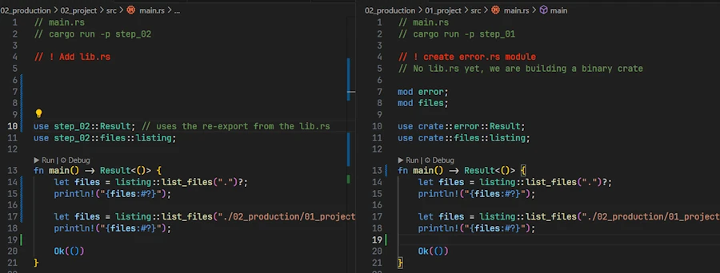
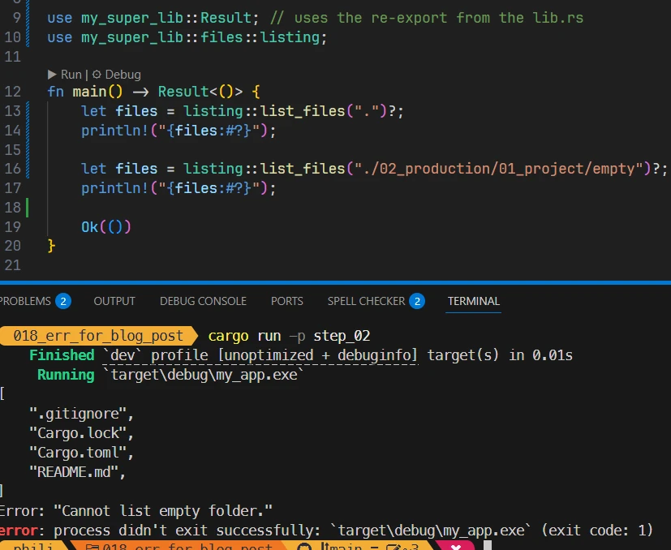
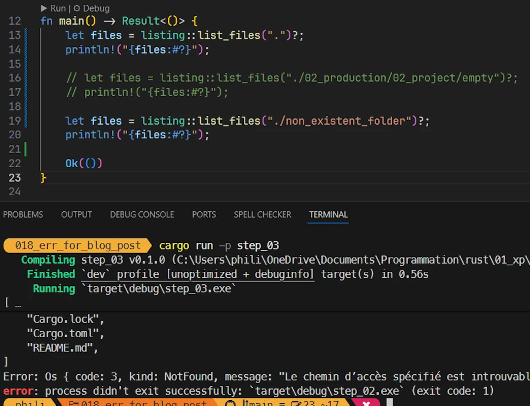
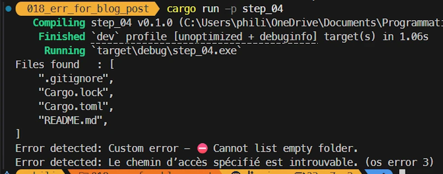
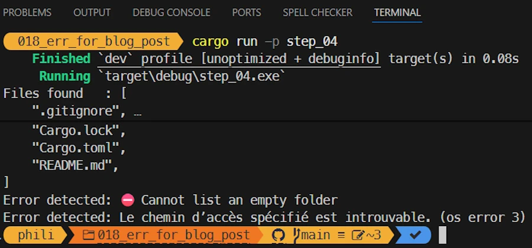
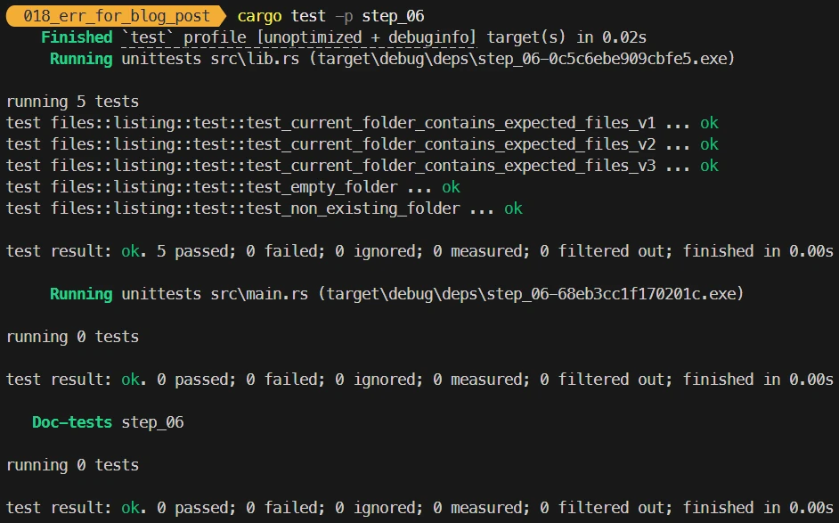

# Rust Error Handling, Demystified
{: .no_toc }

A beginner-friendly conversation on Errors, Results, Options, and beyond.
{: .lead }


<!-- <h2 align="center">
<span style="color:orange"><b> 🚧 This post is under construction 🚧</b></span>
</h2> -->


### This is Episode 06
{: .no_toc }


<div align="center">
<br/>
<span>Let's have a beginner-friendly conversation on Errors, Results, Options, and beyond.</span>
</div>


#### Posts
{: .no_toc }
* [Episode 00]()
* [Episode 01]()
* [Episode 02]()
* [Episode 03]()
* [Episode 04]()
* [Episode 05]()
* [Episode 06]()


## Table of Contents
{: .no_toc .text-delta}
- TOC
{:toc}


<!-- ###################################################################### -->
<!-- ###################################################################### -->
<!-- ###################################################################### -->

## Path to Production - Step_00

<div align="center">
<iframe width="560" height="315" src="https://www.youtube.com/embed/LUapZhcsdx8?si=cxsAd5AjKMZfTm1x&amp;start=12" title="YouTube video player" frameborder="0" allow="accelerometer; autoplay; clipboard-write; encrypted-media; gyroscope; picture-in-picture; web-share" referrerpolicy="strict-origin-when-cross-origin" allowfullscreen></iframe>
</div>


**Bob:** You know what? We will use the last experiment code as a starting point. Again the objective is to transition to a production ready code (at least from the error management standpoint). As it is, the code is monolithic and it looks like this:

```rust
// ex303.rs
pub type Error = Box<dyn std::error::Error>;
pub type Result<T> = std::result::Result<T, Error>;

fn main() -> Result<()> {
    let files = list_files("./01_experimentation/empty")?;
    println!("{files:#?}");
    Ok(())
}

fn list_files(path: &str) -> Result<Vec<String>> {
    let files: Vec<String> = std::fs::read_dir(path)?
        .filter_map(|re| re.ok())
        .filter(|e| e.file_type().map(|ft| ft.is_file()).unwrap_or(false))
        .filter_map(|e| e.file_name().into_string().ok())
        .collect();

    if files.is_empty() {
        return Err("Cannot list empty folder.".into());
    }
    Ok(files)
}
```
The output is:

```
Error: "Cannot list empty folder."
error: process didn't exit successfully: `target\debug\examples\ex303.exe` (exit code: 1)
```

What would you do?

**Alice:** As explained in [THE book](https://doc.rust-lang.org/book/ch07-00-managing-growing-projects-with-packages-crates-and-modules.html), I would create a library so that `main()` acts as a consumer of the exposed API. This will also helps, later, when we will need to write tests... So first thing first, we should split the code according to the responsibilities.

**Bob:** Ok, but I would like to be very conservative here and go one step at a time. As a very first step I want you to split the code among modules (not lib) and make sure everything works again. You could create a package in a `00_project` directory and since you read the [Modules Cheat Sheet](https://doc.rust-lang.org/book/ch07-02-defining-modules-to-control-scope-and-privacy.html#modules-cheat-sheet), use the modern way of doing meaning you're not allowed to create any `mod.rs` file. And please, explain what you do as you move forward.


{: .note-title }
> Side Note
>
> From now on, in the workspace, the projects discussed below are in the `02_production/` directory.


**Alice:** OK...
* I create a package in the `02_production/00_project/` directory
* Below you can see how files and directories are organized

```
.
│   Cargo.lock
│   Cargo.toml
│
├───empty
└───src
    │   main.rs
    │   files.rs
    │
    └───files
            listing.rs

```
* In the `Cargo.toml` the package is named `step_00` because I suppose we will have more than one step on our path to the Valhalla (production code). Here is `Cargo.toml`:

```toml
# Cargo.toml
[package]
name = "step_00"
version = "0.1.0"
edition = "2024"

[dependencies]
```
* I create a directory named `empty` to perform some tests
* Since I can't yet create a library, there is no `lib.rs` in the directory, just a `main.rs`
* Since there is a `main.rs` this means that the crate (the output of the build system) will be a binary crate, an application (`step_00.exe`)
* In `main.rs` I basically keep the minimum, a `main()` function with a call to `list_files()`. See below:

```rust
// main.rs
pub type Result<T> = std::result::Result<T, Error>;
pub type Error = Box<dyn std::error::Error>;

mod files;

use crate::files::listing;

fn main() -> Result<()> {
    let files = listing::list_files("./02_production/00_project/empty")?; // see the ? here
    println!("{files:#?}");
    Ok(())
}
```
* The type alias declarations for `Result` and `Error` remain unchanged.
* The line `mod files;` declares the existence and loads a module named `files` in the binary crate. It includes the content of the module found in the external file `files.rs`. A module is a namespace. The line brings its content to the local scope (crate root).
* It is **important** to understand that the module tree that we start building with the `mod files;` declaration is the only thing that matters for the build system. At the top of the tree is the crate root (binary crate here). Then, underneath there is a tree where on each branch and each leaf we have modules (not files). Modules are namespaces which organize code inside the crate. Files do not matter and this is why we can have multiple modules in one file (check what we did in `ex19.rs` with the `math_utils` module). Files are just containers of modules. Here, the module tree will look like this:

```
crate           The crate root module is stored in main.rs
└─ files        The `files`    module is stored in files.rs
   └─ listing   The `listing`  module is stored in files/listing.rs
```

* `use crate::files::listing;` is a shortcut, nothing more.
    * Rather than writing `files::listing::list_files()`, I can write `listing::list_files()`.
    * Alternatively I could write `use crate::files::listing::list_files;` and call `list_files()` directly but I prefer to write `listing::list_files()`. Indeed, 6 months from now, the code will be auto documented and easier to read. I will not have to remember in which module `list_files()` is defined, instead I will "read" that `list_files` is defined in the module named `listing`.


{: .note-title }
> Side Note
>
> If you don't feel 100% confident with crates, modules, files... You should read this short [dedicated post]()


* In the directory tree, `files.rs` is a **hub file**. I mean it is a short file that declares and loads one or more modules at a given level. Here it declares and loads the module `listing` one level below in the module tree. In other words, since de `pub mod listing;` take place in the `files` module then the `listing` module is a child of the `files` module. Review the module tree above (not the directory tree), confirm it makes sense.

```rust
// files.rs
pub mod listing;
```

* And now, ladies and gentlemen, here is the content of the file `files/listing.rs`

```rust
// listing.rs
use crate::Result;

pub fn list_files(path: &str) -> Result<Vec<String>> {
    let files: Vec<String> = std::fs::read_dir(path)?
        .filter_map(|re| re.ok())
        .filter(|e| e.file_type().map(|ft| ft.is_file()).unwrap_or(false))
        .filter_map(|e| e.file_name().into_string().ok())
        .collect();
    if files.is_empty() {
        return Err("Cannot list empty folder.".into());
    }
    Ok(files)
}
```

* At the top of the file the line `use crate::Result;` is a shortcut. I can write `Result<T>` rather than `crate::Result<T>`.
    * We know that the module `listing` is a grand-child of the crate root (check the module tree).
    * This said, if we recall that the **visibility rule** says that a private item is visible in the curent module and in all its children modules
    * This explains why `crate::Result` is accessible in the module `listing`


* I had to add the `pub` access specifier at the beginning of the line`list_files()` so that the function can be called from the grand-parent module (crate root in `main.rs`)
* Other than that, there is no change

Once the code is dispatched and organized as explained I can open a terminal (CTRL+ù on a FR keyboard) at the root of the workspace and run it with:

```powershell
cargo run -p step_00
```

Here is what I can see in VSCode:

<div align="center">
<br/>
<!-- <span>Optional comment</span> -->
</div>

* In `main()`, `my_lib::list_files()` is called with an argument which is a path to an empty directory. No surprise, we print a message and the application exit.


To confirm my understanding, I did some tests.

**🦀 Test 1:**
* In `listing.rs` above, I comment the line `use crate::Result;`
* I modify the signature of `list_files()`

```rust
pub fn list_files(path: &str) -> crate::Result<Vec<String>> {...}
```
* I can build the project
* This confirms that `use crate::Result;` is nothing more than a shortcut
* I delete the modifications


**🦀 Test 2:**
* In `main.rs`, in front of the `Result` and `Error` type alias declarations I remove the `pub` access specifier
* I can build the project.
* Why? Because we are building a binary crate, nothing is accessed from the outside and so, in this context, `pub` does'nt hurt but is useless.
* Then I put the `pub` back in place because they seem important to you.


<!-- ###################################################################### -->
<!-- ###################################################################### -->
<!-- ###################################################################### -->


## Path to Production - Step_01


**Bob:** The second step should be easy. Create an `error.rs` file then copy/paste `Result` and `Error` definitions there. Explain what you do when you make the code runs as before.

**Alice:** You know what? I copy/paste/rename the previous package in a directory named `01_project`.

* I update the package name in `Cargo.toml` (`name = "step_01"`)
* I create an `error.rs` file with this content:

```rust
// error.rs
pub type Result<T> = std::result::Result<T, Error>;
pub type Error = Box<dyn std::error::Error>;
```
<!-- * I make sure that both declarations have a `pub` access modifier. Otherwise we would not be able to use them from the crate root (`main.rs`) -->
* I update the content of `main.rs`

```rust
// main.rs
mod error;
mod files;

use crate::files::listing;
use crate::error::Result;

fn main() -> Result<()> {
    let files = listing::list_files(".")?;
    println!("{files:#?}");

    let files = listing::list_files("./02_production/01_project/empty")?;
    println!("{files:#?}");
    Ok(())
}
```

* The line `mod error;` declares the existence and loads a module named `error` in the binary crate. It includes the content of the module found in the external file `error.rs`
* Since the line `mod error;` appears in the crate root, the `error` module is a child of the latter. Now, the module tree looks like this:

```
crate           The crate root module is stored in main.rs
|  error        The `error`    module is stored in error.rs
└─ files        The `files`    module is stored in files.rs
   └─ listing   The `listing`  module is stored in files/listing.rs
```


{: .note-title }
> Side Note
>
* `cargo install cargo-modules`
* `cargo-modules structure --package step_01`


<div align="center">
<br/>
<!-- <span>Optional comment</span> -->
</div>


* I also add `use crate::error::Result;` so that I can write `fn main() -> Result<()> {...}` rather than `fn main() -> error::Result<()> {...}`

* For the "fun", now in `main()` we inspect 2 different directories.


Here is what I can see in the terminal

<div align="center">
<br/>
<!-- <span>Optional comment</span> -->
</div>


Again I check my understanding about what is possible and what is not with the modules and the module tree.

**🦀 Test 3:**
* The module `error` is a child of the crate root (in `main.rs`).
* Within `error` I can "see" what is in the crate root but the crate root cannot "see" what is in `error` if I don't make it public.
* So in `error.rs` I remove the `pub` access modifier in front of `Result`.
* Then I check I'm no longer able to build the project.
* I undo my modifications

**🦀 Test 4:**
* In `main.rs` I comment the line `use crate::error::Result;` and I write `fn main() -> crate::error::Result<()> {`.
* I cannot build the crate because there is a problem with `use crate::Result;` in `listing.rs` (`unresolved import 'crate::Result'`).
* Obviously, if in `listing.rs` I replace the line `use crate::Result;` with `use crate::error::Result;` then I can build again because in `error`, `Result` is public.

Now, the 1 million $ question is: "why it worked in the initial version?"

The answer goes like this:
* `Result` is public in the `error` module
* In the crate root we have `mod error` which brings `error::Result` is in the current scope, the scope of the crate root.
* If `Result` is in the scope of the crate root, it becomes visible from its children
* So  `crate::Result` is available in the scope of `listing` module (child visibility rule)
* In the `listing` namespace I can write:
    * `pub fn list_files(path: &str) -> crate::Result<Vec<String>> {...`
    * or `use crate::Result;` then `pub fn list_files(path: &str) -> Result<Vec<String>> {...`


<div align="center">
<br/>
<span>Tadaa!</span>
</div>

It took me a while. Believe me, it's harder to write and explain than to make the changes in the code, but honestly, it's worth it. I realize how **important** it is to have the module tree in mind (or to print it as shown before) and to know the rule of visibility.


**Bob:** I’m genuinely impressed by your insight and your willingness to test ideas to strengthen your understanding. Keep it up!

You will be happy to learn that in the next step, you will create a library and expose an API... Welcome to the real world

<div align="center">
<br/>
<!-- <span>Optional comment</span> -->
</div>

Create a `lib.rs` file at the root of the project, put the `pub mod error;` and `pub mod files;`. Make the application run again and, as before, explain what you do.


<!-- ###################################################################### -->
<!-- ###################################################################### -->
<!-- ###################################################################### -->


## Path to Production - Step_02


**Alice:** Um... Ok... I start with a copy/paste/rename of the previous directory (`02_project/`)

* I recall that if in the directory there is a `lib.rs` and a `main.rs`
    * The build system builds the library crate then the binary crate.
    * The lib is automatically linked to the binary.
    * Ideally I want to keep `main()` as short as possible. It should validate some stuff then call a `run()` function from the library.
    * Here I will keep `list_file()` in main as before.

Once the copy of the directory is done:
* I update the package name in `Cargo.toml` (`name = "step_02"`)
* I create a `lib.rs` file with this content:

```rust
// lib.rs
pub mod error;
pub mod files;

// re-export lib from crate root
pub use self::error::{Error, Result};
```

* Since I want to call `list_files()` from `main()` I "put" the `files` module in the `lib`
* `main()` returns a `Result<()>` so I "put" the error module in the `lib` as well
* So far there is no need to copy/paste the code from `files/listings.rs` into `lib.rs`. Indeed if tomorrow the app grows, I will write more code in more modules and I will simply list the modules in `lib.rs`.

* At this point, if I compare V2 on the left versus V1 of the file `main.rs` here is what I can see:

<div align="center">
<br/>
<!-- <span>Optional comment</span> -->
</div>

* The lines `mod error;` and `mode files;` have been moved to `lib.rs`. The modules `error` and `files` are now in the lib namespace.
* One **point of attention:** In previous versions, the code was monolithic, all the modules were children of the same root, all symbols were accessible within the same namespace. This is why, in `main.rs`, a line like `use crate::files::listing;` allowed us to call `listing::list_files()`. `crate` was pointing to the crate being built, the binary crate.
* But this is no longer the case. Indeed `list_files()` is now in the library namespace.
* This is why, since the library is linked to the binary I need to write `use step_02::files::listing;` where `step_02` is the name of the library (which is the same as the name of the binary. I know, this does'nt help much...)

And that's it. It builds and run like a charm...


**Bob:** This is cool but I have 2 questions for you. First question: are you sure when you say that in `use step_02::files::listing;`, `step_02` is the name of the library. I believe you, but how can we remove any doubt?

**Alice:** We can modify `Cargo.toml` as shown below:

```toml
[package]
name = "step_02"
version = "0.1.0"

edition = "2024"

[dependencies]


[[bin]]
name = "my_app"      # name of the executable (my_app.exe under WIN11)
path = "src/main.rs"

[lib]
name = "my_super_lib" # name of the lib (libmy_super_lib.rlib under WIN11)
path = "src/lib.rs"
```

Then we can modify `main.rs`:

```rust
// main.rs
use my_super_lib::Result;
use my_super_lib::files::listing;

fn main() -> Result<()> {
    let files = listing::list_files(".")?;
    println!("{files:#?}");

    let files = listing::list_files("./02_production/01_project/empty")?;
    println!("{files:#?}");

    Ok(())
}
```

Here is the output in the console

<div align="center">
<br/>
<!-- <span>Optional comment</span> -->
</div>

The runtime mention **my_app.exe** when it says something like: `process didn't exit successfully: target\debug\my_app.exe` while in `main.rs` we write `use my_super_lib::files::listing;`.

One last **point of attention** if I can... The command to build and run the application remains: `cargo run -p step_02`. This is because `step_02` is the name of the package in `Cargo.toml`. Review the content of `Cargo.toml` if this is not crystal clear.

What is your second question?


**Bob:** Easy, Padawan, I think the Force is making your head a little bigger... My second question is about the last line of the `lib.rs`:

```rust
pub use self::error::{Error, Result};
```

You did'nt say a word about it while in the last screenshot above I see the following comment:

```rust
use step_02::Result; // uses the re-export from the lib.rs
```

Would you be so kind as to explain to an 800-year-old Jedi why you wrote these lines of code and these comments?


**Alice:** You're right it took me a while so they deserve some explanations.

* In `lib.rs`
    * I load the modules `error` and `files` in the module tree
    * If the line `pub use self::error::{Error, Result};` is commented I can't build the package. I get an error from `listing.rs` saying:

    ```
    use crate::Result;
        ^^^^^^^^^^^^^ no `Result` in the root
    ```
    * I'm not impressed. I know the module tree of the library crate, I can fix the problem and build the library. In `listing.rs` I write `use crate::error::Result;` rather than `use crate::Result;`
    * However, if building the library seems OK, I can't build the binary crate. I see an error in `main.rs`:

    ```
    use step_02::Result;
        ^^^^^^^^^^^^^^^ no `Result` in the root
    ```
    * Again, I know the module tree of the binary crate. In `main.rs` I write `use step_02::error::Result;` rather than `use step_02::Result;`
    * Then I can build the package (the library crate and the binary crate)
    * However...
        * This work here because I have few modules. What if I have hundreds?
        * On the other hand, I don't like the idea of not being able to reuse most of the source code from the previous version without modifying it.
    * This is where the **re-export** "trick" enters the game.
        * In `lib.rs` I load the modules I need (`errors`, `files`)
        * Then I create, at the top of the module tree of the library crate, the shortcuts I need:
        ```rust
        pub use self::error::{Error, Result};
        ```
        * With this, 2 things happens
            1. With `use self::error::{Error, Result};` all child modules of the library crate can use `Result` as if it was declared at the top of the module tree (I can write `crate::Result` instead of `crate::error::Result`). This is what is done in `listing.rs`
            1. With the `pub` access specifier, `Result` and `Error` are accessible from code linked with the library. The binary crate of the package for example. This is why in `main.rs` I first create a shorcut to Result in the library (see `use step_02::Result;`)  and then use it locally (see `write fn main() -> Result<()> {...}`).

**Bob:** Not to split hairs here, but if the shortcut lives in `lib.rs`, why duplicate it in `main.rs`?

**Alice:** This is exactly what I did but it does'nt work. Indeed without the shortcut `use step_02::Result;` in `main.rs`, this is the `Result<T,E>` from the std lib which is used and the compiler is not happy. See by yourself:

```
fn main() -> Result<()> {
             ^^^^^^ -- supplied 1 generic argument
             |
             expected 2 generic arguments
```

So in `main.rs` the shortcut "overwrite" the `default Result<T, E>`


**Bob:** One last question. In `lib.rs` you write `pub use self::error::{Error, Result};` while until now you have been using `use crate` quite a lot. Is there any specific reason.

**Alice:** Absolutely none.
* In a path like `self::error::Error`, `self` refers to the current module. This allows to use paths relative to the current module. Since we are in `lib.rs`, `self` refers to the crate root.
* In a path like `crate::error::Error`, `crate` refers to the crate root. This allow to use absolute path, always starting from the root.
* So here both paths are equivalent. I'll keep the absolute version.


<!-- ###################################################################### -->
<!-- ###################################################################### -->
<!-- ###################################################################### -->


## Path to Production - Step_03


**Bob:** Splendid! Did you notice we did'nt yet talk about error handling? First, let's set the problem then we will work on one possible option.

* I let you copy/paste/rename of the previous directory (`03_project`)
* Think to update the package name in `Cargo.toml` (`name = "step_03"`)

Once this is done, to "feel" the problem, please modify the `main()` function as below then run the code and tell me what you think.

```rust
fn main() -> Result<()> {
    let files = listing::list_files(".")?;
    println!("{files:#?}");

    // let files = listing::list_files("./02_production/03_project/empty")?;
    // println!("{files:#?}");

    let files = listing::list_files("./non_existent_folder")?;
    println!("{files:#?}");

    Ok(())
}
```

**Alice:** Here is what I see

<div align="center">
<br/>
<!-- <span>Optional comment</span> -->
</div>

* We use to read `Error: "Cannot list empty folder."`. This message was coming from `listing.rs` when the code detects that there is no file to list. See below:

    ```rust
    // listing.rs
    use crate::Result;

    pub fn list_files(path: &str) -> Result<Vec<String>> {
        let files: Vec<String> = std::fs::read_dir(path)?
            .filter_map(|re| re.ok())
            .filter(|e| e.file_type().map(|ft| ft.is_file()).unwrap_or(false))
            .filter_map(|e| e.file_name().into_string().ok())
            .collect();
        if files.is_empty() {
            return Err("Cannot list empty folder.".into());
        }
        Ok(files)
    }
    ```


* `list_files()` is not ready to handle cases were the directory does not exists. In such case, when `read_dir()` returns, the `?` operator bubbles up the error to `main()`
* Back in `main()`, the error is returned as `Box<dyn std::error::Error>`
* Finally, the Rust runtime prints the last 2 messages.


**Bob:** Any comment?

**Alice:** The app is not ready to handle all possible kinds of errors it may encounter. In the experimentation phase it was acceptable but, in production phase it is no longer the case. We need to put in place a scalable errors management but I have no idea how to do that...


**Bob:** You're right. The app is not yet ready but don't worry, solutions based on custom errors exist (do you remember the `enum` etc.?).

We will keep our methodology and make one step at a time. Based on our experience in `list_files()`, in a first step we will make sure the app can report all kind of I/O errors as well as custom error messages based on strings of chars (String or string literal). Let me show you how...

So far `errors.rs` look like this:

```rust
// error.rs
pub type Result<T> = std::result::Result<T, Error>;
pub type Error = Box<dyn std::error::Error>;
```

Modify it so that it looks like that:

```rust
// error.rs
use thiserror::Error;

pub type Result<T> = std::result::Result<T, Error>;

#[derive(Debug, Error)]
pub enum Error {
    #[error("custom error: {0}")]
    Custom(String),

    #[error(transparent)]
    Io(#[from] std::io::Error),
}

impl Error {
    pub fn custom(val: impl std::fmt::Display) -> Self {
        Self::Custom(val.to_string())
    }
}

impl From<&str> for Error {
    fn from(val: &str) -> Self {
        Self::Custom(val.to_string())
    }
}
```


Do not look at the code yet but realize that since:
1. the `error.rs` file is standalone
2. `pub type Error = Box<dyn std::error::Error>;` is on its own line

We can now change the implementation of `Error` **without impacting the rest of the project** thanks to the level of indirection.


Now, in the code above, only pay **attention** to `Error`.
* So far its datatype was `Box<dyn std::error::Error>`
* **Important:** Now it is an `enum`. This means that the lib restrict itself to only 2 flavors: `Error:Custom` or `Error::Io`
* It is a totally different story
* We used to be more lax, free, and flexible (`Box<dyn std::error::Error>`), but now we're becoming stricter, more specific, and more professional in the way we handle errors (`pub enum Error{...}`).


If needed, open a console and add `thiserror` crate to `Cargo.toml` with the command below:

```
cargo add thiserror --package step_03
```

Cargo.toml should look like:

```toml
[package]
name = "step_03"
version = "0.1.0"
edition = "2024"

[dependencies]
thiserror = "2.0.17"
```


Now, run the application (`cargo run -p step_03`) and "tell me why" you get this output.

<div align="center">
<iframe width="560" height="315" src="https://www.youtube.com/embed/H3LbzjFJdSA?si=swM00wplNuHeLbL9" title="YouTube video player" frameborder="0" allow="accelerometer; autoplay; clipboard-write; encrypted-media; gyroscope; picture-in-picture; web-share" referrerpolicy="strict-origin-when-cross-origin" allowfullscreen></iframe>
</div>

**Alice:** Good news, it works. Bad news, I don't see big difference in the output. With `step_02` I had:

```
[
    ".gitignore",
    "Cargo.lock",
    "Cargo.toml",
    "README.md",
]
Error: Os { code: 3, kind: NotFound, message: "Le chemin d’accès spécifié est introuvable." }
error: process didn't exit successfully: `target\debug\step_02.exe` (exit code: 1)
```

Now with `step_03` I see:

```
[
    ".gitignore",
    "Cargo.lock",
    "Cargo.toml",
    "README.md",
]
Error: Io(Os { code: 3, kind: NotFound, message: "Le chemin d’accès spécifié est introuvable." })
error: process didn't exit successfully: `target\debug\step_03.exe` (exit code: 1)
```

The difference is... Now it prints `Error: Io(Os...` instead of `Error: Os...`. Not sure it makes the app more production ready.


<!-- ###################################################################### -->
<!-- ###################################################################### -->
<!-- ###################################################################### -->


## Path to Production - Step_04

**Bob:** This is OK. It is part of our journey... Copy/paste/rename the directory as `04_project` and rename the package in `Cargo.toml` as `step_04`.

Now, modify `main.rs` as below:

```rust
// main.rs
use step_04::Result;
use step_04::files::listing;

fn main() -> Result<()> {
    match listing::list_files(".") {
        Ok(files) => println!("Files found   : {files:#?}"),
        Err(e) => println!("Error: {e}"),
    }

    match listing::list_files("./02_production/04_project/empty") {
        Ok(files) => println!("Files found   : {files:#?}"),
        Err(e) => println!("Error detected: {e}"),
    }

    match listing::list_files("./non_existent_folder") {
        Ok(files) => println!("Files found   : {files:#?}"),
        Err(e) => println!("Error detected: {e}"),
    }

    Ok(())
}
```

The `non_existent_folder` is "back in town"

<div align="center">
<iframe width="560" height="315" src="https://www.youtube.com/embed/hQo1HIcSVtg?si=tSkFmxpGfVozzhFQ" title="YouTube video player" frameborder="0" allow="accelerometer; autoplay; clipboard-write; encrypted-media; gyroscope; picture-in-picture; web-share" referrerpolicy="strict-origin-when-cross-origin" allowfullscreen></iframe>
</div>

In addition, the `?` operator has disappeared. We use `match` after each call instead. Don't, but if you run the code at this point you should not see big changes.

Open `error.rs` and replace the line `#[error(transparent)]` with `#[error("**** I/O error: {0}")]`. See below the code fragment:

```rust
pub enum Error {
    #[error("Custom error - {0}")]
    Custom(String),

    // #[error(transparent)]
    #[error("**** I/O error: {0}")]
    Io(#[from] std::io::Error),
}
```

Now run the code (`cargo run -p step_04`). What do you see. What is you understanding?


**Alice:** Here is what I get in the terminal:

```
Files found   : [
    ".gitignore",
    "Cargo.lock",
    "Cargo.toml",
    "README.md",
]
Error detected: Custom error - ⛔ Cannot list empty folder.
Error detected: **** I/O error: Le chemin d’accès spécifié est introuvable. (os error 3)
```

And now I understand what happens!

1. First call: No problemo! Files are listed as before.

    <div align="center">
    <br/>
    <!-- <span>Optional comment</span> -->
    </div>

2. Second call: The code reports a custom error with a message because the directory is empty. This is business as usual.
3. Third call: This is an unhandled I/O error. The directory does not exists. After `read_dir()`, the `?` operator bubbles the error as an `Error`. The code must convert the I/O error into an `Error`. I don't know yet all the details but I remember `thiserror` generates the code for that and it seems it is using templated message `"**** I/O error: {0}"` because I can see the 4 stars in the console.

To make a long story short: Now, when the app encounter an unknown I/O error it reports it as an `Error::Io`.

Cool, it works. Now I can uncomment the line with `transparent` and run the application again. Here is what I see:

<div align="center">
<br/>
<!-- <span>Optional comment</span> -->
</div>


**Bob:** One question however. Could you read `error.rs` and tell me exactly what is going on here?


**Alice:** We already used `thiserror`, but, Ok, let me start from the beginning... Until `Step_03` we had:

```rust
// error.rs
pub type Result<T> = std::result::Result<T, Error>;
pub type Error = Box<dyn std::error::Error>;
```


Now we want our `Error` being able to cover system-level I/O errors or send back custom error messages. We would like to write something like:

```rust
// error.rs
pub type Result<T> = std::result::Result<T, Error>;

pub enum Error {
    Custom(String),
    Io(std::io::Error),
}
```

This cannot work but `thiserror` can help. And below is equivalent to what we had within `ex24.rs`

```rust
// error.rs
use thiserror::Error;

pub type Result<T> = std::result::Result<T, Error>;

#[derive(Debug, Error)]
pub enum Error {
    #[error("Custom error - {0}")]
    Custom(String),

    #[error(transparent)]
    Io(#[from] std::io::Error),
}
```
However, here few lines of code have been added:

```rust
// error.rs
use thiserror::Error;

pub type Result<T> = std::result::Result<T, Error>;

#[derive(Debug, Error)]
pub enum Error {
    #[error("Custom error - {0}")]
    Custom(String),

    #[error(transparent)]
    Io(#[from] std::io::Error),
}

impl Error {
    pub fn custom(val: impl std::fmt::Display) -> Self {
        Self::Custom(val.to_string())
    }
}

impl From<&str> for Error {
    fn from(val: &str) -> Self {
        Self::Custom(val.to_string())
    }
}
```


In the implementation section of `Error` we define a "convenience" constructor (see `custom(param)`). This constructor accepts anything implementing `Display` (string literals, numbers...) and converts the parameter into a `Error::Custom` variant. This provides more flexibility because we can write `Error::custom("foo")` instead of manually allocating a `String`.

The last implementation is here to help us to write `return Err("something went wrong".into())`. Indeed, since we remember that in Rust if the trait `From<A> for B` exists, then we get the trait `Into<B> for A` for free,  we define `From<&str> for Error` so that we get `Into<Error> for &str`.


<!-- ###################################################################### -->
<!-- ###################################################################### -->
<!-- ###################################################################### -->


## Path to Production - Step_05

**Bob:** You know... We could go one step further... Indeed if we want to be more strick we should remove the `Custom` variant of the `Error` enum and only list the errors we deal with.

I let you copy/paste/rename the directory as `05_project` and rename the package in `Cargo.toml` as `step_05`.

Now I propose to use this version of the `error.rs` file

```rust
// error.rs
use thiserror::Error;

pub type Result<T> = std::result::Result<T, Error>;

#[derive(Debug, Error)]
pub enum Error {
    #[error("⛔ Cannot list an empty folder")]
    CantListEmptyFolder,

    #[error(transparent)]
    Io(#[from] std::io::Error),
}
```

For comparison, find below the previous version:


```rust
// error.rs
use thiserror::Error;

pub type Result<T> = std::result::Result<T, Error>;

#[derive(Debug, Error)]
pub enum Error {
    #[error("Custom error - {0}")]
    Custom(String),

    #[error(transparent)]
    Io(#[from] std::io::Error),
}

impl Error {
    pub fn custom(val: impl std::fmt::Display) -> Self {
        Self::Custom(val.to_string())
    }
}

impl From<&str> for Error {
    fn from(val: &str) -> Self {
        Self::Custom(val.to_string())
    }
}
```

1. The `Custom` variant has been removed. This allow us to remove the constructor `custom()` and the `From` trait implementation for `Error`.
1. More **important**. We now have `CantListEmptyFolder` which is a variant without associated data, unlike the `Io(std::io::Error)` variant, which contains a `std::io::Error` object. So `CantListEmptyFolder` acts as a constant of type `Error`.


With this in place we can now modify `listing.rs` so that it no longer returns a custom message when the directory is empty but the `Error::CantListEmptyFolder` custom error code instead. See below:

```rust
// listing.rs

use crate::{Error, Result};

pub fn list_files(path: &str) -> Result<Vec<String>> {
    let files: Vec<String> = std::fs::read_dir(path)?
        .filter_map(|re| re.ok())
        .filter(|e| e.file_type().map(|ft| ft.is_file()).unwrap_or(false))
        .filter_map(|e| e.file_name().into_string().ok())
        .collect();
    if files.is_empty() {
        // return Err("⛔ Cannot list empty folder.".into());
        return Err(Error::CantListEmptyFolder);
    }
    Ok(files)
}
```
In the code above, if we want to return `Err(Error::CantListEmptyFolder)` we need to bring `crate::Error` into the local scope. This is why we now have `use crate::{Error, Result};` (vs `use crate::Result;`) at the beginning of the source code.

If you run the app (`cargo run -p step_05`), here is what you should see:

<div align="center">
<br/>
<!-- <span>Optional comment</span> -->
</div>


Now, if in `main()` you modify the `match` in charge of the empty folder as below :

```rust
match listing::list_files("./02_production/05_project/empty") {
    Ok(files) => println!("Files found   : {files:#?}"),
    // Err(e) => println!("Error detected: {e}"),
    Err(e) => println!("Error detected: {e:?}"),
}
```

You should get the following output in the console. The `:?` format specifier helps to see the `CantListEmptyFolder` error code in plain English.

```
Files found   : [
    ".gitignore",
    "Cargo.lock",
    "Cargo.toml",
    "README.md",
]
Error detected: CantListEmptyFolder
Error detected: Le chemin d’accès spécifié est introuvable. (os error 3)
```


<!-- ###################################################################### -->
<!-- ###################################################################### -->
<!-- ###################################################################### -->


## Path to Production - Step_06

**Alice:** Could you show me how to add testing to my "production" code ?

**Bob:** Yes I can but I will only show you the code. To tell the truth I'm getting tired, testing is an subject on itself and I believe it is time to end this conversation.

The code below is in `02_production/06_project/src/files/listing.rs`.

```rust
// listing.rs
use crate::{Error, Result};

pub fn list_files(path: &str) -> Result<Vec<String>> {
    let files: Vec<String> = std::fs::read_dir(path)?
        .filter_map(|re| re.ok())
        .filter(|e| e.file_type().map(|ft| ft.is_file()).unwrap_or(false))
        .filter_map(|e| e.file_name().into_string().ok())
        .collect();
    if files.is_empty() {
        return Err(Error::CantListEmptyFolder);
    }
    Ok(files)
}

#[cfg(test)]
mod test {

    use super::*;

    // ! cwd is 06_project/ NOT 018_err_for_blog_post/ (workspace)
    #[test]
    fn test_empty_folder() {
        let result = list_files("./empty");
        assert!(matches!(result, Err(Error::CantListEmptyFolder)));
    }

    #[test]
    fn test_non_existing_folder() {
        let result = list_files("./non_existent_folder");
        match result {
            Err(Error::Io(_)) => {} // ok, this is an I/O error
            other => panic!("Expected Error::Io, got {:?}", other),
        }
    }

    #[test]
    fn test_current_folder_contains_expected_files_v1() {
        let result = list_files(".").expect("Should list current directory");
        assert_eq!(result, vec!["Cargo.lock", "Cargo.toml"]);
    }

    // Cannot be sure of the order => sort
    #[test]
    fn test_current_folder_contains_expected_files_v2() {
        let mut files = list_files(".").expect("Should list current directory");
        files.sort();
        let mut expected = vec!["Cargo.lock".to_string(), "Cargo.toml".to_string()];
        expected.sort();
        assert_eq!(files, expected);
    }

    // Cannot be sure of the order
    // Cannot be sure other files are not added
    // Just checks both files are present
    #[test]
    fn test_current_folder_contains_expected_files_v3() {
        let files = list_files(".").expect("Should list current directory");
        assert!(files.contains(&"Cargo.toml".to_string()));
        assert!(files.contains(&"Cargo.lock".to_string()));
    }
}
```


Here is what you should see after: `cargo test -p step_06`


<div align="center">
<br/>
<!-- <span>Optional comment</span> -->
</div>


### Summary – Experimentation to Production
{: .no_toc }

{: .new-title }
> Summary – Experimentation to Production
>
* We now have a good code template for our experimentation
    * See the summary of [Experimentation](#summary--experimentation)
* We learn how to split monolithic experimentation code into one or more files, including a `lib.rs` and a `main.rs`
* We know much more about the module tree
    * "Hub files" which help to build the module tree and avoid `mod.rs` files
    * `mod files;`: declares the existence and loads a module named `files` in the crate under construction
    * Shortcuts like: `use crate::files::listing;`
    * The visibility rule (if in parent then visible in child)
    * `crate` vs `self` in the `use` statements
* Create an independent `error.rs`
* The re-export "trick" in `lib.rs` to share `Result` and `Error` from the lib crate to the binary crate
* `thiserror` and the re-write of `error.rs` to provide a custom error type to the lib.
* Move from custom error messages to strick custom error codes
* Testing with our library error codes


### Exercises – Experimentation to Production
{: .no_toc }

1. You have this code
    ```rust
    use std::fs;

    fn main()  {
        let content = fs::read_to_string("config.txt");
        println!("{:?}", content);
    }
    ```
    Apply what we discussed in the section Experimentation and use the "template" of our toolbox.

1. You have this code
    ```rust
    fn main() -> Result<(), Box<dyn std::error::Error>> {
        let mut input = String::new();
        std::io::stdin().read_line(&mut input)?;
        let n: u32 = input.trim().parse()?;
        println!("Factorial : {}", factorial(n));
        Ok(())
    }

    fn factorial(n: u32) -> u32 {
        match n {
            0 | 1 => 1,
            _ => n * factorial(n - 1),
        }
    }
    ```
    * Structure this package by creating:
    * `lib.rs` file with a math module.
    * A `math.rs` file containing the `factorial()` function.
    * An `error.rs` file with a custom `Result` type.
    * Ensure that `main.rs` uses the library and handles errors via the custom `Result` type.


<!-- ###################################################################### -->
<!-- ###################################################################### -->
<!-- ###################################################################### -->

## Conclusion

<div align="center">
<iframe width="560" height="315" src="https://www.youtube.com/embed/v22YbORzDD0?si=coC-2aQAbL0PTIwa&amp;start=18" title="YouTube video player" frameborder="0" allow="accelerometer; autoplay; clipboard-write; encrypted-media; gyroscope; picture-in-picture; web-share" referrerpolicy="strict-origin-when-cross-origin" allowfullscreen></iframe>
</div>


It's 6AM. Your sister is coming back home. You are "dead" but happy because you learnt a lot even if you are not sure you will keep everything in your mind. It is also time for you to go to bed...

You know what? Don't touch your PC for, at least, one day. And if you want to watch kitten's videos use your phone.

<div align="center">
<br/>
<!-- <span>Optional comment</span> -->
</div>

Then come back to theses posts, one at a time and try to make the exercices. You can also take one of your previous code, copy/paste/rename the directory and add some error management. If the code is a "toy" stick to what we saw in Experimentation section. Once this is done, play the game and use what we learnt about errors management in the Production section, split one of your package in multiple files and add your own custom error type to it.

Enjoy!


<!-- ###################################################################### -->
<!-- ###################################################################### -->
<!-- ###################################################################### -->

## Webliography

* [THE book](https://doc.rust-lang.org/book/ch09-00-error-handling.html)
* You're probably misusing unwrap in Rust
    <div align="center">
    <iframe width="560" height="315" src="https://www.youtube.com/embed/k10xtq02nqY?si=htUcBirLf5X7miuX" title="YouTube video player" frameborder="0" allow="accelerometer; autoplay; clipboard-write; encrypted-media; gyroscope; picture-in-picture; web-share" referrerpolicy="strict-origin-when-cross-origin" allowfullscreen></iframe>
    </div>
* Custom Errors
    <div align="center">
    <iframe width="560" height="315" src="https://www.youtube.com/embed/KrZ0nmpNVOw?si=4XTRH4Ek-dDyqDfv" title="YouTube video player" frameborder="0" allow="accelerometer; autoplay; clipboard-write; encrypted-media; gyroscope; picture-in-picture; web-share" referrerpolicy="strict-origin-when-cross-origin" allowfullscreen></iframe>
    </div>
* Error Best Practices
    <div align="center">
    <iframe width="560" height="315" src="https://www.youtube.com/embed/j-VQCYP7wyw?si=GUo1WT26ECX8erGW" title="YouTube video player" frameborder="0" allow="accelerometer; autoplay; clipboard-write; encrypted-media; gyroscope; picture-in-picture; web-share" referrerpolicy="strict-origin-when-cross-origin" allowfullscreen></iframe>
    </div>


<!-- ###################################################################### -->
<!-- ###################################################################### -->
<!-- ###################################################################### -->


#### Posts
{: .no_toc }

* [Episode 00]()
* [Episode 01]()
* [Episode 02]()
* [Episode 03]()
* [Episode 04]()
* [Episode 05]()
* [Episode 06]()


