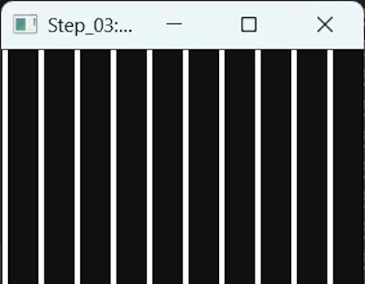
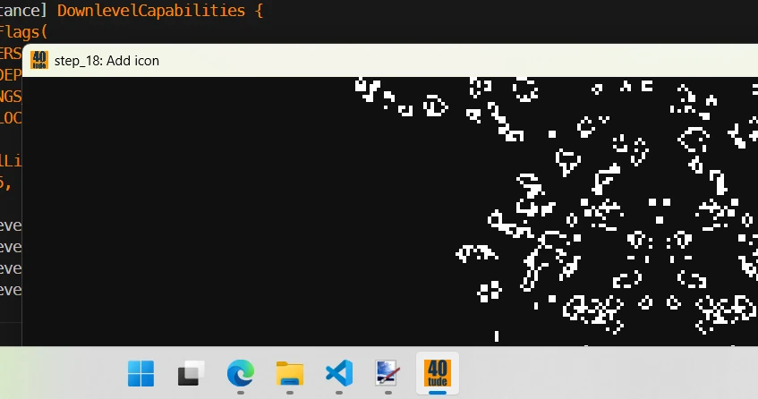

# Building Conway’s Game of Life in Rust with Pixels and Winit
{: .no_toc }

A beginner-friendly guide to using the Pixels and Winit crates to create a graphical version of Conway’s Game of Life in Rust.
{: .lead }


<!-- <h2 align="center">
<span style="color:orange"><b> 🚧 This post is almost done 🚧</b></span>    
</h2> -->


<!-- ### This is Episode 00
{: .no_toc } -->


## TL;DR
{: .no_toc }

* For Rust beginners
* Winit, Pixels and wgpu
* Start from scratch (single file, basic window)
* Build incrementally (modularization, arguments, logging, error management, performance metrics...)
* The Rust workspace is on [GitHub](https://github.com/40tude/rust_game_of_life)
* VSCode + Win11 (not tested elsewhere)

<div align="center">
<br/>
<span>Game of Life in Rust using Winit and Pixels crates.</span>
</div>


I know the post is pretty long, so feel free to check out the table of contents and click on the topic that interests you the most.

## Table of Contents
{: .no_toc .text-delta}
- TOC
{:toc}


<!-- ###################################################################### -->
<!-- ###################################################################### -->
<!-- ###################################################################### -->

## Introduction

This project started with a simple idea: build something fun with a graphical output — starting from scratch (or almost), and improving it step by step without making it unnecessarily complex. Along the way, we’ll modularize the code, add logging, handle errors, write tests, measure progress, and support configuration parameters. In short, we’ll evolve from a quick prototype to something we can show off.

If you’re new to the **Game of Life**, check out [this page](https://conwaylife.com/wiki/Main_Page) (which also includes downloadable patterns that you can use with Step 08 and above), then explore [this one](https://conwaylife.com/) and [this one](https://copy.sh/life/).

The journey will take around 25 steps. At first, I’ll go sloooowly to make sure we’re fully aligned. I’ll take the time to explain what I’ve learned about the **Winit** and **Pixels** crates, and I’ll add plenty of comments in the source code. Later on, we’ll gradually pick up the pace.

This is how the application looks like at the end:

* Zooming, panning, GPU support, full screen, 5000+ patterns available...

<div align="center">
<br/>
<span>Click to zoom in</span>
</div>

<div align="center">
<br/>
<span>Same as above but I moved to the right and zoomed on the gliders</span>
</div>

<div align="center">
<br/>
<span>A larger pattern loaded. I zoomed out so that we see the boarders of our universe</span>
</div>

Now then — it’s almost 11 a.m., and the train is waiting on platform 9¾.
Ready to hop on? 


<!-- ###################################################################### -->
<!-- ###################################################################### -->
<!-- ###################################################################### -->

## Step 00: A Gentle Start

When I discussed the idea with ChatGPT and explained that, for teaching purposes, I wanted to build a Game of Life application in Rust and was looking for a helpful library, it kindly pointed me to the Winit and Pixels crates. I then checked out the links below (this is a lie but this what I should have done):   

### winit
{: .no_toc }

* [crate](https://crates.io/crates/winit): 
* [doc](https://docs.rs/winit/0.30.12/winit/): 
* [examples](https://github.com/rust-windowing/winit/tree/master/winit/examples): 

### Pixels
{: .no_toc }

* [crate](https://crates.io/crates/pixels): 
* [doc](https://docs.rs/pixels/0.15.0/pixels/): 
* [examples](https://github.com/parasyte/pixels/tree/main/examples): 


**What I learnt:** Generally speaking, there's quite a bit of documentation, the code is available, but, most of the time, there are no tutorials. Furthermore—and it took me a while to figure this out—if you're looking for an example, you need to go to the GitHub repo and check out the `examples/` directory.

There has been, and this is really great, a huge effort made in terms of documentation. However, I don't understand why, unlike the canonical `README.md` file, there isn't a `PHILOSOPHY.md` or `ETHOS.md` file that would explain the key concepts behind the API, the important points to keep in mind, the mindset needed when approaching the crate... This file would, of course, include diagrams and additional explanations around some of the key sample code available in the `examples/` directory.

Ok, this said:
1. Get the code of this project from [GitHub](https://github.com/40tude/rust_game_of_life) 
1. Open the workspace with VSCode
1. Once in VSCode, open a terminal (CTRL + ù on a FR keyboard)
1. `cargo run -p step_00_winit_029`
    * You must use `-p` because I use a Rust's workspace with multiple packages and `step_00_winit_029` is one of them
    * Compare to the other packages (02, 03...) the name of this first package is long because it expresses the fact that it depends on the Winit version 0.29. 

<div align="center">
<br/>
<span>Blue Screen of Birth: a first window using Rust, Winit and Pixels</span>
</div>

Now, open the package (project) named `step_00_winit_029`. It consists of a `Cargo.toml` and a `main.rs` files

<div align="center">
<br/>
<span>The first package in the Rust Workspace</span>
</div>

Here is `Cargo.toml`

```toml
[package]
name = "step_00_winit_029"
version = "0.1.0"
edition = "2024"

[dependencies]
pixels = "0.15.0"
winit = "0.29"
```

The issue I have is that it seems `Pixels` requires `winit` 0.29 but this is not the latest version. See below what I see: 

<div align="center">
<br/>
<span>Dependi helps to confirm if we use the latest version (or not)</span>
</div>

This is an issue because when you go to [the WinIt GitHub page](https://github.com/rust-windowing/winit/tree/master) you must make sure you pick the version 0.29 **before** looking at the source code of the examples.  

<div align="center">
<br/>
<span>Make sure to pick the select the correct version of Winit</span>
</div>

Indeed, but I discovered it much later, between 0.29 and 0.30 there are breaking changes in the API. We will address them with the next sample code. For now, let's study the code below:

```rust
use pixels::{Pixels, SurfaceTexture};
use winit::{
    event::{Event, WindowEvent},
    event_loop::{/*ControlFlow,*/ EventLoop},
    window::{Window, WindowBuilder},
};

const WIDTH: u32 = 200;
const HEIGHT: u32 = 150;

type Error = Box<dyn std::error::Error>;
type Result<T> = std::result::Result<T, Error>;

fn main() -> Result<()> {
    let event_loop = EventLoop::new()?;

    let mut window: Option<&'static Window> = None;
    let mut pixels: Option<Pixels> = None;

    event_loop.run(move |event, elwt| {
        match event {
            Event::Resumed => {
                if window.is_none() {
                    // elwt.set_control_flow(ControlFlow::Poll); // Never sleep and call the closure ASAP
                    let built_window = WindowBuilder::new().with_title("Step_00_winit_029: First try").build(elwt).unwrap();
                    
                    let size = built_window.inner_size();
                    let window_ref: &'static Window = Box::leak(Box::new(built_window));
                    let surface = SurfaceTexture::new(size.width, size.height, window_ref);

                    let built_pixels = Pixels::new(WIDTH, HEIGHT, surface).unwrap();

                    window = Some(window_ref);
                    pixels = Some(built_pixels);

                    let scale_factor = window_ref.scale_factor();
                    println!("Scale factor : {}", scale_factor);
                }
            }

            Event::WindowEvent {
                event: WindowEvent::RedrawRequested, ..
            } => {
                if let Some(pixels) = &mut pixels {
                    let frame = pixels.frame_mut();

                    for spot in frame.chunks_exact_mut(4) {
                        spot[0] = 0x20; // R
                        spot[1] = 0x40; // G
                        spot[2] = 0xFF; // B
                        spot[3] = 0xFF; // A
                    }

                    if let Err(err) = pixels.render() {
                        eprintln!("pixels.render() failed: {err}");
                        elwt.exit();
                    }
                }
            }

            Event::AboutToWait => {
                window.expect("Bug - Window should exist").request_redraw();
            }

            Event::WindowEvent {
                event: WindowEvent::CloseRequested, ..
            } => {
                elwt.exit();
            }

            _ => {}
        }
    })?;

    Ok(())
}
```


### Comments
{: .no_toc }

This is **NOT** the code I had at the very beginning but since I try to tell you a "gentle" story I'm lying... In fact, at the beginning, I spent too much time mixing Winit 0.30 with its 0.29 API. Nothing was really working. I did'nt read the documentation nor checked the dependencies... A nightmare...

Anyway... The code above is around 80 lines, it consists of one `main()` function, it is partially based on [the code available here](https://github.com/rust-windowing/winit/blob/v0.29.x/examples/window.rs) and it should be working. Right? Do you confirm? Ok, let's move on. 


```rust
type Error = Box<dyn std::error::Error>;
type Result<T> = std::result::Result<T, Error>;

fn main() -> Result<()> {
    let event_loop = EventLoop::new()?;
    ...
```
If you don't understand the signature of `main()` this is not a problem. Feel free to read this series of post about [errors]() during a rainy day. For the moment keep in mind that `main()` can return errors (do you see `Result` and `Error` type aliases). For example if during the call to `EventLoop::new()`, instead of panicking and stop here, the `?` operator returns the error to `main()` which propagates the error message, if any, in the terminal.

Once in the `main()` function, one of the first thing to do is to create an event loop. Then I propose to forget `window` and `pixels` for the moment and reach the `event_loop.run()` function call. This one is interesting. The closure (`|event, elwt|{...}`) is **moved** into the event loop which now, owns it. 

Then the event loop will run until `elwt.exit()` (`elwt` stands for Event Loop Window Target). The loop is mostly a `match` expression where we respond to the different type of events. In this first try we respond to the events : Resumed, RedrawRequested, AboutToWait, CloseRequested

* **WindowEvent::CloseRequested**: as explained, when this event happens, we call the `.exit()` of the event loop window target. Then Winit closes the window, release the resources, the event loops ends and the `main()` function as well.  

* **Event::AboutToWait**: This event is emitted by the winit's event loop just before it goes idle waiting for new events. It says: "I've finished processing all pending events, and I'm about to sleep until something else happens. Is there anything I can do for you before?" ([more info](https://docs.rs/winit/0.29.15/winit/event/enum.Event.html#variant.AboutToWait)). Here I decided to call `window.request_redraw()` to create a continuous rendering loop. This is not smart, this is brutal. Indeed we are constantly asking to redraw the content of the window. There are smarter options but let start with this one because it mimics somehow the behavior of a game loop where we want to draw N frames per second for example.  

* **WindowEvent::RedrawRequested**: In response to this event we must redraw the content of the window. However, in the case of a Game of Life (or game, simulation...) what I know is: which cells are dead and which ones are alive. My universe, my world is a grid of cells. I don't know anything about the number of screens, the size of the window, the resolution...This is where Pixels comes into the play providing multiple levels of indirection which help me to stay in my universe. We will dig into the details soon but for the moment imagine that our world is a Flatland that we want to paint in blue. 

<div align="center">
<iframe width="560" height="315" src="https://www.youtube.com/embed/avMX-Zft7K4?si=s7n8lhAexcTKtDlG" title="YouTube video player" frameborder="0" allow="accelerometer; autoplay; clipboard-write; encrypted-media; gyroscope; picture-in-picture; web-share" referrerpolicy="strict-origin-when-cross-origin" allowfullscreen></iframe>
</div>

In order to paint our universe, we start by getting the `pixels` object (no panic, I did'nt talk about this guy yet). Then, with `frame`,  we get a mutable byte slice from the pixels object. Then we traverse the content of the frame, 4 bytes at a time since the spots of our universe are RGBA encoded with 3 bytes for Red, Green and Blue components while the last byte is for transparency.

Once all the spots of our universe are repainted in blue, we ask the `pixels` object to draw itself. The key point is that I don't care how this will happen. With the level of indirection provided by Pixes and Winit I can stay focus on my universe. For the rest, Pixels and Winit will discuss between them about the most efficient way to render it on the final screen(s). Not my problem and this is pretty cool. Thanks to them.

* **Event::Resumed**: This event is emitted when the application starts or wake up. It is **important** because this is where the magic happens. IOW, this is where all the pipes are connected... Here is a copy of the code fragment:

    ```rust
    if window.is_none() {
        let built_window = WindowBuilder::new().with_title("Step_00_winit_029: First try").build(elwt).unwrap();
        
        let size = built_window.inner_size();
        let window_ref: &'static Window = Box::leak(Box::new(built_window));
        let surface = SurfaceTexture::new(size.width, size.height, window_ref);

        let built_pixels = Pixels::new(WIDTH, HEIGHT, surface).unwrap();

        window = Some(window_ref);
        pixels = Some(built_pixels);

        let scale_factor = window_ref.scale_factor();
        println!("Scale factor : {}", scale_factor);
    }
    ```

We first make sure the `window` has not yet been initialized. Do you see the `if window.is_none()`? This also explains why, above, `window` is an `Option<T>`. 

Now, focus on the 3 function calls:
* **`WindowBuilder::new()`**
* **`SurfaceTexture::new()`**
* **`Pixels::new()`**

At this point it is important to understand the distinctions between `elwt` and the `window`. `elwt` abstracts platform-specific details (Win64, Wayland, Browser DOM...). `elwt` can create windows (do you see the `.build(elwt)`). `elwt` can control the event loop (do you remember the `elwt.exit()`). On the other hand, `window` is a product that `elwt` creates.

This said, we pass the `elwt` to the Winit `WindowBuilder::new()` factory function and get a `built_window` in return. Then we pass a reference to the `built_window` to the Pixels `SurfaceTexture::new()` factory function and we get a `surface` object in return. Finally we pass the `surface` to the Pixels `Pixels::new()` factory function and we get a Pixels object in return.

I know, this seems over complicated especially if you want to display a blue window... So let's draw how it works:

<div align="center">
<br/>
<span>Winit and Pixels rendering pipeline</span>
</div>

* In front of our eyes we have a screen where, may be, there is more than one window on the screen. Think about your cell phone with one app at a time on screen or to your 4 screens configuration at home... To fix the idea I suppose we are on a WIN11 configuration with a 800x600 pixels window on screen. The green rectangle above represents the inside of the window and does not include the border nor the title bar. Those are managed by the operating system. We use `WindowBuilder::new()` to create this window.
* Pixels proposes to use a surface texture to fill efficiently the content of the window. The size of the texture are in pixels. The texture may not have the same size than the window. It can be stretched or compressed to fit the content. Applying the texture to the window content is done by the GPU. If the ratio is 1:1 with the inside of the displayed window there is no distorsion otherwise the content may become weird. This is where we use `SurfaceTexture::new()`.
* To link the texture to our universe the Pixels crate proposes to use a Pixels buffer. Its units are the same as our universe. Each spot is encode on 4 byte (RGBA). In the example above, the Pixels RGBA buffer is 400x300. It is best to ensure that the dimensions of the surface and the RGBA buffer are in a whole number ratio. This is where we use `Pixels::new()`.   
* Finally we have to provide our universe. Its size are whatever we want but they should match the one of the Pixels RGBA buffer. In the loop, we get access to the RGB Pixels buffer with `pixels.frame_mut()` and when it is updated we call `pixels.render()`

Ok... Let's examine to the code fragment below and note to following three points:

```rust
event_loop.run(move |event, elwt| {
match event {
    Event::Resumed => {
        if window.is_none() {
            let built_window = WindowBuilder::new().with_title("Step_00_winit_029: First try").build(elwt).unwrap();
            
            let size = built_window.inner_size();
            let window_ref: &'static Window = Box::leak(Box::new(built_window));
            let surface = SurfaceTexture::new(size.width, size.height, window_ref);

            let built_pixels = Pixels::new(WIDTH, HEIGHT, surface).unwrap();

            window = Some(window_ref);
            pixels = Some(built_pixels);

            let scale_factor = window_ref.scale_factor();
            println!("Scale factor : {}", scale_factor);
        }
    }
...
```

**Point 1**: If you hover `SurfaceTexture::new()` then you can see that it expects a static reference. See below:

<div align="center">
<br/>
<span><code>SurfaceTexture::new()</code> expects a <code>&'static Window</code></span>
</div>

This is where the `Box::leak()` come into action. It converts a `Box<T>` into a `&'static T` reference intentionally creating a memory leak. It transfers ownership of the heap-allocated value (`Box::new(built_window)`) to "nobody," making it live forever (until the program ends).


**Point2**: When all the function calls are done, at the end of the `Event::Resumed` arm, we update the 2 variables `window` (the reference to the window) and `pixels` (the RGBA buffer) because we need them we we handle the other events. At this point, `built_window` has been moved into Box, then leaked. `window_ref` points to heap memory that will never be freed. I know, I'm not very proud...

**Point3**: In addition to all the level of indirection there is a last one. Indeed on high resolution screens (HiDPI) the logical size of the window may be 800x600 while the physical size is 1000x750. For example this is what happens on my system. On WIN11 you can right click on the screen and select `Display settings`. Here is what I can see on my system:

<div align="center">
<br/>
<!-- <span>Optional comment</span> -->
</div>

On my system, in the terminal I can see:

<div align="center">
<br/>
<span>HiDPI Scale Factor</span>
</div>


<!-- More information about the ControlFlow: https://docs.rs/winit/0.29.15/winit/event_loop/enum.ControlFlow.html -->


<!-- ###################################################################### -->
<!-- ###################################################################### -->
<!-- ###################################################################### -->

## Step 00: A Gentle Start II

Here, the end result is the same but we use Winit 0.30. In a terminal, in VSCode enter the command :

`cargo run -p step_00_winit_030`

No surprise. Same result:

<div align="center">
<br/>
<span>Blue Screen of Birth: A first window using Rust, Winit and Pixels</span>
</div>

Here is `Cargo.toml`

```toml
[package]
name = "step_00_winit_030"
version = "0.1.0"
edition = "2024"

[dependencies]
pixels = "0.15.0"
winit = { version = "0.30", features = ["rwh_06"] }
```

We are effectively using Winit 0.30 with pixels 0.15. However starting with Winit 0.30 we must specify the feature `rwh`. `rwh` stands for Raw Window Handle. With Winit 0.29 `rwh_05` is activated by default since it does not support `rwh_06`. Since I like to use latest versions I write `rwh_06`. 

Here is the code. The components are the same (the end result is the same). However the organization of the code is different.


```rust
use pixels::{Pixels, SurfaceTexture};
use winit::{
    application::ApplicationHandler,
    event::WindowEvent,
    event_loop::{ActiveEventLoop, /*ControlFlow,*/ EventLoop},
    window::Window,
};

const WIDTH: u32 = 200;
const HEIGHT: u32 = 150;

type Error = Box<dyn std::error::Error>;
type Result<T> = std::result::Result<T, Error>;

#[derive(Default)]
struct App {
    window: Option<&'static Window>,
    pixels: Option<Pixels<'static>>,
}

fn main() -> Result<()> {
    let event_loop = EventLoop::new()?;
    let mut app = App::default();
    event_loop.run_app(&mut app)?;

    Ok(())
}

impl ApplicationHandler for App {
    fn resumed(&mut self, event_loop: &ActiveEventLoop) {
        
        let window = event_loop.create_window(Window::default_attributes().with_title("Step_00_winit_030: First try")).unwrap();

        let size = window.inner_size();
        let window_ref: &'static Window = Box::leak(Box::new(window));
        let surface = SurfaceTexture::new(size.width, size.height, window_ref);

        let pixels = Pixels::new(WIDTH, HEIGHT, surface).unwrap();

        self.window = Some(window_ref);
        self.pixels = Some(pixels);

        let scale_factor = window_ref.scale_factor();
        println!("Scale factor : {}", scale_factor);
    }

    fn window_event(&mut self, event_loop: &ActiveEventLoop, _: winit::window::WindowId, event: WindowEvent) {
        match event {
            WindowEvent::CloseRequested => {
                event_loop.exit();
            }

            WindowEvent::RedrawRequested => {
                if let Some(pixels) = &mut self.pixels {
                    let frame = pixels.frame_mut();

                    // Remplir tout en bleu
                    for spot in frame.chunks_exact_mut(4) {
                        spot[0] = 0x20; // R
                        spot[1] = 0x40; // G
                        spot[2] = 0xFF; // B
                        spot[3] = 0xFF; // A
                    }

                    pixels.render().unwrap();
                }

                if let Some(window) = &self.window {
                    window.request_redraw();
                }
            }

            _ => {}
        }
    }

    fn about_to_wait(&mut self, _: &ActiveEventLoop) {
        self.window.expect("Bug - Window should exist").request_redraw();
    }
}
```

### Comments
{: .no_toc }

With 0.30, Winit provides an `ApplicationHandler` trait that we implement. [As explained here](https://docs.rs/winit/latest/winit/application/trait.ApplicationHandler.html), it requires 2 methods : `resumed` and `window_event`. 

Having this in mind, commenting the code is easy because we just need to move around all the pieces we already explained in the previous sample code. At the beginning we define our App as a struct which host `window` and `pixels`. Then in the `main()` function once the `event_loop` is created and the `app` is defaulted, we run the application with the event loop (do you see the line `event_loop.run_app(&mut app)`)

In the implementation of the trait `ApplicationHandler` for our `App` we respond to the events as we did before.

One point of **attention**. Make sure to understand that in `resumed()`, when we call `event_loop.create_window()`, this creates the window that we see on screen but its initial dimensions are not `WIDTH x HEIGHT`. Do not hesitate to review the previous pipeline.

I really prefer this way of writing the code and starting with `Step_02` I will use Winit 0.30 everywhere.

Before that, let's see how we can "animate" the content of our universe with both versions Winit (`winit 0.29` and `winit 0.30`).


<!-- ###################################################################### -->
<!-- ###################################################################### -->
<!-- ###################################################################### -->

## Step 01: Action !

### winit 0.29 version
{: .no_toc }

In the terminal enter the command : `cargo run -p step_01_winit_029`

<div align="center">
<br/>
<!-- <span>Optional comment</span> -->
</div>

Let's see how it works but again, do not spend too much time on it because I'll use mostly winit `.030`

```rust
use pixels::{Pixels, SurfaceTexture};
use std::time::{Duration, Instant};
use winit::{
    event::{Event, WindowEvent},
    event_loop::{/*ControlFlow,*/ EventLoop},
    window::{Window, WindowBuilder},
};

const WIDTH: u32 = 320;
const HEIGHT: u32 = 240;
const FPS: u64 = 60;
const FRAME_DURATION: Duration = Duration::from_micros(1_000_000 / FPS);

type Error = Box<dyn std::error::Error>;
type Result<T> = std::result::Result<T, Error>;

struct App {
    window: &'static Window, // This is not an Option
    pixels: Pixels<'static>, // This is not an Option
    last_frame: Instant,
    x_pos: i32,
    x_dir: i32,
}

impl App {
    fn new(event_loop: &EventLoop<()>) -> Result<Self> {
        let window = WindowBuilder::new().with_title("Step_01_winit_029: Animation").build(event_loop)?;

        let size = window.inner_size();
        let window_ref: &'static Window = Box::leak(Box::new(window));
        let surface = SurfaceTexture::new(size.width, size.height, window_ref);
        let pixels = Pixels::new(WIDTH, HEIGHT, surface)?;

        Ok(Self {
            window: window_ref,
            pixels,
            last_frame: Instant::now(),
            x_pos: 0,
            x_dir: 2,
        })
    }

    fn handle_window_event(&mut self, event: WindowEvent) -> bool {
        match event {
            WindowEvent::CloseRequested => true, // Signal pour quitter
            WindowEvent::RedrawRequested => {
                self.render();
                false
            }
            _ => false,
        }
    }

    fn render(&mut self) {
        // Animation
        self.x_pos += self.x_dir;
        if self.x_pos > WIDTH as i32 - 40 || self.x_pos < 0 {
            self.x_dir = -self.x_dir;
        }

        // Render
        let frame = self.pixels.frame_mut();
        frame.fill(0);
        for y in 100..140 {
            for x in self.x_pos..(self.x_pos + 40) {
                if x >= 0 && x < WIDTH as i32 {
                    let idx = ((y * WIDTH as i32 + x) * 4) as usize;
                    frame[idx] = 0xFF;
                    frame[idx + 1] = 0xFF;
                    frame[idx + 2] = 0xFF;
                    frame[idx + 3] = 0xFF;
                }
            }
        }
        self.pixels.render().unwrap();
    }

    fn request_redraw(&self) {
        self.window.request_redraw();
    }
}

fn main() -> Result<()> {
    let event_loop = EventLoop::new()?;
    let mut app = App::new(&event_loop)?;

    event_loop.run(move |event, elwt| {
        // elwt.set_control_flow(ControlFlow::Poll);

        match event {
            Event::WindowEvent { event, .. } => {
                let should_exit = app.handle_window_event(event);
                if should_exit {
                    elwt.exit();
                }
            }
            Event::AboutToWait => {
                let now = Instant::now();
                // Limit to 60 FPS
                if now - app.last_frame >= FRAME_DURATION {
                    app.last_frame = now;
                    app.request_redraw();
                }
            }
            _ => {}
        }
    })?;

    Ok(())
}
```

#### Comments
{: .no_toc }

* The code has been reorganized around a `struct App {...}`
* In the `main()` we still have the `match` expression. Note how the limit to 60 frames per second is achieved. I simply measure the time between now and the instant of the last call. If needed, `app.request_redraw()` is called which does nothing else than calling `.request_redraw()` as in the previous sample code. 
* At one point the event `WindowEvent::RedrawRequested` happens and `self.render()` get called. 
* `App.render()` includes 2 sections. One to animate the shape and another to draw our universe.


### winit 0.30 version
{: .no_toc }

In the terminal enter the command : `cargo run -p step_01_winit_030`

<div align="center">
<br/>
<!-- <span>Optional comment</span> -->
</div>

```rust
use pixels::{Pixels, SurfaceTexture};
use std::time::{Duration, Instant};
use winit::{
    application::ApplicationHandler,
    event::WindowEvent,
    event_loop::{ActiveEventLoop, ControlFlow, EventLoop},
    window::Window,
};

const WIDTH: u32 = 320;
const HEIGHT: u32 = 240;
const FPS: u64 = 60;
const FRAME_DURATION: Duration = Duration::from_micros(1_000_000 / FPS);

pub type Error = Box<dyn std::error::Error>;
pub type Result<T> = std::result::Result<T, Error>;

struct App {
    window: Option<&'static Window>,
    pixels: Option<Pixels<'static>>,
    last_frame: Instant,
    x_pos: i32,
    x_dir: i32,
}

impl Default for App {
    fn default() -> Self {
        Self {
            window: None,
            pixels: None,
            last_frame: Instant::now(),
            x_pos: 0,
            x_dir: 2,
        }
    }
}

impl ApplicationHandler for App {
    fn resumed(&mut self, event_loop: &ActiveEventLoop) {
        let window = event_loop.create_window(Window::default_attributes().with_title("Step_01_winit_030: Animation")).unwrap();

        let size = window.inner_size();
        let window_ref: &'static Window = Box::leak(Box::new(window));
        let surface = SurfaceTexture::new(size.width, size.height, window_ref);

        let pixels = Pixels::new(WIDTH, HEIGHT, surface).unwrap();

        self.window = Some(window_ref);
        self.pixels = Some(pixels);
    }

    fn window_event(&mut self, event_loop: &ActiveEventLoop, _: winit::window::WindowId, event: WindowEvent) {
        match event {
            WindowEvent::CloseRequested => {
                event_loop.exit();
            }
            WindowEvent::RedrawRequested => {
                self.x_pos += self.x_dir;
                if self.x_pos > WIDTH as i32 - 40 || self.x_pos < 0 {
                    self.x_dir = -self.x_dir;
                }

                if let Some(pixels) = &mut self.pixels {
                    let frame = pixels.frame_mut();
                    frame.fill(0);
                    for y in 100..140 {
                        for x in self.x_pos..(self.x_pos + 40) {
                            if x >= 0 && x < WIDTH as i32 {
                                let idx = ((y * WIDTH as i32 + x) * 4) as usize;
                                frame[idx] = 0xFF;
                                frame[idx + 1] = 0xFF;
                                frame[idx + 2] = 0xFF;
                                frame[idx + 3] = 0xFF;
                            }
                        }
                    }

                    pixels.render().unwrap();
                }
            }
            _ => {}
        }
    }

    fn about_to_wait(&mut self, _: &ActiveEventLoop) {
        let now = Instant::now();
        // Limit to 60 FPS
        if now - self.last_frame >= FRAME_DURATION {
            self.last_frame = now;
            self.window.expect("Bug - Window should exist").request_redraw();
        }
    }
}

fn main() -> Result<()> {
    let event_loop = EventLoop::new()?;
    event_loop.set_control_flow(ControlFlow::Poll);

    let mut app = App::default();
    event_loop.run_app(&mut app)?;

    Ok(())
}
```

#### Comments
{: .no_toc }

The structure of the code is very similar to one of the first winit 0.30 sample code.

The FPS speed limitation use the same method as in the 0.29 version. Same comment concerning the animation of the shape.

It is really a matter of code re-organization. 


<!-- ###################################################################### -->
<!-- ###################################################################### -->
<!-- ###################################################################### -->


## Step 02 : Handle Keystroke and Resize

Now we have a better understanding of the loop and a code structure that we can use. Let's see how we can manage window resizing. In addition, pressing `F11` will allow us to set the window full screen.

`cargo run -p step_02`

Press `F11` (or `f` key).

<div align="center">
<br/>
<!-- <span>Optional comment</span> -->
</div>


### Comments
{: .no_toc }

The `App` structure has been updated according to our need. It now have a `fullscreen` boolean for example. In addition it no longer derive the `Default` trait but has it own `Default` implementation.

```rust
// #[derive(Default)]
struct App {
    window: Option<&'static Window>,
    pixels: Option<Pixels<'static>>,
    last_frame: Instant,
    frame_count: u32,
    fullscreen: bool,
}

impl Default for App {
    fn default() -> Self {
        Self {
            window: None,
            pixels: None,
            last_frame: Instant::now(),
            frame_count: 0,
            fullscreen: false,
        }
    }
}
```


The handler now responds to `WindowEvent::Resized`. This is important because if the window is resized it make sense to update the size of the surface texture. Do not hesitate to review the figure "Winit and Pixels rendering pipeline".

```rust
WindowEvent::Resized(size) => {
    if let Some(pixels) = &mut self.pixels {
        pixels.resize_surface(size.width, size.height).unwrap();
    }
}
```

The handler also responds to the keystrokes. To tell the truth I'm not a big fan of the way it is written. See below:

```rust
WindowEvent::KeyboardInput {
    event: KeyEvent {
        logical_key,
        state: ElementState::Pressed,
        repeat: false,
        ..
    },
    ..
} => {
    // F11 or F to toggle fullscreen
    let is_fullscreen_key = matches!(logical_key, Key::Named(NamedKey::F11)) || matches!(logical_key.as_ref(), Key::Character(s) if s.eq_ignore_ascii_case("f"));

    if is_fullscreen_key {
        self.fullscreen = !self.fullscreen;

        if let Some(window) = &self.window {
            if self.fullscreen {
                window.set_fullscreen(Some(Fullscreen::Borderless(None)));
            } else {
                window.set_fullscreen(None);
            }
        }
    }
}
```


### Tell me why 🎹
{: .no_toc }

Can you tell me why there are black borders around our universe? 

The black frame around our gradient appears because the **window’s aspect ratio** doesn’t match the **texture (buffer) aspect ratio** defined by:

```rust
const WIDTH: u32 = 320;
const HEIGHT: u32 = 240;
```

Our `Pixels` instance creates a fixed-size buffer (320×240) but the window can have any size (for example, 1920×1080). When `pixels.render()` scales our buffer to fit the window, it keeps the correct aspect ratio and it centers the image, filling any "border" in black. This is to prevent distortion.

#### How can I to verify it?
{: .no_toc }

We can print both the window and buffer sizes (and their ratios) directly inside the `RedrawRequested` event handler. Find the `WindowEvent::RedrawRequested`, uncomment the code below and re-run the code with `cargo run -p step_02`.

```rust
// -------------------------------------------------------------------------
// Uncomment this block to display buffer/window ratios once per second.
// It helps visualize why black borders appear when aspect ratios differ.
// -------------------------------------------------------------------------
{
    use std::sync::OnceLock;
    use std::time::{Duration, Instant};

    // A static timestamp that persists between redraws (safe & simple)
    static LAST_LOG: OnceLock<std::sync::Mutex<Instant>> = OnceLock::new();

    let now = Instant::now();
    let last_lock = LAST_LOG.get_or_init(|| std::sync::Mutex::new(Instant::now()));
    let mut last = last_lock.lock().unwrap();

    if now.duration_since(*last) >= Duration::from_secs(1) {
        *last = now;

        let window = self.window.unwrap();
        let size = window.inner_size();
        let win_ratio = size.width as f32 / size.height as f32;
        let buf_ratio = WIDTH as f32 / HEIGHT as f32;

        println!(
            "Buffer = {}x{}, Surface = {}x{}, Window ratio = {:.3}, Buffer ratio = {:.3}",
            WIDTH, HEIGHT, size.width, size.height, win_ratio, buf_ratio
        );
    }
}
```
Once the window is on screen resize it:
* When the two ratios differ we should  see black borders.
* Otherwise the gradient fills the entire window.


<div align="center">
<br/>
<!-- <span>Optional comment</span> -->
</div>


#### How to remove the black borders?
{: .no_toc }

1. **Stretch the image to fill the window:**
This will distort the image

   ```rust
   pixels.set_resize_behavior(pixels::ResizeBehavior::Stretch);
   ```

2. **Resize the buffer itself** when the window changes size:

   ```rust
   let size = window.inner_size();
   let pixels = Pixels::new(size.width, size.height, surface).unwrap();
   ```


<!-- ###################################################################### -->
<!-- ###################################################################### -->
<!-- ###################################################################### -->


## Step 03 : Resize the Universe I

Here the idea is to and to display more or less cells according to the size of the window on screen.


`cargo run -p step_03`

The dimensions of the cells are fixed (4x4 pixels for example, see `CELL_SIZE`). So when the window is large there are more cells on screen... 

<div align="center">
<br/>
<!-- <span>Optional comment</span> -->
</div>


Than when the window is narrow.

<div align="center">
<br/>
<!-- <span>Optional comment</span> -->
</div>

This is an exercice. Just to make sure when understand really what we are doing.

### Comments
{: .no_toc }

Once again the App structure is adapted to our need. Here it has fields to keep track of the width, the heigh and it contains a vector of cells.

Now, in addition to the implementation of the `ApplicationHandler` trait for `App`, we also have an implementation for the `App` with only one function so far : `recreate_buffer()`. 


`recreate_buffer()` is called from `ApplicationHandler::resumed()` and from `ApplicationHandler::window_event()` when handling `WindowEvent::Resized`.

```rust
impl App {
    fn recreate_buffer(&mut self, window_size: PhysicalSize<u32>) {
        // Calculate the size of the buffer according to the size of the window
        // Cells are of dimension CELL_SIZE x CELL_SIZE pixels
        let buffer_width = (window_size.width / CELL_SIZE).max(10);
        let buffer_height = (window_size.height / CELL_SIZE).max(10);

        // Take the &'static Window (not &&Window)
        if let Some(window) = self.window {
            let surface = SurfaceTexture::new(window_size.width, window_size.height, window);
            let pixels = Pixels::new(buffer_width, buffer_height, surface).unwrap();

            self.pixels = Some(pixels);
            self.buffer_width = buffer_width;
            self.buffer_height = buffer_height;

            // Create the universe (grid of cells)
            let total_cells = (buffer_width * buffer_height) as usize;
            self.cells = vec![false; total_cells];

            // Scatter some cells
            for i in 0..total_cells / 10 {
                let idx = (i * 7) % total_cells;
                self.cells[idx] = true;
            }

            println!("Buffer resized: {}x{} cells ({}x{} pixels)", buffer_width, buffer_height, window_size.width, window_size.height);
        }
    }
}

```

One point of **attention** however. Run the code again, do not touch anything. Look the terminal. You should see:

<div align="center">
<br/>
<!-- <span>Optional comment</span> -->
</div>

It seems that even before displaying any content, the `recreate_buffer()` function get called 4 times. Let's keep this in mind.


<!-- ###################################################################### -->
<!-- ###################################################################### -->
<!-- ###################################################################### -->


## Step 04 : Resize the Universe II

Here we just draw 4 larger cells (16x16) in each corners of our universe

`cargo run -p step_04`


<div align="center">
<br/>
<!-- <span>Optional comment</span> -->
</div>


### Comments
{: .no_toc }

The code has been refactored. The `App` have `create_buffer()` and `handle_resize()`.
* `create_buffer()` is called once when the application `ApplicationHandler::resumed()`
* `handle_resize()` is called... Yes, you are right, on `WindowEvent::Resized()`

Now we can better understand what's happen on start up. Initially the buffer is created once but the window is resized 3 times before we can see anything thing. 

<div align="center">
<br/>
<!-- <span>Optional comment</span> -->
</div>

Let's try to fix that


<!-- ###################################################################### -->
<!-- ###################################################################### -->
<!-- ###################################################################### -->

## Step 05 : Avoid Too Many Redraws at Startup

Here too we draw 4 larger cells (16x16) in the corners of the universe.

`cargo run -p step_05`

However only one draw occurs when the universe starts.

<div align="center">
<br/>
<!-- <span>Optional comment</span> -->
</div>

### Comments
{: .no_toc }

The `App` structure has been extended. It now includes a "cache" (`pending_resize`) with the expected new width and height. I also added the dimensions of the surface texture.

```rust
struct App {
    window: Option<&'static Window>,
    pixels: Option<Pixels<'static>>,
    last_frame: Instant,
    buffer_width: u32,
    buffer_height: u32,
    cells: Vec<bool>, // Grille de cellules (pour Game of Life plus tard)
    full_screen: bool,
    pending_resize: Option<(u32, u32)>,
    surface_width: u32,
    surface_height: u32,
}
```

In the code, both functions `create_buffer()` and `handle_resize()` have been merge into `handle_resize()` because we consider that creating the buffer is like changing it size from nothing to something.

In addition, `handle_resize()` becomes smarter and is able to do nothing if none of the dimensions has changed. In order to detect changes, it stores in the `App` structure the current sizes of the buffer and of the surface texture when they have been modified.

```rust
fn handle_resize(&mut self, w: u32, h: u32) {
    let bw = (w / CELL_SIZE).max(10);
    let bh = (h / CELL_SIZE).max(10);

    // Do nothing if nothing has changed
    if self.surface_width == w && self.surface_height == h && self.buffer_width == bw && self.buffer_height == bh {
        return;
    }

    // Create or resize Pixels buffer
    if let Some(pixels) = &mut self.pixels {
        let _ = pixels.resize_surface(w, h);
        let _ = pixels.resize_buffer(bw, bh);
    } else if let Some(window) = self.window {
        // This only happen on creation when self.pixels is not yet Some()
        let surface = SurfaceTexture::new(w, h, window);
        self.pixels = Some(Pixels::new(bw, bh, surface).expect("pixels"));
    }

    // Update known sizes
    self.surface_width = w;
    self.surface_height = h;
    self.buffer_width = bw;
    self.buffer_height = bh;

    // Create the universe (grid of cells)
    self.cells = vec![false; (bw * bh) as usize];
    self.cells_in_corners();

    println!("Buffer resized: {}x{} cells ({}x{} pixels)", bw, bh, w, h);
}
```
In the rest of the code, the new field `pending_resize` is simply updated on resize. 

```rust
WindowEvent::Resized(size) => {
    self.pending_resize = Some((size.width, size.height));
}

WindowEvent::ScaleFactorChanged { .. } => {
    if let Some(w) = self.window {
        let s = w.inner_size();
        self.pending_resize = Some((s.width, s.height));
    }
}

```


Finally in the `about_to_wait()` I check the content of the "cache" `pending_resize`. If it contains something I take it (`pending_resize` is now empty) and I call `handle_resize()`. Otherwise, as before I call `request_redraw()`.

```rust
fn about_to_wait(&mut self, _: &ActiveEventLoop) {
    let now = Instant::now();
    if now - self.last_frame >= FRAME_DURATION {
        self.last_frame = now;
        if let Some((w, h)) = self.pending_resize.take() {
            self.handle_resize(w, h); // create/resize pixels + (re)initialize the cells
        }
        self.window.expect("Bug - Window should exist").request_redraw();
    }
}

```


Ok, I guess we are ready to animate some cells.


<!-- ###################################################################### -->
<!-- ###################################################################### -->
<!-- ###################################################################### -->

## Step 06 : First Living Pattern in the Game of Life


`cargo run -p step_06`

<div align="center">
<br/>
<!-- <span>Optional comment</span> -->
</div>


### Comments
{: .no_toc }

The `App` structure has been extended. It now include a the current state of the board (`board_current`) and the next one (`board_next`)

```rust
struct App {
    window: Option<&'static Window>,
    pixels: Option<Pixels<'static>>,
    last_frame: Instant,
    buffer_width: u32,
    buffer_height: u32,
    board_current: Vec<bool>, // current grid of cells
    board_next: Vec<bool>,    // next grid of cells
    full_screen: bool,
    pending_resize: Option<(u32, u32)>,
    surface_w: u32, // size
    surface_h: u32,
}
```
There are new functions. 
* `read_rle()` reads a file containing a pattern. The format of the file is explained [on this page](https://conwaylife.com/wiki/Run_Length_Encoded). At one point it calls `parse_rle_data()` that parse a string describing the pattern and return a grid as a vector.
* Once the pattern as been read then `place_pattern_centered()` place it in the center of the board.
* Then we come into the "game loop". 
    * 60 times per second, `about_to_wait()` request the window to be redrawn.
    * In the `WindowEvent::RedrawRequested` we calculate the content of `board_next` using the content of `board_current`, we swap both board and display `board_current`.

```rust
WindowEvent::RedrawRequested => {
    // Update the board
    self.step_life();
    std::mem::swap(&mut self.board_current, &mut self.board_next);
    ...
``` 
* Here is the code of `step_life()`

```rust
pub fn step_life(&mut self) {
    debug_assert_eq!(self.board_current.len(), self.board_next.len());

    let get = |x: isize, y: isize| -> u8 {
        if x < 0 || y < 0 {
            return 0;
        }
        let (x, y) = (x as usize, y as usize);
        if x >= self.buffer_width as usize || y >= self.buffer_height as usize {
            return 0;
        }
        self.board_current[y * self.buffer_width as usize + x] as u8
    };

    for y in 0..self.buffer_height {
        for x in 0..self.buffer_width {
            let xi = x as isize;
            let yi = y as isize;

            let mut n = 0u8;
            n += get(xi - 1, yi - 1);
            n += get(xi, yi - 1);
            n += get(xi + 1, yi - 1);
            n += get(xi - 1, yi);
            n += get(xi + 1, yi);
            n += get(xi - 1, yi + 1);
            n += get(xi, yi + 1);
            n += get(xi + 1, yi + 1);

            let idx: usize = (y * self.buffer_width + x) as usize;
            let alive = self.board_current[idx];

            self.board_next[idx] = match (alive, n) {
                (true, 2) | (_, 3) => true, // survive with 2; birth/survive with 3
                _ => false,
            };
        }
    }
}
```


This is all fine but the code in `main.rs` is monolithic and it is 400 LOC. It is time to split the project into components. I will use the method explained in this [post](). 


<!-- ###################################################################### -->
<!-- ###################################################################### -->
<!-- ###################################################################### -->

## Step 07 and Step 08 : Modularization + Testing in `gol/utils.rs` + Open Pattern File


* `cargo run -p step_07`
* `cargo test -p step_08`
* `cargo run -p step_08`
* `cargo test -p step_08`

Below you can see how, between step 06 and 08 the project organization has evolved.

<div align="center">
<br/>
<!-- <span>Optional comment</span> -->
</div>

If opening the files you are not sure to understand 110% of what you see... No worry. Take a break then read this [post]() which is dedicated to the "modern" way of modularizing projects.

If you enter `cargo test -p step_08` you should the results below

<div align="center">
<br/>
<!-- <span>Optional comment</span> -->
</div>

Again, the goal of this project isn't to be exhaustive, but to add features incrementally. Testing is definitely an important one. If I can test one module, I should be able to write tests for the others. That's the idea.

### Comments
{: .no_toc }

In order to select a pattern we need to display a dialog box. We need to add the crate `rfd` (Rust File Dialog?) in our project.

```toml
[package]
name = "step_08"
version = "0.1.0"
edition = "2024"

[dependencies]
pixels = "0.15"
rfd = "0.15.4"
winit = { version = "0.30", features = ["rwh_06"] }
```


* Nothing sexy here. It is just source code reorganization. At the end `main.rs()` is only few line of code

```rust
use step_08::{Result, app::state::App};
use winit::event_loop::{ControlFlow, EventLoop};

fn main() -> Result<()> {
    let event_loop = EventLoop::new()?;
    event_loop.set_control_flow(ControlFlow::Poll);

    let mut app = App::try_new()?;
    event_loop.run_app(&mut app)?;

    Ok(())
}
```

* `src/gol/utils.rs` now includes some tests.
* Now if you press `o` you can load a new pattern. See `src/app/event.rs`

```rust
if matches!(logical_key.as_ref(), Key::Character(s) if s.eq_ignore_ascii_case("o"))
    && let Some(path) = FileDialog::new().add_filter("RLE files", &["rle"]).set_directory("rle/").pick_file()
{
    println!("File selected: {:?}", path);
    // TODO call read_rle(&path) ...
    let _ = self.load_pattern(&path);
}

```


<div align="center">
<br/>
<!-- <span>Optional comment</span> -->
</div>


<div align="center">
<br/>
<!-- <span>Optional comment</span> -->
</div>


<!-- ###################################################################### -->
<!-- ###################################################################### -->
<!-- ###################################################################### -->

## Step 09 : Better Asynchronous Error Management

`cargo run -p step_09`


### Comments
{: .no_toc }

While reading patterns file for example, errors can happen and this is why we added testing. You can search for the code fragment below at the end of `src/gol/utils/read_rle()`

```rust
if data_lines.is_empty() {
    return Err("No RLE data found in file.".into());
}
```
OK, but rather than printing the message in the console would'nt it be better to notice the end user in the window for few seconds. This is where `render::draw_error_overlay()` can help. It display an overlay for few second on the window content.

```rust
pub fn draw_error_overlay(pixels: &mut Pixels, error_message: &str, buffer_width: u32, buffer_height: u32) {
    let frame = pixels.frame_mut();

    // Draw a semi-transparent red bar at the top (20 pixels height)
    let bar_height = 20.min(buffer_height);

    for y in 0..bar_height {
        for x in 0..buffer_width {
            let pixel_idx = ((y * buffer_width + x) * 4) as usize;

            // Semi-transparent red background
            frame[pixel_idx] = 0xCC; // R
            frame[pixel_idx + 1] = 0x33; // G
            frame[pixel_idx + 2] = 0x33; // B
            frame[pixel_idx + 3] = 0xDD; // A (semi-transparent)
        }
    }

    // For text rendering we need a font rendering library like `fontdue`
    // For now, we just show a colored bar.
}

```

`render::draw_error_overlay()` is called once the board have been redrawn. See `WindowEvent::RedrawRequested` in `events.rs`.

```rust
WindowEvent::RedrawRequested => {
    // Update the board
    life::step_life(&self.board_current, &mut self.board_next, self.board_width, self.board_height);
    std::mem::swap(&mut self.board_current, &mut self.board_next);

    // Draw the current board
    if let Some(pixels) = &mut self.pixels {
        render::draw_board(pixels, &self.board_current, self.board_width, self.board_height);

        // Draw error overlay if there's an error
        if let Some(error_msg) = &self.last_error {
            render::draw_error_overlay(pixels, error_msg, self.board_width, self.board_height);
        }
    }
}

```

It will not be a big surprise but `App` has been extended once again. It now includes the error message (`last_error`) to display (if any, this is an `Option<T>`) and for how long it should be on screen (`error_display_until`)

```rust
pub struct App {
    pub window: Option<&'static Window>,
    pub pixels: Option<Pixels<'static>>,
    pub last_frame: Instant,
    pub board_width: u32,
    pub board_height: u32,
    pub board_current: Vec<bool>, // current grid of cells
    pub board_next: Vec<bool>,    // next grid of cells
    pub full_screen: bool,
    pub pending_resize: Option<(u32, u32)>,
    pub surface_w: u32, // size
    pub surface_h: u32,
    pub last_error: Option<String>,           // Error message to display
    pub error_display_until: Option<Instant>, // When to clear the error
}
```

Cool... Let see how we could pass a filename containing a pattern as an argument to the application


<!-- ###################################################################### -->
<!-- ###################################################################### -->
<!-- ###################################################################### -->

## Step 10 : Handling CLI Arguments

Try this:

* `cargo run -p step_10 -- -p rle/spaceships`
* `cargo run -p step_10 -- --pattern rle/spaceships`

* `cargo run -p step_10 -- --pattern do_not_exist`
* `cargo run -p step_10 -- -p do_not_exist`

* `cargo run -p step_10 -- -help`
* `cargo run -p step_10 -- --version`


<div align="center">
<br/>
<!-- <span>Optional comment</span> -->
</div>


### Comments
{: .no_toc }

Oh by the way... The project now have a `README.md`. Yeah! Calm down... In fact, in this context, the `README.md` are for me, mainly places where to store notes, ideas, TODO, copy and pasts console outputs... Do not expect to much from them.

The easiest way to manage arguments is to use CLAP and to do so we need to extend `Cargo.toml`.

```toml
[package]
name = "step_10"
version = "0.1.0"
edition = "2024"

[dependencies]
clap = "4.5.48"
pixels = "0.15"
rfd = "0.15.4"
winit = { version = "0.30", features = ["rwh_06"] }
```

In `main()` I call `handle_parameters()` and I take advantage of the fact that match is an expression (not a statement) so `pattern_path` is updated.


```rust
fn main() -> Result<()> {
    // Handle parameters and exit gracefully on error
    let pattern_path = match handle_parameters() {
        Ok(p) => {
            // println!("Using pattern file: {}", p.display());
            p
        }
        Err(_) => std::process::exit(1),
    };

    let event_loop = EventLoop::new()?;
    ... 

```

Next comes `handle_parameters()`. Here I'm only interested in "playing" with the patterns so only the `p/pattern` argument is supported. The `is_valid_file_path()` helps to confirms the path is a file that we can open. 

```rust

// Handle CLI parameters and return parsed values if valid
fn handle_parameters() -> Result<PathBuf> {
    let cli = Command::new("step_10")
        .version("0.1.0")
        .author("Philippe <philippe@gmail.com>")
        .about("Simple Game of Life")
        .arg(
            Arg::new("pattern")
                .short('p')
                .long("pattern")
                .value_name("PATTERN")
                .value_parser(clap::value_parser!(PathBuf)) // specify the PathBuf type
                .help("Path to the pattern file without .rle extension (e.g. \"rle/gosperglidergun\")")
                .required(false),
        )
        .after_help("Example: step_10 --pattern rle/canadagoose");

    let matches = cli.clone().get_matches();

    // Try to get and parse the path to .rle
    let path_to_pattern = match matches.get_one::<PathBuf>("pattern") {
        Some(p) => {
            let mut path = p.clone(); // Clone to get an owned PathBuf
            path.set_extension("rle");
            if !is_valid_file_path(&path) {
                let err_msg = format!("Invalid path to pattern file: {:?}", path);
                eprintln!("{err_msg}");
                return Err(err_msg.into());
            }
            path
        }
        None => {
            // Use default pattern from config if no argument provided
            let path = PathBuf::from(step_10::config::DEFAULT_PATTERN_PATH);
            if !is_valid_file_path(&path) {
                let err_msg = format!("Default pattern file not found: {:?}", path);
                eprintln!("{err_msg}");
                return Err(err_msg.into());
            }
            println!("No pattern specified, using default: {:?}", path);
            path
        }
    };

    Ok(path_to_pattern)
}

// Check if the path points to a valid file
fn is_valid_file_path(path: &Path) -> bool {
    // Check if path exists and is a file
    if !path.exists() || !path.is_file() {
        return false;
    }

    // Try opening the file to ensure it's accessible (permissions OK)
    File::open(path).is_ok()
}
```
Again, like for testing, I learn how to implement one argument. I don't want to be exhaustive here but I know I can add others argument if I need to.  


<!-- ###################################################################### -->
<!-- ###################################################################### -->
<!-- ###################################################################### -->

## Step 11  : Understanding GPU

Read this [dedicated post]()

The conclusion is : 
* In the current code of our Game Of Life all the processing is done on the CPU (not the GPU).
* Nonetheless, it is better to know what we talk about when we talk about backend, integrated/discrete GPU and presentation mode 
* And understand that, since we do not use shaders we could use `Pixels::new()` and its default values (integrated GPU, Vulkan backend and Fifo presentation mode) and we should be good to go


<!-- ###################################################################### -->
<!-- ###################################################################### -->
<!-- ###################################################################### -->

## Step 12  : Asking for GPU, Setting Backend and Presentation Mode

Try this:
* `cargo run -p step_12`

<div align="center">
<br/>
<!-- <span>Optional comment</span> -->
</div>

### Comments
{: .no_toc }


We extend the `Cargo.toml` we had in Step 10 to include `env_logger`. This crate helps to display messages from `wgpu` in the console (see Step 11)

```toml
[package]
name = "step_12"
version = "0.1.0"
edition = "2024"

[dependencies]
clap = "4.5.48"
env_logger = "0.11.8"
pixels = "0.15"
rfd = "0.15.4"
winit = { version = "0.30", features = ["rwh_06"] }
```

Based on what we learn in Step 11, I decided to implement the flexibility to ask for a specific GPU, set the backend and the presentation mode BUT I put these values to their default values. The main change is in `src/app/state.rs`. In the `handle_resize()` function, the code change from this:

```rust
// Create or resize pixels
if let Some(pixels) = &mut self.pixels {
    ...
} else if let Some(window) = self.window {
    // Create pixels
    // self.window is an Option<T> created in App::resumed() with event_loop.create_window()
    // Create a surface texture attached to the window
    let surface = SurfaceTexture::new(win_w, win_h, window);
    // Create a Pixels with a rendering buffer (buffer_w, buffer_h)
    self.pixels = Some(Pixels::new(buffer_w, buffer_h, surface).expect("pixels"));
}
```

In the code above we were basically calling `Pixels::new()`. Now the code looks like that:

```rust
// Create or resize pixels
if let Some(pixels) = &mut self.pixels {
    ...
} else if let Some(window) = self.window {
    // Create pixels
    // self.window is an Option<T> created in App::resumed() with event_loop.create_window()
    // Create a surface texture attached to the window
    let surface = SurfaceTexture::new(win_w, win_h, window);

    // Create a Pixels with a rendering buffer (buffer_w, buffer_h)
    let mut pixels = PixelsBuilder::new(buffer_w, buffer_h, surface)
        .request_adapter_options(wgpu::RequestAdapterOptions {
            // 1 - GPU: Pick one or the other
            power_preference: wgpu::PowerPreference::::LowPower,
            // power_preference: wgpu::PowerPreference::HighPerformance,

            compatible_surface: None, 
            force_fallback_adapter: false,
        })
        // 2 - Backend: Pick one or the other
        .wgpu_backend(wgpu::Backends::VULKAN)
        // .wgpu_backend(wgpu::Backends::DX12) 
        
        .build() // or .build_async().await
        .expect("Failed to create Pixels with high-performance GPU");

    // 3 - PresentationMode: Pick one or the other
    pixels.set_present_mode(wgpu::PresentMode::Fifo);
    // pixels.set_present_mode(wgpu::PresentMode::Immediate);
    
    println!("Present mode: {:?}", pixels.present_mode());

    self.pixels = Some(pixels);
}
```
Later, if needed we will be able to make changes.


<!-- ###################################################################### -->
<!-- ###################################################################### -->
<!-- ###################################################################### -->

## Step 13 : Add Logging

Try this:
* `cargo run -p step_13`

<div align="center">
<br/>
<!-- <span>Optional comment</span> -->
</div>

### Comments
{: .no_toc }

We add the `log` crate to `Cargo.toml` and yes it comes in addition to the `env_logger` we already have. See below :

```toml
[package]
name = "step_13"
version = "0.1.0"
edition = "2024"

[dependencies]
clap = "4.5.48"
env_logger = "0.11.8"
log = "0.4.28"
pixels = "0.15"
rfd = "0.15.4"
winit = { version = "0.30", features = ["rwh_06"] }
```

Just to make sure we are in sync... Logging is a 2 stages process. We need a frontend (`log`) which provides an interface (a kind of trait, an abstract class in C++ if you will, a set of standardized macros like `info!()`, `error!()`...). On the other hand we need a backend, the guy who do the real job and implemenat the behavior of `info!()`, `error!()`... 

If in my program I only have `log` then when I use `info!()` nothing happens. 

If my program uses a module, let's say `wgpu` (which already use `log` and some macros). Then if my program does'nt not use `log_env` (or any other logging backend) then I will not see any message from `wgpu` in the terminal. 

Now, if I want to see the messages from `wgpu` and to log my own messages with `info!()` and al. in my application, it must use `log` and `log_env`. 

It is always a question of flexibility ([level of indirection](#indirection)in fact). If my application use `red_log` as a backend, all log messages are in red and `wgpu` just don't care. On its side it always use the good old macros provided by the frontend `log` (on its side, it uses logging macros like `error!()` but it does not initialze anything, my app will). Now if my application use the brand new `avatar_log` all the log messages are blue and this requires no change in my code nor in `wgpu`. Cool, no?

This said, instead of `println!()` we can `info!()` or `error!()` and all we know about formating can be used.

Since we want to be able to log from any source code one option is modify `lib.rs` so that it include a `prelude` module. See below:

```rust
// src/lib.rs

pub mod app;
pub mod config;
pub mod error;
pub mod gol;

// re-export lib from crate root
pub use self::error::{Error, Result};

// help to have them everywhere
pub mod prelude {
    pub use log::{debug, error, info, trace, warn};
}
```

Next, if in `src/app/render.rs` I want `info!()` a message I just need to add the line `use crate::prelude::*;` at the top of the code. See below:

```rust
// src/app/render.rs

use crate::prelude::*; // see lib.rs
use pixels::Pixels;
```

Then in the code I can write : `error!("Error displayed: {}", error_message);`

That is fine but personnaly I have an issue with that. Indeed I like to be explicit and to write `log::error!()`. Six months from now, reviewing the code I want to "read" that the `error!()` comes from the `log` crate and not from one of my module.

Let's make a test and we will see how it goes. 
1. I create a `prelude` module in `lib.rs`
1. In `main.rs` I use `log::info!()` 
1. While in `src/app/state.rs` I use `info!()`

One last point of **attention**. Now in `main()`, when we setup `env_logger`, if we want to see our own messages we have to add the name of the package to the filter. Remember in Step 11 when we were only interrested in the log messages from `wgpu` we had:

```rust
env_logger::Builder::from_env(env_logger::Env::default().default_filter_or("wgpu_core=info,wgpu_hal=warn,wgpu=warn")).init();
```
Now I have:

```rust
env_logger::Builder::from_env(env_logger::Env::default().default_filter_or("step_13=info, wgpu_core=info, wgpu_hal=warn, wgpu=off, naga=off")).init();
```

Did you see the `step_13=info`? 

Now, knowing how it works we could define some logging profiles:
* Very discrete (clean prod/dev): `step_13=info, wgpu_core=off, wgpu_hal=off, wgpu=off, naga=off`
* Light WGPU debugging: `step_13=info, wgpu_core=warn, wgpu_hal=warn, wgpu=warn`
* Verbal WGPU debugging: `step_13=info, wgpu_core=info, wgpu_hal=info, wgpu=info`

To conclude this section, the following arrays are mostly **for me**. Believe it or not I **CANNOT** remember the priority between `trace`, `debug`... and so I'm never sure to use the right one.

| Level     | Macro      | When to use it                                                                | Example                                                       |
| --------- | ---------- | ------------------------------------------------------------------------------| ------------------------------------------------------------- |
| **trace** | `trace!()` | Ultra-fine details, often in loops, calculations, or very low-level debugging | `trace!(“Cell updated at ({}, {})”, x, y);`                   |
| **debug** | `debug!()` | To understand the behavior of the program, useful during development.         | `debug!(“Loaded {} cells”, cell_count);`                      |
| **info**  | `info!()`  | Normal information, useful to the user or for monitoring the program.         | `info!(“Pattern loaded successfully”);`                       |
| **warn**  | `warn!()`  | Something abnormal or unexpected, but not blocking.                           | `warn!(“Pattern size exceeds viewport, scaling down”);`       |
| **error** | `error!()` | Serious errors that prevent the current task from completing.                 | `error!(“Failed to open pattern file: {}”, path. Display());` |

**A level includes higher levels**. For example, if I choose `info`, I will see `info`, `warn`, and `error` logs, but not `debug` or `trace` logs.

| Use case   | Level              | Command                              |
| -----------| ------------------ | ------------------------------------ |
| Dev        | `info`             | `$env:RUST_LOG = "info"; cargo run`  |
| Debug      | `debug` or `trace` | `$env:RUST_LOG = "trace"; cargo run` |
| Production | `warn` or `error`  | `$env:RUST_LOG = "warn"; cargo run`  |


<!-- ###################################################################### -->
<!-- ###################################################################### -->
<!-- ###################################################################### -->

## Step 14  : Add Logging in Files

Try this:
* `cargo run -p step_14`

<div align="center">
<br/>
<!-- <span>Optional comment</span> -->
</div>

### Comments
{: .no_toc }


We replace the `env_logger` crate with `flexi_logger` in `Cargo.toml`. See below:

```toml
[package]
name = "step_14"
version = "0.1.0"
edition = "2024"

[dependencies]
clap = "4.5.48"
flexi_logger = { version = "0.31.7", features = ["async"] }
log = "0.4.28"
pixels = "0.15"
rfd = "0.15.4"
winit = { version = "0.30", features = ["rwh_06"] }
```

I keep the feature `async` here. It does'nt hurt but it does'nt work under Windows 11. One may want to give it a try if using Linux or other. See the code below.

<div align="center">
<br/>
<span>Display of "Compare with selected" in VSCode</span>
</div>


Content of the console:

<div align="center">
<br/>
<!-- <span>Optional comment</span> -->
</div>


Content of the file `./logs/step_14_rCURRENT.log`:

```
INFO [step_14] This is an INFO message
WARN [step_14] This is a WARNING message
ERROR [step_14] This is an ERROR message
INFO [step_14] Logger initialized.
INFO [step_14] No pattern specified, using default: "rle/linepuffer.rle"
INFO [step_14] Using pattern file: rle/linepuffer.rle
INFO [step_14::gol::utils] place_pattern_centered(): Pattern (156x32) centered in buffer (178x100).
INFO [step_14] App initialized successfully, starting event loop...
WARN [wgpu_hal::vulkan::instance] InstanceFlags::VALIDATION requested, but unable to find layer: VK_LAYER_KHRONOS_validation
INFO [wgpu_core::instance] Adapter Vulkan AdapterInfo { name: "Intel(R) Iris(R) Xe Graphics", vendor: 32902, device: 18086, device_type: IntegratedGpu, driver: "Intel Corporation", driver_info: "Intel driver", backend: Vulkan }
INFO [step_14::app::state] Present mode: Fifo
INFO [step_14::gol::utils] place_pattern_centered(): Pattern (178x100) centered in buffer (178x100).
INFO [step_14::app::state] handle_resize(): Window new size = 712x400 pixels and buffer new size = 178x100.
INFO [step_14] Application terminated.
```

Finally I decided to comment out the `prelude` module in `lib.rs` and to be explicit everywhere. I also created a `setup_logging()` function in `main.rs`. Here it is:

```rust
fn setup_logging() -> Result<()> {
    Logger::try_with_str("step_14=trace, wgpu_core=info, wgpu_hal=warn, wgpu=off, naga=off")?
        .log_to_file(FileSpec::default().basename("step_14").directory("./logs"))
        .rotate(
            Criterion::AgeOrSize(Age::Day, 1_000_000),
            Naming::Numbers,          // app.log, app.r001.log, app.r002.log, ...
            Cleanup::KeepLogFiles(2), // keep the last 2 + current
        )
        .duplicate_to_stdout(Duplicate::All) // try `Duplicate::Info` to display Info and above
        // .write_mode(WriteMode::Async) // async does NOT work under WIN 11
        .write_mode(WriteMode::BufferAndFlush) // kind of compromise between async and sync
        .start()?;

    // TRACE DEBUG INFO WARN ERROR
    log::trace!("This is a TRACE message");
    log::debug!("This is a DEBUG message");
    log::info!("This is an INFO message");
    log::warn!("This is a WARNING message");
    log::error!("This is an ERROR message");

    Ok(())
}
```

There are many options possible. Here I decide to store the logs files in a `logs/` directory (check out the basename `step_14`). In the code I indicate I want to create log files per day, not bigger than 10MB and to keep the last two... Again many options are available and I'm very happy (except for the `WriteMode::Async` that does not work) to have found this crate.

It is a good opportunity to look for `println!` and other `eprintln!` and to replace them. 

Last point. Make sure to add `logs/` to `.gitignore`


<!-- ###################################################################### -->
<!-- ###################################################################### -->
<!-- ###################################################################### -->

## Step 15  : More Testing in `src/gol/utils.rs`

Try this:
* `cargo test -p step_15`

<div align="center">
<br/>
<!-- <span>Optional comment</span> -->
</div>

### Comments
{: .no_toc }

Read the code in `src/gol/utils.rs`


<!-- ###################################################################### -->
<!-- ###################################################################### -->
<!-- ###################################################################### -->

## Step 16  : Check the Invariants, Improve Error Management

Try this:
* `cargo run -p step_16`

<div align="center">
<br/>
<!-- <span>Optional comment</span> -->
</div>

### Comments
{: .no_toc }

For a while now, I’ve known I needed to revisit those questions about error handling and [invariants](#invariant) — but you know how it goes… we keep putting it off, because those are the kinds of things that take time and thought, while what we *really* want is to see cells live and die.

And yet… here’s an example. Open the file `16/src/gol/utils.rs` and look at the code for the function `place_pattern_centered()`. Right now, it returns a `Result<()>`. But is that really necessary, given that there’s no actual error being generated inside the function body?
If not, we should change the function’s signature and, of course, update all the places where it’s called. Fortunately, VSCode makes this easy: just press **SHIFT+F12** while the cursor is on the name `place_pattern_centered`.

Well, you won — we need to ask ourselves the same kind of question for the other functions too.

Here’s another example. Take the `step_life()` function in `gol/life.rs`. Right now, it has this signature and starts like this:

```rust
pub fn step_life(board_current: &[bool], board_next: &mut [bool], buffer_width: u32, buffer_height: u32) -> Result<()> {
    if board_current.len() != board_next.len() {
        return Err("Current and next board must have the same size.".into());
    }
    ...
```

Here again, we can remove the `Result<()>`, since it doesn’t add any real value.
More importantly, it’s kind of silly to have that `if` statement breaking the flow. Better to remove it altogether.
If we really want to keep the check, we can replace it with a `debug_assert_eq!()`, which will only run in **debug mode** (not in release mode). The code then becomes:

```rust
pub fn step_life(board_current: &[bool], board_next: &mut [bool], buffer_width: u32, buffer_height: u32) {

    debug_assert_eq!(board_current.len(), board_next.len());
    ...
```

Once that’s decided, we have to make sure that before calling `step_life()`, the program logic guarantees that `board_current` and `board_next` always have the same size. That’s actually an **invariant** of our program. At any moment, `board_current` and `board_next` must have the same length — period.

So, we should search through the code for the places where the size of `board_current` or `board_next` changes and verify that they stay in sync. Again, **SHIFT+F12** on `board_current` helps confirm that every time we modify it, we also adjust `board_next` (see `try_new()` and `handle_resize()`).

In short, this kind of code review:

* Identifies the invariants
* Checks that the code actually guarantees them
* Cleans up unnecessary `if` statements


<!-- ###################################################################### -->
<!-- ###################################################################### -->
<!-- ###################################################################### -->

## Step 17  : Measure Performances 

Because if we measure, we can track and see whether performance is improving or deteriorating.

Try this:
* `cargo run --release -p step_17_winit_030 -- --pattern rle/glider`
* `cargo run --release -p step_17_winit_030 -- --pattern rle/112P51_synth`
* `cargo run --release -p step_17_winit_029 -- --pattern rle/112P51_synth`


<div align="center">
<br/>
<!-- <span>Optional comment</span> -->
</div>


Here is what I can read with
* Pattern: `112P51_synth`
* Power supply: 140 W 
* Release 
* Integrated GPU: Intel
* Backend: Vulkan
* Prensation mode: Fifo

```
cargo run --release -p step_17_winit_030 -- --pattern rle/112P51_synth
    Finished `release` profile [optimized] target(s) in 0.25s
     Running `target\release\step_17_winit_030.exe --pattern rle/112P51_synth`
INFO [step_17_winit_030] Logger initialized.
INFO [step_17_winit_030] Using pattern file: rle/112P51_synth.rle
INFO [step_17_winit_030] App initialized successfully, starting event loop...
INFO [wgpu_core::instance] Adapter Vulkan AdapterInfo { name: "Intel(R) Iris(R) Xe Graphics", vendor: 32902, device: 18086, device_type: IntegratedGpu, driver: "Intel Corporation", driver_info: "Intel driver", backend: Vulkan }
INFO [step_17_winit_030::app::state] Present mode: Fifo
INFO [step_17_winit_030::app::events] Perf: step=  0.30ms (p95=  0.30ms) | render=  1.56ms | total=  1.86ms | theo_fps= 538 | board=356x200
INFO [step_17_winit_030::app::events] Perf: step=  0.28ms (p95=  0.30ms) | render=  0.50ms | total=  0.78ms | theo_fps=1285 | board=356x200
INFO [step_17_winit_030::app::events] Perf: step=  0.28ms (p95=  0.32ms) | render=  0.51ms | total=  0.79ms | theo_fps=1261 | board=356x200
INFO [step_17_winit_030::app::events] Perf: step=  0.28ms (p95=  0.29ms) | render=  0.50ms | total=  0.78ms | theo_fps=1290 | board=356x200
INFO [step_17_winit_030::app::events] Perf: step=  0.28ms (p95=  0.28ms) | render=  0.25ms | total=  0.53ms | theo_fps=1904 | board=356x200
INFO [step_17_winit_030::app::events] Perf: step=  0.28ms (p95=  0.28ms) | render=  0.21ms | total=  0.49ms | theo_fps=2040 | board=356x200
INFO [step_17_winit_030::app::events] Perf: step=  0.28ms (p95=  0.29ms) | render=  0.23ms | total=  0.51ms | theo_fps=1980 | board=356x200
INFO [step_17_winit_030::app::events] Perf: step=  0.28ms (p95=  0.28ms) | render=  0.24ms | total=  0.52ms | theo_fps=1926 | board=356x200
INFO [step_17_winit_030::app::events] Perf: step=  0.28ms (p95=  0.28ms) | render=  0.23ms | total=  0.51ms | theo_fps=1968 | board=356x200
INFO [step_17_winit_030::app::events] Perf: step=  0.28ms (p95=  0.28ms) | render=  0.25ms | total=  0.53ms | theo_fps=1879 | board=356x200
INFO [step_17_winit_030::app::events] Perf: step=  0.28ms (p95=  0.31ms) | render=  0.28ms | total=  0.56ms | theo_fps=1785 | board=356x200
INFO [step_17_winit_030::app::events] Perf: step=  0.28ms (p95=  0.29ms) | render=  0.26ms | total=  0.54ms | theo_fps=1865 | board=356x200
INFO [step_17_winit_030::app::events] Perf: step=  0.28ms (p95=  0.28ms) | render=  0.23ms | total=  0.51ms | theo_fps=1960 | board=356x200
INFO [step_17_winit_030::app::events] Perf: step=  0.28ms (p95=  0.30ms) | render=  0.25ms | total=  0.53ms | theo_fps=1886 | board=356x200
INFO [step_17_winit_030::app::events] Perf: step=  0.28ms (p95=  0.30ms) | render=  0.25ms | total=  0.54ms | theo_fps=1869 | board=356x200
INFO [step_17_winit_030::app::events] Perf: step=  0.28ms (p95=  0.30ms) | render=  0.26ms | total=  0.54ms | theo_fps=1862 | board=356x200
INFO [step_17_winit_030] Application terminated.

```


### Observations
{: .no_toc }

1. **CPU (step_life) = 0.28ms** 
   - Grid 356×200 = 71_200 cells
   - Fast (~285_000 cells/ms)
   - We could have a 17x larger grid and still maintain 60 FPS

2. **GPU (render) = 0.25ms** 
   - But still widely acceptable

3. **Total = 0.54ms** 
   - Frame budget @ 60 FPS = 16.67ms
   - We're only using 3% of our budget!
   - Huge margin: 15.85ms available (~97% idle)

4. **Theoretical FPS = 1900** 
   - Without VSync, we could run at >1000 FPS
   - VSync limits us to 60 FPS (hence the gap)

5. **p95 = 0.28-0.31ms** 
   - Very stable, few spikes
   - Good frame-to-frame consistency


### First log usually slower
{: .no_toc }

**Why?** 
- Probable GPU warmup (first frame)
- GPU buffer allocation ?
- Normal, ignorable

### Stabilization: 
{: .no_toc }

**After stabilization**:
- Render stabilizes around 0.21-0.51ms
- Complex pattern (187×187) does not significantly impact the CPU
- GPU remains the relative bottleneck because we *know* (see step 11) it could be much faster with shaders


### Impact of grid size — Board = 712×400 (284_800 cells)
{: .no_toc }

Prediction:
- `step ≈ 1.13ms` (4x more cells)
- `render ≈ 0.6ms` (4x more pixels)
- Total ≈ 1.73ms → 580 theoretical FPS
- Still well above 60 FPS

`cargo run --release -p step_17_winit_030 -- --pattern rle/112P51_synth` when W=712 and H=400

```
INFO [step_17_winit_030::app::events] Perf: step=  1.13ms (p95=  1.13ms) | render=  1.24ms | total=  2.37ms | theo_fps= 421 | board=712x400
INFO [step_17_winit_030::app::events] Perf: step=  1.13ms (p95=  1.15ms) | render=  0.88ms | total=  2.01ms | theo_fps= 497 | board=712x400
INFO [step_17_winit_030::app::events] Perf: step=  1.12ms (p95=  1.19ms) | render=  0.87ms | total=  1.99ms | theo_fps= 501 | board=712x400
INFO [step_17_winit_030::app::events] Perf: step=  1.12ms (p95=  1.17ms) | render=  0.91ms | total=  2.02ms | theo_fps= 494 | board=712x400
INFO [step_17_winit_030::app::events] Perf: step=  1.12ms (p95=  1.20ms) | render=  0.60ms | total=  1.72ms | theo_fps= 581 | board=712x400
INFO [step_17_winit_030::app::events] Perf: step=  1.13ms (p95=  1.21ms) | render=  0.60ms | total=  1.73ms | theo_fps= 579 | board=712x400
INFO [step_17_winit_030::app::events] Perf: step=  1.12ms (p95=  1.21ms) | render=  0.59ms | total=  1.71ms | theo_fps= 583 | board=712x400
INFO [step_17_winit_030::app::events] Perf: step=  1.14ms (p95=  1.23ms) | render=  0.60ms | total=  1.74ms | theo_fps= 575 | board=712x400
INFO [step_17_winit_030::app::events] Perf: step=  1.12ms (p95=  1.18ms) | render=  0.60ms | total=  1.72ms | theo_fps= 582 | board=712x400
```


### Possible optimizations to improve `render` (current bottleneck?)
{: .no_toc }

1. Compute shaders (GPU calculates + draws)
2. Dirty rectangles (only redraw modified areas)
3. Pixel scale (1 cell = 2×2 pixels instead of 4×4)

### Possible optimizations to improve `step` (already fast)
{: .no_toc }

1. Parallelization with Rayon**
2. SIMD with std::simd (nightly)
3. HashLife algorithm (repetitive patterns)
   - Exploits repetition
   - Exponential gains on stable patterns
   - Complex to implement

### Decision regarding optimization
{: .no_toc }

It is not yet time to optimize anything

**Why?**
- We are at 3% of the CPU budget
- We could display 17x more cells
- **"Premature optimization is the root of all evil"**

**When to optimize?**
- If we want grids >3000×2000 (6M cells)
- If we want >240 FPS (high-frequency monitor)
- If we want to implement **HashLife** (may be, I like the idea...)


### Comments about the code
{: .no_toc }


* `App` structure is extended and receive a `perf_metrics` field of type `perfs::PerformanceMetrics`
* `PerformanceMetrics` is defined in `src/app/perfs.rs`

```rust
use std::time::{Duration, Instant};
pub struct PerformanceMetrics {
    step_times: Vec<Duration>,   // N last measurements of step_life()
    render_times: Vec<Duration>, // N last measurements of render()
    last_log: Instant,           // Time of the last display
    sample_size: usize,          // How many frame to average (ex: 60)
}

impl PerformanceMetrics {
    pub fn new(sample_size: usize) -> Self {
        Self {
            step_times: Vec::with_capacity(sample_size),
            render_times: Vec::with_capacity(sample_size),
            last_log: Instant::now(),
            sample_size,
        }
    }

    pub fn record_step(&mut self, duration: Duration) {
        if self.step_times.len() >= self.sample_size {
            self.step_times.remove(0);
        }
        self.step_times.push(duration);
    }

    pub fn record_render(&mut self, duration: Duration) {
        if self.render_times.len() >= self.sample_size {
            self.render_times.remove(0);
        }
        self.render_times.push(duration);
    }

    pub fn avg_step_time(&self) -> Option<Duration> {
        if self.step_times.is_empty() {
            return None;
        }
        let sum: Duration = self.step_times.iter().sum();
        Some(sum / self.step_times.len() as u32)
    }

    pub fn avg_render_time(&self) -> Option<Duration> {
        if self.render_times.is_empty() {
            return None;
        }
        let sum: Duration = self.render_times.iter().sum();
        Some(sum / self.render_times.len() as u32)
    }

    pub fn should_log(&mut self, interval: Duration) -> bool {
        let now = Instant::now();
        if now - self.last_log >= interval {
            self.last_log = now;
            true
        } else {
            false
        }
    }

    pub fn percentile_95_step(&self) -> Option<Duration> {
        if self.step_times.is_empty() {
            return None;
        }
        let mut sorted = self.step_times.clone();
        sorted.sort();
        let idx = (sorted.len() as f64 * 0.95) as usize;
        Some(sorted[idx])
    }
}
```
In the rest of the code `app.perf_metrics` is initialized in `App::try_new()`. Then the recording and the display every 60 frames (see `PERF_LOG_INTERVAL_SECS` and `PERF_SAMPLE_SIZE` in `17_winit_030/src/config.rs`) occurs in `WindowEvent::RedrawRequested` (see `17_winit_030/src/app/events.rs`)


<!-- ###################################################################### -->
<!-- ###################################################################### -->
<!-- ###################################################################### -->

## Step 18  : Add an Icon

Try this:
* `cargo run -p step_18`

<div align="center">
<br/>
<!-- <span>Optional comment</span> -->
</div>

### Comments
{: .no_toc }

It took me more time than anticipated. 

You need a ressource compiler installed on your system. Go to this [page](https://visualstudio.microsoft.com/fr/downloads/). At the bottom of the page click "Tools for Visual Studio" then "Build Tools for Visual Studio 2022". Download and Install.

<div align="center">
<br/>
<!-- <span>Optional comment</span> -->
</div>

* Create an `.ico` file. You can go on this [page](https://www.icoconverter.com/), generate all resolutions
* `cargo add winres --build`. ⚠️ Don't mess with Texas and don't forget `--build`
* Take few minutes to read the [winres crates](https://crates.io/crates/winres) page on [crates.io](https://crates.io/)
* Create a file named `build.rs` at the root of the package. See below its content: 


```rust
// build.rs

fn main() {
    if cfg!(target_os = "windows") {
        let mut res = winres::WindowsResource::new();
        res.set_icon("../assets/40tude.ico"); // .ico + relative path
        res.compile().unwrap();
    }
}
```
* `build.rs` is built and executed at build time. If the target OS is Windows it uses `winres::WindowsResource` to add the `.ico` file to the ressources, compile them (using a ressource compiler). When this is done, it update `cargo:rustc-link-lib=` and `cargo:rustc-link-search` on the console, so that the cargo build script can link the compiled resource file to the final executable.

Next we need to make sure the icon appears in the task bar.

* `cargo add image`
* See below `Cargo.toml`:

```toml
[package]
name = "step_18"
version = "0.1.0"
edition = "2024"

[dependencies]
clap = "4.5.48"
flexi_logger = "0.31.7"
image = "0.25"
log = "0.4.28"
pixels = "0.15"
rfd = "0.15.4"
winit = { version = "0.30", features = ["rwh_06"] }

[build-dependencies]
winres = "0.1"
```

* In `src/app/events` add `fn load_icon() -> Option<Icon> {...}`

```rust
fn load_icon() -> Option<Icon> {
    const ICON_DATA: &[u8] = include_bytes!("../../../assets/40tude.ico");
    let image = image::load_from_memory(ICON_DATA).ok()?.to_rgba8();
    let (width, height) = image.dimensions();
    let rgba = image.into_raw();
    Icon::from_rgba(rgba, width, height).ok()
}
```

* At the begining of `resumed()` in `src/app/events.rs`, once the attributes for the window are created, if `load_icon()` returns an `icon`, then we add it to the attributes. See below:

```rust
fn resumed(&mut self, event_loop: &ActiveEventLoop) {
    let mut window_attributes = Window::default_attributes()
        .with_title(config::TITLE)
        .with_inner_size(winit::dpi::PhysicalSize::new(config::WINDOW_WIDTH, config::WINDOW_HEIGHT));

    if let Some(icon) = load_icon() {
            window_attributes = window_attributes.with_window_icon(Some(icon));
    }
    ...

```


<!-- ###################################################################### -->
<!-- ###################################################################### -->
<!-- ###################################################################### -->

## Step 19  : Add a Zoom

Try this:
* `cargo run -p step_19`
* `cargo run --release -p step_19`

**Keyboard Controls**

| Action             | Effect                             |
|--------------------|------------------------------------|
| Mouse Wheel Up     | Zoom in (see fewer, larger cells)  |
| Mouse Wheel Down   | Zoom out (see more, smaller cells) |
| `+` key            | Zoom in                            |
| `-` key            | Zoom out                           |
| `F` or `F11`       | Toggle fullscreen                  |
| `O`                | Open pattern file dialog           |


<div align="center">
<br/>
<!-- <span>Optional comment</span> -->
</div>


### Comments
{: .no_toc }


Until Step 18, the board was directly tied to the window size. If we resized the window, the simulation grid would change. This approach was simple but limited because the size of the windows was impacting life in our universe.

Step 19 introduces zoom functionality by decoupling the simulation grid from the display window. Now:
- The simulation board stays fixed at 1280×800 cells
- The window can be any size and content is scaled using zoom
- Users can zoom in and out to see different levels of detail
- The simulation is not impacted by zoom operations. This allow to zoom in then zoom out and continue to observe the simulation 


### Architecture Change
{: .no_toc }

* From: Variable board size that resizes with zoom/window
* To: Fixed board size with **camera viewpor**t system 


### How Zoom Works?
{: .no_toc }

At this stage the camera viewport is fixed (see Step 20 for panning). When we zoom, the rendering calculates how many board cells are visible in the window. Let's see in action with some numerical applications.

**Initialization:**
- Window: 1280×800 pixels
- Cell size: 4 pixels 
- Default zoom: 1.0

```
cells_visible_width  = 1280 / (4 * 1.0) = 320 cells
cells_visible_height =  800 / (4 * 1.0) = 200 cells
```

```
Board
┌─────────────────────────────────────┐
│         Viewport Camera             │
│          ┌───────────┐              │
│          │  320      │              │ 
│          │           │              │   
│          │           │200           │
│          │           │              │
│          └───────────┘              │
│                                     │
└─────────────────────────────────────┘
↑                                    ↑
  (0,0)                     (1280,800)
```
I know, the figure above is not at scale but you get the idea...

**Zoom in to 2.0:**

```
cells_visible_width  = 1280 / (4 * 2.0) = 160 cells
cells_visible_height =  800 / (4 * 2.0) = 100 cells
```
* We only see half as many cells. 
* Each cell appears twice as large.
* The viewport remains centered

```
Board
┌─────────────────────────────────────┐
│                                     │
│                                     │   
│          Viewport Camera            │
│           ┌────────┐                │
│           │  160   │100             │ 
│           └────────┘                │
│                                     │
│                                     │
└─────────────────────────────────────┘
↑                                    ↑
  (0,0)                     (1280,800)
```


**Zoom out to 0.5**:
```
cells_visible_width  = 1280 / (4 * 0.5) = 640 cells
cells_visible_height =  800 / (4 * 0.5) = 400 cells
```
* We see four times as many cells. 
* Each cell appears half as large.

```
┌─────────────────────────────────────┐
│          ┌────────────────┐         │
│          │Viewport Camera │         │ 
│          │                │         │   
│          │                │400      │   
│          │                │         │   
│          │                │         │
│          │     640        │         │
│          └────────────────┘         │
└─────────────────────────────────────┘
↑                                    ↑
  (0,0)                     (1280,800)
```

The point to keep in mind: the rendering buffer stays the same size as the board (1280×800 cells), but we sample a potentially smaller or larger region of the board based on the camera position and zoom level.


### Rendering Pipeline
{: .no_toc }

```
Fixed Board (1280×800)
    ↓
Camera Viewport Extraction (based on zoom_level)
    ↓
Pixels Buffer (same as board)
    ↓
GPU Scaling to Window Size (any size)
    ↓
Screen Display
```


When we will add panning, only Camera Viewport Extraction should be impacted. The extraction will take into account `zoom_level` and camera position. For now the camera is fixed on the center of the board.


### Benefits of the Fixed Board Approach
{: .no_toc }

* ✅ No data loss when zooming out then back in
* ✅ Consistent simulation (all cells always updated)
* ✅ Natural zoom behavior (like copy.sh/life)
* ✅ Simpler memory management (no reallocation)
* ✅ Adding panning should be easy
* ❌ Higher memory usage (3M cells always in RAM)
* ❌ Lower FPS with large boards (always calculating all cells)


### Change in `config.rs`
{: .no_toc }

```rust
pub const CELL_SIZE: u32 = 4;  // at zoom 1.0
pub const BOARD_WIDTH: u32 = 1280;    // FIXED - simulation grid
pub const BOARD_HEIGHT: u32 = 800;    // FIXED - simulation grid
pub const WINDOW_WIDTH: u32 = 1280;   // startup window size (can change)
pub const WINDOW_HEIGHT: u32 = 800;   // startup window size (can change)

// New zoom constants:
pub const ZOOM_FACTOR: f32 = 1.15;    // Each zoom notch = +15%
pub const ZOOM_MIN: f32 = 0.1;        // Can zoom out 10x

```

Zoom is limited between `ZOOM_MIN` and `ZOOM_MAX`. The later is computed dynamically based when the window is resized. It prevents zooming in so far that we see less than one cell. 


### Change is `state.rs`
{: .no_toc }

The `App` structure is extended with new fields related to the zoom, camera and to express that the board dimensions are now fixed.

```rust
pub struct App {
    pub board_width: u32,       // FIXED at BOARD_WIDTH (1280)
    pub board_height: u32,      // FIXED at BOARD_HEIGHT (800)
    pub surface_w: u32,         // Window width (can change)
    pub surface_h: u32,         // Window height (can change)
    pub zoom_level: f32,        // NEW: Current zoom (1.0 = default)
    pub zoom_max: f32,          // NEW: Max zoom for this window size
    pub camera_x: f32,          // NEW: View center X in board coords
    pub camera_y: f32,          // NEW: View center Y in board coords
    ...
}
```
**The function `try_new()`**:
- Initialize board with fixed size: `BOARD_WIDTH × BOARD_HEIGHT`
- Set `zoom_level = 1.0`
- Set `camera_x/y` to board center: `(BOARD_WIDTH/2, BOARD_HEIGHT/2)`
- Calculate initial `zoom_max`

**The function `handle_resize(win_w, win_h)`**:
- Only updates window size (`surface_w/h`), board stays fixed
- Recalculates `zoom_max` based on new window size
- Pixels buffer size = board size (unchanged)
- Only calls `pixels.resize_surface()`, NOT `resize_buffer()`

**The function `handle_zoom(delta)`**:
- Applies exponential zoom: `zoom_level *= ZOOM_FACTOR` (zoom in) or `/= ZOOM_FACTOR` (zoom out)
- Clamps to `[ZOOM_MIN, ZOOM_MAX]`
- **Does NOT resize board** (only logs the change)
- Viewport calculation happens in render phase

**The function `recalculate_board_size()`**: 
- Has been removed (board size is now fixed)


### Change in `render.rs`
{: .no_toc }

**The function `draw_board_with_camera()`**:
1. Calculate visible area in board cells:
2. Calculate viewport top-left corner:
3. For each pixel in rendering buffer:
   - Map pixel to board cell coordinate
   - Sample cell state from fixed board
   - Handle out-of-bounds as dead cells
   - Draw to frame buffer


### Changes in `events.rs`
{: .no_toc }

**Mouse Wheel Event**:
```rust
WindowEvent::MouseWheel { delta, .. } => {
    let zoom_delta = match delta {
        MouseScrollDelta::LineDelta(_x, y) => y,  // y > 0 = scroll up
        MouseScrollDelta::PixelDelta(pos) => pos.y / 100.0,
    };
    
    if zoom_delta.abs() > f32::EPSILON {
        self.handle_zoom(zoom_delta);
    }
}
```

**Keyboard Zoom**:
```rust
// Zoom in: +, =
if matches!(logical_key.as_ref(), Key::Character(s) if s == "+" || s == "=") {
    self.handle_zoom(1.0);
    return;
}

// Zoom out: -, _
if matches!(logical_key.as_ref(), Key::Character(s) if s == "-" || s == "_") {
    self.handle_zoom(-1.0);
    return;
}
```

**RedrawRequested**:
- Now it calls `render::draw_board_with_camera()` with camera and zoom parameters
   
**Performance Logging**:
- Added `zoom={:.2}` to performance output format


<!-- ###################################################################### -->
<!-- ###################################################################### -->
<!-- ###################################################################### -->

## Step 20 : Panning and Random Pattern Load

Try this:
* `cargo run --release -p step_20`
* `cargo run -p step_20`


<div align="center">
<br/>
<!-- <span>Optional comment</span> -->
</div>


**Keyboard Controls**


| Action           | Effect                             |
|------------------|------------------------------------|
| `CTRL+Q`         | Exit                               |
| `CTRL+O`         | Open pattern file dialog           |
| `CTRL+R`         | Load random pattern                |
| `F11`            | Toggle full screen                 |
| `ESC`            | Full screen -> Window -> Exit      |
| Mouse Wheel Up   | Zoom in (see fewer, larger cells)  |
| Mouse Wheel Down | Zoom out (see more, smaller cells) |
| Click left + move| Panning                            |
| `+` key          | Zoom in (see fewer, larger cells)  |
| `-` key          | Zoom out (see more, smaller cells) |
| ➡️               | Move the camera left               |
| ⬅️               | Move the camera right              |
| ⬆️               | Move the camera up                 |
| ⬇️               | Move the camera down               |


### Changes in `Cargo.toml`
{: .no_toc }


I add `rand` to `Cargo.toml` because I want to be able to load a random pattern file when pressing `CTRL+R` and when the application starts.

```toml
[package]
name = "step_20"
version = "0.1.0"
edition = "2024"

[dependencies]
clap = "4.5.48"
flexi_logger = { version = "0.31.7", features = ["async"] }
image = "0.25"
log = "0.4.28"
pixels = "0.15"
rand = "0.9.2"
rfd = "0.15.4"
winit = { version = "0.30", features = ["rwh_06"] }

[build-dependencies]
winres = "0.1"
```


### Changes in `config.rs`
{: .no_toc }

The colors are now define in `config.rs` the dark blue help to identify the area outside the border. See below:

```rust
pub const PAN_STEP: f32 = 20.0;                  // Number of cells to move per arrow key press
pub const COLOR_CELL_ALIVE: u32 = 0xFFFFFFFF;    // White - living cells
pub const COLOR_CELL_DEAD: u32 = 0x101010FF;     // Dark gray - dead cells in board
pub const COLOR_OUT_OF_BOUNDS: u32 = 0x1A1A2EFF; // Blue-gray - area outside board
``` 


### Changes in `state.rs`
{: .no_toc }

**Added to `App` struct**:
```rust
pub is_panning: bool,                   // Left mouse button held?
pub last_mouse_pos: Option<(f32, f32)>, // Previous mouse position for delta
```

**The function `pan_camera(delta_x, delta_y)`**:
- Moves camera by delta in board coordinates
- Calls `clamp_camera()` to enforce boundaries
- Logs new camera position

**The function `clamp_camera()`**:
- Calculates visible area based on `zoom_level` and window size
- Prevents camera from showing area outside board
- Special case: if viewport > board, centers and locks camera

**The function `handle_zoom()`**:
- Added `clamp_camera()` call after zoom change
- Viewport size changes with zoom → camera limits must update


### Changes in `events.rs`
{: .no_toc }

Add `MouseButton` from winit and new event Handlers

**Mouse Panning** (`WindowEvent::MouseInput`, `CursorMoved`)
- MouseInput detects the start of the panning on left click
- CursorMoved calculate delta while dragging
- MouseInput detects the stop of panning on release
- Note that the delta is inverted while dragging. Indeed, dragging right moves board left => camera moves right

**Keyboard Panning** (`WindowEvent::KeyboardInput`)
- See the calls `pan_camera(-PAN_STEP, 0)`

<!-- The new keyboard controls are supported in the `src/app/events/ApplicationHandler::window_event::WindowEvent::KeyboardInput`. I know the way to point to the function is weird but I like it. To handle the arrow (left, up...) there is a call to `pan_camera()`. Use `F12` on the function to find the defintion. It does nothing except to update the camera position. In `events.rs` look for the call to `pan_camera()`. You will discover that panning is smarter whene done with the mouse than when done with the arrows of the keyboard. -->


### Changes in `render.rs`
{: .no_toc }

- Color Extraction from config (RGBA format: `0xRRGGBBAA`). See:
    ```rust
    let color_alive = extract_rgba(COLOR_CELL_ALIVE);
    let color_dead = extract_rgba(COLOR_CELL_DEAD);
    let color_out_of_bounds = extract_rgba(COLOR_OUT_OF_BOUNDS);
    ```
- Rendering Logic:
    ```rust
    for each pixel in viewport:
        // Map pixel → board cell coordinate
        board_cell_x = view_left + (pixel_x / buffer_width) * visible_width
        
        // Check bounds
        if cell inside board:
            is_alive = board[cell_idx]
            color = is_alive ? color_alive : color_dead
        else:
            color = color_out_of_bounds  // Visual feedback at edges!
        
        draw(pixel, color)
    ```


<!-- ###################################################################### -->
<!-- ###################################################################### -->
<!-- ###################################################################### -->

## Conclusion

This project was never just about coding *Conway’s Game of Life* in Rust — it was about using it as a playground to explore real-world development concepts. Step by step, we moved from a minimal prototype (do you remember the Blue Screen of Birth?) to a modular, tested, logged, GPU-accelerated, and visually interactive application.

Along the way, we learned how to:

* Structure a Rust workspace and modularize cleanly
* Use **Winit** and **Pixels** to manage windows, buffers, and rendering
* Handle events, resizing, fullscreen, and input elegantly
* Add logging, error management, and performance metrics
* Understand GPU backends, presentation modes, and resource icons
* Build incrementally — test, measure, and refactor continuously

The real value lies in the journey: understanding how small, focused improvements lead to maintainable and scalable code. From here, the door is open to experiment with shaders, [Hashlife](https://johnhw.github.io/hashlife/index.md.html){:target="_blank"}, or, why not WebAssembly — but the core lessons remain the same: **clarity, modularity, and iteration**.

Other ideas include but are not limited to:
* Include multithreading so that I can move the window on the screen without blocking the application and the life in our universe  
* Support the largest pattern files
* Code refactoring. In `App` struct, define and use a type `cam_position(x, y)` instead of `camera_x` and `camera_y`. Same thing with `board_dim(w, h)` rather than `board_width` anf `board_height`...
* Systematic testing
* More documentation


<!-- ### Exercises

1. **Exo 1:** 
* ... -->


## Webliography
<!-- `CTRL+click` to open the link in a new tab. -->

* [Life Wiki](https://conwaylife.com/wiki/Main_Page){:target="_blank"}. Where you can download pattern collection. 
* [conwaylife.com](https://conwaylife.com/){:target="_blank"} 
* [Conway's Game of Life viewer](https://copy.sh/life/){:target="_blank"}. I really like it
* [RLE file format](https://conwaylife.com/wiki/Run_Length_Encoded){:target="_blank"}
* Advanced. Detailed explainations about the [Hashlife algorithm](https://johnhw.github.io/hashlife/index.md.html){:target="_blank"}
* [wgpu Documentation](https://docs.rs/wgpu){:target="_blank"}
* [Pixels Documentation](https://docs.rs/pixels){:target="_blank"}
* [Vulkan vs DirectX Comparison](https://www.khronos.org/vulkan/){:target="_blank"}
* [WGPU Best Practices](https://github.com/gfx-rs/wgpu/wiki){:target="_blank"}


## Videos

No matter if you speak french or not, watch the first video and add caption if needed. It is about an **analogic version of the game of life**. Smoking!

<div align=center>
<iframe width="560" height="315" src="https://www.youtube.com/embed/PlzV4aJ7iMI?si=g3ZipX16w5sUbyZm" title="YouTube video player" frameborder="0" allow="accelerometer; autoplay; clipboard-write; encrypted-media; gyroscope; picture-in-picture; web-share" referrerpolicy="strict-origin-when-cross-origin" allowfullscreen></iframe>
</div>

<div align=center>
<iframe width="560" height="315" src="https://www.youtube.com/embed/S-W0NX97DB0?si=tTe9YI-W1XWLVIoC" title="YouTube video player" frameborder="0" allow="accelerometer; autoplay; clipboard-write; encrypted-media; gyroscope; picture-in-picture; web-share" referrerpolicy="strict-origin-when-cross-origin" allowfullscreen></iframe>
</div>


