# Rust, Winit & Pixels: Understanding GPU Selection and Performance
{: .no_toc }

A beginner-friendly guide to exploring GPU backends in Rust using Pixels, Winit, and wgpu.
{: .lead }


<!-- <h2 align="center">
<span style="color:orange"><b> 🚧 This post is still under construction 🚧</b></span>    
</h2> -->


<!-- ### This is Episode 00
{: .no_toc } -->


## TL;DR
{: .no_toc }

<!-- * For beginners -->
<!-- * GPU, Winit and Pixels -->
* `Pixels::new()` is great for prototypes** - it just works
* `PixelsBuilder` gives us power with more responsibility
* Always handle `WindowEvent::Resized` when using `PixelsBuilder`
* Backend choice matters:
    * DX12: Windows-only
    * Vulkan: cross-platform
* GPU selection is a hint, not a command 
* Enable logging to debug GPU/backend selection

<!-- * The Rust workspace is on GitHub -->
* I use VSCode + Win11 (not tested elsewhere)

<div align="center">
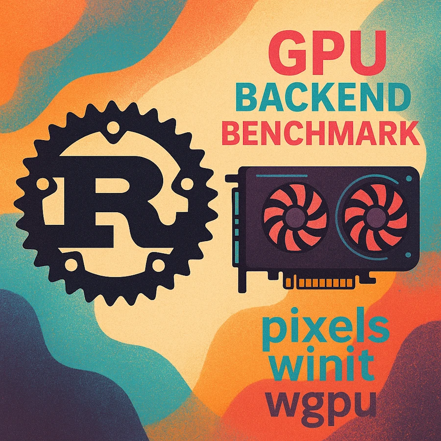<br/>
<span>Rust, Winit & Pixels: Understanding GPU Selection and Performance.</span>
</div>


## Table of Contents
{: .no_toc .text-delta}
- TOC
{:toc}


<!-- ###################################################################### -->
<!-- ###################################################################### -->
<!-- ###################################################################### -->

## Introduction
Initially, this post was "Step 11" of the post about [Game of Life, Winit and Pixels]() but the section became way too long so I made a dedicated post. To give you some context, imagine you're writing a Rust+Winit+Pixels application and you want to better understand what's going on with the GPU. 

For example, which board is used? How the selection is made? Can I force one board to be used? What is a backend? What is the `wgpu` crate? What can I expect in terms of performances?

Before we dive into the subject, let's get in sync about **my** configuration because results will be different on yours (you might be running Linux with 3 video boards).
* I use a [laptop]() with 2 video boards
* To check your hardware config you can `WIN+X` then select `Device manager` then select `Video boards` in the tree:

<div align="center">
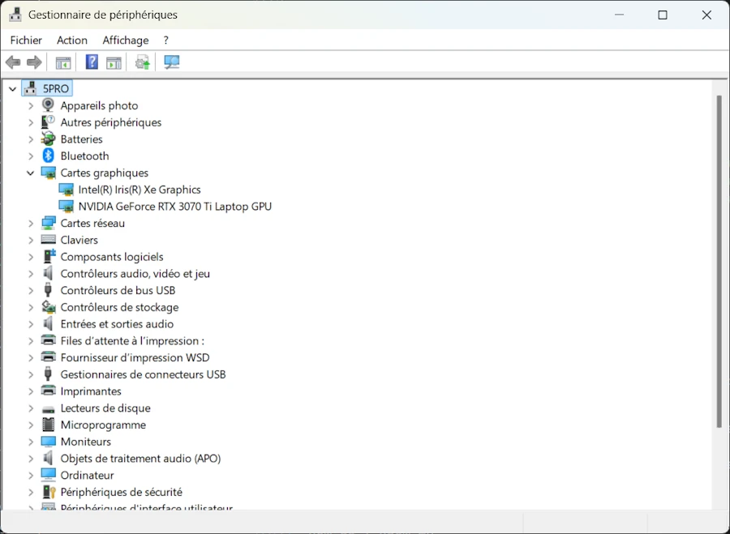<br/>
<!-- <span>cargo run -p step_11 --example demo_00</span> -->
</div>

Now, let's check the status of DirectX. To do so you can use one of the 2 commands below:

```powershell
dxdiag
dxdiag /t "./dxdiag.txt" 
```

<div align="center">
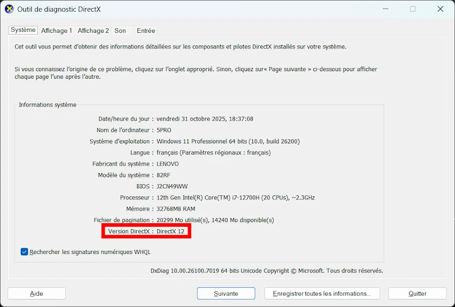<br/>
<span>dxdiag</span>
</div>

**Don't use** this command: 
* `Get-ItemProperty "HKLM:\SOFTWARE\Microsoft\DirectX" | Select-Object Version` 
* It reports obsolete information.


It is time to get the project from GitHub, open it in VSCode and let's check everything is in place.

To do so, follow me blindly and once in VSCode, open a terminal (CTRL+ù on FR keyboard) then enter the command : `cargo run -p step_11 --example demo_00`

You should see a blue window like the one below and some logging messages in the terminal.

<div align="center">
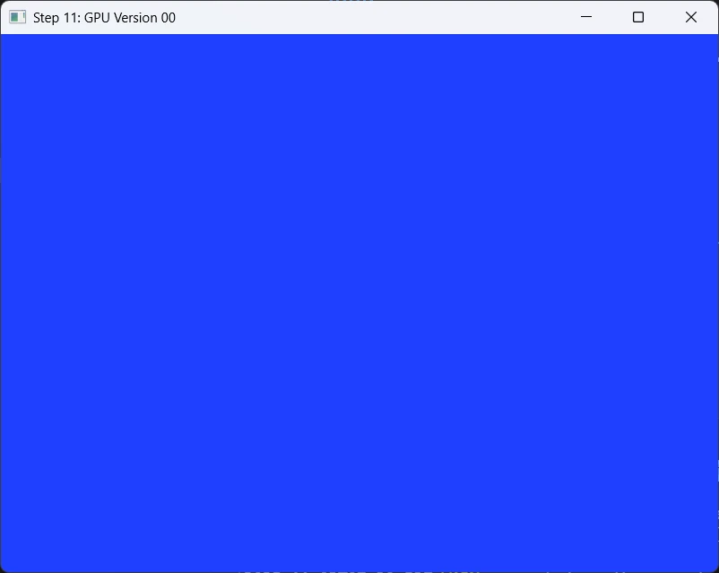<br/>
<span><code>cargo run -p step_11 --example demo_00</code></span>
</div>


If it is the case, welcome on board, everything seems to be in place. Now we can talk...

The Rust workspace includes many different packages : `00_winit_029`, `05`, `15`... `99_rle_downloader` 
* **Optional:** If you know how to manage a Rust workspace you can delete all the subdirectories except the one named **`11`**. Don't forget to edit the `Cargo.toml` at the root of the directory tree.

Open the directory `11`. It should look like this:

<div align="center">
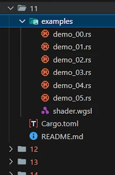<br/>
<!-- <span>Optional comment</span> -->
</div>


Since I plan to have more than one test, I use a feature I really like in Rust packages. I put the source code of the different experiments in the `examples/` directory. And look, there is not even a `src/` directory in this package. This also explains why we need the command below to run the experiment:

```powershell
cargo run -p step_11 --example demo_00
```
* `-p`: indicates that we run the code from the package named `step_11`. The directory name is `11` but the name of the package is`step_11`.
* `--example demo_00`: points the source code to build and run 


Last point to check before we take off. Open `11/Cargo.toml`. It should look like:

```toml
[package]
name = "step_11"
version = "0.1.0"
edition = "2024"

[dependencies]
env_logger = "0.11.8"
pixels = "0.15"
winit = { version = "0.30", features = ["rwh_06"] }
```

In our experiments we need to log messages from the `wgpu` crate so we need to have the `env_logger` crate in `Cargo.toml`.
In addition, as explained in the [initial post]() I use `Pixels 0.15` and `Winit 0.30` — both in their latest version (in Nov 2025).

OK... Now, having all this in mind let's see what happens on **my** system and don't be surprised if the results differ on yours.


<!-- ###################################################################### -->
<!-- ###################################################################### -->
<!-- ###################################################################### -->

## `demo_00.rs`

* Run, again, the code with this command: `cargo run -p step_11 --example demo_00`
* You can test this command: `$env:RUST_LOG='wgpu_core=trace'; cargo run -p step_11 --example demo_00; Remove-Item env:RUST_LOG`


<div align="center">
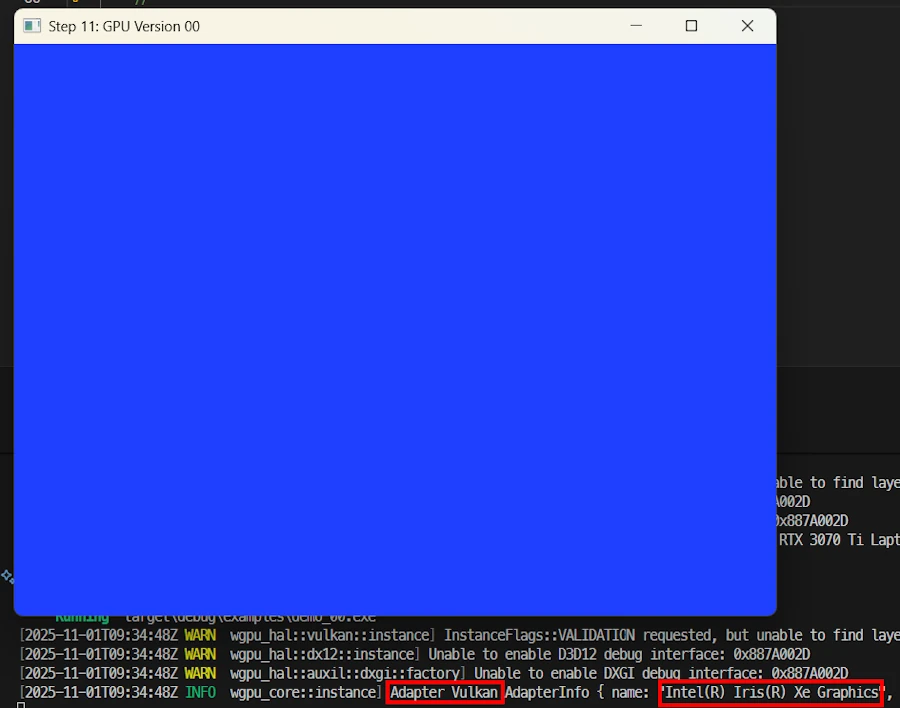<br/>
<span><code>cargo run -p step_11 --example demo_00</code></span>
</div>


Above I moved the window close to the terminal so that we can read a part of the logs. Click on the image above to enlarge it and read the text in the red rectangles.

The code source I use for the experiments is a copy of the first one I had in the [initial post]() when I started to use `winit 0.30`. It is supposed to be short (less than 70 LOC) and easy to understand. Here it is:

```rust
use pixels::{Pixels, SurfaceTexture};
use winit::{
    application::ApplicationHandler,
    event::WindowEvent,
    event_loop::{ActiveEventLoop, ControlFlow, EventLoop},
    window::Window,
};

const WIDTH: u32 = 200;
const HEIGHT: u32 = 150;

pub type Error = Box<dyn std::error::Error>;
pub type Result<T> = std::result::Result<T, Error>;

#[derive(Default)]
struct App {
    window: Option<&'static Window>,
    pixels: Option<Pixels<'static>>,
}

impl ApplicationHandler for App {
    fn resumed(&mut self, event_loop: &ActiveEventLoop) {
        let window = event_loop.create_window(Window::default_attributes().with_title("Step 11: GPU Version 00")).unwrap();
        let window_ref: &'static Window = Box::leak(Box::new(window));
        let size = window_ref.inner_size();
        let surface = SurfaceTexture::new(size.width, size.height, window_ref);
        let pixels = Pixels::new(WIDTH, HEIGHT, surface).unwrap();
        self.window = Some(window_ref);
        self.pixels = Some(pixels);
    }

    fn window_event(&mut self, event_loop: &ActiveEventLoop, _: winit::window::WindowId, event: WindowEvent) {
        match event {
            WindowEvent::CloseRequested => event_loop.exit(),
            WindowEvent::RedrawRequested => {
                if let Some(pixels) = &mut self.pixels {
                    let frame = pixels.frame_mut();
                    for pixel in frame.chunks_exact_mut(4) {
                        pixel[0] = 0x20; // R
                        pixel[1] = 0x40; // G
                        pixel[2] = 0xFF; // B
                        pixel[3] = 0xFF; // A
                    }
                    pixels.render().unwrap();
                }
                if let Some(window) = &self.window {
                    window.request_redraw();
                }
            }
            _ => {}
        }
    }

    fn about_to_wait(&mut self, _: &ActiveEventLoop) {
        self.window.expect("Bug - Window should exist").request_redraw();
    }
}

fn main() -> Result<()> {
    env_logger::Builder::from_env(env_logger::Env::default().default_filter_or("wgpu_core=info,wgpu_hal=warn,wgpu=warn")).init();

    let event_loop = EventLoop::new()?;
    event_loop.set_control_flow(ControlFlow::Poll);

    let mut app = App::default();
    event_loop.run_app(&mut app)?;

    Ok(())
}
```
The explanations are available in this [page](#step-00-a-gentle-start-ii) 

Here, I just add the call `env_logger::Builder::from_env(...)` at the very beginning of the `main()` function. 


```rust
fn main() -> Result<()> {
    env_logger::Builder::from_env(env_logger::Env::default().default_filter_or("wgpu_core=info,wgpu_hal=warn,wgpu=warn")).init();

    let event_loop = EventLoop::new()?;
    event_loop.set_control_flow(ControlFlow::Poll);

    let mut app = App::default();
    event_loop.run_app(&mut app)?;

    Ok(())
}
```

If you open the source (`11/examples/demo_00.rs`) don't be surprised if there are many comment lines with no text. This will help us later to compare the different source code.

Below are the messages I can read in the VSCode's terminal.

```powershell
[2025-10-31T16:56:19Z WARN  wgpu_hal::vulkan::instance] InstanceFlags::VALIDATION requested, but unable to find layer: VK_LAYER_KHRONOS_validation
[2025-10-31T16:56:19Z WARN  wgpu_hal::dx12::instance] Unable to enable D3D12 debug interface: 0x887A002D
[2025-10-31T16:56:19Z WARN  wgpu_hal::auxil::dxgi::factory] Unable to enable DXGI debug interface: 0x887A002D
[2025-10-31T16:56:19Z INFO  wgpu_core::instance] Adapter Vulkan AdapterInfo { name: "Intel(R) Iris(R) Xe Graphics", vendor: 32902, device: 18086, device_type: IntegratedGpu, driver: "Intel Corporation", driver_info: "Intel driver", backend: Vulkan }
```

The `WARN`ings from `wgpu` are expected when debug layers are not installed (my case). They indicate that Vulkan or DirectX validation layers are missing, not that something is wrong. By default, `wgpu` selected the integrated Intel GPU ("Intel Iris Xe") as the rendering device. This is normal behavior on systems with multiple GPUs. At the end of the last line we can read that the `backend` used is Vulkan.

OK... My laptop cost 2M$ and I'm not able to use the NVIDIA GPU? Interesting... 


<!-- ###################################################################### -->
<!-- ###################################################################### -->
<!-- ###################################################################### -->

## Defining the words `wgpu` and `backend`

<!-- **Looks like I’m the master of the world… Mwahahaha! I control everything...** OK, calm down and let's look at the MOF (making of). For what I understand, when working with `wgpu` and the `pixels` crates, there are multiple layers of control over which GPU and graphics backend our application uses. It is similar to what I learn a looooong time ago with OpenGL.

So before we can mode on we need to agree on the terms and conditions... -->

Before we can go further, let's define these 2 important words. A `backend` is the native graphics API that `wgpu` uses to communicate with the GPU. The situation looks like:

```
Your Rust code (Rust + wgpu) <-- see wgpu
         ↓
     [Translation]
         ↓
Backend (DX12 or Vulkan) <-- see backend  
         ↓
     GPU driver
         ↓
Physical GPU (Intel Iris or NVIDIA)
```

The GPU doesn’t understand Rust nor `wgpu` directly. It understands specific graphics APIs. Choosing a `backend` doesn’t change **which GPU** is used (Intel vs NVIDIA) — it changes **how** `wgpu` communicates with it. 

`wgpu` is an **abstraction layer**. Go back to the last logging messages and read again. Do you see `[2025-10-31T16:56:19Z WARN  wgpu_hal::vulkan::instance]` where `wgpu_hal` has nothing to do with "2001: a space odyssey" but stands for "**H**ardware **A**bstraction **L**ayer" 

* We write `wgpu` code (identical for all platforms)
* `wgpu` translates it to the chosen `backend` (DX12, Vulkan, Metal, OpenGL…)
* The `backend` talks to the GPU driver
* The driver controls the physical GPU


### The 2 main `backends` on Windows 11 (my case)

1. **DirectX 12 (DX12)**
   * Developed by Microsoft for Windows
   * Native and optimized for the Windows ecosystem
   * The GPU understands DirectX 12 commands
   * NVIDIA/Intel drivers are heavily tuned for DX12 on Windows

2. **Vulkan**
   * Graphics API from the Khronos Group
   * Open, cross-platform (Windows, Linux, Android)
   * Same code runs on Windows, Linux, Android
   * Potentially offers more control and performance
   * The GPU understands Vulkan commands
   * Requires Vulkan drivers to be installed

### `backends` available on other platforms**

* **Metal** (macOS, iOS) – Apple’s graphics API
* **WebGPU** – for web browsers
* **OpenGL** – old cross-platform standard (available on WIN11)


<!-- ###################################################################### -->
<!-- ###################################################################### -->
<!-- ###################################################################### -->

## Back to `demo_00.rs`, the first level of control 

Here we are in **automatic mode** and in a context where we want to learn more about the GPU, the line of code of interest is this one (check the `resumed()` method):

```rust
let pixels = Pixels::new(WIDTH, HEIGHT, surface).unwrap();
```

With this single line:
- `wgpu` automatically selects the "best" backend for our platform
- `wgpu` automatically selects the "best" GPU adapter
- Default presentation mode (Fifo/vsync)
- Automatic surface resize handling (works well in most cases)


**Backend priority on Windows:**
1. Vulkan (if available and working)
2. DX12 (fallback)
3. DX11 (last resort)

**GPU priority:**
- Prefers **integrated GPU** (lower power consumption)
    - `Intel Iris Xe` in my case
    - The `NVIDIA GeForce RTX 3070 Ti` is called the **discrete GPU**

**Pros:**
- Automatic mode, simple, works out of the box
- Less code to write
- Handles resize events automatically with Vulkan

**Cons:**
- No control over which GPU or backend
- Does not use my expensive and high-performance GPU (NVIDIA)


<!-- ###################################################################### -->
<!-- ###################################################################### -->
<!-- ###################################################################### -->

## `demo_01.rs`

* Run the experiment with this command: `cargo run -p step_11 --example demo_01`


<div align="center">
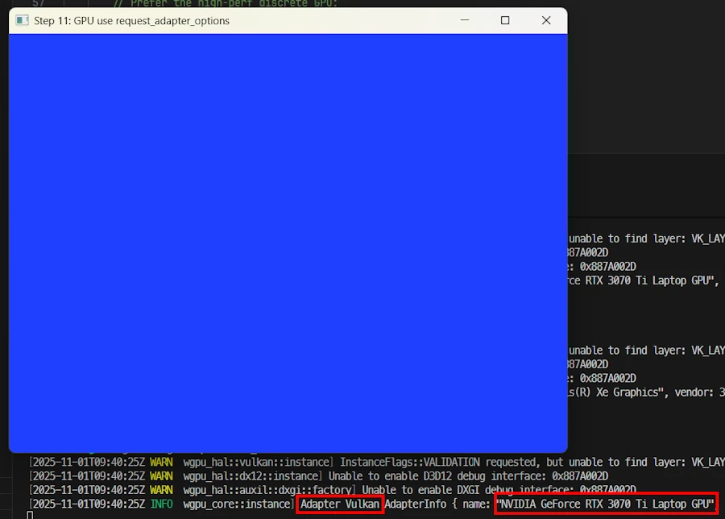<br/>
<span><code>cargo run -p step_11 --example demo_01</code></span>
</div>

Cool, I'm able to select the NVIDIA GPU.

```powershell
[2025-10-31T17:27:53Z WARN  wgpu_hal::vulkan::instance] InstanceFlags::VALIDATION requested, but unable to find layer: VK_LAYER_KHRONOS_validation
[2025-10-31T17:27:53Z WARN  wgpu_hal::dx12::instance] Unable to enable D3D12 debug interface: 0x887A002D
[2025-10-31T17:27:53Z WARN  wgpu_hal::auxil::dxgi::factory] Unable to enable DXGI debug interface: 0x887A002D
[2025-10-31T17:27:54Z INFO  wgpu_core::instance] Adapter Vulkan AdapterInfo { name: "NVIDIA GeForce RTX 3070 Ti Laptop GPU", vendor: 4318, device: 9440, device_type: DiscreteGpu, driver: "NVIDIA", driver_info: "566.14", backend: Vulkan }
```

The last `INFO` line confirms that `wgpu` now chose the `NVIDIA GeForce RTX 3070 Ti` hardware and is using the `Vulkan` backend.


<div align="center">
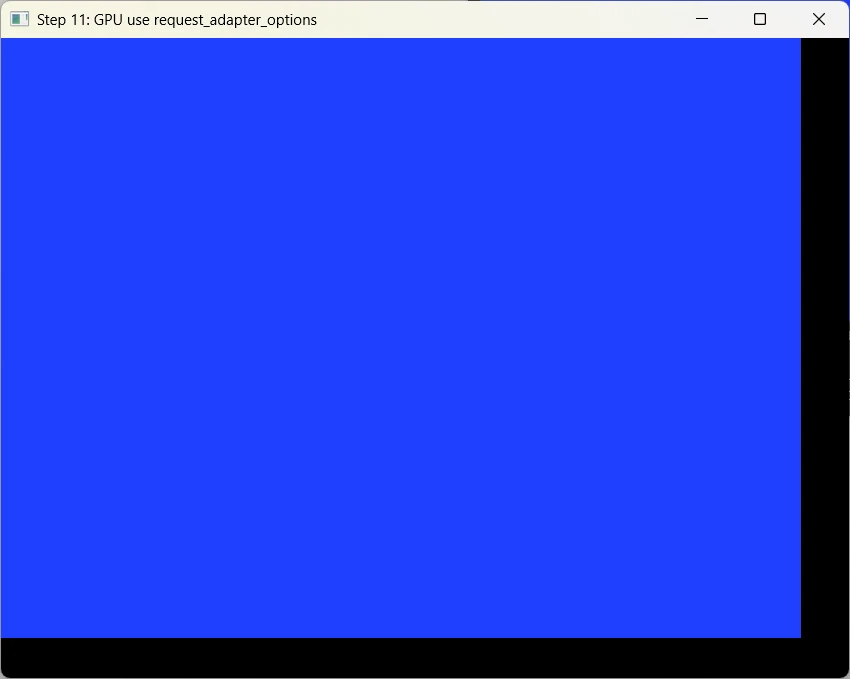<br/>
<span>Ooops... I tried to resize the window</span>
</div>

Not so cool... Indeed when I resize the window, the blue background seems to be "freezed in place".


Compared to `demo_00.rs`, I added `use pixels::wgpu;` at the top of the code then all the changes are in the `resumed()` method:

```rust
fn resumed(&mut self, event_loop: &ActiveEventLoop) {
        let window = event_loop.create_window(Window::default_attributes().with_title("Step 11: GPU use request_adapter_options")).unwrap();
        let window_ref: &'static Window = Box::leak(Box::new(window));
        let size = window_ref.inner_size();
        let surface = SurfaceTexture::new(size.width, size.height, window_ref);

        let mut builder = PixelsBuilder::new(WIDTH, HEIGHT, surface);

        // Prefer the high-perf discrete GPU
        builder = builder.request_adapter_options(wgpu::RequestAdapterOptions {
            power_preference: wgpu::PowerPreference::HighPerformance,
            compatible_surface: None, 
            force_fallback_adapter: false,
        });

        let mut pixels = builder.build().expect("create pixels");

        pixels.set_present_mode(wgpu::PresentMode::Fifo); 

        self.window = Some(window_ref);
        self.pixels = Some(pixels);
    }
```

More specifically the changes are concentrated in these 3 lines of code:

```rust
let mut builder = PixelsBuilder::new(WIDTH, HEIGHT, surface);
builder = builder.request_adapter_options(wgpu::RequestAdapterOptions {
    power_preference: wgpu::PowerPreference::HighPerformance,
    compatible_surface: None, 
    force_fallback_adapter: false,
});
let mut pixels = builder.build().expect("create pixels");
```
* With `PixelsBuilder::new()` we instantiate "something" which helps us to create the customized pixel buffer we need. 
* Then we set the options we want. One of interest here is `power_preference`. When set to `wgpu::PowerPreference::HighPerformance` the builder will try to use the discrete GPU rather than the integrated one (`wgpu::PowerPreference::LowPower`)
* Once the attributes are set, we ask the factory method to give us the customized pixel we want
* The pixel buffer is then used in the rest of the code as it was in `demo_00.rs`.


<!-- ###################################################################### -->
<!-- ###################################################################### -->
<!-- ###################################################################### -->

## Explaining `wgpu::PresentMode`

The penultimate line of the `resume()` method above is new. It is not necessary here because I use the default value (`wgpu::PresentMode::Fifo`). However it is a good opportunity to talk about the different `wgpu::PresentMode` available. 

First, find the line in the previous source code.

```rust
pixels.set_present_mode(wgpu::PresentMode::Fifo);
```

When we call `pixels.render()`, `wgpu` sends our image to the GPU, which displays it via the **swap chain**. 
The swap chain is a queue of images between the GPU and the screen.
The `wgpu::PresentMode` controls when these images are sent to the screen, and whether to wait for vertical synchronization (vsync).


### Fifo (Default - VSync ON)
{: .no_toc }

Each image is displayed at the screen refresh rate, often 60 Hz.
The GPU renders to a buffer while the screen displays the previous image.
When the screen is ready (new “vertical blank”), the new image is presented.

* Advantages:
    * No tearing (tearing happens when the screen displays two frames partially).
    * Lower power consumption
    * Stable and compatible everywhere (WebGPU requires Fifo at a minimum).
* Disadvantages:
    * FPS is limited to the screen refresh rate (60Hz typically, 100Hz on my system)
    * Low latency (~1 frame).

Ideal for stable “visual” apps, games, and to save GPU power.


### Immediate (VSync OFF)
{: .no_toc }

The GPU displays each frame immediately, without waiting for the next screen refresh.

* Advantages:
    * Allows us to measure the actual performance of the GPU pipeline (maximum frames per second).
    * Reduction in perceived latency (useful for benchmarking or ultra-fast interactive rendering).
* Disadvantages:
    * Risk of tearing.
    * Higher GPU consumption (since it runs without pause).
    * Not always supported depending on the backend or card (`wgpu` then automatically switches to Fifo).

Excellent for benchmarks or performance tests.


Can I use the `Immediate` presentation mode once I called `let pixels = Pixels::new()`, the first automatic and easy way of doing? Yes you can. 

* Run the experiment with this command: `cargo run -p step_11 --example demo_00bis`
* Check out the log. You should see : "Present mode: Immediate"


### Mailbox (Triple buffering)
{: .no_toc }

- Low latency with reduced tearing
- Higher GPU usage than Fifo
- Best for competitive games, low-latency apps


### AutoVsync / AutoNoVsync
{: .no_toc }

- Platform-specific automatic selection


<!-- ###################################################################### -->
<!-- ###################################################################### -->
<!-- ###################################################################### -->

## Back to `demo_01.rs`, the second level of control

```rust
let mut builder = PixelsBuilder::new(WIDTH, HEIGHT, surface);
builder = builder.request_adapter_options(wgpu::RequestAdapterOptions {
    power_preference: wgpu::PowerPreference::HighPerformance,
    compatible_surface: None, 
    force_fallback_adapter: false,
});
let mut pixels = builder.build().expect("create pixels");
```

Play the game. In VSCode open `demo_00.rs` and `demo_01.rs` side by side and check the modifications.

<div align="center">
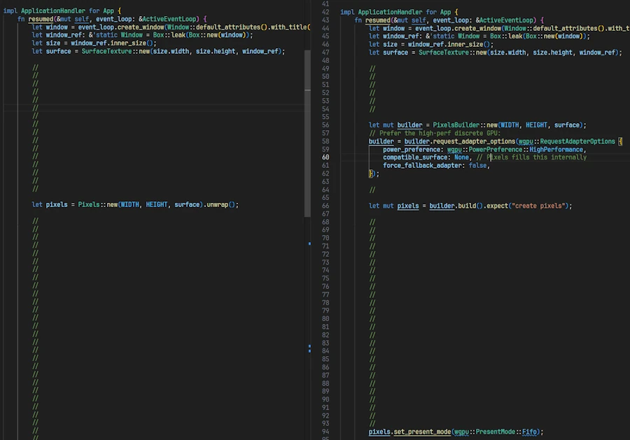<br/>
<!-- <span>Optional comment</span> -->
</div>

Alternatively you can right click on `demo_00.rs` and select `Select For Compare`. Then right click on `demo_01.rs` and select `Compare with Selected`. However, in this particular case, I prefer the first method of comparaison.

**What happens:**
- Backend selection is still automatic. Here Vulkan.
- The GPU selection is **influenced** by `power_preference`
  - `HighPerformance` → prefers the discrete GPU (NVIDIA)
  - `LowPower` → prefers the integrated GPU (Intel Iris)

**Important notes:**
- `power_preference` is a **hint**, not a guarantee
- `wgpu` may still choose the integrated GPU if:
  - The discrete GPU driver has issues
  - The backend doesn't support it properly
  - Compatibility requirements override the preference

**Resize behavior:**
- Based on the tests, it seems I need to manually handle `WindowEvent::Resized`
- Indeed, with this combination (Vulkan/NVIDIA) the blue area won't resize


<!-- ###################################################################### -->
<!-- ###################################################################### -->
<!-- ###################################################################### -->

## `demo_02.rs`, the third level of control
* Run the experiment with this command: `cargo run -p step_11 --example demo_02`

<div align="center">
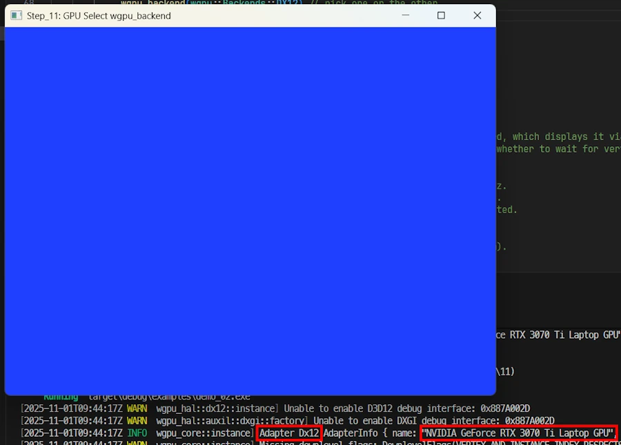<br/>
<span><code>cargo run -p step_11 --example demo_02</code></span>
</div>

I selected the `NVIDIA` board and the `backend`. Now it is `Dx12` while is was `Vulkan` until now. Resizing the window seems to be working.

```powershell
[2025-10-31T17:46:54Z WARN  wgpu_hal::dx12::instance] Unable to enable D3D12 debug interface: 0x887A002D
[2025-10-31T17:46:54Z WARN  wgpu_hal::auxil::dxgi::factory] Unable to enable DXGI debug interface: 0x887A002D
[2025-10-31T17:46:55Z INFO  wgpu_core::instance] Adapter Dx12 AdapterInfo { name: "NVIDIA GeForce RTX 3070 Ti Laptop GPU", vendor: 4318, device: 9440, device_type: DiscreteGpu, driver: "", driver_info: "", backend: Dx12 }
[2025-10-31T17:46:55Z WARN  wgpu_core::instance] Missing downlevel flags: DownlevelFlags(VERTEX_AND_INSTANCE_INDEX_RESPECTS_RESPECTIVE_FIRST_VALUE_IN_INDIRECT_DRAW)
    The underlying API or device in use does not support enough features to be a fully compliant implementation of WebGPU. A subset of the features can still be used. If you are running this program on native and not in a browser and wish to limit the features you use to the supported subset, call Adapter::downlevel_properties or Device::downlevel_properties to get a listing of the features the current platform supports.      
[2025-10-31T17:46:55Z WARN  wgpu_core::instance] DownlevelCapabilities {
        flags: DownlevelFlags(
            COMPUTE_SHADERS | FRAGMENT_WRITABLE_STORAGE | INDIRECT_EXECUTION | BASE_VERTEX | READ_ONLY_DEPTH_STENCIL | NON_POWER_OF_TWO_MIPMAPPED_TEXTURES | CUBE_ARRAY_TEXTURES | COMPARISON_SAMPLERS | INDEPENDENT_BLEND | VERTEX_STORAGE | ANISOTROPIC_FILTERING | FRAGMENT_STORAGE | MULTISAMPLED_SHADING | DEPTH_TEXTURE_AND_BUFFER_COPIES | WEBGPU_TEXTURE_FORMAT_SUPPORT | BUFFER_BINDINGS_NOT_16_BYTE_ALIGNED | UNRESTRICTED_INDEX_BUFFER | FULL_DRAW_INDEX_UINT32 | DEPTH_BIAS_CLAMP | VIEW_FORMATS | UNRESTRICTED_EXTERNAL_TEXTURE_COPIES | SURFACE_VIEW_FORMATS | NONBLOCKING_QUERY_RESOLVE,
        ),
        limits: DownlevelLimits,
        shader_model: Sm5,
    }
```


Read the third line. `wgpu` is successfully initialized with the `DirectX 12` backend. The selected adapter is the `NVIDIA GeForce RTX 3070 Ti` (see `DiscreteGpu`). Dx12 debug layers are not installed, which only affects developer diagnostics. "Downlevel" warnings indicate that some optional WebGPU features are not fully supported by the DX12 `backend`, but this does not affect normal rendering or compute shader usage.


In `resumed()`, the line of code of interest are the ones below:

```rust
let mut builder = PixelsBuilder::new(WIDTH, HEIGHT, surface);
builder = builder.request_adapter_options(wgpu::RequestAdapterOptions {
    power_preference: wgpu::PowerPreference::HighPerformance,
    compatible_surface: None, 
    force_fallback_adapter: false,
});

builder = builder.wgpu_backend(wgpu::Backends::DX12); // wgpu::Backends::VULKAN

let mut pixels = builder.build().expect("create pixels");
```

Compared to `demo_01.rs` only one line was added :

```rust
builder = builder.wgpu_backend(wgpu::Backends::DX12); // wgpu::Backends::VULKAN
```

**What happens:**
- GPU: still influenced by `power_preference`
- Backend: **explicitly forced** to DX12 (or Vulkan)


<!-- ###################################################################### -->
<!-- ###################################################################### -->
<!-- ###################################################################### -->

## About the Resize Problem 
To tell the truth I'm NOT 110% sure...

### Why demo_00 works without resize handling:
{: .no_toc }

```rust
let pixels = Pixels::new(WIDTH, HEIGHT, surface).unwrap();
```

* It uses Vulkan with default configuration
* In this case, it *seems* that the automatic resize handling is enabled


### Why demo_01 require resize handling and NOT demo_02 ?
{: .no_toc }

```rust
let pixels = PixelsBuilder::new(...)
    .request_adapter_options(...) // Custom options
    .build().unwrap();
```
* With Vulkan Custom configuration *seems* to disable some automatic behaviors
* We now must explicitly handle resizes
* With Dx12 it *seems* there is no need to handle the resizes but I recommend to double check if the window content behaves as expected 

I would like to propose this **rule of thumb:** If the window can be resized, when we use `PixelsBuilder` with custom options, always handle `WindowEvent::Resized`.


<!-- ##### The solution for all PixelsBuilder cases:
```rust
fn window_event(&mut self, event_loop: &ActiveEventLoop, _: winit::window::WindowId, event: WindowEvent) {
    match event {
        WindowEvent::Resized(new_size) => {
            if let Some(pixels) = &mut self.pixels {
                if new_size.width > 0 && new_size.height > 0 {
                    pixels.resize_surface(new_size.width, new_size.height).unwrap();
                }
            }
        }
        WindowEvent::RedrawRequested => {
            // ... rendering code
        }
        // ...
    }
}
``` -->


<!-- ###################################################################### -->
<!-- ###################################################################### -->
<!-- ###################################################################### -->

## Benchmarks ? 

One word of caution. For example with my system I must make sure 
* To plug the 300W power supply and not the much smaller Ugreen 140W I use to have on the USB PD port
* To check that the PC is not in quiet mode
* For the last benchmark, make sure the pipeline goes directly to the board. See below:

<div align="center">
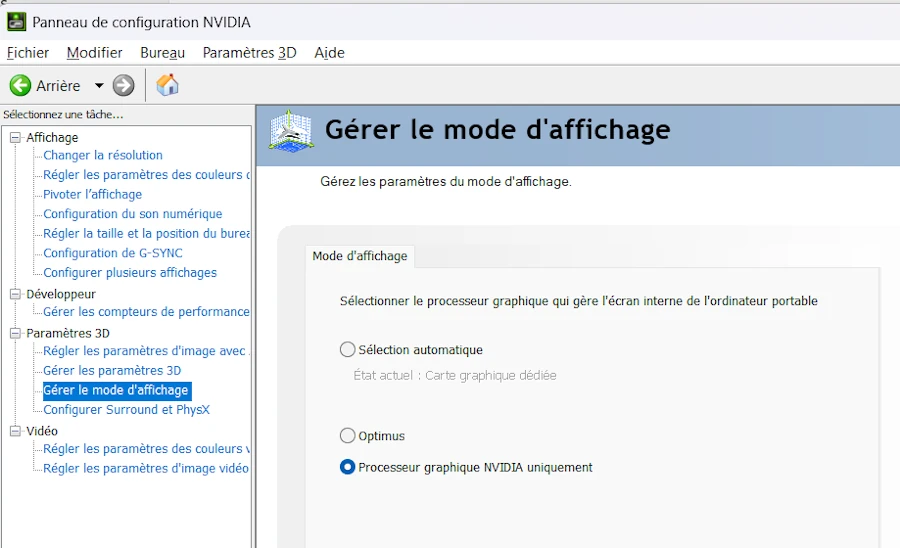<br/>
<!-- <span>Optional comment</span> -->
</div>

You can learn more about how Optimus works in the video below and [Jarrod'sTech channel](https://www.youtube.com/@JarrodsTech).

<div align="center">
<iframe width="560" height="315" src="https://www.youtube.com/embed/h73dFLZgfh4?si=8jAs89dxCwvxyQmm" title="YouTube video player" frameborder="0" allow="accelerometer; autoplay; clipboard-write; encrypted-media; gyroscope; picture-in-picture; web-share" referrerpolicy="strict-origin-when-cross-origin" allowfullscreen></iframe>
</div>


### First attempt
{: .no_toc }

* `cargo run -p step_11 --release --example demo_03`

Here are the log I get

```powershell
cargo run -p step_11 --release --example demo_03
   Compiling step_11 v0.1.0 (C:\Users\phili\OneDrive\Documents\Programmation\rust\14_game_of_life\11)
    Finished `release` profile [optimized] target(s) in 1.03s
     Running `target\release\examples\demo_03.exe`
[2025-11-03T00:30:50Z INFO  wgpu_core::instance] Adapter Dx12 AdapterInfo { name: "NVIDIA GeForce RTX 3070 Ti Laptop GPU", vendor: 4318, device: 9440, device_type: DiscreteGpu, driver: "", driver_info: "", backend: Dx12 }
[2025-11-03T00:30:50Z WARN  wgpu_core::instance] Missing downlevel flags: DownlevelFlags(VERTEX_AND_INSTANCE_INDEX_RESPECTS_RESPECTIVE_FIRST_VALUE_IN_INDIRECT_DRAW)
    The underlying API or device in use does not support enough features to be a fully compliant implementation of WebGPU. A subset of the features can still be used. If you are running this program on native and not in a browser and wish to limit the features you use to the supported subset, call Adapter::downlevel_properties or Device::downlevel_properties to get a listing of the features the current platform supports.
[2025-11-03T00:30:50Z WARN  wgpu_core::instance] DownlevelCapabilities {
        flags: DownlevelFlags(
            COMPUTE_SHADERS | FRAGMENT_WRITABLE_STORAGE | INDIRECT_EXECUTION | BASE_VERTEX | READ_ONLY_DEPTH_STENCIL | NON_POWER_OF_TWO_MIPMAPPED_TEXTURES | CUBE_ARRAY_TEXTURES | COMPARISON_SAMPLERS | INDEPENDENT_BLEND | VERTEX_STORAGE | ANISOTROPIC_FILTERING | FRAGMENT_STORAGE | MULTISAMPLED_SHADING | DEPTH_TEXTURE_AND_BUFFER_COPIES | WEBGPU_TEXTURE_FORMAT_SUPPORT | BUFFER_BINDINGS_NOT_16_BYTE_ALIGNED | UNRESTRICTED_INDEX_BUFFER | FULL_DRAW_INDEX_UINT32 | DEPTH_BIAS_CLAMP | VIEW_FORMATS | UNRESTRICTED_EXTERNAL_TEXTURE_COPIES | SURFACE_VIEW_FORMATS | NONBLOCKING_QUERY_RESOLVE,
        ),
        limits: DownlevelLimits,
        shader_model: Sm5,
    }
FPS (Fifo): 240.1
FPS (Fifo): 222.3
FPS (Fifo): 241.1
FPS (Fifo): 240.1
FPS (Fifo): 222.8
```
This should not be a surprise since my screen frequency is 240Hz. This means that if the code is able to do what it has to do in less than 1/240 second then the maximum FPS will be 240 Hz. Remember here the code is basic: it uses a for loop to fill the background of the window with blue cells. It could be optimized but I want to keep the code of the [initial article]().  

<div align="center">
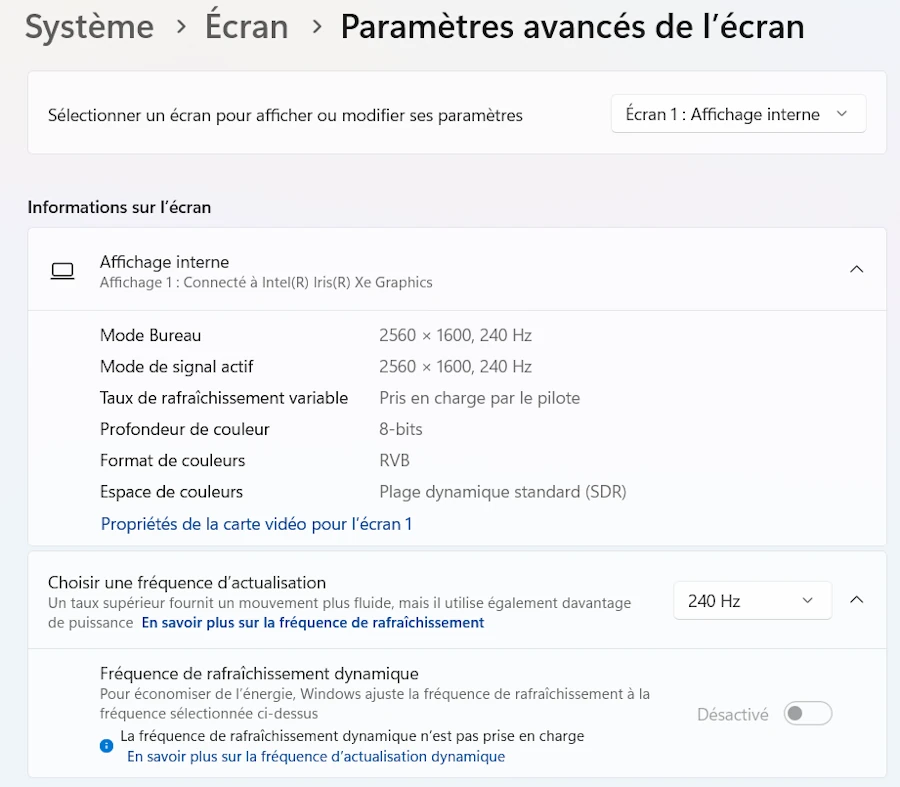<br/>
<!-- <span>Optional comment</span> -->
</div>

The code is similar to the previous ones but I added FPS counting capabilities and some comments to easily change the GPU, the backend and the presentation mode. In addition, when creating the window, I use `.with_resizable(false)` to make sure the window cannot be resized while the test is running. This will help to compare apples with apples. 

The log above can be summarized in one line: 

```
NVIDIA   DX12    Immediate   Average FPS = 240
```

Now if I change the presentation mode to immediate I get:

```
cargo run -p step_11 --release --example demo_03
   Compiling step_11 v0.1.0 (C:\Users\phili\OneDrive\Documents\Programmation\rust\14_game_of_life\11)
    Finished `release` profile [optimized] target(s) in 1.27s
     Running `target\release\examples\demo_03.exe`
[2025-11-03T00:27:37Z INFO  wgpu_core::instance] Adapter Dx12 AdapterInfo { name: "NVIDIA GeForce RTX 3070 Ti Laptop GPU", vendor: 4318, device: 9440, device_type: DiscreteGpu, driver: "", driver_info: "", backend: Dx12 }
[2025-11-03T00:27:37Z WARN  wgpu_core::instance] Missing downlevel flags: DownlevelFlags(VERTEX_AND_INSTANCE_INDEX_RESPECTS_RESPECTIVE_FIRST_VALUE_IN_INDIRECT_DRAW)
    The underlying API or device in use does not support enough features to be a fully compliant implementation of WebGPU. A subset of the features can still be used. If you are running this program on native and not in a browser and wish to limit the features you use to the supported subset, call Adapter::downlevel_properties or Device::downlevel_properties to get a listing of the features the current platform supports.
[2025-11-03T00:27:37Z WARN  wgpu_core::instance] DownlevelCapabilities {
        flags: DownlevelFlags(
            COMPUTE_SHADERS | FRAGMENT_WRITABLE_STORAGE | INDIRECT_EXECUTION | BASE_VERTEX | READ_ONLY_DEPTH_STENCIL | NON_POWER_OF_TWO_MIPMAPPED_TEXTURES | CUBE_ARRAY_TEXTURES | COMPARISON_SAMPLERS | INDEPENDENT_BLEND | VERTEX_STORAGE | ANISOTROPIC_FILTERING | FRAGMENT_STORAGE | MULTISAMPLED_SHADING | DEPTH_TEXTURE_AND_BUFFER_COPIES | WEBGPU_TEXTURE_FORMAT_SUPPORT | BUFFER_BINDINGS_NOT_16_BYTE_ALIGNED | UNRESTRICTED_INDEX_BUFFER | FULL_DRAW_INDEX_UINT32 | DEPTH_BIAS_CLAMP | VIEW_FORMATS | UNRESTRICTED_EXTERNAL_TEXTURE_COPIES | SURFACE_VIEW_FORMATS | NONBLOCKING_QUERY_RESOLVE,
        ),
        limits: DownlevelLimits,
        shader_model: Sm5,
    }
FPS (Fifo): 699.1
FPS (Fifo): 2423.8
FPS (Fifo): 3482.3
FPS (Fifo): 3740.3
FPS (Fifo): 3812.9
FPS (Fifo): 3736.0
FPS (Fifo): 3420.1
FPS (Fifo): 3736.8

```

```
NVIDIA   DX12    Immediate   Average FPS = 3700
```

OK, but let's try something more intensive and where we are sure the cache is updated each time. 


### Second attempt
{: .no_toc }

* `cargo run -p step_11 --release --example demo_04`

<div align="center">
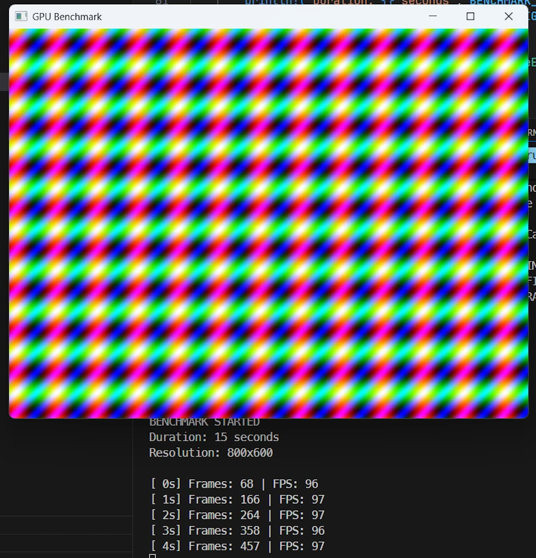<br/>
<!-- <span>Optional comment</span> -->
</div>

If I select Integrated GPU, Vulkan backend and Fifo presentation mode here is what I get:  

```
==================================================
BENCHMARK COMPLETE
==================================================
Total Frames:  1458
Total Time:    15.01s
Average FPS:   97
Frame Time:    10.29ms
```


Now if I select Discrete GPU, Dx12 and Immediate presentation mode, here are the results:

```
==================================================
BENCHMARK COMPLETE
==================================================
Total Frames:  1495
Total Time:    15.01s
Average FPS:   100
Frame Time:    10.04ms
```

What? How is it possible? In fact, as it is, the code only use the CPU except when the texture is sent to the screen. This is confirmed when I look at the ressource manager. There is no activity on the GPU. The main limiting factor here is the processing on the CPU. Check the code, while animating the waves I use `sin()`, `cos()` on `f32` then convert everything as `u8`.

```rust
// Render complex animation 
if let Some(pixels) = &mut self.pixels {
    let frame = pixels.frame_mut();
    let time = self.frame_count as f32 * 0.05;

    // Draw animated pattern 
    for (i, pixel) in frame.chunks_exact_mut(4).enumerate() {
        let x = (i % WIDTH as usize) as f32;
        let y = (i / WIDTH as usize) as f32;

        // Animated waves
        let r = ((x / 10.0 + time).sin() * 127.0 + 128.0) as u8;
        let g = ((y / 10.0 + time).cos() * 127.0 + 128.0) as u8;
        let b = ((x / 5.0 + y / 5.0 + time).sin() * 127.0 + 128.0) as u8;

        pixel[0] = r;
        pixel[1] = g;
        pixel[2] = b;
        pixel[3] = 0xFF;
    }

    pixels.render().ok();
}
```


### Third attempt
{: .no_toc }


* `cargo run -p step_11 --release --example demo_05`

<div align="center">
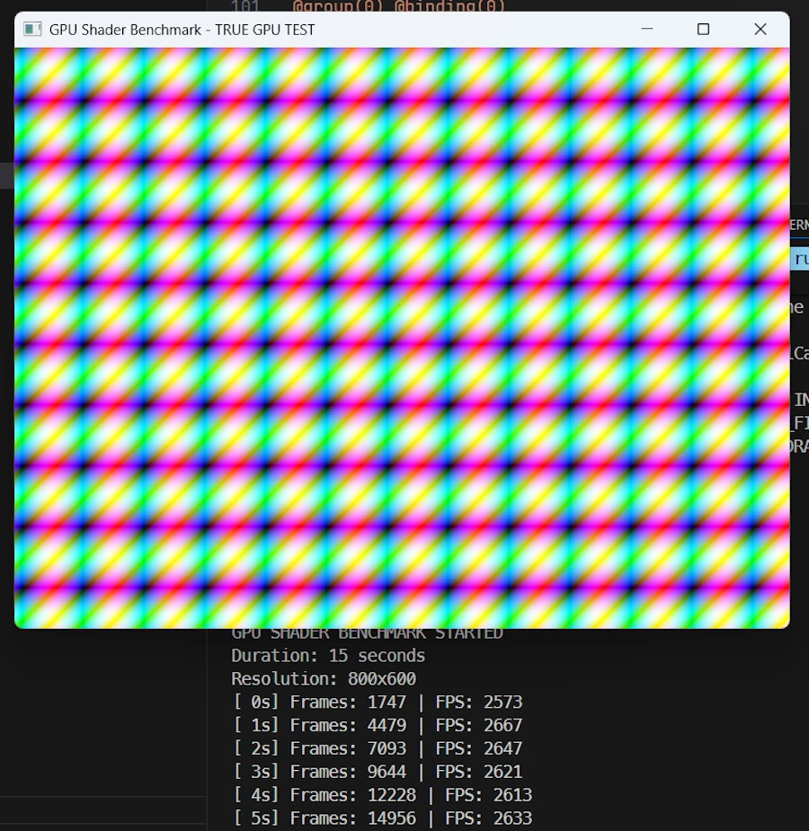<br/>
<!-- <span>Optional comment</span> -->
</div>


In this version of the code, shaders are used. They run on the GPU.
Yes, the code is available. No I will not explain shaders, nor comment the code here because shaders are a complete subject by themselves. I just wanted to show what happen when we really put the GPU at work.


```
==================================================
BENCHMARK COMPLETE
==================================================
Total Frames:  42460
Total Time:    15.03s
Average FPS:   2825
Frame Time:    0.35ms

```


### Conclusion about the benchmarks
{: .no_toc }

As it is, the code of the [Game Of Life]() does not use shaders. All the processing will be done on the CPU (not the GPU).

We just need to keep this fact in mind. Period.


<!-- ###################################################################### -->
<!-- ###################################################################### -->
<!-- ###################################################################### -->

## Which Method to Use?

```
Are we building a cross-platform app?
├─ YES → Use Vulkan explicitly + handle resize
│        .wgpu_backend(wgpu::Backends::VULKAN)
│
└─ NO (Windows-only)
   │
   Do I need high-performance GPU?
   ├─ YES → Use PixelsBuilder + HighPerformance
   │        + verify with logs that NVIDIA is selected
   │        + handle WindowEvent::Resized
   │        + learn shaders programming ?
   │
   └─ NO (integrated GPU is fine)
      │
      Just want it to work?
      └─ Use Pixels::new()
```


<!-- ###################################################################### -->
<!-- ###################################################################### -->
<!-- ###################################################################### -->

## Summary 

| Feature               | `Pixels::new()`      | `PixelsBuilder` + options | `PixelsBuilder` + options + backend |
|-----------------------|----------------------|---------------------------|-------------------------------------|
| **Simplicity**        | ⭐⭐⭐              | ⭐⭐                      | ⭐                                 |
| **GPU Control**       | ❌ None, Integrated  | ⚠️ Hint only             | ⚠️ Hint only                        |
| **Backend Control**   | ❌ None (Vulkan)     | ❌ None (Vulkan)         | ✅ Full                             |
| **Auto Resize**       | ✅ Yes               | ❌ No                    | ❌ No                               |
| **Cross-platform**    | ✅ Yes               | ✅ Yes                   | ⚠️ Backend-dependent                |
| **Best for**          | Prototypes           | Production apps           | Debugging/Optimization              |


<!-- ###################################################################### -->
<!-- ###################################################################### -->
<!-- ###################################################################### -->

## Webliography

`CTRL+click` to open the links in a new tab.

* [wgpu Documentation](https://docs.rs/wgpu)
* [Pixels Documentation](https://docs.rs/pixels)
* [Vulkan vs DirectX Comparison](https://www.khronos.org/vulkan/)
* [WGPU Best Practices](https://github.com/gfx-rs/wgpu/wiki)


