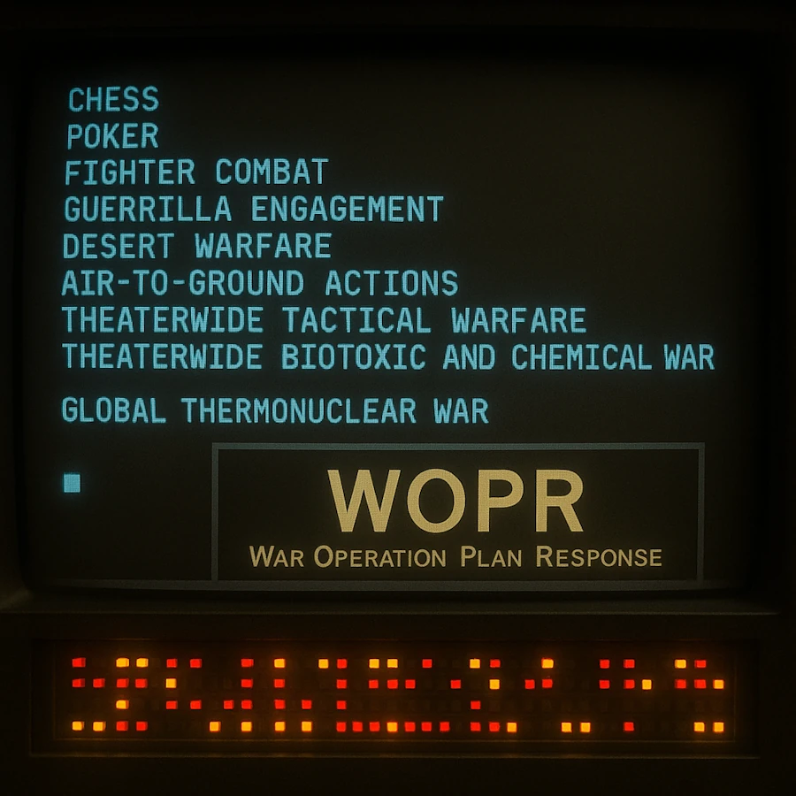
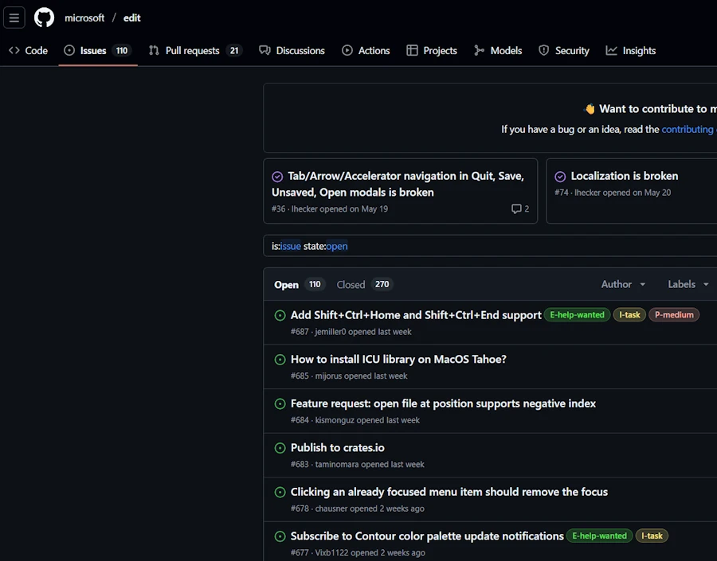
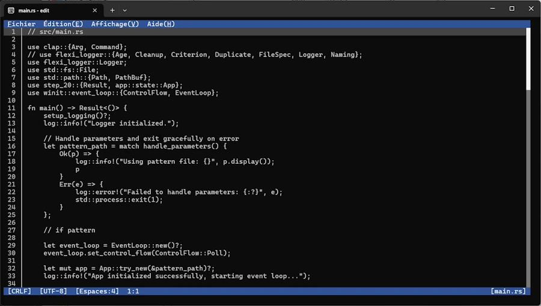
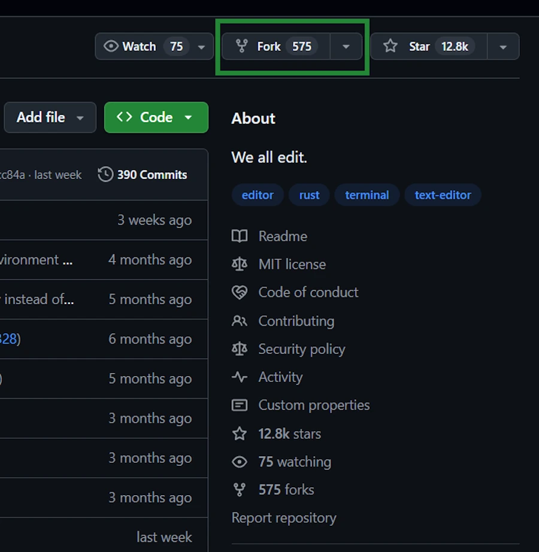
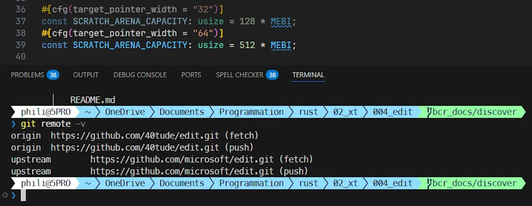
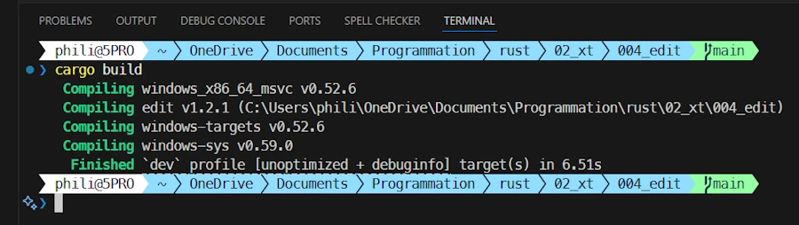
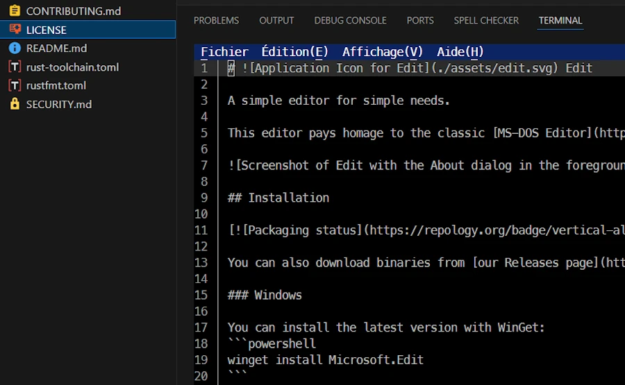
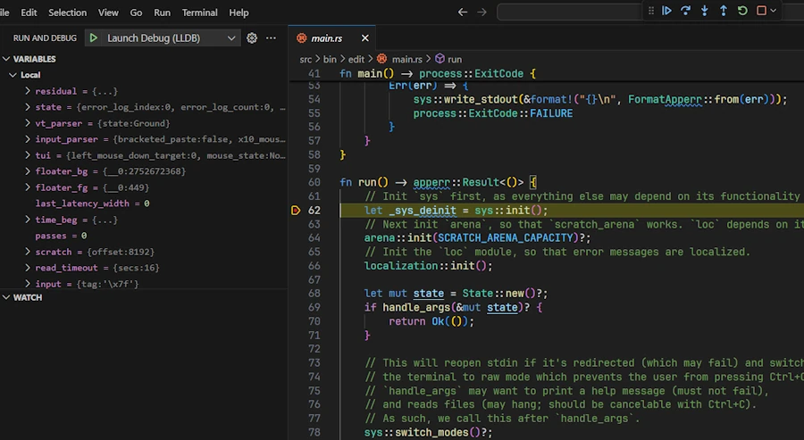

# From Zero to Ready to Contribute: Illustrated with Microsoft Edit
{: .no_toc }

A beginner-friendly guide from our first fork to our first pull request.
{: .lead }


<!-- <h2 align="center">
<span style="color:orange"><b> 🚧 This post is under construction 🚧</b></span>    
</h2> -->


## TL;DR
{: .no_toc }
* ...
* For Rust beginners
* VSCode + Win11 (not tested elsewhere)

<div align="center">
<br/>
<span>From Zero to Ready to Contribute: Illustrated with Microsoft Edit.</span>
</div>


## Table of Contents
{: .no_toc .text-delta}
- TOC
{:toc}


<!-- ###################################################################### -->
<!-- ###################################################################### -->
<!-- ###################################################################### -->
<!-- ###################################################################### -->
<!-- ###################################################################### -->

## 00. Progress Checklist

- [ ] I forked the project
- [ ] I installed the nightly Rust toolchain
- [ ] I read `README.md` carefully
- [ ] I successfully compiled the project
- [ ] I ran the application in debug and release mode
- [ ] I ran the tests
- [ ] I created a branch `xyz_docs/discover`
- [ ] I know the "morning routine" to stay in sync with the original project
- [ ] I read `main.rs`
- [ ] I explored at least 3 other modules
- [ ] I understood the general structure
- [ ] I identified where error handling is located
- [ ] I found an example of `Result<>`
- [ ] I found an example of `unsafe`
- [ ] I installed `CodeLLDB`, set a breakpoint and moved 
- [ ] I read an issue on GitHub
- [ ] I created a test branch
- [ ] I'm ready to contribute!


<!-- ###################################################################### -->
<!-- ###################################################################### -->
<!-- ###################################################################### -->
<!-- ###################################################################### -->
<!-- ###################################################################### -->

## 01. Exercises

### Level 00: Reading
{: .no_toc }

1. Read `src/main.rs` entirely
2. Understand the program flow (from `main()` to the main loop)
3. Identify all functions called from `main()`

### Level 01: Exploration
{: .no_toc }

1. Choose a module file (ex: `fuzzy.rs`)
2. Read all functions
3. Document what each function does (with comments)

### Level 02: Modification
{: .no_toc }

1. Add a debug message when opening a file
2. Compile and test
3. Submit a PR to fix a typo in a comment

### Level 03: Contribution
{: .no_toc }

1. Look at the [Issues](https://github.com/microsoft/edit/issues) with the `E-help-wanted` label
2. Choose a simple issue (ex: improve documentation)
3. Create a branch, make modifications, and submit a PR

<div align="center">
<br/>
<!-- <span>Optional comment</span> -->
</div>


<!-- ###################################################################### -->
<!-- ###################################################################### -->
<!-- ###################################################################### -->
<!-- ###################################################################### -->
<!-- ###################################################################### -->

## 02. Prerequisites

I suppose: 
* You run Windows 11
* [VSCode](https://code.visualstudio.com/) is installed
* [Git](https://git-scm.com/install/windows) is installed
* You have a GitHub account

Now, from the [Install Rust page](https://rust-lang.org/tools/install/), download `rustup-init.exe (64b)`.

Then open a terminal (`WIN+X then I`)

```powershell
rustup-init.exe # this installs rust
rustc --version # just to make sure everything is OK.

# Result:
#       rustc 1.90.0 (1159e78c4 2025-09-14)
```

Regarding setting up Rust on Windows, you can read [dedicated post](#install-rust)


And if you dont know it yet, here how edit looks like:

<div align="center">
<br/>
<!-- <span>Optional comment</span> -->
</div>


<!-- ###################################################################### -->
<!-- ###################################################################### -->
<!-- ###################################################################### -->
<!-- ###################################################################### -->
<!-- ###################################################################### -->

## 03. Creating a fork

* On `https://github.com/microsoft/edit.git`, click the "Fork" button at the top right
* This creates a copy of the project on **YOUR** GitHub account.

<div align="center">
<br/>
<!-- <span>Optional comment</span> -->
</div>

* Clone **YOUR** fork on your local disk. Repeat after me...I clone **MY** forked version, not the original.

```powershell
# The terminal should still be open
git clone https://github.com/YOUR_NAME/edit.git
```

At this point it might be a good idea to move to `microsoft_edit/` directory, open code and open a terminal in VSCode.

```powershell
cd microsoft_edit/
code .
# CTRL + ù to open an integrated terminal
```


**The first time**

```powershell
git switch main # normally we are on the main branch
git remote -v # to check
git remote add upstream https://github.com/microsoft/edit.git
git remote -v # to check again
```


The before last command adds a new "remote" to our local Git repository:
- `git remote add`: adds a new reference to the distant repo
- `upstream`: the name we're giving to this remote 
- `https://github.com/microsoft/edit.git`: the URL of the distant repo

This will help to keep our repo in sync with the original.


<div align="center">
<br/>
<!-- <span>Optional comment</span> -->
</div>


<!-- ###################################################################### -->
<!-- ###################################################################### -->
<!-- ###################################################################### -->
<!-- ###################################################################### -->
<!-- ###################################################################### -->

## 04. Installing the Rust nightly toolchain

We need it to compile Microsoft Edit. We can have both Rust toolchains (stable and nightly) installed side by side on the same PC.

```powershell
rustup install nightly
```


### Check what is installed
{: .no_toc }

```powershell
rustup toolchain list
# Result:
#       stable-x86_64-pc-windows-msvc (active, default)
#       nightly-x86_64-pc-windows-msvc
```


Move to the `microsoft_edit/` directory then verify that `rust-toolchain.toml` exists and that it specifies "nightly"

```powershell
Get-Content rust-toolchain.toml
# Result:
#       [toolchain]
#       channel = "nightly"
```


* When we will run `cargo build` in the `microsoft_edit/` folder, `Cargo` will automatically use the "nightly" version of the compiler
* When we run `cargo build` in one of our folders (one without `rust-toolchain.toml`), `Cargo` will use the "stable" version (our default Rust compiler version)


### What is the active Rust version?
{: .no_toc }

```powershell
rustc --version
# In the `microsoft_edit/` folder:
#       rustc 1.93.0-nightly (c90bcb957 2025-11-06)

# In another folder:
#       rustc 1.90.0 (1159e78c4 2025-09-14)
```


### Display which toolchain will be used
{: .no_toc }

```powershell
rustup show

# Result in `microsoft_edit/` with nightly override:
#       Default host: x86_64-pc-windows-msvc
#       rustup home:  C:\Users\phili\.rustup
#       
#       installed toolchains
#       --------------------
#       stable-x86_64-pc-windows-msvc (default)
#       nightly-x86_64-pc-windows-msvc (active)
#       
#       active toolchain
#       ----------------
#       name: nightly-x86_64-pc-windows-msvc
#       active because: overridden by 'C:\Users\phili\OneDrive\Documents\Programmation\rust\02_xt\004_edit\rust-toolchain.toml'
#       installed targets:
#         x86_64-pc-windows-msvc


# Result in one of our projects:
#       Default host: x86_64-pc-windows-msvc
#       rustup home:  C:\Users\phili\.rustup
#       
#       installed toolchains
#       --------------------
#       stable-x86_64-pc-windows-msvc (active, default)
#       nightly-x86_64-pc-windows-msvc
#       
#       active toolchain
#       ----------------
#       name: stable-x86_64-pc-windows-msvc
#       active because: it's the default toolchain
#       installed targets:
#         x86_64-pc-windows-msvc
```

### How to get the up to date version? 
{: .no_toc }

Indeed, three days from now, before to "touch" Microsoft Edit, we need to get the latest version:  

```powershell
rustup update nightly
```


<!-- ###################################################################### -->
<!-- ###################################################################### -->
<!-- ###################################################################### -->
<!-- ###################################################################### -->
<!-- ###################################################################### -->

## 05. Read `README.md`

* No one can do it for you
* Then take 2 minutes to read `CONTRIBUTING.md`


<!-- ###################################################################### -->
<!-- ###################################################################### -->
<!-- ###################################################################### -->
<!-- ###################################################################### -->
<!-- ###################################################################### -->

## 06. Compile for the first time on the `main` branch (just to check)

If you are not yet in VSCode, move to the `microsoft_edit/` directory otherwise use the integrated terminal which is already open or open a new one. 

### Check the code without compiling
{: .no_toc }

```powershell
cargo check
```

### Compile (development build) and run 
{: .no_toc }

```powershell
cargo build
# Increase the height of the terminal in VSCode
cargo run
```

<div align="center">
<br/>
<!-- <span>Optional comment</span> -->
</div>


**Launch the editor**
```powershell
./target/debug/edit
```

**Launch with a file**
```powershell
cargo run -- README.md # README.md is at the root of the Edit project
cargo run -- do_not_exist.md 

# or directly
./target/debug/edit README.md
./target/debug/edit do_not_exist.md
```

<div align="center">
<br/>
<!-- <span>Optional comment</span> -->
</div>


**Run the tests**
```powershell
cargo test
```


### Compile (optimized release build) and run
{: .no_toc }


Since you read the `README.md` you know that you have to use this command:

```powershell
cargo build --config .cargo/release-nightly.toml --release
```
**Launch the editor**
```powershell
./target/release/edit
```


**Launch it with a file**
```powershell
cargo run -- release -- README.md # README.md is at the root of the Edit project
cargo run -- release -- do_not_exist.md 

# or directly
./target/release/edit README.md
./target/release/edit do_not_exist.md
```


<!-- ###################################################################### -->
<!-- ###################################################################### -->
<!-- ###################################################################### -->
<!-- ###################################################################### -->
<!-- ###################################################################### -->

## 07. Create a branch and discover the project

* We are in VSCode
* One terminal is open (the tests are done)
* We can either create the branch from the console or with the GUI

**Side Note:** Below, the 3 letters "bcr" is the trigram for my last name. Use your own.

```powershell
git switch -c bcr_docs/discover # creates and switches to the `bcr_docs/discover` branch

# Then we can use git switch bcr_docs/discover
```

Normally we plan to behave like visitors, in read-only-ninja mode and we have no intention to make any modification.


### If we break everything
{: .no_toc }

No panic, `git` is our friend.

```powershell
git switch main                 # return to a clean state
git branch -D bcr_docs/discover # delete the branch
git switch -c bcr_docs/discover # start over
```


### If you want to make any modifications
{: .no_toc }

Think twice **BEFORE**. I strongly recommend to create another branch.

```powershell
git switch main
git switch -c other_branch_name

# Or
git switch -c other_branch_name main # pay attention to the `main` at the end
```

If at the end we don't want to keep the branch

```powershell
git switch main                 # return to clean state
git branch -D other_branch_name # delete the branch
```


<!-- ###################################################################### -->
<!-- ###################################################################### -->
<!-- ###################################################################### -->
<!-- ###################################################################### -->
<!-- ###################################################################### -->

## 08. Stay in sync with the original project

Tomorrow morning for example. Move to the `microsoft_edit/` directory.

```powershell
rustup update nightly   # do you remember why?

git fetch upstream      # fetch the updates
git switch main         # leave the branch where we are and go to main
git merge upstream/main # merge the updates
git push origin main    # push to our repo

git switch my_branch                         # return to our branch
git rebase main                              # integrate the latest changes into our branch
git push --force-with-lease origin my_branch # the work then push to our repo
```

Most of the git command can be executed using the GUI. See below an example with `git fetch upstream`:

<div align="center">
<br/>
<!-- <span>Optional comment</span> -->
</div>

**Side Note:** Regarding `--force-with-lease` I'll give much more detail with wonderful drawings (😡) later in this [section](#3-pull-request).


<!-- ###################################################################### -->
<!-- ###################################################################### -->
<!-- ###################################################################### -->
<!-- ###################################################################### -->
<!-- ###################################################################### -->

## 09. Project Structure

Move to the `microsoft_edit/` directory

```powershell
code .
git switch bcr_docs/discover # return to our branch
```


Here is the simplified structure of the Rust project:

```
.
│   .gitignore
│   Cargo.toml
│   README.md
├───.cargo
│       release-nightly.toml
├───benches
│       lib.rs
├───i18n
│       edit.toml
├───src
│   │   framebuffer.rs
│   │   fuzzy.rs
│   │   lib.rs
│   ├───bin
│   │   └───edit
│   │           main.rs
│   ├───simd
│   │       lines_bwd.rs
│   │       lines_fwd.rs
│   │       memchr2.rs
│   │       memset.rs
│   ├───sys
│   │       unix.rs
│   │       windows.rs
│   └───unicode
│           utf8.rs
│
└───tools
```

Build your own tree and add your comments

```powershell
cargo clean
tree /F
```


### Explore `main.rs`
{: .no_toc }


This is the entry point of the application. Look at:
- The `fn main()` function
- How arguments are parsed
- How the editor is initialized

### Identify key modules
{: .no_toc }

arena, buffer, simd, sys, unicode...


<!-- ###################################################################### -->
<!-- ###################################################################### -->
<!-- ###################################################################### -->
<!-- ###################################################################### -->
<!-- ###################################################################### -->

## 10. Points of attention

### Modular architecture
{: .no_toc }

How the project is organized into modules?

Checkout the `mod` and `use` in the code

```rust
// In src/bin/edit/main.rs
mod draw_editor;
mod state;       


// In src/lib.rs
mod fuzzy;     // Import fuzzy.rs
mod sys;        // Import the sys/ folder
```


### `unsafe` code
{: .no_toc }

The project uses a lot of `unsafe` to interact with system APIs (C). This is a good example of FFI (Foreign Function Interface) in Rust.

`CTRL+SHIFT+F` then search for `unsafe`

**Files to look at:**
- `src/sys/unix.rs`
- `src/sys/windows.rs`


### Terminal management
{: .no_toc }

How do they manipulate the terminal?
Look for color for example.


### Algorithms
{: .no_toc }

Fuzzy search and other algorithms

**File to look at:**
- `src/fuzzy.rs`


<!-- ###################################################################### -->
<!-- ###################################################################### -->
<!-- ###################################################################### -->
<!-- ###################################################################### -->
<!-- ###################################################################### -->

## 11. Study error handling 

This is an example of topic to study.

### 1. Search in the code
{: .no_toc }

With VSCode, select `src/` then `SHIFT+ALT+F`

* `Result<`
* `unwrap`
* `expect`
* `enum.*Error` Activate regular expression (ALT+R)
* `struct.*Error` Activate regular expression (ALT+R)

In VSCode, `F12` (Go to Definition), `SHIFT+F12` (Go to Reference) and `CTRL+F12` (Go to Implementation) are our best friends here.


### 2. Interesting files for errors
{: .no_toc }

* `src/sys/unix.rs` and `src/sys/windows.rs`: System errors (I/O, terminal)
* Look for `Result<T, E>` in function signatures
* See how they use `.unwrap()`, `.expect()`, or the `?` operator


<!-- ###################################################################### -->
<!-- ###################################################################### -->
<!-- ###################################################################### -->
<!-- ###################################################################### -->
<!-- ###################################################################### -->

## 12. Debugging 

* Install `CodeLLDB` extension
* Set a breakpoint (`F9`) in `src/bin/edit/main.rs` for example
* Start Debugging (`F5`)
* Move forward line by line (`F10`)
* Inspect variables values on the left hand side

<div align="center">
<br/>
<!-- <span>Optional comment</span> -->
</div>


Enable logs with `env_logger`

```powershell
$env:RUST_LOG='debug'; cargo run; Remove-Item env:RUST_LOG
```
Does it work? Do you know why?


<!-- ###################################################################### -->
<!-- ###################################################################### -->
<!-- ###################################################################### -->
<!-- ###################################################################### -->
<!-- ###################################################################### -->

## 13. Create a Pull Request

No, the plan is NOT to spam the team but to study a scenario.

It is Sunday morning. It is raining... Ok, let's open a terminal in VSCode.


Below I call:

| Term               | Description                              |
|--------------------|------------------------------------------|
| upstream           | Original project on GitHub (source)      |
| origin             | The fork in my personal GitHub repo      |
| local              | The local repository on the PC           |
| A, B, C...         | Commits in Git history                   |
| main               | Main branch                              |
| xyz_docs/typos     | The branch for documentation             |
| main@local         | main branch in local repository          |
| main@origin        | main branch in the fork                  |
| main@upstream      | main branch in the original project      |
| xyz_docs/typos@local | Feature branch in local repository     |
| xyz_docs/typos@origin| Feature branch in fork (origin)        |


### 1. Starting point
{: .no_toc }

```
A --- B --- C
            │
          main@local
          main@origin
```

Before to work on a branch let's make sure `local` and `origin` are in sync with `upstream`.

```powershell
git fetch upstream # fetch the updates from upstream where main@upstream = A B C D E 
                   # Does NOT change the current branch
                   # Saves the new items locally in remote branches such as upstream/main
git switch main    # main@local = A B C
```

The 2 lines above could be replaced with: 

```powershell
git pull upstream main
```

Now we merge the commits and we update `origin`. 

```powershell
git merge upstream/main # main@local = A B C D E 
git push origin main    # main@origin = A B C D E
```


The situation becomes:

```
A --- B --- C --- D --- E
                        │
                      main@local
                      main@origin
                      main@upstream
```


### 2. Working on the branch
{: .no_toc }


```powershell
git switch -c xyz_docs/typos # create & switch to the branch. xyz_docs/typos@local = A B C D E
```

When the job is done on the branch we may have multiple commits on it. The situation looks like this:


```
                      main@origin
                      main@local
                        │
A --- B --- C --- D --- E    
                         \
                          X --- Y         
                                │
                          xyz_docs/typos@local
```


Now we push the branch to origin.


```powershell
git status
git add .
git commit -m "docs: Fix typos in documentation"  # xyz_docs/typos@local = A B C D E X Y
git push origin xyz_docs/typos                    # push the branch to the repo. xyz_docs/typos@origin = A B C D E X Y
```

Here is the situation. There is a branch `xyz_docs/typos@local` and a branch `xyz_docs/typos@origin`.

```
                      main@origin
                      main@local
                        │
A --- B --- C --- D --- E    
                         \
                          X --- Y         
                                │
                          xyz_docs/typos@local
                          xyz_docs/typos@origin
```


### 3. Pull Request
{: .no_toc }


`main@upstream` has evolved, commits have been pulled and it looks like `A - B - C - D - E - F - G - H` 

Before merging `main@upstream` into the branch, it is **strongly recommended** to: 
* switch to `main@local`
* update it
* rebase the feature branch onto this new `main@local`


```powershell
git fetch upstream 
git switch main
git merge upstream/main
```


The branches are now dispatched this way:


```

                                      main@local
                    main@origin       main@upstream
                        │                 │
A --- B --- C --- D --- E --- F --- G --- H    
                         \
                          X --- Y         
                                │
                          xyz_docs/typos@local
                          xyz_docs/typos@origin
```

We can switch to `xyz_docs/typos` and `rebase` it:

```powershell
git switch xyz_docs/typos 
git rebase main
```

The branch `xyz_docs/typos@local` is moved to the end of the history. The history has been re-written but it is linear and easier to understand. The `xyz_docs/typos@origin` did'nt move yet. Note `X'` and `Y'` notation because they are copies of `X` and `Y` but not `X` and `Y` themselves.  

```
                                      main@local
                    main@origin       main@upstream
                        │                 │
A --- B --- C --- D --- E --- F --- G --- H    
                         \                 \
                          X --- Y           X' --- Y'         
                                │                 │
                  xyz_docs/typos@origin   xyz_docs/typos@local
```

It is time to synchronize `xyz_docs/typos@local` and `xyz_docs/typos@origin` because locally we have `A-B-C-D-E-F-G-H-X'-Y'` while we have `A-B-C-D-E-X-Y` on `origin`. To do the sync we use `--force-with-lease` because before forcing the push, Git will check that the remote branch is exactly in the state we last retrieved. If someone else (me from another PC) has pushed commits in the meantime, the command will fail and warn us. This is a security. You can [read this post](https://stackoverflow.com/questions/52823692/git-push-force-with-lease-vs-force).

```powershell
git push --force-with-lease origin xyz_docs/typos
```

Finally we have:

```
                                      main@local
                    main@origin       main@upstream
                        │                 │
A --- B --- C --- D --- E --- F --- G --- H    
                                           \
                                           X --- Y         
                                                 │
                                   xyz_docs/typos@local
                                   xyz_docs/typos@origin
```


**Tadaa!** It is time to go to the GitHub web page of our repo and to open a **pull request**. Press the green button. We review carefully what will be sent then we press OK. When this is done, the PR is then a proposal to merge branch `xyz_docs/typos@origin` of the fork into the main branch of the original project `main@upstream`.


### 4. The days after
{: .no_toc }

<div align="center">
<br/>
<!-- <span>Optional comment</span> -->
</div>

**Task 1:** While waiting our PR to be accepted/rejected, every morning we should continue to synchronize and update `main@local` and `main@origin` which may becomes late otherwise. Indeed `main@uptream` continue to evolve.


```powershell
git fetch upstream              # fetch the updates from upstream where main@upstream = A B C D E F G H I J K
git switch main                 # main@local = A B C D E

git merge upstream/main         # main@local = A B C D E F G H I J K
git push origin main            # main@origin = A B C D E F G H I J K
```

Here is the situation:

```
                                                        main@local
                                                        main@origin
                                                        main@upstream
                                                            │
A --- B --- C --- D --- E --- F --- G --- H --- I --- J --- K    
                                           \
                                           X --- Y         
                                                 │
                                   xyz_docs/typos@local
                                   xyz_docs/typos@origin
```

And yes, we leave the branch where it is connected because what matters for the reviewers is the diff between `H` and `Y`. If we move forward the branch and connect `X` to `K` this is a very bad idea.

**Side Note:** Yup, confirmed — I hate ASCII art. 😡

**Task 2:** If reviewers request more modifications before acceptance... We go back to `xyz_docs/typos@local`, do what need to be done then commit and push onto `xyz_docs/typos@origin`. Our new commits are added to your branch. The PR automatically updates with the new commits. Reviewers see the changes directly in the PR. No manual action required on GitHub—everything is synchronized.

```powershell
git switch xyz_docs/typos 
git status
git add .
git commit -m "docs: Address reviewers comments"
git push origin xyz_docs/typos
```
If the PR is accepted, `Y` will be merged with `H`.


### 5. This is the end
{: .no_toc }


<div align="center">
<br/>
<!-- <span>Optional comment</span> -->
</div>


When the PR is definitively accepted (or rejected) we can delete the branch.

```powershell
git switch main                 
git branch -D xyz_docs/typos    # delete the branch
```


### 6. Summary
{: .no_toc }

```powershell
# sync main@local & main@origin with upstream
git fetch upstream
git switch main
git merge upstream/main
git push origin main

# work on and push the branch
git switch -c xyz_docs/typos
git status
git add .
git commit -m "docs: Fix typos in documentation"
git push origin xyz_docs/typos

# PR
git fetch upstream 
git switch main
git merge upstream/main
git switch xyz_docs/typos 
git rebase main
git push --force-with-lease origin xyz_docs/typos
# open a PR via GitHub

# add modifications to the PR
git switch xyz_docs/typos 
git status
git add .
git commit -m "docs: Address reviewers comments"
git push origin xyz_docs/typos

# sync main@local & main@origin with upstream
git fetch upstream
git switch main
git merge upstream/main
git push origin main

# delete the branch
git switch main                 
git branch -D xyz_docs/typos    
```


<!-- ###################################################################### -->
<!-- ###################################################################### -->
<!-- ###################################################################### -->
<!-- ###################################################################### -->
<!-- ###################################################################### -->

## 14. Webliography

- [Project Issues](https://github.com/microsoft/edit/issues)
- [Discussions](https://github.com/microsoft/edit/discussions)
- [Commit Messages](https://www.conventionalcommits.org/en/v1.0.0/)
- [Commit Messages](https://medium.com/@iambonitheuri/the-art-of-writing-meaningful-git-commit-messages-a56887a4cb49)
- [Cargo Book](https://doc.rust-lang.org/cargo/)


<!-- ###################################################################### -->
<!-- ###################################################################### -->
<!-- ###################################################################### -->
<!-- ###################################################################### -->
<!-- ###################################################################### -->

<!-- ## 14. Conclusion

Microsoft Edit is an excellent project to learn:
- ✅ Structure of a real Rust project
- ✅ OS interaction (unsafe, FFI)
- ✅ Error handling in Rust
- ✅ Open source contribution -->