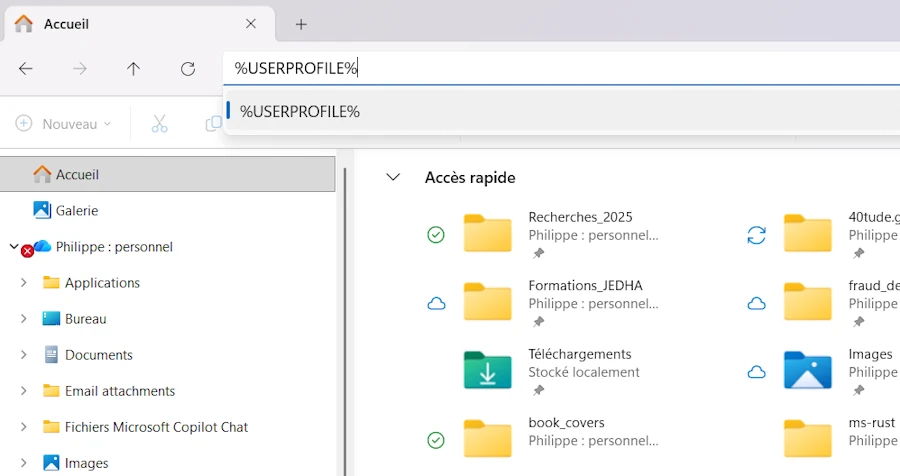
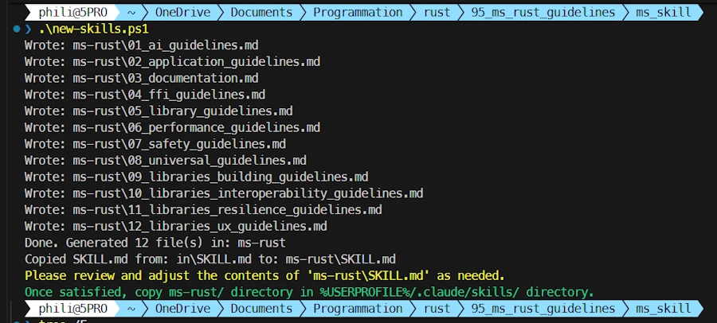
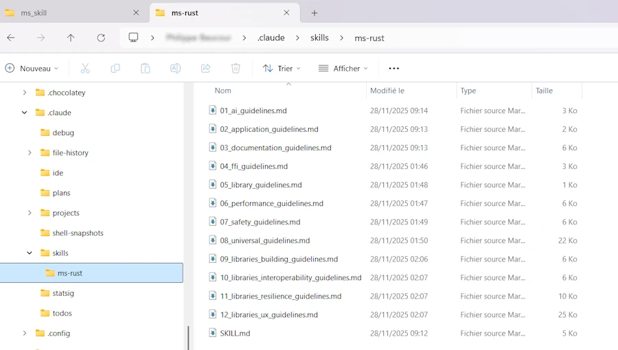

# Microsoft Pragmatic Rust Guidelines with Claude
{: .no_toc }

How to transform the Pragmatic Rust Guidelines into a Claude skill, step by step
{: .lead }


<!-- <h2 align="center">
<span style="color:orange"><b> 🚧 This post is under construction 🚧</b></span>
</h2> -->


## TL;DR
{: .no_toc }
* Automatically enforces Microsoft Rust coding standards through Claude skills
* Simple 3-step setup: download guidelines, create/tune `SKILL.md`, test with a Rust project
* Claude will automatically apply guidelines to all future `.rs` files
* VSCode + Win11 (not tested elsewhere)


<div align="center">
<br/>
<span>A step-by-step guide to leveraging Claude and Microsoft's Rust Guidelines in VSCode.</span>
</div>


## Table of Contents
{: .no_toc .text-delta}
- TOC
{:toc}


## 0. Prerequisites
In the following I suppose:
- Windows 11
- Rust installed
- VSCode installed
- "Claude Code for VSCode" extension installed
- VSCode is closed

If you run Linux or MacOS, the procedure should be similar except may be, the names of the directories.


## 1. Create the Skill Structure

Open a PowerShell terminal (WIN+X then i)

```powershell
# Create the skill directory
New-Item "$env:USERPROFILE/.claude/skills/ms-rust" -ItemType Directory

# Navigate to the directory
cd "$env:USERPROFILE/.claude/skills/ms-rust"

# Download the Microsoft Rust guidelines
Invoke-WebRequest -Uri "https://microsoft.github.io/rust-guidelines/agents/all.txt" -OutFile "./rust-guidelines.txt"

# To verify
ls
```

If you prefer the GUI remember you can use `%USERPRFILE%` and `%TMP%` when needed.

<div align="center">
<br/>
<!-- <span>A step-by-step guide to leveraging Claude and Microsoft's Rust Guidelines in VSCode.</span> -->
</div>


If you are not sure of the path to Claude you can use:

```powershell
Test-Path "$env:USERPROFILE\.claude"
```
Read the doc, and try different directories. Indeed for what I understand (but it is not yet crystal clear) Claude Code (CLI) and Claude Desktop (GUI) are 2 different beasts.


### Side Note
{: .no_toc }

Read the [Pragmatic Rust Guidelines](https://microsoft.github.io/rust-guidelines/guidelines/index.html). Before becoming a set of recommendations for AI, the Pragmatic Rust Guidelines are first a collection of well-structured, readable guidelines presented as a Rustdoc-generated book.

You can watch the end of this video

<div align="center">
<iframe width="560" height="315" src="https://www.youtube.com/embed/uDtMuS7BExE?si=tUzYObH0CAZfkZXb&amp;start=1510" title="YouTube video player" frameborder="0" allow="accelerometer; autoplay; clipboard-write; encrypted-media; gyroscope; picture-in-picture; web-share" referrerpolicy="strict-origin-when-cross-origin" allowfullscreen></iframe>
</div>

### Side Note
{: .no_toc }

A long time ago, when C++11 was introduced, there was a need to help developers transition from "old" to "modern" C++. In addition, there were so many ways to accomplish the same thing in C++ that some form of guidance became necessary. Finally, it was crucial to explain what should be avoided (raw pointers...), what should be promoted (RAII...), and why. This is why the C++ Core Guidelines were created at that time (Bjarne Stroustrup, [CppCon 2015](https://isocpp.org/blog/2015/09/bjarne-stroustrup-announces-cpp-core-guidelines?utm_source=chatgpt.com)).

If you’re interested, you can [read this page](https://isocpp.github.io/CppCoreGuidelines/CppCoreGuidelines).


## 2. Create the `SKILL.md` File

You are in the directory : `%USERPROFILE%/.claude/skills/ms-rust`

Open VSCode in this directory

```powershell

code .
```

**IMPORTANT**: Do not use Notepad as it will modify the file without your knowledge.

In VSCode, create a file named **SKILL.md** (the UPPERCASE letters are important) with the following content from the first 3 dashes to the last 3 dashes inclusive (YAML Frontmatter):


```markdown
---
name: ms-rust
description: ALWAYS use this skill BEFORE writing or modifying ANY Rust code (.rs files), even for simple Hello World programs. Enforces Microsoft Rust coding guidelines, applies M-CANONICAL-DOCS documentation, adds compliance comments, and validates against rust-guidelines.txt. This skill is MANDATORY for all Rust development.
---

# Rust Development
This skill automatically enforces Rust coding standards and best practices when creating or modifying Rust code.

## Instructions

**CRITICAL**: This skill MUST be invoked for ANY Rust code operation, including:
- Creating new .rs files (even simple examples like Hello World)
- Modifying existing .rs files (any change, no matter how small)
- Reviewing Rust code
- Refactoring Rust code

**Process**:
1. Read the [rust-guidelines.txt](rust-guidelines.txt) to understand all compliance requirements
2. Before writing/modifying ANY Rust code, ensure edits are conformant to the guidelines
3. Apply proper M-CANONICAL-DOCS documentation format
4. Add compliance comments
5. Comments must ALWAYS be written in American English, unless the user explicitly requests ‘write comments in French’ or provides another clear instruction specifying a different comment language.
6. If the file is fully compliant, add a comment: `// Rust guideline compliant {date}` where {date} is the guideline date/version

**No exceptions**: Even for trivial code like "Hello World", guidelines must be followed.

---

```


* **⚠️ Warning**: The `name` field must contain only lowercase letters and hyphens (no underscores).
* Based on my experience... I **strongly** recommend to use the same name for the directory and the skill (`ms-rust` here, in our case).
* The `description` is important (see the Side Note below) because this is what helps Claude to decide to apply such or such skill. For example here we make clear that the skill apply to "ANY Rust code".
* It seems uppercase matters. I did some tests to confirm it. Do you see ALWAYS, ANY and **CRITICAL** above?
* Be specific. See point 5 for example.
* Don't be surprised if you have to iterate few times before your reach your Nirvana.


### Side Note
{: .no_toc }

For what I understood, here is what happen when starting a conversation
1. The skills are already indexed - Claude does NOT browse the `.claude/skills` directory at the beginning of each conversation. The Claude Code System has already scanned this directory and provided Claude with a list of available skills.
2. Claude receives a prepared list - In its system instructions, there is a <available_skills> section that lists the available skills with their name and description (extracted from `SKILL.md` ). For example:
    ```xml
    <available_skills>
    <skill>
        <name>ms-rust</name>
        <description>ALWAYS use this skill BEFORE writing or modifying ANY Rust code...</description>
    </skill>
    </available_skills>
    ```
3. Claude don't read `SKILL.md` at startup - It never reads the entire contents of `SKILL.md` files before we  ask something. It just see the short description. This is why its content is important.
4. Invoking the skill - When Claude decides to use a skill (based on its description), it use the Skill tool with the name of the skill. That's when the entire contents of `SKILL.md` are injected into the conversation.
5. Applying the instructions - Once the skill is invoked, Claude sees all the detailed instructions from `SKILL.md` and have to follow them for the task at hand.


So the flow looks more or less like this:
* Start of conversation → Claude knows the names/descriptions of the available skills.
* Rust task requested → Claude sees that ms-rust corresponds → It invokes the skill.
* Skill invoked → The complete content of `SKILL.md` appears → It reads and apply the instructions.


### File Organization
{: .no_toc }

```
C:\Users\<your_name>\.claude\
└── skills\
    └── ms-rust\
        ├── SKILL.md
        └── rust-guidelines.txt
```


## 3. Test the Skill

Return to the terminal which should still be open.

```powershell
# Create a test project
cd $env:TEMP
cargo new test_skills
cd test_skills/

# Open the directory in VSCode
code .
```

In VSCode:
1. Open the `src/main.rs` file
2. Open Claude and ask to modify the code, for example:
   - "Modify `main.rs` to display the first 10 Fibonacci numbers"
3. Claude will ask permission to read the `SKILL.md` then `rust-guidelines.txt` and automatically apply the Microsoft Rust guidelines while generating the code.


## 4. Verification

After the modifications have been made, the code should:
- Comply with Microsoft Rust conventions
- Have a `// Rust guideline compliant <date>` comment if fully compliant
- Include appropriate documentation for public functions
- Comments be in English


```rust
// Rust guideline compliant 2025-11-18

/// Prints the first 10 Fibonacci numbers to stdout.
///
/// This function generates and displays the Fibonacci sequence where each number
/// is the sum of the two preceding ones, starting from 0 and 1.
///
/// # Examples
///
/// ```
/// main();
/// // Output:
/// // Fibonacci number 1: 0
/// // Fibonacci number 2: 1
/// // ...
/// // Fibonacci number 10: 34
/// ```
fn main() {
    print_fibonacci(10);
}

/// Calculates and prints the first n Fibonacci numbers.
///
/// # Examples
///
/// ```
/// print_fibonacci(5);
/// ```
///
/// # Panics
///
/// Panics if n is 0.
fn print_fibonacci(n: usize) {
    let mut prev = 0u64;
    let mut curr = 1u64;

    println!("Fibonacci number 1: {}", prev);

    if n > 1 {
        println!("Fibonacci number 2: {}", curr);
    }

    for i in 3..=n {
        let next = prev + curr;
        println!("Fibonacci number {}: {}", i, next);
        prev = curr;
        curr = next;
    }
}
```


## 6. Update (2025-11-28)

Everything was working like a charm then, at one point, I got this message (in red) from Claude Code.

```
Error: File content (25630 tokens) exceeds maximum allowed tokens (25000).
Please use offset and limit parameters to read specific portions of the file,
or use the GrepTool to search for specific content.
```

I get in touch with the guys in charge of the Pragmatic Rust Guidelines but they say they expect to see the file growing rather than shrinking. So I can't get help from this side.

One thing... May be I could split the document into multiples documents and let Claude discover them as needed. That would be even consistent with the discovery process we discussed before.

First, let's split the original file with a Powershell script. Here is how the directories are organized:

```
/.
│   new-skills.ps1
├───in
    all.txt
    SKILL.md
```

* The idea is that I drop into the `in` directory the latest version of the guidelines I can get from Github (see `all.txt` on this [page](https://microsoft.github.io/rust-guidelines/agents/index.html)).
* Then I call the script `new-skills.ps1`.
* To finish I copy the created directory (`ms-rust` here) into the `%USERPROFILE%/.claude/skill` and i'm done.

Here is the script I use


```powershell
param(
    [string]$InputFile = ''
)

# Resolve paths relative to script location
$scriptDir = Split-Path -Parent $MyInvocation.MyCommand.Definition
if (-not $scriptDir) { $scriptDir = Get-Location }

# Editable directories (change here if you want different locations)
$inDir = Join-Path $scriptDir 'in'
$outDir = Join-Path $scriptDir 'ms-rust'

# Helper: produce a short relative path for nicer output
function Get-ShortPath([string]$path) {
    try {
        if ($null -ne $path -and $path.StartsWith($scriptDir)) {
            $rel = $path.Substring($scriptDir.Length)
            if ($rel.StartsWith('\') -or $rel.StartsWith('/')) { $rel = $rel.Substring(1) }
            return $rel
        }
    } catch { }
    return $path
}

# Determine input path
if (-not $InputFile) {
    $inputPath = Join-Path $inDir 'all.txt'
    if (-not (Test-Path $inputPath)) {
        Write-Error "Default input file not found: $inputPath"
        exit 1
    }
} else {
    if (Test-Path $InputFile) {
        $inputPath = (Resolve-Path -LiteralPath $InputFile).ProviderPath
    } else {
        # Try in/ directory and common extensions
        $candidate = Join-Path $inDir $InputFile
        if (Test-Path $candidate) { $inputPath = $candidate }
        else {
            $found = $false
            foreach ($ext in @('.txt', '.md')) {
                $try = $candidate + $ext
                if (Test-Path $try) { $inputPath = $try; $found = $true; break }
            }
            if (-not $found) {
                Write-Error "Input file not found: tried '$InputFile' and 'in\$InputFile(.txt|.md)'"
                exit 1
            }
        }
    }
}

# If out/ exists, clear its contents; otherwise create it
if (Test-Path $outDir) {
    try {
        Get-ChildItem -Path $outDir -Force | Remove-Item -Recurse -Force -ErrorAction SilentlyContinue
    } catch {
        Write-Warning ("Failed to fully clear {0}: {1}" -f $outDir, $_)
    }
} else {
    New-Item -Path $outDir -ItemType Directory | Out-Null
}

$content = Get-Content -Raw -LiteralPath $inputPath -ErrorAction Stop
$lines = [System.Text.RegularExpressions.Regex]::Split($content, "\r?\n")

# Find separator lines that start with three dashes (pattern '^---')
$sepIndices = @()
for ($i = 0; $i -lt $lines.Length; $i++) {
    if ($lines[$i] -match '^---') { $sepIndices += $i }
}

if ($sepIndices.Count -lt 2) {
    Write-Host "No section separators ('---') found or only one; nothing to extract."
    exit 0
}

$fileCounter = 1

# For each pair of separators, extract the section between them
for ($k = 0; $k -lt ($sepIndices.Count - 1); $k++) {
    $startIdx = $sepIndices[$k] + 1
    $endIdx = $sepIndices[$k + 1] - 1
    if ($endIdx -lt $startIdx) { continue } # empty section between separators

    $sectionLines = $lines[$startIdx..$endIdx]

    # Find H1 headings inside this section
    $localH1 = @()
    for ($j = 0; $j -lt $sectionLines.Length; $j++) {
        if ($sectionLines[$j] -match '^[ \t]*#\s+') { $localH1 += $j }
    }

    if ($localH1.Count -eq 0) { continue } # no H1 in this section

    # Use only the first H1 in the section: extract from that H1 to the end of the section
    if ($localH1.Count -gt 0) {
        $relStart = $localH1[0]
        $relEnd = $sectionLines.Length - 1

        $extractLines = $sectionLines[$relStart..$relEnd]

        # Remove any lines that start with '---' (defensive)
        $extractLines = $extractLines | Where-Object { -not ($_ -match '^---') }

        # Get title from first line
        $titleLine = $extractLines[0] -replace '^[ \t]*#\s+','' -replace '\s+$',''
        # Normalize and sanitize filename base:
        # - lowercase, trim
        # - replace one-or-more spaces or '/' by a single '_'
        # - replace any run of other disallowed chars by a single '_'
        # - trim leading/trailing underscores
        $filenameBase = $titleLine.Trim().ToLower()
        $filenameBase = $filenameBase -replace '[\s/]+', '_'
        $filenameBase = $filenameBase -replace '[^a-z0-9_]+', '_'
        $filenameBase = $filenameBase.TrimStart('_').TrimEnd('_')
        if ([string]::IsNullOrWhiteSpace($filenameBase)) { $filenameBase = 'section' }

        $index = $fileCounter.ToString('00')
        $outName = "${index}_${filenameBase}.md"
        $outPath = Join-Path $outDir $outName

        # Write file (even if extractLines is empty, write an empty file)
        if ($extractLines.Count -eq 0) { "" | Out-File -FilePath $outPath -Encoding UTF8 }
        else { $extractLines | Out-File -FilePath $outPath -Encoding UTF8 }

        $shortOut = Get-ShortPath $outPath
        Write-Host "Wrote: $shortOut"
        $fileCounter++
    }
}

    $shortOutDir = Get-ShortPath $outDir
    Write-Host "Done. Generated $(( $fileCounter - 1 )) file(s) in: $shortOutDir"

# Copy SKILL.md from input directory to output directory, if present
$skillSrc = Join-Path $inDir 'SKILL.md'
$skillDst = Join-Path $outDir 'SKILL.md'
if (Test-Path $skillSrc) {
    try {
        Copy-Item -LiteralPath $skillSrc -Destination $skillDst -Force -ErrorAction Stop
        $shortSkillDst = Get-ShortPath $skillDst
        $shortSkillSrc = Get-ShortPath $skillSrc
        Write-Host "Copied SKILL.md from: $shortSkillSrc to: $shortSkillDst"
    } catch {
        Write-Warning ("Failed to copy SKILL.md from {0} to {1}: {2}" -f (Get-ShortPath $skillSrc), (Get-ShortPath $skillDst), $_)
    }
} else {
    Write-Warning ("Source SKILL.md not found at: {0}" -f (Get-ShortPath $skillSrc))
}

# Inform the user (US English) — highlighted
$shortSkillDst2 = Get-ShortPath $skillDst
Write-Host -ForegroundColor Yellow "Please review and adjust the contents of '$shortSkillDst2' as needed."
Write-Host -ForegroundColor Green "Once satisfied, copy $shortOutDir/ directory in %USERPROFILE%/.claude/skills/ directory."

```

Here is how to invoke the script : ` .\new-skills.ps1`. If needed you can pass another filename. By default it looks for "all.txt".

At the end the directories look like this:

```
.
│   new-skills.ps1
├───in
│       all.txt
│       SKILL.md
└───ms-rust
        01_ai_guidelines.md
        02_application_guidelines.md
        03_documentation.md
        04_ffi_guidelines.md
        05_library_guidelines.md
        06_performance_guidelines.md
        07_safety_guidelines.md
        08_universal_guidelines.md
        09_libraries_building_guidelines.md
        10_libraries_interoperability_guidelines.md
        11_libraries_resilience_guidelines.md
        12_libraries_ux_guidelines.md
        SKILL.md

```
Here is how it looks in the terminal

<div align="center">
<br/>
<span>Read the last 2 lines in color. I can't do it for you.</span>
</div>

At the bottom, in Technicolor, you are asked to review the `SKILL.md` which have been created. This one is much longer than the previous one we had. Indeed it helps Claude Code to decide which document to read. See below my current version:


```markdown
---
name: ms-rust
description: ALWAYS invoke this skill BEFORE writing or modifying ANY Rust code (.rs files) even for simple Hello World programs. Enforces Microsoft-style Rust development discipline and requires consulting the appropriate guideline files before any coding activity. This skill is MANDATORY for all Rust development.
---

# Rust Development Skill
<!-- The Pragmatic Rust Guidelines are copyrighted (c) by Microsoft Corporation and licensed under the MIT license. -->
This skill enforces structured, guideline-driven Rust development. It ensures all Rust code strictly follows the appropriate Microsoft-style rules, documentation formats, and quality constraints.


## Mandatory Workflow

**This skill MUST be invoked for ANY Rust action**, including:
- Creating new `.rs` files (even minimal examples like Hello World)
- Modifying existing `.rs` files (any change, no matter how small)
- Reviewing, refactoring, or rewriting code Rust code


## Which guideline to read and when

Before writing or modifying Rust code, **Claude must load ONLY the guideline files that apply to the requested task**, using segmented reading (`offset` and `limit`) when needed.

### Guidelines and when they apply

#### 1. `01_ai_guidelines.md`
Use when the Rust code involves:
- AI agents and LLM-driven code generation
- Making APIs easier for AI systems to use
- Comprehensive documentation and detailed examples
- Strong type systems that help AI avoid mistakes

#### 2. `02_application_guidelines.md`
Use when working on:
- Application-level error handling with anyhow or eyre
- CLI tools and desktop applications
- Performance optimization using mimalloc allocator
- User-facing features and initialization logic

#### 3. `03_documentation_guidelines.md`
Use when:
- Writing public API documentation and doc comments
- Creating canonical documentation sections (Examples, Errors, Panics, Safety)
- Structuring module-level documentation comprehensively
- Re-exporting items and using #[doc(inline)] annotations

#### 4. `04_ffi_guidelines.md`
Use when:
- Loading multiple Rust-based dynamic libraries (DLLs)
- Creating FFI boundaries and interoperability layers
- Sharing data between different Rust compilation artifacts
- Dealing with portable vs non-portable data types across DLL boundaries

#### 5. `05_library_guidelines.md`
Use when creating or modifying **Rust libraries**, including:
- Structuring a crate
- Designing public APIs
- Dependency decisions

#### 6. `06_performance_guidelines.md`
Use when:
- Identifying and profiling hot paths in your code
- Optimizing for throughput and CPU cycle efficiency
- Managing allocation patterns and memory usage
- Implementing yield points in long-running async tasks

#### 7. `07_safety_guidelines.md`
Use when:
- Writing unsafe code for novel abstractions, performance, or FFI
- Ensuring code soundness and preventing undefined behavior
- Documenting safety requirements and invariants
- Reviewing unsafe blocks for correctness with Miri

#### 8. `08_universal_guidelines.md`
Use in **ALL Rust tasks**. This file defines:
- General Rust best practices applicable to all code
- Style, naming, and organizational conventions
- Cross-cutting concerns that apply everywhere
- Foundational principles for any Rust project

#### 9. `09_libraries_building_guidelines.md`
Use when:
- Creating reusable library crates
- Managing Cargo features and their additivity
- Building native `-sys` crates for C interoperability
- Ensuring libraries work out-of-the-box on all platforms

#### 10. `10_libraries_interoperability_guidelines.md`
Use when:
- Exposing public APIs and managing external dependencies
- Designing types for Send/Sync compatibility
- Avoiding leaking third-party types from public APIs
- Creating escape hatches for native handle interop

#### 11. `11_libraries_resilience_guidelines.md`
Use when:
- Avoiding statics and thread-local state in libraries
- Making I/O and system calls mockable for testing
- Preventing glob re-exports and accidental leaks
- Feature-gating test utilities and mocking functionality

#### 12. `12_libraries_ux_guidelines.md`
Use when:
- Designing user-friendly library APIs
- Managing error types and error handling patterns
- Creating runtime abstractions and trait-based designs
- Structuring crate organization and public interfaces


## Coding Rules

1. **Load the necessary guideline files BEFORE ANY RUST CODE GENERATION.**
2. Apply the required rules from the relevant guidelines.
3. Apply the *M-CANONICAL-DOCS* documentation format.
5. Comments must ALWAYS be written in American English, unless the user explicitly requests ‘write comments in French’ or provides another clear instruction specifying a different comment language.
6. If the file is fully compliant, add a comment: `// Rust guideline compliant {date}` where {date} is the guideline date or the date of the current day (format YYYY-MM-DD)


---

```
Once you are happy, copy and paste the `ms-rust` directory in `$env:USERPROFILE/.claude/skills/` and you should be good to go.


<div align="center">
<br/>
<!-- <span>Read the last 2 lines in color. I can't do it for you.</span> -->
</div>


## 5. Webliography
* [The Pragmatic Rust Guidelines](https://microsoft.github.io/rust-guidelines/guidelines/index.html)
* [Rust guidelines](https://github.com/microsoft/rust-guidelines) on GitHub
* On Claude Code Docs, read this [page](https://code.claude.com/docs/en/skills)
* About SKILL, read this [page](https://docs.claude.com/en/docs/agents-and-tools/agent-skills/best-practices)
* [C++ Core Guidelines](https://isocpp.github.io/CppCoreGuidelines/CppCoreGuidelines).
* You’re welcome to share [comments or suggestions](https://github.com/40tude/40tude.github.io/discussions) on GitHub to help improve this article.
