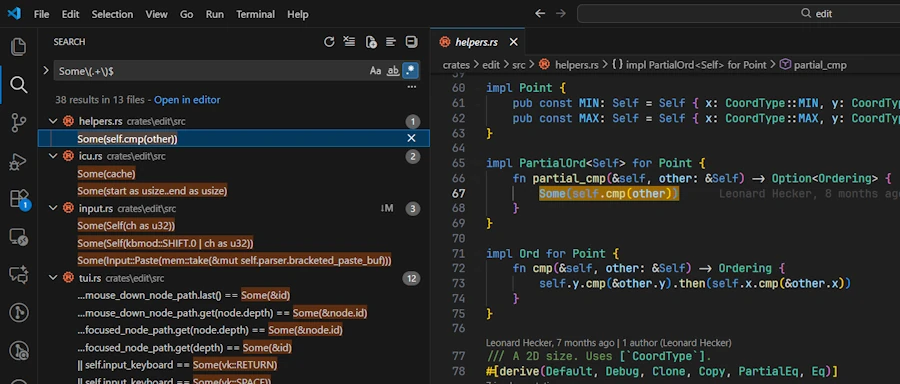
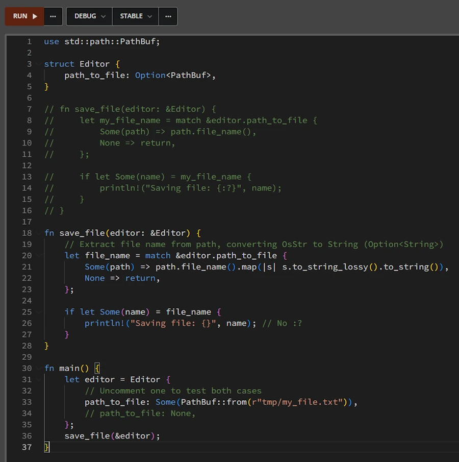
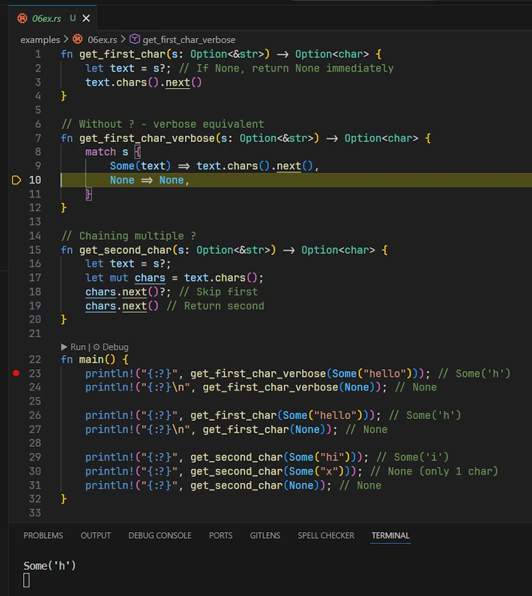

# `Option<T>` in Rust: 15 Examples from Beginner to Advanced
{: .no_toc }

A Code-First Guide with Runnable Examples
{: .lead }


<h2 align="center">
<span style="color:orange"><b> 🚧 This post is under construction 🚧</b></span>
</h2>


## TL;DR
{: .no_toc }

* 3 ski slopes: 🟢 Beginner, 🔵 Intermediate, 🔴 Advanced
* Basic extraction: `if let`, `match`, `let...else`
* Safe unwrapping: `unwrap_or()`, `unwrap_or_else()`
* Chaining: `map()`, `and_then()`, `filter()`
* Advanced: `as_ref()`, `take()`, `flatten()`, combining Options


<div align="center">
<br/>
</div>


## Table of Contents
{: .no_toc .text-delta}
- TOC
{:toc}


<!-- ###################################################################### -->
<!-- ###################################################################### -->
<!-- ###################################################################### -->
## Introduction

Personally, while learning Rust I always struggle with the `Some()` syntax. I can read and understand what I read, but the next day when I need to write a line of code to handle an `Option<T>` I don't feel comfortable. I've been dealing with this problem since the beginning and I can't seem to get rid of it. What's worse, I can understand code written by others or code generated by Claude or ChatGPT, but I can't write it myself with ease.

In short, this post is a kind of therapy during which I will try to heal myself 😁.


<!-- ###################################################################### -->
<!-- ###################################################################### -->
<!-- ###################################################################### -->
## How to Use This Guide?

I want to try something new here so this article uses a sort of **inverted pedagogy**: code first, explanation second and cherry on the cake... You don't have to read it all all at once since the post is split in 3 different levels:

- 🟢 **Beginner**: Basic examples (`if let`, `match`)
- 🔵 **Intermediate**: Combinators and chaining (`map`, `and_then`, `?`)
- 🔴 **Advanced**: Ownership tricks (`as_ref`, `take`, `flatten`)

Each Example section is organized as follow:

1. **Real-world context:** Few words about the context before we look at the code
1. **Runnable Example:**
    1. Copy the complete code snippet
    1. Paste it into [Rust Playground](https://play.rust-lang.org/)
    1. Click "Run" (or press Ctrl+S)
    1. Experiment by modifying the code. Break everything, spend some time in the Playground. Play!
1. **Read it Aloud:** This section is more **IMPORTANT** than you may think in first approximation. Indeed, I'm convinced that too often, in programming (like in Maths) we look at the code (at the formula) but we don't **read** the code (nor the formula). However the code tells us a story and this is this story that I try to tell in the section.
1. **Comments:** my comments about the code, my understanding or some other stuff I may have in mind.
1. **Key Points:** what to keep in mind.
1. **Find More Examples:** don't trust me. Check by yourself. Search in the code of largely used crates, not in ad hoc projects nor in toy projects (see below how to)


<!-- ###################################################################### -->
<!-- ###################################################################### -->
<!-- ###################################################################### -->
## Learning from existing code
The idea is to learn from others and to "see" how do they do. I propose to clone the projects below. Copy the line below. Yes, you can copy more than one lines at a time in Powershell.

```powershell
cd $env:TMP
git clone https://github.com/BurntSushi/ripgrep
git clone https://github.com/microsoft/edit
git clone https://github.com/sharkdp/hexyl
git clone https://github.com/ajeetdsouza/zoxide
git clone https://github.com/aovestdipaperino/turbo-vision-4-rust
```
Other crates include but are not limited to : [`bat`](https://github.com/sharkdp/bat), [`fd`](https://github.com/sharkdp/fd), [`tokei`](https://github.com/XAMPPRocky/tokei), [`hyperfine`](https://github.com/sharkdp/hyperfine)... Stay away from projects that are either too large or too complex. Don't worry, we will not build or install these projects (for example edit require the nightly build Rust compiler), we will just sure in their code base.

Later in this post, at the end of each Example, I will share the regular expression to use to find the lines of code corresponding to the example. Once you have this regular expression in hands (let's say `Some\(.+\)$`) you can either:

**In VSCode:**
* Open the project of interest
* `CTRL+SHIFT+F`, enable regex (`ALT+R`), type: `Some\(.+\)$`

**In Powershell:** copy'n paste the lines below in a terminal.

```Powershell
Get-ChildItem -Path "$env:TMP/hexyl/src" -Filter *.rs -Recurse |
    ForEach-Object {
        # Read file content with line numbers
        Select-String -Path $_.FullName -Pattern 'Some\(.+\)$' -SimpleMatch:$false |
            ForEach-Object {
                # Output file path and line number
                [PSCustomObject]@{
                    File      = $_.Path
                    LineNumber = $_.LineNumber
                    LineText   = $_.Line.Trim()
                }
            }
    }
```

Above we look into the codebase of `hexyl`. This work the same way for `zoxyde/src` or `turbo-vision-4-rust/src`.

In the case of:
* `edit` use the path: `$env:TMP/edit/crates/edit/src`
* `ripgrep` use the path: `$env:TMP/ripgrep/crates`

Based I what I saw, it seems `ripgrep` is the project that cover most if not all the examples of this post. I strongly recommend you open it now in you favorite IDE. This said... Let's dive in!

<div align="center">
<br/>
</div>


<!-- ###################################################################### -->
<!-- ###################################################################### -->
<!-- ###################################################################### -->
## 🟢 Beginner Examples (1-4)


<!-- ###################################################################### -->
<!-- ###################################################################### -->
### Example 01 - `Option<T>` as a Return Value

#### **Real-world context**
{: .no_toc }

Indeed, we can explain that a function might search for a file and, if it can’t find it, simply returns “nothing.” If it succeeds, it returns something—like the first line of the file. Using Option makes sense for any function that might not succeed (without throwing an error or crashing) but also doesn’t always have a meaningful value to return. This pattern is common for operations like searching, parsing, or handling optional configuration.

Easy to explain, easy to translate. The easiest, I told you.

#### **Runnable Example**
{: .no_toc }

Copy and paste in [Rust Playground](https://play.rust-lang.org/)

```rust
struct Editor {
}

impl Editor {
    fn get_selection(&self) -> Option<String> {
        // Simulate selection: uncomment one to test both cases
        Some("lorem ipsum".to_string())
        // None
    }
}

fn main() {
    let my_editor = Editor {};

    let selection = my_editor.get_selection();
    if selection.is_some(){
        println!("Selection: {}", selection.unwrap());
    }else{
        println!("No text selected");
    }
}
```

#### **Read it Aloud**
{: .no_toc }

In `main()`, the code says : "`get_selection()` returns an `Option<String>` which contains the selected text as a `String` or `None`. The `if selection.is_some()` checks if the return value contains something and if so, executes the first block. Otherwise, it executes the else branch."


### **Comments**
{: .no_toc }
* It is important to realize that `get_selection()` returns a type `Option<String>` **NOT** a type `String`
* In the playground, replace `Some("lorem ipsum".to_string())` with `Some("lorem ipsum".into())`. Does it work? Why?
* Do you agree on the fact that `selection.is_some()` does **NOT** extract the value from the `Option<T>` but just check if there is a value in the `Option<T>`?
* Take your time and read the [documentation](https://doc.rust-lang.org/std/option/enum.Option.html).
* Is it clear that once we checked the `Option<T>` contains something then `unwrap()` extract this thing?
* Duplicate the `println!("Selection: {}", selection.unwrap());`at the very end of `main()`. Does it works? Why?


#### **Key Points**
{: .no_toc }

1. **Pattern**: The function returns an `Option<T>` (here `Option<String>`). It can be `None` or `Some`.
2. **When to use**: When we need to express the fact that a function or a method can return nothing or something.
3. **Usage**: When a struct, an application, a function has an optional parameter or return value, `Option<T>` should be used.


#### **Find More Examples**
{: .no_toc }

* Regular expression to use either in VSCode ou Powershell: `Some\(.+\)$`
* Make the test. Now!. Open `edit` project in VSCode and search for `Some\(.+\)$` (`CTRL+SHIFT+F` then `Alt+R`).

<div align="center">
<br/>
</div>


<!-- ###################################################################### -->
<!-- ###################################################################### -->
### Example 02 - `if let Some(...) = Option<T>` - Conditional Pattern Matching

#### **Real-world context**
{: .no_toc }

Updating configuration, processing optional user input, conditional initialization.

#### **Runnable Examples**
{: .no_toc }


**Code snippet 00**

Copy and paste in [Rust Playground](https://play.rust-lang.org/). In the first three versions of the earlier code, within `main()`, we review several alternative approaches before using the `if let Some(...) = Option<T>` pattern.


```rust
struct Editor {
}

impl Editor {
    fn get_selection(&self) -> Option<String> {
        // Simulate selection: uncomment one to test both cases
        Some("lorem ipsum".into())
        // None
    }
}

fn main() {
    let my_editor = Editor {};

    let msg = my_editor.get_selection();
    match msg {
        Some(my_txt) => println!("Selection: {my_txt}"),
        None => println!("No text selected")
    };

}
```


**Code snippet 01**

```rust
struct Editor {
}

impl Editor {
    fn get_selection(&self) -> Option<String> {
        // Simulate selection: uncomment one to test both cases
        Some("lorem ipsum".into())
        // None
    }
}

fn main() {
    let my_editor = Editor {};

    match my_editor.get_selection() {
        Some(my_txt) => println!("Selection: {my_txt}"),
        None => println!("No text selected")
    }
}
```


**Code snippet 02**


```rust
struct Editor {
}

impl Editor {
    fn get_selection(&self) -> Option<String> {
        // Simulate selection: uncomment one to test both cases
        Some("lorem ipsum".into())
        // None
    }
}

fn main() {
    let my_editor = Editor {};

    let msg = match my_editor.get_selection() {
        Some(my_txt) => format!("Selection: {my_txt}"),
        None => format!("No text selected")
    };
    println!("{msg}");
}
```


**Code snippet 03**

Copy and paste in [Rust Playground](https://play.rust-lang.org/). In this version of the previous code we use `if let Some()` pattern.

```rust
struct Editor {
}

impl Editor {
    fn get_selection(&self) -> Option<String> {
        // Simulate selection: uncomment one to test both cases
        Some("lorem ipsum".into())
        // None
    }
}

fn main() {
    let my_editor = Editor {};

    // The `if let Some(...) = Option<T>` conditional pattern matching
    // => unwrap and use the selection only if Some()
    if let Some(my_txt) = my_editor.get_selection() {
        println!("Selection: {my_txt}");
    } else {
        println!("No text selected");
    }

}
```


**Code snippet 04**

Copy and paste in [Rust Playground](https://play.rust-lang.org/)

```rust
use std::path::PathBuf;

struct Editor {
    path_to_file: Option<PathBuf>,
}

impl Editor {
    fn set_path(&mut self, path: PathBuf) {
        self.path_to_file = Some(path);
    }
}

fn main() {
    let mut my_editor = Editor { path_to_file: None };

    // Uncomment one to test both cases
    let new_path = Some(PathBuf::from(r"tmp/my_file.txt"));
    // let new_path = None;

    if let Some(path) = new_path {
        my_editor.set_path(path);
    }

    println!("The file: {:?}", my_editor.path_to_file);
}
```


#### **Read it Aloud**
{: .no_toc }

**Code snippet 00:** The code says: "In `main()`, `msg` is an `Option<String>` and we use a `match` expression to cover explicitly all the possible values returned by `my_editor.get_selection()`."

**Code snippet 01:** The code says: "In `main()`, on the return of `my_editor.get_selection()` we use a `match` expression to cover explicitly all the possible values."

**Code snippet 02:** Here the code tells us this story: "The result of the `match` expression is used to initialize the `msg` variable which receive a formatted string before to be printed."

**Code snippet 03:** Here the plot unfolds as follows: "If the pattern `Some(my_txt)` successfully matches the `Option<T>` returned by `my_editor.get_selection()`, then **bind its contents** to `my_txt` and run the first block; otherwise, run the `else` block."


**Code snippet 04:**
* Here is the context of the story
    * The `Editor` may have a path to a file (or not). This explains why the field `path_to_file` is of type `Option<PathBuf>`.
    * When created, `my_editor` does not point to any particular file (se the `path_to_file: None`).
    * Then a `new_path` variable is created. It is an `Option<PathBuf>` containing a path to a file.

That being said, the story goes like this: "If `new_path` contains a value, **bind it** to `path` and call the method `set_path()` with it as an argument. Otherwise, skip the block entirely."


### **Comments**
{: .no_toc }

* Code snippet 03. `if let Some(x) = expression` is **NOT** a boolean expression. This is a **conditional pattern matching**. Rust try to match the pattern `Some(...)` with the value on the right. If the match succeeds, the `if` block is executed; otherwise, it is ignored.
    * Personally, that's what trips me up every time because I can't help reading it as a Boolean expression.

* Code snippet 03. `if let Some(x) = expression` is **NOT** a boolean expression, see it is as a shortened version of a `match`.

* Code snippet 03. When we *read* a line like `if let Some(...) = Option<T>{...}` we should *say* "If the pattern `Some(...)` successfully matches the `Option` value then blablabla..."

* Code snippet 02. `match` is an expression. It evaluates to a single value. Look, there is a `;` at the end of the line `let msg = ...`

* Code snippet 02. Do you see the difference between the second and third code snippet? In the latter, `msg` receive the result of `format!` and then it is printed. Again `match` is an expression, **NOT** a statement.

* Code snippet 04. Uncomment the line `let new_path = None;` (comment the line above). Is the behavior of the code crystal clear?

* Code snippet 04. Add this line `println!("{}", new_path.is_some());` at the very end of the code. What happens? Why?.

* Each time one of our data type have a field which may contain something or nothing we should use an `Option<T>`. See Example 01.


#### **Key Points**
{: .no_toc }

1. **Pattern**: `if let Some(x) = expression` is **NOT** a boolean expression, it is a **conditional pattern matching**
1. **Pattern**: Conditionally execute code only when `Option<T>` has a value
1. **Ownership**: As with the `unwrap()` (see Example 01), the value inside `Some()` is **moved** into `path` (not a reference)
<!-- 1. **Alternative**: Could use `if new_path.is_some() { ... }` but wouldn't extract the value cleanly -->

#### **Find More Examples**
{: .no_toc }

Regular expression to use either in VSCode ou Powershell: `if let Some\(.+\) = `


<!-- ###################################################################### -->
<!-- ###################################################################### -->
### Example 03 - `match` Expression with Early Return

#### **Real-world context**
{: .no_toc }

Anything that might fail and requires early exit: File operations, network requests, database queries...

#### **Runnable Example**
{: .no_toc }

Copy and paste in [Rust Playground](https://play.rust-lang.org/)


```rust
use std::path::PathBuf;

struct Editor {
    path_to_file: Option<PathBuf>,
}

fn save_file(editor: &Editor) {
    let my_file_name = match &editor.path_to_file {
        Some(path) => path.file_name(),
        None => return,
    };

    if let Some(name) = my_file_name {
        println!("Saving file: {:?}", name);
    }
}

fn main() {
    let editor = Editor {
        // Uncomment one to test both cases
        path_to_file: Some(PathBuf::from(r"tmp/my_file.txt")),
        // path_to_file: None,
    };
    save_file(&editor);
}
```


#### **Read it Aloud**
{: .no_toc }

* In `save_file()` the code says: "Match on `&editor.path_to_file`. If it contains a value, **bind a reference to that value** to `path`, then call the method `file_name()` on `path` and bind the result to `my_file_name`. If `None`, return early."


### **Comments**
{: .no_toc }

* `save_file()` has a reference to the Editor as a parameter (borrow)
* In the Playground, remove the reference in front of `&editor.path_to_file`. What happens? Why?
* It is important to understand that we don't directly “bind” the file name, we bind the result of the extraction, which is itself an `Option<T>` (because a path might not have a file name, for example `/` or `.` ).
* Ideally we should write `save_file()` as below:

    ```rust
    fn save_file(editor: &Editor) {
        // Extract file name from path, converting OsStr to String (Option<String>)
        let file_name = match &editor.path_to_file {
            Some(path) => path.file_name().map(|s| s.to_string_lossy().to_string()),
            None => return,
        };

        if let Some(name) = file_name {
            println!("Saving file: {}", name); // No :?
        }
    }
    ```
* At the end of `main()` add the 2 lines below. What do need to do to compile. Why?
    ```rust
    editor.path_to_file = Some(PathBuf::from(r"tmp/my_file2.txt"));
    save_file(&editor);
    ```


<div align="center">
<br/>
</div>


#### **Key Points**
{: .no_toc }

1. **Pattern**: `match` with early return avoids deep nesting
2. **When to use**: When `None` means "abort this operation"
3. **Modern alternative**: See next example with `let...else`

#### **Find More Examples**
{: .no_toc }

Regular expression to use either in VSCode ou Powershell: `match .+ \{\s*Some\(.+\) => .+,\s*None => return`


<!-- ###################################################################### -->
<!-- ###################################################################### -->
### Example 04 - `let...else` - "Modern" Early Return

#### **Real-world context**
{: .no_toc }

Same as match early return, but more concise (modern Rust style).

#### **Runnable Example**
{: .no_toc }

Copy and paste in [Rust Playground](https://play.rust-lang.org/)

```rust
use std::path::PathBuf;

struct Editor {
    path_to_file: Option<PathBuf>,
}

fn save_file(editor: &Editor) {
    let Some(my_path) = &editor.path_to_file else {
        eprintln!("No path to file available");
        return;
    };

    if let Some(name) = my_path
        .file_name()
        .map(|s| s.to_string_lossy().to_string())
    {
        println!("Saving file: {}", name);
    }
}

fn main() {
    let mut editor = Editor {
        // Uncomment one to test both cases
        // path_to_file: Some(PathBuf::from(r"tmp/my_file.txt")),
        path_to_file: None,
    };
    save_file(&editor);

    editor.path_to_file = Some(PathBuf::from(r"tmp/my_file2.txt"));
    save_file(&editor);
}
```

#### **Read it Aloud**
{: .no_toc }

* At the begining of `save_file()` the code says: "Let the pattern `Some(my_path)` match on `&editor.path_to_file`. If it doesn't match (i.e., it's `None`), execute the else block which returns early."


### **Comments**
{: .no_toc }
* Compare the end of `save_file()` in Example 03 with Example 04. In the latter we extract file name from path, converting OsStr to String. It was mentioned in the comments of Example 03.


#### **Key Points**
{: .no_toc }

1. **Pattern**: `let Some(var) = expr else { ... }` replaces match with early return
2. **Readability**: More concise than match when you only care about the `None` case
3. **Requirement**: The else block must diverge (return, break, continue, panic)
4. **Modern**: Introduced in Rust 1.65 (2022) - idiomatic for new code

#### **Find More Examples**
{: .no_toc }

Regular expression to use either in VSCode ou Powershell: `let Some\(.+\) = .+ else`

Try it with `ripgrep` for example.


<!-- ###################################################################### -->
<!-- ###################################################################### -->
<!-- ###################################################################### -->
## 🔵 Intermediate Examples (5-9)


<!-- ###################################################################### -->
<!-- ###################################################################### -->
### Example 05 - `unwrap_or` vs `unwrap_or_else` - Providing Defaults

**Real-world context**: Configuration with fallback values, user preferences, optional parameters.

#### **Runnable Example**
{: .no_toc }

Copy and paste in [Rust Playground](https://play.rust-lang.org/)

```rust
fn expensive_computation() -> String {
    println!("Computing default value...");
    "DEFAULT_NAME".to_string()
}

fn main() {
    // ----------------------------------------------------
    // ----------------------------------------------------
    let none_name: Option<String> = None;

    // unwrap_or: value is ALWAYS computed (eager evaluation)
    let name1 = none_name.clone().unwrap_or(expensive_computation());
    // Output: "Computing default value..."

    // unwrap_or_else: closure called ONLY if None (lazy evaluation)
    let name2 = none_name.unwrap_or_else(|| expensive_computation());
    // Output: "Computing default value..."

    // ----------------------------------------------------
    // ----------------------------------------------------
    // Compare with Some
    let some_name: Option<String> = Some("Alice".to_string());

    // unwrap_or: value is ALWAYS computed (eager evaluation)
    let name3 = some_name.clone().unwrap_or(expensive_computation());
    // Still prints "Computing default value..." => Waste of time

    // unwrap_or_else: closure called ONLY if None (lazy evaluation)
    let name4 = some_name.unwrap_or_else(|| expensive_computation());

    // The closure not called

    println!("Results: {name1}, {name2}, {name3}, {name4}");
}

```

#### **Read it Aloud**
{: .no_toc }

"`unwrap_or(value)` always evaluates `value`, even if the `Option<T>` is Some. Use `unwrap_or_else(|| compute_value())` for expensive defaults - the closure only runs when needed."


### **Comments**
{: .no_toc }
* `.unwrap_or()`, eager evaluation (upfront) and call a function
* `.unwrap_or_else()`, lazy evaluation (last minute) and call a closure

* Clippy will want us to write:
    ```rust
    let name2 = expensive_computation();
    let name4 = "Alice".to_string();
    ```
    Indeed the compiler knows `none_name` is `None` and so `.unwrap_or_else()` will ALWAYS be called, so let's call it directly
    The same way, the compiler knows that `some_name` is `Some`, so the closure will NEVER be called, so let's simplify code


#### **Key Points**
{: .no_toc }

1. **Performance**: `unwrap_or_else` is lazy - crucial for expensive defaults
2. **Related**: `unwrap_or_default()` uses `Default::default()` (e.g., `""` for String, `0` for i32)
3. **When to use**: `unwrap_or` for cheap literals, `unwrap_or_else` for function calls

#### **Find More Examples**
{: .no_toc }

Regular expression to use either in VSCode ou Powershell: `unwrap_or_else\(` `unwrap_or\(`
`ripgrep` project is a good candidate.


<!-- ###################################################################### -->
<!-- ###################################################################### -->
### Example 06 - The `?` Operator - Early Return Propagation

#### **Real-world context**
{: .no_toc }

Chaining optional operations, parsing pipelines, database query chains.

#### **Runnable Example**
{: .no_toc }

Copy and paste in [Rust Playground](https://play.rust-lang.org/)

```rust
fn get_first_char(s: Option<&str>) -> Option<char> {
    let text = s?;  // If None, return None immediately
    text.chars().next()
}

// Without ? - verbose equivalent
fn get_first_char_verbose(s: Option<&str>) -> Option<char> {
    match s {
        Some(text) => text.chars().next(),
        None => None,
    }
}

// Chaining multiple ?
fn get_second_char(s: Option<&str>) -> Option<char> {
    let text = s?;
    let mut chars = text.chars();
    chars.next()?;  // Skip first
    chars.next()     // Return second
}

fn main() {

    println!("{:?}", get_first_char_verbose(Some("hello")));    // Some('h')
    println!("{:?}\n", get_first_char_verbose(None));           // None

    println!("{:?}", get_first_char(Some("hello")));    // Some('h')
    println!("{:?}\n", get_first_char(None));           // None

    println!("{:?}", get_second_char(Some("hi")));      // Some('i')
    println!("{:?}", get_second_char(Some("x")));       // None (only 1 char)
    println!("{:?}", get_second_char(None));            // None
}
```

#### **Read it Aloud**
{: .no_toc }

"The `?` operator says: 'If this `Option<T>` is `None`, immediately return `None` from the function. Otherwise, unwrap the Some value and continue.'"


### **Comments**
{: .no_toc }

In addition to the Playground it is useful to debug the code in VSCode. This really help to visualize what happens.

<div align="center">
<br/>
</div>


#### **Key Points**
{: .no_toc }

1. **Return type requirement**: Function must return `Option<T>` to use `?`
2. **Chaining**: Enables clean sequential operations without nested matches
3. **Not just `Option<T>`**: Also works with `Result<T, E>` (should be covered one day...)
4. **Pattern**: `Some(value?)` combines - try to get value, wrap in Some if successful

#### **Find More Examples**
{: .no_toc }

Regular expression to use either in VSCode ou Powershell: `\w+\?;` or `return .+\?`


<!-- ###################################################################### -->
<!-- ###################################################################### -->
### Example 07 - `map()` - Transforming Values Inside `Option<T>`

#### **Real-world context**
{: .no_toc }

Processing data that might not exist, transforming configurations, sanitizing user input.

#### **Runnable Example**
{: .no_toc }

Copy and paste in [Rust Playground](https://play.rust-lang.org/)

```rust
fn main() {
    let name: Option<String> = Some("  Zoubida  ".to_string());

    // Chain transformations - only applied if Some
    let result = name
        .map(|n| n.trim().to_string())           // Some("Zoubida")
        .map(|n| n.to_uppercase())               // Some("ZOUBIDA")
        .unwrap_or_else(|| "ANONYMOUS".to_string());

    println!("{}", result); // "ZOUBIDA"

    // With None - transformations skipped, default used
    let no_name: Option<String> = None;
    let result2 = no_name
        .map(|n| n.trim().to_string())
        .map(|n| n.to_uppercase())
        .unwrap_or_else(|| "ANONYMOUS".to_string());

    println!("{}", result2); // "ANONYMOUS"
}
```

#### **Read it Aloud**
{: .no_toc }

"`map(|value| transform(value))` says: 'If the `Option<T>` is Some, apply this transformation to the inner value and wrap the result in Some. If `None`, skip the transformation and return `None`.'"


### **Comments**
{: .no_toc }


#### **Key Points**
{: .no_toc }

1. **Chainable**: Multiple `.map()` calls compose cleanly
2. **Lazy**: If the original `Option<T>` is `None`, transformations don't execute
3. **Type change**: `Option<T>` → `Option<U>` (T and U can differ)
4. **Functional programming**: Avoids explicit if/match - more declarative

#### **Find More Examples**
{: .no_toc }

Regular expression to use either in VSCode ou Powershell: `\.map\(\s*\|[^|]+\|[^)]*\)`


<!-- ###################################################################### -->
<!-- ###################################################################### -->
### Example 08 - `and_then()` - Chaining `Option<T>` - Returning Functions

#### **Real-world context**
{: .no_toc }

Validation chains, nested optional lookups (config sections), parsing pipelines.

#### **Runnable Example**
{: .no_toc }

Copy and paste in [Rust Playground](https://play.rust-lang.org/)

```rust
fn parse_positive(s: &str) -> Option<i32> {
    s.parse::<i32>().ok().filter(|&n| n > 0)
}

fn main() {
    let input = Some("42");

    // map creates nested Option<Option<i32>>
    let bad = input.map(|s| parse_positive(s));
    println!("{:?}", bad); // Some(Some(42)) - awkward!

    // and_then flattens automatically
    let good = input.and_then(|s| parse_positive(s));
    println!("{:?}", good); // Some(42) - clean!

    // Chaining multiple and_then
    let chain_result = Some("100")
        .and_then(|s| parse_positive(s))          // Some(100)
        .and_then(|n| if n < 50 { Some(n * 2) } else { None });

    println!("{:?}", chain_result); // None (100 >= 50)
}
```

#### **Read it Aloud**
{: .no_toc }

"`and_then(|val| optional_operation(val))` says: 'If Some, apply this function that returns `Option<T>` and flatten the result. If `None`, skip and return `None`.'"


### **Comments**
{: .no_toc }

* Let's read, piece by piece the line `let good = input.and_then(|s| parse_positive(s));`:
    1. Takes `input` (an `Option<&str>`)
    1. If `input` is `Some(s)`, it calls `parse_positive(s)` and returns that result directly
    1. If `input` is `None`, it short-circuits and returns `None` immediately
* Double check and **read** the `let chain_result = ...`
    1. The first closure has a string as parameter (`|s|`)
    1. While the second closure receive an `i32` (`|n|`)


#### **Key Points**
{: .no_toc }

1. **Flattening**: Prevents `Option<Option<T>>` - chaining is impossible otherwise
1. **When to use**: When the transformation itself might fail (returns `Option<T>`)
1. **vs map**: Use `map` for always-succeeds transforms, `and_then` for fallible ones

#### **Find More Examples**
{: .no_toc }

Regular expression to use either in VSCode ou Powershell: `\.and_then\(`


<!-- ###################################################################### -->
<!-- ###################################################################### -->
### Example 09 - Pattern Matching with Guards

#### **Real-world context**
{: .no_toc }

Conditional logic based on value properties, filtering with conditions, validation.

#### **Runnable Example**
{: .no_toc }

Copy and paste in [Rust Playground](https://play.rust-lang.org/)

```rust
fn categorize_age(age: Option<i32>) -> &'static str {
    match age {
        Some(a) if a < 18 => "Minor",
        Some(a) if a < 65 => "Adult",
        Some(_a) => "Senior",  // a >= 65 but a not used => _a
        None => "Unknown",
    }
}

fn main() {
    println!("{}", categorize_age(Some(10)));  // "Minor"
    println!("{}", categorize_age(Some(30)));  // "Adult"
    println!("{}", categorize_age(Some(70)));  // "Senior"
    println!("{}", categorize_age(None));      // "Unknown"

    // Alternative with if let and guards
    let score = Some(85);

    if let Some(s) = score && s >= 90 {
        println!("A grade");
    } else if let Some(s) = score && s >= 80 {
        println!("B grade");  // This prints
    } else {
        println!("Lower grade");
    }
}
```

#### **Read it Aloud**
{: .no_toc }

"`Some(value) if condition` says: 'Match if `Option<T>` is Some AND the extracted value satisfies this condition.' Guards enable complex pattern matching with runtime checks."


### **Comments**
{: .no_toc }


#### **Key Points**
{: .no_toc }

1. **Guard syntax**: `if` after pattern - tested only if pattern matches
2. **Let-chains**: `if let Some(x) = opt && x > 10` (Rust 1.64+) combines pattern + condition
3. **Order matters**: Earlier guards are checked first - be specific before general
4. **Readability**: Sometimes clearer than nested if statements

#### **Find More Examples**
{: .no_toc }

Regular expression to use either in VSCode ou Powershell: `Some\(.+\) if `


<!-- ###################################################################### -->
<!-- ###################################################################### -->
<!-- ###################################################################### -->
## 🔴 Advanced Examples (10-15)


<!-- ###################################################################### -->
<!-- ###################################################################### -->
### Example 10 - `as_ref()` and `as_mut()` - Borrowing Instead of Moving

#### **Real-world context**
{: .no_toc }

Inspecting `Option<T>` without consuming it, modifying in-place, reusing `Option<T>` after checking.

#### **Runnable Example**
{: .no_toc }

Copy and paste in [Rust Playground](https://play.rust-lang.org/)

```rust
use std::path::PathBuf;

fn main() {
    // Moving consumes the Option
    let opt = Some(String::from("hello"));
    if let Some(s) = opt {
        println!("Length: {}", s.len());
    }
    // println!("{:?}", opt); // ERROR: opt was moved

    // Borrowing with as_ref - Option remains usable
    let opt = Some(String::from("hello"));

    if let Some(s) = opt.as_ref() {
        // s is &String
        println!("Length: {}", s.len());
    }
    println!("{:?}", opt); // Ah, ha, ha, ha, opt stayin' alive, stayin' alive (Some("hello")

    if let Some(my_str) = &opt {
        // my_str is &String
        println!("Length: {}", my_str.len());
    }
    println!("{:?}", opt); // Ah, ha, ha, ha, opt stayin' alive, stayin' alive (Some("hello")

    // as_ref() is useful with map - read without consuming
    let mut path = Some(PathBuf::from("/home"));
    let len = path.as_ref().map(|p| p.as_os_str().len());
    println!("Path length: {:?}", len); // Some(5)

    // as_mut is useful with map - modify in place
    path.as_mut().map(|p| p.push("user"));
    println!("{:?}", path); // Some("/home/user")
}

```

#### **Read it Aloud**
{: .no_toc }

"`as_ref()` converts `Option<T>` to `Option<&T>`, letting you peek inside without consuming. `as_mut()` gives `Option<&mut T>` for in-place modifications. Both leave the original `Option<T>` intact."


### **Comments**
{: .no_toc }


* As with `.unwrap()`, the value inside `Some()` is **moved** (see Example 01 and 02).
* The second `println!` cannot work.
* An alternative to `if let Some(s) = opt.as_ref() {...` is `if let Some(s) = &opt.{...`
* The line `path.as_mut().map(|p| p.push("user"));` generates a warning. Try the code below:
    ```rust
    if let Some(p) = path.as_mut() {
        p.push("user");
    }
    ```


#### **Key Points**
{: .no_toc }

1. **Signature**: `as_ref(&self) -> Option<&T>`, `as_mut(&mut self) -> Option<&mut T>`
2. **When to use**: Reading Option multiple times, modifying without replacing
3. **With map**: `opt.as_ref().map(|val| ...)` lets us transform without moving
4. **Ownership**: Original Option keeps ownership - crucial for reuse

#### **Find More Examples**
{: .no_toc }

Regular expressions to use either in VSCode ou Powershell: `\.as_ref\(\)\.map` or `\.as_mut\(\)`


<!-- ###################################################################### -->
<!-- ###################################################################### -->
### Example 11 - `take()` - Extracting Value and Leaving `None`

#### **Real-world context**
{: .no_toc }

Consuming resources (files, connections), state machines, cleanup operations, RAII.

#### **Runnable Example**
{: .no_toc }

Copy and paste in [Rust Playground](https://play.rust-lang.org/)

```rust
use std::fs::{self, File};

struct Editor {
    file: Option<File>,
}

impl Editor {
    fn is_open(&self) -> bool {
        self.file.is_some()
    }

    fn close(&mut self) {
        if let Some(f) = self.file.take() {
            // f is File (owned), self.file is now None automatically
            println!("Closing file");
            drop(f); // Explicit close
        }
    }
}

fn main() {
    let mut editor = Editor {
        file: Some(File::create("temp.txt").unwrap()),
    };
    println!("Is open: {}", editor.is_open()); // true
    editor.close();
    println!("Is open: {}", editor.is_open()); // false

    // Clean up: remove temp.txt if it exists
    if fs::metadata("temp.txt").is_ok() {
        fs::remove_file("temp.txt").expect("Failed to delete temp.txt");
        println!("temp.txt deleted");
    }
}
```


Copy and paste in [Rust Playground](https://play.rust-lang.org/). This example demonstrate how to implement RAII (resource acquisition is initialization) with the help of `take()`

```rust
struct Resource {
    name: String,
}

impl Resource {
    fn new(name: &str) -> Self {
        println!("  [{}] Acquired", name);
        Self {
            name: name.to_string(),
        }
    }
}

impl Drop for Resource {
    fn drop(&mut self) {
        println!("  [{}] Released", self.name);
    }
}

struct Guard {
    resource: Option<Resource>,
}

impl Guard {
    fn new(name: &str) -> Self {
        Self {
            resource: Some(Resource::new(name)),
        }
    }

    // Manually release before scope ends
    fn release(&mut self) {
        if let Some(r) = self.resource.take() {
            println!("  [{}] Early release", r.name);
            // r is dropped here
        }
    }
}

impl Drop for Guard {
    fn drop(&mut self) {
        if self.resource.is_some() {
            println!("  Guard dropped with resource still held");
        }
        // resource.take() not needed - Option<Resource> drops automatically
    }
}

fn main() {
    println!("Example 1: Auto release at scope end");
    {
        let _guard = Guard::new("DB Connection");
        println!("  Doing work...");
    } // Guard dropped here, Resource released

    println!("\nExample 2: Early release with take()");
    {
        let mut guard = Guard::new("File Handle");
        println!("  Doing work...");
        guard.release(); // Release early via take()
        println!("  More work after release...");
    } // Guard dropped, but resource already gone
}


```


#### **Read it Aloud**
{: .no_toc }

"`take()` says: 'Give me the value inside `Some`, replace the `Option` with `None`, and return the value as `Option`.' It's move + automatic `None` assignment in one operation."


### **Comments**
{: .no_toc }

**First example**
* The end of `main()` is here to make sur the file is deleted if it exist. This may be the case if we debug and leave the session once the file is created.

**RAII**
* The `Option<Resource> + take()` pattern is idiomatic for managing resources that we may want to release manually while maintaining RAII safety.


#### **Key Points**
{: .no_toc }

1. **Signature**: `take(&mut self) -> Option<T>` - requires mutable reference
2. **Atomic**: Extracts value and sets to `None` in one step (prevents use-after-move bugs)
3. **Common use**: Cleanup, state transitions, resource management
4. **vs moving**: `if let Some(x) = opt.take()` vs `if let Some(x) = opt` (latter moves entire Option)

#### **Find More Examples**
{: .no_toc }

VSCode search: `\.take\(\)` (regex)
Regular expression to use either in VSCode ou Powershell: `\.take\(\)`


<!-- ###################################################################### -->
<!-- ###################################################################### -->
### Example 12 - `filter()` - Conditional Mapping

#### **Real-world context**
{: .no_toc }

Validation, keeping only values that meet criteria, sanitization.

#### **Runnable Example**
{: .no_toc }

Copy and paste in [Rust Playground](https://play.rust-lang.org/)

```rust
fn main() {
    let numbers = vec![Some(1), Some(15), Some(25), None, Some(5)];

    // Filter keeps only Some values where predicate is true
    let filtered: Vec<Option<i32>> = numbers
        .iter()
        .map(|&opt| opt.filter(|&n| n > 10))
        .collect();

    println!("{:?}", filtered); // [None, Some(15), Some(25), None, None]

    // Combining with map
    let name = Some("  Zoubida  ");
    let result = name
        .map(|n| n.trim())
        .filter(|n| !n.is_empty())  // Keep only if not empty after trim
        .map(|n| n.to_uppercase());

    println!("{:?}", result); // Some("ZOUBIDA")

    // Filter out invalid values
    let maybe_age = Some(-5);
    let valid_age = maybe_age.filter(|&age| age >= 0 && age <= 150);
    println!("{:?}", valid_age); // None (negative age rejected)
}
```

#### **Read it Aloud**
{: .no_toc }

"`filter(|val| condition)` says: 'If `Option<T>` is `Some` and the condition is true, keep it as `Some`. Otherwise, return `None`.' It's like `map()` but can remove values."


### **Comments**
{: .no_toc }


#### **Key Points**
{: .no_toc }

1. **Signature**: `filter<P>(self, predicate: P) -> Option<T>` where `P: FnOnce(&T) -> bool`
2. **Chainable**: Combine with `map` for "transform then validate"
3. **None handling**: `None` stays `None` (predicate never called)
4. **vs if**: More functional, composable with other `Option<T>` methods

#### **Find More Examples**
{: .no_toc }

Regular expression to use either in VSCode ou Powershell: `\.filter\(\s*\|[^|]+\|[^)]*\)`


<!-- ###################################################################### -->
<!-- ###################################################################### -->
### Example 13 - `flatten()` and `filter_map()` - Working with Collections of Options

#### **Real-world context**
{: .no_toc }

Processing results where some operations fail, removing `None` values, transforming + filtering.

#### **Runnable Example**
{: .no_toc }

Copy and paste in [Rust Playground](https://play.rust-lang.org/)

```rust
fn parse_number(s: &str) -> Option<i32> {
    s.parse().ok()
}

fn main() {
    let inputs = vec!["42", "invalid", "100", "", "7"];

    // Method 1: map + flatten
    let numbers: Vec<i32> = inputs
        .iter()
        .map(|&s| parse_number(s))  // Vec<Option<i32>>
        .flatten()                  // Remove None, unwrap Some
        .collect();

    println!("{:?}", numbers);      // [42, 100, 7]

    // Method 2: filter_map (more efficient)
    let numbers2: Vec<i32> = inputs
        .iter()
        .filter_map(|&s| parse_number(s))
        .collect();

    println!("{:?}", numbers2);     // [42, 100, 7]

    // With transformation
    let doubled: Vec<i32> = inputs
        .iter()
        .filter_map(|&s| parse_number(s).map(|n| n * 2))
        .collect();

    println!("{:?}", doubled);      // [84, 200, 14]
}
```

#### **Read it Aloud**
{: .no_toc }

"`flatten()` converts `Vec<Option<T>>` to `Vec<T>` by discarding `None`. `filter_map(|x| optional_transform(x))` combines map and flatten in one step - more efficient for large collections."


### **Comments**
{: .no_toc }

* More efficient for large collections


#### **Key Points**
{: .no_toc }

1. **flatten**: `Iterator<Item = Option<T>>` → `Iterator<Item = T>`
2. **filter_map**: Combines filter + map - one pass instead of two
3. **Performance**: `filter_map` avoids intermediate allocation
4. **Common pattern**: Processing lists where operations might fail

#### **Find More Examples**
{: .no_toc }

Regular expression to use either in VSCode ou Powershell: `\.flatten\(\)` or `\.filter_map\(`


<!-- ###################################################################### -->
<!-- ###################################################################### -->
### Example 14 - Combining Multiple Options

#### **Real-world context**
{: .no_toc }

Validation requiring multiple fields, coordinate systems, multi-factor authentication.

#### **Runnable Example**
{: .no_toc }

Copy and paste in [Rust Playground](https://play.rust-lang.org/)

```rust
// Method 1: Using ? operator
fn add_options(a: Option<i32>, b: Option<i32>) -> Option<i32> {
    Some(a? + b?)  // If either is None, return None immediately
}

// Method 2: Explicit match
fn add_options_match(a: Option<i32>, b: Option<i32>) -> Option<i32> {
    match (a, b) {
        (Some(x), Some(y)) => Some(x + y),
        _ => None,  // If either is None
    }
}

// Method 3: Chaining
fn add_options_and_then(a: Option<i32>, b: Option<i32>) -> Option<i32> {
    a.and_then(|x| b.map(|y| x + y))
}

fn main() {
    println!("{:?}", add_options(Some(5), Some(10)));  // Some(15)
    println!("{:?}", add_options(Some(5), None));      // None
    println!("{:?}", add_options(None, Some(10)));     // None

    // All three methods equivalent
    assert_eq!(add_options(Some(2), Some(3)), Some(5));
    assert_eq!(add_options_match(Some(2), Some(3)), Some(5));
    assert_eq!(add_options_and_then(Some(2), Some(3)), Some(5));

    // Real-world: combining coordinates
    fn distance(x: Option<f64>, y: Option<f64>) -> Option<f64> {
        Some((x? * x? + y? * y?).sqrt())
    }

    println!("{:?}", distance(Some(3.0), Some(4.0))); // Some(5.0)
    println!("{:?}", distance(Some(3.0), None));      // None
}
```

#### **Read it Aloud**
{: .no_toc }

"When combining Options, use `Some(a? + b?)` for concise early-return logic: 'If all Options are Some, compute. If any is `None`, short-circuit to `None`.'"


### **Comments**
{: .no_toc }


#### **Key Points**
{: .no_toc }

1. **? operator method**: Cleanest for 2+ Options - reads left to right
2. **match method**: Most explicit - good for complex conditions
3. **and_then method**: Functional style - harder to read for multiple values
4. **All-or-nothing**: Result is Some only if ALL inputs are Some

#### **Find More Examples**
{: .no_toc }

Regular expression to use either in VSCode ou Powershell: `Some\(.+?\?\s*[+\-*/]\s*.+?\?\)`


<!-- ###################################################################### -->
<!-- ###################################################################### -->
### Example 15 -  `copied()` and `cloned()` - Converting `Option<&T>` to `Option<T>`

#### **Real-world context**
{: .no_toc }

Working with references from collections, avoiding lifetime issues, simplifying ownership.

#### **Runnable Example**
{: .no_toc }

Copy and paste in [Rust Playground](https://play.rust-lang.org/)

```rust
fn main() {
    let vec = vec![1, 2, 3, 4, 5];

    // vec.first() returns Option<&i32>
    let first_ref: Option<&i32> = vec.first();
    println!("{:?}", first_ref); // Some(&1)

    // Need Option<i32> not Option<&i32>
    let first_owned: Option<i32> = vec.first().copied();
    println!("{:?}", first_owned); // Some(1) - no reference

    // With String (not Copy, requires cloned)
    let strings = vec!["hello".to_string(), "world".to_string()];
    let first_string: Option<String> = strings.first().cloned();
    println!("{:?}", first_string); // Some("hello")

    // Practical: avoiding lifetime errors
    fn get_first_double(numbers: &Vec<i32>) -> Option<i32> {
        numbers.first().copied().map(|n| n * 2)
        // Without copied(): would return Option<i32> borrowing from numbers
        // With copied(): returns owned i32, no lifetime issues
    }

    let nums = vec![10, 20, 30];
    println!("{:?}", get_first_double(&nums)); // Some(20)
}
```

#### **Read it Aloud**
{: .no_toc }

"`copied()` duplicates the value inside `Option<&T>` to produce `Option<T>` (requires `Copy` trait). `cloned()` does the same but uses `Clone` trait instead - works for non-Copy types like String."


### **Comments**
{: .no_toc }


#### **Key Points**
{: .no_toc }

1. **When to use**: Converting `Option<&T>` from collections to owned `Option<T>`
2. **copied()**: For `Copy` types (i32, f64, char, etc.) - cheap bitwise copy
3. **cloned()**: For `Clone` types (String, Vec, etc.) - potentially expensive
4. **Lifetime escape**: Lets us return `Option<T>` without lifetime parameters

#### **Find More Examples**
{: .no_toc }

Regular expression to use either in VSCode ou Powershell: `\.copied\(\)`, `\.cloned\(\)` or `\.first\(\)\.copied\(\)`.


<!-- ###################################################################### -->
<!-- ###################################################################### -->
<!-- ###################################################################### -->
## Some Pitfalls and How to Avoid Them


<!-- ###################################################################### -->
<!-- ###################################################################### -->
### Pitfall 1: unwrap() vs expect() vs unwrap_or()


```rust
let opt: Option<i32> = None;

// NOK unwrap() - panics on None with generic message
// let val = opt.unwrap(); // panics: "called `Option::unwrap()` on a `None` value"

// WARN expect() - panics with custom message (better for debugging)
// let val = opt.expect("Expected a value here!"); // panics: "Expected a value here!"

// OK unwrap_or() - provides fallback, never panics
let val = opt.unwrap_or(42);
println!("{}", val); // 42
```

We should never use `unwrap()` in production. Use `expect()` only when `None` is truly impossible (with good message). Prefer `unwrap_or()` or proper matching.


<!-- ###################################################################### -->
<!-- ###################################################################### -->
### Pitfall 2: copied() vs cloned() Confusion

```rust
let numbers = vec![1, 2, 3];

// OK copied() for Copy types (i32)
let first: Option<i32> = numbers.first().copied();

let strings = vec!["a".to_string()];

// NOK copied() doesn't work on String (not Copy)
// let s: Option<String> = strings.first().copied(); // ERROR

// OK cloned() for Clone types
let s: Option<String> = strings.first().cloned();
```

We should use `copied()` for primitive types, `cloned()` for heap-allocated types (String, Vec, etc.).


<!-- ###################################################################### -->
<!-- ###################################################################### -->
### Pitfall 3: Moving vs Borrowing

```rust
let opt = Some(String::from("hello"));

// NOK This moves opt
// match opt {
//     Some(s) => println!("{}", s),
//     None => {}
// }
// println!("{:?}", opt); // ERROR: opt was moved

// OK Borrow with as_ref()
match opt.as_ref() {
    Some(s) => println!("{}", s),
    None => {}
}
println!("{:?}", opt); // Works!
```

We should use `as_ref()` when we need to inspect `Option<T>` without consuming it.


<!-- ###################################################################### -->
<!-- ###################################################################### -->
### Pitfall 4: Understanding Some(x?)

```rust
fn parse_and_wrap(s: &str) -> Option<Option<i32>> {
    // NOK Confusing nested Option
    Some(s.parse().ok())
}

fn parse_correctly(s: &str) -> Option<i32> {
    // OK Flatten with ?
    Some(s.parse().ok()?)
}

fn main() {
    println!("{:?}", parse_and_wrap("42"));     // Some(Some(42)) - awkward
    println!("{:?}", parse_correctly("42"));    // Some(42) - clean
    println!("{:?}", parse_correctly("invalid")); // None
}
```

`Some(x?)` means "try to get x, if `None` short-circuit. Otherwise wrap in Some". Avoids nested Options.


<!-- ###################################################################### -->
<!-- ###################################################################### -->
<!-- ###################################################################### -->
## Quick Reference & Cheat Sheet


<!-- ###################################################################### -->
<!-- ###################################################################### -->
### Extraction Methods

| Method               | Returns on Some | Returns on `None` | Panics?           | Example |
|----------------------|-----------------|-------------------|-------------------|---------|
| `unwrap()`           | `T`             | -                 | ✅ Yes            | 01      |
| `expect(msg)`        | `T`             | -                 | ✅ Yes (with msg) | 11      |
| `unwrap_or(default)` | `T`             | `default`         | ❌ No             | 05      |
| `unwrap_or_else(f)`  | `T`             | `f()`             | ❌ No (lazy)      | 05      |
| `unwrap_or_default()`| `T`             | `T::default()`    | ❌ No             | 05      |


<!-- ###################################################################### -->
<!-- ###################################################################### -->
### Transformation Methods

| Method        | Type Transform                    | Lazy?  | Use When                  | Example |
|---------------|-----------------------------------|--------|---------------------------| --------|
| `map(f)`      | `Option<T>` → `Option<U>`         | Yes    | Transform always succeeds | 07      |
| `and_then(f)` | `Option<T>` → `Option<U>`         | Yes    | Transform returns Option  | 08      |
| `filter(p)`   | `Option<T>` → `Option<T>`         | Yes    | Conditional keeping       | 12      |
| `flatten()`   | `Option<Option<T>>` → `Option<T>` | Yes    | Remove nesting            | 13      |


<!-- ###################################################################### -->
<!-- ###################################################################### -->
### Borrowing Methods

| Method     | Converts                       | Mutates Original?       | Example |
|------------|--------------------------------|-------------------------| ------- |
| `as_ref()` | `Option<T>` → `Option<&T>`     | ❌ No                   | 10      |
| `as_mut()` | `Option<T>` → `Option<&mut T>` | ✅ Yes (value inside)   | 10      |
| `take()`   | `Option<T>` → `Option<T>`      | ✅ Yes (sets to `None`) | 11      |


<!-- ###################################################################### -->
<!-- ###################################################################### -->
### Checking Methods

| Method           | Returns | Use When                    | Example |
|------------------|---------|-----------------------------|---------|
| `is_some()`      | `bool`  | Only need to know if Some   | 01      |
| `is_none()`      | `bool`  | Only need to know if `None` | NA      |
| `is_some_and(f)` | `bool`  | Check Some + condition      | NA      |


<!-- ###################################################################### -->
<!-- ###################################################################### -->
### Note About the Performances

- **Lazy evaluation**: `unwrap_or_else`, `map`, `and_then`, `filter` - closures only run when needed
- **Eager evaluation**: `unwrap_or` - argument always evaluated
- **Zero-cost**: `as_ref()`, `as_mut()`, `is_some()`, `is_none()` - compile to no-ops or simple checks


<!-- ###################################################################### -->
<!-- ###################################################################### -->
<!-- ###################################################################### -->
## Webliography

<!-- ###################################################################### -->
<!-- ###################################################################### -->
### Official Documentation

- [std::option::Option](https://doc.rust-lang.org/std/option/enum.Option.html) - Complete API reference
- [Rust Book Chapter 6.1](https://doc.rust-lang.org/book/ch06-01-defining-an-enum.html#the-option-enum-and-its-advantages-over-null-values) - Option fundamentals
- [Rust by Example: Option](https://doc.rust-lang.org/rust-by-example/std/option.html) - Practical examples

### Related Articles on This Blog

- [Bindings in Rust: More Than Simple Variables]() - Understanding ownership and borrowing
- [Rust and Functional Programming: Top 10 Functions]() - Iterator patterns (map, filter, etc.)

