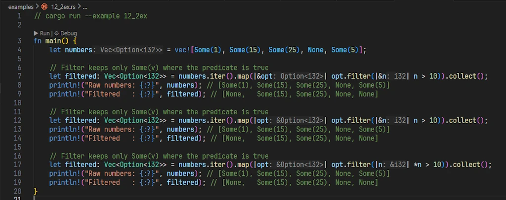
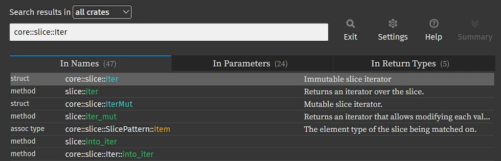
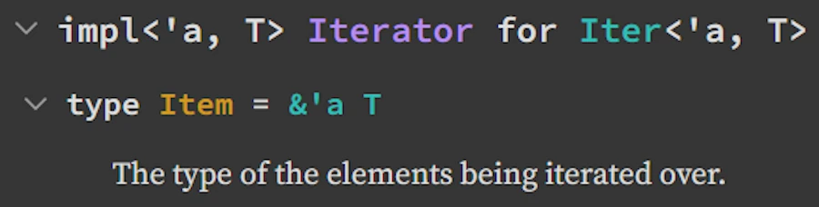

# `Option<T>` in Rust: 15 Examples from Beginner to Advanced
{: .no_toc }

A Code-First Guide with Runnable Examples
{: .lead }


<h2 align="center">
<span style="color:orange"><b> 🚧 This post is under construction 🚧</b></span>
</h2>


<!-- ###################################################################### -->
<!-- ###################################################################### -->
### This is Episode 02
{: .no_toc }

#### The Posts Of The Saga
{: .no_toc }
* [Episode 00]()
* [Episode 01]()
* [Episode 02]()


<div align="center">
<br/>
</div>


<!-- ###################################################################### -->
<!-- ###################################################################### -->
<!-- ###################################################################### -->
## Table of Contents
{: .no_toc .text-delta}
- TOC
{:toc}


<!-- ###################################################################### -->
<!-- ###################################################################### -->
<!-- ###################################################################### -->
## 🔴 - Example 10 - Borrowing Instead of Moving - `.as_ref()` and `.as_mut()`

### Real-world context
{: .no_toc }

Inspecting `Option<T>` without consuming it, modifying in-place, reusing `Option<T>` after checking.

### Runnable Example
{: .no_toc }

Copy and paste in [Rust Playground](https://play.rust-lang.org/)

```rust
// cargo run --example 10ex

fn main() {
    // i32 implements Copy, so Option<i32> also implements Copy
    let opt = Some(42);

    // Pattern matching copies opt instead of moving it
    if let Some(n) = opt {
        println!("{n}"); // n is copied from the Option
    }
    println!("{:?}", opt); // OK: opt was copied, not moved

    println!();
    // String does NOT implement Copy, so Option<String> does not implement Copy either
    let opt = Some(String::from("hello"));

    // Pattern matching moves opt and its inner String
    if let Some(s) = opt {
        // s is moved out of opt
        println!("Length: {}", s.len());
    }
    // println!("{:?}", opt); // ERROR: opt was moved and cannot be used here

    // Borrowing with as_ref => Option<T> remains usable afterwards
    println!();
    let opt = Some(String::from("hello"));
    if let Some(s) = opt.as_ref() {
        println!("Length: {}", s.len());
    }
    println!("{:?}", opt); // Ah, ha, ha, ha, stayin' alive, stayin' alive

    println!();
    // this express the same intention as `as_ref`
    if let Some(my_str) = &opt {
        println!("Length: {}", my_str.len());
    }
    println!("{:?}", opt); // Ah, ha, ha, ha, stayin' alive, stayin' alive

    println!();
    let mut path = Some(std::env::current_dir().expect("Cannot read current dir"));

    // as_ref() is useful with map - read without consuming
    let len = path.as_ref().map(|p| p.as_os_str().len());
    println!("The path {:?} has a length of {:?}", path, len);

    // as_mut is useful with map - modify in place
    path.as_mut().map(|p| p.push("documents"));
    path.as_mut().map(|p| p.push("top_secret"));

    println!("The path is now: {:?}", path);
}
```

### Read it Aloud
{: .no_toc }

"`as_ref()` converts `Option<T>` to `Option<&T>`, so that we can peek inside without consuming. `as_mut()` gives `Option<&mut T>` for peek and poke. Both leave the original `Option<T>` intact."


### Comments
{: .no_toc }

**IMPORTANT** The `Option<T>` is considered moved unless it implements `Copy` trait, which only happens if `T` implements `Copy`. Review Example 02 now that you have that in mind.

* With the first `if let Some(n) = opt`, the `Option<T>` on the right-hand side is copied and `opt` remains available.
    * `i32` implements the `Copy` trait
    * so `Option<i32>` also implements Copy
    * so using `opt` in a pattern match copies the `Option<T>` instead of moving it
    * `opt` remains valid.

* With the second `if let Some(s) = opt`, the `Option<T>` on the right-hand side is moved, which means `opt` is no longer available afterward.
    * `Option<String>` does not implement the `Copy` trait
    * so `opt` is moved into the `if let Some(s)`
    * we cannot use `opt` afterward

This explains the need for tools to "read" and to "read/write" inside `Option<T>`

* `Option<T>.as_ref()` provides an immutable reference to the value inside the `Option<T>`
* `Option<T>.as_mut()` provides a mutable reference to the value inside the `Option<T>`.
* In both cases, the `Option<T>` itself is not consumed, but any changes made through the mutable reference do modify the underlying value.
* An alternative to `if let Some(s) = opt.as_ref() {...` is `if let Some(s) = &opt {...`
* The line `path.as_mut().map(|p| p.push("documents"));` generates a warning. Do you know why? How can you simplify the code?


### Key Points
{: .no_toc }

1. **Signature**: `as_ref(&self) -> Option<&T>`, `as_mut(&mut self) -> Option<&mut T>`
2. **When to use**: Reading Option multiple times, modifying without replacing
3. **With map**: `opt.as_ref().map(|val| ...)` lets us transform without moving
4. **Ownership**: Original Option keeps ownership - crucial for reuse

### Find More Examples
{: .no_toc }

Regular expressions to use either in VSCode ou Powershell: `\.as_ref\(\)\.map` or `\.as_mut\(\)`


<!-- ###################################################################### -->
<!-- ###################################################################### -->
<!-- ###################################################################### -->
## 🔴 - Example 11 - Extracting Value and Leaving `None` - `.take()`

### Real-world context
{: .no_toc }

Consuming resources (files, connections), state machines, cleanup operations, RAII.

### Runnable Example
{: .no_toc }

Copy and paste in [Rust Playground](https://play.rust-lang.org/)

```rust
use std::fs::{self, File};

struct Editor {
    file: Option<File>,
}

impl Editor {
    fn is_open(&self) -> bool {
        self.file.is_some()
    }

    fn close(&mut self) {
        if let Some(_f) = self.file.take() {
            // _f is File, self.file is now None automatically
            println!("Closing file");
            // _f is dropped and the file is automatically closed at the end of the block
        }
    }
}

fn main() {
    let mut editor = Editor {
        file: Some(File::create("temp.txt").expect("Failed to create temp.txt")),
    };
    println!("Is open: {}", editor.is_open()); // true
    editor.close();
    println!("Is open: {}", editor.is_open()); // false

    // Clean up: remove temp.txt if it exists
    if fs::metadata("temp.txt").is_ok() {
        fs::remove_file("temp.txt").expect("Failed to delete temp.txt");
        println!("temp.txt deleted");
    }
}
```


Copy and paste in [Rust Playground](https://play.rust-lang.org/). This example demonstrates how to implement RAII (resource acquisition is initialization) with the help of `take()` even if early release are allowed.

```rust
struct Resource {
    name: String,
}

impl Resource {
    fn new(name: &str) -> Self {
        println!("\t[{}] Acquired", name);
        Self {
            name: name.to_string(),
        }
    }
}

impl Drop for Resource {
    fn drop(&mut self) {
        println!("\t[{}] Released", self.name);
    }
}

struct Guard {
    resource: Option<Resource>,
}

impl Guard {
    fn new(name: &str) -> Self {
        Self {
            resource: Some(Resource::new(name)),
        }
    }

    // Manually release before scope ends
    fn release(&mut self) {
        if let Some(r) = self.resource.take() {
            println!("\t[{}] Early release", r.name);
        } // r is dropped here
    }
}

impl Drop for Guard {
    fn drop(&mut self) {
        if self.resource.is_some() {
            println!("\tGuard dropped with resource still held");
        }
        // resource.take() not needed here - Option<T> drops automatically
    }
}

fn main() {
    println!("Example 1: Auto release at scope end");
    {
        let _guard = Guard::new("DB Connection");
        println!("\tDoing some work...");
    } // _guard dropped here, Resource released

    println!("\nExample 2: Early release with take()");
    {
        let mut guard = Guard::new("File Handle");
        println!("\tDoing work...");
        guard.release(); // Release early via take()
        println!("\tMore work after release...");
    } // guard dropped, but resource already gone
}
```


### Read it Aloud
{: .no_toc }

`Option<T>.take()` says: "Give me the value inside `Some(v)` + replace the `Option<T>` with `None` + and return the value as `Option<T>`."


### Comments
{: .no_toc }
* `Option<T>.take()` is a move + automatic `None` assignment in one operation.
* First example
    * The code at the end of `main()` is here to make sure the file is deleted if it exists.
* RAII
    * The `Option<Resource> + take()` pattern is idiomatic for managing resources that we may want to release manually while maintaining RAII safety.


### Key Points
{: .no_toc }

1. **Signature**: `take(&mut self) -> Option<T>` - requires mutable reference
2. **Atomic**: Extracts value and sets to `None` in one step (prevents use-after-move bugs)
3. **Common use**: Cleanup, state transitions, resource management
4. **vs moving**: `if let Some(x) = opt.take()` vs `if let Some(x) = opt` (latter moves entire Option)


### Find More Examples
{: .no_toc }

VSCode search: `\.take\(\)` (regex)
Regular expression to use either in VSCode ou Powershell: `\.take\(\)`


<!-- ###################################################################### -->
<!-- ###################################################################### -->
<!-- ###################################################################### -->
## 🔴 - Example 12 - Conditional Mapping - `.filter()`

### Real-world context
{: .no_toc }

Validation, keeping only values that meet criteria, sanitization.

### Runnable Example
{: .no_toc }

Copy and paste in [Rust Playground](https://play.rust-lang.org/)

```rust
fn main() {
    let numbers = vec![Some(1), Some(15), Some(25), None, Some(5)];

    // Filter keeps only Some(v) where the predicate is true
    let filtered: Vec<Option<i32>> = numbers.iter().map(|opt| opt.filter(|&n| n > 10)).collect();
    println!("Raw numbers: {:?}", numbers);  // [Some(1), Some(15), Some(25), None, Some(5)]
    println!("Filtered   : {:?}", filtered); // [None,    Some(15), Some(25), None, None]

    // Combining with map
    let name = Some("  Zoubida  ");
    let result = name
        .map(|n| n.trim())
        .filter(|n| !n.is_empty())  // Keep only if not empty after trim
        .map(|n| n.to_uppercase());
    println!("{:?}", result); // Some("ZOUBIDA")

    // Filter out invalid values
    let maybe_age = Some(-5);
    let valid_age = maybe_age.filter(|&age| age >= 0 && age <= 150);
    println!("{:?}", valid_age); // None (negative age rejected)
}
```

### Read it Aloud
{: .no_toc }

`filter(|val| condition)` says: "If `Option<T>` is `Some(v)` and the condition is true, keep it as `Some(v)`. Otherwise, return `None`. It's like `map()` but it can remove values."


### Comments
{: .no_toc }

* At this point it is important to **read** the story that the signatures tell us. In VSCode if we hover over the word `.filter` we can **read** :

```rust
core::option::Option
impl<T> Option<T>
pub const fn filter<P>(self, predicate: P) -> Self
where
    P: FnOnce(&T) -> bool + Destruct,
    T: Destruct,
```
I know what you think but this is like riding under the rain on track. No one like that but... This is an investment with large ROI, especially the next week-end in Belgium where it rains 370 days/year. Ok... Above we learn that, on an `Option<T>`, the predicate `P` acts on `&T` (did you notice the `P: FnOnce(&T)`?). The predicate borrows the tested values it does'nt consume them.

And what about `.map()`? Let's play the game and we **read**:

```rust
core::iter::traits::iterator::Iterator
pub trait Iterator
pub fn map<B, F>(self, f: F) -> Map<Self, F>
where
    Self: Sized,
    F: FnMut(Self::Item) -> B,

```


Now, just to make sure we know what we are talking about while talking about the first filter... Copy and paste in [Rust Playground](https://play.rust-lang.org/) the code below:

```rust
// cargo run --example 12_2ex

fn main() {
    let numbers = vec![Some(1), Some(15), Some(25), None, Some(5)];

    // Filter keeps only Some(v) where the predicate is true
    let filtered: Vec<Option<i32>> = numbers.iter().map(|&opt| opt.filter(|&n| n > 10)).collect();
    println!("Raw numbers: {:?}", numbers); // [Some(1), Some(15), Some(25), None, Some(5)]
    println!("Filtered   : {:?}", filtered); // [None,   Some(15), Some(25), None, None]

    // Filter keeps only Some(v) where the predicate is true
    let filtered: Vec<Option<i32>> = numbers.iter().map(|opt| opt.filter(|&n| n > 10)).collect();
    println!("Raw numbers: {:?}", numbers); // [Some(1), Some(15), Some(25), None, Some(5)]
    println!("Filtered   : {:?}", filtered); // [None,   Some(15), Some(25), None, None]

    // Filter keeps only Some(v) where the predicate is true
    let filtered: Vec<Option<i32>> = numbers.iter().map(|opt| opt.filter(|n| *n > 10)).collect();
    println!("Raw numbers: {:?}", numbers); // [Some(1), Some(15), Some(25), None, Some(5)]
    println!("Filtered   : {:?}", filtered); // [None,   Some(15), Some(25), None, None]
}
```

If you use VSCode, feel free to press CTRL+ALT to reveal the types and you should see:

<div align="center">
<br/>
</div>

All three versions above compile and produce identical results, but they differ in how they handle references in the closure parameters. Let me break down each one:

They all start with `numbers.iter()`. Reading the help of `.iter()` we learn the following:

```rust
core::slice
impl<T> [T]
pub const fn iter(&self) -> Iter<'_, T>
T = Option<i32>
```
1. Note that rust-analyzer is smart enough to recall us that in our case, `T = Option<i32>`.
2. We should also note that even if we call `.iter()` on a vector, the documentation explains that it will be considered as a slice (`[T]`).
3. The return type is `Iter<'_, T>`. The first element is a lifetime specifier. It indicates that the iterator is “bound” to the lifetime of the object on which we call `iter()` (here, `numbers`, the vector/slide of `Option<T>`). Indeed, slice iterators borrow elements instead of moving them.

So at this point we know we will get a `core::slice::Iter<'_, T>` but what is precisely the returned type? We have to go on the [Rust documentation](https://doc.rust-lang.org/stable/std/index.html) and look for the **`struct`** `core::slice::Iter`

<div align="center">
<br/>
</div>

Once on the page of the `Struct Iter`, in the section `Trait Implementations` we look, in alphabetical order, for the implementation of the **Iterator** trait:

<div align="center">
<br/>
</div>

This is where we learn that the implementation define an associated type Item: `type Item = &'a T`. This means that the iterator of a slice of elements of type `T` produces references (`&`) to these elements, with the same lifetime (`'a`) as the iterator itself. To make a long story short, the iterator produces `&Option<i32>`

Now let's analyze the 3 different versions of the line:

**Version 1:** `|&opt| opt.filter(|&n| n > 10)`
* Here we destructure the reference in the closure parameter. Since `numbers.iter()` yields `&Option<i32>`, using `|&opt|` gives us `opt: Option<i32>` (a copy, since `i32` is `Copy`). Then `|&n|` destructures the `&i32` from `filter`'s closure to get `n: i32`.

**Version 2:** `|opt| opt.filter(|&n| n > 10)`
 * Here `opt` is `&Option<i32>`, but thanks to Rust's auto-deref, calling `.filter()` works seamlessly. The `|&n|` pattern still destructures the reference inside.

**Version 3:** `|opt| opt.filter(|n| *n > 10)`
    * Here we keep the reference and explicitly dereference with `*n` when comparing.

Which one to prefer?
* We should keep the first part: `numbers.iter().map(|opt| ...)`
* For integers or other `Copy` types:
    * `|&n| n > 10` is concise and idiomatic.
* For general types (non-Copy):
    * Use `|n| *n > 10` to avoid forcing a copy or clone.

V2 is better but type specific. Personally I would vote for V3 since it can be generalized.


### Key Points
{: .no_toc }

1. **Signature**: `filter<P>(self, predicate: P) -> Option<T>` where `P: FnOnce(&T) -> bool`
2. **Chainable**: Combine with `map` for "transform then validate"
3. **None handling**: `None` stays `None` (predicate never called)
4. **vs if**: More functional, composable with other `Option<T>` methods

### Find More Examples
{: .no_toc }

Regular expression to use either in VSCode ou Powershell: `\.filter\(\s*\|[^|]+\|[^)]*\)`


<!-- ###################################################################### -->
<!-- ###################################################################### -->
<!-- ###################################################################### -->
## 🔴 - Example 13 - Working with Collections of Options - `.flatten()` and `.filter_map()`

### Real-world context
{: .no_toc }

Processing results where some operations fail, removing `None` values, transforming + filtering.

### Runnable Example
{: .no_toc }

Copy and paste in [Rust Playground](https://play.rust-lang.org/)

```rust
fn parse_number(s: &str) -> Option<i32> {
    s.parse().ok()
}

fn main() {
    let inputs = vec!["42", "invalid", "100", "", "7"];

    // Method 1: map + flatten
    let numbers: Vec<i32> = inputs
        .iter()
        .map(|&s| parse_number(s))  // Vec<Option<i32>>
        .flatten()                  // Remove None, unwrap Some
        .collect();

    println!("{:?}", numbers);      // [42, 100, 7]

    // Method 2: filter_map (more efficient)
    let numbers2: Vec<i32> = inputs
        .iter()
        .filter_map(|&s| parse_number(s))
        .collect();

    println!("{:?}", numbers2);     // [42, 100, 7]

    // With transformation
    let doubled: Vec<i32> = inputs
        .iter()
        .filter_map(|&s| parse_number(s).map(|n| n * 2))
        .collect();

    println!("{:?}", doubled);      // [84, 200, 14]
}
```

### Read it Aloud
{: .no_toc }

"`.flatten()` converts `Vec<Option<T>>` to `Vec<T>` by discarding `None` while `.filter_map(|x| optional_transform(x))` combines `.map()` and `.flatten()` in one step."


### Comments
{: .no_toc }

* `.filter_map(|x| optional_transform(x))` is more efficient for large collections


### Key Points
{: .no_toc }

1. **flatten**: `Iterator<Item = Option<T>>` → `Iterator<Item = T>`
2. **filter_map**: Combines filter + map - one pass instead of two
3. **Performance**: `filter_map` avoids intermediate allocation
4. **Common pattern**: Processing lists where operations might fail

### Find More Examples
{: .no_toc }

Regular expression to use either in VSCode ou Powershell: `\.flatten\(\)` or `\.filter_map\(`


<!-- ###################################################################### -->
<!-- ###################################################################### -->
<!-- ###################################################################### -->
## 🔴 - Example 14 - Combining Multiple Options

### Real-world context
{: .no_toc }

Validation requiring multiple fields, coordinate systems, multi-factor authentication.

### Runnable Example
{: .no_toc }

Copy and paste in [Rust Playground](https://play.rust-lang.org/)

```rust
// Method 1: Using ? operator
fn add_options(a: Option<i32>, b: Option<i32>) -> Option<i32> {
    Some(a? + b?)  // If either is None, return None immediately
}

// Method 2: Explicit match
fn add_options_match(a: Option<i32>, b: Option<i32>) -> Option<i32> {
    match (a, b) {
        (Some(x), Some(y)) => Some(x + y),
        _ => None,  // If either is None
    }
}

// Method 3: Chaining
fn add_options_and_then(a: Option<i32>, b: Option<i32>) -> Option<i32> {
    a.and_then(|x| b.map(|y| x + y))
}

fn main() {
    println!("{:?}", add_options(Some(5), Some(10)));  // Some(15)
    println!("{:?}", add_options(Some(5), None));      // None
    println!("{:?}", add_options(None, Some(10)));     // None

    // All three methods are equivalent
    assert_eq!(add_options(Some(2), Some(3)), Some(5));
    assert_eq!(add_options_match(Some(2), Some(3)), Some(5));
    assert_eq!(add_options_and_then(Some(2), Some(3)), Some(5));

    // Real-world: combining coordinates
    fn distance(x: Option<f64>, y: Option<f64>) -> Option<f64> {
        Some((x? * x? + y? * y?).sqrt())
    }

    println!("{:?}", distance(Some(3.0), Some(4.0))); // Some(5.0)
    println!("{:?}", distance(Some(3.0), None));      // None
}
```

### Read it Aloud
{: .no_toc }

"`Some(a? + b?)` offers a concise early-return logic to `Options<T>` 2 or more option. If all `Options<T>` are `Some(v)` the processing takes place, otherwise, if any is `None`, early reply `None`."


### Comments
{: .no_toc }


### Key Points
{: .no_toc }

1. **? operator method**: Cleanest for 2+ Options - reads left to right
2. **match method**: Most explicit - good for complex conditions
3. **and_then method**: Functional style - harder to **read** for multiple values
4. **All-or-nothing**: Result is `Some(v)` only if ALL inputs are `Some(v)`

### Find More Examples
{: .no_toc }

Regular expression to use either in VSCode ou Powershell: `Some\(.+?\?\s*[+\-*/]\s*.+?\?\)`


<!-- ###################################################################### -->
<!-- ###################################################################### -->
<!-- ###################################################################### -->
## 🔴 - Example 15 -  Converting `Option<&T>` to `Option<T>` - `.copied()` and `.cloned()`

### Real-world context
{: .no_toc }

Working with references from collections, avoiding lifetime issues, simplifying ownership.

### Runnable Example
{: .no_toc }

Copy and paste in [Rust Playground](https://play.rust-lang.org/)

```rust
fn main() {
    let vec = vec![1, 2, 3, 4, 5];

    // vec.first() returns Option<&i32>
    let first_ref: Option<&i32> = vec.first();
    println!("{:?}", first_ref); // Some(&1)

    // Need Option<i32> not Option<&i32>
    let first_owned: Option<i32> = vec.first().copied();
    println!("{:?}", first_owned); // Some(1) - no reference

    // With String (not Copy, requires cloned)
    let strings = vec!["hello".to_string(), "world".to_string()];
    let first_string: Option<String> = strings.first().cloned();
    println!("{:?}", first_string); // Some("hello")

    // Practical: avoiding lifetime errors
    fn get_first_double(numbers: &Vec<i32>) -> Option<i32> {
        numbers.first().copied().map(|n| n * 2)
        // Without copied(): would return Option<i32> borrowing from numbers
        // With copied(): returns owned i32, no lifetime issues
    }

    let nums = vec![10, 20, 30];
    println!("{:?}", get_first_double(&nums)); // Some(20)
}
```

### Read it Aloud
{: .no_toc }

"`.copied()` duplicates the value inside `Option<&T>` to produce `Option<T>` (requires the `Copy` trait). `.cloned()` does the same but uses the `Clone` trait instead - works for non-Copy types like `String`."


### Comments
{: .no_toc }


### Key Points
{: .no_toc }

1. **When to use**: Converting `Option<&T>` from collections to owned `Option<T>`
2. **copied()**: For `Copy` types (i32, f64, char, etc.) - cheap bitwise copy
3. **cloned()**: For `Clone` types (String, Vec, etc.) - potentially expensive
4. **Lifetime escape**: Lets us return `Option<T>` without lifetime parameters

### Find More Examples
{: .no_toc }

Regular expression to use either in VSCode ou Powershell: `\.copied\(\)`, `\.cloned\(\)` or `\.first\(\)\.copied\(\)`.


<!-- ###################################################################### -->
<!-- ###################################################################### -->
<!-- ###################################################################### -->
## Some Pitfalls and How to Avoid Them


<!-- ###################################################################### -->
<!-- ###################################################################### -->
### Pitfall 1: unwrap() vs expect() vs unwrap_or()


```rust
let opt: Option<i32> = None;

// NOK unwrap() - panics on None with generic message
// let val = opt.unwrap(); // panics: "called `Option::unwrap()` on a `None` value"

// WARN expect() - panics with custom message (better for debugging)
// let val = opt.expect("Expected a value here!"); // panics: "Expected a value here!"

// OK unwrap_or() - provides fallback, never panics
let val = opt.unwrap_or(42);
println!("{}", val); // 42
```

We should never use `unwrap()` in production. Use `expect()` only when `None` is truly impossible (with good message). Prefer `unwrap_or()` or proper matching.


<!-- ###################################################################### -->
<!-- ###################################################################### -->
### Pitfall 2: copied() vs cloned() Confusion

```rust
let numbers = vec![1, 2, 3];

// OK copied() for Copy types (i32)
let first: Option<i32> = numbers.first().copied();

let strings = vec!["a".to_string()];

// NOK copied() doesn't work on String (not Copy)
// let s: Option<String> = strings.first().copied(); // ERROR

// OK cloned() for Clone types
let s: Option<String> = strings.first().cloned();
```

We should use `copied()` for primitive types, `cloned()` for heap-allocated types (String, Vec, etc.).


<!-- ###################################################################### -->
<!-- ###################################################################### -->
### Pitfall 3: Moving vs Borrowing

```rust
let opt = Some(String::from("hello"));

// NOK This moves opt
// match opt {
//     Some(s) => println!("{}", s),
//     None => {}
// }
// println!("{:?}", opt); // ERROR: opt was moved

// OK Borrow with as_ref()
match opt.as_ref() {
    Some(s) => println!("{}", s),
    None => {}
}
println!("{:?}", opt); // Works!
```

We should use `as_ref()` when we need to inspect `Option<T>` without consuming it.


<!-- ###################################################################### -->
<!-- ###################################################################### -->
### Pitfall 4: Understanding Some(x?)

```rust
fn parse_and_wrap(s: &str) -> Option<Option<i32>> {
    // NOK Confusing nested Option
    Some(s.parse().ok())
}

fn parse_correctly(s: &str) -> Option<i32> {
    // OK Flatten with ?
    Some(s.parse().ok()?)
}

fn main() {
    println!("{:?}", parse_and_wrap("42"));     // Some(Some(42)) - awkward
    println!("{:?}", parse_correctly("42"));    // Some(42) - clean
    println!("{:?}", parse_correctly("invalid")); // None
}
```

`Some(x?)` means "try to get x, if `None` short-circuit. Otherwise wrap in Some". Avoids nested Options.


<!-- ###################################################################### -->
<!-- ###################################################################### -->
<!-- ###################################################################### -->
## Quick Reference & Cheat Sheet


<!-- ###################################################################### -->
<!-- ###################################################################### -->
### Extraction Methods

| Method               | Returns on `Some(v)` | Returns on `None` | Panics?           | Example |
|----------------------|-----------------|-------------------|-------------------|---------|
| `unwrap()`           | `T`             | -                 | ✅ Yes            | 01      |
| `expect(msg)`        | `T`             | -                 | ✅ Yes (with msg) | 11      |
| `unwrap_or(default)` | `T`             | `default`         | ❌ No             | 05      |
| `unwrap_or_else(f)`  | `T`             | `f()`             | ❌ No (lazy)      | 05      |
| `unwrap_or_default()`| `T`             | `T::default()`    | ❌ No             | 05      |


<!-- ###################################################################### -->
<!-- ###################################################################### -->
### Transformation Methods

| Method        | Type Transform                    | Lazy?  | Use When                  | Example |
|---------------|-----------------------------------|--------|---------------------------| --------|
| `map(f)`      | `Option<T>` → `Option<U>`         | Yes    | Transform always succeeds | 07      |
| `and_then(f)` | `Option<T>` → `Option<U>`         | Yes    | Transform returns Option  | 08      |
| `filter(p)`   | `Option<T>` → `Option<T>`         | Yes    | Conditional keeping       | 12      |
| `flatten()`   | `Option<Option<T>>` → `Option<T>` | Yes    | Remove nesting            | 13      |


<!-- ###################################################################### -->
<!-- ###################################################################### -->
### Borrowing Methods

| Method     | Converts                       | Mutates Original?       | Example |
|------------|--------------------------------|-------------------------| ------- |
| `as_ref()` | `Option<T>` → `Option<&T>`     | ❌ No                   | 10      |
| `as_mut()` | `Option<T>` → `Option<&mut T>` | ✅ Yes (value inside)   | 10      |
| `take()`   | `Option<T>` → `Option<T>`      | ✅ Yes (sets to `None`) | 11      |


<!-- ###################################################################### -->
<!-- ###################################################################### -->
### Checking Methods

| Method           | Returns | Use When                    | Example |
|------------------|---------|-----------------------------|---------|
| `is_some()`      | `bool`  | Only need to know if `Some(v)`   | 01      |
| `is_none()`      | `bool`  | Only need to know if `None` | NA      |
| `is_some_and(f)` | `bool`  | Check `Some(v)` + condition      | NA      |


<!-- ###################################################################### -->
<!-- ###################################################################### -->
### Note About the Performances

- **Lazy evaluation**: `unwrap_or_else`, `map`, `and_then`, `filter` - closures only run when needed
- **Eager evaluation**: `unwrap_or` - argument always evaluated
- **Zero-cost**: `as_ref()`, `as_mut()`, `is_some()`, `is_none()` - compile to no-ops or simple checks


<!-- ###################################################################### -->
<!-- ###################################################################### -->
<!-- ###################################################################### -->
## Webliography

<!-- ###################################################################### -->
<!-- ###################################################################### -->
### Official Documentation

- [std::option::Option](https://doc.rust-lang.org/std/option/enum.Option.html) - Complete API reference
- [Rust Book Chapter 6.1](https://doc.rust-lang.org/book/ch06-01-defining-an-enum.html#the-option-enum-and-its-advantages-over-null-values) - Option fundamentals
- [Rust by Example: Option](https://doc.rust-lang.org/rust-by-example/std/option.html) - Practical examples

### Related Articles on This Blog

- [Bindings in Rust: More Than Simple Variables]() - Understanding ownership and borrowing.
- [Rust and Functional Programming: Top 10 Functions]() - Iterator patterns (map, filter, etc.).
-  [Error Handling, Demystified]() - A beginner-friendly conversation on Errors.


<!-- ###################################################################### -->
<!-- ###################################################################### -->
<!-- ###################################################################### -->
## The Posts Of The Saga
{: .no_toc }
* [Episode 00]()
* [Episode 01]()
* [Episode 02]()
