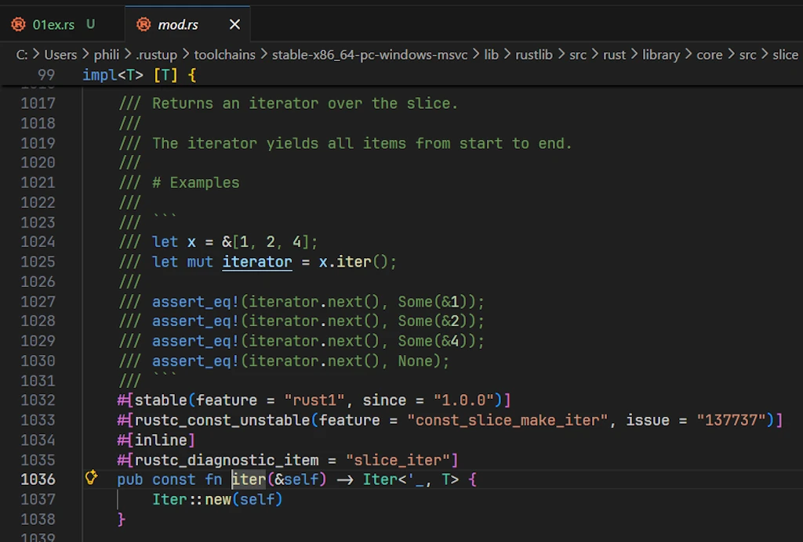
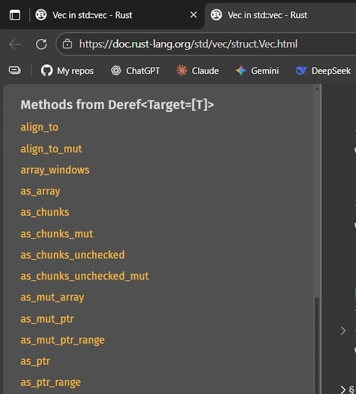

# How to Actually Read Rust's Standard Library Documentation
{: .no_toc }

A survival guide for developers who stare at type signatures and feel lost
{: .lead }


<h2 align="center">
<span style="color:orange"><b> 🚧 This post is under construction 🚧</b></span>
</h2>


<!-- ###################################################################### -->
<!-- ###################################################################### -->
## TL;DR
{: .no_toc }
* `read != look at`
* [docs.rust-lang.org/std](https://doc.rust-lang.org/std/)
*


<div align="center">
<br/>
<span>Great Scott!</span>
</div>


<!-- ###################################################################### -->
<!-- ###################################################################### -->
## Table of Contents
{: .no_toc .text-delta}
- TOC
{:toc}


<!-- ###################################################################### -->
<!-- ###################################################################### -->
## Introduction

You know that feeling when you're **reading** someone else's Rust code, you hit a method you don't recognize, you open the docs, and... you're greeted by something that looks like it was written in an alien language? Yeah, we're going to fix that today.

This guide is a conversation between two developers: **Marty**, who's learning Rust and constantly frustrated by the documentation, and **Emmett**, a senior developer who's going to show him how to actually **read** those intimidating type signatures.

By the end of this article, you'll be able to look at something like this:

```rust
pub const fn filter<P>(self, predicate: P) -> Self
where
    P: FnOnce(&T) -> bool + Destruct,
    T: Destruct,
```

...and actually understand what it means. Let's dive in.


<!-- ###################################################################### -->
<!-- ###################################################################### -->
## The Setup

Before we start, let's make sure we're on the same page:
- You already wrote some code and tried to find your way in the Standard Library documentation. Your are not an expert but your are not a beginner either.
- You have read at least half of **THE** book, [The Rust Programming Language](https://doc.rust-lang.org/book/title-page.html).

<div align="center">
<br/>
<span>The Rust Programming Book</span>
</div>

- **OS:** Windows 11 (but the topic is OS agnostic)
- **Editor:** VS Code with [rust-analyzer](https://marketplace.visualstudio.com/items?itemName=rust-lang.rust-analyzer) installed
- **Rust:** A working installation (run `rustc --version` to check)
    ```powershell
    rustc --version
    rustc 1.91.1 (ed61e7d7e 2025-11-07)
    ```
    If needed, check [my Rust setup under WIN11]()
- **Browser:** Any browser with [docs.rust-lang.org/std](https://doc.rust-lang.org/std/) open

<div align="center">
<br/>
<span>The Standard Library Documentation Home Page</span>
</div>

Here's the code we'll be dissecting throughout this guide. Copy it into the [Rust Playground](https://play.rust-lang.org/) or a local file:

```rust
fn main() {
    let numbers = vec![Some(1), Some(15), Some(25), None, Some(5)];

    // Filter keeps only Some(v) where the predicate is true
    let filtered: Vec<Option<i32>> = numbers
        .iter()
        .map(|&opt| opt.filter(|&n| n > 10))
        .collect();

    println!("Raw numbers: {:?}", numbers);
    println!("Filtered   : {:?}", filtered);
}
```

Output:
```
Raw numbers: [Some(1), Some(15), Some(25), None, Some(5)]
Filtered   : [None, Some(15), Some(25), None, None]
```

<div align="center">
<br/>
<span>Run the code in Rust Playground</span>
</div>


Fewer than 15 lines, but there's *so much* going on here. Let's unpack it all.


<!-- ###################################################################### -->
<!-- ###################################################################### -->
## 🟢 Part 1: Easy — Finding Your Way Around


**Marty:** Okay, I'm looking at this code and I already have questions. What even is `vec!`? Is it a function? Why the exclamation mark? A `not` operator?

**Emmett:** Great first question! The `!` tells you it's a **macro**, not a function. In Rust, macros have that **trailing bang**. Let's find it in the docs.

**Marty:** Hey Doc, how do I even search for that?

**Emmett:** Two ways. First, the easy way, directly in VS Code.

<div align="center">
<br/>
<span>Run the code in VScode</span>
</div>

Hover over `vec!` and you'll see a tooltip from rust-analyzer. It'll show you something like:

```
alloc::macros
macro_rules! vec // matched arm #2
Creates a [Vec] containing the arguments.
```

But let's also learn to use the official docs. Go to [doc.rust-lang.org/std](https://doc.rust-lang.org/std/) and use the search bar at the top. Type "vec" and you'll see results. Look for `vec` in the `std` module — it's the macro.

<div align="center">
<br/>
<span>Searching in the Standard Library</span>
</div>


**Marty:** Found it! [std::vec macro](https://doc.rust-lang.org/std/macro.vec.html). Okay, it says it "creates a `Vec` containing the arguments." Simple enough.

<div align="center">
<br/>
<span>The Rust documentation page for <code>Macro vec</code></span>
</div>


**Emmett:** See? Not so scary. Now, let's talk about **reading** the docs page structure, because every page follows the same pattern.


<!-- ###################################################################### -->
### Anatomy of a Documentation Page
{: .no_toc }

**Emmett:** Every item in the standard library has a doc page with a consistent structure. Let's look at [`Vec<T>`](https://doc.rust-lang.org/std/vec/struct.Vec.html) as an example.

{: .important-title }
> Side Note:
>
> * On the previous page you can click on the word `Vec`.
> * Or you can go back to [doc.rust-lang.org/std](https://doc.rust-lang.org/std/), search for `vec` and click on the second item in the list : `struct std::vec::Vec`


<div align="center">
<br/>
<span>The Rust documentation page for <code>Struct Vec</code></span>
</div>

1. **The path** at the top: `std::vec` — this tells you **where** the item lives
2. **The declaration**: `pub struct Vec<T, A = Global>` — the actual type definition
3. **Description**: A short description of what it does
4. **Implementations**: The `impl` blocks showing all methods
5. **Trait Implementations**: What traits this type implements (`Clone`, `Debug`, etc.)

**Marty:** What's that `A = Global` thing?

**Emmett:** That's a *default type parameter*. It means "if you don't specify an allocator, use `Global`." You can ignore it 99% of the time. Most people just write `Vec<T>` and never think about custom allocators.

**Marty:** Okay, noted. So when I see extra type parameters with `= Something`, I can usually ignore them?

**Emmett:** Exactly. They're there for advanced use cases. Focus on the main type parameter first.


<!-- ###################################################################### -->
### Your First Real Investigation: What Does `.iter()` Return?
{: .no_toc }

**Marty:** Alright, in the code we have `numbers.iter()`. What does that return? How do I find out?

**Emmett:** Let's use VS Code first. Put your cursor on `.iter()` and press **F12** (Go to Definition). Or just hover over it.

<div align="center">
<br/>
<span>Hovering over <code>.iter()</code></span>
</div>


**Marty:** It says... `pub fn iter(&self) -> Iter<'_, T>`. What's `Iter<'_, T>`?

<div align="center">
<br/>
<span>Source code of <code>.iter()</code></span>
</div>


**Emmett:** That's the return type! It's a struct called `Iter`. The `'_` is an *elided lifetime* — the compiler figures it out for you. For now, just **read** it as "an iterator that borrows from the original collection."

Now, **Ctrl+Click** (or **F12**) on `Iter` (on the line `Iter::new(self)`), and VS Code will take you to its definition. Or search for "slice Iter" in the docs.

**Marty:** Wait, why "slice"? Our `numbers` is a `Vec`, not a slice.

**Emmett:** Excellent! Here's a key insight: `Vec<T>` implements a trait called [`Deref`](https://doc.rust-lang.org/std/ops/trait.Deref.html) that lets it behave like a slice (`[T]`). When you call `.iter()` on a `Vec`, you're actually calling the slice's `.iter()` method.

Check the [`Vec` documentation](https://doc.rust-lang.org/std/vec/struct.Vec.html) — scroll down to "Methods from `Deref<Target = [T]>`". You'll see all the slice methods available on `Vec`.

<div align="center">
<br/>
<span>List of Methods from <code>Deref<Target = [T]></code></span>
</div>


**Marty:** Oh! So `Vec` "inherits" methods from `[T]` through `Deref`?

**Emmett:** Exactly. This is called **deref coercion**. We'll dig deeper into this later, but for now, just know: if you can't find a method directly on a type, check what it `Deref`s to.


<!-- ###################################################################### -->
### Quick Reference: Your Toolbox So Far
{: .no_toc }

| Tool | What It Does | Shortcut |
|------|--------------|----------|
| Hover | Shows type info and brief docs | Mouse hover |
| Go to Definition | Jumps to source/declaration | F12 or Ctrl+Click |
| Search on docs.rust-lang.org | Find any std item | Use search bar |
| "Methods from Deref" section | Find inherited methods | Scroll down on doc page |


<!-- ###################################################################### -->
### Exercice 00
{: .no_toc }


<!-- ###################################################################### -->
### Exercice 01
{: .no_toc }


<!-- ###################################################################### -->
### Exercice 02
{: .no_toc }


<!-- ###################################################################### -->
<!-- ###################################################################### -->
## 🔵 Part 2: Intermediate — Generics and Trait Bounds


<!-- ###################################################################### -->
### The Map Method: Our First Generic Signature
{: .no_toc }

**Marty:** Okay, next up is `.map()`. Let me hover over it...

```rust
core::iter::traits::iterator::Iterator
pub trait Iterator
pub fn map<B, F>(self, f: F) -> Map<Self, F>
where
    Self: Sized,
    F: FnMut(Self::Item) -> B,
Self = Iter<'_, Option<i32>>, B = Option<i32>, F = impl FnMut(&Option<i32>) -> …
```

Hmm, Emmett... What is all this?


**Emmett:** Now we're getting somewhere! Let's break this down piece by piece.

```rust
pub fn map<B, F>(self, f: F) -> Map<Self, F>
```

This declares a method called `map` with:
- **Two type parameters**: `B` and `F` (in the angle brackets)
- **Takes ownership of self**: that's the `self` (not `&self`)
- **Takes a parameter `f`** of type `F`
- **Returns** `Map<Self, F>` — a new iterator type


**Marty:** What are `B` and `F`? Like, what do those letters mean?

**Emmett:** They're **generic type parameters** — placeholders for actual types. The letters are conventional:
- `T` = "Type" (the main/default generic)
- `B` = often "B" as in "the type we're mapping *to*" (think: A → B)
- `F` = "Function" (for closures/function parameters)
- `E` = "Error"
- `K`, `V` = "Key", "Value" (for maps)

But they're just names. What matters is the **constraints** on them.


<!-- ###################################################################### -->
### Understanding `where` Clauses
{: .no_toc }

**Emmett:** Now look at the `where` clause:

```rust
where
    F: FnMut(Self::Item) -> B,
```

This says: "`F` must implement `FnMut(Self::Item) -> B`."

In plain English: "The function `f` must be something callable that:
- Takes one argument of type `Self::Item` (whatever the iterator yields)
- Returns something of type `B`
- Can be called multiple times (and might mutate its environment — that's what `Mut` means)"


**Marty:** What's `Self::Item`?

**Emmett:** `Self` refers to the type implementing this trait (in our case, `Iter<'_, Option<i32>>`). And `Item` is an **associated type** of the `Iterator` trait — it's the type of elements the iterator produces.

For our `Iter<'_, Option<i32>>`, the `Item` type is `&Option<i32>` — a reference to each element.


**Marty:** Wait, a **reference**? Not the actual `Option<i32>`?

**Emmett:** Right! Because `.iter()` **borrows** the collection. It gives you references (`&Option<i32>`) not owned values (`Option<i32>`). Now, let's look at that line:

```rust
.map(|&opt| opt.filter(|&n| n > 10))
```

The `|&opt|` uses *pattern matching* in the closure parameter. It says "take the reference, dereference it, and bind the result to `opt`." So `opt` is `Option<i32>`, not `&Option<i32>`.

**Marty:** Could I also write `|opt| (*opt).filter(...)`?

**Emmett:** Absolutely! Or even `|opt| opt.filter(...)` because of auto-deref. But for `Copy` types like `Option<i32>`, the `|&opt|` pattern is common and clean.


<!-- ###################################################################### -->
### The Three Fn Traits: `Fn`, `FnMut`, `FnOnce`
{: .no_toc }

**Marty:** You mentioned `FnMut`. On the other hand I also read about `Fn` and `FnMut`. What's the difference between `Fn`, `FnMut`, and `FnOnce`?

**Emmett:** Great question. These are the three closure traits:

| Trait | Can call... | Can mutate captured vars? | Can consume captured vars? |
|-------|-------------|---------------------------|----------------------------|
| [`Fn`](https://doc.rust-lang.org/std/ops/trait.Fn.html) | Multiple times | No | No |
| [`FnMut`](https://doc.rust-lang.org/std/ops/trait.FnMut.html) | Multiple times | Yes | No |
| [`FnOnce`](https://doc.rust-lang.org/std/ops/trait.FnOnce.html) | Once | Yes | Yes |

There's a hierarchy: `Fn` implies `FnMut`, which implies `FnOnce`. So if something requires `FnOnce`, you can pass any closure. If it requires `Fn`, you need a closure that doesn't mutate anything.

**Marty:** So `.map()` uses `FnMut` because it calls the closure multiple times (once per element I suspect), and the closure *might* need to mutate some state?

**Emmett:** Exactly! Even if your specific closure doesn't mutate anything, `.map()` is *designed* to accept closures that could. It's being flexible.


<!-- ###################################################################### -->
### Reading the `Option::filter` Signature
{: .no_toc }

**Marty:** Now let's tackle the scary one. The `filter` method on `Option`. Here's what the docs show:

```rust
core::option::Option
impl<T> Option<T>

pub const fn filter<P>(self, predicate: P) -> Self
where
    P: FnOnce(&T) -> bool + Destruct,
    T: Destruct,
```


**Emmett:** Let's go line by line.

**Line 0: `core::option::Option`**
Easy. You already know. This is **where** the item lives, in the crate `core::option::Option`.


**Line 1: `impl<T> Option<T>`**

This tells you **where** this method is **defined**. It's in an `impl` block for `Option<T>`. The `<T>` means this works for any type `T` inside the Option.

**Line 2: `pub const fn filter<P>(self, predicate: P) -> Self`**

- `pub`: This method is public
- `const fn`: Can be called in **const contexts** (compile-time evaluation) — you can usually ignore this
- `filter<P>`: Method named `filter` with one type parameter `P`
- `(self, predicate: P)`: Takes ownership of `self` and a  [`predicate`](#predicates) of type `P`
- `-> Self`: Returns the same type (`Option<T>`)

**Marty:** Wait, it takes `self` not `&self`? So it **consumes** the Option?

**Emmett:** Yes! Check the signature. When a method takes `self`, it takes ownership. That's why this works:

```rust
opt.filter(|&n| n > 10)  // opt is moved into filter
```

If `opt` were `&Option<i32>`, you couldn't call `filter` directly — you'd need to clone or copy first. But since `Option<i32>` is `Copy` (because `i32` is `Copy`), the compiler handles this automatically.

**Lines 3-4: The `where` clause**

```rust
where
    P: FnOnce(&T) -> bool + Destruct,
    T: Destruct,
```

Let's parse `P: FnOnce(&T) -> bool + Destruct`:

- `P` must implement `FnOnce(&T) -> bool` — a function taking `&T` and returning `bool`
- `+ Destruct` — AND it must implement `Destruct`

**Marty:** What the heck is `Destruct`? I've never seen that.

**Emmett:** `Destruct` is a trait used for **const evaluation**. It basically means "this type can be dropped in a const context." For normal runtime code, **you can completely ignore it**. It's automatically implemented for pretty much everything.

When you see bounds like `Destruct`, `Sized`, or `Unpin`, and you're not doing advanced stuff (const generics, custom DSTs, async), you can usually skip over them.

**Marty:** So practically speaking, the signature just means "give me a function that takes a reference to the inner value and returns bool"?

**Emmett:** Exactly and this is one way to describe a predicate. Now, the `filter` method:
1. If `self` is `None`, returns `None`
2. If `self` is `Some(v)`, calls `predicate(&v)`
   - If true, returns `Some(v)`
   - If false, returns `None`

**Marty:** Oh! So in our code, `Some(1).filter(|&n| n > 10)` returns `None` because 1 is not greater than 10. And `Some(15).filter(|&n| n > 10)` returns `Some(15)`.

**Emmett:** You've got it!


<!-- ###################################################################### -->
### The Three Versions Explained
{: .no_toc }

**Marty:** The original code has three "same thing" versions:

```rust
// V1
.map(|&opt| opt.filter(|&n| n > 10))

// V2
.map(|opt| opt.filter(|&n| n > 10))

// V3
.map(|opt| opt.filter(|n| *n > 10))
```

What's the difference?

**Emmett:** They're all equivalent! Let me explain:

**V1:** `|&opt|` — Destructure the reference immediately. `opt` is `Option<i32>`.

**V2:** `|opt|` — `opt` is `&Option<i32>`, but thanks to `Deref` coercion and the fact that `Option<i32>` is `Copy`, calling `.filter()` works seamlessly. Rust is smart enough to copy the value when needed.

Actually, wait — let me be more precise. In V2, `opt` is `&Option<i32>`. When you call `opt.filter(...)`, Rust sees that `filter` takes `self` (ownership), but you have a reference. Since `Option<i32>` is `Copy`, Rust automatically copies it. This is called *auto-deref* combined with *implicit copying*.

**V3:** `|opt|` same as V2, but inside the inner closure: `|n|` where `n` is `&i32`, and you manually dereference with `*n > 10`.

The Rust compiler is incredibly helpful here. All three work because of:
- Auto-deref: automatically dereferencing when needed
- Copy semantics: `i32` and `Option<i32>` are `Copy`, so they get copied instead of moved
- Pattern matching: `|&x|` destructures references in closures


<!-- ###################################################################### -->
### Exercice 00
{: .no_toc }


<!-- ###################################################################### -->
### Exercice 01
{: .no_toc }


<!-- ###################################################################### -->
### Exercice 02
{: .no_toc }


<!-- ###################################################################### -->
<!-- ###################################################################### -->
## 🔴 Part 3: Difficult — Advanced Patterns

### Associated Types vs. Generic Type Parameters

**Marty:** You mentioned `Self::Item` earlier (see "Understanding `where` Clauses"). How is that different from just using a generic parameter `<T>`?

**Emmett:** Great question. Compare these two approaches:

**Generic type parameter:**
```rust
trait Container<T> {
    fn get(&self) -> T;
}
```

**Associated type:**
```rust
trait Container {
    type Item;
    fn get(&self) -> Self::Item;
}
```

The key difference: with generics, you can implement the same trait multiple times for different `T`:

```rust
impl Container<i32> for MyStruct { ... }
impl Container<String> for MyStruct { ... }  // Both valid!
```

With associated types, there's exactly ONE implementation per type:

```rust
impl Container for MyStruct {
    type Item = i32;
    fn get(&self) -> i32 { ... }
}
// Can't also impl Container for MyStruct with Item = String
```

**Marty:** So `Iterator` uses an associated type because each iterator type yields exactly one kind of item?

**Emmett:** Precisely. A `Vec<i32>::Iter` always yields `&i32`. It wouldn't make sense to have it also yield `&String`. The associated type locks it in.


### Reading Associated Types in Docs

**Marty:** How do I find out what the associated types are for a given type?

**Emmett:** In the docs, when you look at a type's trait implementations, you'll see lines like:

```rust
impl<T, A: Allocator> IntoIterator for Vec<T, A>
    type Item = T
    type IntoIter = IntoIter<T, A>
```

See those `type Item = T` and `type IntoIter = ...` lines? Those are the associated types being specified.

You can also find them in VS Code. Hover over or go to definition of the trait, and you'll see the associated types declared.

<div align="center">
<br/>
<span>Click on the <code>Iterator</code> link</span>
</div>


Let's look at the [`Iterator` trait](https://doc.rust-lang.org/std/iter/trait.Iterator.html):

<div align="center">
<br/>
<span>Search for "Iterator" in the Rust standard library documentation</span>
</div>

Then

<div align="center">
<br/>
<span>Click on <code>std::iter::Iterator</code></span>
</div>

We see

```rust
pub trait Iterator {
    type Item;

    fn next(&mut self) -> Option<Self::Item>;

    // ... many other methods
}
```

That `type Item;` line declares the associated type. Every iterator **must** specify what `Item` is.


### Lifetimes in Signatures

**Marty:** I've been avoiding this, but... what about those `'a` things I see everywhere?

**Emmett:** Lifetimes! They're not as scary as they look. Let's see them in context:

```rust
pub fn iter(&self) -> Iter<'_, T>
```

The `'_` is a **lifetime**. It says "the returned `Iter` cannot outlive `self`." It's the compiler ensuring you don't have dangling references.

Here's a more explicit version:

```rust
pub fn iter<'a>(&'a self) -> Iter<'a, T>
```

This says:
- `'a` is a lifetime parameter
- `&'a self` — we borrow self for lifetime `'a`
- `Iter<'a, T>` — the iterator is valid for lifetime `'a`

In other words: "the iterator lives as long as the borrow of self."

**Marty:** What about when I see multiple lifetimes?

**Emmett:** Then you're dealing with relationships between them:

```rust
fn longest<'a>(x: &'a str, y: &'a str) -> &'a str
```

This says "both inputs and the output all share the same lifetime `'a`." The returned reference is valid as long as BOTH inputs are valid.

You'll also see lifetime bounds:

```rust
fn foo<'a, 'b: 'a>(x: &'a str, y: &'b str) -> &'a str
```

The `'b: 'a` means "'b outlives 'a" so that `y`'s data lives at least as long as `x`'s.


**Marty:** Honestly, this is where my eyes start to glaze over.

**Emmett:** Here's my practical advice: when you're **reading** docs, you can often simplify mentally:

1. If you see `'_`, think "this borrows from something, and the compiler tracks it"
2. If you see `'static`, think "this data lives forever (like string literals)"
3. If you see multiple lifetimes, think "these references have a relationship the compiler enforces"

You need to really understand lifetimes when **writing** complex data structures. For **reading** docs? The key insight is just "references have scopes, and lifetimes express that."


### The Mysterious `?Sized` Bound

**Marty:** I sometimes see `T: ?Sized`. What's that question mark about?

**Emmett:** Great catch! This is one of those "bounds that relax restrictions."

By default, all generic types have an implicit `T: Sized` bound, meaning `T` must have a known size at compile time. But sometimes you want to accept **dynamically sized types** (DSTs) like `str` or `[u8]`.

The `?Sized` says "T might not be `Sized`." It **removes** the default `Sized` requirement.

Look at [`From` for `PathBuf`](https://doc.rust-lang.org/std/path/struct.PathBuf.html#impl-From%3C%26T%3E-for-PathBuf):


{: .important-title }
> Side Note:
>
1. Go back to [doc.rust-lang.org/std](https://doc.rust-lang.org/std/), press `/`, search for `pathbuf` and click on the first item in the list : `struct std::path::PathBuf`
2. On the left hand side of the page, scroll down, find the Trait Implementations section and click on `From<&T>`


Welcome home!

<div align="center">
<br/>
<span>Search for "pathbuf" in the Rust standard library documentation</span>
</div>


Scroll down on the left

<div align="center">
<br/>
<span>Trait Implementations</span>
</div>

Finally you read

```rust
impl<T> From<&T> for PathBuf
where
    T: ?Sized + AsRef<OsStr>,
```

The `T: ?Sized` allows `T` to be `str` (unsized). So you can do:

```rust
let path = PathBuf::from("hello");  // T = str (unsized!)
```

Without `?Sized`, you couldn't pass `&str` because `str` doesn't have a known size.

**Marty:** So `?Sized` makes functions more flexible?

**Emmett:** Exactly. It's the trait bound that says "I don't need to know the size."


### Deref Coercion Deep Dive

**Marty:** Earlier you mentioned `Deref` lets `Vec` use slice methods. Can you explain more?

**Emmett:** Sure! [`Deref`](https://doc.rust-lang.org/std/ops/trait.Deref.html) is a trait that enables *implicit dereferencing*. Here's how `Vec` implements it:

```rust
impl<T, A: Allocator> Deref for Vec<T, A> {
    type Target = [T];

    fn deref(&self) -> &[T] { ... }
}
```

This says "a `Vec<T>` can be treated as `&[T]` automatically."

When you write `vec.iter()`, here's what Rust does:
1. Look for `iter()` on `Vec<T>` — not found
2. Check if `Vec<T>` implements `Deref` — yes, to `[T]`
3. Look for `iter()` on `[T]` — found!
4. Automatically call it as `(*vec).iter()` (conceptually)

This cascades! `String` derefs to `str`, `Box<T>` derefs to `T`, `Rc<T>` derefs to `T`, etc.

**Marty:** How do I see what a type derefs to?

**Emmett:** In the docs, look for the "Methods from `Deref<Target = X>`" section. Or look for `impl Deref for ...` in the trait implementations.

In VS Code, if you can't find a method, try going to definition on the type and looking for `Deref`.

### Reading Complex Trait Hierarchies

**Marty:** Sometimes I see things like `Iterator + Clone + Send`. What's going on there?

**Emmett:** Those are *multiple trait bounds*. The `+` means "and":

```rust
fn process<I>(iter: I)
where
    I: Iterator<Item = u32> + Clone + Send,
```

This says `I` must:
1. Be an `Iterator` yielding `u32`
2. Be `Clone`able
3. Be `Send` (safe to send across threads)

You'll also see trait *inheritance* (called "supertraits"):

```rust
pub trait Copy: Clone { }
```

This means "anything implementing `Copy` must also implement `Clone`." You can't have `Copy` without `Clone`.

**Marty:** So if something requires `Copy`, I know it's automatically `Clone` too?

**Emmett:** Exactly!

### Marker Traits and Auto Traits

**Marty:** What about `Send`, `Sync`, `Sized`, `Unpin`? I see these but they seem... empty?

**Emmett:** These are *marker traits* — they have no methods! They just "mark" types with certain properties:

| Trait | Meaning |
|-------|---------|
| [`Send`](https://doc.rust-lang.org/std/marker/trait.Send.html) | Safe to transfer to another thread |
| [`Sync`](https://doc.rust-lang.org/std/marker/trait.Sync.html) | Safe to share between threads (`&T` is `Send`) |
| [`Sized`](https://doc.rust-lang.org/std/marker/trait.Sized.html) | Has a known size at compile time |
| [`Unpin`](https://doc.rust-lang.org/std/marker/trait.Unpin.html) | Can be moved after being pinned (for async) |
| [`Copy`](https://doc.rust-lang.org/std/marker/trait.Copy.html) | Can be duplicated via simple bit-copy |

Most of these are *auto traits* — the compiler implements them automatically when safe. You rarely implement them manually.

When you see them in bounds, they're usually ensuring thread safety or other guarantees. For example, `spawn` requires `F: Send` because the closure must be safe to send to another thread.

**Marty:** So when I'm **reading** docs and I see these, I can often think "this is for thread safety or compiler guarantees" and move on?

**Emmett:** Exactly! Unless you're doing unsafe code, advanced async, or FFI, you can usually trust that if your code compiles, these bounds are satisfied.


<!-- ###################################################################### -->
### Exercice 00


<!-- ###################################################################### -->
### Exercice 01


<!-- ###################################################################### -->
### Exercice 02


<!-- ###################################################################### -->
<!-- ###################################################################### -->
## Putting It All Together: Complete Analysis of Our Code

Let's trace through our code one more time, now with full understanding:

```rust
fn main() {
    let numbers = vec![Some(1), Some(15), Some(25), None, Some(5)];
    //  ^^^^^^^ Vec<Option<i32>> — inferred from the elements

    let filtered: Vec<Option<i32>> = numbers
        .iter()
        //^^^^ Returns std::slice::Iter<'_, Option<i32>>
        //     Item = &Option<i32>

        .map(|&opt| opt.filter(|&n| n > 10))
        //    ^^^^^ Pattern matches &Option<i32>, giving us Option<i32>
        //          opt: Option<i32>
        //                       ^^^ Pattern matches &i32, giving us i32
        //                           n: i32
        //          Returns Option<i32> (Some if n > 10, else None)
        //
        // map's F is FnMut(&Option<i32>) -> Option<i32>
        // Returns std::iter::Map<Iter<'_, Option<i32>>, ...>

        .collect();
        // Collects into Vec<Option<i32>> (type annotation guides this)
        // Uses FromIterator<Option<i32>> for Vec

    println!("Raw numbers: {:?}", numbers);
    //                      ^^^ Uses Debug trait, requires {:?} format
    println!("Filtered   : {:?}", filtered);
}
```

Every type, every trait, every method — we can trace it all through the documentation!


<!-- ###################################################################### -->
<!-- ###################################################################### -->
## Quick Reference: Doc-Reading Cheat Sheet


<!-- ###################################################################### -->
### Navigation Shortcuts (VS Code + rust-analyzer)
{: .no_toc }

| Action | Shortcut |
|--------|----------|
| Hover for type info | Mouse hover |
| Go to definition | F12 or Ctrl+Click |
| Peek definition | Alt+F12 |
| Find all references | Shift+F12 |
| Show hover permanently | Ctrl+K, Ctrl+I |


<!-- ###################################################################### -->
### Common Generic Names
{: .no_toc }

| Letter | Usually Means |
|--------|---------------|
| `T`, `U` | Any type |
| `E` | Error type |
| `F` | Function/closure |
| `I` | Iterator |
| `K`, `V` | Key, Value |
| `R` | Return type / Reader |
| `W` | Writer |
| `S` | State / String-like |
| `A` | Allocator |


<!-- ###################################################################### -->
### Trait Bound Patterns
{: .no_toc }

| Pattern | Meaning |
|---------|---------|
| `T: Clone` | T must implement Clone |
| `T: Clone + Send` | T must implement both |
| `T: Iterator<Item = u32>` | Iterator yielding u32s |
| `T: ?Sized` | T doesn't need to be Sized |
| `T: 'static` | T contains no non-static refs |
| `T: 'a` | T is valid for lifetime 'a |
| `'b: 'a` | Lifetime 'b outlives 'a |


<!-- ###################################################################### -->
### Bounds You Can Often Ignore
{: .no_toc }

- `Destruct` — const evaluation detail
- `Allocator` parameters — use default
- Complex lifetime bounds — trust the compiler
- `Unpin` — unless doing advanced async


<!-- ###################################################################### -->
<!-- ###################################################################### -->
## Conclusion

**Marty:** I feel like I can actually **read** these docs now. The signatures that terrified me before are just... information.

**Emmett:** That's the key insight. Every piece of a type signature is telling you something useful:
- **Type parameters** tell you what's generic
- **Trait bounds** tell you what capabilities are required
- **Lifetimes** tell you how long references are valid
- **`self`, `&self`, `&mut self`** tell you how the method accesses the value

**Marty:** And when in doubt?

**Emmett:** Use the tools:
1. Hover in VS Code for quick info
2. F12 to dive deeper
3. Search docs.rust-lang.org for the full story
4. Look at the examples in the docs — every page has them
5. When you see scary bounds like `Destruct`, check if you can ignore them for your use case

The standard library docs are incredibly thorough. Once you know how to **read** them, they become your most valuable resource. And the best part? Every crate follows the same patterns. Learn to **read** `std`, and you can **read** `tokio`, `axum`, `serde`, or anything else.


<!-- *Found this helpful? Have questions? The Rust community is famously welcoming — don't hesitate to ask on [users.rust-lang.org](https://users.rust-lang.org/) or the [Rust Discord](https://discord.gg/rust-lang).* -->


<!-- ###################################################################### -->
<!-- ###################################################################### -->
## Webliography

- [The Rust Book — Chapter 10: Generic Types, Traits, and Lifetimes](https://doc.rust-lang.org/book/ch10-00-generics.html)
- [The Rustonomicon — Advanced Topics](https://doc.rust-lang.org/nomicon/) (when you're ready for deep dives)
- [Rust by Example](https://doc.rust-lang.org/rust-by-example/) — Learn through code
- [std documentation home](https://doc.rust-lang.org/std/)
- Watch this video:
<div align="center">
<iframe width="560" height="315" src="https://www.youtube.com/embed/ODk38qJ1A3U?si=SAss1APdTHPIcvNK" title="YouTube video player" frameborder="0" allow="accelerometer; autoplay; clipboard-write; encrypted-media; gyroscope; picture-in-picture; web-share" referrerpolicy="strict-origin-when-cross-origin" allowfullscreen></iframe>
</div>