# How to Actually Read Rust's Standard Library Documentation
{: .no_toc }

A survival guide for developers who stare at type signatures and feel lost
{: .lead }


<h2 align="center">
<span style="color:orange"><b> 🚧 This post is under construction 🚧</b></span>
</h2>

*Part 1 is done (need review) - Part 2 & 3 are really under construction*


<!--
TODO
* talk about capitalization, naming convention. String vs string vs my_string_function vs STRING_CONST
* Self vs self
-->


<!-- ###################################################################### -->
<!-- ###################################################################### -->
## TL;DR
{: .no_toc }
* `read != look at`
* [docs.rust-lang.org/std](https://doc.rust-lang.org/std/)

<!-- We call my_string.is_ascii() while it is documented .is_ascii(&self) -->
<!-- We use concrete type most of the time while they use ... -->
<!-- We write Vec<i32> they write Vec<T, A> -->

<div align="center">
<br/>
<span>Great Scott!</span>
</div>


<!-- ###################################################################### -->
<!-- ###################################################################### -->
## Table of Contents
{: .no_toc .text-delta}
- TOC
{:toc}


<!-- ###################################################################### -->
<!-- ###################################################################### -->
## Introduction

You know that feeling when you're **reading** someone else's Rust code, you hit a method you don't recognize, you open the docs, and... you're greeted by something that looks like it was written in an alien language?

Yeah, we're going to fix that today.

This guide is a conversation between two developers: **Marty**, who's "speaking" Rust but is constantly frustrated by the documentation, and **Emmett** (aka Doc), a senior developer who's going to show him how to actually **read** those type, module, trait, or function signatures.

The key word here is **read**. See, too often we just glance, we skim, we decode the words—kinda like when we were kids staring at a math formula in a textbook. We didn't really *get* what it meant. The formula didn't speak to us, didn't tell us a story. Well actually, it *did* tell its story, but we weren't ready to hear it or appreciate it. So we'd rush past it and cross our fingers that eventually, through sheer repetition, we'd somehow survive.

The idea here is to fight that bad habit and invest the time needed to learn a new language: **the language of Rust's Standard Library documentation**. Why? Because there's a real disconnect between the code we write and how it's documented:
- **Method calls hide the receiver** — We write `my_string.is_ascii()`, but the docs show `pub fn is_ascii(&self) -> bool`. That `&self` parameter? It's the thing *before* the dot, but you'd never guess that from looking at the signature.
- **We think in concrete types; docs speak in generics** — Our code says `Vec<i32>` or `Option<String>`. The docs say `Vec<T, A>` or `Option<T>`. Mapping one to the other requires a mental translation step that takes practice.
- **Extra type parameters add noise** — That `A` in `Vec<T, A>`? It's the allocator—something most of us never touch. But there it is, making the signature look more complex than it needs to be for everyday use.
- **Trait bounds can overwhelm** — Seeing `where P: FnOnce(&T) -> bool + Destruct` feels like reading a legal contract when all you wanted was "pass a closure that returns true or false."
- **Lifetimes appear out of nowhere** — The docs show `<'a>` annotations that our code often omits thanks to lifetime elision rules.

The good news? Once you learn to "speak documentation," these signatures become readable—even helpful. That's what this guide is about: bridging the gap between the Rust you write and the Rust you read in the docs.

And besides, "Great Scott!", the Rust documentation folks didn't spend all that time and energy writing this stuff just for us to ignore it. That'd be like wasting 1.21 gigawatts. **1.21 gigawatts!!!**

By the end of this article, we should be able to **read** something like this:

```rust
pub const fn filter<P>(self, predicate: P) -> Self
where
    P: FnOnce(&T) -> bool + Destruct,
    T: Destruct,
```
...and actually hear the story it tells us. Let's dive in.


<!-- ###################################################################### -->
<!-- ###################################################################### -->
## The Setup

Before we start, let's make sure we're on the same page:
- You already wrote some code and tried to find your way in the Standard Library documentation. Your are not an expert but your are not a beginner either.
- You have **read** at least half of **THE** book, [The Rust Programming Language](https://doc.rust-lang.org/book/title-page.html) (aka TRPL book).

<div align="center">
<br/>
<span>The Rust Programming Book</span>
</div>
- You are somewhat frustrated because you tried but, most of the time you don't understand what you see in the Standard Library documentation.
- You are motivated and ready to **read** a lot knowing that your are investing for the future (walk before run)
- **OS:** Windows 11 (but the post is OS agnostic)
- **Editor:** VS Code with [rust-analyzer](https://marketplace.visualstudio.com/items?itemName=rust-lang.rust-analyzer) installed
- **Rust:** A working installation (run `rustc --version` to check)
    ```powershell
    rustc --version
    rustc 1.91.1 (ed61e7d7e 2025-11-07)
    ```
    If needed, check [my Rust setup under WIN11]()
- **Browser:** Any browser with [docs.rust-lang.org/std](https://doc.rust-lang.org/std/) open

<div align="center">
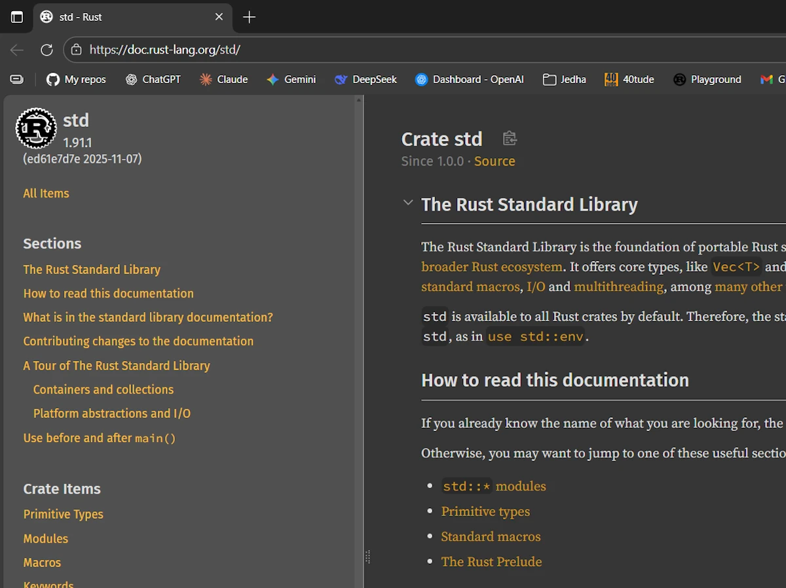<br/>
<span>Click the images to zoom in. The Standard Library Documentation Home Page</span>
</div>

Here's the code we'll be dissecting throughout this guide. Copy it into the [Rust Playground](https://play.rust-lang.org/) or a local file:

```rust
fn main() {
    let numbers = vec![Some(1), Some(15), Some(25), None, Some(5)];

    // Filter keeps only Some(v) where the predicate is true
    let filtered: Vec<Option<i32>> = numbers
        .iter()
        .map(|&opt| opt.filter(|&n| n > 10))
        .collect();

    println!("Raw numbers: {:?}", numbers);
    println!("Filtered   : {:?}", filtered);
}
```

Output:
```
Raw numbers: [Some(1), Some(15), Some(25), None, Some(5)]
Filtered   : [None, Some(15), Some(25), None, None]
```

<div align="center">
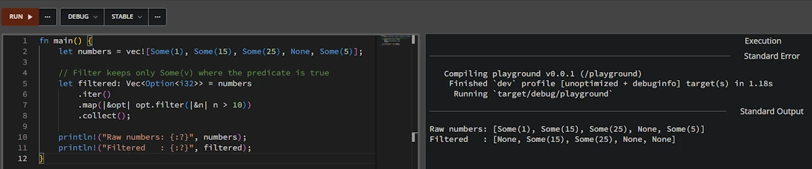<br/>
<span>Run the code in Rust Playground</span>
</div>


Fewer than 10 LOC, but there's *so much* going on here. Let's unpack it all.


<!-- ###################################################################### -->
<!-- ###################################################################### -->
## 🟢 Part 1: Easy — Finding Our Way Around


**Marty:** Okay, I'm looking at this code and I already have questions. What even is `vec!`? Is it a function? Why the exclamation mark? Is it a `not` operator?

**Emmett:** Great first question! The `!` tells you it's a [macro](https://doc.rust-lang.org/book/ch20-05-macros.html), not a function. In Rust, [macros](https://doc.rust-lang.org/stable/reference/macros.html) have that **trailing bang**. Let's find it in the documentation.

**Marty:** Hey Doc, how do I even search for that?

**Emmett:** Two ways. First, the easy way, directly in VS Code.

<div align="center">
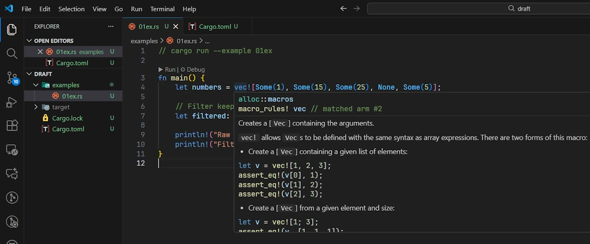<br/>
<span>Getting help in VScode. Again click the images to zoom in and see the tooltip. </span>
</div>

Hover over `vec!` and you'll see a tooltip from rust-analyzer. It'll show you something like:

```
alloc::macros
macro_rules! vec // matched arm #2
Creates a [Vec] containing the arguments.
```

But let's also learn to use the official documents. Go to [doc.rust-lang.org/std](https://doc./rust-lang.org/std/) and use the search bar at the top. Type "vec" and you'll see results. Look for `vec` in the `std` module (aka `std::vec`), select the line that says `macro std::vec`.

<div align="center">
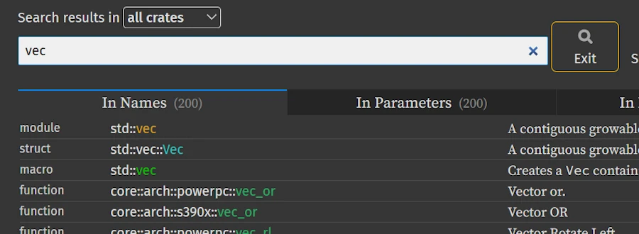<br/>
<span>Searching in the Standard Library</span>
</div>


**Marty:** Found it! [macro std::vec](https://doc.rust-lang.org/std/macro.vec.html). Okay, it says it "creates a `Vec` containing the arguments." Simple enough.

<div align="center">
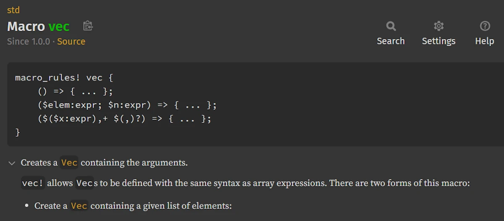<br/>
<span>The Rust documentation page for <code>Macro vec</code></span>
</div>


**Emmett:** See? Not so scary. Now, let's talk about **reading** the docs page structure, because every page follows the same pattern.


<!-- ###################################################################### -->
### Anatomy of a Documentation Page
{: .no_toc }

**Emmett:** Every item in the Standard Library has a documentation page with a consistent structure. Let's look at [`Vec<T>`](https://doc.rust-lang.org/std/vec/struct.Vec.html) as an example.

{: .important-title }
> Side Note:
>
>* On the previous page you can click on any of the links `Vec`.
>* Or better yet, go back to [doc.rust-lang.org/std](https://doc.rust-lang.org/std/), search for `vec` and click on the second item in the list : `struct std::vec::Vec` (not the `macro std::vec` as before)


The top of the page looks like:

<div align="center">
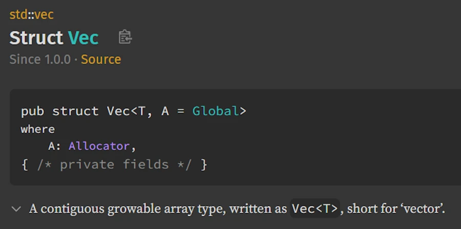<br/>
<span>The Rust documentation page for <code>Struct Vec</code></span>
</div>

At a high level we can identify:

1. **The path** at the top: `std::vec` — this tells us **where** the item lives.
1. **The name**: Struct Vec - Below is a link to the source code and the version in which it was first available.
1. **The declaration**: `pub struct Vec<T, A = Global>` — the actual type definition
1. **Description**: A short description of what it does
1. **Implementations**: The `impl` blocks shows all the methods available.
1. **Methods from Deref`<Target = ???>`**: Types inherit behavior from their deref target. This block shows the methods provided by the dereferenced target types
1. **Trait Implementations**: What traits this type implements (`Clone`, `Debug`, etc.)
1. **Auto Trait Implementations**: Auto traits automatically derived by the compiler
1. **Blanket Implementations**: Traits implemented for all types meeting certain bounds


This said, since we will use the pages of the documentation extensively, it is **IMPORTANT** to feel "at home". So let's take some time to explain with much more details how a typical Rust Standard Library documentation page is designed, and how to navigate it effectively.


<!-- ---------------------------------------------------------------------- -->
#### **Overall Architecture of a Standard Library Documentation Page**
{: .no_toc }

A Standard Library documentation page generated by [rustdoc](https://doc.rust-lang.org/rustdoc/what-is-rustdoc.html) follows a consistent layout designed to make it easy to explore a type, module, trait, or function. While the visual style has evolved over time, the core structure remains stable and predictable.
This is important because once we are comfortable with the documentation of the Standard Library, we will be comfortable with the documentation of any other crate (axum, tokio...).

**0. Buttons**

This is obvious but, too often forgotten, note that 4 buttons are at our disposal on every page.

<div align="center">
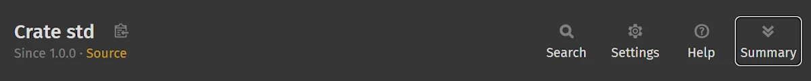<br/>
<span>Buttons available on every page</span>
</div>

Press the `Help` button (or `?`) for example. You will learn some shortcuts. Did you know about `_`? Try them all.

<div align="center">
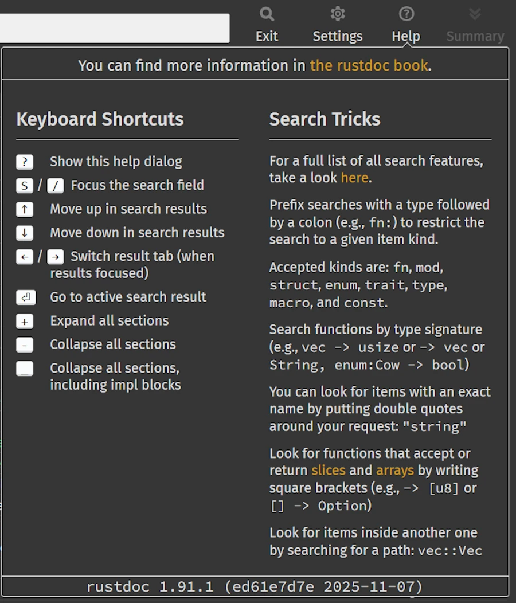<br/>
<span>Help information & keyboard shortcuts</span>
</div>

Press `ESC` to close the Help window then press the `Summary` button (or your new friend `_`) and scroll down the page with the down arrow ⬇️.

<div align="center">
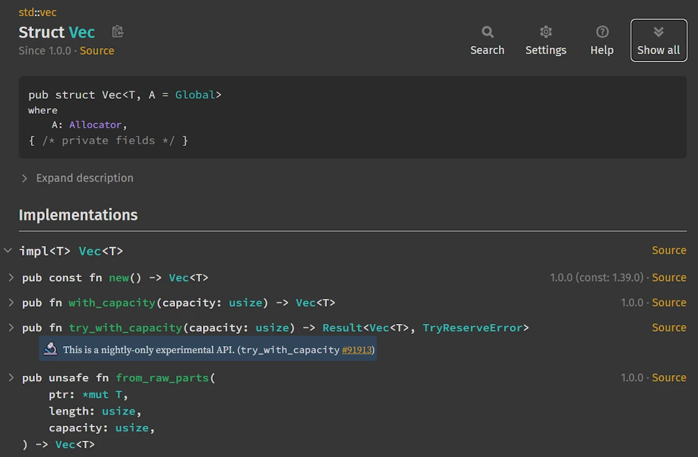<br/>
<span>Summary of the page</span>
</div>

As with your beloved code editor it is important to be able to use the keyboard rather than the mouse if you want to save time, lot of time.


**1. Sidebar Navigation (Left Panel)**

<div align="center">
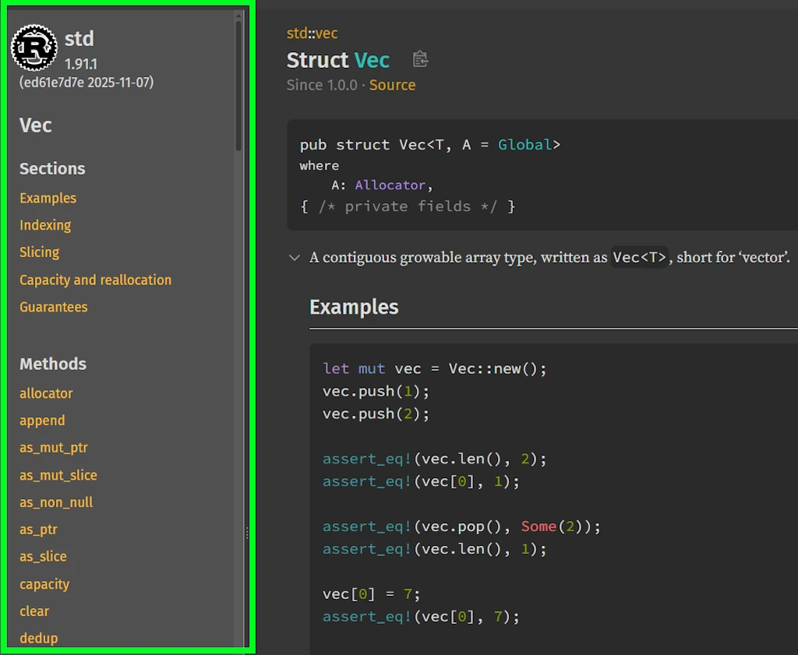<br/>
<span>Sidebar Navigation</span>
</div>


The left sidebar acts as a quick-access navigation menu for the entire page. It lists the major groups of items related to the entity being documented. For a struct like `Vec<T>`, the sidebar typically includes entries such as:

* **Sections** – Links to general page anchors like the description or examples
* **Methods** – All inherent methods and associated functions. Note that on the page, the Implementations block starts with the `.new()` method while on left of the page, in the Methods section the methods are ordered alphabetically.
* **Methods from Deref<Target = [...]>** – Methods inherited through the `Deref` trait
* **Trait Implementations** – All traits implemented by the type
* **Auto Trait Implementations** – Auto traits automatically derived by the compiler
* **Blanket Implementations** – Traits implemented for all types meeting certain bounds

The sidebar allows us to jump directly to the part of the page we’re interested in, without scrolling through complex or long sections. It functions as a table of contents tailored for the type we are viewing.


**2. Main Header and Description**

<div align="center">
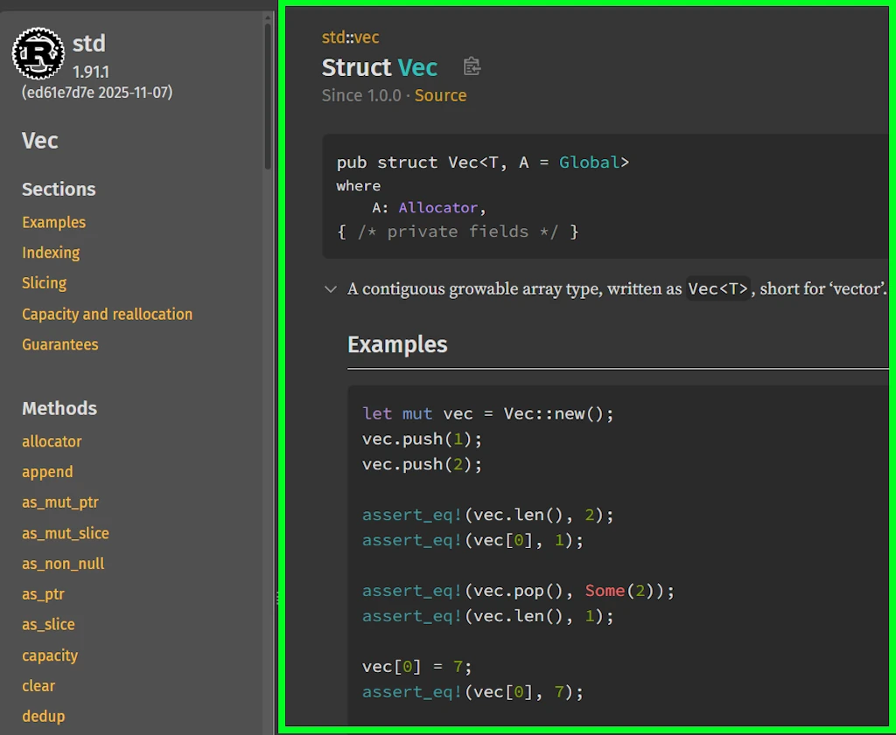<br/>
<span>Main content</span>
</div>

At the top of the main content area (on the right), again, but it does'nt hurt to repeat ourselves, you’ll find:


1. **The path** at the top: `std::vec` — this tells you **where** the item lives.
    * Here it is in the module `std::vec`.
    * Click on the word `vec` in `std::vec` at the very top
    * You will land in the  module `vec` page which belongs to the `std` crate
1. The **type or item name** (e.g., `struct Vec<T>`)
1. **The declaration**: `pub struct Vec<T, A = Global>` — the actual type definition


<!-- 1. **Implementations**: The `impl` blocks showing all the methods available. Note that on the page, the Implementation block starts with the `.new()` method while on left of the page, in the Methods section the methods are ordered alphabetically.
1. **Trait Implementations**: What traits this type implements (`Clone`, `Debug`, etc.) -->


**3. Detailed Description and Examples**

<div align="center">
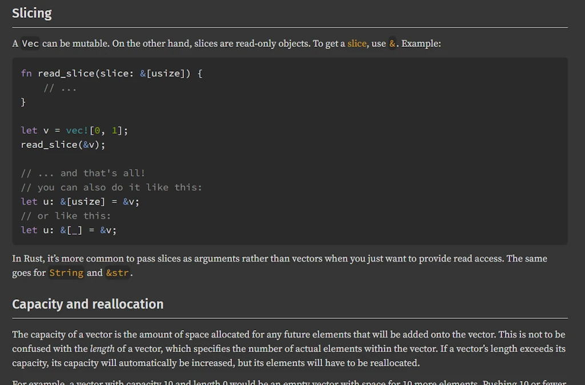<br/>
<span>Main content</span>
</div>


Below the header, many items include a more detailed explanation, design notes, and carefully crafted usage examples. These examples often demonstrate idiomatic ways to use the type and highlight common patterns or pitfalls.

This section can be unfold or fold to quickly access to the Implementations section.


**4. Implementations Section**

<div align="center">
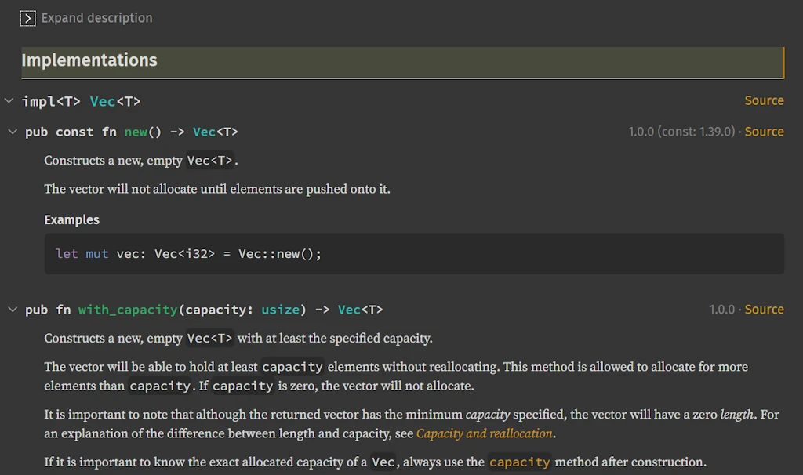<br/>
<span>Implementations section - The description is collapsed</span>
</div>

This is one of the most important parts of the page. The documentation groups methods and associated items by their **impl blocks**, not strictly alphabetically or by category.

Take your time to visit your new home... Scroll down and find out `impl<T> Vec<T>` then continue and find `impl<T, A> Vec<T, A>`... Usually, the first implementation  (`impl<T> Vec<T>` here) is where the core behavior of the type is defined.


<!-- * **Trait implementations** (`impl<T> SomeTrait for Vec<T>`) – grouped separately from inherent methods
* **Associated constants**, **methods**, **types**, or **functions** within those `impls` -->

<!-- This structure reflects the internal organization of actual Rust code and helps readers explore how behaviors are defined. -->


**5. Methods from Deref**

<div align="center">
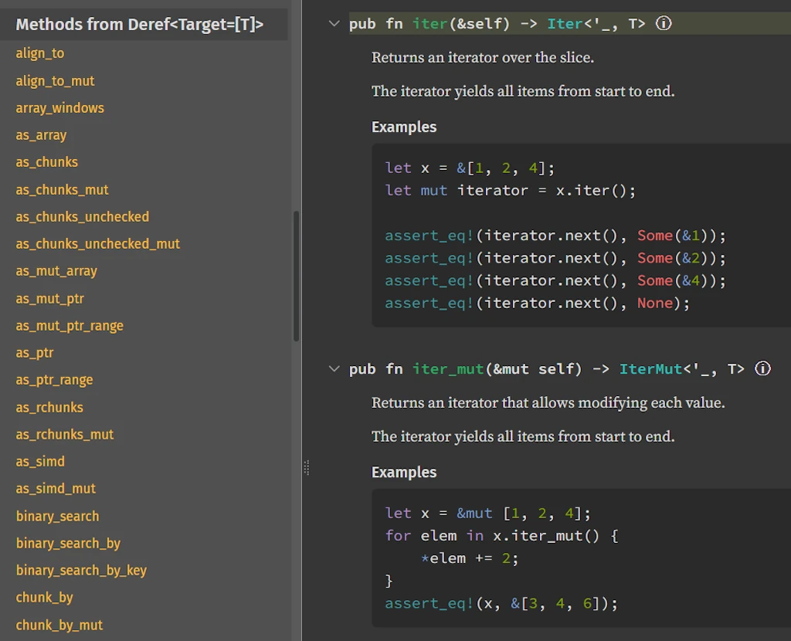<br/>
<span>Methods from Deref for <code>std::vec::Vec</code></span>
</div>

In our case it says `Methods from Deref<Target = [T]>` but obviously this is not always the case. Duplicate the tab in your favorite browser, press `/` (or `s`) to search, type `string`, once the results are displayed, press the down arrow ⬇️, highlight the line `struct std::string::String`, press ENTER, scroll down the sidebar to find the section **Methods from Deref**, it should say : `Methods from Deref<Target = str>`. Don't trust me. Do it and do it now!

<div align="center">
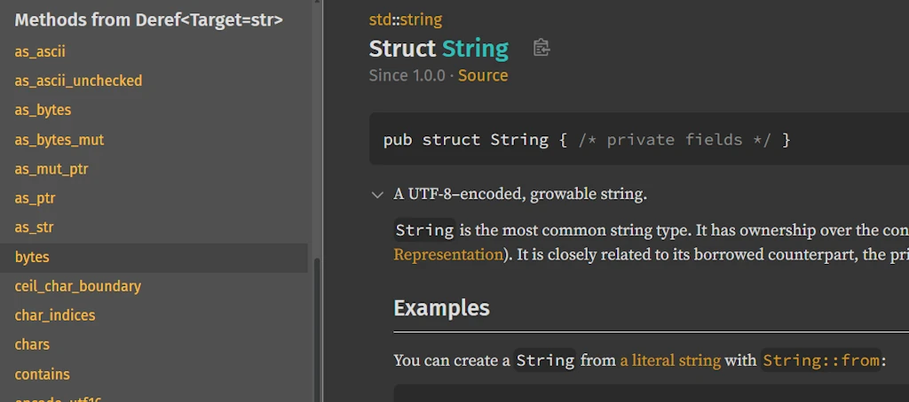<br/>
<span>Methods from Deref for <code>std::string::String</code></span>
</div>


Some types implement the `Deref` trait to behave like another underlying type. When this is the case, the documentation includes a dedicated section listing all methods inherited through dereferencing. These methods are not defined on the type itself but come from the deref target, such as slice methods for `Vec<T>` or string slice methods for `String`. This section is useful when a method cannot be found among the inherent methods, since it may originate from the type’s deref target instead.

**Marty:** And, to take your metaphor, what is the story that the documentation is telling me?

**Emmett:** In the second case it tells you that a `&String` can be used where a `&str` is used. Don't you remember what you **read** in Chap 15 of the TRPL book about the implicit deref coercions: "*Deref coercion* convert a reference to a type that implements the Deref trait into a reference to another type." For example the `String` type does **NOT** have any `.is_ascii()` method but `str` has one. While the tab for `std::String::string` is still available in the brwoser, scroll down the sidebar. Check that there is no `.is_ascii()` method for `String` but one in the section `Methods from Deref<Target = str>`:

<div align="center">
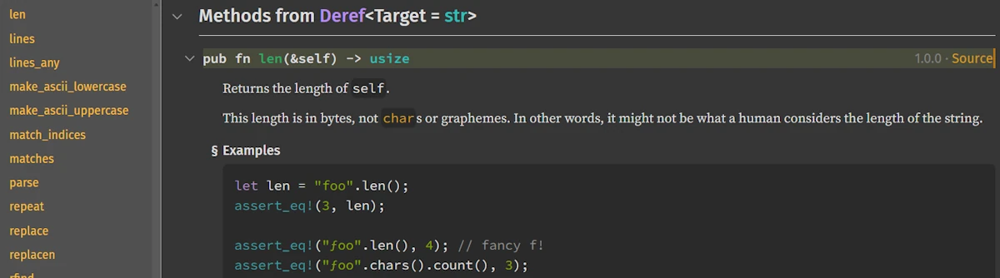<br/>
<!-- <span>.len()  <code>std::string::String</code></span> -->
</div>

Don't trust me, check for yourself and run this code in the playground:

```rust
fn main() {
    let group_01 = "Level 42".to_string();
    let group_02 = "Earth Wind & Fire 🦀".to_string();
    println!("{} is all ascii? {}", group_01, group_01.is_ascii());
    println!("{} is all ascii? {}", group_02, group_02.is_ascii());
}
```

**Marty:** But we are not really using `String` as argument when we invoke `is_ascii()` on `group_01` or `group_02`. Are we?

**Emmett:** I don't know. Check for yourself. What would you do? What can you do to confirm (or not) your assertion?

**Marty:** I know, I **read** the documentation for `.is_ascii()`. Ok... It says...

<div align="center">
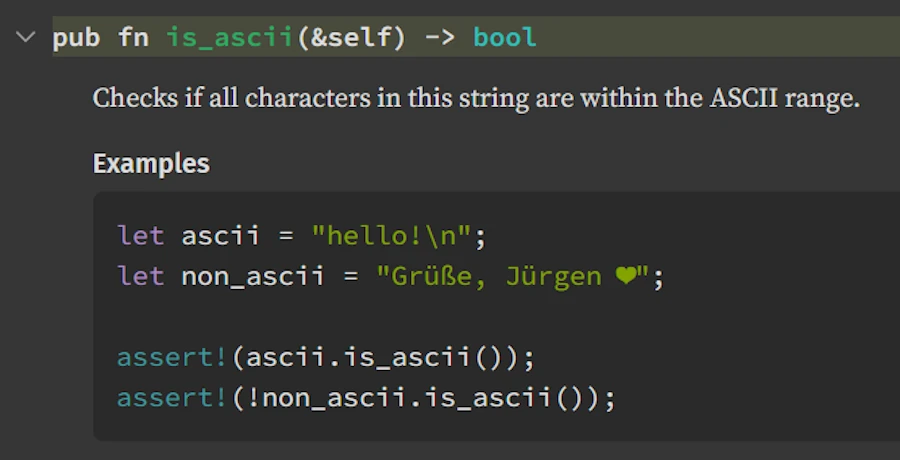<br/>
<!-- <span>.len()  <code>std::string::String</code></span> -->
</div>

"Checks if all characters in this string are within the ASCII range."


**Emmett:** No! This is what you *look at* but this is **NOT** what you should **read**. Again, **read** it aloud from the very beginning, and I want to hear you loud and clear.

**Marty:** Ok.. It says... `pub fn is_ascii(&self) -> bool` meaning that `.is_ascii()` take as first and unique parameter a **reference** to `self`, which means here, a reference to a `str` (`&str`) because we are in the section `Methods from Deref<Target = str>`. At the end it returns a `bool`. Then the text explains "Checks if all characters in this string are within the ASCII range.".

I get it! The key point here is, again, in the method signature which tells us that it is called on a **reference**. So in the code when I write `group_01.is_ascii()`, what actually happens is the following:
1. First, since `is_ascii()` takes `&self` as its parameter, the method call syntax `group_01.is_ascii()` is essentially equivalent to calling `is_ascii(&group_01)`.
1. But wait, `is_ascii()` is a method on `str`, not on `String` so...
1. Rust's **deref coercion** kicks in. Since `String` implements `Deref<Target = str>`, Rust compiler automatically converts `&String` to `&str` for me. So the call effectively becomes `is_ascii(&group_01_as_str)`.
1. This implicit conversion explains why I can call `str` methods directly on a `String` without having to explicitly write `.as_str()` or `&*` everywhere.


**Emmett:** This is why the section `Methods from Deref<Target = ???>` is so **IMPORTANT**. If looking in the documentation you cannot find the method you need, then first thing first, scroll down to the section `Methods from Deref<Target = ???>`.

Last point before we come back to the documentation of `std::vec::Vec`. The deref coercion is **transitive**. This means that if `str` had a section `Methods from Deref<Target = Xyz> ` (which is not the case) then the methods of the type `Xyz` would have been available for `String` type.

You know what? Copy'n paste the code below in Rust Playground then press `CTRL+ENTER`.

```rust
fn main() {
    let bgroup_01 = Box::new(String::from("Kool and the Gang"));
    let bgroup_02 = Box::new(String::from("Earth Wind & Fire 🦀"));

    println!("{} is all ascii? {}", bgroup_01, bgroup_01.is_ascii());
    println!("{} is all ascii? {}", bgroup_02, bgroup_02.is_ascii());
}
```

Here, `bgroup_01` is a `Box<String>`, yet we can call `is_ascii()` directly on it. Rust, at compile time (**NOT** at runtime) follows the deref chain: `Box<String> → String → str`, and finds `.is_ascii()` on `str`. That's what I call transitivity in action.

Now, Marty, give me a favor. Show me how you would trace the deref chain using only the Rust Standard Library documentation.

**Marty:** Well... Here are the steps I would follow:
1. On the tab where the Standard Library page is, press `/` and type `box` or `Box<T>`
    <div align="center">
    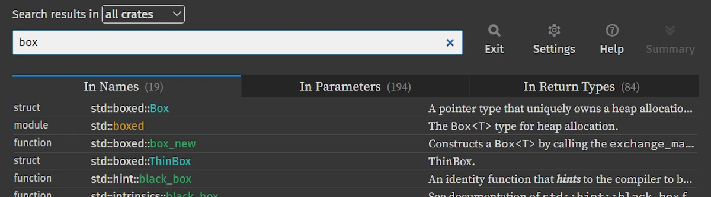<br/>
    <!-- <span>Trait, Auto-Trait, and Blanket Implementations</span> -->
    </div>
1. Navigate with the down arrow ⬇️ and highlight the line `struct std::boxed::Box` then press `ENTER` to land on the page `std::boxed::Box`.
1. I scroll down the sidebar and I look for the section "Trait Implementations" and find `Deref`. I **read** that `Box<T>` implements `impl<T, A> Deref for Box<T, A>`.
    <div align="center">
    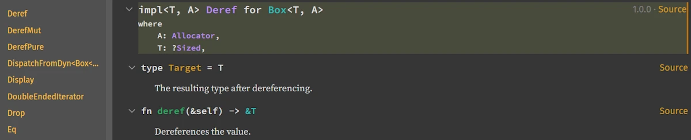<br/>
    <!-- <span>Trait, Auto-Trait, and Blanket Implementations</span> -->
    </div>
    I don't know yet what `A` is (more info later) but **reading** the signature of `deref` I understand that for a `Box<String>`, dereferencing gives me a `&String`.
1. Now I press `/`, type `string`, use the down arrow ⬇️, highlight the line `struct std::string::String`, press `ENTER` to go to the `String` documentation page.
1. Here I realize I have 2 possibilities.
    1. As before, I can scroll down the sidebar and Look for the section `Methods from Deref<Target = str>`, find the `.is_ascii()` method and click on it
    <div align="center">
    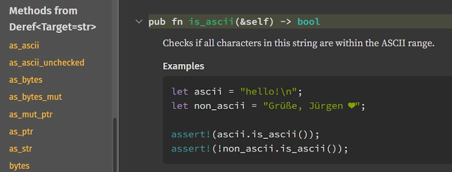<br/>
    <!-- <span>Trait, Auto-Trait, and Blanket Implementations</span> -->
    </div>
    1. Or, I can scroll down the sidebar and look for the section "Trait Implementations" and find `Deref` and click on it. I **read** that `String` implements `Deref<Target = str>`.
    <div align="center">
    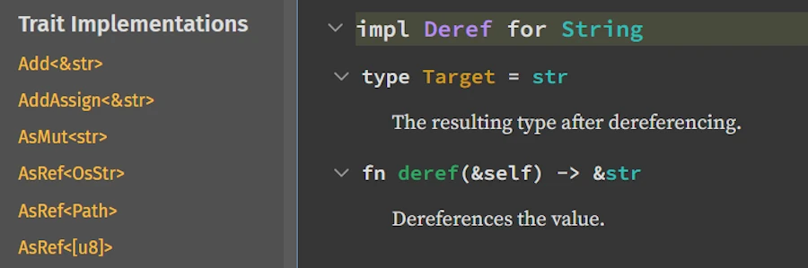<br/>
    <!-- <span>Trait, Auto-Trait, and Blanket Implementations</span> -->
    </div>
    On the line `type Target = str` I click on the word `str` (in green) and I land on the `str` documentation page. In the "Methods" section, I find `is_ascii()`
    <div align="center">
    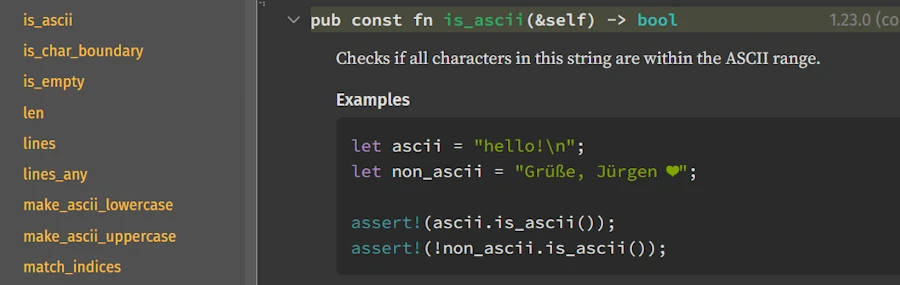<br/>
    <!-- <span>Trait, Auto-Trait, and Blanket Implementations</span> -->
    </div>

That's it, and I guess the summary is: `Box<String>` → `String` → `str` → `is_ascii()`.

Hey Doc, you know what?
1. I feel much more confortable navigating and **reading** the documentation. I know I must **read** from the beginning, check if the parameters are references or not, click here and there and follow the white rabbit, use the keyboard to navigate quickly... Thank you.
2. I understand also why you said before that, for you, the section `Methods from Deref<Target = ???>` is so **IMPORTANT**. I guess this is because deref coercion is a key element of the Rust programming language.


**6. Trait, Auto-Trait, and Blanket Implementations**

<div align="center">
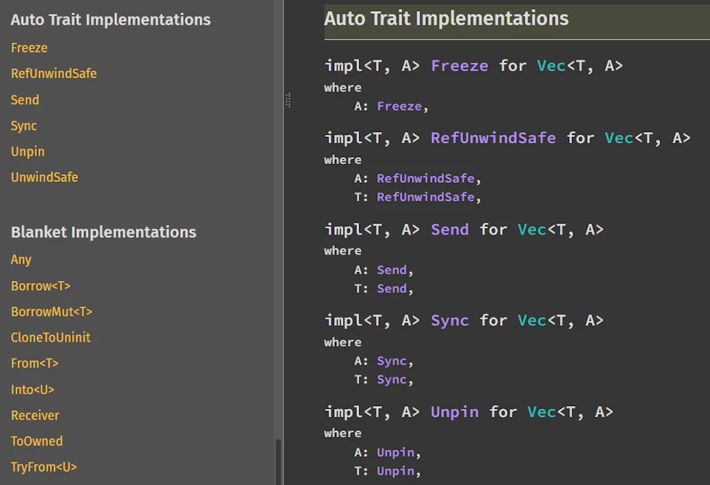<br/>
<span>Trait, Auto-Trait, and Blanket Implementations</span>
</div>

These sections explain:

* **Which traits the type implements**, such as `Clone`, `Debug`, or `Deref`
* **Which auto traits apply**, like `Send` or `Sync`
* **Which blanket implementations exist**, such as `impl<T> FromIterator<T> for Vec<T>`

These sections really help to understand how the type interacts with Rust’s trait system and what behaviors it gains automatically. However, for now, focus on the previous sections, the need to master theses one will come later.


<!-- ---------------------------------------------------------------------- -->
#### **How to Make the Best Use of These Sections**
{: .no_toc }

* **Use the sidebar for quick navigation** when you already know what you’re looking for (e.g., a specific method).
* **Use the Implementations section** to understand *why* a method exists and which impl block provides it. This is especially helpful when generic bounds or trait implementations matter.
* **Check the Methods from Deref section** when a method doesn’t appear among the inherent ones. Again types can inherit behaviors from their deref target, so many methods come from other types such as slices or string slices.
* **Use the Trait Implementations section** to discover what extra capabilities a type has, such as formatting, iteration, conversions, or concurrency support.
* **Use examples and descriptions** to learn idiomatic usage rather than just API details.
* **Use search (`CTRL+F`)** on the page to quickly find method names or trait names when the page is long.


**Marty:** Waouh... This is a lot of information. I did'nt know all that. Hm... Can we go back to the top of the page? What's that `A = Global` thing? I met it already when I checked that `Box<T>` implements `impl<T, A> Deref for Box<T, A>`. Last time I ignored it but here, it comes again...

<div align="center">
<br/>
<span>The Rust documentation page for <code>Struct Vec</code></span>
</div>


**Emmett:** That's a **default type parameter**. It means "if you don't specify an allocator, use `Global`." In everyday code you only write `Vec<T>`, and Rust silently expands it to Vec<T, Global>. You can ignore it 99% of the time. Most people just write `Vec<T>` and never think about custom allocators. However, if a project decides to use a different allocator — for example the `mimalloc` crate — then `Vec` would not use `Global` anymore but `MiMalloc` instead. You can forget it for now and continue as usual.


**Marty:** Okay, noted. So when I see extra type parameters with `= Something`, I can usually ignore them?

**Emmett:** Exactly. They're there for advanced use cases. Focus on the main type parameter first.


<!-- ###################################################################### -->
### Our First Investigation: What Does `.iter()` Returns?
{: .no_toc }


**Marty:** Alright, in the code we have `numbers.iter()`. What does that return? How do I find out?

```rust
fn main() {
    let numbers = vec![Some(1), Some(15), Some(25), None, Some(5)];

    // Filter keeps only Some(v) where the predicate is true
    let filtered: Vec<Option<i32>> = numbers
        .iter()
        .map(|&opt| opt.filter(|&n| n > 10))
        .collect();

    println!("Raw numbers: {:?}", numbers);
    println!("Filtered   : {:?}", filtered);
}
```

**Emmett:** Let's use VS Code first. Put your cursor on `.iter()` and hover over it. Alternatively you can right click on `.iter()` then select **F12** (Go to Definition), or click on it and press **F12** directly.

<div align="center">
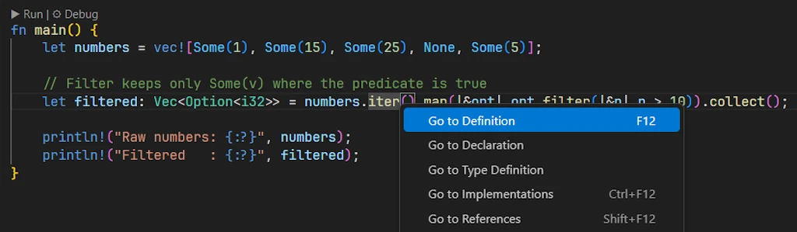<br/>
<span>Right click on <code>.iter()</code></span>
</div>

**Marty:** If I hover over `.iter()` and **read** the content of the IntelliTooltip

<div align="center">
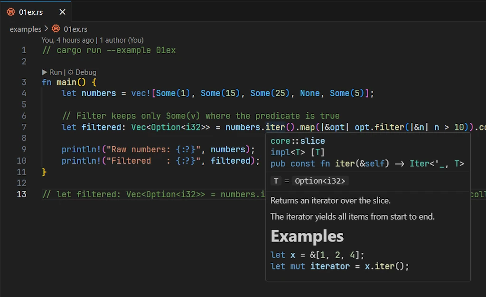<br/>
<span>IntelliTooltip, Intellisense or Hover Information</span>
</div>


It says... `pub const fn iter(&self) -> Iter<'_, T>`. It is always the same thing. It does'nt help at all. What is the `Iter<'_, T>`?


**Emmett:** No! Again, **read** the content! Do **NOT** look at it. Say it aloud from the very beginning, trust me this helps.

**Marty:** Ok... I **read** `core::slice` then `impl<T> [T]` then `pub const fn iter(&self) -> Iter<'_, T>` and finally `T = Option<i32>`. I guess there is a bug somewhere: we lost the vector and we get a slice instead...


<!-- this is again a consequenceYou heard about it when you read TRPL book in Chapters 4, 8 and 15.  -->
<!-- Do you remember what you learn in TRPL book about `&String` and `&str`? No? I guess you know what to read tonight in your bed... -->

**Emmett:** Ah! That's much better. No, this is not a bug, this is the expression of a feature and a great feature of the language, if you ask me. We already talked about it. Yes, I talk again about our friend deref coercion. Anyway, let me explain what you just **read**:
* Line 1: `core::slice`
    * Module location: The method `.iter()` which will be invoked is defined in the module `core::slice`. The Rust Standard Library's slice implementation.
* Line 2: `impl<T> [T]`
    * Implementation block. This is an implementation of methods for the slice `[]` containing things of type `T`, aka `[T]`.
    * **Read** it as: "implementation of generic type parameter `T` for slice of `T`". This means the `.iter()` method is defined on the slice type itself, not on `Vec!`.
* Line 3: `pub const fn iter(&self) -> Iter<'_, T>`
    * This is the method signature
    * `pub`: publicly accessible
    * `const fn`: can be called in constant contexts (more on this later)
    * `&self`: takes a **reference** to the slice
    * `-> Iter<'_, T>`: returns an iterator over type `T` with an elided lifetime (`'_`)
* Line 4: `T = Option<i32>`
    * Type substitution. In our specific case, the generic `T` has been substituted with `Option<i32>`
    * This shows what concrete type is being used in our particular call

The story told in these four lines is as follows: "This is the `iter()` method from the `core::slice` module, implemented on the slice type [T]. In your code, `T` is `Option<i32>`, so you're calling `.iter()` on a slice of `Option<i32>` (i.e., `[Option<i32>]`), which returns an `Iter<'_, Option<i32>>`."


**Marty:** And this is exactly what usually happens. It does'nt help at all because at the end of the day the question remains: What is `Iter<'_, T>`?

**Emmett:** I disagree, you've made progress since now you know that the `.iter()` is **NOT** applied over a vector but over a slice and you understand that you will get `Iter<'_, Option<i32>>`. Not that bad I you realize that, so far, you just moved the mouve over `.iter()`.


**Marty:** Ok... But, sorry to insist, what is `Iter<'_, T>` and what I'm suppose to do now?

**Emmett:** Here is <span style="color:orange"><b>THE trick of the day</b></span>. Move the cursor over `.map()` and **read** the tooltip.

<div align="center">
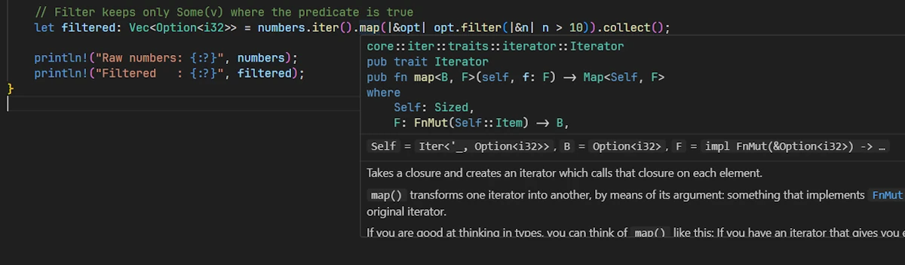<br/>
<!-- <span>Click the link <code>Iter</code> at the bottom of the tooltip</span> -->
</div>


**Marty:** Your wish is my command. I **read**

* **Line 1:** `core::iter::traits::iterator::Iterator`. This tells us we're looking at documentation for the `map` method from the `Iterator`. At this point, I'm not sure to know what is an `Iterator`. However I know it is one of the core element of the Rust language since it is available "before" (or outside) the `std` crate... Anyway, the full path shows it's in the core library, under iter, then traits, then iterator. On the Standard Library documentation home page, `core` is at the same level than `std`. Theses are 2 different beasts.

<div align="center">
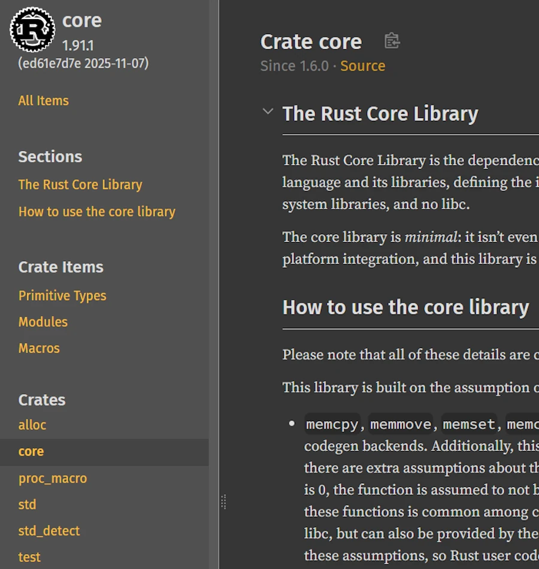<br/>
<!-- <span>Click the link <code>Iter</code> at the bottom of the tooltip</span> -->
</div>

* **Line 2:** `pub trait Iterator`. Now I now. `Iterator` is a trait, not a struct or a concrete type. This is the actual trait declaration. It's public, meaning I can use it in my code. All types that implement this trait get access to its methods, including `map`.
* **Line 3:** `pub fn map<B, F>(self, f: F) -> Map<Self, F>`. This is the method signature. Breaking it down it comes:
    - `pub fn map` means it's a public function called `map`

At this point, the rest looks to me like Klingon.


<!--

**Line 3:** `pub fn map<B, F>(self, f: F) -> Map<Self, F>`. This is the method signature. Breaking it down it comes:
    - `pub fn map` means it's a public function called `map`
    - `<B, F>` introduces two generic type parameters:
        - `B` is the type that our closure will return
        - `F` is the type of the closure itself
    - `(self, f: F)` shows it takes two parameters:
    - `self` - the iterator itself, taken by value (so we consume the iterator when we call `map`)
    - `f` - a closure of type `F`
    - `-> Map<Self, F>` shows it returns a `Map` struct that wraps our original iterator and the closure. This `Map` is itself an iterator that produces transformed values."

**Line 4: `where`**
> "The `where` clause is about to list the constraints or requirements for our generic types."

**Line 5: `Self: Sized,`**
> "This requires that the implementing type has a known size at compile time. Most iterators are sized, so this is usually automatically satisfied."

**Line 6: `F: FnMut(Self::Item) -> B,`**
> "This is the crucial constraint! It says:
> - `F` must implement `FnMut` - meaning it's a closure that can be called mutably (it might need to mutate its captured environment)
> - It takes `Self::Item` as input - that's the type of item our iterator produces
> - And returns `B` - our output type
> In plain English: the closure must accept one item from the iterator and return something of type `B`."


-->


**Emmett:** That's OK. What do you keep in mind? What `.map()` expects to act on?

**Marty:** I understand `.map()` act on a iterator. According to the text it even transforms one iterator into another one. Ah OK, I get it. Since `.map()` expect an `Iterator` I need to check that the `Iter<'_, Option<i32>>` implement the Iterator trait and if so, **read** what it yields.

So I go on the page with the Standard Library documentation, press `/`, type `Iter`, select the `std::slice::Iter`, press `ENTER`

<div align="center">
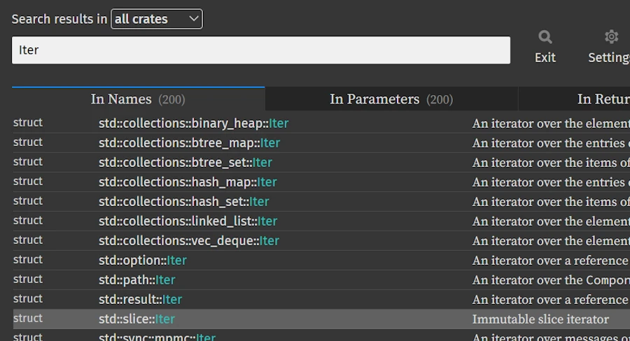<br/>
<!-- <span>Click the link <code>Iter</code> at the bottom of the tooltip</span> -->
</div>


In the side bar of the `std::slice::Iter`, I find the `Trait Implementations` section. Tadaa! The struct implement the `Iterator` trait and the type of the item it iterates over is `&a' T`. So in my case it will return `&Option<i32>`.

<div align="center">
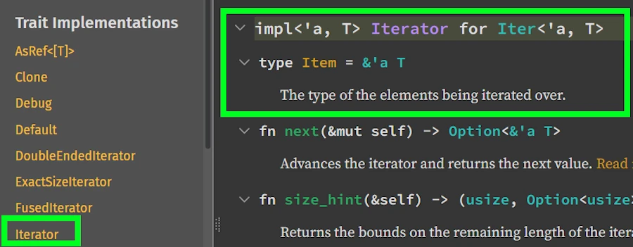<br/>
<!-- <span>Click the link <code>Iter</code> at the bottom of the tooltip</span> -->
</div>


**Emmett:** Well done Sherlock! This concludes our first investigation. Yes, in our code `.iter()` yields `&Option<i32>`.

Before we move on I would like to emphasis how important the "trick of the day" is important and help you start thinking like a compiler...


<!-- ###################################################################### -->
### How the Rust Compiler Reads Our Code: A Dance Between Both Directions
{: .no_toc }

When we look at a chain of method calls like:
```rust
numbers.iter().map(|&opt| ...)
```

We might wonder: does the compiler read left-to-right or right-to-left? The answer is **it performs a sophisticated dance between both directions**, and understanding this can help us debug type errors.

#### **The Two-Phase Analysis**
{: .no_toc }

**Phase 1: Left-to-right type propagation (the "what do we have?")**

```rust
numbers.iter() -> returns Iter<'_, Option<i32>>
```

At this point, the compiler knows:
- `numbers` is a `Vec<Option<i32>>`
- `.iter()` on a `Vec<T>` returns `std::slice::Iter<'_, T>`
- So we have an `Iter<'_, Option<i32>>`

**Phase 2: Right-to-left constraint checking (the "what do we need?")**
```rust
.map(|&opt| ...) <- needs an Iterator
```
Now the compiler checks:
- `.map()` is a method of the `Iterator` trait
- Does `Iter<'_, Option<i32>>` implement `Iterator`?
- Yes! Because `Iter` has `impl<'a, T> Iterator for Iter<'a, T>`


#### **A Mental Model for Compiler Thinking**
{: .no_toc }

I like to imagine the compiler having an internal conversation: "I see `.map()` being called. `.map()` requires an `Iterator`. Let me check what's to the left... Ah, it's `numbers.iter()` which returns `Iter`. Does `Iter` implement `Iterator`? *Checks trait implementations* Yes! Perfect match."

Or in flowchart form:

```
[.map() needs Iterator] ← checks → [numbers.iter() returns Iter]
              ↑                                    ↑
         "I need this"                      "I provide this"
              ↓                                    ↓
         [Trait constraint] ← matches → [Trait implementation]
```


#### **A Concrete Example of This Dance**
{: .no_toc }

Consider this slightly problematic code:

```rust
let numbers = vec![1, 2, 3];
let result = numbers.iter().map(|x| x * 2).collect();
// Error: type annotations needed
```

Here's what happens:

1. **Left-to-right**: `numbers.iter()` → `Iter<'_, i32>`
2. **Left-to-right**: `.map(|x| x * 2)` → `Map<Iter<'_, i32>, Fn>`
3. **Right-to-left**: `.collect()` ← needs to know what to collect into
4. **Stalemate!** The compiler can't infer the collection type

The fix requires either:
- Left-to-right clue: Add type annotation
- Right-to-left clue: Use **turbofish**: `.collect::<Vec<_>>()`


#### **Why This Matters for Learning**
{: .no_toc }

Understanding this bidirectional analysis helps you:

1. **Decode error messages better**: When Rust says "expected X, found Y", it's often because the left-to-right and right-to-left analyses didn't match up.
2. **Write clearer code**: Sometimes adding a type annotation "in the middle" helps both directions meet:
   ```rust
   let filtered: Vec<_> = numbers.iter().map(...).collect();
   // The annotation helps `.collect()` know what to produce
   ```
3. **Appreciate Rust's type inference**: It's not just "guess what I mean" – it's a systematic process of matching constraints.


#### **Visual Metaphor**
{: .no_toc }

Think of it like two people building a bridge from opposite sides of a river:
- **Left side builder** (your code's beginning): "I'm starting with `numbers.iter()`"
- **Right side builder** (your code's end): "I need to end with something collectible into `Vec<Option<i32>>`"
- **Middle pieces** (method chains): Must connect both sides properly
- **Compiler**: The engineer checking that all pieces align perfectly


#### **Do you remember the time (MJ, 1992)**
{: .no_toc }

Remember math tests in school? In the problem set there was always one or two questions that were easier than the others. Typically you'd be asked: Verify that `x=42`. That was cool because you knew that as soon as you found that result you could move on to the next question. In fact, what really helped us was that, like here, we already knew the answer. You had to figure it out however you wanted, but you had to find `x=42`. Here, checking what `.map()` expects plays a similar role. We then know the result. All we have to do is figure out how we want (deref coercion) to get there. Anyway, you get the idea...


<!-- ###################################################################### -->
### Quick Reference: Your Toolbox So Far
{: .no_toc }

| Tool | What It Does | Shortcut |
|------|--------------|----------|
| Hover | Shows type info and brief docs | Mouse hover |
| Go to Definition | Jumps to source/declaration | F12 or Ctrl+Click |
| Search on docs.rust-lang.org | Find any std item | Use search bar |
| "Methods from Deref" section | Find inherited methods | Scroll down on documentation page |

* Keep in mind the "left to right" and "right to left" way of reading code.


<!-- ###################################################################### -->
### Exercise 00 — Basic Navigation
{: .no_toc }

<!-- **Objective:** Get comfortable with basic documentation navigation -->

Given the following code:
```rust
fn main() {
    let text = String::from("Hello Rust");
    let uppercase = text.to_uppercase();
    println!("{}", uppercase);
}
```

**Tasks:**
1. Use the std documentation to find the `.to_uppercase()` method. On which type is it actually defined? (Hint: check which section it appears in for `String`)
2. **Read** its complete signature. What type does it return?
3. Does this method take `self`, `&self`, or `&mut self`? What does this mean for `text` after the call?

<!-- **What you'll learn:** Basic navigation, understanding "Methods from Deref" sections, reading simple signatures -->


<!-- ###################################################################### -->
### Exercise 01 — Following Deref Chains and Traits
{: .no_toc }

<!-- **Objective:** Follow Deref chains and understand traits -->

Given the following code:
```rust
fn main() {
    let numbers = vec![1, 2, 3, 4, 5];
    let sum: i32 = numbers.iter().sum();
    println!("Sum: {}", sum);
}
```

**Tasks:**
1. Use VS Code (hover + F12) and the documentation to trace the complete path:
   - What exactly does `.iter()` return? (full type with lifetime)
   - On which trait is the `.sum()` method defined?
   - Verify that the type returned by `.iter()` actually implements that trait
2. In the `.sum()` signature, what does `Self::Item` mean?
3. Bonus: Why can we call `.iter()` on a `Vec` when it's actually a slice method?

<!-- **What you'll learn:** Following Deref coercions, understanding traits, reading associated types -->


<!-- ###################################################################### -->
### Exercise 02 — Complex Signatures with Where Clauses
{: .no_toc }

<!-- **Objective:** Dissect complex signatures with where clauses and closures -->

Given the following code:
```rust
fn main() {
    let words = vec!["rust", "is", "awesome"];
    let lengths: Vec<usize> = words
        .iter()
        .map(|w| w.len())
        .collect();
    println!("{:?}", lengths);
}
```

**Tasks:**
1. **Read** the complete signature of `.map()` in the documentation (including the where clause)
   - How many generic parameters does it have?
   - What does `FnMut(Self::Item) -> B` mean?
   - Why does it take `self` and not `&self`?
2. Trace the types through the chain:
   - Exact type returned by `.iter()`: ______
   - Type of `Self::Item` for this iterator: ______
   - Type `B` in our case (what the closure returns): ______
   - Type returned by `.map()`: ______
3. **Read** the signature of `.collect()`. Why do we sometimes need to explicitly annotate the type `Vec<usize>`?

<!-- **What you'll learn:** Reading complex signatures, understanding closure traits (FnMut), following type transformations -->


<!-- ###################################################################### -->
### Exercise 03 — Autonomous Investigation (Bonus)
{: .no_toc }

<!-- **Objective:** Put everything together with autonomous investigation -->

Here's some code that doesn't compile:
```rust
fn main() {
    let data = vec![Some(1), None, Some(3)];
    let filtered: Vec<i32> = data
        .iter()
        .filter(|x| x.is_some())
        .collect();
}
```

**Tasks:**
1. Without compiling, use **only the documentation** to explain why this code doesn't compile
2. Find at least 2 different solutions by navigating the docs (hints: look at `.flatten()`, `.filter_map()`, or pattern matching in the closure)
3. For each solution, explain the type transformations at each step

<!-- **What you'll learn:** Autonomous investigation, solving real problems, mastering documentation navigation -->


<!-- ###################################################################### -->
<!-- ###################################################################### -->
## 🔵 Part 2: Intermediate — Generics and Trait Bounds


<!-- ###################################################################### -->
### The Map Method: Our First Generic Signature
{: .no_toc }

**Marty:** Okay, next up is `.map()`. Let me hover over it...

<div align="center">
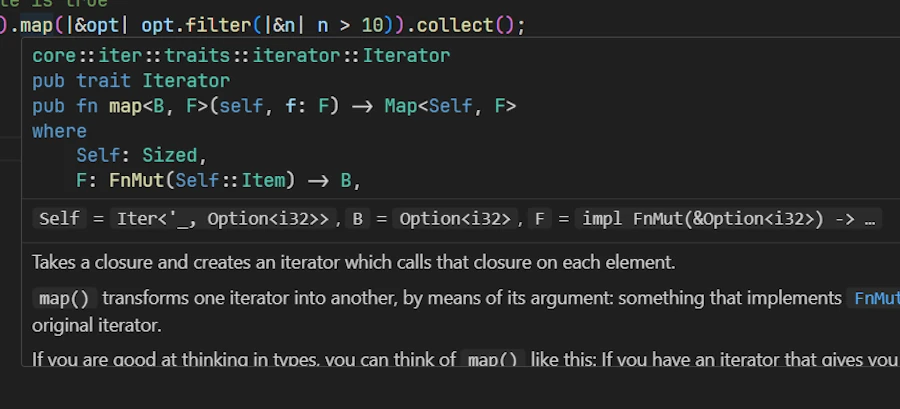<br/>
<!-- <span>Click the link <code>Iter</code> at the bottom of the tooltip</span> -->
</div>


```rust
core::iter::traits::iterator::Iterator
pub trait Iterator
pub fn map<B, F>(self, f: F) -> Map<Self, F>
where
    Self: Sized,
    F: FnMut(Self::Item) -> B,
Self = Iter<'_, Option<i32>>, B = Option<i32>, F = impl FnMut(&Option<i32>) -> ...
```


Hmm, Emmett... What is all this?


**Emmett:** Now we're getting somewhere! You already commented the first 2 lines. I will not repeat what you said. Let's break down the signature piece by piece.

```rust
pub fn map<B, F>(self, f: F) -> Map<Self, F>
```

This declares a method called `map` with:
- **Two type parameters**: `B` and `F` (in the angle brackets)
- **Takes ownership of self**: that's the `self` (not `&self`)
- **Takes a parameter `f`** of type `F`
- **Returns** `Map<Self, F>` — a new iterator type


**Marty:** What are `B` and `F`? Like, what do those letters mean?

**Emmett:** They're **generic type parameters** — placeholders for actual types. The letters are conventional:
- `T` = "Type" (the main/default generic)
- `B` = often "B" as in "the type we're mapping *to*" (think: A → B)
- `F` = "Function" (for closures/function parameters)
- `E` = "Error"
- `K`, `V` = "Key", "Value" (for maps)


**Marty:** And why `B` and `F` are between brakets? What do they do there?

**Emmett:** In you own code, when you use a variable you need to declare it, you need to introduce it. Here, this is the same thing but at a higher level. Before to use a type parameter we need to declare it before we can use it.

This is important but you know what? What really matters is the **constraints** that the `where` clause put on the type parameters.


<!-- ###################################################################### -->
### Understanding `where` Clauses
{: .no_toc }

**Emmett:** Now look at the `where` clause:

```rust
where
    F: FnMut(Self::Item) -> B,
```

This says: "`F` must implement `FnMut(Self::Item) -> B`."

In plain English: "The function `f` must be something callable that:
- Takes one argument of type `Self::Item` (whatever the iterator yields)
- Returns something of type `B`
- Can be called multiple times (and might mutate its environment — that's what `Mut` means)"


**Marty:** What's `Self::Item`?

**Emmett:** `Self` refers to the type implementing this trait (in our case, `Iter<'_, Option<i32>>`). And `Item` is an **associated type** of the `Iterator` trait — it's the type of elements the iterator produces.

For our `Iter<'_, Option<i32>>`, the `Item` type is `&Option<i32>` — a reference to each element.


**Marty:** Wait, a **reference**? Not the actual `Option<i32>`?

**Emmett:** Right! Because `.iter()` **borrows** the collection. It gives you references (`&Option<i32>`) not owned values (`Option<i32>`). Now, let's look at that line:

```rust
.map(|&opt| opt.filter(|&n| n > 10))
```

The `|&opt|` uses **pattern matching** in the closure parameter. It says "take the reference, dereference it, and bind the result to `opt`." So `opt` is `Option<i32>`, not `&Option<i32>`.

**Marty:** Could I also write `|opt| (*opt).filter(...)`?

**Emmett:** Absolutely! Or even `|opt| opt.filter(...)` because of auto-deref. But for `Copy` types like `Option<i32>`, the `|&opt|` pattern is common and clean.


<!-- ###################################################################### -->
### The Three Fn Traits: `Fn`, `FnMut`, `FnOnce`
{: .no_toc }

**Marty:** You mentioned `FnMut`. On the other hand I also **read** about `Fn` and `FnMut`. What's the difference between `Fn`, `FnMut`, and `FnOnce`?

**Emmett:** Great question. These are the three closure traits:

| Trait | Can call... | Can mutate captured vars? | Can consume captured vars? |
|-------|-------------|---------------------------|----------------------------|
| [`Fn`](https://doc.rust-lang.org/std/ops/trait.Fn.html) | Multiple times | No | No |
| [`FnMut`](https://doc.rust-lang.org/std/ops/trait.FnMut.html) | Multiple times | Yes | No |
| [`FnOnce`](https://doc.rust-lang.org/std/ops/trait.FnOnce.html) | Once | Yes | Yes |

There's a hierarchy: `Fn` implies `FnMut`, which implies `FnOnce`. So if something requires `FnOnce`, you can pass any closure. If it requires `Fn`, you need a closure that doesn't mutate anything.

**Marty:** So `.map()` uses `FnMut` because it calls the closure multiple times (once per element I suspect), and the closure *might* need to mutate some state?

**Emmett:** Exactly! Even if your specific closure doesn't mutate anything, `.map()` is *designed* to accept closures that could. It's being flexible.


<!-- ###################################################################### -->
### Reading the `Option::filter` Signature
{: .no_toc }

**Marty:** Now let's tackle the scary one. The `filter` method on `Option`. Here's what the docs show:

<div align="center">
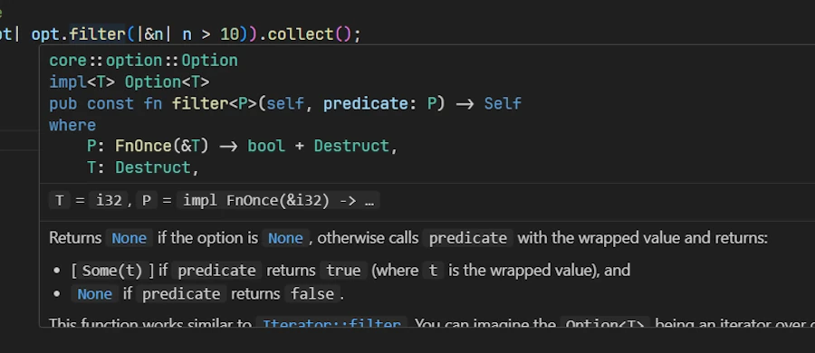<br/>
<!-- <span>Click the link <code>Iter</code> at the bottom of the tooltip</span> -->
</div>


```rust
core::option::Option
impl<T> Option<T>

pub const fn filter<P>(self, predicate: P) -> Self
where
    P: FnOnce(&T) -> bool + Destruct,
    T: Destruct,
```

Using the Standard Library documentation web page I make sure to filter the results and to restrict them to the crate `core`

<div align="center">
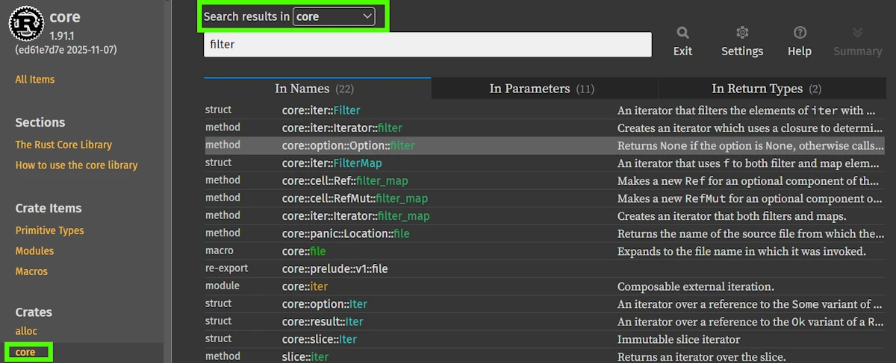<br/>
<!-- <span>Click the link <code>Iter</code> at the bottom of the tooltip</span> -->
</div>

If I click, I realize that the documentation slightly differs from what I can see int the code. For example `const` had been lost.

<div align="center">
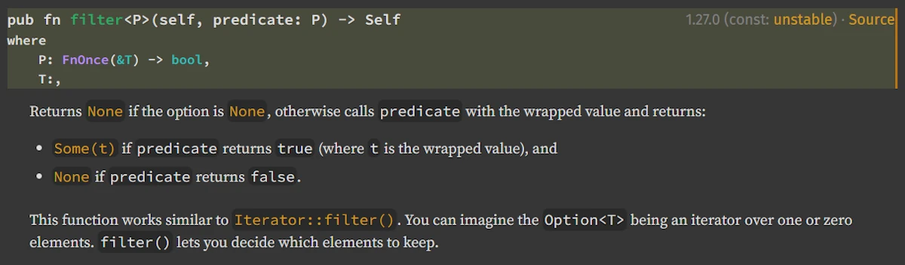<br/>
<!-- <span>Click the link <code>Iter</code> at the bottom of the tooltip</span> -->
</div>

Hey doc, do you know why?

**Emmett:** You are right and this is OK. In fact, Rust’s standard documentation often displays simplified function signatures, which is why `Option::filter` in the docs appears as a regular `fn` even though the source code defines it as a `const fn`. When browsing Rust’s source code (for example through an IDE with “Go to Definition”), you see the full internal version, including `pub const fn`, compiler attributes like `rustc_const_unstable`, and `[const]` trait bounds such as `[const] FnOnce`. These details are intentionally hidden in the public documentation because they are implementation-specific, may still be unstable, and would make the API harder to read. In short: the web documentation shows the stable, user-facing API, while the source reveals the full compiler-level definition.

Now, let's go line by line.

**Line 0: `core::option::Option`**
Easy. You already know. This is **where** the item lives, in the crate `core` in the module `option::Option`.


**Line 1: `impl<T> Option<T>`**

This tells you **where** this method is **defined**. It's in an `impl` block for `Option<T>`. As you know, now, the `<T>` means this works for any type `T` inside the `Option`.

**Line 2: `pub const fn filter<P>(self, predicate: P) -> Self`**

- `pub`: This method is public
- `const fn`: Can be called in **const contexts** (compile-time evaluation) — you can usually ignore this
- `filter<P>`: Method named `filter` with one type parameter `P`
- `(self, predicate: P)`: Takes ownership of `self` and a  [`predicate`](#predicates) of type `P`
- `-> Self`: Returns the same type (`Option<T>`)

**Marty:** Wait, it takes `self` not `&self`? So it **consumes** the `Option`?

**Emmett:** Yes! Check the signature. When a method takes `self`, it takes ownership. That's why this works:

```rust
opt.filter(|&n| n > 10)  // opt is moved into filter
```

If `opt` were `&Option<i32>`, you couldn't call `filter` directly. You would need to clone or copy first. But since `Option<i32>` is `Copy` (because `i32` is `Copy`), the compiler handles this automatically for you.

**Lines 3-4: The `where` clause**

```rust
where
    P: FnOnce(&T) -> bool + Destruct,
    T: Destruct,
```

Let's parse `P: FnOnce(&T) -> bool + Destruct`:

- `P` must implement `FnOnce(&T) -> bool` — a function taking `&T` and returning `bool`
- `+ Destruct` — AND it must implement `Destruct`

**Marty:** What the heck is `Destruct`? I've never seen that.

**Emmett:** `Destruct` is a trait used for **const evaluation**. It basically means "this type can be dropped in a const context." For normal runtime code, **you can completely ignore it**. It's automatically implemented for pretty much everything.

When you see bounds like `Destruct`, `Sized`, or `Unpin`, and you're not doing advanced stuff (`const generics`, `custom DSTs`, `async`...), you can usually skip over them.

**Marty:** So practically speaking, the signature just tells "give me a function that takes a reference to the inner value and returns bool"?

**Emmett:** Exactly and this is one way to describe a predicate. Now, the `filter` method:
1. If `self` is `None`, returns `None`
2. If `self` is `Some(v)`, calls `predicate(&v)`
   - If true, returns `Some(v)`
   - If false, returns `None`

**Marty:** Oh! So in our code, `Some(1).filter(|&n| n > 10)` returns `None` because 1 is not greater than 10. And `Some(15).filter(|&n| n > 10)` returns `Some(15)`.

**Emmett:** You've got it!


<!-- ###################################################################### -->
### The Three Versions Explained
{: .no_toc }

**Marty:** The original code has three "same thing" versions:

```rust
// V1
.map(|&opt| opt.filter(|&n| n > 10))

// V2
.map(|opt| opt.filter(|&n| n > 10))

// V3
.map(|opt| opt.filter(|n| *n > 10))
```

What's the difference?

**Emmett:** They're all equivalent! Let me explain:

**V1:** `|&opt|`. We already talked about it. Destructure the reference immediately. `opt` is `Option<i32>`.

**V2:** `|opt|` — `opt` is `&Option<i32>`, but thanks to `Deref` coercion and the fact that `Option<i32>` is `Copy`, calling `.filter()` works seamlessly. Rust is smart enough to copy the value when needed.

Actually, wait, let me be more precise. In V2, `opt` is `&Option<i32>`. When you call `opt.filter(...)`, Rust sees that `filter` takes `self` (ownership), but you have a reference. Since `Option<i32>` is `Copy`, Rust automatically copies it. This is called **auto-deref** combined with **implicit copying**.

**V3:** `|opt|` same as V2, but inside the inner closure: `|n|` where `n` is `&i32`, and you manually dereference with `*n > 10`.

The Rust compiler is incredibly helpful here. All three work because of:
- Auto-deref: automatically dereferencing when needed
- Copy semantics: `i32` and `Option<i32>` are `Copy`, so they get copied instead of moved
- Pattern matching: `|&x|` destructures references in closures


<!-- ###################################################################### -->
### Exercise 00 - Reading and Understanding a Generic Function Signature
{: .no_toc }

Consider the code below:

```rust
fn apply_twice<T, F>(value: T, func: F) -> T
where
    F: Fn(T) -> T,
{
    // Apply the function twice
    func(func(value))
}

fn main() {
    // Example 1: Double a number twice (x4)
    let result = apply_twice(5, |x| x * 2);
    println!("5 doubled twice: {}", result); // 20

    // Example 2: Add 10 twice
    let result = apply_twice(100, |x| x + 10);
    println!("100 + 10 + 10: {}", result); // 120

    // Example 3: With a String
    let result = apply_twice(String::from("Hello"), |s| s + "!");
    println!("String result: {}", result); // Hello!!
}
```

1. **Read the signature** (use hover in VS Code or the std docs) and explain:
   * The role of `T`
   * The role of `F`
   * Why the constraint `F: Fn(T) -> T` is required
2. Why is the function `func` allowed to be called twice?
3. Write two example calls:
   * one with an `i32`
   * one with a `String` (note: `String` does not implement `Copy`)


<!-- ###################################################################### -->
### Exercise 01 - Understanding the Predicate in `Option::filter`
{: .no_toc }


```rust
fn keep_even(opt: Option<i32>) -> Option<i32> {
    opt.filter(|n| n % 2 == 0)
}

fn main() {
    // Test with an even number
    let even = Some(42);
    println!("keep_even(Some(42)): {:?}", keep_even(even)); // Some(42)

    // Test with an odd number
    let odd = Some(7);
    println!("keep_even(Some(7)): {:?}", keep_even(odd)); // None

    // Test with None
    let none: Option<i32> = None;
    println!("keep_even(None): {:?}", keep_even(none)); // None

    // Test with zero (even)
    let zero = Some(0);
    println!("keep_even(Some(0)): {:?}", keep_even(zero)); // Some(0)

    // Test with negative even
    let neg_even = Some(-4);
    println!("keep_even(Some(-4)): {:?}", keep_even(neg_even)); // Some(-4)
}
```

1. **Read and explain the `Option::filter` signature**:
   * Why does it take **self** (not `&self`)?
   * What does `P: FnOnce(&T) -> bool` mean?
2. Why does the closure `|n| n % 2 == 0` match the required type (`&i32 → bool`)?
3. Predict the result of each call:
   * `keep_even(Some(4))`
   * `keep_even(Some(5))`
   * `keep_even(None)`


<!-- ###################################################################### -->
### Exercise 02
{: .no_toc }

Tracking Type Transformations in an Iterator Chain


```rust
fn main() {
    let data = vec!["rust", "rocks", "hard"];
    let result = data
        .iter()
        .map(|w| w.len())
        .filter(|l| *l > 3)
        .collect::<Vec<_>>();

    println!("{:?}", result);
}
```

1. For each step (`iter` → `map` → `filter` → `collect`), write down the **exact type** produced:
   * Type returned by `.iter()`
   * Type of `Self::Item`
   * Type returned by `.map()`
   * Type expected by `.filter()`
   * Final type after `.collect()`
2. Why does `.map()` require an `FnMut` while `.filter()` also takes an `FnMut`, but acting on a reference?
3. Explain whether this version compiles, and why:

```rust
.map(|mut w| { w = "test"; w.len() })
```


<!-- ###################################################################### -->
<!-- ###################################################################### -->
## 🔴 Part 3: Difficult — Advanced Patterns


<!-- ###################################################################### -->
### Associated Types vs. Generic Type Parameters
{: .no_toc }

**Marty:** You mentioned `Self::Item` earlier (see "Understanding `where` Clauses"). How is that different from just using a generic parameter `<T>`?

**Emmett:** Great question. Compare these two approaches:

**Generic type parameter:**
```rust
trait Container<T> {
    fn get(&self) -> T;
}
```

**Associated type:**
```rust
trait Container {
    type Item;
    fn get(&self) -> Self::Item;
}
```

The key difference: with generics, you can implement the same trait multiple times for different `T`:

```rust
impl Container<i32> for MyStruct { ... }
impl Container<String> for MyStruct { ... }  // Both valid!
```

With associated types, there's exactly ONE implementation per type:

```rust
impl Container for MyStruct {
    type Item = i32;
    fn get(&self) -> i32 { ... }
}
// Can't also impl Container for MyStruct with Item = String
```

**Marty:** So `Iterator` uses an associated type because each iterator type yields exactly one kind of item?

**Emmett:** Precisely. A `Vec<i32>::Iter` always yields `&i32`. It wouldn't make sense to have it also yield `&String`. The associated type locks it in.


<!-- ###################################################################### -->
### Reading Associated Types in Docs
{: .no_toc }

**Marty:** How do I find out what the associated types are for a given type?

**Emmett:** In the docs, when you look at a type's "Trait implementations", you'll see lines like:

```rust
impl<T, A: Allocator> IntoIterator for Vec<T, A>
    type Item = T
    type IntoIter = IntoIter<T, A>
```

See those `type Item = T` and `type IntoIter = ...` lines? Those are the associated types being specified.

You can also find them in VS Code. Hover over or go to definition of the trait, and you'll see the associated types declared.

<div align="center">
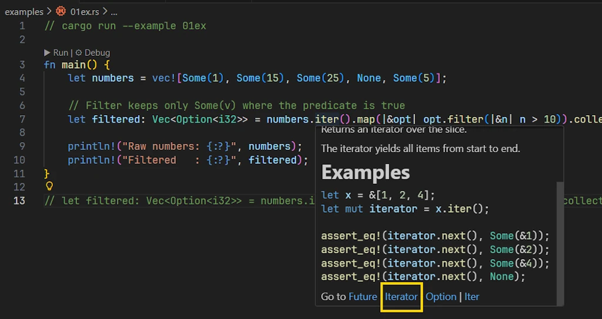<br/>
<span>Click on the <code>Iterator</code> link</span>
</div>


Let's look at the [`Iterator` trait](https://doc.rust-lang.org/std/iter/trait.Iterator.html):

<div align="center">
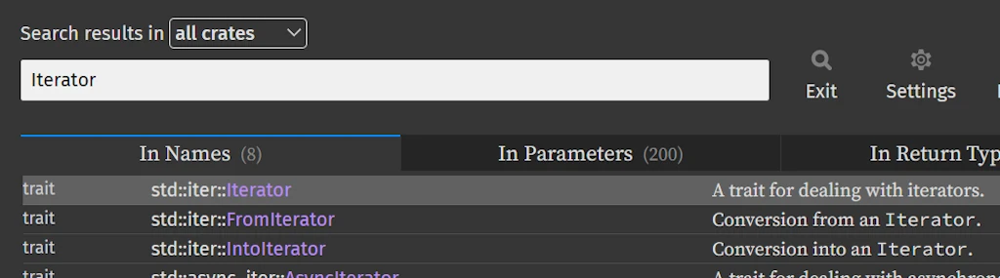<br/>
<span>Search for "Iterator" in the Rust Standard Library documentation</span>
</div>

Then

<div align="center">
<br/>
<span>Click on <code>std::iter::Iterator</code></span>
</div>

We see

```rust
pub trait Iterator {
    type Item;

    fn next(&mut self) -> Option<Self::Item>;

    // ... many other methods
}
```

That `type Item;` line declares the associated type. Every iterator **must** specify what `Item` is.


<!-- ###################################################################### -->
### Lifetimes in Signatures
{: .no_toc }

**Marty:** I've been avoiding this, but... what about those `'a` things I see everywhere?

**Emmett:** Lifetimes! They're not as scary as they look. Let's see them in context:

```rust
pub fn iter(&self) -> Iter<'_, T>
```

The `'_` is a **lifetime**. It says "the returned `Iter` cannot outlive `self`." It's the compiler ensuring you don't have dangling references.

Here's a more explicit version:

```rust
pub fn iter<'a>(&'a self) -> Iter<'a, T>
```

This says:
- `'a` is a lifetime parameter
- `&'a self` — we borrow self for lifetime `'a`
- `Iter<'a, T>` — the iterator is valid for lifetime `'a`

In other words: "the iterator lives as long as the borrow of self."

**Marty:** What about when I see multiple lifetimes?

**Emmett:** Then you're dealing with relationships between them:

```rust
fn longest<'a>(x: &'a str, y: &'a str) -> &'a str
```

This says "both inputs and the output all share the same lifetime `'a`." The returned reference is valid as long as BOTH inputs are valid.

You'll also see lifetime bounds:

```rust
fn foo<'a, 'b: 'a>(x: &'a str, y: &'b str) -> &'a str
```

The `'b: 'a` means "'b outlives 'a" so that `y`'s data lives at least as long as `x`'s.


**Marty:** Honestly, this is where my eyes start to glaze over.

**Emmett:** Here's my practical advice: when you're **reading** docs, you can often simplify mentally:

1. If you see `'_`, think "this borrows from something, and the compiler tracks it"
2. If you see `'static`, think "this data lives forever (like string literals)"
3. If you see multiple lifetimes, think "these references have a relationship the compiler enforces"

You need to really understand lifetimes when **writing** complex data structures. For **reading** docs? The key insight is just "references have scopes, and lifetimes express that."


<!-- ###################################################################### -->
### The Mysterious `?Sized` Bound
{: .no_toc }

**Marty:** I sometimes see `T: ?Sized`. What's that question mark about?

**Emmett:** Great catch! This is one of those "bounds that relax restrictions."

By default, all generic types have an implicit `T: Sized` bound, meaning `T` must have a known size at compile time. But sometimes you want to accept **dynamically sized types** (DSTs) like `str` or `[u8]`.

The `?Sized` says "T might not be `Sized`." It **removes** the default `Sized` requirement.

Look at [`From` for `PathBuf`](https://doc.rust-lang.org/std/path/struct.PathBuf.html#impl-From%3C%26T%3E-for-PathBuf):


{: .important-title }
> Side Note:
>
1. Go back to [doc.rust-lang.org/std](https://doc.rust-lang.org/std/), press `/`, search for `pathbuf` and click on the first item in the list : `struct std::path::PathBuf`
2. On the left hand side of the page, scroll down, find the "Trait Implementations" section and click on `From<&T>`


Welcome home!

<div align="center">
<br/>
<span>Search for "pathbuf" in the Rust Standard Library documentation</span>
</div>


Scroll down on the left

<div align="center">
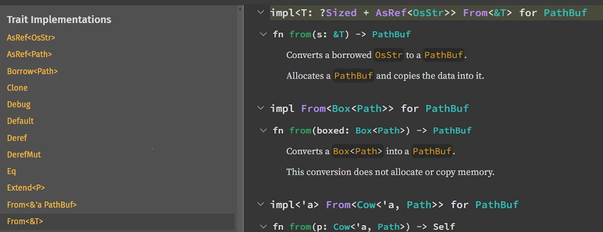<br/>
<span>Trait Implementations</span>
</div>

Finally you **read**

```rust
impl<T> From<&T> for PathBuf
where
    T: ?Sized + AsRef<OsStr>,
```

The `T: ?Sized` allows `T` to be `str` (unsized). So you can do:

```rust
let path = PathBuf::from("hello");  // T = str (unsized!)
```

Without `?Sized`, you couldn't pass `&str` because `str` doesn't have a known size.

**Marty:** So `?Sized` makes functions more flexible?

**Emmett:** Exactly. It's the trait bound that says "I don't need to know the size."


<!-- ###################################################################### -->
### Deref Coercion Deep Dive
{: .no_toc }

**Marty:** Earlier you mentioned `Deref` lets `Vec` use slice methods. Can you explain more?

**Emmett:** Sure! [`Deref`](https://doc.rust-lang.org/std/ops/trait.Deref.html) is a trait that enables *implicit dereferencing*. Here's how `Vec` implements it:

```rust
impl<T, A: Allocator> Deref for Vec<T, A> {
    type Target = [T];

    fn deref(&self) -> &[T] { ... }
}
```

This says "a `Vec<T>` can be treated as `&[T]` automatically."

When you write `vec.iter()`, here's what Rust does:
1. Look for `iter()` on `Vec<T>` — not found
2. Check if `Vec<T>` implements `Deref` — yes, to `[T]`
3. Look for `iter()` on `[T]` — found!
4. Automatically call it as `(*vec).iter()` (conceptually)

This cascades! `String` derefs to `str`, `Box<T>` derefs to `T`, `Rc<T>` derefs to `T`, etc.

**Marty:** How do I see what a type derefs to?

**Emmett:** In the docs, look for the "Methods from `Deref<Target = X>`" section. Or look for `impl Deref for ...` in the "Trait Implementations".

In VS Code, if you can't find a method, try going to definition on the type and looking for `Deref`.


<!-- ###################################################################### -->
### Reading Complex Trait Hierarchies
{: .no_toc }

**Marty:** Sometimes I see things like `Iterator + Clone + Send`. What's going on there?

**Emmett:** Those are *multiple trait bounds*. The `+` means "and":

```rust
fn process<I>(iter: I)
where
    I: Iterator<Item = u32> + Clone + Send,
```

This says `I` must:
1. Be an `Iterator` yielding `u32`
2. Be `Clone`able
3. Be `Send` (safe to send across threads)

You'll also see trait *inheritance* (called "supertraits"):

```rust
pub trait Copy: Clone { }
```

This means "anything implementing `Copy` must also implement `Clone`." You can't have `Copy` without `Clone`.

**Marty:** So if something requires `Copy`, I know it's automatically `Clone` too?

**Emmett:** Exactly!


<!-- ###################################################################### -->
### Marker Traits and Auto Traits
{: .no_toc }

**Marty:** What about `Send`, `Sync`, `Sized`, `Unpin`? I see these but they seem... empty?

**Emmett:** These are *marker traits* — they have no methods! They just "mark" types with certain properties:

| Trait | Meaning |
|-------|---------|
| [`Send`](https://doc.rust-lang.org/std/marker/trait.Send.html) | Safe to transfer to another thread |
| [`Sync`](https://doc.rust-lang.org/std/marker/trait.Sync.html) | Safe to share between threads (`&T` is `Send`) |
| [`Sized`](https://doc.rust-lang.org/std/marker/trait.Sized.html) | Has a known size at compile time |
| [`Unpin`](https://doc.rust-lang.org/std/marker/trait.Unpin.html) | Can be moved after being pinned (for async) |
| [`Copy`](https://doc.rust-lang.org/std/marker/trait.Copy.html) | Can be duplicated via simple bit-copy |

Most of these are *auto traits* — the compiler implements them automatically when safe. You rarely implement them manually.

When you see them in bounds, they're usually ensuring thread safety or other guarantees. For example, `spawn` requires `F: Send` because the closure must be safe to send to another thread.

**Marty:** So when I'm **reading** docs and I see these, I can often think "this is for thread safety or compiler guarantees" and move on?

**Emmett:** Exactly! Unless you're doing unsafe code, advanced async, or FFI, you can usually trust that if your code compiles, these bounds are satisfied.


<!-- ###################################################################### -->
### Exercise 00 - Associated Types vs Generic Parameters
{: .no_toc }


```rust
trait WithGeneric<T> {
    fn get(&self) -> T;
}

trait WithAssoc {
    type Item;

    fn get(&self) -> Self::Item;
}

// Implementation using generic trait
struct ContainerGeneric<T> {
    value: T,
}

impl<T: Clone> WithGeneric<T> for ContainerGeneric<T> {
    fn get(&self) -> T {
        self.value.clone()
    }
}

// Implementation using associated type
struct ContainerAssoc {
    value: i32,
}

impl WithAssoc for ContainerAssoc {
    type Item = i32;

    fn get(&self) -> Self::Item {
        self.value
    }
}

fn main() {
    // Using the generic trait
    let gen_container = ContainerGeneric { value: 42 };
    let val: i32 = WithGeneric::get(&gen_container);
    println!("WithGeneric: {}", val);

    // Same struct can implement WithGeneric for multiple types
    let str_container = ContainerGeneric { value: String::from("Hello") };
    let val: String = WithGeneric::get(&str_container);
    println!("WithGeneric (String): {}", val);

    // Using the associated type trait
    let assoc_container = ContainerAssoc { value: 100 };
    let val = assoc_container.get(); // Type is inferred from associated type
    println!("WithAssoc: {}", val);
}
```


1. Why can a type implement `WithGeneric<T>` multiple times, but only implement `WithAssoc` once?
2. Which model does the `Iterator` trait use? Why is it the best choice here?
3. Implement `WithAssoc` for the following type:

```rust
struct Boxed<T>(T);
```

Specify the associated type, and write a function that uses `Boxed` and retrieves the item using `get`.


<!-- ###################################################################### -->
### Exercise 01 - Analyzing a Deref Implementation
{: .no_toc }


```rust
use std::ops::Deref;

struct Wrapper<T>(T);

impl<T> Deref for Wrapper<T> {
    type Target = T;

    fn deref(&self) -> &Self::Target {
        &self.0
    }
}

fn main() {
    // Wrapper around an i32
    let wrapped_int = Wrapper(42);
    println!("Wrapped int: {}", *wrapped_int); // Explicit deref

    // Deref coercion in action: calling a method on the inner type
    let wrapped_string = Wrapper(String::from("Hello, Rust!"));
    println!("Length: {}", wrapped_string.len()); // Deref coercion to &String

    // Deref coercion: &Wrapper<String> -> &String -> &str
    fn print_str(s: &str) {
        println!("print_str: {}", s);
    }
    print_str(&wrapped_string); // Automatic coercion chain

    // Wrapper around a Vec
    let wrapped_vec = Wrapper(vec![1, 2, 3, 4, 5]);
    println!("First element: {:?}", wrapped_vec.first()); // Deref to &Vec<i32>
    println!("Vec length: {}", wrapped_vec.len());

    // Nested wrapper (double deref)
    let nested = Wrapper(Wrapper(100));
    println!("Nested value: {}", **nested);
}
```


1. What does `Deref` allow in this implementation?
2. Explain why this code works:

```rust
let w = Wrapper(String::from("Hello"));
println!("{}", w.len()); // uses Deref
```

3. Identify **which method** is actually being called (`String::len`) and why Rust is able to resolve it.
4. Give an example where `Deref` alone is **not enough**, and `DerefMut` would be required.


<!-- ###################################################################### -->
### Exercise 02 - Understanding a Function with Multiple Lifetimes
{: .no_toc }


Given the following code:

```rust
fn longest<'a>(x: &'a str, y: &'a str) -> &'a str {
    if x.len() > y.len() {
        x
    } else {
        y
    }
}

fn main() {
    // Basic usage with string literals (static lifetime)
    let result = longest("short", "much longer string");
    println!("Longest: {}", result);

    // With String references of same scope
    let s1 = String::from("hello");
    let s2 = String::from("hi");
    let result = longest(&s1, &s2);
    println!("Longest: {}", result);

    // Demonstrating lifetime constraint
    let s3 = String::from("long string");
    {
        let s4 = String::from("tiny");
        let result = longest(&s3, &s4);
        println!("Longest (nested scope): {}", result);
        // result is valid here because both s3 and s4 are still alive
    }

    // Equal length case (returns second one)
    let equal1 = "abc";
    let equal2 = "xyz";
    let result = longest(equal1, equal2);
    println!("Longest (equal length): {}", result);

    // Empty string comparison
    let empty = "";
    let non_empty = "something";
    let result = longest(empty, non_empty);
    println!("Longest (with empty): {}", result);
}
```

1. Why must both parameters and the return type use the **same lifetime** `'a`?
2. Provide:
   * one example that compiles,
   * one example that does not compile, and explain why.
3. Rewrite a more restrictive version:
   * where each parameter has its own lifetime,
   * but Rust prevents returning an invalid borrow.
4. Explain how Rust prevents **dangling references** in this situation.


<!-- ###################################################################### -->
### Exercise 03 - Reading a Signature Using `?Sized`
{: .no_toc }

Consider:

```rust
fn print_any<T: ?Sized + ToString>(val: &T) {
    println!("{}", val.to_string());
}

fn main() {
    // With a sized type: i32
    let num = 42;
    print_any(&num);

    // With a sized type: String
    let s = String::from("Hello, world!");
    print_any(&s);

    // With an unsized type: str (thanks to ?Sized)
    let slice: &str = "I'm a string slice!";
    print_any(slice);

    // With a sized type: f64
    let pi = 3.14159;
    print_any(&pi);

    // With a sized type: bool
    let flag = true;
    print_any(&flag);

    // Demonstrating why ?Sized matters:
    // Without ?Sized, this wouldn't compile because str is unsized
    fn print_str(s: &str) {
        print_any(s); // Works because of ?Sized bound
    }
    print_str("Direct str slice");

    // With a custom type implementing ToString (via Display)
    use std::fmt;

    struct Point {
        x: i32,
        y: i32,
    }

    impl fmt::Display for Point {
        fn fmt(&self, f: &mut fmt::Formatter<'_>) -> fmt::Result {
            write!(f, "({}, {})", self.x, self.y)
        }
    }

    let point = Point { x: 10, y: 20 };
    print_any(&point);
}
```

1. Why is `?Sized` necessary to support types like `str`?
2. Why must `val` be passed by reference?
3. Provide three valid calls (e.g., `&str`, `&String`, `&[u8]`).
4. Find another example in the Standard Library that uses `?Sized`
   (hint: `From<&T>` for `PathBuf`).


<!-- ###################################################################### -->
<!-- ###################################################################### -->
## Putting It All Together: Complete Analysis of Our Code

Let's trace through our code one more time, now with full understanding:

```rust
fn main() {
    let numbers = vec![Some(1), Some(15), Some(25), None, Some(5)];
    //  ^^^^^^^ Vec<Option<i32>> — inferred from the elements

    let filtered: Vec<Option<i32>> = numbers
        .iter()
        //^^^^ Returns std::slice::Iter<'_, Option<i32>>
        //     Item = &Option<i32>

        .map(|&opt| opt.filter(|&n| n > 10))
        //    ^^^^^ Pattern matches &Option<i32>, giving us Option<i32>
        //          opt: Option<i32>
        //                       ^^^ Pattern matches &i32, giving us i32
        //                           n: i32
        //          Returns Option<i32> (Some if n > 10, else None)
        //
        // map's F is FnMut(&Option<i32>) -> Option<i32>
        // Returns std::iter::Map<Iter<'_, Option<i32>>, ...>

        .collect();
        // Collects into Vec<Option<i32>> (type annotation guides this)
        // Uses FromIterator<Option<i32>> for Vec

    println!("Raw numbers: {:?}", numbers);
    //                      ^^^ Uses Debug trait, requires {:?} format
    println!("Filtered   : {:?}", filtered);
}
```

Every type, every trait, every method — we can trace it all through the documentation!


<!-- ###################################################################### -->
<!-- ###################################################################### -->
## Quick Reference: Doc-Reading Cheat Sheet


<!-- ###################################################################### -->
### Navigation Shortcuts (VS Code + rust-analyzer)
{: .no_toc }

| Action | Shortcut |
|--------|----------|
| Hover for type info | Mouse hover |
| Go to definition | F12 or Ctrl+Click |
| Peek definition | Alt+F12 |
| Find all references | Shift+F12 |
| Show hover permanently | Ctrl+K, Ctrl+I |


<!-- ###################################################################### -->
### Common Generic Names
{: .no_toc }

| Letter | Usually Means |
|--------|---------------|
| `T`, `U` | Any type |
| `E` | Error type |
| `F` | Function/closure |
| `I` | Iterator |
| `K`, `V` | Key, Value |
| `R` | Return type / Reader |
| `W` | Writer |
| `S` | State / String-like |
| `A` | Allocator |


<!-- ###################################################################### -->
### Trait Bound Patterns
{: .no_toc }

| Pattern | Meaning |
|---------|---------|
| `T: Clone` | T must implement Clone |
| `T: Clone + Send` | T must implement both |
| `T: Iterator<Item = u32>` | Iterator yielding u32s |
| `T: ?Sized` | T doesn't need to be Sized |
| `T: 'static` | T contains no non-static refs |
| `T: 'a` | T is valid for lifetime 'a |
| `'b: 'a` | Lifetime 'b outlives 'a |


<!-- ###################################################################### -->
### Bounds You Can Often Ignore
{: .no_toc }

- `Destruct` — const evaluation detail
- `Allocator` parameters — use default
- Complex lifetime bounds — trust the compiler
- `Unpin` — unless doing advanced async


<!-- ###################################################################### -->
<!-- ###################################################################### -->
## Conclusion

**Marty:** I feel like I can actually **read** these docs now. The signatures that terrified me before are just... information.

**Emmett:** That's the key insight. Every piece of a type signature is telling you something useful:
- **Type parameters** tell you what's generic
- **Trait bounds** tell you what capabilities are required
- **Lifetimes** tell you how long references are valid
- **`self`, `&self`, `&mut self`** tell you how the method accesses the value

**Marty:** And when in doubt?

**Emmett:** Use the tools:
1. Hover in VS Code for quick info
2. F12 to dive deeper
3. Search docs.rust-lang.org for the full story
4. Look at the examples in the docs — every page has them
5. When you see scary bounds like `Destruct`, check if you can ignore them for your use case

The Standard Library docs are incredibly thorough. Once you know how to **read** them, they become your most valuable resource. And the best part? Every crate follows the same patterns. Learn to **read** `std`, and you can **read** `tokio`, `axum`, `serde`, or anything else.


<!-- *Found this helpful? Have questions? The Rust community is famously welcoming — don't hesitate to ask on [users.rust-lang.org](https://users.rust-lang.org/) or the [Rust Discord](https://discord.gg/rust-lang).* -->


<!-- ###################################################################### -->
<!-- ###################################################################### -->
## Webliography

- [Standard Library documentation home](https://doc.rust-lang.org/std/)
- [The Rust Reference](https://doc.rust-lang.org/stable/reference/)
- [The Rust Book — Chapter 10: Generic Types, Traits, and Lifetimes](https://doc.rust-lang.org/book/ch10-00-generics.html)
- [The Rustonomicon — Advanced Topics](https://doc.rust-lang.org/nomicon/) (when you're ready for deep dives)
- [Rust by Example](https://doc.rust-lang.org/rust-by-example/) — Learn through code
- [Rust on Windows 11, My Complete Setup Guide]()
- Watch this video:
<div align="center">
<iframe width="560" height="315" src="https://www.youtube.com/embed/ODk38qJ1A3U?si=SAss1APdTHPIcvNK" title="YouTube video player" frameborder="0" allow="accelerometer; autoplay; clipboard-write; encrypted-media; gyroscope; picture-in-picture; web-share" referrerpolicy="strict-origin-when-cross-origin" allowfullscreen></iframe>
</div>