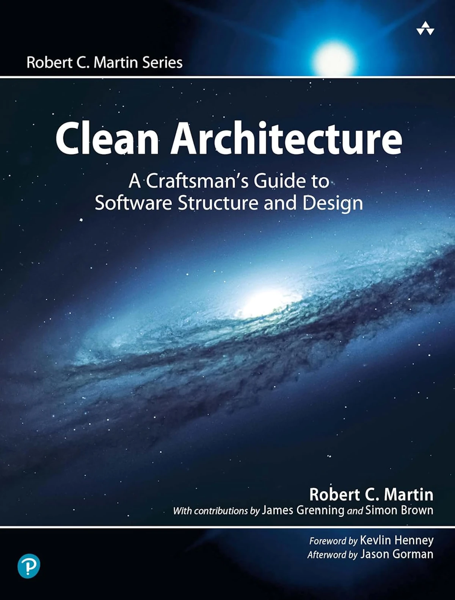
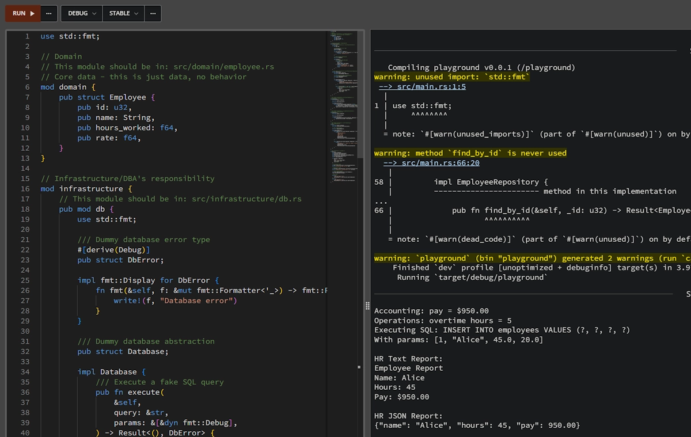
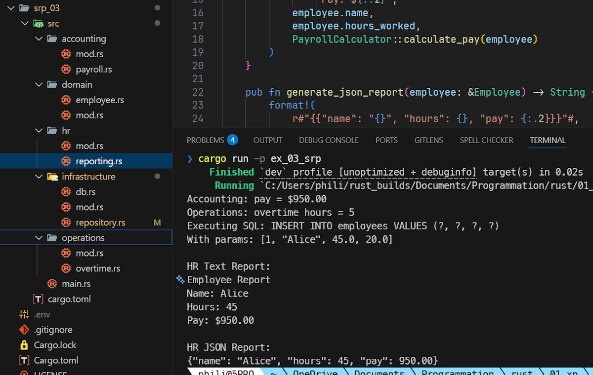

# SOLID Principles in Rust: A Practical Guide
{: .no_toc }

A gentle introduction to SOLID principles using Rust. The focus is on Single Responsibility Principle.
{: .lead }


<!-- <h2 align="center">
<span style="color:orange"><b> 🚧 This post is under construction 🚧</b></span>
</h2> -->

<!-- * 01/13 : OK up to the end of Single Responsibility Principle (SRP) -->


<!--
TODO
* Comment lire les messages d'erreur du compilateur en lien avec la doc. Quand rustc dit "expected X, found Y", comment naviguer vers la doc pour comprendre le problème.
-->


<!-- ###################################################################### -->
<!-- ###################################################################### -->
<!-- ###################################################################### -->
## TL;DR
{: .no_toc }

* You are not an expert in Rust but you're not a newbie either.

* The **S**ingle Responsibility Principle
    * Is not about counting changes, but about identifying **who has the authority** to demand them.
    * Is a thinking tool that helps us say: *"This code makes me nervous because too many people could ask me to change it."*
* The **O**pen-Closed Principle
    * Is not about never changing code, but about **protecting stable code from frequent changes**.
    * Is a thinking tool that helps us say: *"I should be able to extend this behavior without reopening code that was already validated."*

* The **L**iskov Substitution Principle
    * Is not about inheritance syntax, but about **behavioral compatibility**.
    * Is a thinking tool that helps us say: *"If I have to know the concrete type, then substitution is broken."*

* The **I**nterface Segregation Principle
    * Is not about creating many interfaces for the sake of it, but about **avoiding forcing clients to depend on things they don’t use**.
    * Is a thinking tool that helps us say: *"This interface is making me implement things I don’t care about."*

* The **D**ependency Inversion Principle
    * Is not about abstractions everywhere, but about **protecting policy from implementation details**.
    * Is a thinking tool that helps us say: *"My core logic should not know how the outside world works."*

* SOLID principles help us at the mid level
    * **Module** = a group of related functions and types (`mod`)
    * **Component** = a crate (lib or binary)
    * **Class** = a `struct` with associated functions and trait implementations

* SOLID principles are not rules to follow, but questions to ask when code starts to feel uncomfortable. See the "When to Apply the ... Principle?" sections.


**Note about the code:**

1. You should be able to copy most of the code from the posts into the [Rust Playground](https://play.rust-lang.org/).
2. The code from the posts is also available in the [solid_test repository](https://github.com/40tude/solid_test) on GitHub.
3. In addition, feel free to explore, break, and rebuild the companion project, the [Coffee Shop Order System](https://github.com/40tude/coffee-shop-solid), available on GitHub.


<!-- ###################################################################### -->
<!-- ###################################################################### -->
<!-- ###################################################################### -->
### This is Episode 00
{: .no_toc }

#### The Posts Of The Saga
{: .no_toc }
* [Episode 00](): Introduction + Single Responsibility Principle
* [Episode 01](): Open-Closed Principle
* [Episode 02](): Liskov Substitution Principle
* [Episode 03](): Interface Segregation Principle
* [Episode 04](): Dependency Inversion Principle + Conclusion


<div align="center">
<br/>
<span>1986</span>
</div>


<!-- ###################################################################### -->
<!-- ###################################################################### -->
<!-- ###################################################################### -->
## Table of Contents
{: .no_toc .text-delta}
- TOC
{:toc}


<!-- ###################################################################### -->
<!-- ###################################################################### -->
<!-- ###################################################################### -->
## Introduction: Why Should I Care About SOLID?

I'm, by far, not an expert. However, I still have in mind the project to rewrite in Rust my [Fraud Detection project (Python)](https://github.com/40tude/fraud_detection_2) and I would like to make sure it follows the good practices. In addition, the more I read and the more I use Rust, the more I want to learn how to leverage the type system to define the architecture/design of my applications.

In the following, I put black on white what I understand, take the time to confirm with other sources and illustrate the concepts with some code. I hate code snippets that are incomplete and does not work. However, here, they are hard to avoid:
- This is why, in addition to this article I created what I call the [Coffee Shop Order System](https://github.com/40tude/coffee-shop-solid) companion project which is available on GitHub. It is a demo where I apply what is discussed in the serie of posts. At the time of writing it is working, not yet perfect but working.
- And you know what? Regarding the code snippets of the articles... I did'nt say my last word and I may decide to group them all in a [repo on GitHub](https://github.com/40tude/solid_test) or rewrite them so that we can copy/paste them in our best friend, aka [Rust Playground](https://play.rust-lang.org/). We will see...

Anyway, I'm reading Uncle Bob's [Clean Architecture](https://amzn.eu/d/2khTpqS) book and wondering how these principles, born in the world of Java and C#, apply to Rust. After all, we're not dealing with inheritance hierarchies, we don't have traditional classes, and most of the time everything compiles into a single binary. So what gives?

<div align="center">
<br/>
<span>2017 - <a href="https://amzn.eu/d/2khTpqS" target="_blank">Clean Architecture</a></span>
</div>


Here's the thing: **SOLID** isn't about the language features - it's about **organizing our code so it doesn't turn into a tangled mess that makes us want to rage-quit and become a farmer**.

<div align="center">
<br/>
<!-- <span>2017 - <a href="https://amzn.eu/d/2khTpqS" target="_blank">Clean Architecture</a></span> -->
</div>

The principles are about managing dependencies, separating concerns, and making our code maintainable as it grows.


### The "One Binary" Question

Let's address the elephant in the room right now because it was one of the very first question I had in mind. The author talks a lot about "components" that can be independently deployed (JARs, DLLs, Gems). In Rust, I typically compile everything into a single binary. Does this make SOLID irrelevant? Absolutely not and here's why:

1. **Independence is logical, not physical**: When we talk about "independent components" in SOLID, we're really talking about modules/crates that:
   - Have clear boundaries (traits)
   - Can be understood in isolation
   - Can be tested independently
   - Can be developed by different teams without stepping on each other's toes
   - Can evolve without breaking dependents

2. **Rust's crate system provides boundaries**: Even though everything links into one binary, our crates are still separate compilation units with explicit interfaces. A well-designed crate can be understood without reading its dependencies' implementation.

3. **The binary is our deployment unit**: In the JVM world, they talk about deploying individual JARs. In Rust, we deploy the whole binary - but the internal organization still matters enormously for maintainability, testability, and team collaboration.

Think of it this way: when the Death Star blows up, it doesn't matter that it was one giant structure - what matters is that the exhaust port was poorly isolated from the reactor core. Dependencies matter, even in a monolith.

**Note:**

Just to make sure... In last ressort, if we really need, for sure we can create DLL based plugins with Rust (see crate `libloading`). If you are interested, try this [plugin demo](https://github.com/40tude/plugin_demo_2) available on GitHub.


### What SOLID Means at the Mid-Level

Uncle Bob is clear: SOLID operates at the **module/class level**, not at the architectural level (that's coming later in the book) and not at the `for loop` level either. In Rust terms:
- **Module** = a group of related functions and types (`mod`)
- **Component** = a crate (library or binary)
- **Class** = a `struct` with associated functions and trait implementations

SOLID tells us how to organize these pieces so that:
- They tolerate change
- They're easy to understand
- They're reusable
- They don't create ripple effects when modified


### Rust's Secret Weapons for SOLID

Rust has features that greatly facilitate the implementation of SOLID principles:

- **Traits**: Perfect abstraction mechanism (interfaces without the baggage)
- **Ownership system**: Forces us to think about responsibilities and boundaries
- **Type system**: Compile-time enforcement of contracts
- **Pattern matching**: Extensibility without modification
- **No null**: Makes interface contracts explicit
- **Error handling**: `Result<T, E>` makes failure cases part of the contract

Alright, enough philosophy. It is dogfight time! Let's dive into each principle with real code.


<figure style="text-align: center;">
  <iframe width="560" height="315" src="https://www.youtube.com/embed/EZfM2VMs_vI?si=FHS-1PFIqBG70Ffs&amp;start=55" title="YouTube video player" frameborder="0" allow="accelerometer; autoplay; clipboard-write; encrypted-media; gyroscope; picture-in-picture; web-share" referrerpolicy="strict-origin-when-cross-origin" allowfullscreen></iframe>
  <figcaption>I love the opening theme. It gives me goosebumps every time.</figcaption>
</figure>


<!-- ###################################################################### -->
<!-- ###################################################################### -->
<!-- ###################################################################### -->

## Single Responsibility Principle (SRP)

### The Principle

> "A module should have one, and only one, reason to change."

Or, as Uncle Bob refines it:

> "A module should be responsible to one, and only one, actor."

In my view, above, an “actor” is the person, group, or system that has the authority to make decisions about the module’s features, and to which the module is therefore accountable.

The Single Responsibility Principle is **NOT** "do one thing" (that's for functions). It is about **reasons to change**. If our module changes because the accounting department wants something **AND** because the operations team wants something, we've got two reasons to change - that's a violation.


### The Problem: Accidental Coupling

Let's say we're building a payroll system. You can copy and paste the code below in [Rust Playground](https://play.rust-lang.org/) but it is also available [here](https://github.com/40tude/solid_test/blob/main/srp_01/src/main.rs). Here's what violates Single Responsibility Principle:

```rust
// cargo run -p ex_01_srp

use std::fmt;

/// Dummy database error type
#[derive(Debug)]
pub struct DbError;

impl fmt::Display for DbError {
    fn fmt(&self, f: &mut fmt::Formatter<'_>) -> fmt::Result {
        write!(f, "Database error")
    }
}

/// Dummy database abstraction
pub struct Database;

impl Database {
    /// Execute a fake SQL query
    pub fn execute(&mut self, query: &str, params: &[&dyn fmt::Debug]) -> Result<(), DbError> {
        println!("Executing SQL: {}", query);
        println!("With params: {:?}", params);
        Ok(())
    }
}

pub struct Employee {
    pub id: u32,
    pub name: String,
    pub hours_worked: f64,
    pub rate: f64,
}

impl Employee {
    /// Calculate pay (used by Accounting)
    pub fn calculate_pay(&self) -> f64 {
        let regular_hours = self.hours_worked.min(40.0);
        let overtime_hours = (self.hours_worked - 40.0).max(0.0);
        regular_hours * self.rate + overtime_hours * self.rate * 1.5
    }

    /// Calculate overtime hours for operations report (used by Operations)
    pub fn calculate_overtime_hours(&self) -> f64 {
        (self.hours_worked - 40.0).max(0.0)
    }

    /// Save to database (used by DBAs / Infrastructure)
    pub fn save(&self, db: &mut Database) -> Result<(), DbError> {
        db.execute(
            "INSERT INTO employees VALUES (?, ?, ?, ?)",
            &[&self.id, &self.name, &self.hours_worked, &self.rate],
        )
    }

    /// Generate report (used by HR)
    pub fn generate_report(&self) -> String {
        format!(
            "Employee Report\n\
             Name: {}\n\
             Hours: {}\n\
             Pay: ${:.2}",
            self.name,
            self.hours_worked,
            self.calculate_pay()
        )
    }
}

fn main() {
    let employee = Employee {
        id: 1,
        name: "Alice".to_string(),
        hours_worked: 45.0,
        rate: 20.0,
    };

    // Accounting client
    let pay = employee.calculate_pay();
    println!("Accounting: pay = ${:.2}", pay);

    // Operations client
    let overtime = employee.calculate_overtime_hours();
    println!("Operations: overtime hours = {}", overtime);

    // Infrastructure / DBA client
    let mut db = Database;
    employee.save(&mut db).unwrap();

    // HR client
    let report = employee.generate_report();
    println!("\nHR Report:\n{}", report);
}
```

Expected output:

```powershell
Accounting: pay = $950.00
Operations: overtime hours = 5
Executing SQL: INSERT INTO employees VALUES (?, ?, ?, ?)
With params: [1, "Alice", 45.0, 20.0]

HR Report:
Employee Report
Name: Alice
Hours: 45
Pay: $950.00
```

**Note:**

In real life the code should be split among different files (this is demonstrated in this [project](https://github.com/40tude/solid_test/tree/main/srp_03) available only on GitHub). Here, I don't even try to use modules (this is done in the next sample code). I just want to keep things simple, monolithic, easy to follow and to understand.

**What's wrong here?** This `Employee` data type serves **4 different actors** and look, in the implementation part there are 4 methods.
1. **Accounting** - needs `calculate_pay()`
2. **Operations** - needs `calculate_overtime_hours()`
3. **DBAs** - need `save()`
4. **HR** - needs `generate_report()`

And having these four methods that meet the needs of four different actors in the same object (`employee`) is really not a good idea.

Now imagine:
- Accounting wants to change overtime calculation rules
- Operations wants to track overtime differently
- DBAs want to switch from SQL to NoSQL
- HR wants reports in JSON instead of text

Every change affects the same data type (`Employee`). Merge conflicts galore. Changes for one team risk breaking functionality for another team.


### The Solution: Separate the Actors

Below make sure to realize that now the code is dispatched among different files.


```rust
// src/domain/employee.rs
// Core data - this is just data, no behavior
pub struct Employee {
    pub id: u32,
    pub name: String,
    pub hours_worked: f64,
    pub rate: f64,
}
```


```rust
// src/accounting/payroll.rs
// Accounting's responsibility
use crate::domain::employee::Employee;
pub struct PayrollCalculator;

impl PayrollCalculator {
    pub fn calculate_pay(employee: &Employee) -> f64 {
        let regular_hours = employee.hours_worked.min(40.0);
        let overtime_hours = (employee.hours_worked - 40.0).max(0.0);
        regular_hours * employee.rate + overtime_hours * employee.rate * 1.5
    }
}
```


```rust
// src/operations/overtime.rs
// Operations' responsibility
use crate::domain::employee::Employee;
pub struct OvertimeTracker;

impl OvertimeTracker {
    pub fn calculate_overtime_hours(employee: &Employee) -> f64 {
        (employee.hours_worked - 40.0).max(0.0)
    }
}
```


```rust
// src/infrastructure/repository.rs
// Infrastructure/DBA's responsibility
use super::db::{Database, DbError};
use crate::domain::employee::Employee;

pub struct EmployeeRepository {
    db: Database,
}

impl EmployeeRepository {
    pub fn save(&mut self, employee: &Employee) -> Result<(), DbError> {
        self.db.execute(
            "INSERT INTO employees VALUES (?, ?, ?, ?)",
            &[&employee.id, &employee.name, &employee.hours_worked, &employee.rate],
        )
    }

    pub fn find_by_id(&self, id: u32) -> Result<Employee, DbError> {
        // Implementation
        todo!()
    }
}
```


```rust
// src/hr/reporting.rs
// HR's responsibility
use crate::accounting::payroll::PayrollCalculator;
use crate::domain::employee::Employee;

pub struct EmployeeReporter;

impl EmployeeReporter {
    pub fn generate_text_report(employee: &Employee) -> String {
        format!(
            "Employee Report\n\
             Name: {}\n\
             Hours: {}\n\
             Pay: ${:.2}",
            employee.name,
            employee.hours_worked,
            PayrollCalculator::calculate_pay(employee)
        )
    }

    pub fn generate_json_report(employee: &Employee) -> String {
        format!(
            r#"{{"name": "{}", "hours": {}, "pay": {:.2}}}"#,
            employee.name,
            employee.hours_worked,
            PayrollCalculator::calculate_pay(employee)
        )
    }
}
```


Again, I hate code snippets we can't "play" with. This is why you can find below a multi modal, yet monolithic version of the previous code that you can copy and paste in [Rust Playground](https://play.rust-lang.org/). It is not yet perfect but we are moving in the right direction and keep in mind we focus on separating the actors.

<div align="center">
<br/>
<span>A solution to our SRP violation running in the Rust Playground</span>
</div>



```rust
// cargo run -p ex_02_srp

// use std::fmt;

// Domain
// This module should be in: src/domain/employee.rs
// Core data - this is just data, no behavior
mod domain {
    pub struct Employee {
        pub id: u32,
        pub name: String,
        pub hours_worked: f64,
        pub rate: f64,
    }
}

// Infrastructure/DBA's responsibility
mod infrastructure {
    // This module should be in: src/infrastructure/db.rs
    pub mod db {
        use std::fmt;

        /// Dummy database error type
        #[derive(Debug)]
        pub struct DbError;

        impl fmt::Display for DbError {
            fn fmt(&self, f: &mut fmt::Formatter<'_>) -> fmt::Result {
                write!(f, "Database error")
            }
        }

        /// Dummy database abstraction
        pub struct Database;

        impl Database {
            /// Execute a fake SQL query
            pub fn execute(&self, query: &str, params: &[&dyn fmt::Debug]) -> Result<(), DbError> {
                println!("Executing SQL: {}", query);
                println!("With params: {:?}", params);
                Ok(())
            }
        }
    }

    // This module should be in: src/infrastructure/repository.rs
    pub mod repository {
        use super::db::{Database, DbError};
        use crate::domain::Employee;

        /// Infrastructure / DBA's responsibility
        pub struct EmployeeRepository {
            pub db: Database,
        }

        impl EmployeeRepository {
            pub fn save(&self, employee: &Employee) -> Result<(), DbError> {
                self.db.execute(
                    "INSERT INTO employees VALUES (?, ?, ?, ?)",
                    &[
                        &employee.id,
                        &employee.name,
                        &employee.hours_worked,
                        &employee.rate,
                    ],
                )
            }

            #[allow(dead_code)]
            pub fn find_by_id(&self, _id: u32) -> Result<Employee, DbError> {
                // Fake implementation for demo purposes
                Ok(Employee {
                    id: 1,
                    name: "Alice".to_string(),
                    hours_worked: 40.0,
                    rate: 20.0,
                })
            }
        }
    }
}

// This module should be in: src/accounting/payroll.rs
// Accounting's responsibility
mod accounting {
    use crate::domain::Employee;

    pub struct PayrollCalculator;

    impl PayrollCalculator {
        pub fn calculate_pay(employee: &Employee) -> f64 {
            let regular_hours = employee.hours_worked.min(40.0);
            let overtime_hours = (employee.hours_worked - 40.0).max(0.0);
            regular_hours * employee.rate + overtime_hours * employee.rate * 1.5
        }
    }
}

// This module should be in: src/operations/overtime.rs
// Operations' responsibility
mod operations {
    use crate::domain::Employee;

    pub struct OvertimeTracker;

    impl OvertimeTracker {
        pub fn calculate_overtime_hours(employee: &Employee) -> f64 {
            (employee.hours_worked - 40.0).max(0.0)
        }
    }
}

// This module should be in: src/hr/reporting.rs
// HR's responsibility
mod hr {
    use crate::accounting::PayrollCalculator;
    use crate::domain::Employee;

    /// HR's responsibility
    pub struct EmployeeReporter;

    impl EmployeeReporter {
        pub fn generate_text_report(employee: &Employee) -> String {
            format!(
                "Employee Report\n\
                 Name: {}\n\
                 Hours: {}\n\
                 Pay: ${:.2}",
                employee.name,
                employee.hours_worked,
                PayrollCalculator::calculate_pay(employee)
            )
        }

        pub fn generate_json_report(employee: &Employee) -> String {
            format!(
                r#"{{"name": "{}", "hours": {}, "pay": {:.2}}}"#,
                employee.name,
                employee.hours_worked,
                PayrollCalculator::calculate_pay(employee)
            )
        }
    }
}

// This should be in: src/main.rs
fn main() {
    use accounting::PayrollCalculator;
    use domain::Employee;
    use hr::EmployeeReporter;
    use infrastructure::db::Database;
    use infrastructure::repository::EmployeeRepository;
    use operations::OvertimeTracker;

    let employee = Employee {
        id: 1,
        name: "Alice".to_string(),
        hours_worked: 45.0,
        rate: 20.0,
    };

    // Accounting client
    let pay = PayrollCalculator::calculate_pay(&employee);
    println!("Accounting: pay = ${:.2}", pay);

    // Operations client
    let overtime = OvertimeTracker::calculate_overtime_hours(&employee);
    println!("Operations: overtime hours = {}", overtime);

    // Infrastructure client
    let repo = EmployeeRepository { db: Database };
    repo.save(&employee).unwrap();

    // HR client
    println!(
        "\nHR Text Report:\n{}",
        EmployeeReporter::generate_text_report(&employee)
    );
    println!(
        "\nHR JSON Report:\n{}",
        EmployeeReporter::generate_json_report(&employee)
    );
}
```



Expected output:

```powershell
Accounting: pay = $950.00
Operations: overtime hours = 5
Executing SQL: INSERT INTO employees VALUES (?, ?, ?, ?)
With params: [1, "Alice", 45.0, 20.0]

HR Text Report:
Employee Report
Name: Alice
Hours: 45
Pay: $950.00

HR JSON Report:
{"name": "Alice", "hours": 45, "pay": 950.00}
```

**Note :**

In this [GitHub repo](https://github.com/40tude/solid_test) you can find in the workspace `ex_03_srp` (in the `srp_03/` folder) a version of the previous code where the modules are indeed scattered among different folders and files. See below:

<div align="center">
<br/>
<!-- <span>Optional comment</span> -->
</div>

Now:
- If payroll rules change, only `PayrollCalculator` changes
- If we switch databases, only `EmployeeRepository` changes
- If HR wants new report formats, only `EmployeeReporter` changes
- Each actor owns their own code meaning

If the teams use workspaces, they can run independent testing

```powershell
cargo test --package accounting   # Only accounting tests
cargo test --package hr           # Only HR tests
```

We can have independent deployments:

```toml
# Cargo.toml (workspace root)
[workspace]
members = [
    "domain",
    "accounting",
    "operations",
    "infrastructure",
    "hr",
]
```


### Rust-Specific Notes

1. **No methods on data structs**: In Rust, we're not forced to put methods on types. We can have "plain old data" (POD) structs and separate modules/types for behavior. This naturally encourages Single Responsibility Principle.

2. **Files Organization**
In the real life we could have something like:

```
src/
├── domain/
│   └── employee.rs          ← Just data, no behavior
│
├── accounting/              ← Accounting team's module
│   └── payroll.rs           ← calculate_pay
│
├── operations/              ← Operations team's module
│   └── overtime.rs          ← calculate_overtime_hours
│
├── infrastructure/          ← DBA team's module
│   └── repository.rs        ← save/load
│   └── db.rs                ← Database, DbError
│
├── hr/                      ← HR team's module
│   └── reporting.rs         ← generate_report
```

3. **Module organization**:

We can organize our crates like this:

   ```
   src/
     employee.rs         // Core data type
     payroll.rs          // PayrollCalculator
     operations.rs       // OvertimeTracker
     repository.rs       // EmployeeRepository
     reporting.rs        // EmployeeReporter
     db.rs               // Database
   ```

If you hesitate when I talk about, files, crates, modules and module trees... Read this [post]().

4. **Ownership clarifies responsibility**: When we pass `&Employee` vs `Employee` vs `&mut Employee`, we're explicit about responsibility. The repository needs mutable access to the DB but not to employees. The calculator needs read-only access to employees.


**Note:**

This is more or less the organization in the [Coffee Shop Order System companion project](https://github.com/40tude/coffee-shop-solid) where we have something similar to:

```
src/
├── domain/          ← Core data (Employee equivalent)
├── services/        ← Business logic teams
│   ├── pricing_calculator.rs   ← Accounting team
│   └── order_service.rs        ← Operations team
├── adapters/        ← Infrastructure teams
│   ├── repository.rs           ← DBA team
│   └── notifier.rs             ← Customer Service team

```


### When to apply the Single Responsibility Principle (SRP)?

Context: It is 8 AM. Coffee in one hand, eyes on the screen, we are reviewing yesterday’s code.

**The question to ask:** *"If this code needs to change, who is requesting the change, and why?"*

* If the answer points to **multiple actors** with different goals (business rules, persistence, presentation, infrastructure), then the code is likely doing too much and should be split.
* The Single Responsibility Principle is less about counting changes and more about identifying **who has the authority** to demand them. If that doesn't work for you, you can count the number of people/teams who can "write the specifications" or the number of people/teams "who will validate and accept the new features". If the number is larger than one, you're in trouble.
* SRP is a thinking tool that helps us say: *"This code makes me nervous because too many people could ask me to change it."*


<div align="center">
<br/>
<span><a href="https://youtu.be/KrLFEHeKNBw?si=cpM1aUZl3V5-6yx_&t=28" target="_blank">1984</a></span>
</div>


## Next Step
{: .no_toc }

* [Episode 00](): Introduction + Single Responsibility Principle
* [Episode 01](): Open-Closed Principle
* [Episode 02](): Liskov Substitution Principle
* [Episode 03](): Interface Segregation Principle
* [Episode 04](): Dependency Inversion Principle + Conclusion


