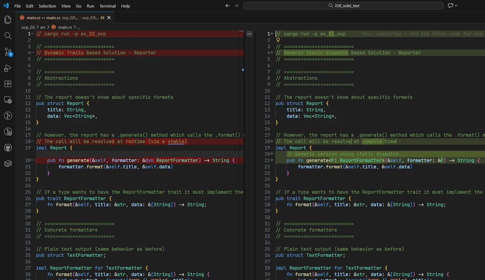

# SOLID Principles in Rust: A Practical Guide
{: .no_toc }

A gentle introduction to SOLID principles using Rust. The focus is on Open-Closed Principle.
{: .lead }


<!-- <h2 align="center">
<span style="color:orange"><b> 🚧 This post is under construction 🚧</b></span>
</h2> -->


<!-- ###################################################################### -->
<!-- ###################################################################### -->
<!-- ###################################################################### -->
### This is Episode 01
{: .no_toc }

#### The Posts Of The Saga
{: .no_toc }
* [Episode 00](): Introduction + Single Responsibility Principle
* [Episode 01](): Open-Closed Principle
* [Episode 02](): Liskov Substitution Principle
* [Episode 03](): Interface Segregation Principle
* [Episode 04](): Dependency Inversion Principle + Conclusion

<div align="center">
<br/>
<span>1986</span>
</div>


<!-- ###################################################################### -->
<!-- ###################################################################### -->
<!-- ###################################################################### -->
## Table of Contents
{: .no_toc .text-delta}
- TOC
{:toc}


<!-- ###################################################################### -->
<!-- ###################################################################### -->
<!-- ###################################################################### -->
## Open-Closed Principle (OCP)


### The Principle

> "Software entities should be open for extension but closed for modification."

In other words: when requirements change, we should be able to add new behavior **without changing existing code**.

This sounds like black magic, but it's actually straightforward: **depend on abstractions (traits), not concretions**. When we need new behavior, implement a new type that satisfies the trait.


### The Problem: Modification Hell

Let's build a report generator that can output different formats. You can copy and paste the code below in [Rust Playground](https://play.rust-lang.org/):

```rust
// cargo run -p ex_01_ocp

// =========================
// Naïve Solution - Reporter
// =========================

// This enum defines all supported report formats
// Adding a new format requires modifying this enum
pub enum ReportFormat {
    Text,
    Html,
    Pdf,
}

// This struct represents the report data
pub struct Report {
    title: String,
    data: Vec<String>,
}

impl Report {
    // This method violates the Open-Closed Principle
    // Each new format requires modifying this method
    pub fn generate(&self, format: ReportFormat) -> String {
        match format {
            ReportFormat::Text => {
                let mut output = format!("=== {} ===", self.title);
                for item in &self.data {
                    output.push_str(&format!("\n- {}", item));
                }
                output
            }
            ReportFormat::Html => {
                let mut output = format!("<h1>{}</h1>\n<ul>\n", self.title);
                for item in &self.data {
                    output.push_str(&format!("  <li>{}</li>\n", item));
                }
                output.push_str("</ul>");
                output
            }
            ReportFormat::Pdf => {
                // Fake PDF generation
                format!("PDF: {} [binary data]", self.title)
            }
        }
    }
}

fn main() {
    // Sample report data
    let report = Report {
        title: String::from("Monthly Sales"),
        data: vec![
            String::from("Product A: 120 units"),
            String::from("Product B: 98 units"),
            String::from("Product C: 143 units"),
        ],
    };

    // Generate reports in different formats
    let text_report = report.generate(ReportFormat::Text);
    let html_report = report.generate(ReportFormat::Html);
    let pdf_report = report.generate(ReportFormat::Pdf);

    println!("\n--- TEXT REPORT ---\n{}", text_report);
    println!("\n--- HTML REPORT ---\n{}", html_report);
    println!("\n--- PDF REPORT ---\n{}", pdf_report);
}
```

Expected output

```powershell
--- TEXT REPORT ---
=== Monthly Sales ===
- Product A: 120 units
- Product B: 98 units
- Product C: 143 units

--- HTML REPORT ---
<h1>Monthly Sales</h1>
<ul>
  <li>Product A: 120 units</li>
  <li>Product B: 98 units</li>
  <li>Product C: 143 units</li>
</ul>

--- PDF REPORT ---
PDF: Monthly Sales [binary data]
```

What happens when we need XML output? We have to:
1. Add `Xml` to the enum
2. Modify the `generate()` method
3. Recompile everything
4. Risk breaking existing formats
5. Every developer working on reports has merge conflicts

**This violates Open-Closed Principle** because adding a new format requires modifying existing code.

Let's note that the root cause of the problem here, is the same as in the Single Responsibility Principle: all the features are embedded inside the Report data type.


### The Solution: Dynamic Trait Based Extension

You can copy and paste the code below in [Rust Playground](https://play.rust-lang.org/).

```rust
// cargo run -p ex_02_ocp

// =========================
// Dynamic Traits Based Solution - Reporter
// =========================

// =========================
// Abstractions
// =========================

// The report doesn't know about specific formats
pub struct Report {
    title: String,
    data: Vec<String>,
}

// However, the report has a .generate() method which calls the .format() method of the formatter
// The call will be resolved at runtime (via a vtable)
impl Report {
    pub fn generate(&self, formatter: &dyn ReportFormatter) -> String {
        formatter.format(&self.title, &self.data)
    }
}

// If a type wants to have the ReportFormatter trait it must implement the .format() method
pub trait ReportFormatter {
    fn format(&self, title: &str, data: &[String]) -> String;
}

// =========================
// Concrete formatters
// =========================

// Plain text output (same behavior as before)
pub struct TextFormatter;

impl ReportFormatter for TextFormatter {
    fn format(&self, title: &str, data: &[String]) -> String {
        let mut output = format!("=== {} ===", title);
        for item in data {
            output.push_str(&format!("\n- {}", item));
        }
        output
    }
}

// HTML output (same structure as initial example)
pub struct HtmlFormatter;

impl ReportFormatter for HtmlFormatter {
    fn format(&self, title: &str, data: &[String]) -> String {
        let mut output = format!("<h1>{}</h1>\n<ul>\n", title);
        for item in data {
            output.push_str(&format!("  <li>{}</li>\n", item));
        }
        output.push_str("</ul>");
        output
    }
}

// Fake PDF output (same spirit as before)
pub struct PdfFormatter;

impl ReportFormatter for PdfFormatter {
    fn format(&self, title: &str, _data: &[String]) -> String {
        format!("PDF: {} [binary data]", title)
    }
}

// New XML output - extension without modification
pub struct XmlFormatter;

impl ReportFormatter for XmlFormatter {
    fn format(&self, title: &str, data: &[String]) -> String {
        let mut output = String::from("<report>\n");
        output.push_str(&format!("  <title>{}</title>\n", title));
        output.push_str("  <items>\n");

        for item in data {
            output.push_str(&format!("    <item>{}</item>\n", item));
        }

        output.push_str("  </items>\n</report>");
        output
    }
}

// =========================
// Usage
// =========================

fn main() {
    let report = Report {
        title: "Monthly Sales".to_string(),
        data: vec![
            "Product A: 120 units".to_string(),
            "Product B: 98 units".to_string(),
            "Product C: 143 units".to_string(),
        ],
    };

    println!("\n--- TEXT ---\n{}", report.generate(&TextFormatter));
    println!("\n--- HTML ---\n{}", report.generate(&HtmlFormatter));
    println!("\n--- PDF ---\n{}", report.generate(&PdfFormatter));
    println!("\n--- XML ---\n{}", report.generate(&XmlFormatter));
}
```

Expected output

```powershell
--- TEXT ---
=== Monthly Sales ===
- Product A: 120 units
- Product B: 98 units
- Product C: 143 units

--- HTML ---
<h1>Monthly Sales</h1>
<ul>
  <li>Product A: 120 units</li>
  <li>Product B: 98 units</li>
  <li>Product C: 143 units</li>
</ul>

--- PDF ---
PDF: Monthly Sales [binary data]

--- XML ---
<report>
  <title>Monthly Sales</title>
  <items>
    <item>Product A: 120 units</item>
    <item>Product B: 98 units</item>
    <item>Product C: 143 units</item>
  </items>
</report>
```

Now adding XML (or JSON, or Markdown, or whatever) requires **zero changes** to the `Report` object or formatters already in place. We just add a new type.

**Note:**

How do I read the story that the code tell us?
* Bonjour, my name is report and I'm a `Report`. I own a bunch of `String` and I have a `.generate()` method that I call when I'm asked to... Generate the report. However, as you can see buddy, I've no idea how this will happen: Written in the stone? Clinging to the legs of an owl? Not my business and I don't care. I just call `.generate()` and I designate the one which does the job (`&dyn ReportFormatter`). This may change, this is dynamic and resolved at runtime (hence the `&dyn`).
* Hey, hi. My name is `TextFormatter`. I'm a data type (not a variable) and more specifically I'm a `unit struct` (a struct with no fields). I know few things in life but like those of my clan I have the `ReportFormatter` trait (do you see the `impl ReportFormatter for TextFormatter`?). We are useful because guys of type `Report` can pass us their data and we will print them (in a .txt file in my case). One thing however. When a variable of type `Report` invoke its `.generate()`, it needs variable, it needs to instantiate one of us. In the code above, it is implicit. In the `main()` function one could have write `report.generate(&TextFormatter {})` to make it explicit.


### Taking It Further: Static Dispatch


If we want to avoid dynamic dispatch overhead we could use a **generic** version of the `generate()` method. Something like that:

```rust
impl Report {
    pub fn generate<F: ReportFormatter>(&self, formatter: &F) -> String {
        formatter.format(&self.title, &self.data)
    }
}
```

With the generic version, the compiler **monomorphizes** `.generate()`. This means that the compiler generates a specialized version for each `formatter` type **at compile time**. This removes the vtable indirection at the cost of potentially larger binaries. You can copy and paste the code below in [Rust Playground](https://play.rust-lang.org/):


```rust
// cargo run -p ex_03_ocp

// =========================
// Generic Static Dispatch Based Solution - Reporter
// =========================

// =========================
// Abstractions
// =========================

// The report doesn't know about specific formats
pub struct Report {
    title: String,
    data: Vec<String>,
}

// However, the report has a .generate() method which calls the .format() method of the formatter
// The call will be resolve at compile time
impl Report {
    // Generic version using static dispatch
    pub fn generate<F: ReportFormatter>(&self, formatter: &F) -> String {
        formatter.format(&self.title, &self.data)
    }
}

// If a type wants to have the ReportFormatter trait it must implement the .format() method
pub trait ReportFormatter {
    fn format(&self, title: &str, data: &[String]) -> String;
}

// =========================
// Concrete formatters
// =========================

// Plain text output (same behavior as before)
pub struct TextFormatter;

impl ReportFormatter for TextFormatter {
    fn format(&self, title: &str, data: &[String]) -> String {
        let mut output = format!("=== {} ===", title);
        for item in data {
            output.push_str(&format!("\n- {}", item));
        }
        output
    }
}

// HTML output (same structure as initial example)
pub struct HtmlFormatter;

impl ReportFormatter for HtmlFormatter {
    fn format(&self, title: &str, data: &[String]) -> String {
        let mut output = format!("<h1>{}</h1>\n<ul>\n", title);
        for item in data {
            output.push_str(&format!("  <li>{}</li>\n", item));
        }
        output.push_str("</ul>");
        output
    }
}

// Fake PDF output (same spirit as before)
pub struct PdfFormatter;

impl ReportFormatter for PdfFormatter {
    fn format(&self, title: &str, _data: &[String]) -> String {
        format!("PDF: {} [binary data]", title)
    }
}

// New XML output - extension without modification
pub struct XmlFormatter;

impl ReportFormatter for XmlFormatter {
    fn format(&self, title: &str, data: &[String]) -> String {
        let mut output = String::from("<report>\n");
        output.push_str(&format!("  <title>{}</title>\n", title));
        output.push_str("  <items>\n");

        for item in data {
            output.push_str(&format!("    <item>{}</item>\n", item));
        }

        output.push_str("  </items>\n</report>");
        output
    }
}

// =========================
// Usage
// =========================

fn main() {
    let report = Report {
        title: "Monthly Sales".to_string(),
        data: vec![
            "Product A: 120 units".to_string(),
            "Product B: 98 units".to_string(),
            "Product C: 143 units".to_string(),
        ],
    };

    println!("\n--- TEXT ---\n{}", report.generate(&TextFormatter));
    println!("\n--- HTML ---\n{}", report.generate(&HtmlFormatter));
    println!("\n--- PDF ---\n{}", report.generate(&PdfFormatter));
    println!("\n--- XML ---\n{}", report.generate(&XmlFormatter));
}
```

Expected output
```powershell
--- TEXT ---
=== Monthly Sales ===
- Product A: 120 units
- Product B: 98 units
- Product C: 143 units

--- HTML ---
<h1>Monthly Sales</h1>
<ul>
  <li>Product A: 120 units</li>
  <li>Product B: 98 units</li>
  <li>Product C: 143 units</li>
</ul>

--- PDF ---
PDF: Monthly Sales [binary data]

--- XML ---
<report>
  <title>Monthly Sales</title>
  <items>
    <item>Product A: 120 units</item>
    <item>Product B: 98 units</item>
    <item>Product C: 143 units</item>
  </items>
</report>
```


Here too, OCP is respected: `XmlFormatter` is added without modifying Report.


Now, if we compare both files (in VSCode for example), except for the signature of the `.generate()` method and some comments, remarkably, they are the same.

<div align="center">
<br/>
<!-- <span>Optional comment</span> -->
</div>

We now have two valid variants in our toolbox:
* `&dyn ReportFormatter` → maximum flexibility (runtime)
* `F: ReportFormatter` → maximum performance (compile-time)

This is cool because, here, the choice of dispatch becomes an implementation detail, NOT an architectural change.


### Real-World Example: A Text Processor Using Plugins

The Open-Closed Principle really shines in plugin-based architectures. For the sake of this example, let’s imagine a text processor that supports plugins. Here a text processor is not a text editor. It is "something" which apply different processing to a text.

First, without plugins, we could implement the following naive solution. Here the `main()` function calls `processor.run()`, which applies the two known processing steps. Yes, we could add new processing like `UpperCase` but this would need to modify the `.run()` method of the `TxTProcessor` and this is not a good idea. You can copy and paste the code below in [Rust Playground](https://play.rust-lang.org/):

```rust
// cargo run -p ex_04_ocp

// =========================
// Naïve Solution - Txt Processor with Plugins
// =========================

// =========================
// Abstractions
// =========================

// A TxtProcessor knows nothing about the processing nor the text
pub struct TxtProcessor;

impl TxtProcessor {
    pub fn run<P1: Processing, P2: Processing>(
        &self,
        processing1: &P1,
        processing2: &P2,
        content: &mut EditorContent,
    ) {
        processing1.apply(content);
        processing2.apply(content);
    }
}

// Here the content of the Editor is just a String
pub struct EditorContent {
    pub content: String,
}

// If a type wants to have the Processing trait it must implement the .apply() method
pub trait Processing {
    fn apply(&self, context: &mut EditorContent);
}

// =========================
// Concrete processing
// =========================

// Lowercase processing
pub struct LowerCase;

impl Processing for LowerCase {
    fn apply(&self, context: &mut EditorContent) {
        context.content = context.content.to_lowercase();
        context.content.push_str("\n[LowerCase OK]");
    }
}

// SpellChecker processing
pub struct SpellChecker;

impl Processing for SpellChecker {
    fn apply(&self, context: &mut EditorContent) {
        context.content.push_str("\n[SpellChecker OK]");
    }
}

// =========================
// Usage
// =========================

fn main() {
    let processor = TxtProcessor;

    let lowercase = LowerCase;
    let spell_checker = SpellChecker;

    let mut context = EditorContent {
        content: String::from("HELLO WORLD"),
    };

    processor.run(&lowercase, &spell_checker, &mut context);

    println!("--- FINAL CONTENT ---");
    println!("{}", context.content);
}
```

Expected output:

```powershell
--- FINAL CONTENT ---
hello world
[LowerCase OK]
[SpellChecker OK]
```


In the code below, the `TxtProcessor` remains **closed** (we don't modify it) but **open**. We can extend it with plugins. You can copy and paste the code below in [Rust Playground](https://play.rust-lang.org/):


```rust
// cargo run -p ex_05_ocp

// =========================
// Dynamic Dispatch Based Solution - Txt Processor with Plugins
// =========================

// =========================
// Abstractions
// =========================

// A TxtProcessor is a vector of processing to be applied on text
// It knows nothing about the processing nor the text
pub struct TxtProcessor {
    processings: Vec<Box<dyn Processing>>,
}

impl TxtProcessor {
    pub fn new() -> Self {
        Self {
            processings: Vec::new(),
        }
    }

    pub fn register_processing(&mut self, processing: Box<dyn Processing>) {
        self.processings.push(processing);
    }

    pub fn run(&mut self, content: &mut EditorContent) {
        for processing in &mut self.processings {
            println!("Running processing: {}", processing.name());
            processing.apply(content); // Apply the processing to the shared content
        }
    }
}

// Here the content of the TxtProcessor is just a String
pub struct EditorContent {
    pub content: String,
}

// If a type wants to have the Processing trait it must implement the 2 methods below
pub trait Processing {
    fn name(&self) -> &str;
    fn apply(&mut self, context: &mut EditorContent);
}

// =========================
// Concrete processing
// =========================

// Lowercase processing
pub struct LowerCase;

impl Processing for LowerCase {
    fn name(&self) -> &str {
        "LowerCase"
    }

    fn apply(&mut self, context: &mut EditorContent) {
        context.content = context.content.to_lowercase();
        context.content.push_str("\n[LowerCase OK]");
    }
}

// SpellChecker processing
pub struct SpellChecker;

impl Processing for SpellChecker {
    fn name(&self) -> &str {
        "SpellChecker"
    }

    fn apply(&mut self, context: &mut EditorContent) {
        // Fake spell checker
        context.content.push_str("\n[SpellChecker OK]");
    }
}

// =========================
// Usage
// =========================

fn main() {
    let mut processor = TxtProcessor::new();

    processor.register_processing(Box::new(LowerCase));
    processor.register_processing(Box::new(SpellChecker));

    let mut ed_context = EditorContent {
        content: String::from("HELLO WORLD"),
    };

    processor.run(&mut ed_context);

    println!("--- FINAL CONTENT ---");
    println!("{}", ed_context.content);
}
```
Expected output:

```powershell
Running processing: LowerCase
Running processing: SpellChecker
--- FINAL CONTENT ---
hello world
[LowerCase OK]
[SpellChecker OK]
```

The example shows that:
* Editor is closed to modification.
* New processing are added via Tool implementations.
* The control flow is invariant.
* The behavior is extensible at runtime via `dyn Processing`.
* Each processing can independently transform the state of the content without the `TxtProcessor` knowing anything about the concrete behavior.


So far so good. However, a `TxtProcessor` is a `Vec<Box<dyn Processing>>` and we may want to avoid the dynamic dispatch. Now, let's try a static dispatch based solution. You can copy and paste the code below in [Rust Playground](https://play.rust-lang.org/):

```rust
// cargo run -p ex_06_ocp
// ! DOES NOT COMPILE

// =========================
// Static dispatch example
// =========================

// Shared editor state
pub struct EditorContext {
    pub content: String,
}

// Compile-time behavior abstraction
pub trait Tool {
    fn name(&self) -> &str;
    fn apply(&mut self, context: &mut EditorContext);
}

// Editor using static dispatch
pub struct Editor<T: Tool> {
    tools: Vec<T>,
}

impl<T: Tool> Editor<T> {
    pub fn new() -> Self {
        Self {
            tools: Vec::new(),
        }
    }

    pub fn register_tool(&mut self, tool: T) {
        self.tools.push(tool);
    }

    pub fn run(&mut self, context: &mut EditorContext) {
        for tool in &mut self.tools {
            println!("Running tool: {}", tool.name());
            tool.apply(context); // Direct call, no vtable
        }
    }
}

// Spell check tool
pub struct SpellCheck;

impl Tool for SpellCheck {
    fn name(&self) -> &str {
        "Spell Checker"
    }

    fn apply(&mut self, context: &mut EditorContext) {
        // Normalize text to simulate spell checking
        context.content = context.content.to_lowercase();
        context.content.push_str("\n[Spell check OK]");
    }
}

// Git integration tool
pub struct Git;

impl Tool for Git {
    fn name(&self) -> &str {
        "Git Integration"
    }

    fn apply(&mut self, context: &mut EditorContext) {
        context.content.push_str("\n[Git status clean]");
    }
}

fn main() {
    let mut editor = Editor::new();

    // Tools must be of the same concrete type T
    editor.register_tool(SpellCheck);
    editor.register_tool(Git);

    let mut context = EditorContext {
        content: String::from("HELLO WORLD"),
    };

    editor.run(&mut context);

    println!("--- FINAL CONTENT ---");
    println!("{}", context.content);
}
```

It does'nt work. Expected output:

```text
Compiling playground v0.0.1 (/playground)
error[E0308]: mismatched types
  --> src/main.rs:89:35
   |
88 |     processor.register_processing(LowerCase);
   |     ---------                     --------- this argument has type `LowerCase`...
   |     |
   |     ... which causes `processor` to have type `TxtProcessor<LowerCase>`
89 |     processor.register_processing(SpellChecker);
   |               ------------------- ^^^^^^^^^^^^ expected `LowerCase`, found `SpellChecker`
   |               |
   |               arguments to this method are incorrect
   |
note: method defined here
  --> src/main.rs:25:12
   |
25 |     pub fn register_processing(&mut self, tool: T) {
   |            ^^^^^^^^^^^^^^^^^^^            -------

For more information about this error, try `rustc --explain E0308`.
error: could not compile `playground` (bin "playground") due to 1 previous error
```


Let's try to understand what happens here and first let's understand why the formatters of the `ex_03_ocp.rs` sample code do not have this problem. Indeed in the `main()` function we have:

```rust
report.generate(&TextFormatter);
report.generate(&HtmlFormatter);
...
```

And everything works because:

* The `Report` **does not store** the formatter
* The formatter is **passed as a parameter**
* Each call to `generate()` is **independent**

So the compiler can safely do this:

* Monomorphize `generate::<TextFormatter>`
* Monomorphize `generate::<HtmlFormatter>`

There is **no need for a single common concrete type**, because nothing is being collected nor stored. This is why **static dispatch works perfectly** in that scenario.


Ok... What changes with the text processor and the plugins example? In the text processor case (`ex_06_ocp.rs`), these lines change everything:

```rust
pub struct TxtProcessor<T: Processing> {
    processings: Vec<T>,
}
```

A `Vec<T>` means:

> "This collection contains elements of **one and only one concrete type**."

When, in the `main()` function we write:

```rust
processor.register_processing(LowerCase);
```

The the compiler **infers**:

```rust
processor: Processor<LowerCase>
```

From that moment on:
* `T = LowerCase`
* `Vec<T>` becomes `Vec<LowerCase>`
* `register_tool()` expects a `LowerCase`, not *any* `Processing`

So, the line after, when we write:

```rust
processor.register_processing(SpellChecker);
```

We are effectively asking Rust to put a `SpellChecker` into a `Vec<LowerCase>`, which is impossible.


OK... Now let's make sure we understand why the dynamic dispatch works (see `ex_05_ocp.rs`). In this version of the code we have:

```rust
pub struct TxtProcessor {
    processings: Vec<Box<dyn Processing>>,
}
```

We are no longer storing concrete types, but **trait objects**.

That means:
* The text processor does not know *which* concrete type it is calling
* Only the **behavioral contract (`Processing`)** matters
* The actual method implementation is resolved **at runtime**

The text processor doesn’t even know which trait are stored and that’s exactly what dynamic dispatch is designed for.


**Summary:**
* In the report generator examples, both dynamic and static dispatch work because the formatter is passed as a parameter and never stored. Each call to `generate()` can be monomorphized independently.
* In the text processor example, tools are registered and stored in a collection. With static dispatch, this requires a single concrete type, which makes heterogeneous plugins impossible.
* Dynamic dispatch solves this by erasing the concrete type behind a trait object, allowing runtime extensibility at the cost of indirection.
* In Rust, choosing between static and dynamic dispatch is not about OCP correctness, but about whether behavior composition happens at compile time or at runtime.

Ok... So there is no solution. I just can sit and cry if I want plugins and avoid runtime overhead of the dynamic dispatch... Really?

Based on what we said, we could try something based a collection that accept heterogeneous data type. Fasten your seat belt because because the answer is "Rock'n roll". In the mean time you can copy and paste the code below in [Rust Playground](https://play.rust-lang.org/):


```rust
// cargo run -p ex_07_ocp

// =========================
// Static Dispatch Based Solution - Txt Processor with Plugins
// =========================

// =========================
// Abstractions
// =========================

// A TxtProcessor is a toolchain of processing to be applied on text
// It knows nothing about the processing nor the text
pub struct TxTProcessor<T> {
    processings: T,
}

impl<T: ToolChain> TxTProcessor<T> {
    pub fn new(tools: T) -> Self {
        Self { processings: tools }
    }

    pub fn run(&mut self, context: &mut EditorContent) {
        self.processings.apply(context);
    }
}

// Apply a processing or a chain of processings
pub trait ToolChain {
    fn apply(&mut self, context: &mut EditorContent);
}

// Implementation for a unique processing
// A single Processing is also a valid ToolChain
// If we don't have this implementation there is no way to implement the recursive
impl<T: Processing> ToolChain for T {
    fn apply(&mut self, context: &mut EditorContent) {
        // self.apply(context); // ! CANNOT work: .apply() calls .apply()
        Processing::apply(self, context);
    }
}

// Recursive implementation for a tuple
// A tuple (Head, Tail) is a ToolChain if:
//      Head is a Processing
//      Tail is already a ToolChain
impl<Head, Tail> ToolChain for (Head, Tail)
where
    Head: Processing,
    Tail: ToolChain,
{
    fn apply(&mut self, context: &mut EditorContent) {
        self.0.apply(context);
        self.1.apply(context);
    }
}

// Here the content of the TxtProcessor is just a String
pub struct EditorContent {
    pub content: String,
}

// If a type wants to have the Processing trait it must implement the 2 methods below
pub trait Processing {
    fn name(&self) -> &str;
    fn apply(&mut self, context: &mut EditorContent);
}

// =========================
// Concrete processing
// =========================

// Lowercase processing
pub struct LowerCase;

impl Processing for LowerCase {
    fn name(&self) -> &str {
        "LowerCase"
    }

    fn apply(&mut self, context: &mut EditorContent) {
        context.content = context.content.to_lowercase();
        context.content.push_str("\n[LowerCase OK]");
    }
}

// SpellChecker processing
pub struct SpellChecker;

impl Processing for SpellChecker {
    fn name(&self) -> &str {
        "Git Integration"
    }

    fn apply(&mut self, context: &mut EditorContent) {
        // Fake spell checker
        context.content.push_str("\n[SpellChecker OK]");
    }
}

// =========================
// Usage
// =========================

fn main() {
    let mut processor = TxTProcessor::new((LowerCase, SpellChecker));

    // At this point the chain is complete:
    // LowerCase implements Tool
    // therefore LowerCase implements ToolChain
    // therefore (SpellCheck, LowerCase) implements ToolChain
    // therefore Editor<(SpellCheck, LowerCase)> is valid

    let mut ed_context = EditorContent {
        content: String::from("HELLO WORLD"),
    };

    processor.run(&mut ed_context);

    println!("--- FINAL CONTENT ---");
    println!("{}", ed_context.content);
}
```

```text
--- FINAL CONTENT ---
hello world
[LowerCase OK]
[SpellChecker OK]
```

**How do I read the story that the code above tell us?**

Hey, I’m `TxTProcessor`. My job is simple: I run a chain of text transformations. I don’t care what those transformations are, I don’t even know their names. All I know is that someone gave me a *toolchain* and that this toolchain knows how to `apply()` itself on some text.

Now meet my friend `EditorContent`. He’s just a container. He holds a `String`, nothing fancy. He doesn’t transform anything by himself, he just lets others mess with his content.

So who actually does the work? That’s where the `Processing` gang comes in. `LowerCase` shows up and says: "Give me the text, I’ll make it lowercase." Then `SpellChecker` arrives and adds: "Cool, I’ll pretend to check spelling." Each of them knows exactly what to do, but only for their own little task.

The magic happens in the `ToolChain`. Whether it’s a single processing or a tuple like `(LowerCase, SpellChecker)`, the rule is always the same: *apply the first tool, then the next, then the next*. No hard-coded order, no special cases, just a clean recursive chain of responsibility.

And the best part? If tomorrow a new tool like `AutoFormatter` or `GrammarFixer` wants to join the party, nobody has to rewrite the processor. As long as it speaks the `Processing` language, it plugs right in.

It is important to note that in the static version, the processings form a compile-time pipeline where all steps are always executed in order. Selecting or skipping processing at runtime requires dynamic dispatch. This also explains the order of the output in the terminal.

In the case of plugins, I believe dynamic dispatch is the right choice.


### Rust-Specific Notes

1. **Trait objects vs generics**:
   - Use `&dyn Trait` when we need runtime polymorphism (heterogeneous collections)
   - Use `<T: Trait>` when we can do compile-time polymorphism (better performance)

2. **Enums can help**: Rust's enums with pattern matching can be appropriate when:
   - The set of variants is truly closed (won't change). Think of a robot where the variants could be: Sense, Think and Act
   - We want exhaustiveness checking
   - Example: `Result<T, E>` is an enum because success/failure is closed

3. **Sealed traits**: If we want a trait that's extensible within our crate but not outside, we can use the sealed trait pattern:
   ```rust
   mod sealed {
       pub trait Sealed {}
   }

   pub trait ReportFormatter: sealed::Sealed {
       fn format(&self, title: &str, data: &[String]) -> String;
   }

   impl sealed::Sealed for TextFormatter {}
   impl ReportFormatter for TextFormatter { /* ... */ }
   ```


### When to Apply the Open-Closed Principle (OCP)?

Context: It is 8:10 AM. Coffee is still hot. A new feature request just arrived.

**The question to ask:** *"If I need to add new behavior, am I forced to modify existing, working code?"*

* If adding a feature requires changing code that already works and is already in production, the design may not be closed for modification.
* The Open-Closed Principle is not about never changing code, but about **protecting stable code from frequent changes**.
* OCP is a thinking tool that helps us say: *"I should be able to extend this behavior without reopening code that was already validated."*


## Next Step
{: .no_toc }

* [Episode 00](): Introduction + Single Responsibility Principle
* [Episode 01](): Open-Closed Principle
* [Episode 02](): Liskov Substitution Principle
* [Episode 03](): Interface Segregation Principle
* [Episode 04](): Dependency Inversion Principle + Conclusion


