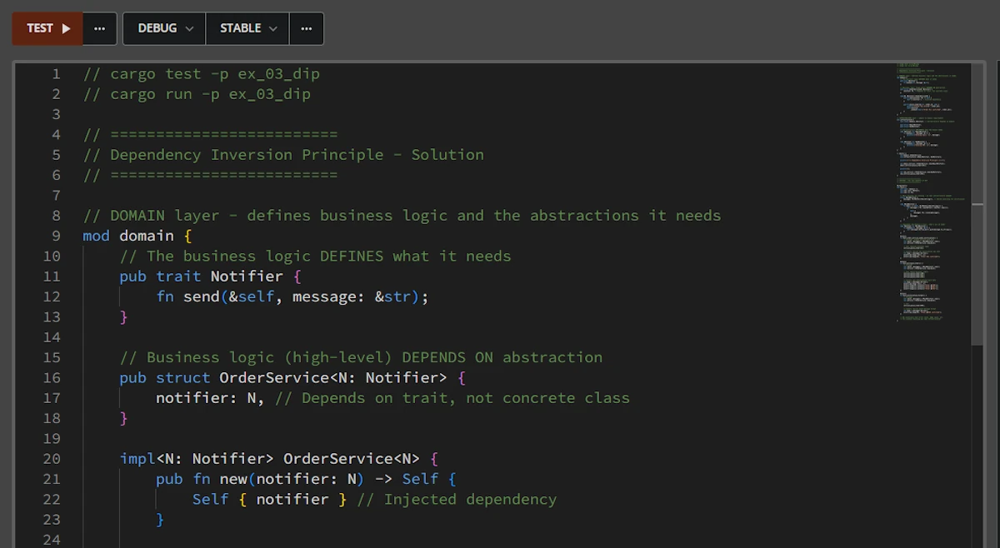
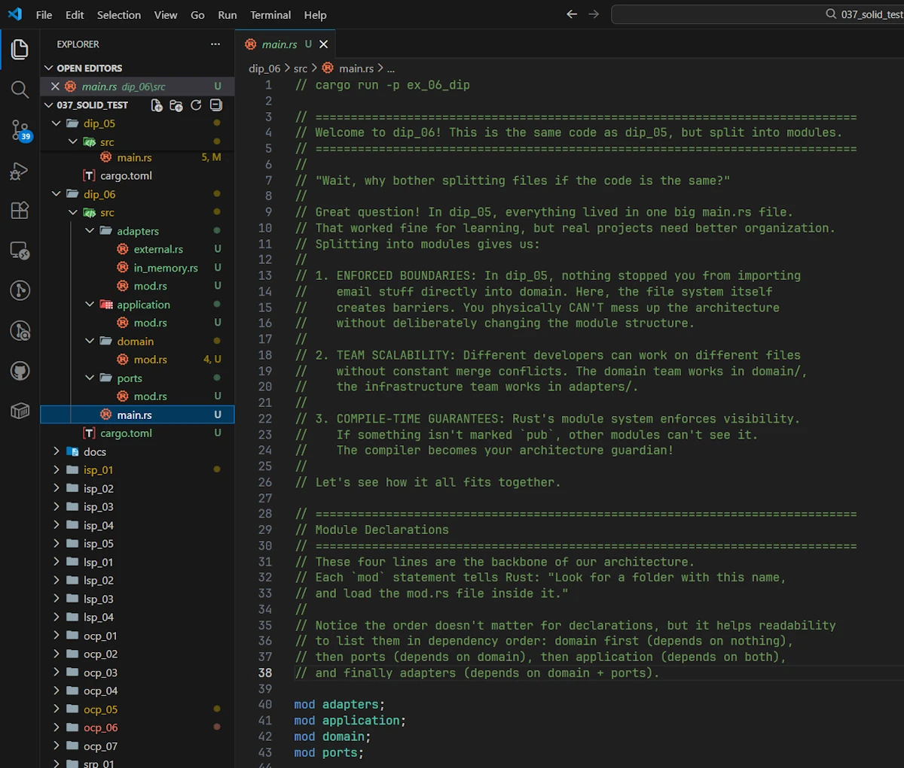
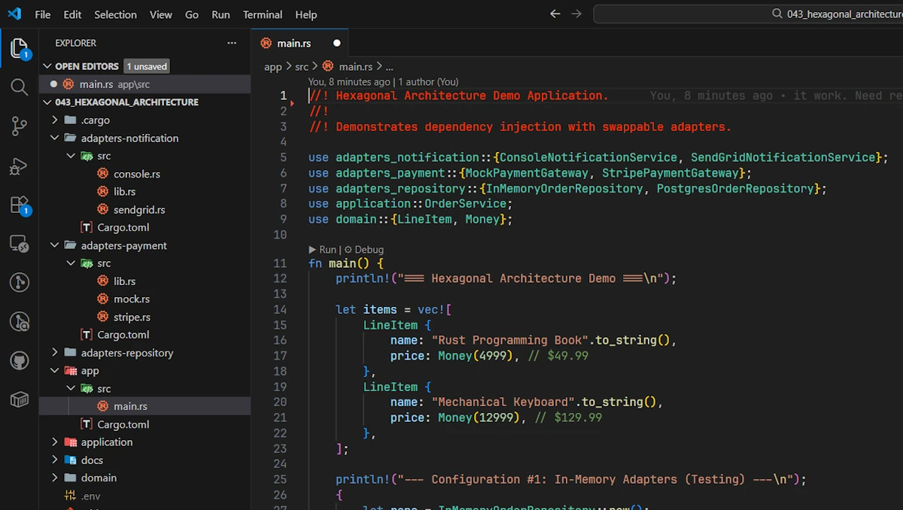

# SOLID Principles in Rust: A Practical Guide
{: .no_toc }

A gentle introduction to SOLID principles using Rust. The focus is on Dependency Inversion Principle.
{: .lead }


<!-- <h2 align="center">
<span style="color:orange"><b> 🚧 This post is under construction 🚧</b></span>
</h2> -->


<!-- ###################################################################### -->
<!-- ###################################################################### -->
<!-- ###################################################################### -->
### This is Episode 04
{: .no_toc }

#### The Posts Of The Saga
{: .no_toc }
* [Episode 00](): Introduction + Single Responsibility Principle
* [Episode 01](): Open-Closed Principle
* [Episode 02](): Liskov Substitution Principle
* [Episode 03](): Interface Segregation Principle
* [Episode 04](): Dependency Inversion Principle + Conclusion


<div align="center">
<br/>
<span>1986</span>
</div>


<!-- ###################################################################### -->
<!-- ###################################################################### -->
<!-- ###################################################################### -->
## Table of Contents
{: .no_toc .text-delta}
- TOC
{:toc}


<!-- ###################################################################### -->
<!-- ###################################################################### -->
<!-- ###################################################################### -->


## Dependency Inversion Principle (DIP)

### The Principle

> "High-level modules should not depend on low-level modules. Both should depend on abstractions."

This is the **cornerstone of Clean Architecture**. It's what allows us to build a system where:
- Business logic doesn't know about databases
- Our domain doesn't care about HTTP frameworks
- Core code doesn't depend on external libraries

In the book Database and Web are considered as "details".
<!-- The author emphasizes that the flow of data goes in the opposite direction of the dependencies, hence the name Dependency Inversion Principle. -->

In Rust terms: **our high-level business logic should depend on traits, and low-level details (I/O, databases, frameworks) should implement those traits.**


### The Problem: Direct Dependencies

Let's start with a bad implementation. You can copy and paste the code below in [Rust Playground](https://play.rust-lang.org/):

**Note:**
This part (DIP) of the saga (SOLID) is based on a previous project I did and which is [available on GitHub](https://github.com/40tude/dip_101). Don't skim over the comments. I wanted to try something different in order to train us to "**read**" the code as a story. For example the code is organized so that we start reading the `main()` function. Indeed this is where I want to write the calls like I would like to see them written. Then there are tons of comments on the tone of a dialog between 2 engineers.

**Note:**
Among others, with this set of sample code, I had lot of difficulties naming things and I did multiple test, try and errors. My apologies if among the examples, not all the object names are consistent. It has been a mess.


```rust
// cargo run -p ex_01_dip

// Bonjour. In this first example, we're going to see a common mistake.
// It works, sure, but there's a hidden problem lurking in the code.
// Let's discover it together.

// Here in main(), everything looks fine, right?
// We create an OrderService, we place an order... simple and clean.
// The caller doesn't need to know how notifications are sent.
// So far so good!
fn main() {
    use order::OrderService;

    let order_service = OrderService::new();
    order_service.place_order(101);
}

// Now let's look behind the curtain...
// This is where things get interesting.
mod order {

    // Oops! See this `use` statement?
    // Our business logic (OrderService) is importing a concrete type from infrastructure.
    // That's our first red flag: the high-level module knows about the low-level module.
    use crate::email::Sender;

    pub struct OrderService {
        // And here, we're storing an email::Sender directly.
        // What if tomorrow we want to send SMS instead? Or push notifications?
        // We'd have to come here and modify this struct. That's not great.
        email_sender: Sender,
    }

    impl OrderService {
        pub fn new() -> Self {
            Self {
                // The dependency is hardcoded right here.
                // OrderService decides by itself that it will use email::Sender.
                // No flexibility, no way to swap implementations.
                email_sender: Sender,
            }
        }

        pub fn place_order(&self, order_id: u32) {
            println!("Order #{} placed", order_id);

            // And here's another problem: we're calling .send() directly.
            // What if the email team decides to rename it to .dispatch()?
            // Our business logic breaks! And that shouldn't happen.
            // Business rules shouldn't break because of infrastructure changes.
            self.email_sender
                .send(&format!("Order #{} confirmed", order_id));
        }
    }
}

// This is our infrastructure layer - the "low-level" stuff.
// It handles the technical details of sending emails.
mod email {
    pub struct Sender;

    impl Sender {
        pub fn send(&self, message: &str) {
            println!("Sending email: {}", message);
        }

        // Imagine the email team wants to rename send() to dispatch()...
        // Go ahead, uncomment this and comment out send() above.
        // You'll see: the code in order module breaks!
        // That's the problem we'll solve in ex01.
        //
        // pub fn dispatch(&self, message: &str) {
        //     println!("Sending email: {}", message);
        // }
    }
}
```

Expected output:

```powershell
Order #101 placed
Sending email: Order #101 confirmed
```

**What's wrong?**
1. `OrderService` (which is part of our business logic) is tightly coupled to `Sender` (which is part of the infrastructure, a detail in itself according to Uncle Bob's)
2. We can't switch to SMS or Slack notifications without modifying `OrderService`
3. Testing `OrderService` requires a real `Sender` (no mocking possible)
4. The dependency arrow points **FROM** business logic **TO** infrastructure (wrong direction!)


### The Solution: Invert the Dependency

Now let's see how we can make our high-level business logic depends on traits, and the low-level details (I/O, databases, frameworks, infrastructure) implement those traits. You can copy and paste the code below in [Rust Playground](https://play.rust-lang.org/). Again, play the game and read the comments:


```rust
// cargo run -p ex_02_dip

// Alright! Now we're going to fix the problem we saw in ex_01_dip.
// The magic word? Dependency Inversion.
// Instead of business logic depending on infrastructure,
// we'll make infrastructure depend on business logic. Let's see how!

// Look at main() now. Something changed.
// We're injecting the Email service into OrderService from the outside.
// The caller decides which notification system to use!
// Want SMS tomorrow? Just pass an Sms struct instead. No changes to OrderService needed.
fn main() {
    use domain::OrderService;
    use email::Email;

    let email_service = OrderService::new(Email);
    email_service.place_order(101);
}

// This is where the magic happens.
// Notice: domain doesn't import anything from email anymore!
// The dependency arrow has been reversed.
mod domain {

    // Here's the key: we define a trait called Sender.
    // This is our "contract" - any notification system must follow this contract.
    // The business logic says: "I don't care HOW you send messages,
    // just give me something that has a send() method."
    pub trait Sender {
        fn send(&self, message: &str);
    }

    // Now OrderService is generic over S, where S must implement Sender.
    // It doesn't know if S is Email, SMS, a carrier pigeon... and it doesn't care!
    // It just knows that S can send messages. That's all it needs.
    pub struct OrderService<S: Sender> {
        sender: S,
    }

    impl<S: Sender> OrderService<S> {
        // The dependency is now injected from outside.
        // We receive the sender as a parameter - we don't create it ourselves.
        // This is called "Dependency Injection", and it goes hand in hand with DIP.
        pub fn new(sender: S) -> Self {
            Self { sender }
        }

        pub fn place_order(&self, order_id: u32) {
            println!("Order #{} placed", order_id);

            // See? We call self.sender.send() without knowing what's behind it.
            // If Email renames its internal method? We don't care!
            // As long as it implements our Sender trait, we're good.
            self.sender.send(&format!("Order #{} confirmed", order_id));
        }
    }
}

// Now look at this: email imports from domain, not the other way around!
// The dependency arrow is reversed. Infrastructure depends on business logic.
// That's exactly what "Dependency Inversion" means.
mod email {
    use crate::domain::Sender;

    pub struct Email;

    // Email adapts itself to the contract defined by domain.
    // It implements the Sender trait, promising to provide a send() method.
    // Internally, it could call dispatch(), post_message(), or whatever it wants.
    // The domain doesn't care about those details.
    impl Sender for Email {
        fn send(&self, message: &str) {
            println!("Sending by email: {}", message);
        }
    }
}

// So what did we gain?
// 1. OrderService is now testable - we can inject a mock Sender
// 2. We can swap Email for SMS without touching business logic
// 3. If Email changes its internals, domain is protected
// 4. The architecture is cleaner: high-level doesn't depend on low-level
//
// Next: see ex02 for adding SMS and other notification services!
```


Expected output:

```powershell
Order #101 placed
Sending by email: Order #101 confirmed
```


In the second source code:
1. The `domain module` defines the business logic (`OrderService`) and declares the abstraction it needs (the `Sender` trait). It doesn't know or care about
   email, SMS, or any specific implementation.
2. The `email module` contains concrete implementations (Email) that **must adapt** to the interface defined by the domain.
3. Notice the dependency direction:
   - `email` imports from domain (`use crate::domain::Sender`)
   - `domain` imports **nothing** from `email`
   - This is the "inversion": `email` depends on `domain`, not the reverse
4. The `main()` function is the **composition** root where we wire everything together.

Benefits:
- Business logic is isolated and testable
- We can add new notifiers (Slack, Push, etc.) without touching the `domain`
- Infrastructure components (email, sms...) are pluggable and interchangeable
- Easy to test with mock implementations


### Adding New Services

Adding new services becomes really easy and does not impact the `domain` module which is exactly what we want. You can copy and paste the code below in [Rust Playground](https://play.rust-lang.org/). There are very few comments so you can focus on the lines of code added.

```rust
// cargo run -p ex_03_dip
// add sms and owl services 🦉

fn main() {
    use domain::OrderService;
    use email::Email;
    // + 2 lines here
    use owl::Owl;
    use sms::Sms;

    let email_service = OrderService::new(Email);
    email_service.place_order(101);
    println!();
    let sms_service = OrderService::new(Sms);
    sms_service.place_order(42);
    println!();
    let owl_service = OrderService::new(Owl);
    owl_service.place_order(13);
}

// No change here
mod domain {
    pub trait Sender {
        fn send(&self, message: &str);
    }
    pub struct OrderService<S: Sender> {
        sender: S,
    }

    impl<S: Sender> OrderService<S> {
        pub fn new(sender: S) -> Self {
            Self { sender }
        }

        pub fn place_order(&self, order_id: u32) {
            println!("Order #{} placed", order_id);

            self.sender.send(&format!("Order #{} confirmed", order_id));
        }
    }
}

// No change here
mod email {
    use crate::domain::Sender;

    pub struct Email;

    impl Sender for Email {
        fn send(&self, message: &str) {
            println!("Sending by email: {}", message);
        }
    }
}

// +1 service here
mod sms {
    use crate::domain::Sender;
    pub struct Sms;

    impl Sender for Sms {
        fn send(&self, message: &str) {
            println!("Sending by sms: {}", message);
        }
    }
}

// +1 service here
mod owl {
    use crate::domain::Sender;
    pub struct Owl;

    impl Sender for Owl {
        fn send(&self, message: &str) {
            println!("Sending by 🦉: {}", message);
        }
    }
}
```

Expected output

```rust
Order #101 placed
Sending by email: Order #101 confirmed

Order #42 placed
Sending by sms: Order #42 confirmed

Order #13 placed
Sending by 🦉: Order #13 confirmed
```


### Testing Becomes Trivial

Thanks to DIP, we can test the business logic without any infrastructure:
- No email server needed
- No SMS gateway required
- No network calls
- Fast, reliable, isolated tests

We simply create a mock that implements the Notifier trait. You can copy and paste the code below in [Rust Playground](https://play.rust-lang.org/):

```rust
// cargo test -p ex_04_dip
// cargo run -p ex_04_dip

fn main() {
    use domain::OrderService;
    use email::Email;
    use owl::Owl;
    use sms::Sms;

    let email_service = OrderService::new(Email);
    email_service.place_order(101);
    println!();
    let sms_service = OrderService::new(Sms);
    sms_service.place_order(42);
    println!();
    let owl_service = OrderService::new(Owl);
    owl_service.place_order(13);
}

mod domain {
    pub trait Sender {
        fn send(&self, message: &str);
    }
    pub struct OrderService<S: Sender> {
        sender: S,
    }

    impl<S: Sender> OrderService<S> {
        pub fn new(sender: S) -> Self {
            Self { sender }
        }

        pub fn place_order(&self, order_id: u32) {
            println!("Order #{} placed", order_id);

            self.sender.send(&format!("Order #{} confirmed", order_id));
        }
    }
}

mod email {
    use crate::domain::Sender;

    pub struct Email;

    impl Sender for Email {
        fn send(&self, message: &str) {
            println!("Sending by email: {}", message);
        }
    }
}

mod sms {
    use crate::domain::Sender;
    pub struct Sms;

    impl Sender for Sms {
        fn send(&self, message: &str) {
            println!("Sending by sms: {}", message);
        }
    }
}

mod owl {
    use crate::domain::Sender;
    pub struct Owl;

    impl Sender for Owl {
        fn send(&self, message: &str) {
            println!("Sending by 🦉: {}", message);
        }
    }
}

#[cfg(test)]
mod tests {
    use super::domain::*;
    use std::cell::RefCell;
    use std::rc::Rc;

    // Mock sender for testing - no real infrastructure needed!
    struct MockSender {
        messages: Rc<RefCell<Vec<String>>>, // Shared ownership for verification
    }

    impl MockSender {
        fn new() -> (Self, Rc<RefCell<Vec<String>>>) {
            let messages = Rc::new(RefCell::new(Vec::new()));
            (
                Self {
                    messages: Rc::clone(&messages),
                },
                messages,
            )
        }
    }

    // Implement the domain's trait - that's all we need!
    impl Sender for MockSender {
        fn send(&self, message: &str) {
            self.messages.borrow_mut().push(message.to_string());
        }
    }

    #[test]
    fn test_order_service_sends_notification() {
        // Arrange: Create service with mock
        let (mock, messages) = MockSender::new();
        let service = OrderService::new(mock);

        // Act: Execute business logic
        service.place_order(42);

        // Assert: Verify the notification was sent
        let msgs = messages.borrow();
        assert_eq!(msgs.len(), 1);
        assert_eq!(msgs[0], "Order #42 confirmed");
    }

    #[test]
    fn test_multiple_orders() {
        // Arrange
        let (mock, messages) = MockSender::new();
        let service = OrderService::new(mock);

        // Act: Place multiple orders
        service.place_order(100);
        service.place_order(101);
        service.place_order(102);

        // Assert: All notifications were sent
        let msgs = messages.borrow();
        assert_eq!(msgs.len(), 3);
        assert!(msgs[0].contains("Order #100"));
        assert!(msgs[1].contains("Order #101"));
        assert!(msgs[2].contains("Order #102"));
    }

    #[test]
    fn test_notification_format() {
        // Arrange
        let (mock, messages) = MockSender::new();
        let service = OrderService::new(mock);

        // Act
        service.place_order(999);

        // Assert: Verify exact message format
        let msgs = messages.borrow();
        assert_eq!(msgs[0], "Order #999 confirmed");
    }

    // We could also test error cases, edge cases, etc.
    // All without touching any real infrastructure!
}
```

In Rust Playground, use the Test button on the left hand side.

<div align="center">
<br/>
<span>Running tests in Rust Playground</span>
</div>


Expected output:

```powershell
running 3 tests
test tests::test_multiple_orders ... ok
test tests::test_order_service_sends_notification ... ok
test tests::test_notification_format ... ok

test result: ok. 3 passed; 0 failed; 0 ignored; 0 measured; 0 filtered out; finished in 0.00s
```


Key benefits :

1. Fast tests: No network, no I/O, no delays
   - Tests run in milliseconds, not seconds
2. Reliables tests: No flaky external dependencies
   - No "email server down" failures
   - No network timeouts
   - 100% deterministic
3. Isolated tests: Focus on business logic only
   - Test what the service **DOES**, not **HOW** it sends notifications
   - Infrastructure bugs don't break domain tests
4. Easy to write: Simple mock, implements one trait
   - No complex mocking framework needed
   - Clear and readable test code

Let's compare this to the very first example where `OrderService` depends on `Sender`:
- We would need a real email server or complex mocking
- Tests would be slow and potentially flaky
- Hard to test edge cases
- Coupling business logic tests to infrastructure details


### Real-World: Hexagonal Architecture

DIP is the foundation of **Hexagonal Architecture** (also called Ports & Adapters), a pattern that keeps our business logic completely independent from external systems.

**The key insight**: Our business logic shouldn't know whether it's using PostgreSQL or MongoDB, Stripe or PayPal, SendGrid or AWS SES. It should only know "I need to store orders" or "I need to process payments".

Here's how it works:

1. **Domain (Core):** Pure business logic with zero dependencies on frameworks or external systems
2. **Ports (Abstractions):** Traits that define what the domain needs (defined by the domain, not imposed on it)
3. **Adapters (Infrastructure):** Concrete implementations that plug into the ports

Think of it like a smartphone: the core device defines the ports it needs (USB-C, Lightning), and different adapters can plug in (chargers, headphones, external drives). The phone doesn't care which adapter are used, as long as it implements the correct interface.

Let's see this in action with a simplified order processing system. You can copy and paste the code below in [Rust Playground](https://play.rust-lang.org/).


**Note:**
This is where the "can run in Rust Playground" + "Comments in source code" approach reaches a limit. I realize the code below is way too looooong. But this is the last sample code of the saga and again I did my best to make the reading enjoyable. Please read the comments.

```rust
// cargo run -p ex_05_dip

// Welcome back! In ex_02_dip, we saw how to invert dependencies using a trait.
// We had one trait (Sender) and one adapter (Email). Simple and clean.
// But real applications are more complex. They need databases, payment systems,
// notification services... How do we scale DIP to handle all of that?
//
// The answer: Hexagonal Architecture, also known as "Ports & Adapters".
// Don't let the fancy name scare you. It's just DIP applied systematically.
// Let's break it down together.

// =============================================================================
// DOMAIN Layer - The Heart of our Application
// =============================================================================
// Remember in ex_02_dip, domain contained both our business entity (OrderService)
// AND our abstraction (the Sender trait)?
//
// In Hexagonal, we split things more carefully. The domain module becomes
// purely about business concepts: What is an Order? What is Money?
// No traits here: just the core vocabulary of our business.
mod domain {
    use std::fmt;

    // These are "Value Objects": they represent business concepts.
    // OrderId isn't just a u32, it's a meaningful business identifier.
    // This makes our code speak the language of the business.
    #[derive(Debug, Clone, Copy, PartialEq, Eq, Hash)]
    pub struct OrderId(pub u32);

    #[derive(Debug, Clone, Copy)]
    pub struct Money(pub u32); // cents

    #[derive(Debug, Clone)]
    pub struct LineItem {
        pub name: String,
        pub price: Money,
    }

    // Our Order entity: this is pure business logic.
    // Notice: no database stuff, no HTTP, no external dependencies.
    // Just: "What IS an order?"
    #[derive(Debug, Clone)]
    pub struct Order {
        pub id: OrderId,
        pub items: Vec<LineItem>,
        pub total: Money,
    }

    // Business errors: things that can go wrong in our domain.
    #[derive(Debug)]
    pub enum OrderError {
        InvalidOrder,
        PaymentFailed,
        StorageFailed,
        NotificationFailed,
    }

    impl fmt::Display for OrderError {
        fn fmt(&self, f: &mut fmt::Formatter) -> fmt::Result {
            write!(f, "{:?}", self)
        }
    }

    // Business rule: an order must have at least one item.
    // This validation lives in the domain: it's a business rule,
    // not a database constraint or an API validation.
    impl Order {
        pub fn new(id: OrderId, items: Vec<LineItem>) -> Result<Self, OrderError> {
            if items.is_empty() {
                return Err(OrderError::InvalidOrder);
            }

            let total = Money(items.iter().map(|item| item.price.0).sum());

            Ok(Order { id, items, total })
        }
    }
}

// =============================================================================
// PORTS - The Boundaries of Our Domain
// =============================================================================
// Here's where it gets interesting. Remember the Sender trait from ex_02_dip?
// It was our way of saying: "I need to send messages, but I don't care how."
//
// In Hexagonal, we call these abstractions "Ports". They're the plugs
// where external systems connect to our application.
//
// Why a separate module? Because ports are contracts. They belong to the domain
// conceptually (the domain DEFINES what it needs), but separating them makes
// the architecture crystal clear: domain = business concepts, ports = boundaries.
mod ports {
    use crate::domain::*;

    // Output port: "I need to store orders somewhere"
    // Could be PostgreSQL, MongoDB, a file, Redis... domain doesn't care.
    pub trait OrderRepository {
        fn save(&mut self, order: &Order) -> Result<(), OrderError>;
        fn find(&self, id: OrderId) -> Result<Option<Order>, OrderError>;
    }

    // Output port: "I need to charge customers"
    // Could be Stripe, PayPal, a mock for testing... domain doesn't care.
    pub trait PaymentGateway {
        fn charge(&self, amount: Money) -> Result<(), OrderError>;
    }

    // Output port: "I need to notify customers"
    // Hey, look! It's our old friend Sender from ex_02_dip.
    // Same concept, just living in a dedicated "ports" module now.
    // Could be Email, SMS, push notifications, carrier pigeon...
    pub trait Sender {
        fn send(&self, order: &Order) -> Result<(), OrderError>;
    }
}

// =============================================================================
// APPLICATION Layer - The Orchestrator
// =============================================================================
// In ex_02_dip, OrderService was in the domain module.
// Here, we move it to a separate "application" layer. Why?
//
// Because OrderService doesn't define business rules: it ORCHESTRATES them.
// It's the conductor: "First charge the payment, then save the order,
// then send a notification." That's coordination, not business logic.
//
// This separation helps when our app grows: domain stays focused on
// "what things ARE", application handles "what happens when".
mod application {
    use crate::domain::*;
    use crate::ports::*;

    // Look familiar? It's our OrderService, but now with THREE dependencies!
    // In ex_02_dip, we had: OrderService<S: Sender>
    // ! Now we have: OrderService<R: OrderRepository, P: PaymentGateway, N: Sender>
    //
    // Same principle, just more ports. Each one is a plug where we can
    // connect different adapters.
    pub struct OrderService<'a, R, P, N>
    where
        R: OrderRepository,
        P: PaymentGateway,
        N: Sender,
    {
        repository: &'a mut R,
        payment: &'a P,
        sender: &'a N,
        next_id: u32,
    }

    impl<'a, R, P, N> OrderService<'a, R, P, N>
    where
        R: OrderRepository,
        P: PaymentGateway,
        N: Sender,
    {
        // Dependency Injection: same as ex_02_dip, just with more dependencies.
        // The caller decides which implementations to use.
        pub fn new(repository: &'a mut R, payment: &'a P, sender: &'a N) -> Self {
            Self {
                repository,
                payment,
                sender,
                next_id: 1,
            }
        }

        // This is the "use case": what happens when a customer places an order.
        // Notice: we only talk to abstractions (traits), never to concrete types.
        // We don't know if we're using Postgres or an in-memory HashMap.
        // We don't know if we're charging via Stripe or a mock.
        // And that's exactly the point!
        pub fn place_order(&mut self, items: Vec<LineItem>) -> Result<Order, OrderError> {
            let order_id = OrderId(self.next_id);
            self.next_id += 1;

            // Pure business logic: create the order
            let order = Order::new(order_id, items)?;

            // Orchestration: coordinate the external systems
            // Each of these calls goes through a port (trait)
            self.payment.charge(order.total)?;
            self.repository.save(&order)?;
            self.sender.send(&order)?;

            Ok(order)
        }

        pub fn get_order(&self, id: OrderId) -> Result<Option<Order>, OrderError> {
            self.repository.find(id)
        }
    }
}

// =============================================================================
// ADAPTERS - The Implementations
// =============================================================================
// Now for the fun part: Adapters!
// These are the concrete implementations that plug into our ports.
//
// In ex_02_dip, Email was our adapter: it implemented the Sender trait.
// Here, we have multiple adapters for each port.
//
// Key insight: adapters depend on ports, not the other way around.
// The dependency arrow points INWARD, toward the domain. That's DIP in action!

// --- Adapter Set #1: In-Memory (for testing and development) ---
mod in_memory_adapters {
    use crate::domain::*;
    use crate::ports::*;
    use std::collections::HashMap;

    // A simple HashMap-based repository.
    // Perfect for unit tests: no database needed!
    pub struct InMemoryOrderRepository {
        orders: HashMap<OrderId, Order>,
    }

    impl InMemoryOrderRepository {
        pub fn new() -> Self {
            Self {
                orders: HashMap::new(),
            }
        }
    }

    // It implements the OrderRepository port.
    // The application layer doesn't know (or care) that this is a HashMap.
    impl OrderRepository for InMemoryOrderRepository {
        fn save(&mut self, order: &Order) -> Result<(), OrderError> {
            println!("  [InMemory] Saving order #{:?}", order.id);
            self.orders.insert(order.id, order.clone());
            Ok(())
        }

        fn find(&self, id: OrderId) -> Result<Option<Order>, OrderError> {
            println!("  [InMemory] Finding order #{:?}", id);
            Ok(self.orders.get(&id).cloned())
        }
    }

    // A mock payment gateway: always succeeds.
    // Great for testing the happy path!
    pub struct MockPaymentGateway;

    impl PaymentGateway for MockPaymentGateway {
        fn charge(&self, amount: Money) -> Result<(), OrderError> {
            println!(
                "  [Mock] Charging ${}.{:02}",
                amount.0 / 100,
                amount.0 % 100
            );
            Ok(())
        }
    }

    // Console-based notification: just prints to stdout.
    // Remember Email from ex_02_dip? Same idea, different output.
    pub struct ConsoleSender;

    impl Sender for ConsoleSender {
        fn send(&self, order: &Order) -> Result<(), OrderError> {
            println!(
                "  [Console] Order #{:?} confirmed! Total: ${}.{:02}",
                order.id,
                order.total.0 / 100,
                order.total.0 % 100
            );
            Ok(())
        }
    }
}

// --- Adapter Set #2: External Services (for production) ---
// Same ports, completely different implementations.
// If we swap these and our application works with real services!
mod external_adapters {
    use crate::domain::*;
    use crate::ports::*;
    use std::collections::HashMap;

    // A "simulated" PostgreSQL adapter.
    // In real life, this would use sqlx, diesel, or similar.
    pub struct PostgresOrderRepository {
        simulated_db: HashMap<OrderId, Order>,
    }

    impl PostgresOrderRepository {
        pub fn new() -> Self {
            Self {
                simulated_db: HashMap::new(),
            }
        }
    }

    impl OrderRepository for PostgresOrderRepository {
        fn save(&mut self, order: &Order) -> Result<(), OrderError> {
            println!(
                "  [Postgres] INSERT INTO orders VALUES ({:?}, ...)",
                order.id
            );
            self.simulated_db.insert(order.id, order.clone());
            Ok(())
        }

        fn find(&self, id: OrderId) -> Result<Option<Order>, OrderError> {
            println!("  [Postgres] SELECT * FROM orders WHERE id = {:?}", id);
            Ok(self.simulated_db.get(&id).cloned())
        }
    }

    // A "simulated" Stripe adapter.
    // In real life, this would call the Stripe API.
    pub struct StripePaymentGateway;

    impl PaymentGateway for StripePaymentGateway {
        fn charge(&self, amount: Money) -> Result<(), OrderError> {
            println!(
                "  [Stripe API] POST /charges amount=${}.{:02}",
                amount.0 / 100,
                amount.0 % 100
            );
            Ok(())
        }
    }

    // A "simulated" SendGrid adapter for sending emails.
    // Same Sender trait as ConsoleSender, but talks to an email API.
    pub struct SendGridSender;

    impl Sender for SendGridSender {
        fn send(&self, order: &Order) -> Result<(), OrderError> {
            println!(
                "  [SendGrid API] Sending email: 'Order #{:?} Confirmed'",
                order.id
            );
            Ok(())
        }
    }
}

// =============================================================================
// MAIN - Putting It All Together
// =============================================================================
// Here's where the magic happens. Same OrderService, different adapters.
// We can switch from "test mode" to "production mode" just by swapping adapters.
// No changes to business logic. No changes to the application layer.
// That's the power of Hexagonal Architecture!
fn main() {
    use application::OrderService;
    use domain::{LineItem, Money, OrderId};
    use external_adapters::*;
    use in_memory_adapters::*;

    println!("=== Hexagonal Architecture Demo ===\n");

    // Some test data
    let items = vec![
        LineItem {
            name: "Rust Programming Book".to_string(),
            price: Money(4999), // $49.99
        },
        LineItem {
            name: "Mechanical Keyboard".to_string(),
            price: Money(12999), // $129.99
        },
    ];

    // --- Configuration #1: In-Memory Adapters ---
    // Perfect for testing! No external dependencies needed.
    // In ex_02_dip, this is like injecting a MockSender.
    // Here, we inject mocks for ALL our ports.
    println!("--- Configuration #1: In-Memory Adapters (Testing) ---\n");
    {
        let mut repo = InMemoryOrderRepository::new();
        let payment = MockPaymentGateway;
        let sender = ConsoleSender;

        // Same OrderService, test adapters
        let mut service = OrderService::new(&mut repo, &payment, &sender);

        match service.place_order(items.clone()) {
            Ok(order) => println!("\n  Success! Order {:?} placed.\n", order.id),
            Err(e) => println!("\n  Error: {}\n", e),
        }
    }

    // --- Configuration #2: External Services ---
    // Ready for production! Real database, real payment, real emails.
    // Notice: we didn't change a single line in OrderService or domain.
    // We just plugged in different adapters. That's DIP at scale!
    println!("--- Configuration #2: External Services (Production) ---\n");
    {
        let mut repo = PostgresOrderRepository::new();
        let payment = StripePaymentGateway;
        let sender = SendGridSender;

        // Same OrderService, production adapters
        let mut service = OrderService::new(&mut repo, &payment, &sender);

        match service.place_order(items.clone()) {
            Ok(order) => {
                println!("\n  Success! Order {:?} placed.", order.id);

                // Let's also test retrieval
                println!();
                if let Ok(Some(retrieved)) = service.get_order(order.id) {
                    println!(
                        "  Retrieved: {} items, total ${}.{:02}\n",
                        retrieved.items.len(),
                        retrieved.total.0 / 100,
                        retrieved.total.0 % 100
                    );
                }
            }
            Err(e) => println!("\n  Error: {}\n", e),
        }
    }
}

// =============================================================================
// So What Did We Learn?
// =============================================================================
//
// In dip_01, we had a problem: tight coupling.
// In ex_02_dip, we solved it with a trait and dependency injection.
// In dip_05, we scaled that solution to a real application architecture.
//
// Hexagonal Architecture is just DIP applied consistently:
// - Domain defines WHAT the business needs (via ports/traits)
// - Adapters provide HOW to fulfill those needs
// - Dependencies always point inward, toward the domain
//
// Benefits:
// 1. Testability: swap real services for mocks in tests
// 2. Flexibility: change databases or APIs without touching business logic
// 3. Clarity: each layer has a clear responsibility
// 4. Maintainability: changes are isolated to specific adapters
//
// The hexagon shape? It's just a visual metaphor. The domain is in the center,
// and adapters connect to it from the outside. Simple as that!
```


Expected output:

```text
=== Hexagonal Architecture Demo ===

--- Configuration #1: In-Memory Adapters (Testing) ---

  [Mock] Charging $179.98
  [InMemory] Saving order #OrderId(1)
  [Console] Order #OrderId(1) confirmed! Total: $179.98

  Success! Order OrderId(1) placed.

--- Configuration #2: External Services (Production) ---

  [Stripe API] POST /charges amount=$179.98
  [Postgres] INSERT INTO orders VALUES (OrderId(1), ...)
  [SendGrid API] Sending email: 'Order #OrderId(1) Confirmed'

  Success! Order OrderId(1) placed.

  [Postgres] SELECT * FROM orders WHERE id = OrderId(1)
  Retrieved: 2 items, total $179.98
```


The benefits of this architecture:

1. **Zero coupling to infrastructure:** The `OrderService` has no idea whether it's using PostgreSQL or MongoDB, Stripe or PayPal, SendGrid or AWS SES. It only knows the abstractions (traits).

2. **Swap implementations instantly:** Want to switch from Postgres to MongoDB? Write a `MongoOrderRepository` that implements `OrderRepository`. Want to test without hitting real APIs? Use mock implementations. The domain code never changes.

3. **Business logic stays pure:** Look at `OrderService::place_order()`. It's just business rules. No SQL queries, no HTTP calls, no JSON parsing. This makes it easy to understand, test, and maintain.

4. **Dependencies flow inward:** Infrastructure (adapters) depends on domain (ports), not the other way around. This is DIP in action:
   - `PostgresOrderRepository` depends on `OrderRepository` trait (defined in domain)
   - `StripePaymentGateway` depends on `PaymentGateway` trait (defined in domain)
   - Domain depends on... nothing.

5. **Testing becomes trivial:** We can test our business logic with simple in-memory implementations (like we did before). No need for test databases, API mocks, or complex setup.

This is why Hexagonal Architecture is so powerful in real-world applications: **our business logic is completely isolated and protected from the chaos of external systems**. When Stripe changes their API, we only touch the `StripePaymentGateway` adapter. When we migrate from Postgres to MongoDB, we only write a new `MongoOrderRepository`. The core of our application - the business logic - remains stable and unchanged.

**Real-world impact**: At scale, this means our core domain can live for years while adapters come and go. You can refactor infrastructure, switch cloud providers, or adopt new technologies without rewriting your business logic.


**Note:**

In the [solid_test repository](https://github.com/40tude/solid_test) on GitHub the [dip_06](https://github.com/40tude/solid_test/tree/main/dip_06/src) workspace contains a modularized version of the previous sample code. Since we cannot have workspaces in workspace, in this version the different components are distributed among sub directories (adapters, application, domain, port). For example, adapters are split in two groups : in_memory and external.

<div align="center">
<br/>
<!-- <span>Optional comment</span> -->
</div>


**Note:**

A last version of the same code is available in the [hexagonal architecture](https://github.com/40tude/hexagonal_architecture) repo on GitHub. In this project components are in their respective workspace. The project include testing, a readme file. Looks much more like what we should do in real life.

The output in the console are exactly the same. However, in this version, the components are organized by their type: `adapters-notification`, `adapters-payment`...

<div align="center">
<br/>
<!-- <span>Optional comment</span> -->
</div>


### Rust-Specific Notes

1. **Generic vs Trait Objects**:
   ```rust
   // Generic: monomorphization, zero-cost, compile-time
   pub struct Service<R: Repository> { repo: R }

   // Trait object: dynamic dispatch, runtime flexibility
   pub struct Service { repo: Box<dyn Repository> }
   ```
   Use generics for performance-critical code, trait objects when we need runtime polymorphism.

2. **Crate Organization**:
   ```
   my-app/
     domain/          (no dependencies - pure Rust)
       Cargo.toml     (no external crates)
       src/
         lib.rs
     application/     (depends on domain)
       Cargo.toml     (depends on domain crate)
       src/
         lib.rs
     adapters/        (depends on domain)
       Cargo.toml     (depends on domain, postgres, http, etc.)
       src/
         postgres.rs
         http.rs
   ```

3. **Dependency direction**:
   - Domain crate: zero dependencies
   - Application crate: depends on domain
   - Adapters crate: depends on domain (NOT on application)
   - Main binary: depends on all, wires them together

4. **The "one binary" concern**: Even though Rust compiles to one binary, the crate structure enforces dependency direction at compile time. We **cannot** accidentally import `postgres` in our domain crate if domain doesn't list it in `Cargo.toml`.


### When to Apply the Dependency Inversion Principle (DIP)?

Context: It is 8:05 AM. Double espresso. Thank God it’s Friday, but the week is not over yet. You want to test your code, but everything depends on concrete details.

**The question to ask:** *"Does my high-level logic depend on details, or do details depend on my logic?"*

* If business rules directly depend on frameworks, databases, or external services, DIP is likely violated.
* The Dependency Inversion Principle is not about abstractions everywhere, but about **protecting policy from implementation details**.
* The Dependency Inversion Principle is a thinking tool that helps us say: *"My core logic should not know how the outside world works."*


<!-- ###################################################################### -->
<!-- ###################################################################### -->
<!-- ###################################################################### -->

## Conclusion: SOLID in Rust Context

<div align="center">
<br/>
<span>Let's avoid building this</span>
</div>

### Key Takeaways

1. **Single Responsibility Principle**: Separate code by the actors that change it. In Rust, this often means separate modules or structs, not cramming everything into methods on one type.
2. **Open-Closed Principle**: Use traits for extension points. Rust's trait system + enums + pattern matching give we powerful tools for open-closed designs.
3. **LSP**: Make sure our trait implementations honor the contract. Rust's type system catches many violations, but we still need to ensure semantic correctness.
4. **ISP**: Don't create god traits. Split them into focused, cohesive interfaces that clients can compose as needed.
5. **DIP**: Depend on traits (abstractions), not concrete types. Structure our crates so high-level business logic doesn't depend on low-level infrastructure.


### SOLID != Architecture

Remember: Uncle Bob is clear that SOLID is about the **mid-level** (modules, classes, functions). It's not the whole story:

- **Component principles** (coming in Part 4 of Clean Architecture) deal with how to organize crates and manage coupling between them
- **Architecture** (Part 5) deals with the big picture: layers, boundaries, the Dependency Rule

SOLID is the **foundation**. Get these principles right at the class/module level, and we'll have solid components. Get solid components, and we can build solid architectures.


### Rust Makes SOLID Easier (Mostly)

Rust's design actually encourages many SOLID principles:

- **Ownership** forces we to think about responsibilities
- **Traits** make abstraction natural
- **Type system** catches interface violations
- **Module system** encourages separation
- **No inheritance** means we can't violate LSP through deep hierarchies

The one challenge: Rust's explicitness can make DIP feel verbose (lots of generics, trait bounds). But that's actually a feature - the compiler is making dependencies explicit and checking them at compile time.


### Next Steps

* **Practice**: Let's refactor some of our own code using these principles. Let's start simple, with one principle at a time.
* Read the rest of the book Clean Architecture:
    * **Part 4 (Component Principles)**: Learn about organizing crates, managing coupling between components
    * **Part 5 (Architecture)**: The big picture - layers, boundaries, the famous Dependency Rule

We should remember these are **principles**, not rules. There are times when violating them is the pragmatic choice. The key is to **know** we're violating them and why.

Now let's write cleaner Rust! 🦀


<!-- ###################################################################### -->
<!-- ###################################################################### -->
<!-- ###################################################################### -->
## References & Further Reading

- [Clean Architecture](https://amzn.eu/d/9CJWwcy) by Robert C. Martin - the source material
- [serodriguez68/clean-architecture](https://github.com/serodriguez68/clean-architecture) - detailed summary of the book
- [Rust's trait system](https://doc.rust-lang.org/book/ch10-02-traits.html)
- [Hexagonal Architecture](https://alistair.cockburn.us/hexagonal-architecture/)
<!-- - [Rust is not a faster horse](https://www.youtube.com/watch?v=4YU_r70yGjQ) - Understanding how Rust's paradigm differs from OOP -->
- The code of the posts is available in the [solid_test repo on GitHub](https://github.com/40tude/solid_test)
- The dedicated repo for the modularized version of the [hexagonal architecture](https://github.com/40tude/hexagonal_architecture).
- The [Coffee Shop Order System](https://github.com/40tude/coffee-shop-solid) companion project on GitHub.


<div align="center">
<br/>
<!-- <span>1984</span> -->
</div>


<!--
## Appendix: Quick Reference Card

```rust
// Single Responsibility Principle: One reason to change
struct Employee { /* data */ }
struct PayrollCalculator; // Accounting's responsibility
struct EmployeeRepository; // DBA's responsibility

// Open-Closed Principle: Open for extension, closed for modification
trait ReportFormatter { fn format(&self) -> String; }
struct PdfFormatter;
impl ReportFormatter for PdfFormatter { /* ... */ }

// LSP: Substitutable implementations
trait Storage {
    fn get(&self, key: &str) -> Result<Option<String>, Error>;
}
// All impls must handle errors consistently

// ISP: Focused traits
trait Readable { fn read(&self) -> &str; }
trait Writable { fn write(&mut self, data: &str); }
// Not: trait Document { fn read(); fn write(); fn everything(); }

// DIP: Depend on abstractions
struct Service<R: Repository> { repo: R }
// Not: struct Service { repo: PostgresRepo }
```
-->


## Next Step
{: .no_toc }

* [Episode 00](): Introduction + Single Responsibility Principle
* [Episode 01](): Open-Closed Principle
* [Episode 02](): Liskov Substitution Principle
* [Episode 03](): Interface Segregation Principle
* [Episode 04](): Dependency Inversion Principle + Conclusion
